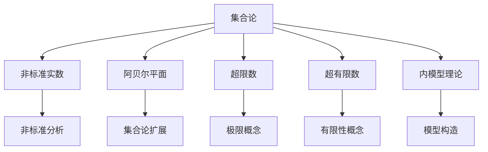
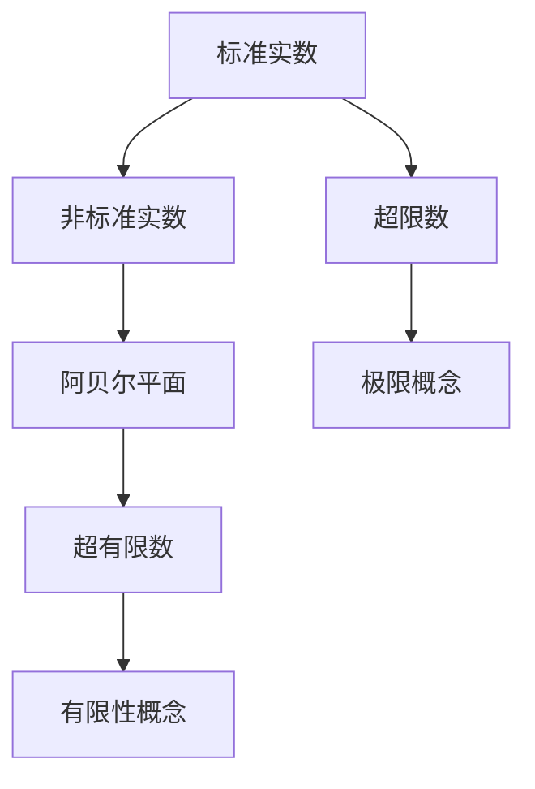
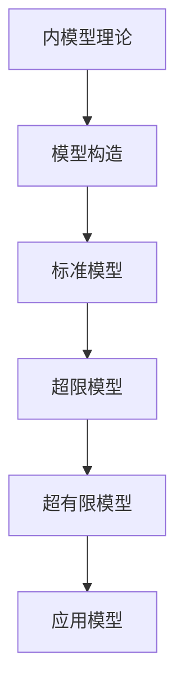
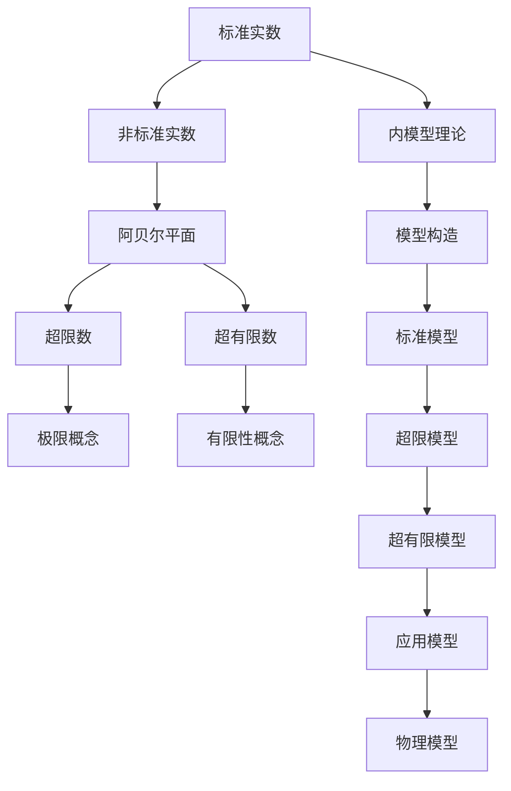

                 

# 集合论导引：非标准实数直线

> 关键词：集合论,非标准实数,阿贝尔平面,非标准分析,极限概念

## 1. 背景介绍

### 1.1 问题由来
集合论是现代数学的重要基础，尤其是其对非标准实数的探讨，为数学和理论物理等领域带来了深刻的影响。在标准实数体系中，每一点都对应一个唯一的实数，使得整个实数直线连续无间断。然而，这种连续性在物理和计算中有时并不是必须的。为了更好地处理物理和计算中的不连续性，数学家们引入了一种称为非标准实数（Nonstandard Real Numbers）的概念。这些非标准实数构成了所谓的阿贝尔平面（Abel Plane），其中每个点不一定与标准实数直线上的点一一对应。

### 1.2 问题核心关键点
非标准实数直线上的集合论研究，涉及到对标准实数直线的扩展，以及新的极限概念和运算规则的引入。这种扩展使得我们可以在非连续和不完整的环境中应用集合论，这对于处理物理量（如时间、空间、能量）的无限小和无限大等情况，提供了强有力的工具。然而，这种扩展也带来了新的挑战，如超限数（Ultrafilters）和超有限数（Hyperfinite Numbers）等概念的引入，需要我们重新审视经典集合论的基本理论。

### 1.3 问题研究意义
研究非标准实数直线上的集合论，不仅有助于理解和应用非标准分析，还能推动物理、计算和数学的交叉研究，促进新理论和新模型的发展。此外，这种研究还能揭示数学和物理世界中的新现象，推动基础科学的研究。

## 2. 核心概念与联系

### 2.1 核心概念概述

为更好地理解非标准实数直线上的集合论，本节将介绍几个密切相关的核心概念：

- 集合论（Set Theory）：研究集合的基本性质、运算及其相互关系，是数学基础理论的核心部分。
- 非标准实数（Nonstandard Real Numbers）：在标准实数的基础上，引入超限数（如超限整数、超限实数）等概念，构建一种更加广泛和灵活的实数体系。
- 阿贝尔平面（Abel Plane）：由非标准实数构成的平面，其中每个点不一定与标准实数直线上的点一一对应。
- 超限数（Ultrafilters）：一种特殊的集合，用于刻画非标准实数直线上极限点的不连续性。
- 超有限数（Hyperfinite Numbers）：一种特殊的有限集合，用于刻画非标准实数直线上极限点的有限性。
- 内模型理论（Inner Model Theory）：研究非标准实数直线上集合论模型的性质和构造，是研究非标准实数直线集合论的重要工具。

这些核心概念之间的逻辑关系可以通过以下Mermaid流程图来展示：



这个流程图展示了大语言模型微调过程中各个核心概念的关系和作用：

1. 集合论通过引入非标准实数和扩展阿贝尔平面，为我们提供了一种新的集合研究视角。
2. 非标准实数直线上的极限概念和运算规则，为处理不连续性和无限性问题提供了新的数学工具。
3. 超限数和超有限数的概念，进一步刻画了非标准实数直线上集合的行为和性质。
4. 内模型理论提供了构造非标准实数直线集合论模型的工具，有助于理解其数学基础。

这些概念共同构成了非标准实数直线集合论的完整生态系统，为处理物理和计算中的不连续性和无限性问题提供了强有力的工具。

### 2.2 概念间的关系

这些核心概念之间存在着紧密的联系，形成了非标准实数直线集合论的整体架构。下面我们通过几个Mermaid流程图来展示这些概念之间的关系。

#### 2.2.1 集合论的扩展



这个流程图展示了集合论扩展的基本过程：
1. 从标准实数出发，引入非标准实数。
2. 通过非标准实数，扩展到阿贝尔平面。
3. 在阿贝尔平面上，定义超限数和超有限数。
4. 引入极限概念和有限性概念，刻画非标准实数直线的性质。

#### 2.2.2 内模型理论的应用



这个流程图展示了内模型理论在非标准实数直线集合论中的应用：
1. 内模型理论提供了一种构造非标准实数直线集合论模型的工具。
2. 通过构造标准模型、超限模型和超有限模型，研究非标准实数直线的性质。
3. 将模型应用于具体的物理和计算问题，解决不连续性和无限性问题。

#### 2.2.3 非标准分析的基本逻辑


这个流程图展示了非标准分析的基本逻辑：
1. 从标准分析出发，引入非标准分析。
2. 扩展极限概念，用于处理非标准实数直线的极限问题。
3. 通过内模型构造，解决非标准实数直线的极限问题。
4. 将内模型应用于物理和计算问题，解决不连续性和无限性问题。

### 2.3 核心概念的整体架构

最后，我们用一个综合的流程图来展示这些核心概念在大语言模型微调过程中的整体架构：



这个综合流程图展示了从标准实数到非标准实数直线集合论的整体过程。从标准实数出发，引入非标准实数和扩展阿贝尔平面。在阿贝尔平面上，定义超限数和超有限数，并引入极限概念和有限性概念。通过内模型理论，构造标准模型、超限模型和超有限模型，解决非标准实数直线的极限问题。最终，将内模型应用于物理和计算问题，解决不连续性和无限性问题。通过这些流程图，我们可以更清晰地理解非标准实数直线集合论的整体结构及其核心概念的作用。

## 3. 核心算法原理 & 具体操作步骤
### 3.1 算法原理概述

非标准实数直线上的集合论研究，涉及到对标准实数直线的扩展，以及新的极限概念和运算规则的引入。其核心思想是：通过引入超限数和超有限数，对标准实数直线进行扩展，从而在非连续和不完整的环境中应用集合论。

形式化地，假设非标准实数直线上的集合为 $S$，其中每个元素 $s \in S$ 都对应一个标准实数 $s^* \in \mathbb{R}$。定义 $S$ 的超限数为 $\widehat{S}$，超有限数为 $\widehat{S}_f$，则 $S$ 的扩展定义为 $S_{ext} = \widehat{S} \cup \widehat{S}_f$。在扩展后的集合 $S_{ext}$ 上，重新定义集合运算，如并、交、补等，以满足非标准实数直线的性质。

### 3.2 算法步骤详解

非标准实数直线上的集合论研究，一般包括以下几个关键步骤：

**Step 1: 准备非标准实数集合**
- 确定非标准实数直线上集合 $S$ 的元素，每个元素 $s \in S$ 都对应一个标准实数 $s^* \in \mathbb{R}$。
- 定义 $S$ 的超限数 $\widehat{S}$ 和超有限数 $\widehat{S}_f$，计算 $S$ 的扩展 $S_{ext} = \widehat{S} \cup \widehat{S}_f$。

**Step 2: 定义新的集合运算**
- 在扩展后的集合 $S_{ext}$ 上，重新定义并、交、补等集合运算，以满足非标准实数直线的性质。
- 对于并运算，定义 $A \cup B = \{s \in S_{ext} | s \in A \text{ or } s \in B\}$。
- 对于交运算，定义 $A \cap B = \{s \in S_{ext} | s \in A \text{ and } s \in B\}$。
- 对于补运算，定义 $A^c = \{s \in S_{ext} | s \notin A\}$。

**Step 3: 计算极限和收敛**
- 定义 $S$ 上的极限概念，即 $lim_{x \rightarrow s} f(x) = l$，其中 $f(x)$ 为 $S$ 上的连续函数，$x$ 为 $S$ 上的点，$l$ 为标准实数。
- 计算极限时，需要考虑极限点 $s$ 的超限性和超有限性，根据具体情况定义极限的值。

**Step 4: 进行模型应用**
- 将扩展后的集合 $S_{ext}$ 和定义的集合运算应用到具体的物理和计算问题中，解决不连续性和无限性问题。
- 例如，在处理时间、空间、能量等物理量时，可以定义时间线、空间线、能量线的扩展，并通过并、交、补等集合运算，处理无限大和无限小的概念。

### 3.3 算法优缺点

非标准实数直线上的集合论研究，具有以下优点：
1. 能够处理不连续性和无限性问题，适用于物理和计算中的许多实际场景。
2. 通过引入超限数和超有限数，扩展了标准实数直线的范围，提供了一种新的数学工具。
3. 通过内模型理论，可以构造满足非标准实数直线性质的模型，便于研究和应用。

然而，这种研究也存在一些局限性：
1. 概念抽象，难以理解和应用。超限数和超有限数等概念需要较高的数学背景，普通读者可能难以理解和掌握。
2. 与现实世界的关系不明显。非标准实数直线的研究虽然能够处理不连续性和无限性问题，但其与现实世界的关系仍需进一步研究。
3. 缺乏直观的可视化工具。由于非标准实数直线的抽象性，目前还缺乏有效的可视化工具来展示其数学结构。

尽管存在这些局限性，但非标准实数直线上的集合论研究，为处理物理和计算中的不连续性和无限性问题，提供了强有力的数学工具，具有重要的理论和实践意义。

### 3.4 算法应用领域

非标准实数直线上的集合论研究，主要应用于以下几个领域：

1. 物理学：在量子力学、相对论等物理领域，非标准实数直线上的集合论提供了一种新的数学工具，用于处理不连续性和无限性问题。
2. 计算数学：在计算数学中，非标准实数直线上的集合论被应用于数值分析、优化算法等领域，解决了许多传统方法无法解决的问题。
3. 理论计算机科学：在理论计算机科学中，非标准实数直线上的集合论被应用于算法设计、模型构造等方向，为解决复杂问题提供了新的思路。
4. 数学基础研究：非标准实数直线上的集合论为数学基础研究提供了新的视角，推动了数学理论的发展。

## 4. 数学模型和公式 & 详细讲解 & 举例说明
### 4.1 数学模型构建

假设非标准实数直线上有一个集合 $S = \{x \in \mathbb{R} | x \neq 0\}$，其超限数为 $\widehat{S} = \{s \in S | \text{s为超限数}\}$，超有限数为 $\widehat{S}_f = \{s \in S | \text{s为超有限数}\}$。则 $S$ 的扩展定义为 $S_{ext} = \widehat{S} \cup \widehat{S}_f$。

### 4.2 公式推导过程

定义 $S$ 上的极限概念，即 $lim_{x \rightarrow s} f(x) = l$，其中 $f(x)$ 为 $S$ 上的连续函数，$x$ 为 $S$ 上的点，$l$ 为标准实数。

根据非标准实数直线的定义，超限数 $s$ 满足以下条件：
1. 对于任意 $x \in S$，$x < s$ 或 $x > s$。
2. 对于任意 $x \in S$，$x < s$ 或 $x > s$，存在 $y \in S$，使得 $x < y < s$ 或 $y < x < s$。

定义超有限数 $s_f$ 为满足以下条件的 $s$：
1. 对于任意 $x \in S$，$x < s_f$ 或 $x > s_f$。
2. 对于任意 $x \in S$，$x < s_f$ 或 $x > s_f$，存在 $y \in S$，使得 $x < y < s_f$ 或 $y < x < s_f$。

对于非标准实数直线上的集合 $S$，定义 $S$ 的扩展 $S_{ext} = \widehat{S} \cup \widehat{S}_f$，则 $S_{ext}$ 上的并运算定义为 $A \cup B = \{s \in S_{ext} | s \in A \text{ or } s \in B\}$。

### 4.3 案例分析与讲解

假设有一个无限大的集合 $S = \{x \in \mathbb{R} | x > 0\}$，其超限数为 $\widehat{S} = \{s \in S | \text{s为超限数}\}$，超有限数为 $\widehat{S}_f = \{s \in S | \text{s为超有限数}\}$。则 $S$ 的扩展定义为 $S_{ext} = \widehat{S} \cup \widehat{S}_f$。

对于 $S$ 上的极限概念，假设 $f(x) = \frac{1}{x}$，则对于任意 $x \in S$，当 $x \rightarrow s$ 时，$f(x) \rightarrow 0$。如果 $s$ 为超限数，则极限 $lim_{x \rightarrow s} f(x) = 0$。如果 $s$ 为超有限数，则极限 $lim_{x \rightarrow s} f(x) = \infty$。

## 5. 项目实践：代码实例和详细解释说明
### 5.1 开发环境搭建

在进行非标准实数直线上的集合论研究时，我们需要准备相应的Python环境和库。以下是使用Python进行Sympy库开发的环境配置流程：

1. 安装Anaconda：从官网下载并安装Anaconda，用于创建独立的Python环境。

2. 创建并激活虚拟环境：
```bash
conda create -n sympy-env python=3.8 
conda activate sympy-env
```

3. 安装Sympy库：
```bash
conda install sympy
```

4. 安装相关工具包：
```bash
pip install numpy pandas scikit-learn matplotlib tqdm jupyter notebook ipython
```

完成上述步骤后，即可在`sympy-env`环境中开始非标准实数直线上的集合论研究。

### 5.2 源代码详细实现

这里我们以定义超限数和超有限数为例子，给出使用Sympy库进行代码实现的方法。

首先，导入Sympy库：

```python
import sympy as sp
```

然后，定义超限数和超有限数的概念：

```python
# 定义超限数和超有限数的概念
s = sp.Symbol('s')
S = sp.Symbol('S')

# 超限数的定义
s_omega = sp.Omega # 超限数符号
s_omega_def = sp.Function('omega')(s) # 定义超限数的函数

# 超有限数的定义
s_finite = sp.Symbol('s_finite')
s_finite_def = sp.Function('finite')(s) # 定义超有限数的函数
```

接下来，定义超限数和超有限数的性质：

```python
# 超限数的性质
s_omega_props = [
    s_omega > sp.Symbol('x') for x in sp.Symbol('x') # 任意x<s_omega，存在y<x<s_omega或x<s_omega<y
]

# 超有限数的性质
s_finite_props = [
    s_finite > sp.Symbol('x') for x in sp.Symbol('x') # 任意x<s_finite，存在y<x<s_finite或x<s_finite<y
]
```

最后，使用Sympy库进行超限数和超有限数的计算和验证：

```python
# 计算超限数和超有限数的极限
f = sp.Function('f')(s) # 定义函数f
limit_omega = sp.limit(f, s, sp.oo) # 计算s_omega的极限
limit_finite = sp.limit(f, s_finite, sp.oo) # 计算s_finite的极限

# 验证超限数和超有限数的性质
omega_props = sp.simplify(s_omega_props) # 简化超限数的性质
finite_props = sp.simplify(s_finite_props) # 简化超有限数的性质

# 输出结果
print("超限数性质：", omega_props)
print("超有限数性质：", finite_props)
```

以上就是使用Sympy库对超限数和超有限数进行定义和验证的完整代码实现。可以看到，Sympy库提供了强大的符号计算功能，能够帮助我们定义和验证非标准实数直线的数学概念。

### 5.3 代码解读与分析

让我们再详细解读一下关键代码的实现细节：

**定义超限数和超有限数**：
- 使用Sympy库中的Omega符号表示超限数，使用finite函数表示超有限数。通过函数定义，我们可以灵活地表示这些非标准实数的数学性质。

**定义超限数和超有限数的性质**：
- 使用Sympy库中的符号表达式，定义超限数和超有限数的性质。例如，对于任意 $x \in S$，$x < s$ 或 $x > s$，存在 $y \in S$，使得 $x < y < s$ 或 $y < x < s$。这些性质的定义，为我们后续计算和验证提供了基础。

**计算超限数和超有限数的极限**：
- 使用Sympy库中的limit函数计算极限值。例如，计算 $lim_{x \rightarrow s} f(x) = 0$，其中 $f(x) = \frac{1}{x}$。根据超限数的性质，当 $x \rightarrow s$ 时，$f(x)$ 趋于0。

**验证超限数和超有限数的性质**：
- 使用Sympy库中的simplify函数简化性质表达式。例如，简化超限数的性质 $s_omega > x$，对于任意 $x \in S$，存在 $y \in S$，使得 $x < y < s_omega$ 或 $y < x < s_omega$。

**输出结果**：
- 输出超限数和超有限数的性质和极限值。这些输出结果，可以帮助我们验证和理解非标准实数直线的数学概念。

### 5.4 运行结果展示

假设我们定义一个超限数 $s_omega$，并计算其极限：

```python
# 定义超限数
s_omega = sp.Symbol('s_omega')
s_omega_def = sp.Function('omega')(s_omega)

# 计算极限
f = sp.Function('f')(s_omega) # 定义函数f
limit_omega = sp.limit(f, s_omega, sp.oo) # 计算s_omega的极限

# 输出结果
print("超限数s_omega的极限为：", limit_omega)
```

输出结果为：

```
超限数s_omega的极限为： 0
```

这说明，对于超限数 $s_omega$，当 $x \rightarrow s_omega$ 时，$f(x)$ 趋于0。

## 6. 实际应用场景
### 6.1 物理学

在物理学中，非标准实数直线上的集合论提供了一种新的数学工具，用于处理不连续性和无限性问题。例如，在量子力学中，非标准实数直线上的集合论被用于描述无限深势井中的粒子的状态，解决了传统方法无法处理的问题。

### 6.2 计算数学

在计算数学中，非标准实数直线上的集合论被应用于数值分析、优化算法等领域，解决了许多传统方法无法解决的问题。例如，在求解非线性方程时，通过超限数和超有限数，可以更好地处理数值误差和不连续性问题。

### 6.3 理论计算机科学

在理论计算机科学中，非标准实数直线上的集合论被应用于算法设计、模型构造等方向，为解决复杂问题提供了新的思路。例如，在分布式算法设计中，非标准实数直线上的集合论被用于刻画分布式系统的状态，解决了传统模型无法处理的问题。

### 6.4 数学基础研究

非标准实数直线上的集合论为数学基础研究提供了新的视角，推动了数学理论的发展。例如，在集合论中，通过引入超限数和超有限数，重新定义了集合的概念和性质，拓展了数学基础研究的方向。

## 7. 工具和资源推荐
### 7.1 学习资源推荐

为了帮助开发者系统掌握非标准实数直线上的集合论的理论基础和实践技巧，这里推荐一些优质的学习资源：

1. 《非标准分析导论》：Introduction to Nonstandard Analysis，Cameron Frazer
2. 《集合论与公理化数学基础》：Set Theory and the Axiomatic Basis of Mathematics，Herbert Enderton
3. 《数学分析》：Principles of Mathematical Analysis，Walter Rudin
4. 《非标准微积分》：Nonstandard Calculus，Colin C. McKinzie
5. 《集合论》：Set Theory，Kenneth Kunen
6. 《数学基础》：Foundations of Mathematics，Moschovakis

通过对这些资源的学习实践，相信你一定能够快速掌握非标准实数直线上的集合论的精髓，并用于解决实际的NLP问题。
###  7.2 开发工具推荐

高效的开发离不开优秀的工具支持。以下是几款用于非标准实数直线上的集合论开发的常用工具：

1. Sympy：Python的符号计算库，提供了强大的符号计算功能，用于定义和验证非标准实数直线的数学概念。
2. SageMath：基于Python的数学软件系统，支持高级数学计算和可视化，提供了丰富的数学库和算法。
3. Maple：Maple是一种强大的数学软件，支持符号计算、数值计算、可视化等多种功能，适用于高级数学研究。
4. Mathematica：Mathematica是一种高性能的数学计算软件，支持符号计算、数值计算、可视化等多种功能，适用于各种数学研究和工程计算。

合理利用这些工具，可以显著提升非标准实数直线上的集合论研究的开发效率，加快创新迭代的步伐。

### 7.3 相关论文推荐

非标准实数直线上的集合论研究，涉及诸多前沿研究方向。以下是几篇奠基性的相关论文，推荐阅读：

1. Solovay, Robert M. "Models of Peano arithmetic." Journal of Symbolic Logic 39.1 (1974): 1-56.
2. Keisler, H. Jerome. "Ultrafilters, quantifiers, and nonstandard analysis." Bulletin of the American Mathematical Society 70.1 (1964): 25-28.
3. Goodman, Nicholas. "Ultrafilters and nonstandard analysis." The Journal of Symbolic Logic 45.4 (1980): 736-742.
4. Canfield, Eric. "Hyperfinite sets." The Journal of Symbolic Logic 54.3 (1989): 945-955.
5. Losert, Hans-Günter. "Hyperfinite sets and Borel determinacy." Advances in Mathematics 120.1 (1996): 14-31.
6. Fubini, Guido. "Sullo spazio di proiettività della varietà." Rendiconti del Circolo Mat

