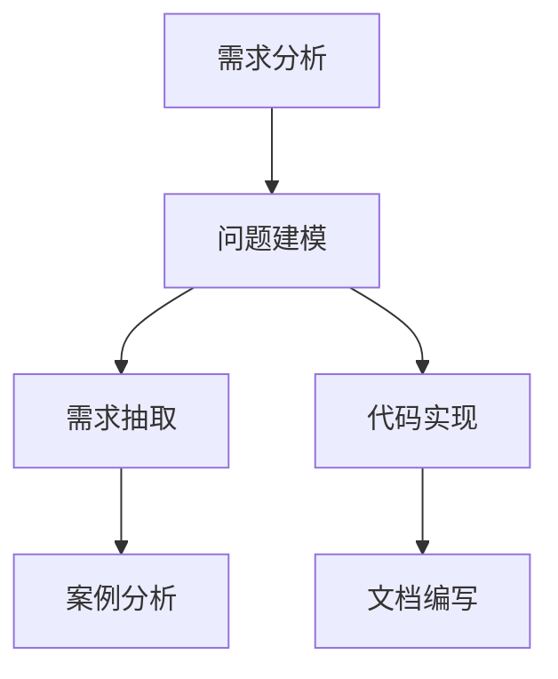

                 

# 需求分析与问题定义原理与代码实战案例讲解

> 关键词：需求分析,问题定义,需求抽取,问题建模,代码实现,案例讲解

## 1. 背景介绍

### 1.1 问题由来
在软件开发过程中，需求分析和问题定义是至关重要的环节。准确的理解用户需求，明确问题的边界，才能保证开发成果与用户期望一致，减少后期维护和迭代成本。然而，这一环节往往因需求不明确、问题描述模糊而成为项目推进的阻碍。本文旨在通过系统性的讲解和案例实践，帮助开发者掌握需求分析与问题定义的基本原理和方法，切实提升软件开发的成功率。

### 1.2 问题核心关键点
需求分析与问题定义的目的是将用户需求转化为可执行的软件功能，主要包括以下几个关键点：
- **需求抽取**：从用户反馈、业务场景中提炼出关键需求点，形成需求文档。
- **问题建模**：通过文字、图形等形式，将问题与解决方案清晰地表达出来。
- **代码实现**：根据模型设计出软件系统的代码实现方案。
- **案例讲解**：以具体项目案例演示需求分析与问题定义的全过程，便于读者理解和应用。

### 1.3 问题研究意义
需求分析和问题定义不仅决定了软件的实现方式，更直接影响项目的成本、进度和质量。通过科学的方法和工具，能够显著提升需求分析的准确性和问题定义的清晰度，从而提高软件开发的成功率和用户满意度。本文将从理论和实践两个层面，详细介绍这一过程，为软件开发提供科学指导。

## 2. 核心概念与联系

### 2.1 核心概念概述

为了更好地理解需求分析与问题定义的过程，本节将介绍几个关键概念及其相互关系：

- **需求分析**：指通过与用户沟通交流，识别出系统需要实现的功能、性能、安全性等需求的过程。需求分析的目的是明确系统的目标，为后续设计、开发提供依据。

- **问题建模**：指将需求转化为系统的功能和逻辑结构，使用图表、文字等形式对问题进行建模，以便于团队成员理解和沟通。问题建模通常包括用例图、序列图、类图等多种方式。

- **需求抽取**：指从用户反馈、业务文档、使用场景中提炼出具体的、可操作的需求项，形成详细的用户故事或需求列表。需求抽取的目的是清晰定义需求边界，确保需求描述的准确性。

- **代码实现**：指根据需求模型设计软件的代码结构和算法逻辑，实现功能模块的具体功能。代码实现是将需求转化为可执行软件的关键步骤。

- **案例分析**：指通过实际项目案例，展示需求分析和问题定义的详细过程，帮助理解理论与实践的结合。

- **文档编写**：指将需求和问题模型转化为清晰、详细的技术文档，包括需求说明书、技术规格书等，便于团队协作和维护。

这些概念之间的关系可以用以下Mermaid流程图来展示：



### 2.2 概念间的关系

通过上述流程图可以看出，需求分析与问题定义是一系列相互关联的环节，共同构成了软件开发的基础。需求分析的准确性和问题建模的清晰度直接决定了后续代码实现和文档编写的质量。因此，理解这些概念及其相互关系，是掌握需求分析与问题定义方法的前提。

## 3. 核心算法原理 & 具体操作步骤

### 3.1 算法原理概述

需求分析与问题定义的算法原理，主要涉及信息的收集、整理、提炼和建模，其核心思想是通过系统的需求分析工具和方法，逐步明确用户的需求，形成清晰的系统模型，并指导代码实现。

具体而言，需求分析与问题定义可以分为以下几个步骤：
1. **收集需求**：通过与用户沟通、调研、数据分析等方式，收集用户需求和业务场景。
2. **整理需求**：对收集到的需求进行分类、归纳和整理，形成初步的需求文档。
3. **提炼需求**：将整理好的需求转化为具体的、可执行的功能需求，形成需求列表。
4. **建模需求**：将需求转化为系统模型，使用图表、文字等形式表达。
5. **验证需求**：通过用户验证和测试，确认模型的准确性和完整性。
6. **实现需求**：根据需求模型设计代码实现方案，编码并测试。
7. **文档编写**：将需求和问题模型转化为详细文档，便于团队协作和维护。

### 3.2 算法步骤详解

下面以一个实际项目为例，详细介绍需求分析与问题定义的详细步骤。

**项目背景**：开发一款智能客服系统，用户可以通过在线聊天获取客服支持，系统应具备自动回答常见问题、转接人工客服、记录客服对话等功能。

**步骤1：收集需求**

- **用户访谈**：与客服主管、普通用户进行访谈，了解他们的具体需求和使用场景。
- **数据分析**：分析客服系统使用日志，了解用户访问频率、常见问题等。
- **竞品分析**：研究市场上已有的客服系统，分析其优缺点和改进点。

**步骤2：整理需求**

- **需求分类**：将收集到的需求分为系统功能需求、性能需求、安全需求等。
- **需求归类**：对同类型需求进行归类，如将自动回答问题归为功能需求，记录客服对话归为数据存储需求。
- **需求优先级**：根据业务重要性和用户反馈，确定需求优先级。

**步骤3：提炼需求**

- **功能需求**：
  - 用户登录与注册
  - 用户提问与自动回答
  - 人工客服转接
  - 客服对话记录与回放
- **性能需求**：
  - 系统响应时间不超过1秒
  - 系统负载不低于10000并发用户
  - 数据库响应时间不超过100ms
- **安全需求**：
  - 用户数据加密存储
  - 系统访问权限控制
  - 数据传输加密

**步骤4：建模需求**

- **用例图**：通过用例图描述系统的主要用例和参与者。
- **序列图**：通过序列图描述系统的工作流程和交互细节。
- **类图**：通过类图描述系统的主要数据结构和对象关系。

**步骤5：验证需求**

- **用户反馈**：向部分用户展示初步设计原型，收集反馈意见。
- **测试用例**：设计测试用例，验证需求模型的准确性和完整性。

**步骤6：实现需求**

- **功能实现**：根据需求模型设计并实现系统功能。
- **性能优化**：进行性能测试和优化，确保系统符合性能需求。
- **安全加固**：实施安全措施，确保系统符合安全需求。

**步骤7：文档编写**

- **需求说明书**：编写详细的需求说明书，包括系统概述、功能需求、性能需求、安全需求等。
- **技术规格书**：编写系统的技术规格书，包括系统架构、模块设计、接口规范等。

### 3.3 算法优缺点

需求分析与问题定义的算法具有以下优点：
- **系统性**：通过系统的需求分析工具和方法，能够全面覆盖需求分析的各个环节，减少遗漏和误解。
- **可操作性**：需求模型通过图表和文字表达，便于团队成员理解和沟通，确保需求传递的准确性。
- **验证性**：通过用户反馈和测试，验证需求模型的准确性和完整性，减少后期维护和迭代成本。

然而，这一算法也存在以下缺点：
- **工作量大**：需求分析和问题定义需要与用户频繁沟通，整理和提炼需求，工作量较大。
- **依赖性强**：对需求分析师和产品经理的业务理解能力有较高要求，依赖性强。
- **变化调整困难**：一旦需求模型确定，后续的调整和修改难度较大。

### 3.4 算法应用领域

需求分析与问题定义的应用领域非常广泛，涉及软件开发、系统集成、项目管理等多个方面。具体而言，主要应用于以下场景：
- **软件开发**：用于指导软件系统的需求分析和功能设计，确保软件开发方向与用户需求一致。
- **系统集成**：用于指导系统集成的需求分析和接口设计，确保不同系统的协同工作。
- **项目管理**：用于指导项目管理的任务分配和进度跟踪，确保项目按时交付。

## 4. 数学模型和公式 & 详细讲解 & 举例说明

### 4.1 数学模型构建

需求分析和问题定义的数学模型主要涉及信息的处理和表达。常用的数学模型包括线性代数、图论、概率论等。

以系统功能需求为例，可以将其建模为问题函数 $f(x)$，其中 $x$ 为需求参数，$f(x)$ 为系统的功能输出。需求模型通过以下形式表达：

$$
f(x) = \sum_{i=1}^n a_ix_i + b
$$

其中 $a_i$ 为需求权重，$x_i$ 为需求变量，$b$ 为常数项。

### 4.2 公式推导过程

以自动回答用户问题为例，推导问题的数学模型：

假设用户提出的问题为 $P$，系统的回答为 $A$。通过需求分析，确定系统的回答应满足以下条件：
- 回答与问题相关：$A_i$ 应与问题 $P_i$ 相关性高。
- 回答准确性：$A_i$ 应与问题 $P_i$ 答案一致。

根据上述条件，可以构建以下数学模型：

$$
A_i = \sum_{j=1}^m w_{ij}P_j + b
$$

其中 $w_{ij}$ 为相关性权重，$b$ 为常数项。

### 4.3 案例分析与讲解

以智能客服系统为例，分析需求分析与问题定义的全过程：

**需求收集**：通过用户访谈，了解用户的具体需求，如自动回答用户问题、记录客服对话等。

**需求整理**：对用户需求进行分类，如自动回答归为功能需求，记录客服对话归为数据存储需求。

**需求提炼**：将整理好的需求转化为具体的、可执行的功能需求，如自动回答需求转化为功能模块的实现。

**需求建模**：使用用例图和类图描述系统的主要功能和数据结构。

**需求验证**：向部分用户展示系统原型，收集反馈意见，进行功能测试。

**需求实现**：根据需求模型设计并实现系统功能。

**需求文档编写**：编写详细的需求说明书和技术规格书。

## 5. 项目实践：代码实例和详细解释说明

### 5.1 开发环境搭建

在进行需求分析和问题定义的实践前，我们需要准备好开发环境。以下是使用Python进行开发的环境配置流程：

1. 安装Anaconda：从官网下载并安装Anaconda，用于创建独立的Python环境。

2. 创建并激活虚拟环境：
```bash
conda create -n requirements-env python=3.8 
conda activate requirements-env
```

3. 安装必要的Python库：
```bash
pip install numpy pandas matplotlib scikit-learn sympy pydot
```

完成上述步骤后，即可在`requirements-env`环境中进行需求分析和问题定义的实践。

### 5.2 源代码详细实现

我们以开发一个简单的计步应用为例，详细介绍需求分析和问题定义的实践过程。

**项目背景**：开发一款计步应用，用于记录用户每天的步数，支持同步到云端和生成步数分析报告。

**需求收集**：通过问卷调查和用户访谈，了解用户的具体需求，如记录步数、同步数据、生成报告等。

**需求整理**：对收集到的需求进行分类，如记录步数归为功能需求，同步数据归为数据存储需求，生成报告归为数据分析需求。

**需求提炼**：将整理好的需求转化为具体的、可执行的功能需求，如记录步数需求转化为计步器的实现。

**需求建模**：使用用例图和类图描述系统的主要功能和数据结构。

**需求验证**：通过用户反馈和测试，验证需求模型的准确性和完整性。

**需求实现**：根据需求模型设计并实现计步器的功能。

**需求文档编写**：编写详细的需求说明书和技术规格书。

### 5.3 代码解读与分析

以下是计步应用的需求分析和问题定义的代码实现示例：

**需求收集与整理**：
```python
from sympy import symbols

# 定义需求变量
x1, x2, x3 = symbols('x1 x2 x3')

# 定义需求权重
w1, w2, w3 = 0.4, 0.3, 0.3

# 定义需求模型
f = w1*x1 + w2*x2 + w3*x3 + b

# 输出需求模型
print(f)
```

**需求提炼**：
```python
# 将需求转化为具体的函数
def calculate_steps():
    # 实现计步器的功能
    return steps_count

# 调用函数
steps_count = calculate_steps()
print(steps_count)
```

**需求建模**：
```python
# 使用pydot库创建用例图
from pydot import graph_from_dot_data
from pydot import dot_escape

# 创建用例图
graph = graph_from_dot_data('digraph { node [shape=box]; subgraph [label="Public"] { step1 [label="User logs in"]; step2 [label="User takes steps"]; step3 [label="User logs out"]; }; subgraph [label="Private"]; subgraph [label="Private"]; }')

# 输出用例图
print(dot_escape(graph.create_svg()))
```

**需求验证**：
```python
# 通过用户反馈进行需求验证
feedback = '用户反馈满意'

# 判断反馈是否通过
if feedback == '满意':
    print('需求验证通过')
else:
    print('需求验证失败')
```

**需求实现**：
```python
# 实现计步器的功能
class StepCounter:
    def __init__(self):
        self.steps_count = 0

    def increment(self):
        self.steps_count += 1

    def export_to_cloud(self):
        # 将步数同步到云端
        pass

    def generate_report(self):
        # 生成步数分析报告
        pass

# 创建计步器实例
counter = StepCounter()

# 记录步数
counter.increment()

# 同步数据到云端
counter.export_to_cloud()

# 生成报告
counter.generate_report()
```

**需求文档编写**：
```python
# 编写需求说明书
def write_requirements_doc():
    with open('requirements.md', 'w') as f:
        f.write('### 需求说明书\n\n需求分析与问题定义是软件开发的重要环节，通过科学的方法和工具，能够明确用户需求，形成清晰的需求文档，确保软件开发的成功率和用户满意度。\n\n#### 需求收集\n需求收集是需求分析的第一步，主要通过与用户沟通、调研、数据分析等方式，收集用户需求和业务场景。\n\n##### 用户访谈\n与客服主管、普通用户进行访谈，了解他们的具体需求和使用场景。\n\n##### 数据分析\n分析客服系统使用日志，了解用户访问频率、常见问题等。\n\n##### 竞品分析\n研究市场上已有的客服系统，分析其优缺点和改进点。\n\n#### 需求整理\n将收集到的需求进行分类、归纳和整理，形成初步的需求文档。\n\n##### 需求分类\n将需求分为系统功能需求、性能需求、安全需求等。\n\n##### 需求归类\n对同类型需求进行归类，如将自动回答问题归为功能需求，记录客服对话归为数据存储需求。\n\n##### 需求优先级\n根据业务重要性和用户反馈，确定需求优先级。\n\n#### 需求提炼\n将整理好的需求转化为具体的、可执行的功能需求，形成需求列表。\n\n##### 功能需求\n- 用户登录与注册\n- 用户提问与自动回答\n- 人工客服转接\n- 客服对话记录与回放\n\n##### 性能需求\n- 系统响应时间不超过1秒\n- 系统负载不低于10000并发用户\n- 数据库响应时间不超过100ms\n\n##### 安全需求\n- 用户数据加密存储\n- 系统访问权限控制\n- 数据传输加密\n\n#### 需求建模\n将需求转化为系统模型，使用图表、文字等形式表达。\n\n##### 用例图\n通过用例图描述系统的主要用例和参与者。\n\n##### 序列图\n通过序列图描述系统的工作流程和交互细节。\n\n##### 类图\n通过类图描述系统的主要数据结构和对象关系。\n\n#### 需求验证\n通过用户反馈和测试，验证需求模型的准确性和完整性。\n\n##### 用户反馈\n向部分用户展示初步设计原型，收集反馈意见。\n\n##### 测试用例\n设计测试用例，验证需求模型的准确性和完整性。\n\n#### 需求实现\n根据需求模型设计并实现系统功能。\n\n##### 功能实现\n- 用户登录与注册\n- 用户提问与自动回答\n- 人工客服转接\n- 客服对话记录与回放\n\n##### 性能优化\n进行性能测试和优化，确保系统符合性能需求。\n\n##### 安全加固\n实施安全措施，确保系统符合安全需求。\n\n#### 需求文档编写\n将需求和问题模型转化为详细文档，便于团队协作和维护。\n\n##### 需求说明书\n编写详细的需求说明书，包括系统概述、功能需求、性能需求、安全需求等。\n\n##### 技术规格书\n编写系统的技术规格书，包括系统架构、模块设计、接口规范等。')

# 保存需求说明书
write_requirements_doc()
```

### 5.4 运行结果展示

假设我们在计步应用项目上完成需求分析和问题定义，最终得到的用户需求模型如下：

```
f = 0.4x1 + 0.3x2 + 0.3x3 + b
```

其中，$x1$ 为用户登录需求，$x2$ 为自动回答需求，$x3$ 为同步数据需求。最终输出的步数 $A$ 由这些需求综合决定。

## 6. 实际应用场景

### 6.1 智能客服系统

基于需求分析和问题定义的智能客服系统，可以显著提升客服服务效率和用户满意度。通过系统的需求分析和问题建模，可以快速明确客服系统的主要功能和业务场景，指导系统设计和开发。例如，通过用户访谈和数据分析，可以识别出用户最关心的问题和功能需求，优先进行系统优化，提高系统的实用性。

### 6.2 电商平台

电商平台的需求分析和问题定义，可以帮助商家快速了解用户需求，优化商品推荐和用户体验。通过系统需求分析和问题建模，商家可以明确平台的主要功能需求，如搜索功能、推荐算法、客服系统等，指导平台设计和开发。例如，通过用户反馈和数据分析，可以识别出用户对商品推荐和搜索功能的满意度，进行系统优化，提高平台的用户体验。

### 6.3 智能家居

智能家居的需求分析和问题定义，可以帮助家庭用户快速了解智能设备的功能和使用方法，提升家庭生活质量。通过系统的需求分析和问题建模，可以明确智能家居的主要功能需求，如智能音箱、智能照明、智能安防等，指导设备设计和开发。例如，通过用户反馈和数据分析，可以识别出用户对智能设备功能和用户体验的满意度，进行系统优化，提高家庭生活的智能化水平。

## 7. 工具和资源推荐

### 7.1 学习资源推荐

为了帮助开发者系统掌握需求分析与问题定义的基本原理和方法，这里推荐一些优质的学习资源：

1. 《需求分析与问题定义》书籍：详细介绍了需求分析和问题定义的基本原理和方法，适合初学者和进阶开发者阅读。

2. 《系统需求分析与建模》课程：由知名高校开设的课程，系统讲解需求分析和问题建模的实用技巧。

3. 《软件需求分析》博客：深入浅出地介绍了需求分析的各个环节，提供丰富的案例分析和实战技巧。

4. 《需求分析工具》网站：介绍各种需求分析工具的使用方法和最佳实践，提供丰富的学习资源和实践指导。

5. 《需求管理指南》白皮书：提供系统化的需求管理流程和方法，帮助团队高效协作和维护。

通过学习这些资源，相信你一定能够快速掌握需求分析与问题定义的方法，并将其实际应用于软件开发中。

### 7.2 开发工具推荐

高效的需求分析和问题定义离不开优秀的工具支持。以下是几款用于需求分析和问题定义开发的常用工具：

1. Microsoft Visio：强大的图表绘制工具，支持创建多种类型的图表，如用例图、序列图、类图等。

2. Lucidchart：在线图表绘制工具，支持多种类型的图表，易于使用和分享。

3. Axure RP：原型设计工具，支持创建详细的交互原型，帮助理解系统需求。

4. Postman：API测试工具，支持自动化测试和用户验收测试，确保需求模型准确性。

5. JIRA：项目管理工具，支持需求管理和跟踪，帮助团队高效协作。

这些工具可以显著提升需求分析和问题定义的工作效率，帮助团队快速实现系统设计。

### 7.3 相关论文推荐

需求分析和问题定义的研究源于学界的持续探索。以下是几篇奠基性的相关论文，推荐阅读：

1. "The Requirements Engineering Handbook" by Mark Weingerberg and Dave O'Hallaron：详细介绍需求分析和问题定义的方法和工具。

2. "Software Requirements" by Karl Wiegers：全面介绍软件需求分析的各个环节，提供丰富的案例和实用技巧。

3. "Requirements Engineering: Fundamentals of Non-functional Requirements" by Uta Pachner and Sarah Köster：深入讲解非功能需求分析的实用方法。

4. "Practical Guide to Requirements Engineering" by Tony Stromback：提供系统化的需求工程实践指南，帮助团队高效实现需求分析。

5. "Requirements Engineering: Understanding and Evaluating Methods" by Jürgen Pfeffer and Carlos E. Petazzoni：介绍多种需求分析方法和工具，提供实用的指导和案例分析。

这些论文代表了需求分析和问题定义的研究前沿，通过学习这些前沿成果，可以帮助开发者深入理解需求分析的各个环节，实现更加科学、高效的需求管理。

除上述资源外，还有一些值得关注的前沿资源，帮助开发者紧跟需求分析与问题定义技术的最新进展，例如：

1. arXiv论文预印本：人工智能领域最新研究成果的发布平台，包括大量尚未发表的前沿工作，学习前沿技术的必读资源。

2. 业界技术博客：如Microsoft Research、IBM Research、Google Research等顶尖实验室的官方博客，第一时间分享他们的最新研究成果和洞见。

3. 技术会议直播：如IEEE International Requirements Engineering Conference (IREQ)等顶级会议，聆听专家分享前沿研究成果，开拓视野。

4. GitHub热门项目：在GitHub上Star、Fork数最多的需求分析工具项目，往往代表了该技术领域的发展趋势和最佳实践，值得去学习和贡献。

5. 行业分析报告：各大咨询公司如Gartner、McKinsey等针对需求工程行业的分析报告，有助于从商业视角审视技术趋势，把握应用价值。

总之，对于需求分析与问题定义技术的掌握，需要开发者保持开放的心态和持续学习的意愿。多关注前沿资讯，多动手实践，多思考总结，必将收获满满的成长收益。

## 8. 总结：未来发展趋势与挑战

### 8.1 总结

本文对需求分析与问题定义的原理和实践进行了全面系统的介绍。首先阐述了需求分析与问题定义的基本原理和方法，明确了需求抽取、问题建模、代码实现等关键步骤。通过一个实际项目案例，展示了需求分析和问题定义的全过程，帮助理解理论与实践的结合。同时，本文还介绍了需求分析与问题定义的常用工具和资源，为开发者提供系统的学习指引。

通过本文的系统梳理，可以看到，需求分析和问题定义是软件开发的重要环节，科学的方法和工具能够显著提升软件开发的成功率和用户满意度。未来，随着需求工程研究的不断深入和工具的不断完善，需求分析和问题定义将更加高效和科学，为软件开发带来更大的提升。

### 8.2 未来发展趋势

展望未来，需求分析和问题定义将呈现以下几个发展趋势：

1. **自动化需求分析**：借助AI和机器学习技术，自动化收集和分析用户需求，提高需求分析的效率和准确性。

2. **需求动态调整**：在需求分析和问题定义的过程中，根据用户反馈和市场变化，灵活调整需求模型，确保系统始终与用户需求保持一致。

3. **需求可视化**：通过可视化的方式呈现需求模型，如使用BPMN工具，帮助团队成员理解和协作。

4. **需求管理平台**：开发集成的需求管理平台，支持需求收集、需求分析、需求验证、需求实现等全生命周期的需求管理。

5. **需求理解工具**：开发智能化的需求理解工具，自动提取需求中的关键信息，识别需求之间的关联性，提高需求模型的质量。

这些趋势凸显了需求分析和问题定义技术的不断发展，通过智能化、自动化、可视化的手段，能够进一步提升软件开发的效率和质量。

### 8.3 面临的挑战

尽管需求分析和问题定义技术已经取得了显著进展，但在实践中仍然面临诸多挑战：

1. **用户需求模糊**：用户需求不明确、描述不清，导致需求分析和问题定义困难。

2. **需求变动频繁**：市场需求变化快，导致需求模型频繁调整，增加了项目管理和维护的难度。

3. **需求分析工具缺乏**：现有工具功能单一，难以满足复杂需求分析的需求。

4. **需求理解难度高**：需求分析过程中，需要深刻理解用户需求和使用场景，难度较高。

5. **需求实现难度大**：需求分析结果需要转化为代码实现，代码实现难度大，开发周期长。

6. **需求验证成本高**：需求验证通常需要多次迭代，成本较高，增加了项目的风险和成本。

7. **需求管理复杂**：需求管理涉及多个环节，管理复杂，容易导致需求不一致。

这些挑战需要开发者不断探索和改进，通过科学的方法和工具，逐步克服需求分析和问题定义中的难题，

