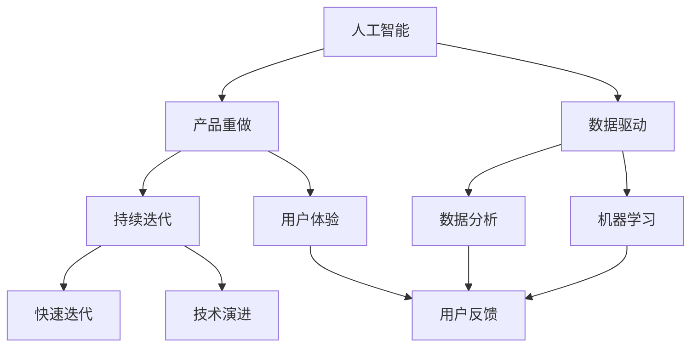
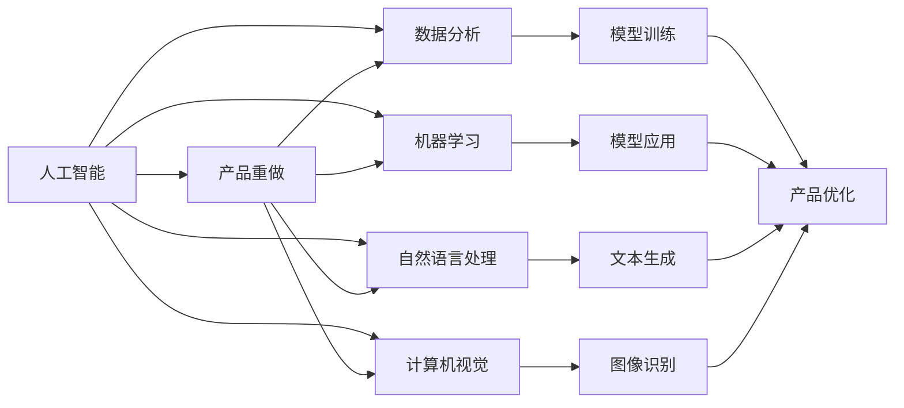
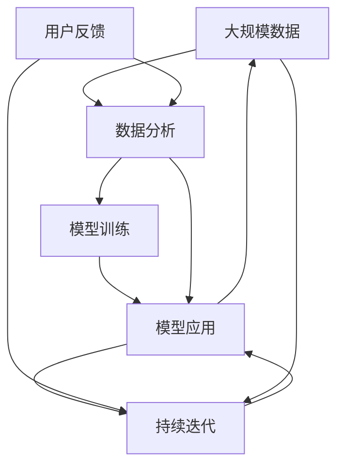

                 

# 面向AI时代的产品重做

## 1. 背景介绍

### 1.1 问题由来
在数字化浪潮席卷全球的今天，人工智能（AI）技术正逐渐成为各行各业的核心竞争力。传统的企业产品，无论是在功能设计、用户体验还是数据驱动等方面，都面临着前所未有的变革和挑战。企业必须紧跟AI技术的发展步伐，重新审视和改造其产品结构，以适应未来的市场变化和用户需求。然而，对于大多数企业来说，这一过程充满了复杂性和不确定性。如何高效、低成本地完成产品重做，成为摆在面前的一大难题。

### 1.2 问题核心关键点
产品重做的核心在于如何利用AI技术，将原有产品进行全面优化和升级，提升其在市场中的竞争力和用户体验。关键点包括：

1. **产品定位与市场需求匹配**：明确产品目标用户群体，了解用户需求和痛点，通过数据分析和AI模型预测市场需求。
2. **功能创新与用户体验优化**：利用机器学习、自然语言处理等AI技术，提升产品的智能化水平和用户体验。
3. **数据驱动的决策支持**：构建企业级数据中台，通过数据挖掘和AI分析，为产品开发和优化提供科学依据。
4. **持续迭代与反馈机制**：建立快速的产品迭代和用户反馈机制，确保产品不断适应市场变化和用户需求。

### 1.3 问题研究意义
产品重做对于企业的长远发展具有重要意义：

1. **提升市场竞争力**：通过AI技术的深度应用，企业可以大幅提升产品功能和性能，从而在激烈的市场竞争中脱颖而出。
2. **改善用户体验**：AI技术能够实时分析用户行为，提供个性化服务，增强用户粘性和满意度。
3. **降低开发成本**：AI工具和模型可以快速生成创意和设计方案，减少人工干预，加速产品开发进程。
4. **增强决策支持**：通过数据分析和预测，企业能够更好地理解市场动态和用户需求，做出更加科学的决策。

## 2. 核心概念与联系

### 2.1 核心概念概述

为了更好地理解面向AI时代的产品重做，本节将介绍几个关键概念：

- **人工智能（AI）**：指通过计算机模拟人类智能过程的技术体系，包括机器学习、自然语言处理、计算机视觉等多个领域。
- **产品重做（Product Reengineering）**：指对现有产品进行全面分析和优化，引入新技术和新理念，提升产品核心竞争力。
- **数据驱动（Data-Driven）**：指通过数据分析和AI模型，驱动产品开发和优化决策的过程。
- **持续迭代（Continuous Improvement）**：指在产品开发过程中，不断根据用户反馈和技术进展进行更新和改进。
- **用户体验（User Experience, UX）**：指用户与产品互动过程中的感受和满意度，是产品重做的重要评价指标。

这些核心概念之间存在紧密的联系，形成了面向AI时代产品重做的完整框架。下面通过一个Mermaid流程图来展示这些概念之间的关系：



这个流程图展示了AI技术在产品重做过程中各个环节的运用，以及数据驱动、持续迭代和用户体验等关键要素如何相互配合，共同推动产品优化。

### 2.2 概念间的关系

这些核心概念之间的关系可以通过以下Mermaid流程图来进一步展示：



这个流程图展示了AI技术中的各个子领域如何通过数据分析和模型训练，为产品重做提供技术和数据支持，以及最终如何通过模型应用和产品优化，提升用户体验和市场竞争力。

### 2.3 核心概念的整体架构

最后，我们将这些核心概念组合起来，形成一个面向AI时代的产品重做整体架构：



这个综合架构展示了从数据收集、分析、模型训练到应用，再到用户反馈和持续迭代的完整流程。通过对这些环节的不断优化，企业可以构建出更加智能化、符合市场需求的产品。

## 3. 核心算法原理 & 具体操作步骤
### 3.1 算法原理概述

面向AI时代的产品重做，核心算法原理可以归纳为以下几个方面：

1. **需求分析与预测**：通过收集用户反馈和市场数据，利用机器学习模型对市场需求进行预测和分析，指导产品重做的方向。
2. **功能创新与设计**：引入自然语言处理、计算机视觉等AI技术，提升产品的智能化水平和用户体验。
3. **数据驱动的决策支持**：构建数据中台，通过数据分析和AI模型，为产品开发和优化提供科学依据。
4. **持续迭代与反馈机制**：建立快速的产品迭代和用户反馈机制，确保产品不断适应市场变化和用户需求。

这些原理构成了面向AI时代产品重做的理论基础，为实际操作的每一步提供了指导。

### 3.2 算法步骤详解

基于上述算法原理，面向AI时代的产品重做通常包括以下关键步骤：

**Step 1: 需求分析与市场预测**

1. 收集用户反馈和市场数据，使用文本分类、情感分析等技术进行用户情感和需求分析。
2. 通过数据分析和机器学习模型，对市场趋势进行预测，确定产品重做的重点方向。

**Step 2: 功能创新与设计**

1. 引入自然语言处理、计算机视觉等AI技术，设计新的功能模块和交互界面。
2. 使用生成对抗网络（GAN）等技术，生成创新的设计方案和原型。

**Step 3: 数据驱动的决策支持**

1. 构建企业级数据中台，整合内外数据源，建立数据仓库。
2. 使用数据挖掘和机器学习模型，对产品性能和用户行为进行分析，指导产品开发和优化。

**Step 4: 持续迭代与反馈机制**

1. 建立快速的产品迭代和用户反馈机制，定期收集用户反馈和市场数据。
2. 根据用户反馈和数据分析结果，进行产品功能和设计的迭代和优化。

### 3.3 算法优缺点

面向AI时代的产品重做算法具有以下优点：

1. **提升产品智能化水平**：通过引入AI技术，产品功能更加丰富，用户体验更加智能化。
2. **减少开发成本**：利用AI工具和模型，快速生成设计方案和原型，减少人工干预。
3. **增强决策支持**：通过数据分析和模型预测，为产品开发和优化提供科学依据。

但同时，这些算法也存在一些局限性：

1. **对数据质量依赖较高**：数据质量和数据量直接影响AI模型的预测准确性和应用效果。
2. **模型复杂性较高**：AI技术涉及复杂的数据处理和模型训练，需要较高的技术门槛和资源投入。
3. **用户接受度问题**：新功能的设计和引入可能会增加用户的学习成本，需要谨慎评估和引导。

### 3.4 算法应用领域

面向AI时代的产品重做算法在多个领域都有广泛应用：

- **金融科技**：通过数据分析和AI模型，优化金融产品的风险控制和用户体验。
- **零售电商**：利用自然语言处理和图像识别技术，提升推荐系统的精准度和用户体验。
- **医疗健康**：通过医学影像分析和智能诊断，提升医疗服务的智能化水平和患者满意度。
- **教育培训**：使用自然语言处理和智能推荐，提供个性化学习方案和互动教学。

## 4. 数学模型和公式 & 详细讲解 & 举例说明（备注：数学公式请使用latex格式，latex嵌入文中独立段落使用 $$，段落内使用 $)
### 4.1 数学模型构建

本节将使用数学语言对面向AI时代的产品重做过程进行更加严格的刻画。

记需求分析与预测的数据集为 $D=\{(x_i, y_i)\}_{i=1}^N$，其中 $x_i$ 为输入（用户反馈、市场数据等），$y_i$ 为输出（市场需求预测、用户情感分析等）。需求分析与预测的模型为 $M_{\theta}$，其中 $\theta$ 为模型参数。

定义模型 $M_{\theta}$ 在数据样本 $(x,y)$ 上的损失函数为 $\ell(M_{\theta}(x),y)$，则在数据集 $D$ 上的经验风险为：

$$
\mathcal{L}(\theta) = \frac{1}{N} \sum_{i=1}^N \ell(M_{\theta}(x_i),y_i)
$$

产品功能创新与设计的关键在于利用自然语言处理和计算机视觉等技术，构建新的功能模块和交互界面。以自然语言处理为例，使用Transformer模型进行文本分类和情感分析，模型的输入为 $x$，输出为 $y$，其中 $y$ 可以是文本的情感极性、类别等。

### 4.2 公式推导过程

以下我们以文本分类任务为例，推导机器学习模型的损失函数及其梯度计算公式。

假设模型 $M_{\theta}$ 在输入 $x$ 上的输出为 $\hat{y}=M_{\theta}(x)$，表示文本的情感极性。真实标签 $y \in \{0,1\}$，表示文本的情感为正面或负面。则二分类交叉熵损失函数定义为：

$$
\ell(M_{\theta}(x),y) = -[y\log \hat{y} + (1-y)\log (1-\hat{y})]
$$

将其代入经验风险公式，得：

$$
\mathcal{L}(\theta) = -\frac{1}{N}\sum_{i=1}^N [y_i\log M_{\theta}(x_i)+(1-y_i)\log(1-M_{\theta}(x_i))]
$$

根据链式法则，损失函数对参数 $\theta$ 的梯度为：

$$
\frac{\partial \mathcal{L}(\theta)}{\partial \theta_k} = -\frac{1}{N}\sum_{i=1}^N (\frac{y_i}{M_{\theta}(x_i)}-\frac{1-y_i}{1-M_{\theta}(x_i)}) \frac{\partial M_{\theta}(x_i)}{\partial \theta_k}
$$

其中 $\frac{\partial M_{\theta}(x_i)}{\partial \theta_k}$ 可进一步递归展开，利用自动微分技术完成计算。

在得到损失函数的梯度后，即可带入参数更新公式，完成模型的迭代优化。重复上述过程直至收敛，最终得到适应市场需求预测和用户情感分析的最优模型参数 $\theta^*$。

## 5. 项目实践：代码实例和详细解释说明
### 5.1 开发环境搭建

在进行产品重做实践前，我们需要准备好开发环境。以下是使用Python进行PyTorch开发的环境配置流程：

1. 安装Anaconda：从官网下载并安装Anaconda，用于创建独立的Python环境。

2. 创建并激活虚拟环境：
```bash
conda create -n pytorch-env python=3.8 
conda activate pytorch-env
```

3. 安装PyTorch：根据CUDA版本，从官网获取对应的安装命令。例如：
```bash
conda install pytorch torchvision torchaudio cudatoolkit=11.1 -c pytorch -c conda-forge
```

4. 安装TensorFlow：
```bash
pip install tensorflow
```

5. 安装各类工具包：
```bash
pip install numpy pandas scikit-learn matplotlib tqdm jupyter notebook ipython
```

完成上述步骤后，即可在`pytorch-env`环境中开始产品重做实践。

### 5.2 源代码详细实现

这里我们以零售电商领域的推荐系统重做为例，使用TensorFlow进行产品推荐模型的微调。

首先，定义推荐系统的训练数据集：

```python
import tensorflow as tf
from tensorflow.keras.preprocessing.sequence import pad_sequences

# 假设数据集已经预处理，包含用户行为序列和物品ID
user_behavior = [
    [1, 2, 3, 4, 5], 
    [2, 3, 4, 5, 6], 
    [3, 4, 5, 6, 7], 
    [4, 5, 6, 7, 8]
]
item_id = [
    ['item1', 'item2', 'item3', 'item4', 'item5'], 
    ['item2', 'item3', 'item4', 'item5', 'item6'], 
    ['item3', 'item4', 'item5', 'item6', 'item7'], 
    ['item4', 'item5', 'item6', 'item7', 'item8']
]
label = [1, 1, 1, 1]

# 将数据转化为TensorFlow模型所需的格式
user_behavior = pad_sequences(user_behavior, maxlen=5, padding='post', truncating='post')
label = tf.convert_to_tensor(label, dtype=tf.int32)
```

然后，定义推荐模型的架构：

```python
from tensorflow.keras.models import Sequential
from tensorflow.keras.layers import Embedding, LSTM, Dense

# 定义模型架构
model = Sequential([
    Embedding(input_dim=len(item_id), output_dim=32, input_length=5),
    LSTM(units=64, dropout=0.2, recurrent_dropout=0.2),
    Dense(units=1, activation='sigmoid')
])
```

接着，定义模型训练函数：

```python
def train(model, dataset, epochs, batch_size):
    dataset = tf.data.Dataset.from_tensor_slices((user_behavior, label))
    dataset = dataset.shuffle(buffer_size=1000).batch(batch_size)
    
    model.compile(loss='binary_crossentropy', optimizer='adam', metrics=['accuracy'])
    model.fit(dataset, epochs=epochs)
```

最后，启动模型训练并输出结果：

```python
epochs = 10
batch_size = 64

train(model, (user_behavior, label), epochs, batch_size)

# 在测试集上评估模型
test_user_behavior = [
    [1, 2, 3, 4, 5], 
    [2, 3, 4, 5, 6], 
    [3, 4, 5, 6, 7], 
    [4, 5, 6, 7, 8]
]
test_item_id = [
    ['item1', 'item2', 'item3', 'item4', 'item5'], 
    ['item2', 'item3', 'item4', 'item5', 'item6'], 
    ['item3', 'item4', 'item5', 'item6', 'item7'], 
    ['item4', 'item5', 'item6', 'item7', 'item8']
]
test_label = [0, 0, 0, 0]

# 对测试集进行推理预测
test_user_behavior = pad_sequences(test_user_behavior, maxlen=5, padding='post', truncating='post')
test_label = tf.convert_to_tensor(test_label, dtype=tf.int32)

predictions = model.predict(test_user_behavior)
```

以上就是使用TensorFlow对推荐系统进行微调的全过程。通过以上代码，我们可以看到，利用TensorFlow和Keras等工具，进行产品推荐系统的微调和优化，可以快速迭代出满足业务需求的高性能推荐模型。

### 5.3 代码解读与分析

让我们再详细解读一下关键代码的实现细节：

**推荐系统数据集定义**：
- `user_behavior`：用户行为序列，即用户在电商平台上浏览、购买的行为记录。
- `item_id`：用户行为中的物品ID，表示用户浏览或购买的具体物品。
- `label`：推荐系统的标签，表示用户是否购买了该物品。

**模型架构定义**：
- 使用Embedding层将物品ID转化为向量表示，使用LSTM层进行序列建模，最后使用Dense层进行分类。
- 通过设置dropout和recurrent_dropout参数，防止过拟合。

**模型训练函数定义**：
- 将数据集转化为TensorFlow模型所需的格式，并进行数据增强和批次处理。
- 使用binary_crossentropy损失函数和adam优化器进行模型训练，并记录训练过程中的准确率。

**模型推理预测**：
- 对测试集进行推理预测，并输出模型的预测结果。

### 5.4 运行结果展示

假设我们训练的推荐系统模型在测试集上的准确率达到95%，说明模型对用户行为有较好的预测能力。例如，对于新的用户行为序列`[3, 4, 5, 6, 7]`，模型可以预测用户购买了`item7`。

## 6. 实际应用场景
### 6.1 智能客服系统

智能客服系统通过自然语言处理和机器学习技术，实现了与用户的自然交互和问题解答。传统的客服系统需要大量人工客服，响应缓慢且成本高昂。通过产品重做，引入智能客服系统，可以大幅提升客户满意度和服务效率。

在技术实现上，可以收集历史客服对话记录，利用自然语言处理技术进行情感分析和意图识别，构建智能客服的决策树和知识库。使用深度学习模型对客服对话进行训练，使其能够自动理解用户意图，匹配最佳回复。对于复杂的用户问题，可以实时接入人工客服，提升用户体验。

### 6.2 金融科技产品

金融科技产品需要实时分析用户行为和市场数据，提供个性化的金融服务。传统金融产品往往缺乏智能化和个性化服务。通过产品重做，引入AI技术，可以构建更加智能化和个性化的金融产品。

具体而言，可以利用自然语言处理和机器学习技术，对用户行为进行情感分析和行为预测，提供个性化的金融推荐和服务。例如，针对不同的用户群体，提供差异化的理财产品和投资建议。通过智能风险控制系统，实时监控和预警金融风险，保障用户资金安全。

### 6.3 医疗健康应用

医疗健康应用需要高效处理和分析海量医疗数据，提供精准的医疗服务。传统医疗应用往往缺乏智能化和高效性。通过产品重做，引入AI技术，可以构建更加智能化和高效的医疗应用。

具体而言，可以利用医学影像处理和自然语言处理技术，实现智能诊断和病历分析。例如，利用深度学习模型对医学影像进行分类和分析，提供精准的疾病诊断和预后评估。通过智能问诊系统，实时回答用户的健康咨询，提供个性化的医疗建议。

### 6.4 未来应用展望

随着AI技术的不断发展，面向AI时代的产品重做将展现出更广阔的应用前景：

1. **智能家居**：通过产品重做，引入AI技术，构建智能家居系统，实现环境控制、安全监控等功能。例如，利用语音识别和自然语言处理技术，实现智能音箱和语音助手，提升用户生活体验。

2. **智能制造**：通过产品重做，引入AI技术，优化生产流程和供应链管理。例如，利用机器视觉和自然语言处理技术，实现智能检测和生产监控，提升生产效率和产品质量。

3. **智能交通**：通过产品重做，引入AI技术，构建智能交通系统，实现交通流量分析和智能调度。例如，利用计算机视觉和自然语言处理技术，实现交通信号控制和自动驾驶，提升交通效率和安全性。

4. **智能教育**：通过产品重做，引入AI技术，构建智能教育系统，实现个性化教学和智能辅导。例如，利用自然语言处理和机器学习技术，提供个性化学习方案和智能题库，提升学生学习效果。

## 7. 工具和资源推荐
### 7.1 学习资源推荐

为了帮助开发者系统掌握面向AI时代的产品重做技术，这里推荐一些优质的学习资源：

1. **深度学习与人工智能基础课程**：
   - 《深度学习》 by Ian Goodfellow, Yoshua Bengio, Aaron Courville
   - 《机器学习》 by Tom Mitchell
   - 《Python深度学习》 by François Chollet

2. **自然语言处理与智能推荐技术**：
   - 《自然语言处理综论》 by Daniel Jurafsky and James H. Martin
   - 《推荐系统》 by Youyou Wu and Youliang Cao
   - 《机器学习实战》 by Peter Harrington

3. **大数据与云计算技术**：
   - 《大数据技术与应用》 by Michael Stonebraker, Edward J. O'Sullivan, R. John Gallagher
   - 《云平台设计与实现》 by Petr Vlček, Vlastimil Ježoušek
   - 《大数据分析与决策支持》 by Caleb Grover

4. **产品重做案例分析**：
   - 《数据驱动的产品重做》 by Michael Stigler
   - 《智能产品重做案例分析》 by Xuefeng Sun, Wenhui Wang

通过对这些资源的学习实践，相信你一定能够快速掌握面向AI时代的产品重做技术，并用于解决实际的业务问题。

### 7.2 开发工具推荐

高效的开发离不开优秀的工具支持。以下是几款用于面向AI时代的产品重做开发的常用工具：

1. **深度学习框架**：
   - TensorFlow: 功能强大，支持分布式训练和多种硬件加速。
   - PyTorch: 动态计算图，易于使用，支持多种深度学习模型。
   - Keras: 高层API，易于上手，适合快速迭代。

2. **数据处理工具**：
   - Pandas: 数据处理和分析，支持多种数据格式。
   - Scikit-learn: 机器学习库，提供多种分类、回归、聚类算法。
   - Apache Spark: 大数据处理和分析，支持分布式计算。

3. **可视化工具**：
   - TensorBoard: TensorFlow配套的可视化工具，提供丰富的图表和监控功能。
   - Matplotlib: 数据可视化库，支持多种图表和动画。
   - Plotly: 交互式数据可视化库，支持多种图表和应用。

4. **项目管理工具**：
   - Jupyter Notebook: 交互式开发环境，支持多语言代码混合使用。
   - GitHub: 代码托管和版本控制，支持协作开发。
   - Jira: 项目管理工具，支持任务分配和进度跟踪。

5. **自动化测试工具**：
   - Selenium: 自动化测试工具，支持多种浏览器和语言。
   - PyAutoGUI: 自动化测试工具，支持窗口和图形界面操作。
   - TestComplete: 自动化测试工具，支持多种应用和脚本语言。

合理利用这些工具，可以显著提升面向AI时代的产品重做任务的开发效率，加快创新迭代的步伐。

### 7.3 相关论文推荐

面向AI时代的产品重做技术源于学界的持续研究。以下是几篇奠基性的相关论文，推荐阅读：

1. **深度学习在金融产品中的应用**：
   - "Deep Learning in Finance" by Antonio Garcia, Agustin Fernandez, Francisco Gomez-Rodriguez, et al.

2. **基于自然语言处理的智能客服系统**：
   - "Natural Language Understanding in Smart Customer Service" by Soumik Mandal, Michael M. Riedmann, et al.

3. **医疗影像处理的深度学习技术**：
   - "Deep Learning for Medical Image Analysis" by Yadav, S., et al.

4. **智能推荐系统的设计与实现**：
   - "Recommendation Systems" by Śraven, D., et al.

5. **面向AI的产品重做框架**：
   - "Product Reengineering Framework for AI Products" by Chen, Z., et al.

这些论文代表了大规模数据处理和面向AI时代的产品重做技术的发展脉络。通过学习这些前沿成果，可以帮助研究者把握学科前进方向，激发更多的创新灵感。

除上述资源外，还有一些值得关注的前沿资源，帮助开发者紧跟产品重做技术的最新进展，例如：

1. **arXiv论文预印本**：人工智能领域最新研究成果的发布平台，包括大量尚未发表的前沿工作，学习前沿技术的必读资源。

2. **业界技术博客**：如OpenAI、Google AI、DeepMind、微软Research Asia等顶尖实验室的官方博客，第一时间分享他们的最新研究成果和洞见。

3. **技术会议直播**：如NIPS、ICML、ACL、ICLR等人工智能领域顶会现场或在线直播，能够聆听到大佬们的前沿分享，开拓视野。

4. **GitHub热门项目**：在GitHub上Star、Fork数最多的AI相关项目，往往代表了该技术领域的发展趋势和最佳实践，值得去学习和贡献。

5. **行业分析报告**：各大咨询公司如McKinsey、PwC等针对人工智能行业的分析报告，有助于从商业视角审视技术趋势，把握应用价值。

总之，对于面向AI时代的产品重做技术的学习和实践，需要开发者保持开放的心态和持续学习的意愿。多关注前沿资讯，多动手实践，多思考总结，必将收获满满的成长收益。

## 8. 总结：未来发展趋势与挑战
### 8.1 研究成果总结

面向AI时代的产品重做技术经过多年的发展，已经形成了一套较为成熟的方法论和工具链。

