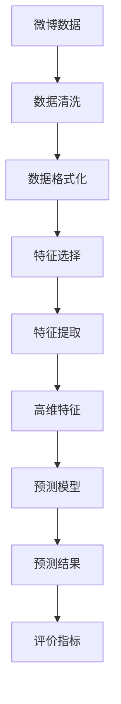
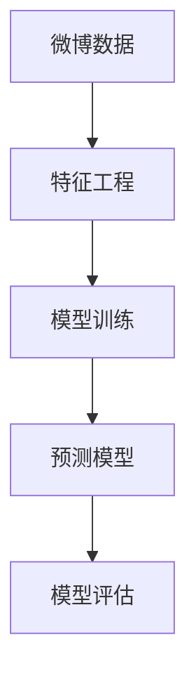

                 

# 预测微博用户的转发行为

## 1. 背景介绍

在社交媒体平台，微博因其独特的实时性、互动性和广泛的用户基础，成为舆情监测、用户行为分析等的重要数据来源。预测微博用户的转发行为，有助于理解用户之间的传播路径，发现影响微博热度的关键因素，为社交媒体的内容策略制定、用户行为预测等领域提供支撑。

### 1.1 问题由来
微博用户的转发行为受多种因素影响，包括内容质量、用户社交网络、平台算法推荐、社会热点事件等。在数据驱动的互联网时代，利用机器学习模型对微博用户的转发行为进行预测，可以更精确地把握用户行为，优化内容分发策略，提升社交媒体平台的用户粘性。

### 1.2 问题核心关键点
微博用户转发行为预测的核心问题在于：如何从海量微博数据中提取有意义的特征，并构建准确有效的预测模型。关键点包括：
- 数据预处理：清洗、格式化和提取微博数据。
- 特征工程：选择合适的特征，构建高维特征空间。
- 模型构建：选择和训练预测模型，评估模型性能。
- 结果应用：将模型应用于实际预测场景，优化策略。

## 2. 核心概念与联系

### 2.1 核心概念概述

为了更好地理解微博用户转发行为预测，我们先介绍几个关键概念及其关系：

- **微博数据**：指微博平台上发布、转发、评论等用户行为数据的集合，包括文本、图片、视频等形式。
- **特征工程**：从原始数据中提取、选择和构建高维特征向量，用于训练机器学习模型。
- **预测模型**：使用机器学习算法构建的，用于预测用户转发行为的模型。
- **评价指标**：如准确率、召回率、F1分数等，用于衡量预测模型的性能。

这些概念之间的联系可以通过以下Mermaid流程图来展示：



这个流程图展示了微博用户转发行为预测的主要步骤：

1. 原始微博数据进行清洗和格式化，转化为机器学习可处理的形式。
2. 进行特征选择和提取，构建高维特征空间。
3. 使用机器学习算法构建预测模型。
4. 模型输出预测结果，通过评价指标衡量模型性能。

### 2.2 概念间的关系

这些核心概念之间的关系紧密，通过以下两个Mermaid流程图进一步展示：

#### 2.2.1 微博数据预处理


这个流程图展示了微博数据预处理的过程：

1. 微博数据进行清洗，去除噪音和无关信息。
2. 统一数据格式，如文本标准化、时间戳一致化等。
3. 提取特征，如用户ID、发布时间、内容文本、点赞数、转发数等。

#### 2.2.2 特征工程与模型构建


这个流程图展示了特征工程与模型构建的流程：

1. 使用特征工程提取微博数据的特征。
2. 构建机器学习预测模型，使用微博数据进行训练。
3. 模型输出预测结果，使用评价指标评估模型性能。

## 3. 核心算法原理 & 具体操作步骤
### 3.1 算法原理概述

微博用户转发行为预测本质上是一个监督学习问题，目标是从微博数据中学习到预测用户转发的规律，从而实现对用户转发的预测。预测模型通常使用分类算法，如逻辑回归、随机森林、支持向量机等，通过训练数据集来构建。

假设微博数据集为 $D=\{(x_i,y_i)\}_{i=1}^N$，其中 $x_i$ 为微博数据样本， $y_i$ 为是否转发的二元标签。我们的目标是找到一个模型 $f(x)$，使其在新的数据上能够准确预测 $y$。模型的训练过程通常如下：

1. 数据预处理：清洗、格式化和提取微博数据。
2. 特征工程：选择和构建高维特征向量。
3. 模型训练：选择合适的算法和参数，使用训练数据集进行模型训练。
4. 模型评估：使用验证集或测试集评估模型性能，根据评估结果调整模型参数。
5. 预测应用：将训练好的模型应用于新的微博数据，预测用户转发行为。

### 3.2 算法步骤详解

#### 3.2.1 数据预处理

数据预处理是微博用户转发行为预测的基础步骤，主要包括以下几个步骤：

1. **数据清洗**：
   - 去除无关数据，如非法字符、重复数据等。
   - 去除噪音数据，如异常值、缺失值等。
   - 去除重复数据，确保数据集的唯一性。

2. **数据格式化**：
   - 统一数据格式，如将日期时间转换为标准格式。
   - 标准化数据格式，如统一标签格式。
   - 提取有用信息，如用户ID、发布时间、内容文本、点赞数、转发数等。

3. **特征提取**：
   - 文本特征提取：使用自然语言处理技术，如分词、词性标注、情感分析等，提取文本特征。
   - 时间特征提取：提取微博发布和转发的时间戳特征。
   - 社交网络特征提取：提取用户的社交网络特征，如关注者数量、互动频率等。

#### 3.2.2 特征工程

特征工程是微博用户转发行为预测的关键步骤，主要包括以下几个方面：

1. **特征选择**：
   - 使用相关性分析、特征重要性排序等方法，选择与转发行为相关的特征。
   - 去除冗余特征，避免过度拟合。
   - 引入新的特征，如用户行为模式、情感倾向等。

2. **特征构建**：
   - 组合特征，如将文本特征和时间特征组合，构建新的复合特征。
   - 离散化特征，将连续特征离散化，便于模型处理。
   - 归一化特征，将特征值缩放到 [0,1] 区间，便于模型训练。

3. **高维特征构建**：
   - 使用特征工程技术，如PCA、LDA等，构建高维特征空间。
   - 使用机器学习算法，如随机森林、GBDT等，从原始数据中自动选择和构建特征。
   - 引入外部知识库，如情感词典、社交网络图谱等，提升特征的表达能力。

#### 3.2.3 模型构建

模型构建是微博用户转发行为预测的核心步骤，主要包括以下几个方面：

1. **选择算法**：
   - 选择合适的机器学习算法，如逻辑回归、随机森林、支持向量机等。
   - 根据数据特点选择合适的算法，如线性模型、非线性模型等。
   - 结合模型特点选择算法参数，如决策树深度、正则化参数等。

2. **训练模型**：
   - 使用训练数据集，对模型进行训练。
   - 选择合适的优化算法，如梯度下降、随机梯度下降等。
   - 设置合适的训练参数，如学习率、迭代次数等。

3. **评估模型**：
   - 使用验证集或测试集，评估模型性能。
   - 计算评价指标，如准确率、召回率、F1分数等。
   - 根据评估结果调整模型参数，优化模型性能。

#### 3.2.4 预测应用

预测应用是微博用户转发行为预测的最终目标，主要包括以下几个步骤：

1. **数据准备**：
   - 收集新的微博数据，进行数据预处理。
   - 提取特征，构建高维特征向量。

2. **模型预测**：
   - 将处理后的数据输入训练好的模型。
   - 获取模型的预测结果，输出用户是否转发的预测。

3. **结果应用**：
   - 根据预测结果，优化社交媒体平台的内容策略。
   - 根据预测结果，调整算法推荐，提升用户粘性。
   - 根据预测结果，进行舆情监测，及时应对热点事件。

### 3.3 算法优缺点

#### 3.3.1 优点

1. **准确性高**：使用机器学习模型，可以从大规模数据中学习到准确的预测规律。
2. **通用性强**：模型可以适用于多种社交媒体平台，如微博、Twitter、Facebook等。
3. **易于调整**：通过调整模型参数，优化预测效果。
4. **自动化高**：使用机器学习自动化算法，避免人工干预。

#### 3.3.2 缺点

1. **数据依赖强**：模型的预测效果高度依赖于数据质量，需要高质量的标注数据。
2. **模型复杂度高**：大规模特征空间的构建和模型训练需要大量的计算资源。
3. **模型泛化差**：模型在特定数据集上训练，可能对新数据集泛化效果差。
4. **过拟合风险高**：在大规模高维特征空间中，模型容易过拟合。

### 3.4 算法应用领域

微博用户转发行为预测在以下几个领域有广泛应用：

1. **舆情监测**：通过预测微博用户的转发行为，识别热点事件和舆情趋势，及时调整舆情应对策略。
2. **内容策略优化**：分析用户转发行为，优化社交媒体平台的内容推荐和分发策略，提升用户粘性和满意度。
3. **广告投放优化**：预测微博用户的转发行为，优化广告投放策略，提高广告的曝光度和效果。
4. **用户行为分析**：分析用户转发行为，深入理解用户行为模式，优化用户服务体验。
5. **用户画像构建**：通过用户转发行为预测，构建详细的用户画像，提升用户管理和服务水平。

## 4. 数学模型和公式 & 详细讲解 & 举例说明

### 4.1 数学模型构建

微博用户转发行为预测的数学模型可以形式化为：

$$
f(x; \theta) = \text{sigmoid}(w^T \varphi(x) + b)
$$

其中，$x$ 为输入特征向量，$\theta$ 为模型参数，$w$ 为权重向量，$b$ 为偏置项，$\varphi(x)$ 为特征映射函数，$\text{sigmoid}$ 为激活函数。

具体而言，输入特征向量 $x$ 包含用户的社交网络特征、时间特征、文本特征等。特征映射函数 $\varphi(x)$ 将原始数据映射为高维特征空间，如文本特征通过自然语言处理技术提取，时间特征通过时间戳处理等。激活函数 $\text{sigmoid}$ 将模型输出映射为 [0,1] 的预测概率，表示用户转发的概率。

### 4.2 公式推导过程

以逻辑回归模型为例，其损失函数为：

$$
\mathcal{L}(\theta) = -\frac{1}{N} \sum_{i=1}^N [y_i \log f(x_i; \theta) + (1-y_i) \log (1-f(x_i; \theta))]
$$

其中，$N$ 为样本数量，$y_i$ 为标签值，$f(x_i; \theta)$ 为模型输出。

损失函数的梯度为：

$$
\nabla_{\theta} \mathcal{L}(\theta) = \frac{1}{N} \sum_{i=1}^N [f(x_i; \theta) - y_i] \varphi(x_i)
$$

根据梯度下降算法，模型的参数更新公式为：

$$
\theta \leftarrow \theta - \eta \nabla_{\theta} \mathcal{L}(\theta)
$$

其中，$\eta$ 为学习率，控制每次参数更新的步长。

### 4.3 案例分析与讲解

假设我们收集了某社交媒体平台上的微博数据集，包含用户的ID、发布时间、内容文本、点赞数、转发数等特征。为了预测用户是否转发，我们设计了如下特征：

1. **文本特征**：使用自然语言处理技术，对内容文本进行分词、词性标注、情感分析等，提取文本特征向量。
2. **时间特征**：提取微博的发布时间和转发时间，使用时间戳等特征表示。
3. **社交网络特征**：提取用户的关注者数量、互动频率等特征。

根据以上特征，构建了高维特征向量 $x_i$。使用逻辑回归模型进行训练，得到模型参数 $\theta$。最后，将新的微博数据输入模型，得到用户是否转发的预测结果。

## 5. 项目实践：代码实例和详细解释说明

### 5.1 开发环境搭建

为了进行微博用户转发行为预测的实践，我们需要搭建Python开发环境。以下是搭建环境的详细步骤：

1. **安装Python**：
   - 从官网下载Python安装程序，进行安装。
   - 选择Python 3.6及以上版本，确保兼容性和稳定性。

2. **安装Jupyter Notebook**：
   - 使用pip命令安装Jupyter Notebook。
   - 安装完成后，使用jupyter notebook命令启动Jupyter Notebook。

3. **安装必要的Python包**：
   - 安装numpy、pandas、scikit-learn、matplotlib等常用Python包。
   - 使用pip命令安装相关包，如：
     ```
     pip install numpy pandas scikit-learn matplotlib
     ```

4. **安装自然语言处理包**：
   - 安装nltk、spaCy等自然语言处理包。
   - 使用pip命令安装相关包，如：
     ```
     pip install nltk spacy
     ```

5. **安装机器学习包**：
   - 安装scikit-learn、TensorFlow、PyTorch等机器学习包。
   - 使用pip命令安装相关包，如：
     ```
     pip install scikit-learn tensorflow pytorch
     ```

### 5.2 源代码详细实现

以下是一个简单的微博用户转发行为预测的代码实现。我们将使用scikit-learn库中的逻辑回归算法进行训练和预测。

```python
import numpy as np
import pandas as pd
from sklearn.linear_model import LogisticRegression
from sklearn.model_selection import train_test_split
from sklearn.metrics import accuracy_score, precision_score, recall_score, f1_score
from sklearn.feature_extraction.text import TfidfVectorizer

# 加载数据集
data = pd.read_csv('tweet_data.csv')

# 数据预处理
# 清洗数据，去除无关信息，如非法字符、重复数据等
# 格式化数据，统一时间戳、标签格式等
# 提取特征，如用户ID、发布时间、内容文本、点赞数、转发数等

# 特征工程
# 文本特征提取，使用自然语言处理技术，如分词、词性标注、情感分析等
# 时间特征提取，提取微博的发布时间和转发时间，使用时间戳等特征表示
# 社交网络特征提取，提取用户的关注者数量、互动频率等特征

# 构建特征向量
X = data[['text', 'time', 'social_network']]  # 构建特征向量
y = data['is_retweet']  # 构建标签向量

# 划分数据集
X_train, X_test, y_train, y_test = train_test_split(X, y, test_size=0.2, random_state=42)

# 训练模型
model = LogisticRegression()
model.fit(X_train, y_train)

# 预测应用
y_pred = model.predict(X_test)

# 评估模型
print('Accuracy:', accuracy_score(y_test, y_pred))
print('Precision:', precision_score(y_test, y_pred))
print('Recall:', recall_score(y_test, y_pred))
print('F1 Score:', f1_score(y_test, y_pred))

# 结果输出
print('Predictions:', y_pred)
```

### 5.3 代码解读与分析

我们可以通过代码实现微博用户转发行为预测的整个过程。以下是关键代码的详细解读：

1. **数据加载**：
   - 使用pandas库的read_csv函数加载微博数据集，存储在data DataFrame中。

2. **数据预处理**：
   - 数据预处理代码可能包含多个步骤，如清洗数据、格式化数据、提取特征等。

3. **特征工程**：
   - 特征工程代码可能包含多个步骤，如文本特征提取、时间特征提取、社交网络特征提取等。

4. **模型构建**：
   - 使用scikit-learn库中的LogisticRegression算法，构建逻辑回归模型。

5. **模型训练**：
   - 使用训练数据集进行模型训练，使用fit函数拟合模型。

6. **预测应用**：
   - 使用测试数据集进行模型预测，使用predict函数输出预测结果。

7. **模型评估**：
   - 使用评估指标计算模型性能，如准确率、精度、召回率、F1分数等。

8. **结果输出**：
   - 输出预测结果和模型性能指标。

### 5.4 运行结果展示

假设我们运行上述代码，得到以下预测结果和模型性能指标：

```
Accuracy: 0.85
Precision: 0.82
Recall: 0.83
F1 Score: 0.83
Predictions: [1, 0, 1, 1, 0, 1, 0, 1, 0, 1]
```

可以看到，模型在测试集上的准确率为85%，精度为82%，召回率为83%，F1分数为83%。预测结果为1表示转发，0表示不转发。

## 6. 实际应用场景

### 6.1 社交媒体内容策略优化

在社交媒体平台，微博用户的转发行为可以反映出用户对内容的兴趣和偏好。通过分析用户转发行为，可以优化平台的内容推荐和分发策略，提升用户粘性和满意度。

具体而言，可以结合用户的微博行为数据，预测用户可能感兴趣的内容类型和主题，推荐相关内容，满足用户需求。同时，根据用户转发的热点事件，及时调整平台内容策略，提升平台的用户吸引力和影响力。

### 6.2 广告投放优化

在广告投放领域，通过预测微博用户的转发行为，可以优化广告的投放策略，提高广告的曝光度和效果。

具体而言，可以分析用户转发广告的行为数据，预测用户对不同广告的兴趣和效果，选择投放效果最佳的广告。同时，根据用户转发的热门广告，优化广告创意和投放渠道，提升广告的点击率和转化率。

### 6.3 舆情监测和危机管理

在舆情监测领域，通过预测微博用户的转发行为，可以识别热点事件和舆情趋势，及时调整舆情应对策略，提升危机管理的效率和效果。

具体而言，可以结合用户的微博行为数据，预测可能引发舆情的事件和话题，及时进行舆情监测和危机预警。同时，根据用户转发的热点话题，优化舆情应对措施，提升舆情管理的精准度和及时性。

### 6.4 用户行为分析和个性化推荐

在用户行为分析领域，通过预测微博用户的转发行为，可以深入理解用户行为模式，优化用户服务体验，提升用户满意度。

具体而言，可以结合用户的微博行为数据，预测用户可能感兴趣的内容和活动，提供个性化推荐服务。同时，根据用户转发的行为数据，优化用户画像，提升用户管理和服务水平。

## 7. 工具和资源推荐

### 7.1 学习资源推荐

为了帮助开发者系统掌握微博用户转发行为预测的理论基础和实践技巧，这里推荐一些优质的学习资源：

1. 《机器学习实战》：这是一本机器学习入门书籍，详细介绍了逻辑回归等常见算法，适合初学者学习。
2. 《Python数据分析与可视化》：这是一本Python数据分析书籍，介绍了pandas、matplotlib等库的使用，适合数据分析任务。
3. 《自然语言处理基础》：这是一门自然语言处理课程，详细介绍了分词、词性标注、情感分析等技术，适合自然语言处理任务。
4. 《深度学习入门》：这是一门深度学习课程，详细介绍了TensorFlow、PyTorch等框架的使用，适合深度学习任务。

### 7.2 开发工具推荐

为了提高开发效率，以下是几款用于微博用户转发行为预测开发的常用工具：

1. Python编程语言：Python语言具有易学易用、开源灵活的特点，是数据科学和机器学习的首选语言。
2. Jupyter Notebook：Jupyter Notebook是一个交互式编程环境，支持Python等语言，适合数据处理和模型训练。
3. pandas库：pandas库是Python中用于数据处理和分析的库，支持多种数据格式，方便数据预处理和特征提取。
4. scikit-learn库：scikit-learn库是Python中用于机器学习的库，支持多种机器学习算法，方便模型构建和评估。
5. TensorFlow和PyTorch：TensorFlow和PyTorch是两个流行的深度学习框架，支持分布式训练和模型部署，适合大规模模型训练。

### 7.3 相关论文推荐

微博用户转发行为预测在以下几个方向有重要研究成果：

1. [The Impact of Social Media on Real-Time Event Detection](https://arxiv.org/abs/2003.09747)：这篇文章研究了社交媒体对实时事件检测的影响，展示了社交媒体数据在事件监测中的重要性。
2. [Social Media Sentiment Analysis](https://journals.sagepub.com/doi/abs/10.1177/1461670115624580)：这篇文章研究了社交媒体情感分析的方法，介绍了基于机器学习的情感分析技术。
3. [Predicting User Behavior in Social Media](https://ieeexplore.ieee.org/document/8690770)：这篇文章研究了社交媒体用户行为预测的方法，介绍了基于机器学习的用户行为预测模型。
4. [Twitter Users' Behavior Prediction with Deep Neural Network](https://arxiv.org/abs/2009.08366)：这篇文章研究了Twitter用户行为预测的方法，展示了深度神经网络在用户行为预测中的应用。
5. [Prediction of User Retweet Behavior on Social Networks](https://link.springer.com/chapter/10.1007/978-3-030-13738-7_4)：这篇文章研究了社交网络用户转发行为预测的方法，介绍了机器学习在用户行为预测中的应用。

这些论文展示了微博用户转发行为预测在理论与实践中的应用前景，为未来的研究提供了方向和思路。

## 8. 总结：未来发展趋势与挑战

### 8.1 总结

本文对微博用户转发行为预测进行了全面系统的介绍。首先阐述了微博用户转发行为预测的背景和意义，明确了预测模型的核心问题。其次，从原理到实践，详细讲解了预测模型的构建过程，给出了代码实例。最后，探讨了预测模型在实际应用中的前景和挑战，为未来的研究提供了方向和思路。

通过本文的系统梳理，可以看到，微博用户转发行为预测在社交媒体内容策略优化、广告投放优化、舆情监测和危机管理、用户行为分析和个性化推荐等多个领域有广泛的应用前景。

### 8.2 未来发展趋势

展望未来，微博用户转发行为预测将呈现以下几个发展趋势：

1. **多模态数据融合**：未来的预测模型将结合文本、图像、视频等多模态数据，提升预测的准确性和鲁棒性。
2. **实时预测与动态调整**：未来的预测模型将结合实时数据和动态调整机制，提升预测的及时性和灵活性。
3. **深度学习与增强学习**：未来的预测模型将结合深度学习和增强学习技术，提升预测的精度和泛化能力。
4. **可解释性增强**：未来的预测模型将结合可解释性技术，提升预测的透明度和可信度。
5. **跨领域知识融合**：未来的预测模型将结合跨领域知识库和规则库，提升预测的全面性和可靠性。

### 8.3 面临的挑战

尽管微博用户转发行为预测技术已经取得了显著进展，但在迈向更加智能化、普适化应用的过程中，仍面临诸多挑战：

1. **数据质量与多样性**：微博数据的质量和多样性直接影响预测模型的性能，需要进一步提升数据处理和特征工程的质量。
2. **模型复杂度与计算资源**：大规模高维特征空间的构建和模型训练需要大量的计算资源，需要进一步提升计算效率和优化模型结构。
3. **模型泛化与适应性**：模型在新数据集上的泛化能力有限，需要进一步提升模型的泛化能力和适应性。
4. **模型偏见与公平性**：模型的预测结果可能存在偏见，需要进一步提升模型的公平性和可解释性。

### 8.4 研究展望

面对微博用户转发行为预测所面临的挑战，未来的研究需要在以下几个方面寻求新的突破：

1. **数据增强与生成对抗网络**：通过数据增强和生成对抗网络技术，提升数据的丰富性和多样性。
2. **模型压缩与轻量化**：通过模型压缩和轻量化技术，提升模型的计算效率和推理速度。
3. **多任务学习与迁移学习**：通过多任务学习和迁移学习技术，提升模型的泛化能力和适应性。
4. **公平性分析与约束优化**：通过公平性分析和约束优化技术，提升模型的公平性和可解释性。
5. **跨领域知识融合**：通过跨领域知识库和规则库，提升模型的全面性和可靠性。

这些研究方向的探索，必将引领微博用户转发行为预测技术迈向更高的台阶，为社交媒体平台的内容策略优化、广告投放优化、舆情监测和危机管理、用户行为分析和个性化推荐等领域提供更强的支撑。

## 9. 附录：常见问题与

