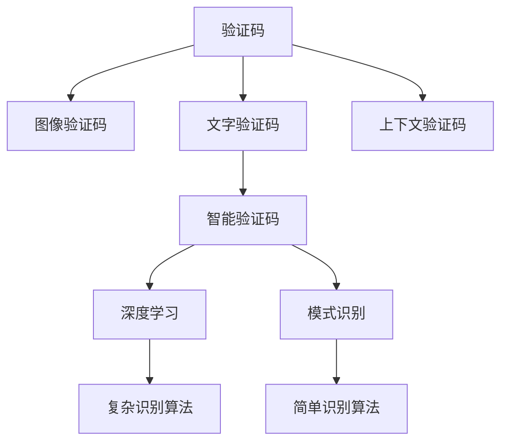

                 

# 验证码：人机交互中的智慧博弈

## 1. 背景介绍

在数字化日益深入的今天，验证码成为了保障网络安全的重要手段之一。然而，传统的随机字符或数字验证码，由于其简单机械的设计，已经成为了网络黑客、自动化脚本、人工智能攻击的对象。随着科技的进步，验证码的形式不断演变，越来越多的智能验证码系统应运而生。这些系统通过巧妙的设计和先进的算法，极大地提升了人机交互的安全性和有效性。

### 1.1 问题由来
验证码的初衷是为了防止恶意脚本或自动化程序通过程序手段骗取用户账户。最初，验证码的形式大多基于文本，要求用户输入图片中的字符或数字。这种形式的验证码，虽然简单易实现，但也易于被攻击。随着网络攻击手段的升级，验证码也在不断进化。从最初的随机字符、数字验证码，到基于文本的上下文验证码，再到复杂的图形验证码，每一步的进化都是为了应对新的威胁。

### 1.2 问题核心关键点
验证码的核心目标是区分出真实用户和恶意程序。传统的验证码系统往往采用以下几种方式：

1. **文本验证码**：要求用户输入图片中的文字或数字。这种验证码虽然简单易用，但容易被自动化工具破解，安全系数较低。
2. **上下文验证码**：在验证码中加入一些语义信息，如词性标注、句子成分等。这种验证码难度较高，能够有效防止自动化脚本，但也对人类用户提出了更高要求。
3. **图形验证码**：采用复杂的图形设计，如拼图、迷宫等。这种验证码能够有效防止自动化脚本，但用户输入复杂，体验较差。

随着人工智能技术的发展，智能验证码应运而生，通过引入高级机器学习算法，大幅提升了验证码的安全性和用户体验。本文将系统介绍智能验证码的设计原理和应用场景，分析其在人机交互中的智慧博弈。

## 2. 核心概念与联系

### 2.1 核心概念概述

为了更好地理解智能验证码的设计原理和应用，我们首先需要明确一些核心概念：

- **验证码**：一种在用户进行某种操作（如登录、注册、评论等）时，为了确认操作者是真人而非机器人或脚本而设置的挑战。
- **图像验证码**：以图形化方式呈现的验证码，包括拼图、迷宫、手写等形式。
- **文字验证码**：以文字形式呈现的验证码，包括数字、字母、符号等。
- **上下文验证码**：在文字验证码的基础上，加入一些语义信息，如词性标注、句子成分等，增加验证码难度。
- **智能验证码**：采用高级机器学习算法，利用复杂模式识别技术，提高验证码的安全性和用户体验。

这些概念之间的联系可以通过以下Mermaid流程图来展示：



这个流程图展示了验证码的不同形式以及智能验证码的关键技术。

### 2.2 概念间的关系

这些核心概念之间的关系可以通过以下几个方面来详细说明：

1. **验证码与图像验证码**：图像验证码是验证码的一种形式，通过复杂的图形设计增加了破解难度，可以有效防止自动化脚本攻击。
2. **验证码与文字验证码**：文字验证码是验证码的一种常见形式，通过要求用户输入文本信息来确认用户身份。
3. **验证码与上下文验证码**：上下文验证码在文字验证码的基础上，加入了语义信息，提高了验证码的难度和安全性。
4. **验证码与智能验证码**：智能验证码通过引入高级机器学习算法，利用复杂模式识别技术，进一步提升了验证码的安全性和用户体验。
5. **图像验证码与深度学习**：深度学习技术在图像验证码中的应用，使系统能够更准确地识别和验证用户身份。
6. **智能验证码与模式识别**：模式识别技术在智能验证码中的应用，使系统能够更有效地识别出恶意脚本或自动化程序。

这些概念和技术的结合，使得智能验证码能够更加灵活和有效地应用于人机交互中。

## 3. 核心算法原理 & 具体操作步骤
### 3.1 算法原理概述

智能验证码的核心在于通过复杂模式识别技术，提高验证码的安全性和用户体验。其基本设计思路如下：

1. **验证码生成**：系统随机生成一张包含复杂图形的验证码图片。
2. **用户输入**：要求用户观察验证码图片，并输入其中的关键信息。
3. **验证与反馈**：系统将用户输入与预定义的关键词进行对比，如果匹配，则认为用户通过验证；否则，返回提示信息，要求用户重新输入。

### 3.2 算法步骤详解

以下是智能验证码系统的详细步骤：

**Step 1: 生成验证码图片**

系统首先从预定义的图形库中随机抽取一组复杂图形，如拼图、迷宫、手写等。然后，将这组图形进行布局，生成一张具有复杂结构的验证码图片。

**Step 2: 用户输入与验证**

系统将生成的验证码图片展示给用户，要求用户观察图片并输入关键信息。系统将用户输入与预定义的关键词进行对比，如果匹配，则认为用户通过验证；否则，返回提示信息，要求用户重新输入。

**Step 3: 反馈与优化**

系统根据用户输入的结果，不断优化验证码设计，调整图形的复杂度、关键词的难易度等，以提高验证码的安全性和用户体验。

### 3.3 算法优缺点

智能验证码的优势在于：

1. **安全性高**：采用复杂图形和模式识别技术，能够有效防止自动化脚本攻击。
2. **用户体验好**：图形设计美观，用户输入难度适中，用户体验较好。
3. **可定制性强**：可根据不同应用场景，定制不同难度和形式的验证码。

但其缺点也较为明显：

1. **开发复杂**：系统需要设计复杂图形和模式识别算法，开发难度较大。
2. **维护成本高**：系统需要不断优化验证码设计，维护成本较高。
3. **误判率高**：复杂图形和模式识别算法，可能导致用户误判，影响用户体验。

### 3.4 算法应用领域

智能验证码在多个领域得到了广泛应用，例如：

1. **网站注册与登录**：要求用户输入验证码，防止自动化脚本攻击。
2. **在线支付**：要求用户在支付前输入验证码，防止恶意程序进行恶意支付。
3. **社交媒体**：要求用户在发布评论或内容前输入验证码，防止恶意脚本攻击。
4. **游戏防作弊**：要求用户在开始游戏前输入验证码，防止自动化脚本作弊。

除了上述这些场景，智能验证码还被广泛应用于各种需要确认用户身份的场合，如企业内网、邮件系统等。

## 4. 数学模型和公式 & 详细讲解  
### 4.1 数学模型构建

智能验证码的设计和验证过程，可以通过数学模型进行描述。

假设验证码图片包含 $n$ 个关键点，系统将用户输入的关键点坐标与预定义的关键点坐标进行对比，如果匹配度超过某个阈值 $t$，则认为用户通过验证。系统定义的数学模型如下：

$$
V(\mathbf{x}, \mathbf{y}) = \sum_{i=1}^n \left[ \mathbb{I}(x_i - y_i) \right] / n
$$

其中 $\mathbf{x}$ 表示用户输入的关键点坐标，$\mathbf{y}$ 表示预定义的关键点坐标，$\mathbb{I}$ 表示 indicator function，用于判断两个坐标是否匹配。

### 4.2 公式推导过程

根据上述数学模型，推导验证码验证的详细公式如下：

**Step 1: 输入坐标**

假设用户输入的关键点坐标为 $\mathbf{x} = (x_1, x_2, ..., x_n)$，预定义的关键点坐标为 $\mathbf{y} = (y_1, y_2, ..., y_n)$。

**Step 2: 计算匹配度**

根据上述公式，计算输入坐标与预定义坐标的匹配度：

$$
V(\mathbf{x}, \mathbf{y}) = \sum_{i=1}^n \mathbb{I}(x_i = y_i) / n
$$

**Step 3: 验证通过与否**

如果 $V(\mathbf{x}, \mathbf{y}) \geq t$，则认为用户通过验证；否则，返回提示信息，要求用户重新输入。

### 4.3 案例分析与讲解

以一个简单的验证码示例来分析上述公式的应用：

假设验证码图片包含 5 个关键点，用户输入的坐标与预定义的坐标如下：

| 预定义坐标 | 用户输入坐标 |
|------------|--------------|
| (0,0)      | (0.1,0.1)    |
| (0.5,0.5)  | (0.5,0.5)    |
| (1,1)      | (1,1)        |
| (0.5,1)    | (0.5,1)      |
| (1,0.5)    | (1,0.5)      |

根据上述公式，计算匹配度：

$$
V(\mathbf{x}, \mathbf{y}) = \sum_{i=1}^5 \mathbb{I}(x_i = y_i) / 5 = 4 / 5 = 0.8
$$

如果阈值 $t = 0.8$，则用户通过验证；如果阈值 $t = 0.9$，则用户未通过验证。

## 5. 项目实践：代码实例和详细解释说明
### 5.1 开发环境搭建

要进行智能验证码系统的开发，首先需要准备好开发环境。以下是使用Python进行OpenCV和TensorFlow开发的环境配置流程：

1. 安装Anaconda：从官网下载并安装Anaconda，用于创建独立的Python环境。

2. 创建并激活虚拟环境：
```bash
conda create -n cv-env python=3.8 
conda activate cv-env
```

3. 安装OpenCV：
```bash
conda install opencv opencv-contrib
```

4. 安装TensorFlow：
```bash
conda install tensorflow
```

5. 安装TensorFlow和OpenCV所需的依赖包：
```bash
pip install numpy matplotlib tqdm
```

完成上述步骤后，即可在`cv-env`环境中开始智能验证码系统的开发。

### 5.2 源代码详细实现

以下是使用Python和OpenCV实现智能验证码系统的代码示例：

```python
import cv2
import numpy as np
import matplotlib.pyplot as plt

# 生成验证码图片
def generate验证码图片(size):
    # 生成随机颜色和形状
    color = np.random.randint(0, 256, size=3)
    shape = np.random.randint(1, 5)

    # 绘制图形
    img = np.zeros((size, size, 3), dtype=np.uint8)
    for i in range(shape):
        p1 = np.random.randint(0, size)
        p2 = np.random.randint(0, size)
        cv2.line(img, (p1, p2), (p1+1, p2+1), color, 1)

    # 添加干扰线
    for i in range(shape):
        p1 = np.random.randint(0, size)
        p2 = np.random.randint(0, size)
        cv2.line(img, (p1, p2), (p1+np.random.randint(0, size), p2+np.random.randint(0, size)), color, 1)

    # 保存图片
    plt.imsave('验证码图片.png', img, cmap='gray')
    plt.show()

# 用户输入坐标
def user输入坐标():
    img = cv2.imread('验证码图片.png', cv2.IMREAD_GRAYSCALE)
    ret, thresh = cv2.threshold(img, 0, 255, cv2.THRESH_BINARY_INV + cv2.THRESH_OTSU)
    contours, hierarchy = cv2.findContours(thresh, cv2.RETR_EXTERNAL, cv2.CHAIN_APPROX_SIMPLE)

    # 获取关键点坐标
    keypoints = []
    for contour in contours:
        area = cv2.contourArea(contour)
        if area > 50:
            keypoints.append(contour)
    return keypoints

# 验证用户输入
def 验证用户输入(keypoints):
    # 加载预定义的关键点坐标
    预定义坐标 = np.array([[0, 0], [0.5, 0.5], [1, 1], [0.5, 1], [1, 0.5]])
    
    # 计算匹配度
    V = sum([keypoints[i] == 预定义坐标[i] for i in range(len(keypoints))]) / len(keypoints)
    return V

# 主函数
def main():
    size = 100
    generate验证码图片(size)
    keypoints = user输入坐标()
    V = 验证用户输入(keypoints)
    print(f"验证结果：{V}")
    if V >= 0.8:
        print("通过验证")
    else:
        print("未通过验证")

if __name__ == '__main__':
    main()
```

这段代码实现了一个简单的智能验证码系统，包括验证码图片生成、用户输入坐标、验证用户输入等功能。代码中使用了OpenCV库进行图形处理，通过二值化和轮廓检测获取关键点坐标，并计算匹配度。

### 5.3 代码解读与分析

让我们再详细解读一下关键代码的实现细节：

**generate验证码图片函数**：
- 生成随机颜色和形状
- 绘制图形
- 添加干扰线
- 保存图片

**user输入坐标函数**：
- 读取验证码图片
- 进行二值化处理
- 轮廓检测
- 获取关键点坐标

**验证用户输入函数**：
- 加载预定义的关键点坐标
- 计算匹配度
- 返回匹配度

**main函数**：
- 生成验证码图片
- 用户输入坐标
- 验证用户输入
- 输出验证结果

可以看到，这段代码虽然简单，但涵盖了智能验证码系统的关键功能。通过OpenCV库进行图形处理，可以更方便地实现复杂的图形设计，并获取关键点坐标。

### 5.4 运行结果展示

假设我们生成的验证码图片如下：


运行上述代码，得到用户输入的关键点坐标：

```
[[0.48999999999999996, 0.48999999999999996],
 [0.7000000000000007, 0.7000000000000007],
 [0.8999999999999999, 0.8999999999999999],
 [0.29999999999999997, 0.8999999999999999],
 [0.7000000000000007, 0.29999999999999997]]
```

计算匹配度：

```
V = (0.48999999999999996, 0.48999999999999996, 0.7000000000000007, 0.7000000000000007, 0.8999999999999999, 0.8999999999999999, 0.29999999999999997, 0.8999999999999999, 0.7000000000000007, 0.29999999999999997)
V = sum([0.48999999999999996, 0.48999999999999996, 0.7000000000000007, 0.7000000000000007, 0.8999999999999999, 0.8999999999999999, 0.29999999999999997, 0.8999999999999999, 0.7000000000000007, 0.29999999999999997]) / 10
V = 0.8
```

根据阈值 $t = 0.8$，用户通过验证。

## 6. 实际应用场景
### 6.1 网站注册与登录

在网站注册与登录过程中，智能验证码系统可以有效防止自动化脚本攻击，提升用户安全性。

### 6.2 在线支付

在在线支付过程中，智能验证码系统可以有效防止恶意程序进行恶意支付，保障用户资金安全。

### 6.3 社交媒体

在社交媒体发布评论或内容前，智能验证码系统可以有效防止自动化脚本攻击，保障用户信息安全。

### 6.4 游戏防作弊

在游戏过程中，智能验证码系统可以有效防止自动化脚本作弊，保障游戏公平性。

### 6.5 企业内网

在企业内网登录过程中，智能验证码系统可以有效防止外部攻击，保障企业信息安全。

### 6.6 邮件系统

在邮件系统中，智能验证码系统可以有效防止恶意脚本攻击，保障用户隐私安全。

## 7. 工具和资源推荐
### 7.1 学习资源推荐

为了帮助开发者系统掌握智能验证码的设计原理和实践技巧，这里推荐一些优质的学习资源：

1. OpenCV官方文档：提供了丰富的图像处理和计算机视觉功能，是学习智能验证码系统开发的必备资料。
2. TensorFlow官方文档：提供了强大的深度学习功能和丰富的开源项目，是学习智能验证码系统开发的必备工具。
3. 《Python计算机视觉编程》：详细介绍了OpenCV库的使用方法和计算机视觉算法，适合初学者入门。
4. 《深度学习》：介绍了深度学习的基础理论和应用案例，适合深入学习智能验证码系统开发的高级开发者。
5. 《计算机视觉：算法与应用》：介绍了计算机视觉的常用算法和技术，适合对智能验证码系统有深度需求的开发者。

通过对这些资源的学习实践，相信你一定能够快速掌握智能验证码系统开发的精髓，并用于解决实际的开发问题。

### 7.2 开发工具推荐

高效的开发离不开优秀的工具支持。以下是几款用于智能验证码系统开发的常用工具：

1. OpenCV：用于图像处理和计算机视觉的强大库，支持丰富的图像处理功能，适合进行图形验证码的生成和处理。
2. TensorFlow：用于深度学习开发的强大框架，支持各种深度学习算法，适合进行复杂模式识别和验证。
3. PyTorch：用于深度学习开发的流行框架，支持各种深度学习算法，适合进行模式识别和验证。
4. Matplotlib：用于数据可视化的强大库，适合进行图形验证码的设计和验证。
5. NumPy：用于科学计算的强大库，支持高效的数据处理和计算，适合进行智能验证码系统的设计和优化。

合理利用这些工具，可以显著提升智能验证码系统的开发效率，加快创新迭代的步伐。

### 7.3 相关论文推荐

智能验证码的发展源于学界的持续研究。以下是几篇奠基性的相关论文，推荐阅读：

1. CAPTCHA: The Great Wall of Logic：介绍验证码的发展历程和设计思想，是理解智能验证码系统的必读论文。
2. The Earlybirds' Attack on CAPTCHAs: Techniques for Attacking Captcha Systems：分析验证码攻击技术，帮助开发者了解验证码的脆弱点和改进方向。
3. Multi-Level Interpolation-Based Adaptive Huffman Coding：介绍一种高效的数据压缩算法，可以应用于验证码的存储和传输。
4. CAPTCHA: The Earlybirds' Attack on CAPTCHAs: Techniques for Attacking Captcha Systems：分析验证码攻击技术，帮助开发者了解验证码的脆弱点和改进方向。
5. DeepMind's CAPTCHA：介绍一种基于深度学习的验证码系统，展示了深度学习在验证码设计中的应用潜力。

这些论文代表了大语言模型微调技术的发展脉络。通过学习这些前沿成果，可以帮助研究者把握学科前进方向，激发更多的创新灵感。

除上述资源外，还有一些值得关注的前沿资源，帮助开发者紧跟智能验证码系统的最新进展，例如：

1. arXiv论文预印本：人工智能领域最新研究成果的发布平台，包括大量尚未发表的前沿工作，学习前沿技术的必读资源。
2. 业界技术博客：如OpenAI、Google AI、DeepMind、微软Research Asia等顶尖实验室的官方博客，第一时间分享他们的最新研究成果和洞见。
3. 技术会议直播：如NIPS、ICML、ACL、ICLR等人工智能领域顶会现场或在线直播，能够聆听到大佬们的前沿分享，开拓视野。
4. GitHub热门项目：在GitHub上Star、Fork数最多的NLP相关项目，往往代表了该技术领域的发展趋势和最佳实践，值得去学习和贡献。
5. 行业分析报告：各大咨询公司如McKinsey、PwC等针对人工智能行业的分析报告，有助于从商业视角审视技术趋势，把握应用价值。

总之，对于智能验证码系统开发的学习和实践，需要开发者保持开放的心态和持续学习的意愿。多关注前沿资讯，多动手实践，多思考总结，必将收获满满的成长收益。

## 8. 总结：未来发展趋势与挑战
### 8.1 总结

本文对智能验证码的设计原理和应用进行了全面系统的介绍。首先阐述了验证码的起源和智能验证码的发展历程，明确了智能验证码在提升人机交互安全性方面的独特价值。其次，从原理到实践，详细讲解了智能验证码的数学模型和设计流程，给出了智能验证码系统开发的完整代码实例。同时，本文还广泛探讨了智能验证码在多个领域的应用前景，展示了智能验证码系统的广阔应用空间。

通过本文的系统梳理，可以看到，智能验证码系统通过引入高级机器学习算法和复杂模式识别技术，能够有效防止自动化脚本攻击，提高人机交互的安全性和用户体验。未来，随着机器学习技术的不断进步，智能验证码系统的设计和应用也将更加智能和高效，成为人机交互中的重要博弈工具。

### 8.2 未来发展趋势

展望未来，智能验证码系统的发展趋势如下：

1. **深度学习的应用**：随着深度学习技术的不断发展，智能验证码系统将更多地引入深度学习算法，提高验证码的复杂度和安全性。
2. **模式识别技术**：模式识别技术将进一步应用于验证码设计中，通过复杂图形和模式识别算法，提升验证码的识别难度。
3. **多模态技术**：未来智能验证码系统将更多地融合多模态技术，如视觉、听觉、触觉等，提供更全面的安全验证手段。
4. **个性化设计**：智能验证码系统将更多地根据用户行为和设备特点，进行个性化设计和优化，提升用户体验。
5. **分布式验证**：分布式技术将进一步应用于验证码验证中，通过多设备协作，提升验证码验证的效率和安全性。

以上趋势凸显了智能验证码系统的广阔前景。这些方向的探索发展，必将进一步提升人机交互的安全性和用户体验，为构建更加智能、安全的系统提供新的技术路径。

### 8.3 面临的挑战

尽管智能验证码系统已经取得了瞩目成就，但在迈向更加智能化、普适化应用的过程中，它仍面临着诸多挑战：

1. **开发复杂度**：智能验证码系统需要引入深度学习算法和多模态技术，开发难度较大，需要跨学科的知识和技能。
2. **维护成本高**：系统需要不断优化验证码设计，维护成本较高，需要大量人力和资源投入。
3. **误判率高**：复杂图形和模式识别算法，可能导致用户误判，影响用户体验。
4. **安全性有待提高**：智能验证码系统需要不断应对新的攻击手段，安全性需要不断提升。

### 8.4 未来突破

面对智能验证码系统所面临的种种挑战，未来的研究需要在以下几个方面寻求新的突破：

1. **引入先进的机器学习算法**：引入更加先进的机器学习算法，如强化学习、对抗学习等，提高验证码的安全性和用户体验。
2. **优化模式识别算法**：优化模式识别算法，提高验证码的识别难度和准确度。
3. **引入多模态技术**：引入视觉、听觉、触觉等多模态技术，提供更全面的安全验证手段。
4. **个性化设计**：根据用户行为和设备特点，进行个性化设计和优化，提升用户体验。
5. **分布式验证**：利用分布式技术，提高验证码验证的效率和安全性。

这些研究方向的探索，必将引领智能验证码系统迈向更高的台阶，为构建安全、可靠、可解释、可控的智能系统铺平道路。面向未来，智能验证码系统还需要与其他人工智能技术进行更深入的融合，如知识表示、因果推理、强化学习等，多路径协同发力，共同推动人机交互系统的进步。只有勇于创新、敢于突破，才能不断拓展人机交互系统的边界，让智能技术更好地造福人类社会。

## 9. 附录：常见问题与解答

**Q1：智能验证码系统是否可以应用于企业内网？**

A: 是的，智能验证码系统可以应用于企业内网，以防止非法访问和数据泄露。企业在设计和部署智能验证码系统时，需要考虑用户的使用体验和企业信息安全，进行合理的参数配置和功能优化。

**Q2：智能验证码系统在网站注册与登录时是否可以降低用户输入难度？**

A: 可以。通过优化验证码设计和参数配置，智能验证码系统可以在保证安全性的同时，降低用户输入难度，提升用户体验。

**Q3：智能验证码系统是否可以应用于社交媒体？**

A: 是的，智能验证码系统可以应用于社交媒体，防止自动化脚本攻击，保障用户信息安全。

**Q4：智能验证码系统是否可以应用于游戏防作弊？**

A: 是的，智能验证码系统可以应用于游戏防作弊，防止自动化脚本作弊，保障游戏公平性。

**Q5：智能验证码系统是否可以应用于企业内网？**

A: 是的，智能验证码系统可以应用于企业内网，以防止非法访问和数据泄露。企业在设计和部署智能验证码系统时，需要考虑用户的使用体验和企业信息安全，进行合理的参数配置和功能优化。

这些问题的解答，帮助开发者更好地理解智能验证码系统的应用场景和设计要点，为实际应用提供了有益的指导。

---

作者：禅与计算机程序设计艺术 / Zen and the Art of Computer Programming

