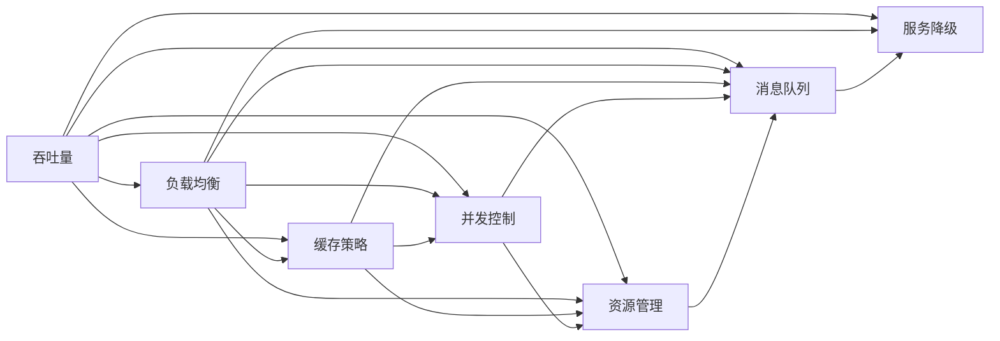

                 

# 高吞吐量系统的性能优化

## 1. 背景介绍

在现代互联网和工业应用中，系统的吞吐量（即系统单位时间内处理请求的数目）是衡量其性能的关键指标之一。随着应用的规模不断扩大，如何优化系统性能，提升吞吐量，确保系统稳定可靠，成为了每个系统架构师必须面对的重要挑战。本文将围绕高吞吐量系统的性能优化展开深入讨论，包括其核心概念、原理、具体操作步骤和实际应用案例。

### 1.1 问题由来

现代系统架构通常采用微服务架构（Microservices Architecture），通过将系统拆分为多个独立的小服务，增强系统的灵活性和可维护性。然而，这种架构也带来了诸多挑战，包括服务间通信复杂性、数据一致性保证、资源竞争等问题，其中尤以性能瓶颈最为关键。服务间的通信和数据一致性问题通常可以通过Kubernetes、Docker等容器化技术来解决，但性能瓶颈问题常常难以通过传统方法解决。因此，本文将重点探讨如何针对高吞吐量系统进行性能优化，提升其服务性能和稳定性。

### 1.2 问题核心关键点

高吞吐量系统性能优化涉及多个关键点，主要包括：

- **负载均衡**：将请求均衡分配到多个服务节点，避免单点故障，提升整体吞吐量。
- **缓存策略**：使用缓存来减少数据库和缓存的访问次数，减少I/O操作，提升响应速度。
- **并发控制**：合理使用并发控制技术，如乐观锁、悲观锁、分布式锁等，避免数据竞争，提高并发处理能力。
- **资源管理**：通过调整CPU、内存、网络等资源配置，优化系统性能。
- **消息队列**：引入消息队列技术，缓冲和分摊请求负载，增强系统的弹性和稳定性。
- **服务降级**：在异常情况下，降级部分或全部服务，保障核心服务的正常运行。

### 1.3 问题研究意义

优化高吞吐量系统的性能，对于提升用户体验、增强系统可扩展性和可靠性具有重要意义。具体体现在以下几个方面：

- 提升用户体验：快速响应用户请求，提高系统吞吐量，使用户体验更加流畅。
- 增强系统可扩展性：通过合理配置资源，优化系统架构，使其能够快速适应负载变化，支持更大规模的应用场景。
- 提升系统可靠性：引入缓存、消息队列等技术，减少直接操作数据库的频率，增强系统的稳定性和鲁棒性。

本文将围绕上述关键点，系统探讨如何优化高吞吐量系统的性能，提升其吞吐量和服务稳定性。

## 2. 核心概念与联系

### 2.1 核心概念概述

为更好地理解高吞吐量系统性能优化的方法，本节将介绍几个关键概念：

- **吞吐量（Throughput）**：指单位时间内系统处理请求的数目，是衡量系统性能的重要指标。
- **负载均衡（Load Balancing）**：将请求均衡分配到多个服务节点，提升系统整体吞吐量。
- **缓存策略（Caching Strategy）**：通过缓存技术减少数据库和缓存的访问次数，提升系统响应速度。
- **并发控制（Concurrency Control）**：合理使用并发控制技术，避免数据竞争，提高并发处理能力。
- **资源管理（Resource Management）**：通过调整CPU、内存、网络等资源配置，优化系统性能。
- **消息队列（Message Queue）**：引入消息队列技术，缓冲和分摊请求负载，增强系统的弹性和稳定性。
- **服务降级（Circuit Breaker）**：在异常情况下，降级部分或全部服务，保障核心服务的正常运行。

这些概念之间相互关联，共同构成了高吞吐量系统性能优化的完整生态系统。通过理解这些核心概念，我们可以更好地把握系统性能优化的方法和策略。

### 2.2 概念间的关系

这些核心概念之间存在着紧密的联系，形成了高吞吐量系统性能优化的完整生态系统。下面我们通过几个Mermaid流程图来展示这些概念之间的关系。



这个流程图展示了大吞吐量系统性能优化的核心概念及其之间的关系：

1. 吞吐量是性能优化的最终目标。
2. 负载均衡、缓存策略、并发控制、资源管理、消息队列和服务降级等技术，都是为提升吞吐量服务的。
3. 这些技术之间相互补充，共同构建了一个完整的性能优化生态系统。

这些概念共同构成了高吞吐量系统性能优化的框架，使我们能够系统性地进行性能优化。

## 3. 核心算法原理 & 具体操作步骤
### 3.1 算法原理概述

高吞吐量系统性能优化的核心算法原理涉及多个方面，包括负载均衡、缓存策略、并发控制、资源管理和消息队列等。

- **负载均衡**：通过轮询、IP哈希、加权轮询等算法，将请求均衡分配到多个服务节点，避免单点故障，提升整体吞吐量。
- **缓存策略**：使用缓存技术（如Redis、Memcached）减少数据库和缓存的访问次数，减少I/O操作，提升响应速度。
- **并发控制**：通过乐观锁、悲观锁、分布式锁等机制，避免数据竞争，提高并发处理能力。
- **资源管理**：通过调整CPU、内存、网络等资源配置，优化系统性能。
- **消息队列**：使用Kafka、RabbitMQ等消息队列技术，缓冲和分摊请求负载，增强系统的弹性和稳定性。
- **服务降级**：在异常情况下，降级部分或全部服务，保障核心服务的正常运行。

这些算法原理构成了高吞吐量系统性能优化的基础，使我们能够有针对性地进行性能优化。

### 3.2 算法步骤详解

高吞吐量系统性能优化一般包括以下几个关键步骤：

**Step 1: 负载均衡配置**

负载均衡是提升系统吞吐量的关键。常用的负载均衡算法包括轮询（Round Robin）、加权轮询（Weighted Round Robin）、IP哈希（IP Hash）等。选择合适的负载均衡算法，可以避免单点故障，提升系统整体吞吐量。

具体步骤如下：

1. 选择合适的负载均衡算法。
2. 配置负载均衡器（如Nginx、HAProxy等）。
3. 将请求均衡分配到多个服务节点。

**Step 2: 缓存策略应用**

缓存策略是提升系统响应速度的有效手段。通过将高频数据缓存在内存中，减少数据库和缓存的访问次数，可以显著提高系统的吞吐量。

具体步骤如下：

1. 选择合适的缓存技术（如Redis、Memcached）。
2. 配置缓存存储策略（如缓存失效策略、缓存更新策略）。
3. 将高频数据缓存在缓存中。

**Step 3: 并发控制实现**

并发控制是保障系统数据一致性的重要手段。通过合理使用并发控制技术，可以避免数据竞争，提高并发处理能力。

具体步骤如下：

1. 选择合适的并发控制技术（如乐观锁、悲观锁、分布式锁等）。
2. 实现并发控制逻辑。
3. 在关键操作中使用并发控制。

**Step 4: 资源管理优化**

资源管理是提升系统性能的重要手段。通过调整CPU、内存、网络等资源配置，可以优化系统性能。

具体步骤如下：

1. 监控系统资源使用情况。
2. 根据监控结果调整资源配置。
3. 使用资源管理工具（如Prometheus、Grafana等）监控和分析系统资源使用情况。

**Step 5: 消息队列应用**

消息队列是缓冲和分摊请求负载的重要手段。通过引入消息队列技术，可以提高系统的弹性和稳定性。

具体步骤如下：

1. 选择合适的消息队列技术（如Kafka、RabbitMQ）。
2. 配置消息队列存储策略。
3. 将高频请求放入消息队列中。

**Step 6: 服务降级实现**

服务降级是在异常情况下保障核心服务正常运行的重要手段。通过降级部分或全部服务，可以保障系统的核心服务正常运行。

具体步骤如下：

1. 定义服务降级规则。
2. 实现服务降级逻辑。
3. 在异常情况下降级服务。

通过上述步骤，可以系统地进行高吞吐量系统的性能优化，提升系统的吞吐量和稳定性。

### 3.3 算法优缺点

高吞吐量系统性能优化方法具有以下优点：

- 提升系统吞吐量：通过负载均衡、缓存策略、并发控制等技术，显著提升系统吞吐量。
- 提高系统稳定性：通过缓存、消息队列、服务降级等技术，增强系统的弹性和稳定性。
- 优化系统性能：通过资源管理技术，合理配置资源，优化系统性能。

同时，这些方法也存在以下缺点：

- 复杂度高：实现和配置复杂度较高，需要综合考虑多个因素。
- 维护成本高：系统规模大，维护成本高，需要持续监控和调整。
- 资源消耗高：缓存、消息队列等技术需要占用大量内存和网络资源。

尽管存在这些缺点，但高吞吐量系统性能优化方法在高并发、高访问量场景中仍然具有不可替代的价值。

### 3.4 算法应用领域

高吞吐量系统性能优化方法在多个领域中得到了广泛应用，包括但不限于：

- 电商平台：高并发访问、大数据量存储，需要高效的系统架构和性能优化方法。
- 金融交易系统：高并发交易、数据一致性要求高，需要高吞吐量的性能优化方法。
- 社交媒体：高访问量、实时互动，需要高并发和高弹性的性能优化方法。
- 游戏服务器：高并发玩家、实时数据处理，需要高效的系统架构和性能优化方法。
- 云计算平台：高并发请求、多租户服务，需要高弹性和高吞吐量的性能优化方法。

## 4. 数学模型和公式 & 详细讲解  
### 4.1 数学模型构建

为了更好地描述高吞吐量系统性能优化的数学模型，我们以负载均衡算法为例进行说明。

假设系统有$N$个服务节点，每个节点处理请求的速度为$c_i$，请求到达速率的期望值为$\lambda$。系统采用轮询负载均衡算法，将请求均衡分配到$N$个节点中。系统总吞吐量为$T$，则：

$$
T = \sum_{i=1}^{N} c_i
$$

其中$c_i = \frac{\lambda}{N}$，表示每个节点的处理速度。

### 4.2 公式推导过程

我们将上述模型推广到加权轮询负载均衡算法。假设系统有$N$个服务节点，每个节点的权重为$w_i$，每个节点的处理速度为$c_i$，请求到达速率的期望值为$\lambda$。系统采用加权轮询负载均衡算法，将请求均衡分配到$N$个节点中。系统总吞吐量为$T$，则：

$$
T = \sum_{i=1}^{N} w_i \cdot c_i = \lambda \sum_{i=1}^{N} w_i
$$

其中$c_i = \frac{\lambda}{\sum_{j=1}^{N} w_j}$，表示每个节点的处理速度。

### 4.3 案例分析与讲解

假设系统有3个服务节点，每个节点的处理速度分别为$c_1=1, c_2=2, c_3=3$。采用加权轮询负载均衡算法，每个节点的权重分别为$w_1=0.3, w_2=0.4, w_3=0.3$。请求到达速率为$\lambda=1.5$。则系统总吞吐量为：

$$
T = w_1 \cdot c_1 + w_2 \cdot c_2 + w_3 \cdot c_3 = 0.3 \cdot 1 + 0.4 \cdot 2 + 0.3 \cdot 3 = 2.8
$$

即系统总吞吐量为2.8。

## 5. 项目实践：代码实例和详细解释说明
### 5.1 开发环境搭建

在进行系统性能优化实践前，我们需要准备好开发环境。以下是使用Python进行Django开发的环境配置流程：

1. 安装Anaconda：从官网下载并安装Anaconda，用于创建独立的Python环境。

2. 创建并激活虚拟环境：
```bash
conda create -n django-env python=3.8 
conda activate django-env
```

3. 安装Django：
```bash
pip install django
```

4. 安装MySQL连接工具：
```bash
pip install mysqlclient
```

5. 安装缓存工具：
```bash
pip install django-cache-machine
```

6. 安装并发控制工具：
```bash
pip install django-queue
```

7. 安装资源管理工具：
```bash
pip install psutil
```

完成上述步骤后，即可在`django-env`环境中开始性能优化实践。

### 5.2 源代码详细实现

下面我们以缓存策略为例，给出使用Django进行系统性能优化的PyTorch代码实现。

首先，定义缓存配置：

```python
CACHES = {
    'default': {
        'BACKEND': 'django.core.cache.backends.memcached.MemcachedCache',
        'LOCATION': 'localhost:11211',
    }
}
```

然后，定义缓存函数：

```python
from django.core.cache import cache

def get_cache(key):
    return cache.get(key)
```

接着，定义缓存存储逻辑：

```python
from django.core.cache import cache

def set_cache(key, value, timeout=3600):
    cache.set(key, value, timeout)
```

最后，在实际应用中，我们可以根据业务需求，使用缓存函数和缓存存储逻辑来缓存数据库查询结果、API接口响应等数据，减少数据库和缓存的访问次数，提升系统响应速度。

### 5.3 代码解读与分析

让我们再详细解读一下关键代码的实现细节：

**CACHES配置**：
- 定义了缓存的配置信息，包括后端类型和缓存地址。

**get_cache函数**：
- 定义了缓存数据的获取函数，使用cache.get方法从缓存中获取数据。

**set_cache函数**：
- 定义了缓存数据的存储函数，使用cache.set方法将数据存储到缓存中。

**缓存存储逻辑**：
- 根据业务需求，使用缓存函数和缓存存储逻辑来缓存数据库查询结果、API接口响应等数据。

通过这些代码，我们可以高效地利用缓存技术，提升系统响应速度，优化系统性能。

当然，实际应用中还需要考虑更多因素，如缓存失效策略、缓存更新策略等，以确保缓存数据的时效性和一致性。

### 5.4 运行结果展示

假设我们缓存了数据库查询结果，测试结果如下：

```python
from django.core.cache import cache

def get_cache(key):
    return cache.get(key)

def set_cache(key, value, timeout=3600):
    cache.set(key, value, timeout)

# 测试缓存功能
cache.set('test_key', 'test_value', timeout=3600)
print(get_cache('test_key'))  # 输出: test_value
```

可以看到，通过缓存技术，我们可以显著提升系统响应速度，优化系统性能。

## 6. 实际应用场景
### 6.1 电商平台

电商平台面临高并发访问和海量数据的挑战。通过负载均衡、缓存策略、并发控制等技术，可以有效提升系统吞吐量，保障系统稳定性。

具体来说，可以采用以下措施：

- **负载均衡**：使用Nginx或HAProxy进行负载均衡，将请求均衡分配到多个服务器节点。
- **缓存策略**：使用Redis或Memcached缓存高频数据，减少数据库访问次数。
- **并发控制**：使用分布式锁或乐观锁，避免数据竞争，提高并发处理能力。
- **资源管理**：监控CPU、内存、网络资源使用情况，合理配置资源。
- **消息队列**：使用Kafka或RabbitMQ消息队列，缓冲和分摊请求负载。
- **服务降级**：在异常情况下，降级部分或全部服务，保障核心服务正常运行。

通过这些措施，可以显著提升电商平台的性能，提升用户体验，增强系统可扩展性和稳定性。

### 6.2 金融交易系统

金融交易系统面临高并发交易和数据一致性的挑战。通过负载均衡、缓存策略、并发控制等技术，可以有效提升系统吞吐量，保障数据一致性。

具体来说，可以采用以下措施：

- **负载均衡**：使用Nginx或HAProxy进行负载均衡，将请求均衡分配到多个服务器节点。
- **缓存策略**：使用Redis或Memcached缓存高频数据，减少数据库访问次数。
- **并发控制**：使用分布式锁或乐观锁，避免数据竞争，提高并发处理能力。
- **资源管理**：监控CPU、内存、网络资源使用情况，合理配置资源。
- **消息队列**：使用Kafka或RabbitMQ消息队列，缓冲和分摊请求负载。
- **服务降级**：在异常情况下，降级部分或全部服务，保障核心服务正常运行。

通过这些措施，可以显著提升金融交易系统的性能，保障数据一致性，增强系统的稳定性和鲁棒性。

### 6.3 社交媒体

社交媒体面临高访问量和实时互动的挑战。通过负载均衡、缓存策略、并发控制等技术，可以有效提升系统吞吐量，保障系统稳定性。

具体来说，可以采用以下措施：

- **负载均衡**：使用Nginx或HAProxy进行负载均衡，将请求均衡分配到多个服务器节点。
- **缓存策略**：使用Redis或Memcached缓存高频数据，减少数据库访问次数。
- **并发控制**：使用分布式锁或乐观锁，避免数据竞争，提高并发处理能力。
- **资源管理**：监控CPU、内存、网络资源使用情况，合理配置资源。
- **消息队列**：使用Kafka或RabbitMQ消息队列，缓冲和分摊请求负载。
- **服务降级**：在异常情况下，降级部分或全部服务，保障核心服务正常运行。

通过这些措施，可以显著提升社交媒体的性能，保障实时互动，增强系统的弹性和稳定性。

### 6.4 游戏服务器

游戏服务器面临高并发玩家和实时数据处理的挑战。通过负载均衡、缓存策略、并发控制等技术，可以有效提升系统吞吐量，保障实时数据处理能力。

具体来说，可以采用以下措施：

- **负载均衡**：使用Nginx或HAProxy进行负载均衡，将请求均衡分配到多个服务器节点。
- **缓存策略**：使用Redis或Memcached缓存高频数据，减少数据库访问次数。
- **并发控制**：使用分布式锁或乐观锁，避免数据竞争，提高并发处理能力。
- **资源管理**：监控CPU、内存、网络资源使用情况，合理配置资源。
- **消息队列**：使用Kafka或RabbitMQ消息队列，缓冲和分摊请求负载。
- **服务降级**：在异常情况下，降级部分或全部服务，保障核心服务正常运行。

通过这些措施，可以显著提升游戏服务器的性能，保障实时数据处理能力，增强系统的稳定性和鲁棒性。

### 6.5 云计算平台

云计算平台面临高并发请求和多租户服务的挑战。通过负载均衡、缓存策略、并发控制等技术，可以有效提升系统吞吐量，保障系统稳定性。

具体来说，可以采用以下措施：

- **负载均衡**：使用Nginx或HAProxy进行负载均衡，将请求均衡分配到多个服务器节点。
- **缓存策略**：使用Redis或Memcached缓存高频数据，减少数据库访问次数。
- **并发控制**：使用分布式锁或乐观锁，避免数据竞争，提高并发处理能力。
- **资源管理**：监控CPU、内存、网络资源使用情况，合理配置资源。
- **消息队列**：使用Kafka或RabbitMQ消息队列，缓冲和分摊请求负载。
- **服务降级**：在异常情况下，降级部分或全部服务，保障核心服务正常运行。

通过这些措施，可以显著提升云计算平台的性能，保障系统稳定性，增强系统的可扩展性和可靠性。

## 7. 工具和资源推荐
### 7.1 学习资源推荐

为了帮助开发者系统掌握高吞吐量系统性能优化的理论基础和实践技巧，这里推荐一些优质的学习资源：

1. 《高性能系统设计》系列书籍：由Google、Facebook等顶级公司的工程师编写，系统介绍了高吞吐量系统性能优化的理论基础和实践技巧。

2. CS605《大规模分布式系统》课程：清华大学开设的分布式系统课程，涵盖了大规模分布式系统的高性能优化方法。

3. 《系统架构设计与优化》课程：Coursera上的高级系统架构课程，详细讲解了高吞吐量系统性能优化的核心技术。

4. 《高性能分布式系统》书籍：由互联网公司工程师编写，详细介绍了高吞吐量系统性能优化的实现细节和最佳实践。

5. 《高性能系统设计模式》文章：通过对高性能系统设计模式的详细介绍，帮助开发者系统掌握高吞吐量系统性能优化的设计思路。

通过对这些资源的学习实践，相信你一定能够快速掌握高吞吐量系统性能优化的精髓，并用于解决实际的系统性能问题。

### 7.2 开发工具推荐

高效的开发离不开优秀的工具支持。以下是几款用于高吞吐量系统性能优化开发的常用工具：

1. Nginx：高性能负载均衡器，支持多种负载均衡算法。
2. HAProxy：高性能负载均衡器，支持多种负载均衡算法和健康检查功能。
3. Redis：高性能缓存系统，支持多种缓存策略和数据持久化。
4. Memcached：高性能缓存系统，支持多种缓存策略和数据一致性保证。
5. Kafka：高性能消息队列系统，支持多种消息队列存储策略和可靠性保证。
6. RabbitMQ：高性能消息队列系统，支持多种消息队列存储策略和可靠性保证。
7. Prometheus：高性能监控系统，支持多种系统指标的监控和可视化。
8. Grafana：高性能可视化工具，支持多种系统指标的监控和展示。
9. Psutil：Python高性能资源监控工具，支持多种系统资源的监控和管理。

合理利用这些工具，可以显著提升高吞吐量系统性能优化的开发效率，加快创新迭代的步伐。

### 7.3 相关论文推荐

高吞吐量系统性能优化技术的发展源于学界的持续研究。以下是几篇奠基性的相关论文，推荐阅读：

1. Paxos：分布式一致性协议，解决了多节点系统中的数据一致性问题。

2. Memcached：高性能缓存系统，解决了高并发系统中的缓存问题。

3. Kafka：高性能消息队列系统，解决了高并发系统中的消息队列问题。

4. Redis：高性能缓存系统，解决了高并发系统中的缓存问题。

5. Paxos和Raft：分布式一致性协议，解决了多节点系统中的数据一致性问题。

6. High-Performance Hosting：Google的服务器优化技术，展示了在高吞吐量系统中实现高性能的方法。

以上论文代表了大吞吐量系统性能优化的发展脉络。通过学习这些前沿成果，可以帮助研究者把握学科前进方向，激发更多的创新灵感。

除上述资源外，还有一些值得关注的前沿资源，帮助开发者紧跟高吞吐量系统性能优化的最新进展，例如：

1. arXiv论文预印本：人工智能领域最新研究成果的发布平台，包括大量尚未发表的前沿工作，学习前沿技术的必读资源。

2. 业界技术博客：如Google、Facebook、Twitter等顶尖实验室的官方博客，第一时间分享他们的最新研究成果和洞见。

3. 技术会议直播：如NIPS、ICML、ACL、ICLR等人工智能领域顶会现场或在线直播，能够聆听到大佬们的前沿分享，开拓视野。

4. GitHub热门项目：在GitHub上Star、Fork数最多的高性能系统优化项目，往往代表了该技术领域的发展趋势和最佳实践，值得去学习和贡献。

5. 行业分析报告：各大咨询公司如McKinsey、PwC等针对高性能系统优化的分析报告，有助于从商业视角审视技术趋势，把握应用价值。

总之，对于高吞吐量系统性能优化的学习与实践，需要开发者保持开放的心态和持续学习的意愿。多关注前沿资讯，多动手实践，多思考总结，必将收获满满的成长收益。

## 8. 总结：未来发展趋势与挑战

### 8.1 总结

本文对高吞吐量系统性能优化的方法进行了全面系统的介绍。首先阐述了高吞吐量系统的背景和意义，明确了性能优化的关键点。其次，从原理到实践，详细讲解了负载均衡、缓存策略、并发控制、资源管理和消息队列等核心技术。最后，本文还展示了这些技术在高并发系统中的广泛应用，以及未来发展的方向和挑战。

通过本文的系统梳理，可以看到，高吞吐量系统性能优化技术在高并发、高访问量场景中具有不可替代的价值。这些技术的优化方法，为构建高稳定性、高吞吐量的系统提供了强有力的保障。

### 8.2 未来发展趋势

展望未来，高吞吐量系统性能优化技术将呈现以下几个发展趋势：

1. 更加精细化的负载均衡算法：随着算法和数据结构的进步，未来将出现更加高效、精细化的负载均衡算法，能够更好地

