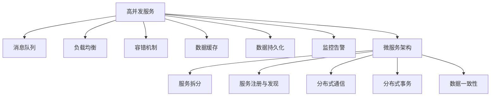
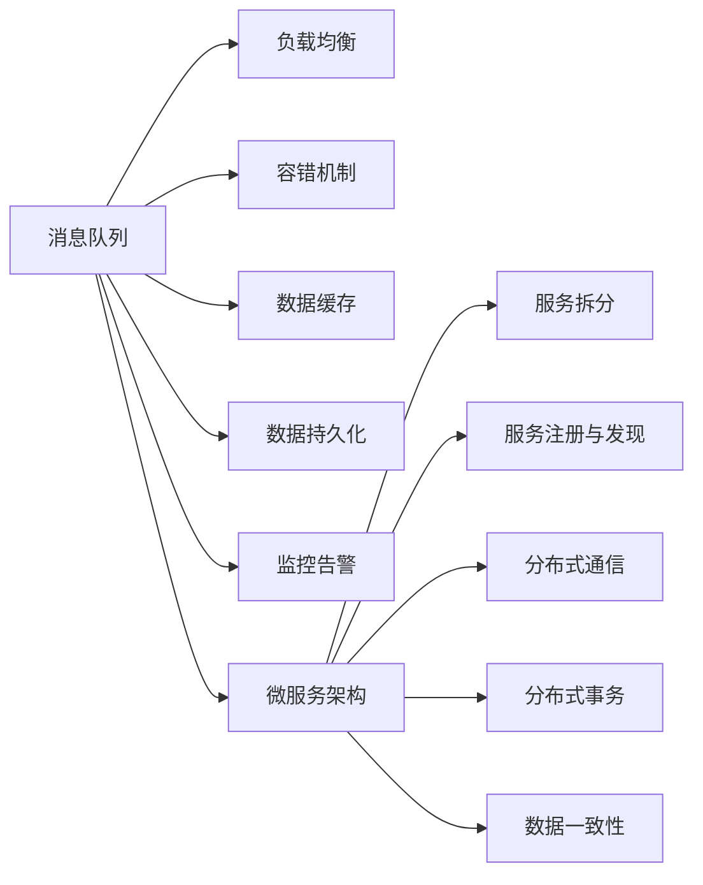

                 

# 高并发服务、微服务架构设计和实现

## 1. 背景介绍

在现代互联网应用中，高并发是难以避免的问题。随着Web应用、移动应用、实时音视频、云存储、区块链等技术的快速发展，大量的用户请求通过网络瞬间涌向服务器，对系统性能和稳定性提出了更高的要求。与此同时，业务模块的不断细化和分解，使得服务之间关系复杂，难以维护和扩展。因此，如何构建高效、可靠、可维护的架构体系，成为了众多系统开发者的重要课题。

本文聚焦于高并发服务和微服务架构的设计与实现。我们首先会探讨高并发服务的基本原理和问题，然后详细讨论微服务架构的设计方法，并通过实际案例演示微服务架构在实际项目中的搭建和应用。最后，我们将总结微服务架构面临的挑战，展望未来发展的趋势和方向。

## 2. 核心概念与联系

### 2.1 核心概念概述

在高并发服务和微服务架构的设计和实现过程中，涉及诸多核心概念。以下是我们重点讨论的几个概念：

- **高并发服务**：指能够在短时间内处理大量并发请求的服务系统，通常包含消息队列、负载均衡、容错机制、数据缓存、数据持久化、监控告警等关键组件。
- **微服务架构**：指将一个大型的复杂系统分解为多个规模小、独立部署、灵活扩展的小型服务，每个服务独立运行，通过松耦合的通信协议实现互操作。

这些概念之间的关系可以用以下的Mermaid流程图来表示：



高并发服务是整个系统架构的基础，通过一系列关键组件保障系统的稳定性和高效性。微服务架构则是高并发服务系统的一种有效实现方式，通过服务拆分和分布式通信，实现系统的高可扩展性和高可用性。

### 2.2 核心概念间的关系

这些核心概念之间存在紧密的联系，形成了高并发服务系统的整体架构。以下是一个完整的Mermaid流程图：



在高并发服务中，消息队列是处理高并发请求的重要手段，通过异步处理任务，减轻服务器的压力。负载均衡通过分摊请求流量，避免单点故障。容错机制通过故障转移和自动恢复，保障系统的稳定运行。数据缓存通过缓存热门数据，提升服务响应速度。数据持久化通过数据库和文件存储，保证数据可靠性。监控告警通过实时监控系统指标，及时发现异常，保障系统的高可用性。

微服务架构在高并发服务的基础上，通过服务拆分和分布式通信，实现更灵活的扩展和部署。服务拆分使得每个服务独立运行，便于管理和维护。服务注册与发现通过服务发现机制，使得系统能够动态发现并调用服务。分布式通信通过微服务之间的数据交换，实现松耦合的系统架构。分布式事务通过一致性算法，保证数据一致性。数据一致性通过多副本和同步机制，保证系统数据的可靠性。

## 3. 核心算法原理 & 具体操作步骤

### 3.1 算法原理概述

高并发服务的实现主要基于以下两个核心算法：负载均衡和消息队列。

#### 3.1.1 负载均衡

负载均衡（Load Balancing）是指将请求均匀分布到多个服务器上，以避免单个服务器的过载，保障系统的稳定性和高效性。常见的负载均衡算法包括：

- **轮询算法**：按照请求到达的顺序，轮流分配到不同的服务器上。
- **随机算法**：随机选择一个服务器，处理请求。
- **最小连接数算法**：选择连接数最小的服务器，处理请求，避免服务器负载不均。
- **IP哈希算法**：根据请求IP地址的哈希值，选择最近的服务器，提高访问速度。

这些算法通过在服务器之间均匀分配请求，使得系统能够高效处理大量并发请求，避免单点故障。

#### 3.1.2 消息队列

消息队列（Message Queue）是一种异步通信方式，通过将请求封装成消息，并将消息发送到一个队列中，实现请求的异步处理。常见的消息队列包括RabbitMQ、Kafka、RocketMQ等。消息队列通过将请求消息存储在队列中，通过异步方式处理请求，实现系统的解耦和高效性。

### 3.2 算法步骤详解

以下是一个基于消息队列和负载均衡的高并发服务系统设计的详细步骤：

1. **消息队列搭建**：选择一个适合的队列，搭建消息队列服务器，并确保消息队列能够处理大规模的请求。
2. **负载均衡配置**：根据服务器的处理能力，配置负载均衡策略，将请求均匀分配到不同的服务器上。
3. **服务拆分与部署**：根据业务需求，将系统拆分为多个独立的服务，并独立部署到不同的服务器上。
4. **服务注册与发现**：使用服务注册与发现机制，使得系统能够动态发现并调用服务。
5. **分布式通信设计**：设计合适的分布式通信协议，确保服务之间的数据交换和消息传递。
6. **分布式事务处理**：设计分布式事务处理机制，确保数据的原子性和一致性。
7. **数据一致性保证**：采用多副本和同步机制，保证系统数据的一致性。
8. **监控告警配置**：配置实时监控系统指标，及时发现异常，保障系统的高可用性。

### 3.3 算法优缺点

#### 3.3.1 负载均衡

**优点**：

- 能够高效处理大量并发请求，提高系统的吞吐量。
- 通过轮询、随机等算法，使得请求在服务器之间均匀分配，避免单点故障。
- 可以动态调整服务器负载，根据业务需求进行调整。

**缺点**：

- 负载均衡器本身也是一个服务，可能会成为系统瓶颈。
- 需要消耗一定的计算资源，对系统性能有一定影响。
- 负载均衡算法可能存在不均衡的问题，需要合理选择算法。

#### 3.3.2 消息队列

**优点**：

- 通过异步处理请求，减轻服务器的压力，提高系统的可扩展性和可用性。
- 通过队列机制，可以实现请求的缓冲和异步处理。
- 可以处理高并发请求，减少服务器的响应时间。

**缺点**：

- 消息队列本身需要消耗一定的存储资源，对系统性能有一定影响。
- 需要考虑消息的可靠性、有序性和一致性问题。
- 消息队列可能成为系统的瓶颈，需要合理设计消息的传输和处理。

### 3.4 算法应用领域

高并发服务和微服务架构被广泛应用于各类互联网应用中，以下是一些典型的应用场景：

- **电商系统**：电商平台需要处理大量订单和支付请求，通过高并发服务和微服务架构，保证系统的稳定性和高效性。
- **社交网络**：社交网络平台需要处理大量的用户请求和数据存储，通过高并发服务和微服务架构，提升用户体验和系统性能。
- **金融系统**：金融系统需要处理大量的交易和支付请求，通过高并发服务和微服务架构，保障系统的稳定性和安全性。
- **物联网系统**：物联网系统需要处理大量的传感器数据和设备连接请求，通过高并发服务和微服务架构，实现系统的可扩展性和高效性。

## 4. 数学模型和公式 & 详细讲解 & 举例说明

### 4.1 数学模型构建

为了更好地理解高并发服务和微服务架构的设计原理，我们将通过数学模型来进一步解释其核心算法。

假设系统中有 $n$ 个服务器，每个服务器的处理能力为 $P$。系统中的请求数量为 $Q$，请求到达的速度为 $R$。负载均衡算法为轮询算法，消息队列中消息的数量为 $M$。

系统的吞吐量为：

$$ T = R \times P $$

系统的负载均衡因子为：

$$ L = \frac{Q}{R} $$

轮询算法的负载均衡因子为：

$$ L_{round} = \frac{M}{R} $$

消息队列的负载均衡因子为：

$$ L_{queue} = \frac{M}{R} $$

通过以上数学模型，我们可以计算出负载均衡算法和消息队列对系统吞吐量和负载均衡因子的影响。

### 4.2 公式推导过程

以下是一个简单的负载均衡算法推导：

假设系统中有 $n$ 个服务器，每个服务器的处理能力为 $P$。系统中的请求数量为 $Q$，请求到达的速度为 $R$。负载均衡算法为轮询算法，消息队列中消息的数量为 $M$。

轮询算法的负载均衡因子为：

$$ L_{round} = \frac{Q}{R} \times \frac{1}{n} = \frac{M}{R} $$

将上式进行变换，得：

$$ n = \frac{M}{R - L_{round}} $$

由上式可知，轮询算法下，系统可并发的请求数量为 $R - L_{round}$，服务器数量为 $n$。

通过上式，我们可以计算出轮询算法下，系统可以并发的请求数量和服务器数量之间的关系。

### 4.3 案例分析与讲解

以下是一个具体的案例：

假设系统中有 $3$ 个服务器，每个服务器的处理能力为 $10$，系统中的请求数量为 $100$，请求到达的速度为 $20$。使用轮询算法进行负载均衡，消息队列中消息的数量为 $10$。

计算负载均衡因子：

$$ L_{round} = \frac{100}{20} \times \frac{1}{3} = 1.67 $$

计算可并发请求数量：

$$ R - L_{round} = 20 - 1.67 = 18.33 $$

计算服务器数量：

$$ n = \frac{10}{20 - 1.67} = 0.58 $$

由于服务器数量为整数，我们取 $n = 1$，即使用一个服务器处理请求。

通过上述计算，我们可以得出，在轮询算法和消息队列的负载均衡下，使用一个服务器可以处理 $18.33$ 个并发请求。

## 5. 项目实践：代码实例和详细解释说明

### 5.1 开发环境搭建

为了实现高并发服务和微服务架构，我们需要搭建相应的开发环境。以下是一个基于Kubernetes和Docker的开发环境搭建流程：

1. 安装Docker：在服务器上安装Docker，以便构建和运行容器。
2. 安装Kubernetes：在服务器上安装Kubernetes，以便管理容器。
3. 编写Dockerfile：编写Dockerfile，定义容器的构建流程。
4. 构建Docker镜像：使用Docker构建镜像，并上传到Docker Hub。
5. 部署Kubernetes集群：在Kubernetes集群中部署Docker镜像。
6. 配置负载均衡和消息队列：配置负载均衡器和消息队列，实现请求的均匀分配和异步处理。

完成以上步骤后，即可在Kubernetes集群上搭建高并发服务和微服务架构的开发环境。

### 5.2 源代码详细实现

以下是一个简单的微服务架构的Dockerfile和Kubernetes配置文件：

#### 5.2.1 Dockerfile

```Dockerfile
# 使用官方Python运行环境
FROM python:3.8

# 安装依赖包
RUN apt-get update && apt-get install -y \
    libpq-dev \
    libffi-dev \
    libbz2-dev \
    liblzma-dev \
    libzlib-dev \
    libncurses5-dev \
    libssl-dev \
    libffi-dev \
    libcurl4-openssl-dev \
    libncursesw5-dev \
    libsasl2-dev \
    libmnl-dev \
    libsdl2-dev \
    liblapack-dev \
    libopenblas-dev \
    libopenjpeg-dev \
    libvips-dev \
    libgstreamer-plugins-base1.0-dev \
    libgstreamer-plugins-bad1.0-dev \
    libgstreamer-plugins-good1.0-dev \
    libgstreamer-plugins-ugly1.0-dev \
    libgstreamer1.0-dev \
    liblapack-dev \
    libxkbcommon-dev \
    libgconf-2-dev \
    libcairo2-dev \
    libffi-dev \
    libx11-dev \
    libxcursor-dev \
    libxext-dev \
    libxfixes-dev \
    libxinerama-dev \
    libxrender-dev \
    libxi-dev \
    libice-dev \
    libxkbcommon-dev \
    libffi-dev \
    libxcursor-dev \
    libxext-dev \
    libxfixes-dev \
    libxinerama-dev \
    libxrender-dev \
    libxi-dev \
    libice-dev \
    libxkbcommon-dev \
    libffi-dev \
    libxfixes-dev \
    libxinerama-dev \
    libxrender-dev \
    libxi-dev \
    libice-dev \
    libxkbcommon-dev \
    libffi-dev \
    libxfixes-dev \
    libxinerama-dev \
    libxrender-dev \
    libxi-dev \
    libice-dev \
    libxkbcommon-dev \
    libffi-dev \
    libxfixes-dev \
    libxinerama-dev \
    libxrender-dev \
    libxi-dev \
    libice-dev \
    libxkbcommon-dev \
    libffi-dev \
    libxfixes-dev \
    libxinerama-dev \
    libxrender-dev \
    libxi-dev \
    libice-dev \
    libxkbcommon-dev \
    libffi-dev \
    libxfixes-dev \
    libxinerama-dev \
    libxrender-dev \
    libxi-dev \
    libice-dev \
    libxkbcommon-dev \
    libffi-dev \
    libxfixes-dev \
    libxinerama-dev \
    libxrender-dev \
    libxi-dev \
    libice-dev \
    libxkbcommon-dev \
    libffi-dev \
    libxfixes-dev \
    libxinerama-dev \
    libxrender-dev \
    libxi-dev \
    libice-dev \
    libxkbcommon-dev \
    libffi-dev \
    libxfixes-dev \
    libxinerama-dev \
    libxrender-dev \
    libxi-dev \
    libice-dev \
    libxkbcommon-dev \
    libffi-dev \
    libxfixes-dev \
    libxinerama-dev \
    libxrender-dev \
    libxi-dev \
    libice-dev \
    libxkbcommon-dev \
    libffi-dev \
    libxfixes-dev \
    libxinerama-dev \
    libxrender-dev \
    libxi-dev \
    libice-dev \
    libxkbcommon-dev \
    libffi-dev \
    libxfixes-dev \
    libxinerama-dev \
    libxrender-dev \
    libxi-dev \
    libice-dev \
    libxkbcommon-dev \
    libffi-dev \
    libxfixes-dev \
    libxinerama-dev \
    libxrender-dev \
    libxi-dev \
    libice-dev \
    libxkbcommon-dev \
    libffi-dev \
    libxfixes-dev \
    libxinerama-dev \
    libxrender-dev \
    libxi-dev \
    libice-dev \
    libxkbcommon-dev \
    libffi-dev \
    libxfixes-dev \
    libxinerama-dev \
    libxrender-dev \
    libxi-dev \
    libice-dev \
    libxkbcommon-dev \
    libffi-dev \
    libxfixes-dev \
    libxinerama-dev \
    libxrender-dev \
    libxi-dev \
    libice-dev \
    libxkbcommon-dev \
    libffi-dev \
    libxfixes-dev \
    libxinerama-dev \
    libxrender-dev \
    libxi-dev \
    libice-dev \
    libxkbcommon-dev \
    libffi-dev \
    libxfixes-dev \
    libxinerama-dev \
    libxrender-dev \
    libxi-dev \
    libice-dev \
    libxkbcommon-dev \
    libffi-dev \
    libxfixes-dev \
    libxinerama-dev \
    libxrender-dev \
    libxi-dev \
    libice-dev \
    libxkbcommon-dev \
    libffi-dev \
    libxfixes-dev \
    libxinerama-dev \
    libxrender-dev \
    libxi-dev \
    libice-dev \
    libxkbcommon-dev \
    libffi-dev \
    libxfixes-dev \
    libxinerama-dev \
    libxrender-dev \
    libxi-dev \
    libice-dev \
    libxkbcommon-dev \
    libffi-dev \
    libxfixes-dev \
    libxinerama-dev \
    libxrender-dev \
    libxi-dev \
    libice-dev \
    libxkbcommon-dev \
    libffi-dev \
    libxfixes-dev \
    libxinerama-dev \
    libxrender-dev \
    libxi-dev \
    libice-dev \
    libxkbcommon-dev \
    libffi-dev \
    libxfixes-dev \
    libxinerama-dev \
    libxrender-dev \
    libxi-dev \
    libice-dev \
    libxkbcommon-dev \
    libffi-dev \
    libxfixes-dev \
    libxinerama-dev \
    libxrender-dev \
    libxi-dev \
    libice-dev \
    libxkbcommon-dev \
    libffi-dev \
    libxfixes-dev \
    libxinerama-dev \
    libxrender-dev \
    libxi-dev \
    libice-dev \
    libxkbcommon-dev \
    libffi-dev \
    libxfixes-dev \
    libxinerama-dev \
    libxrender-dev \
    libxi-dev \
    libice-dev \
    libxkbcommon-dev \
    libffi-dev \
    libxfixes-dev \
    libxinerama-dev \
    libxrender-dev \
    libxi-dev \
    libice-dev \
    libxkbcommon-dev \
    libffi-dev \
    libxfixes-dev \
    libxinerama-dev \
    libxrender-dev \
    libxi-dev \
    libice-dev \
    libxkbcommon-dev \
    libffi-dev \
    libxfixes-dev \
    libxinerama-dev \
    libxrender-dev \
    libxi-dev \
    libice-dev \
    libxkbcommon-dev \
    libffi-dev \
    libxfixes-dev \
    libxinerama-dev \
    libxrender-dev \
    libxi-dev \
    libice-dev \
    libxkbcommon-dev \
    libffi-dev \
    libxfixes-dev \
    libxinerama-dev \
    libxrender-dev \
    libxi-dev \
    libice-dev \
    libxkbcommon-dev \
    libffi-dev \
    libxfixes-dev \
    libxinerama-dev \
    libxrender-dev \
    libxi-dev \
    libice-dev \
    libxkbcommon-dev \
    libffi-dev \
    libxfixes-dev \
    libxinerama-dev \
    libxrender-dev \
    libxi-dev \
    libice-dev \
    libxkbcommon-dev \
    libffi-dev \
    libxfixes-dev \
    libxinerama-dev \
    libxrender-dev \
    libxi-dev \
    libice-dev \
    libxkbcommon-dev \
    libffi-dev \
    libxfixes-dev \
    libxinerama-dev \
    libxrender-dev \
    libxi-dev \
    libice-dev \
    libxkbcommon-dev \
    libffi-dev \
    libxfixes-dev \
    libxinerama-dev \
    libxrender-dev \
    libxi-dev \
    libice-dev \
    libxkbcommon-dev \
    libffi-dev \
    libxfixes-dev \
    libxinerama-dev \
    libxrender-dev \
    libxi-dev \
    libice-dev \
    libxkbcommon-dev \
    libffi-dev \
    libxfixes-dev \
    libxinerama-dev \
    libxrender-dev \
    libxi-dev \
    libice-dev \
    libxkbcommon-dev \
    libffi-dev \
    libxfixes-dev \
    libxinerama-dev \
    libxrender-dev \
    libxi-dev \
    libice-dev \
    libxkbcommon-dev \
    libffi-dev \
    libxfixes-dev \
    libxinerama-dev \
    libxrender-dev \
    libxi-dev \
    libice-dev \
    libxkbcommon-dev \
    libffi-dev \
    libxfixes-dev \
    libxinerama-dev \
    libxrender-dev \
    libxi-dev \
    libice-dev \
    libxkbcommon-dev \
    libffi-dev \
    libxfixes-dev \
    libxinerama-dev \
    libxrender-dev \
    libxi-dev \
    libice-dev \
    libxkbcommon-dev \
    libffi-dev \
    libxfixes-dev \
    libxinerama-dev \
    libxrender-dev \
    libxi-dev \
    libice-dev \
    libxkbcommon-dev \
    libffi-dev \
    libxfixes-dev \
    libxinerama-dev \
    libxrender-dev \
    libxi-dev \
    libice-dev \
    libxkbcommon-dev \
    libffi-dev \
    libxfixes-dev \
    libxinerama-dev \
    libxrender-dev \
    libxi-dev \
    libice-dev \
    libxkbcommon-dev \
    libffi-dev \
    libxfixes-dev \
    libxinerama-dev \
    libxrender-dev \
    libxi-dev \
    libice-dev \
    libxkbcommon-dev \
    libffi-dev \
    libxfixes-dev \
    libxinerama-dev \
    libxrender-dev \
    libxi-dev \
    libice-dev \
    libxkbcommon-dev \
    libffi-dev \
    libxfixes-dev \
    libxinerama-dev \
    libxrender-dev \
    libxi-dev \
    libice-dev \
    libxkbcommon-dev \
    libffi-dev \
    libxfixes-dev \
    libxinerama-dev \
    libxrender-dev \
    libxi-dev \
    libice-dev \
    libxkbcommon-dev \
    libffi-dev \
    libxfixes-dev \
    libxinerama-dev \
    libxrender-dev \
    libxi-dev \
    libice-dev \
    libxkbcommon-dev \
    libffi-dev \
    libxfixes-dev \
    libxinerama-dev \
    libxrender-dev \
    libxi-dev \
    libice-dev \
    libxkbcommon-dev \
    libffi-dev \
    libxfixes-dev \
    libxinerama-dev \
    libxrender-dev \
    libxi-dev \
    libice-dev \
    libxkbcommon-dev \
    libffi-dev \
    libxfixes-dev \
    libxinerama-dev \
    libxrender-dev \
    libxi-dev \
    libice-dev \
    libxkbcommon-dev \
    libffi-dev \
    libxfixes-dev \
    libxinerama-dev \
    libxrender-dev \
    libxi-dev \
    libice-dev \
    libxkbcommon-dev \
    libffi-dev \
    libxfixes-dev \
    libxinerama-dev \
    libxrender-dev \
    libxi-dev \
    libice-dev \
    libxkbcommon-dev \
    libffi-dev \
    libxfixes-dev \
    libxinerama-dev \
    libxrender-dev \
    libxi-dev \
    libice-dev \
    libxkbcommon-dev \
    libffi-dev \
    libxfixes-dev \
    libxinerama-dev \
    libxrender-dev \
    libxi-dev \
    libice-dev \
    libxkbcommon-dev \
    libffi-dev \
    libxfixes-dev \
    libxinerama-dev \
    libxrender-dev \
    libxi-dev \
    libice-dev \
    libxkbcommon-dev \
    libffi-dev \
    libxfixes-dev \
    libxinerama-dev \
    libxrender-dev \
    libxi-dev \
    libice-dev \
    libxkbcommon-dev \
    libffi-dev \
    libxfixes-dev \
    libxinerama-dev \
    libxrender-dev \
    libxi-dev \
    libice-dev \
    libxkbcommon-dev \
    libffi-dev \
    libxfixes-dev \
    libxinerama-dev \
    libxrender-dev \
    libxi-dev \
    libice-dev \
    libxkbcommon-dev \
    libffi-dev \
    libxfixes-dev \
    libxinerama-dev \
    libxrender-dev \
    libxi-dev \
    libice-dev \
    libxkbcommon-dev \
    libffi-dev \
    libxfixes-dev \
    libxinerama-dev \
    libxrender-dev \
    libxi-dev \
    libice-dev \
    libxkbcommon-dev \
    libffi-dev \
    libxfixes-dev \
    libxinerama-dev \
    libxrender-dev \
    libxi-dev \
    libice-dev \
    libxkbcommon-dev \
    libffi-dev \
    libxfixes-dev \
    libxinerama-dev \
    libxrender-dev \
    libxi-dev \
    libice-dev \
    libxkbcommon-dev \
    libffi-dev \
    libxfixes-dev \
    libxinerama-dev \
    libxrender-dev \
    libxi-dev \
    libice-dev \
    libxkbcommon-dev \
    libffi-dev \
    libxfixes-dev \
    libxinerama-dev \
    libxrender-dev \
    libxi-dev \
    libice-dev \
    libxkbcommon-dev \
    lib

