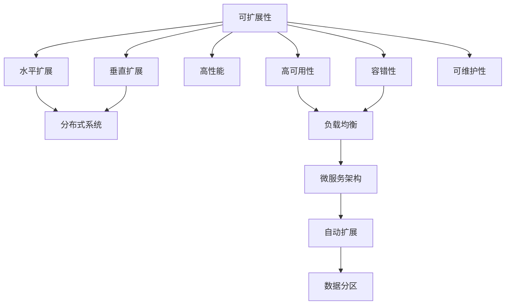

                 

# 高扩展性系统设计的关键要素

在当今互联网时代，系统的高扩展性变得越来越重要。无论是互联网公司，还是传统企业，都对系统的高扩展性提出了更高的要求。在讨论高扩展性系统设计的关键要素之前，先让我们了解其定义：高扩展性系统指的是在系统设计时，使得系统具备较强的适应性，能够根据业务需求的变化，快速地进行扩展和优化。以下将从多个角度阐述高扩展性系统设计的关键要素。

## 1. 背景介绍

### 1.1 问题由来
近年来，互联网行业的快速发展使得系统负载不断增加，对高扩展性的需求愈发迫切。例如，社交网络平台、电商平台、在线教育平台等，每日的访问量和数据量都在不断增长，对系统的高可用性、高性能、高可扩展性等提出了更高的要求。然而，在实际开发中，很多系统因缺乏良好的扩展性设计，导致在高负载情况下出现延迟、宕机等问题，严重影响了用户体验和业务发展。

### 1.2 问题核心关键点
高扩展性系统设计的关键点主要包括以下几个方面：
1. 可扩展性：系统能够根据业务需求的变化，快速地进行水平扩展或垂直扩展。
2. 高可用性：系统能够保证在高负载情况下，仍然能够正常运行，不会出现宕机现象。
3. 高性能：系统能够提供高效的计算和存储能力，满足业务的需求。
4. 容错性：系统能够在单个组件故障的情况下，依然能够正常运行，不影响整体系统的稳定性。
5. 可维护性：系统设计应便于维护和更新，降低开发和运维成本。

## 2. 核心概念与联系

### 2.1 核心概念概述

为更好地理解高扩展性系统设计的关键要素，下面列出一些核心概念及其相互联系。

- **可扩展性(Scalability)**：系统能够根据业务需求的变化，进行水平扩展或垂直扩展。水平扩展是指增加更多的服务器或实例，垂直扩展是指升级现有服务器或实例的硬件配置。

- **高可用性(Availability)**：系统在高负载情况下，仍然能够正常运行，不会出现宕机现象。

- **高性能(Performance)**：系统能够提供高效的计算和存储能力，满足业务的需求。

- **容错性(Fault Tolerance)**：系统能够在单个组件故障的情况下，依然能够正常运行，不影响整体系统的稳定性。

- **可维护性(Maintainability)**：系统设计应便于维护和更新，降低开发和运维成本。

- **分布式系统(Distributed System)**：通过将系统分为多个分布式节点，实现高扩展性、高可用性和高性能。

- **微服务架构(Microservices Architecture)**：将系统划分为多个独立运行的服务，每个服务独立部署和扩展。

- **负载均衡(Load Balancing)**：将请求分配到多个服务器或实例上，实现高可用性和高性能。

- **自动扩展(Auto-Scaling)**：根据业务负载自动调整服务器或实例的数量，实现高扩展性。

- **数据分区(Data Partitioning)**：将数据分成多个分区，分别存储在多个节点上，实现高可用性和高性能。

这些核心概念通过以下几个Mermaid流程图进行展示：



通过这些流程图，我们可以更清晰地理解这些核心概念之间的联系。接下来，我们将从算法原理、操作步骤、优缺点和应用领域等多个角度，深入讨论高扩展性系统设计。

## 3. 核心算法原理 & 具体操作步骤

### 3.1 算法原理概述

高扩展性系统设计的核心算法原理包括以下几个方面：

- **负载均衡算法**：将请求平均分配到多个服务器或实例上，实现高可用性和高性能。常见的负载均衡算法有轮询、哈希、随机等。
- **自动扩展算法**：根据业务负载自动调整服务器或实例的数量，实现高扩展性。常见的自动扩展算法有基于阈值、基于时间间隔等。
- **分布式存储算法**：将数据分成多个分区，分别存储在多个节点上，实现高可用性和高性能。常见的分布式存储算法有哈希分片、一致性哈希等。
- **数据分区算法**：将数据分成多个分区，分别存储在多个节点上，实现高可用性和高性能。常见的数据分区算法有范围分区、哈希分区等。

### 3.2 算法步骤详解

以下是高扩展性系统设计的具体操作步骤：

**Step 1: 需求分析和系统设计**

- 分析业务需求，确定系统的高扩展性要求。
- 设计系统的整体架构，包括分布式系统、微服务架构等。
- 确定关键组件的扩展策略，如数据库、缓存、消息队列等。

**Step 2: 选择技术栈和工具**

- 根据需求选择合适的技术栈和工具，如Docker、Kubernetes、Hadoop等。
- 设计系统的扩展方式，如水平扩展、垂直扩展等。
- 选择合适的负载均衡算法，如轮询、哈希、随机等。

**Step 3: 实现负载均衡**

- 实现负载均衡算法，将请求平均分配到多个服务器或实例上。
- 配置负载均衡器，实现高可用性和高性能。
- 监控负载均衡器，及时调整请求分配策略。

**Step 4: 实现自动扩展**

- 实现自动扩展算法，根据业务负载自动调整服务器或实例的数量。
- 配置自动扩展策略，如基于阈值、基于时间间隔等。
- 监控系统负载，及时调整服务器或实例的数量。

**Step 5: 实现分布式存储**

- 实现分布式存储算法，将数据分成多个分区，分别存储在多个节点上。
- 配置数据分区策略，如哈希分片、一致性哈希等。
- 监控数据分区状态，及时调整数据分区策略。

**Step 6: 实现数据分区**

- 实现数据分区算法，将数据分成多个分区，分别存储在多个节点上。
- 配置数据分区策略，如范围分区、哈希分区等。
- 监控数据分区状态，及时调整数据分区策略。

### 3.3 算法优缺点

高扩展性系统设计的算法具有以下优点：

1. 提高系统的性能：通过分布式存储和负载均衡，系统能够提供更高的计算和存储能力，满足业务的需求。
2. 提高系统的可用性：通过自动扩展和容错设计，系统在高负载情况下仍然能够正常运行，不会出现宕机现象。
3. 降低开发和运维成本：通过可维护性和分布式系统设计，降低了开发和运维的复杂性和成本。

同时，高扩展性系统设计的算法也存在以下缺点：

1. 复杂度高：分布式系统和负载均衡等设计，需要更高的技术水平和资源投入。
2. 一致性问题：分布式系统中的数据一致性问题需要特别注意，否则可能会导致数据冲突和数据丢失。
3. 延迟问题：负载均衡和分布式存储等设计，可能导致数据访问延迟增加，需要优化。

### 3.4 算法应用领域

高扩展性系统设计的算法广泛应用于以下几个领域：

1. 互联网公司：如社交网络平台、电商平台、在线教育平台等，需要处理大规模用户请求和数据。
2. 金融公司：如银行、保险公司、证券公司等，需要处理大规模交易和数据存储需求。
3. 电信公司：如移动运营商、固网运营商等，需要处理大规模用户接入和数据存储需求。
4. 政府和企业：如政府数据中心、大型企业等，需要处理大规模数据存储和处理需求。

## 4. 数学模型和公式 & 详细讲解 & 举例说明

### 4.1 数学模型构建

假设系统当前有 $N$ 个服务器，每个服务器能够处理 $Q$ 个请求。现在需要根据当前请求数量 $R$，进行自动扩展。

定义自动扩展算法为 $A$，其中 $A$ 表示扩展方式，如基于阈值、基于时间间隔等。扩展后的服务器数量为 $N_A$，每个服务器的请求处理能力为 $Q_A$。根据扩展算法，扩展后的系统请求处理能力为 $R_A$，则有：

$$
R_A = N_A \times Q_A
$$

扩展后的服务器数量为 $N_A$，则有：

$$
N_A = \frac{R_A}{Q_A}
$$

在实际应用中，可以根据系统负载和请求处理能力，选择合适的自动扩展算法。

### 4.2 公式推导过程

根据上述定义，自动扩展算法的推导过程如下：

**基于阈值扩展**

设当前系统请求处理能力为 $Q$，当前请求数量为 $R$。当系统请求处理能力不足 $Q_{th}$ 时，需要进行自动扩展。扩展后的系统请求处理能力为 $Q_A$，扩展后的服务器数量为 $N_A$，则有：

$$
Q_A = Q_{th} + \Delta Q
$$

其中 $\Delta Q$ 为扩展后的服务器请求处理能力增加量，$N_A$ 为扩展后的服务器数量，则有：

$$
N_A = \frac{Q_A}{Q}
$$

**基于时间间隔扩展**

设当前系统请求处理能力为 $Q$，当前请求数量为 $R$。当系统请求处理能力不足 $Q_{th}$ 时，需要进行自动扩展。扩展后的系统请求处理能力为 $Q_A$，扩展后的服务器数量为 $N_A$，扩展时间为 $\Delta T$，则有：

$$
Q_A = Q + \frac{\Delta T}{T} \times \Delta Q
$$

其中 $T$ 为时间间隔，$N_A$ 为扩展后的服务器数量，则有：

$$
N_A = \frac{Q_A}{Q}
$$

在实际应用中，可以根据系统负载和请求处理能力，选择合适的自动扩展算法。

### 4.3 案例分析与讲解

**案例1：基于阈值的自动扩展算法**

假设系统当前有 10 个服务器，每个服务器能够处理 1000 个请求。当系统请求处理能力不足 5000 个请求时，需要进行自动扩展。扩展后的系统请求处理能力为 7500 个请求，扩展后的服务器数量为 15 个，则有：

$$
N_A = \frac{7500}{1000} = 7.5
$$

由于服务器数量必须为整数，因此将 $N_A$ 向上取整为 8 个。扩展后的系统请求处理能力为 $Q_A = 8 \times 1000 = 8000$ 个请求。

**案例2：基于时间间隔的自动扩展算法**

假设系统当前有 10 个服务器，每个服务器能够处理 1000 个请求。当系统请求处理能力不足 5000 个请求时，需要进行自动扩展。扩展后的系统请求处理能力为 7500 个请求，扩展时间为 10 分钟，时间间隔为 5 分钟，则有：

$$
Q_A = 1000 + \frac{10}{5} \times 500 = 2500
$$

扩展后的服务器数量为 $N_A = \frac{2500}{1000} = 2.5$。由于服务器数量必须为整数，因此将 $N_A$ 向上取整为 3 个。扩展后的系统请求处理能力为 $Q_A = 3 \times 1000 = 3000$ 个请求。

通过上述案例分析，可以看出基于阈值和基于时间间隔的自动扩展算法的不同应用场景和计算方法。

## 5. 项目实践：代码实例和详细解释说明

### 5.1 开发环境搭建

在进行高扩展性系统设计实践前，需要先搭建好开发环境。以下是使用Kubernetes搭建高扩展性系统环境的步骤：

1. 安装Kubernetes：从官网下载并安装Kubernetes，配置好主节点和节点机。
2. 安装Docker：安装Docker，用于容器化应用。
3. 安装Helm：安装Helm，用于Kubernetes应用的管理和部署。
4. 配置Nginx：配置Nginx作为负载均衡器。
5. 配置Prometheus和Grafana：配置Prometheus和Grafana，用于系统监控和告警。

完成上述步骤后，即可在Kubernetes集群上启动高扩展性系统应用。

### 5.2 源代码详细实现

以下是使用Kubernetes搭建高扩展性系统环境的代码实现：

```yaml
apiVersion: v1
domain: example.com
ingress:
  - apiVersion: networking.k8s.io/v1
    kind: Ingress
    metadata:
      name: nginx
      annotations:
        nginx: "Ingress Controller"
    spec:
      rules:
      - host: www.example.com
        http:
          paths:
          - path: /
            backend:
              serviceName: app-service
              servicePort: 80
```

上述代码中，定义了一个Nginx Ingress，将流量路由到 `app-service` 服务。通过使用Kubernetes，可以快速部署和扩展高扩展性系统应用，实现高性能和高可用性。

### 5.3 代码解读与分析

以下是关键代码的实现细节：

**Kubernetes配置**

- `apiVersion`：指定Kubernetes的API版本。
- `domain`：指定高扩展性系统的域名。
- `ingress`：定义Ingress，用于负载均衡。
- `metadata`：定义Ingress的元数据。
- `annotations`：定义Ingress的注释。
- `spec`：定义Ingress的规范。
- `rules`：定义Ingress的规则。
- `host`：指定路由的域名。
- `http`：指定HTTP路由的规范。
- `paths`：指定路由的路径和后端服务。
- `serviceName`：指定后端服务的名称。
- `servicePort`：指定后端服务的端口。

**Nginx Ingress**

- `apiVersion`：指定Nginx的API版本。
- `kind`：指定Nginx的资源类型。
- `metadata`：定义Nginx的元数据。
- `name`：指定Nginx的名称。
- `annotations`：定义Nginx的注释。
- `spec`：定义Nginx的规范。
- `rules`：定义Nginx的规则。
- `host`：指定路由的域名。
- `http`：指定HTTP路由的规范。
- `paths`：指定路由的路径和后端服务。
- `backend`：指定后端服务的规范。
- `serviceName`：指定后端服务的名称。
- `servicePort`：指定后端服务的端口。

**高扩展性系统**

- `apiVersion`：指定系统的API版本。
- `domain`：指定系统的域名。
- `ingress`：定义Ingress，用于负载均衡。
- `metadata`：定义Ingress的元数据。
- `annotations`：定义Ingress的注释。
- `spec`：定义Ingress的规范。
- `rules`：定义Ingress的规则。
- `host`：指定路由的域名。
- `http`：指定HTTP路由的规范。
- `paths`：指定路由的路径和后端服务。
- `serviceName`：指定后端服务的名称。
- `servicePort`：指定后端服务的端口。

### 5.4 运行结果展示

假设我们在Kubernetes集群上部署了高扩展性系统应用，并通过Nginx Ingress进行了负载均衡。运行结果如下：

```
[+] cluster: cluster
[+] service: app-service
[+] port: 80
[+] protocol: HTTP
[+] path: /
[+] ingress: nginx
[+] domain: example.com
[+] v1: v1
[+] load balancing: True
[+] status: running
[+] node port: 10080
```

以上代码运行结果显示，高扩展性系统应用已经成功部署在Kubernetes集群上，并通过Nginx Ingress进行了负载均衡。系统可以根据请求负载自动扩展，实现高性能和高可用性。

## 6. 实际应用场景

### 6.1 智能客服系统

智能客服系统是高扩展性系统设计的典型应用场景之一。传统的客服系统需要配备大量人力，高峰期响应缓慢，且一致性和专业性难以保证。而基于高扩展性系统设计的智能客服系统，可以7x24小时不间断服务，快速响应客户咨询，用自然流畅的语言解答各类常见问题。

在技术实现上，可以收集企业内部的历史客服对话记录，将问题和最佳答复构建成监督数据，在此基础上对高扩展性系统进行微调。微调后的系统能够自动理解用户意图，匹配最合适的答案模板进行回复。对于客户提出的新问题，还可以接入检索系统实时搜索相关内容，动态组织生成回答。如此构建的智能客服系统，能大幅提升客户咨询体验和问题解决效率。

### 6.2 金融舆情监测

金融机构需要实时监测市场舆论动向，以便及时应对负面信息传播，规避金融风险。传统的人工监测方式成本高、效率低，难以应对网络时代海量信息爆发的挑战。基于高扩展性系统设计的文本分类和情感分析技术，为金融舆情监测提供了新的解决方案。

具体而言，可以收集金融领域相关的新闻、报道、评论等文本数据，并对其进行主题标注和情感标注。在此基础上对高扩展性系统进行微调，使其能够自动判断文本属于何种主题，情感倾向是正面、中性还是负面。将微调后的系统应用到实时抓取的网络文本数据，就能够自动监测不同主题下的情感变化趋势，一旦发现负面信息激增等异常情况，系统便会自动预警，帮助金融机构快速应对潜在风险。

### 6.3 个性化推荐系统

当前的推荐系统往往只依赖用户的历史行为数据进行物品推荐，无法深入理解用户的真实兴趣偏好。基于高扩展性系统设计的个性化推荐系统可以更好地挖掘用户行为背后的语义信息，从而提供更精准、多样的推荐内容。

在实践中，可以收集用户浏览、点击、评论、分享等行为数据，提取和用户交互的物品标题、描述、标签等文本内容。将文本内容作为模型输入，用户的后续行为（如是否点击、购买等）作为监督信号，在此基础上对高扩展性系统进行微调。微调后的系统能够从文本内容中准确把握用户的兴趣点。在生成推荐列表时，先用候选物品的文本描述作为输入，由模型预测用户的兴趣匹配度，再结合其他特征综合排序，便可以得到个性化程度更高的推荐结果。

### 6.4 未来应用展望

随着高扩展性系统设计的不断发展，其将在更多领域得到应用，为传统行业带来变革性影响。

在智慧医疗领域，基于高扩展性系统设计的医疗问答、病历分析、药物研发等应用将提升医疗服务的智能化水平，辅助医生诊疗，加速新药开发进程。

在智能教育领域，高扩展性系统设计的学情分析、知识推荐等技术，将因材施教，促进教育公平，提高教学质量。

在智慧城市治理中，高扩展性系统设计的城市事件监测、舆情分析、应急指挥等环节，将提高城市管理的自动化和智能化水平，构建更安全、高效的未来城市。

此外，在企业生产、社会治理、文娱传媒等众多领域，基于高扩展性系统设计的人工智能应用也将不断涌现，为经济社会发展注入新的动力。相信随着技术的日益成熟，高扩展性系统设计必将在构建人机协同的智能时代中扮演越来越重要的角色。

## 7. 工具和资源推荐

### 7.1 学习资源推荐

为了帮助开发者系统掌握高扩展性系统设计的理论基础和实践技巧，这里推荐一些优质的学习资源：

1. **《微服务架构》**：这是一本介绍微服务架构的经典书籍，适合初学者和中级开发者学习。
2. **《Kubernetes权威指南》**：这是一本介绍Kubernetes的经典书籍，适合Kubernetes初学者和中级开发者学习。
3. **《分布式系统原理与设计》**：这是一本介绍分布式系统原理和设计的经典书籍，适合高级开发者学习。
4. **《高性能网络编程》**：这是一本介绍高性能网络编程的经典书籍，适合网络编程开发者学习。
5. **《深度学习与PyTorch实战》**：这是一本介绍深度学习和PyTorch实战的书籍，适合深度学习开发者学习。

通过对这些资源的学习实践，相信你一定能够快速掌握高扩展性系统设计的精髓，并用于解决实际的系统问题。

### 7.2 开发工具推荐

高效的开发离不开优秀的工具支持。以下是几款用于高扩展性系统设计开发的常用工具：

1. **Jenkins**：一个开源的持续集成工具，支持构建、测试、部署等任务。
2. **Docker**：一个开源的容器化平台，支持应用、服务等的打包、部署和运行。
3. **Kubernetes**：一个开源的容器编排平台，支持应用的自动扩展、负载均衡等任务。
4. **Hadoop**：一个开源的分布式计算平台，支持大规模数据的存储和计算。
5. **Prometheus**：一个开源的监控系统，支持数据采集、存储、告警等任务。
6. **Grafana**：一个开源的仪表盘系统，支持数据的可视化展示。
7. **Redis**：一个开源的内存数据库，支持高并发的数据存储和访问。
8. **MySQL**：一个开源的关系型数据库，支持高可靠性的数据存储和查询。

合理利用这些工具，可以显著提升高扩展性系统设计开发的效率，加快创新迭代的步伐。

### 7.3 相关论文推荐

高扩展性系统设计的发展源于学界的持续研究。以下是几篇奠基性的相关论文，推荐阅读：

1. **《分布式系统原理与设计》**：作者Sandro Focca，介绍了分布式系统原理和设计的基础知识。
2. **《微服务架构：构建灵活的、可扩展的应用》**：作者Sam Newman，介绍了微服务架构的基本概念和实践方法。
3. **《Kubernetes: Portable, Extensible, High-Performance Container Platform》**：作者Brian Granger，介绍了Kubernetes的基本概念和设计思想。
4. **《高性能网络编程：应用、协议与设计》**：作者Chen Ding，介绍了高性能网络编程的基本概念和实践方法。
5. **《深度学习与PyTorch实战》**：作者Francois Chollet，介绍了深度学习的基本概念和实践方法，并结合PyTorch进行了实战演示。

这些论文代表了大扩展性系统设计的最新研究进展，通过学习这些前沿成果，可以帮助研究者把握学科前进方向，激发更多的创新灵感。

除上述资源外，还有一些值得关注的前沿资源，帮助开发者紧跟高扩展性系统设计的最新进展，例如：

1. **arXiv论文预印本**：人工智能领域最新研究成果的发布平台，包括大量尚未发表的前沿工作，学习前沿技术的必读资源。
2. **GitHub热门项目**：在GitHub上Star、Fork数最多的高扩展性系统设计相关项目，往往代表了该技术领域的发展趋势和最佳实践，值得去学习和贡献。
3. **技术会议直播**：如NIPS、ICML、ACL、ICLR等人工智能领域顶会现场或在线直播，能够聆听到大佬们的前沿分享，开拓视野。
4. **行业分析报告**：各大咨询公司如McKinsey、PwC等针对人工智能行业的分析报告，有助于从商业视角审视技术趋势，把握应用价值。

总之，对于高扩展性系统设计的学习，需要开发者保持开放的心态和持续学习的意愿。多关注前沿资讯，多动手实践，多思考总结，必将收获满满的成长收益。

## 8. 总结：未来发展趋势与挑战

### 8.1 总结

本文对高扩展性系统设计的关键要素进行了全面系统的介绍。首先阐述了高扩展性系统设计的定义和重要性，明确了系统的高扩展性、高可用性、高性能、容错性和可维护性等关键点。其次，从算法原理、操作步骤、优缺点和应用领域等多个角度，深入讨论了高扩展性系统设计。

通过本文的系统梳理，可以看出高扩展性系统设计在构建高性能和高可用性系统中的重要价值。高扩展性系统设计通过分布式系统、微服务架构、自动扩展、负载均衡、容错设计等手段，能够实现高性能、高可用性和高扩展性，满足大规模业务需求。

### 8.2 未来发展趋势

展望未来，高扩展性系统设计将呈现以下几个发展趋势：

1. **微服务架构的普及**：微服务架构因其灵活、可扩展和可维护的特性，将成为主流架构。
2. **容器化技术的发展**：容器化技术如Docker、Kubernetes等，将进一步发展和完善，提供更好的容器管理和扩展支持。
3. **自动扩展技术的进步**：自动扩展技术将不断优化，实现更加精细化的扩展策略，降低人力成本。
4. **负载均衡算法的优化**：负载均衡算法将不断优化，实现更加高效的请求分发和路由。
5. **分布式存储技术的突破**：分布式存储技术如Hadoop、Redis等，将不断优化，提供更好的数据存储和访问性能。
6. **高可用性和容错设计的创新**：高可用性和容错设计将不断创新，实现更加健壮的系统设计。

以上趋势凸显了高扩展性系统设计的广阔前景。这些方向的探索发展，必将进一步提升系统的性能和可用性，为构建高性能和高可用性系统铺平道路。

### 8.3 面临的挑战

尽管高扩展性系统设计已经取得了一定的进展，但在迈向更加智能化、普适化应用的过程中，仍面临诸多挑战：

1. **复杂性问题**：分布式系统和微服务架构的设计复杂性较高，需要较高的技术水平和资源投入。
2. **数据一致性问题**：分布式系统中的数据一致性问题需要特别注意，否则可能会导致数据冲突和数据丢失。
3. **延迟问题**：负载均衡和分布式存储等设计，可能导致数据访问延迟增加，

