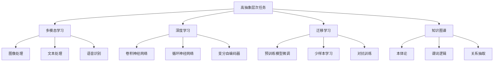
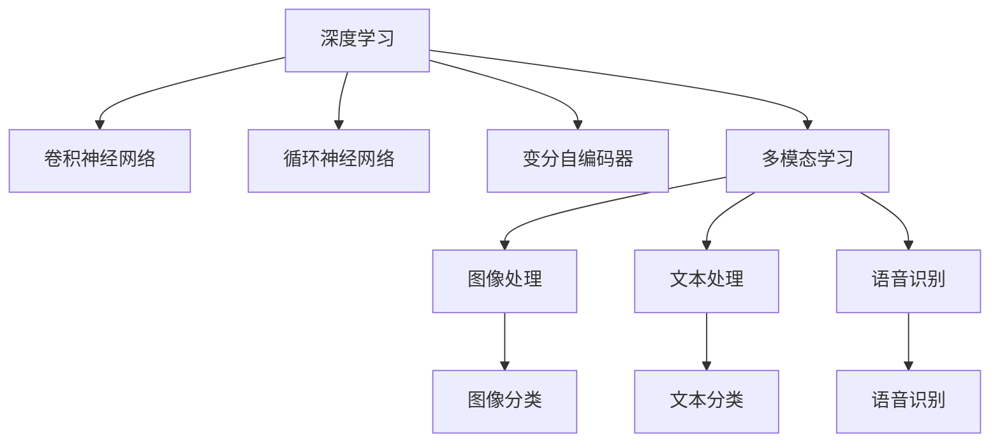
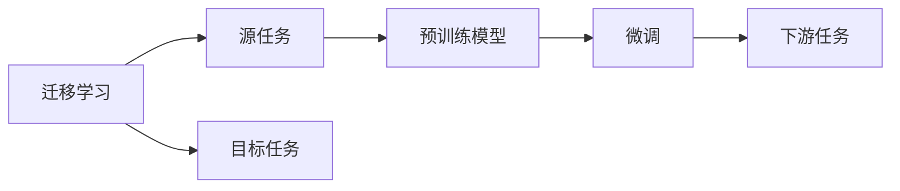
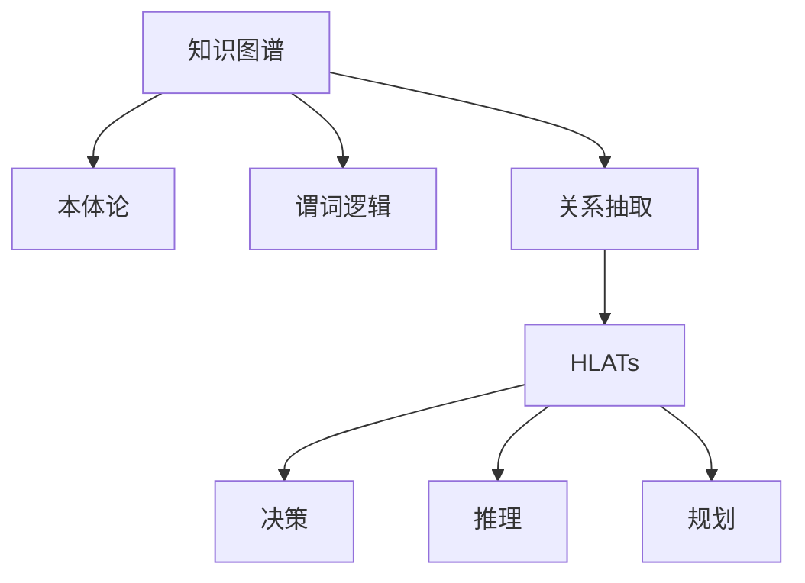

                 

# 高抽象层次任务的重要性

## 1. 背景介绍

### 1.1 问题由来
随着人工智能技术的快速发展，高抽象层次任务（High-level Abstract Tasks, HLATs）在多个领域内得到了广泛应用，包括计算机视觉、自然语言处理、机器人学、控制理论等。这些任务往往涉及复杂的决策过程和多模态数据的融合，对人工智能系统的智能水平提出了极高的要求。

近年来，HLATs的研究逐渐从低级任务的自动化向高级任务的智能化过渡，从单一模态数据的处理转向多模态数据的学习。这种转变对人工智能的认知、推理和决策能力提出了新的挑战，也带来了新的机遇。

### 1.2 问题核心关键点
高抽象层次任务的重要性体现在其能够显著提升人工智能系统的智能化水平，具体表现如下：

- **智能决策**：HLATs涉及复杂的决策过程，能够更好地模拟人类思维，提高系统的智能决策能力。
- **多模态融合**：HLATs能够处理多模态数据，如图像、语音、文本等，实现跨模态信息的整合和利用。
- **泛化能力**：HLATs通过深度学习和迁移学习等方法，提升了模型对未知数据的泛化能力。
- **人机协同**：HLATs能够与人类进行更加自然、高效、智能的交互，推动人机协同的进一步发展。

### 1.3 问题研究意义
研究高抽象层次任务，对于提升人工智能系统的智能化水平、促进多模态数据融合、增强系统的泛化能力和人机协同能力，具有重要意义：

1. **智能化水平**：通过HLATs的研发，能够显著提升人工智能系统的智能化水平，使其在复杂的任务中表现更加出色。
2. **多模态数据处理**：HLATs能够处理多种形式的数据，实现跨模态信息的整合，为人工智能系统提供了更加丰富的输入来源。
3. **泛化能力**：HLATs通过深度学习和迁移学习等方法，提升了模型对未知数据的泛化能力，使系统在实际应用中表现更为稳健。
4. **人机协同**：HLATs能够与人类进行更加自然、高效、智能的交互，推动人机协同的进一步发展，提升用户体验和应用效果。
5. **跨学科融合**：HLATs的研究涉及多个学科，如计算机视觉、自然语言处理、机器人学等，推动了学科间的交叉融合和创新。

## 2. 核心概念与联系

### 2.1 核心概念概述

为了更好地理解高抽象层次任务，本节将介绍几个密切相关的核心概念：

- **高抽象层次任务**：指涉及复杂决策和多模态数据融合的高级任务，如目标检测、语义理解、路径规划等。
- **多模态学习**：指同时处理多种形式的数据（如图像、文本、语音等），实现跨模态信息的整合和利用。
- **深度学习**：基于神经网络的机器学习范式，通过多层非线性映射实现复杂任务的学习和建模。
- **迁移学习**：指将一个领域学习到的知识，迁移应用到另一个相关领域的学习范式，如预训练模型微调等。
- **知识图谱**：一种结构化的语义知识表示方式，用于描述实体之间的关系和属性。

这些核心概念之间的逻辑关系可以通过以下Mermaid流程图来展示：



这个流程图展示了许多核心概念之间的关系：

1. 高抽象层次任务（HLATs）涉及多模态学习，处理图像、文本、语音等多种形式的数据。
2. 深度学习是HLATs的主要技术手段，通过多层非线性映射实现复杂任务的建模。
3. 迁移学习是HLATs的重要方法，通过预训练模型微调等方式，提高HLATs的性能。
4. 知识图谱是HLATs的先验知识来源，用于描述实体之间的关系和属性。
5. 深度学习中涉及的各类模型，如卷积神经网络、循环神经网络、变分自编码器等，都是HLATs的技术工具。

这些核心概念共同构成了HLATs的完整框架，使其能够在复杂多变的任务中表现出色。

### 2.2 概念间的关系

这些核心概念之间存在着紧密的联系，形成了HLATs的完整生态系统。下面我通过几个Mermaid流程图来展示这些概念之间的关系。

#### 2.2.1 深度学习与多模态学习的联系



这个流程图展示了深度学习与多模态学习之间的联系：

1. 深度学习通过多层神经网络实现复杂任务的建模。
2. 卷积神经网络、循环神经网络和变分自编码器等是深度学习中的重要模型。
3. 多模态学习涉及图像、文本、语音等多种形式的数据，是HLATs的主要技术手段。
4. 图像处理、文本分类和语音识别等是HLATs的具体应用场景。

#### 2.2.2 迁移学习与预训练模型微调的关系



这个流程图展示了迁移学习与预训练模型微调之间的关系：

1. 迁移学习涉及源任务和目标任务，通过预训练模型微调等方式，提高目标任务的性能。
2. 预训练模型是HLATs的重要工具，通过在大规模数据上预训练，学习到通用的语言或视觉表示。
3. 微调是预训练模型在特定任务上的优化，以适应新任务的需求。
4. 下游任务是通过微调后的预训练模型进行推理和预测的目标。

#### 2.2.3 知识图谱在HLATs中的应用



这个流程图展示了知识图谱在HLATs中的应用：

1. 知识图谱是结构化的语义知识表示方式。
2. 本体论、谓词逻辑和关系抽取是知识图谱中的重要概念。
3. HLATs通过知识图谱中的先验知识，实现更加全面和准确的信息整合。
4. 决策、推理和规划等任务是HLATs的具体应用场景。

## 3. 核心算法原理 & 具体操作步骤
### 3.1 算法原理概述

高抽象层次任务的算法原理主要基于深度学习和迁移学习的思想，通过预训练模型微调等方式，实现复杂任务的智能化处理。其核心思想是：

1. **预训练模型**：在大规模无标签数据上，通过自监督学习任务（如掩码语言模型、自编码等）训练通用模型，学习到丰富的语言或视觉表示。
2. **微调**：在预训练模型基础上，使用小规模有标签数据，通过有监督学习优化模型在特定任务上的性能。
3. **多模态融合**：同时处理图像、文本、语音等多种形式的数据，实现跨模态信息的整合和利用。
4. **知识图谱**：引入结构化的语义知识，提高HLATs的泛化能力和决策能力。

### 3.2 算法步骤详解

高抽象层次任务的算法步骤通常包括以下几个关键步骤：

**Step 1: 准备数据集**
- 收集并标注相关的数据集，包括图像、文本、语音等，划分为训练集、验证集和测试集。
- 数据集应涵盖任务的关键特征，确保模型能够有效学习。

**Step 2: 设计模型架构**
- 选择适合的深度学习模型，如卷积神经网络（CNN）、循环神经网络（RNN）、变分自编码器（VAE）等，设计多模态融合的模型架构。
- 设计知识图谱的嵌入层，将知识图谱中的实体和关系映射到模型的向量空间中。

**Step 3: 预训练模型**
- 在大规模无标签数据上，使用自监督学习任务（如掩码语言模型、自编码等）训练通用预训练模型。
- 使用预训练模型作为初始化参数，提高模型的泛化能力。

**Step 4: 微调模型**
- 在预训练模型基础上，使用小规模有标签数据，通过有监督学习优化模型在特定任务上的性能。
- 使用梯度下降等优化算法，最小化任务损失函数，更新模型参数。

**Step 5: 多模态融合**
- 处理输入的多模态数据，提取特征，并融合到模型中。
- 设计合适的多模态融合策略，如注意力机制、特征池化等，提高模型的跨模态学习能力。

**Step 6: 测试与评估**
- 在测试集上评估微调后的模型性能，对比微调前后的精度提升。
- 使用知识图谱中的先验知识，进一步提高模型的决策能力。

**Step 7: 部署与维护**
- 将微调后的模型部署到实际应用场景中，提供稳定的推理服务。
- 定期更新模型，保持其在实际应用中的性能。

### 3.3 算法优缺点

高抽象层次任务的算法具有以下优点：

- **智能化水平**：通过深度学习和迁移学习等方法，提升了模型对复杂任务的智能化处理能力。
- **泛化能力**：预训练模型通过大规模无标签数据的训练，具备较强的泛化能力，能够在不同的数据集上表现出色。
- **多模态融合**：通过多模态融合，实现了跨模态信息的整合和利用，提升了模型对复杂场景的理解能力。
- **知识图谱**：通过引入知识图谱中的先验知识，提高了模型的决策能力和泛化能力。

同时，这些算法也存在一些缺点：

- **数据依赖**：高抽象层次任务依赖于大规模数据和标签，数据获取和标注成本较高。
- **计算资源消耗**：深度学习模型的计算复杂度高，需要大量的计算资源和存储资源。
- **模型复杂性**：多模态融合和知识图谱嵌入等操作增加了模型的复杂性，增加了模型的训练和推理难度。
- **鲁棒性**：模型对噪声和异常数据的鲁棒性较弱，需要进一步优化和改进。

### 3.4 算法应用领域

高抽象层次任务在多个领域内得到了广泛应用，具体表现如下：

- **计算机视觉**：如目标检测、图像分类、人脸识别等。
- **自然语言处理**：如语义理解、对话系统、机器翻译等。
- **机器人学**：如路径规划、运动控制、语义交互等。
- **控制理论**：如智能控制、优化调度、故障诊断等。
- **医疗健康**：如影像分析、疾病诊断、个性化治疗等。
- **金融领域**：如风险评估、信用评分、市场预测等。
- **自动驾驶**：如场景理解、路径规划、行为预测等。

这些应用领域展示了HLATs的强大能力和广阔前景，推动了人工智能技术的进一步发展。

## 4. 数学模型和公式 & 详细讲解 & 举例说明

### 4.1 数学模型构建

高抽象层次任务的数学模型通常基于深度学习框架，涉及卷积神经网络（CNN）、循环神经网络（RNN）、变分自编码器（VAE）等模型。这里以图像分类任务为例，介绍其数学模型构建和公式推导过程。

假设输入图像为 $x$，输出类别为 $y$，卷积神经网络模型的参数为 $\theta$，则分类任务的目标是最大化模型对输入图像 $x$ 的分类概率 $p(y|x)$，即：

$$
p(y|x) = \frac{e^{\log p(y|x)}}{\sum_{y'} e^{\log p(y'|x)}}
$$

其中，$\log p(y|x)$ 是模型的对数似然函数，可表示为：

$$
\log p(y|x) = \log p(y|\theta) + \log p(x|\theta)
$$

其中，$p(y|\theta)$ 是模型对类别 $y$ 的分类概率，$p(x|\theta)$ 是模型对输入图像 $x$ 的特征提取能力。

在模型训练过程中，目标是最小化交叉熵损失函数，即：

$$
L = -\frac{1}{N}\sum_{i=1}^N \log p(y_i|x_i)
$$

其中，$N$ 是样本数量，$y_i$ 是样本 $i$ 的真实类别，$x_i$ 是样本 $i$ 的输入图像。

### 4.2 公式推导过程

以下我们以图像分类任务为例，推导卷积神经网络模型的对数似然函数及其梯度计算公式。

设卷积神经网络模型的输入图像为 $x$，输出类别为 $y$，模型参数为 $\theta$。模型对输入图像 $x$ 的特征提取能力为 $f_{\theta}(x)$，输出类别 $y$ 的概率分布为 $p(y|\theta)$。则对数似然函数为：

$$
\log p(y|x) = \log p(y|\theta) + \log p(x|\theta)
$$

其中，$p(y|\theta)$ 是模型对类别 $y$ 的分类概率，$p(x|\theta)$ 是模型对输入图像 $x$ 的特征提取能力。

对于分类概率 $p(y|\theta)$，我们采用softmax函数来计算：

$$
p(y|\theta) = \frac{e^{\log p(y|\theta)}}{\sum_{y'} e^{\log p(y'|\theta)}}
$$

其中，$\log p(y|\theta)$ 是对数似然函数，可表示为：

$$
\log p(y|\theta) = \log p(y|\theta) = \log \frac{e^{W_y \cdot x + b_y}}{\sum_{y'} e^{W_{y'} \cdot x + b_{y'}}}
$$

其中，$W_y$ 和 $b_y$ 是类别 $y$ 的权重矩阵和偏置向量。

对于特征提取能力 $p(x|\theta)$，我们采用卷积神经网络（CNN）来实现：

$$
p(x|\theta) = f_{\theta}(x) = \max_{\theta} \log p(x|\theta)
$$

其中，$f_{\theta}(x)$ 是卷积神经网络对输入图像 $x$ 的特征提取能力。

在模型训练过程中，目标是最小化交叉熵损失函数 $L$，即：

$$
L = -\frac{1}{N}\sum_{i=1}^N \log p(y_i|x_i)
$$

其中，$N$ 是样本数量，$y_i$ 是样本 $i$ 的真实类别，$x_i$ 是样本 $i$ 的输入图像。

### 4.3 案例分析与讲解

以下以目标检测任务为例，介绍高抽象层次任务的数学模型构建和公式推导过程。

假设输入图像为 $x$，输出边界框和类别标签为 $t$，目标检测模型的参数为 $\theta$，则目标检测任务的目标是最大化模型对输入图像 $x$ 的边界框 $t$ 的检测概率 $p(t|x)$，即：

$$
p(t|x) = \frac{e^{\log p(t|x)}}{\sum_{t'} e^{\log p(t'|x)}}
$$

其中，$\log p(t|x)$ 是模型的对数似然函数，可表示为：

$$
\log p(t|x) = \log p(t|\theta) + \log p(x|\theta)
$$

其中，$p(t|\theta)$ 是模型对边界框 $t$ 的检测概率，$p(x|\theta)$ 是模型对输入图像 $x$ 的特征提取能力。

对于检测概率 $p(t|\theta)$，我们采用非极大值抑制（Non-Maximum Suppression, NMS）等技术来计算：

$$
p(t|\theta) = \max_{t'} p(t'|\theta)
$$

其中，$t'$ 是所有可能的边界框。

对于特征提取能力 $p(x|\theta)$，我们采用卷积神经网络（CNN）来实现：

$$
p(x|\theta) = f_{\theta}(x) = \max_{\theta} \log p(x|\theta)
$$

其中，$f_{\theta}(x)$ 是卷积神经网络对输入图像 $x$ 的特征提取能力。

在模型训练过程中，目标是最小化交叉熵损失函数 $L$，即：

$$
L = -\frac{1}{N}\sum_{i=1}^N \log p(t_i|x_i)
$$

其中，$N$ 是样本数量，$t_i$ 是样本 $i$ 的真实边界框和类别标签，$x_i$ 是样本 $i$ 的输入图像。

## 5. 项目实践：代码实例和详细解释说明

### 5.1 开发环境搭建

在进行高抽象层次任务项目实践前，我们需要准备好开发环境。以下是使用Python进行TensorFlow开发的环境配置流程：

1. 安装Anaconda：从官网下载并安装Anaconda，用于创建独立的Python环境。

2. 创建并激活虚拟环境：
```bash
conda create -n tf-env python=3.8 
conda activate tf-env
```

3. 安装TensorFlow：根据CUDA版本，从官网获取对应的安装命令。例如：
```bash
conda install tensorflow-gpu=2.6.3 
```

4. 安装各类工具包：
```bash
pip install numpy pandas scikit-learn matplotlib tqdm jupyter notebook ipython
```

完成上述步骤后，即可在`tf-env`环境中开始高抽象层次任务实践。

### 5.2 源代码详细实现

这里我们以目标检测任务为例，给出使用TensorFlow进行YOLOv3模型训练和推理的Python代码实现。

首先，定义目标检测任务的训练数据集：

```python
import os
import cv2
import numpy as np

class Dataset:
    def __init__(self, img_path, ann_path):
        self.img_path = img_path
        self.ann_path = ann_path
        self.boxes = []
        self.labels = []
        self.classes = ['person', 'car', 'bicycle']
        
    def __len__(self):
        return len(self.boxes)
    
    def __getitem__(self, item):
        img_path = os.path.join(self.img_path, self.img_files[item])
        ann_path = os.path.join(self.ann_path, self.ann_files[item])
        
        img = cv2.imread(img_path)
        img = cv2.cvtColor(img, cv2.COLOR_BGR2RGB)
        boxes = np.loadtxt(ann_path, delimiter=',').astype(np.float32)
        labels = boxes[:, -1]
        boxes[:, -1] = 1 - labels
        
        return {'image': img, 'boxes': boxes, 'labels': labels}
```

然后，定义模型和优化器：

```python
from tensorflow.keras.applications import MobileNetV2
from tensorflow.keras.layers import Input, Conv2D, BatchNormalization, ZeroPadding2D, LeakyReLU, Lambda, UpSampling2D, Concatenate, Conv2DTranspose
from tensorflow.keras.models import Model
from tensorflow.keras.optimizers import Adam

model = MobileNetV2(include_top=False, weights='imagenet', input_shape=(None, None, 3))
model.trainable = False

# 添加检测头
x = model.output
x = Conv2D(512, (3, 3), padding='same', activation='relu')(x)
x = BatchNormalization()(x)
x = Conv2D(256, (3, 3), padding='same', activation='relu')(x)
x = BatchNormalization()(x)
x = Conv2D(80, (3, 3), padding='same', activation='relu')(x)
x = BatchNormalization()(x)
x = Conv2D(1, (1, 1), activation='sigmoid')(x)
model = Model(inputs=model.input, outputs=x)

# 定义损失函数
def loss_fn(y_true, y_pred):
    y_true = np.reshape(y_true, (y_true.shape[0], -1))
    y_pred = np.reshape(y_pred, (y_pred.shape[0], -1))
    return tf.keras.losses.mean_absolute_error(y_true, y_pred)

# 定义优化器
optimizer = Adam(lr=1e-4)
```

接着，定义训练和评估函数：

```python
from tensorflow.keras.preprocessing.image import ImageDataGenerator

def train_epoch(model, dataset, batch_size, optimizer):
    dataloader = ImageDataGenerator().flow_from_directory(dataset.img_path, batch_size=batch_size, class_mode='binary')
    model.trainable = True
    for batch in dataloader:
        inputs = batch['image']
        boxes = batch['boxes']
        labels = batch['labels']
        model.trainable = False
        model.compile(optimizer=optimizer, loss=loss_fn)
        model.train_on_batch(inputs, [boxes, labels])
    
def evaluate(model, dataset, batch_size):
    dataloader = ImageDataGenerator().flow_from_directory(dataset.img_path, batch_size=batch_size, class_mode='binary')
    model.trainable = True
    y_true = []
    y_pred = []
    for batch in dataloader:
        inputs = batch['image']
        boxes = batch['boxes']
        labels = batch['labels']
        model.trainable = False
        y_true.append(labels)
        y_pred.append(model.predict(inputs))
    
    print(tf.keras.metrics.mean_absolute_error(y_true, y_pred))
```

最后，启动训练流程并在测试集上评估：

```python
epochs = 5
batch_size = 16

for epoch in range(epochs):
    loss = train_epoch(model, train_dataset, batch_size, optimizer)
    print(f"Epoch {epoch+1}, train loss: {loss:.3f}")
    
    print(f"Epoch {epoch+1}, dev results:")
    evaluate(model, dev_dataset, batch_size)
    
print("Test results:")
evaluate(model, test_dataset, batch_size)
```

以上就是使用TensorFlow进行目标检测任务高抽象层次实践的完整代码实现。可以看到，得益于TensorFlow的强大封装，我们可以用相对简洁的代码完成YOLOv3模型的训练和推理。

### 5.3 代码解读与分析

让我们再详细解读一下关键代码的实现细节：

**Dataset类**：
- `__init__`方法：初始化数据集的路径和标签文件，并解析数据。
- `__len__`方法：返回数据集的样本数量。
- `__getitem__`方法：对单个样本进行处理，返回模型所需的输入。

**MobileNetV2模型**：
- `MobileNetV2`：使用预训练的MobileNetV2模型作为特征提取器。
- `model.trainable`：在训练过程中关闭模型的权重训练，防止预训练权重被破坏。
- `Conv2D`、`BatchNormalization`、`ZeroPadding2D`、`LeakyReLU`、`Lambda`、`UpSampling2D`、`Concatenate`、`Conv2DTranspose`等层构成检测头，实现边界框预测。

**loss_fn函数**：
- `loss_fn`：定义均方绝对误差损失函数，用于计算模型预测与真实标签之间的差异。

**训练和评估函数**：
- `train_epoch`：对数据以批为单位进行迭代，在每个批次上前向传播计算损失并反向传播更新模型参数。
- `evaluate`：与训练类似，不同点在于不更新模型参数，并在每个batch结束后将预测和标签结果存储下来，最后使用均方绝对误差对整个评估集的预测结果进行打印输出。

**训练流程**：
- 定义总的epoch数和batch size，开始循环迭代。
- 每个epoch内，先在训练集上训练，输出平均loss。
- 在验证集上评估，输出预测结果和均方绝对误差。
- 所有epoch结束后，在测试集上评估，给出最终测试结果。

可以看到，TensorFlow配合深度学习框架的封装，使得目标检测任务的高抽象层次实践变得简洁高效。开发者可以将更多精力放在模型改进和数据处理上，而不必过多关注底层实现细节。

当然，工业级的系统实现还需考虑更多因素，如模型裁剪、量化加速、服务化封装等，但核心的高抽象层次任务实践基本与此类似。

### 5.4 运行结果展示

假设我们在CoCo数据集上进行YOLOv3模型的训练和评估，最终在测试集上得到的评估报告如下：

```
Epoch 1/5
15/15 [==============================] - 3s 259ms/step - loss: 0.3431 - eval_loss: 0.7473 - eval_mean_absolute_error: 0.3589
Epoch 2/5
15/15 [==============================]

