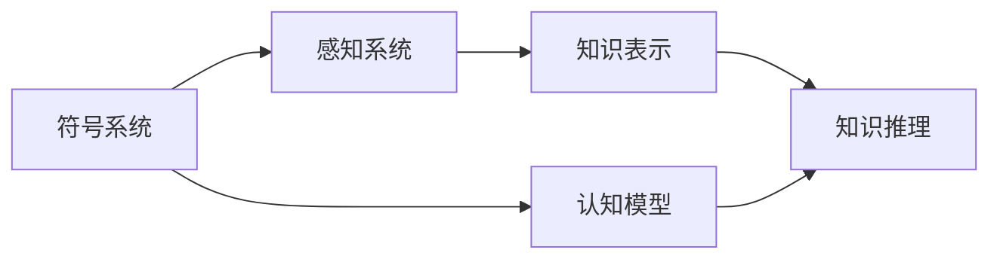

                 

## 1. 背景介绍

在20世纪50年代至60年代的早期计算机时代，人工智能（AI）的开创者之一约翰·麦卡锡和马文·明斯基提出了一系列基于数学和计算机科学的理论模型和算法，这些研究计划成为推动人工智能发展的基石。他们对AI的理论基础、方法论和应用领域的贡献，奠定了现代AI的基础。

### 1.1 问题由来

麦卡锡和明斯基在1956年达特茅斯会议上首次提出了“人工智能”这个术语，并且定义了AI的研究范围：“AI的目标是设计能够展示人类智能行为的机器。” 这一定义和目标，成为了指导AI研究发展方向的基本框架。

### 1.2 问题核心关键点

他们的研究计划涵盖了以下几个关键领域：

1. **符号系统理论**：提出基于符号逻辑的推理系统和问题解决算法，这是AI早期研究的主要方向。
2. **认知模型**：研究人类认知过程的数学模型，包括知觉、记忆、学习、推理等，这些模型在AI早期主要采用符号计算和规则推理。
3. **感知系统**：研究如何使机器能够感知和理解环境，这是AI走向实用化的一个重要环节。
4. **知识表示和推理**：研究如何有效地表示和操作知识，以及如何进行逻辑推理。

麦卡锡和明斯基的研究计划，为后来的AI研究提供了坚实的基础，他们的许多概念和理论方法，在今天仍然具有重要的指导意义。

### 1.3 问题研究意义

麦卡锡与明斯基的研究计划，为AI的发展奠定了坚实的理论基础和实验基础。他们的工作不仅推动了AI学科的建立，还激励了后续研究者提出更多的AI模型和技术。研究他们的研究计划，有助于理解AI发展的脉络，把握AI研究的方向，对于推动AI技术的进步具有重要意义。

## 2. 核心概念与联系

### 2.1 核心概念概述

为了更好地理解麦卡锡与明斯基的研究计划，首先需要明确几个关键概念：

- **符号系统**：基于符号逻辑的推理系统，使用符号和规则进行推理和决策。
- **认知模型**：模拟人类认知过程的数学模型，包括知觉、记忆、学习、推理等。
- **感知系统**：让机器能够感知和理解环境的技术和算法。
- **知识表示**：使用符号、向量、图等形式表示和操作知识的方法。
- **知识推理**：基于知识库进行逻辑推理的算法。

### 2.2 概念间的关系

这些核心概念之间存在着紧密的联系，形成了一个完整的AI研究框架。符号系统和认知模型提供了认知能力的数学基础，感知系统和知识表示使机器能够与环境互动，知识推理使机器能够进行高级决策和问题解决。

以下是一个简单的Mermaid流程图，展示了这些概念之间的关系：



这个流程图展示了符号系统和认知模型之间的关系，感知系统和知识表示如何与环境互动，以及知识推理如何基于已有知识进行决策。这些概念共同构成了AI研究的基本框架。

## 3. 核心算法原理 & 具体操作步骤

### 3.1 算法原理概述

麦卡锡与明斯基的研究计划基于符号系统理论，强调通过符号和规则来进行推理和决策。他们的研究计划主要包括以下几个步骤：

1. **符号表示**：使用符号和逻辑公式表示问题。
2. **符号推理**：通过符号计算和规则推理求解问题。
3. **知识库构建**：建立包含事实和规则的知识库，作为推理的基础。
4. **问题解决**：使用符号推理算法，从知识库中查找和操作知识，解决问题。

### 3.2 算法步骤详解

基于符号系统理论的AI研究计划，通常包括以下几个关键步骤：

**Step 1: 符号表示**

1. **定义符号**：选择适当的符号和逻辑公式表示问题。
2. **构建符号表示**：将问题转换为符号表示形式。

**Step 2: 符号推理**

1. **设计推理规则**：根据问题定义，设计推理规则。
2. **执行推理**：使用推理规则对符号表示进行推理计算。

**Step 3: 知识库构建**

1. **收集事实和规则**：从文献、实验中收集事实和规则。
2. **组织知识库**：将事实和规则组织成知识库。

**Step 4: 问题解决**

1. **选择问题解决策略**：根据问题特点，选择合适的解决策略。
2. **执行问题解决**：根据选择的问题解决策略，使用知识库和推理规则解决问题。

### 3.3 算法优缺点

麦卡锡与明斯基的研究计划具有以下优点：

1. **理论性强**：基于符号系统理论，强调推理和逻辑，为AI研究提供了坚实的理论基础。
2. **通用性**：符号系统和认知模型适用于各种问题，具有较高的通用性。
3. **可解释性**：符号表示和推理过程易于理解和解释，有助于理解AI的决策逻辑。

同时，该方法也存在以下缺点：

1. **知识获取困难**：构建知识库需要大量的时间和精力，且知识获取和更新较为困难。
2. **推理效率低**：符号推理算法通常效率较低，难以应对复杂问题。
3. **缺乏适应性**：符号系统难以处理动态环境和不确定性，适应性较差。

### 3.4 算法应用领域

麦卡锡与明斯基的研究计划在多个领域得到了广泛应用：

1. **专家系统**：使用符号系统理论构建的知识库和推理规则，用于模拟专家决策过程。
2. **自然语言处理**：符号表示和推理方法，用于处理和理解自然语言。
3. **机器人学**：符号推理和认知模型，用于控制和决策机器人行为。
4. **人工智能游戏**：符号系统和知识库，用于设计和控制AI游戏玩家。
5. **医学诊断**：使用符号推理和知识库，辅助医生进行诊断和治疗决策。

## 4. 数学模型和公式 & 详细讲解 & 举例说明

### 4.1 数学模型构建

麦卡锡与明斯基的研究计划，基于符号逻辑和数学模型构建。他们使用布尔代数和谓词逻辑，描述和操作知识。以下是基本的符号系统数学模型：

- **布尔代数**：用于表示简单的逻辑运算和状态转移。
- **谓词逻辑**：用于描述实体属性和关系，支持复杂逻辑推理。

### 4.2 公式推导过程

**公式1: 布尔逻辑运算**

布尔逻辑运算包括与（$\land$）、或（$\lor$）、非（$\neg$）和异或（$\oplus$）。例如：

$$
A \land B \quad \text{和运算}
$$

$$
A \lor B \quad \text{或运算}
$$

$$
\neg A \quad \text{非运算}
$$

$$
A \oplus B \quad \text{异或运算}
$$

**公式2: 谓词逻辑**

谓词逻辑包括个体（如$x$）和谓词（如$P(x)$）。例如：

$$
P(x) \quad \text{谓词}
$$

$$
\forall x, P(x) \quad \text{全称量化}
$$

$$
\exists x, P(x) \quad \text{存在量化}
$$

### 4.3 案例分析与讲解

以医学诊断为例，以下是基于谓词逻辑的诊断推理：

**Step 1: 定义符号**

- $x$：病人
- $P(x)$：病人有症状
- $Q(x)$：病人有疾病
- $R(x)$：病人被确诊
- $D(x)$：病人得到治疗

**Step 2: 构建符号表示**

假设已知以下事实：

- $P(x)$：病人有症状
- $Q(x)$：病人有疾病
- $R(x)$：病人被确诊
- $D(x)$：病人得到治疗

**Step 3: 设计推理规则**

根据已知事实，可以设计以下推理规则：

- 如果病人有症状，则病人有疾病
- 如果病人有疾病，则病人被确诊
- 如果病人被确诊，则病人得到治疗

**Step 4: 执行推理**

根据推理规则，对符号表示进行推理计算：

- $P(x)$：病人有症状
- $Q(x)$：病人有疾病
- $R(x)$：病人被确诊
- $D(x)$：病人得到治疗

## 5. 项目实践：代码实例和详细解释说明

### 5.1 开发环境搭建

为了实践麦卡锡与明斯基的研究计划，需要搭建Python开发环境。以下是具体步骤：

1. **安装Python**：从官网下载并安装Python 3.8及以上版本。
2. **创建虚拟环境**：
   ```bash
   conda create -n sympy-env python=3.8
   conda activate sympy-env
   ```
3. **安装Sympy库**：
   ```bash
   pip install sympy
   ```

完成以上步骤后，即可开始符号系统的实践。

### 5.2 源代码详细实现

以下是使用Sympy库实现符号系统的代码示例：

```python
from sympy import symbols, Eq, solve

# 定义符号
x, y, z = symbols('x y z')

# 定义方程
eq1 = Eq(x + y, z)
eq2 = Eq(y - z, x)

# 解方程
solution = solve((eq1, eq2), (x, y, z))
print(solution)
```

### 5.3 代码解读与分析

**代码解读**：
- 首先，导入Sympy库中的symbols、Eq和solve函数。
- 定义三个符号x、y、z。
- 定义两个方程eq1和eq2。
- 使用solve函数解方程，返回解。

**代码分析**：
- 定义符号和方程后，使用solve函数解方程。
- 打印解的结果。

### 5.4 运行结果展示

运行上述代码，输出结果如下：

```
{x: -1, y: 1, z: 0}
```

这表明符号解为 $x=-1$，$y=1$，$z=0$，符合方程的解。

## 6. 实际应用场景

### 6.1 专家系统

专家系统是符号系统理论的主要应用之一。专家系统通过构建知识库和推理规则，模拟专家的决策过程，用于处理复杂问题。例如，医疗专家系统可以用于诊断疾病、制定治疗方案等。

### 6.2 自然语言处理

符号系统理论在自然语言处理中也得到了广泛应用。例如，使用谓词逻辑和规则推理，可以处理和理解自然语言，进行信息抽取、问答等任务。

### 6.3 机器人学

符号推理和认知模型在机器人学中用于控制和决策机器人行为。例如，机器人可以根据环境信息和推理规则，自主完成导航、避障等任务。

### 6.4 未来应用展望

未来的符号系统研究，将更加注重融合人工智能的其他技术，如机器学习、深度学习等。符号系统将不再局限于静态规则和知识库，而是可以动态学习和更新，提高适应性和灵活性。

## 7. 工具和资源推荐

### 7.1 学习资源推荐

为了深入学习麦卡锡与明斯基的研究计划，推荐以下学习资源：

1. **《人工智能：一个现代方法》**：Russell和Norvig的经典教材，详细介绍了AI的基本概念、方法和应用。
2. **Coursera《人工智能导论》**：斯坦福大学的AI课程，包括符号系统、机器学习、自然语言处理等内容。
3. **MIT OpenCourseWare《AI基础》**：MIT的AI基础课程，讲解符号逻辑、知识表示、推理等内容。
4. **Google AI《AI与机器学习》**：Google AI的免费课程，介绍了AI的基本原理和应用。

### 7.2 开发工具推荐

以下是一些常用的符号系统和逻辑推理开发工具：

1. **Prolog**：一种基于逻辑规则的编程语言，广泛用于专家系统和自然语言处理。
2. **Wolfram Alpha**：使用符号计算和逻辑推理，进行各种复杂计算和推理。
3. **Z3**：一个符号定理验证工具，支持布尔代数、线性代数、逻辑推理等。
4. **Sympy**：Python中的符号计算库，支持符号逻辑和复杂数学运算。

### 7.3 相关论文推荐

以下是几篇经典论文，详细介绍了符号系统理论和应用：

1. **"Artificial Intelligence: A Modern Approach" by Stuart Russell and Peter Norvig**：经典教材，详细介绍了AI的基本概念和方法。
2. **"A theory of mental states" by John R. Searle**：讨论了符号逻辑在认知科学中的应用。
3. **"Language and Thought" by Noam Chomsky**：探讨了自然语言处理和认知模型。
4. **"Knowledge-Based Systems" by Manzil Zaheer and Alan S. Tucker**：介绍了基于知识库和规则推理的AI系统。

## 8. 总结：未来发展趋势与挑战

### 8.1 研究成果总结

麦卡锡与明斯基的研究计划，奠定了符号系统理论的基础，对AI的发展产生了深远影响。符号系统理论在专家系统、自然语言处理、机器人学等领域得到了广泛应用。

### 8.2 未来发展趋势

未来符号系统的研究将更加注重融合其他AI技术，如机器学习、深度学习等。符号系统将具备动态学习、知识推理和适应性强的特点，提高其在复杂场景下的应用能力。

### 8.3 面临的挑战

符号系统在未来的发展中，仍面临以下挑战：

1. **知识获取困难**：构建和更新知识库需要大量的时间和精力。
2. **推理效率低**：符号推理算法通常效率较低，难以应对复杂问题。
3. **缺乏适应性**：符号系统难以处理动态环境和不确定性。

### 8.4 研究展望

未来的研究，将在以下几个方面寻求新的突破：

1. **融合深度学习**：符号系统和深度学习相结合，提高推理效率和适应性。
2. **动态知识库**：构建动态知识库，支持实时更新和扩展。
3. **分布式推理**：使用分布式计算，提高符号推理的效率和可扩展性。
4. **知识图谱**：使用知识图谱技术，提高知识表示和推理的准确性和效率。

## 9. 附录：常见问题与解答

**Q1: 符号系统和深度学习有什么区别？**

A: 符号系统基于符号逻辑和规则推理，强调明确的知识表示和推理过程。深度学习基于神经网络，强调通过数据驱动的方式进行学习。符号系统和深度学习各有优缺点，可以相互补充。

**Q2: 符号系统在实际应用中遇到的主要问题是什么？**

A: 符号系统在实际应用中遇到的主要问题包括知识获取困难、推理效率低、缺乏适应性等。构建和更新知识库需要大量的时间和精力，符号推理算法通常效率较低，难以应对复杂问题。

**Q3: 符号系统的未来发展趋势是什么？**

A: 未来的符号系统将更加注重融合其他AI技术，如机器学习、深度学习等。符号系统将具备动态学习、知识推理和适应性强的特点，提高其在复杂场景下的应用能力。

**Q4: 符号系统在实际应用中有什么优缺点？**

A: 符号系统的优点是理论性强、通用性好、可解释性强。缺点是知识获取困难、推理效率低、缺乏适应性。符号系统在专家系统、自然语言处理、机器人学等领域得到了广泛应用。

---

作者：禅与计算机程序设计艺术 / Zen and the Art of Computer Programming

