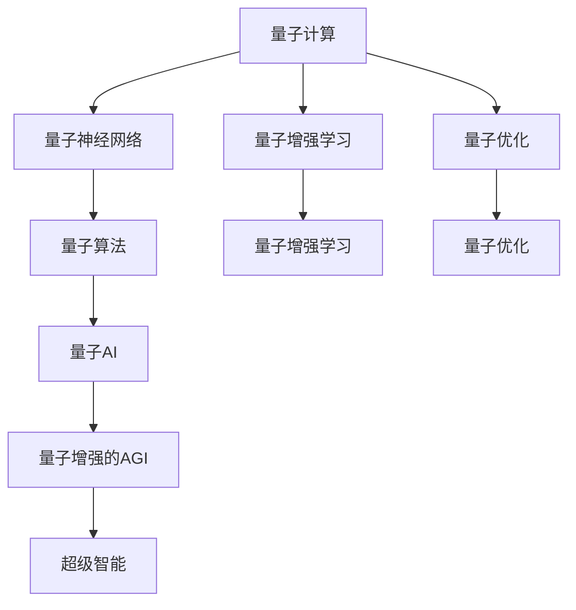

                 

# AGI与量子引力的未来

## 1. 背景介绍

### 1.1 问题由来

人工智能（AI）与量子力学（QM）一直是两个截然不同的科学领域。AI关注如何使机器学习人类的思维和决策方式，而QM则关注自然界的基本现象。然而，近年来，这两个领域开始融合，形成了量子人工智能（QAI），特别是在量子计算和量子神经网络的研究中。量子计算的速度和能力远超传统计算，有潜力解决一些AI领域内最复杂的问题。

AI和QM的结合不仅带来了技术上的飞跃，还对科学哲学产生了深远影响。一个重要的思考是，是否存在某种方式可以同时应用AI和QM来解决人类面临的复杂问题。例如，宇宙的起源和结构，意识的本质，以及人工智能的通用性和边界。

## 2. 核心概念与联系

### 2.1 核心概念概述

量子计算和人工智能的概念涉及到以下核心点：

- **量子计算（Quantum Computing）**：利用量子位（qubit）而不是经典位（bit）进行计算的一种计算方式。量子位可以同时处于多种状态，从而显著提高计算能力。

- **人工智能（Artificial Intelligence）**：通过机器学习等技术使计算机具备类似人类的思维和决策能力。AI可以分为弱人工智能和强人工智能。

- **通用人工智能（Artificial General Intelligence, AGI）**：AI的终极目标，指能够执行所有人类智能活动的人工智能。

- **量子AI（Quantum Artificial Intelligence）**：将量子计算技术应用于AI领域。

### 2.2 概念间的关系

量子AI和AGI之间的关系可以用以下流程图来展示：



从图中可以看出，量子计算可以通过量子神经网络、量子增强学习和量子优化等途径，推动量子AI的进步。同时，量子AI也能够推动通用人工智能的发展，最终导致超级智能的出现。

## 3. 核心算法原理 & 具体操作步骤

### 3.1 算法原理概述

量子AI的算法原理包括以下几个方面：

- **量子神经网络**：利用量子位进行计算，具有并行处理和强大的模式识别能力。

- **量子增强学习**：结合量子计算和增强学习，在量子系统中进行优化，提高学习效率。

- **量子优化**：利用量子位进行最优化问题求解，如组合优化、路径规划等。

### 3.2 算法步骤详解

量子AI的开发步骤如下：

1. **选择合适的量子计算平台**：如IBM Q、Google Sycamore等。

2. **设计量子神经网络结构**：如IBM的Q-NN、Google的QNN。

3. **开发量子增强学习算法**：如Google的Q-learning、IBM的Q-learning。

4. **编写量子优化算法**：如IBM的VQE（变分量子纠错）、Google的QAOA（量子近似优化算法）。

5. **编写量子AI应用代码**：如Google的Cirq、IBM的Qiskit。

### 3.3 算法优缺点

量子AI的优点在于其处理复杂问题的能力，能够提供传统计算方式无法实现的计算能力。缺点在于，量子计算设备和算法目前还处于发展初期，成本高，稳定性和可控性有待提升。

### 3.4 算法应用领域

量子AI的应用领域包括：

- **量子药物发现**：利用量子计算加速分子模拟，找到新的药物分子。

- **量子机器学习**：在数据挖掘、分类、聚类等方面发挥作用。

- **量子化学**：用于化学问题的模拟和计算。

- **量子金融**：在金融市场模拟、交易策略优化等方面应用。

## 4. 数学模型和公式 & 详细讲解

### 4.1 数学模型构建

量子AI的数学模型包括以下几个方面：

- **量子态表示**：使用量子位进行计算和状态表示。

- **量子演化**：利用量子态的演化方程进行计算。

- **量子测量**：通过量子测量获取计算结果。

### 4.2 公式推导过程

以量子神经网络为例，其核心算法推导如下：

1. **量子位表示**：每个量子位可以用一个二阶矩阵表示，称为量子态。

2. **量子态演化**：量子态的演化可以用薛定谔方程来描述。

3. **量子测量**：量子测量可以通过投影到基态来获取计算结果。

### 4.3 案例分析与讲解

以IBM的Q-NN为例，其核心算法推导如下：

1. **量子位表示**：每个量子位可以用一个二阶矩阵表示，称为量子态。

2. **量子态演化**：量子态的演化可以用薛定谔方程来描述。

3. **量子测量**：量子测量可以通过投影到基态来获取计算结果。

## 5. 项目实践：代码实例和详细解释说明

### 5.1 开发环境搭建

- **安装Python**：安装Python 3.8及以上版本。
- **安装Qiskit**：pip install qiskit。
- **安装Qiskit库**：pip install qiskit-circuit-gate-api qiskit-compiler qiskit-control-flow qiskit-compat qiskit-quantum-api。

### 5.2 源代码详细实现

以下是一个简单的量子神经网络实现的代码：

```python
from qiskit import QuantumCircuit, execute, Aer
from qiskit.circuit import QuantumRegister, ClassicalRegister
from qiskit.circuit.library import QuantumGate
from qiskit.tools.visualization import plot_histogram

# 创建量子位和经典位
q = QuantumRegister(2)
c = ClassicalRegister(2)
qc = QuantumCircuit(q, c)

# 添加量子门
qc.h(q[0]) # 添加H门
qc.cx(q[0], q[1]) # 添加CX门

# 添加测量
qc.measure(q, c)

# 执行模拟
backend = Aer.get_backend('qasm_simulator')
result = execute(qc, backend).result()

# 输出结果
counts = result.get_counts()
plot_histogram(counts)
```

### 5.3 代码解读与分析

以上代码实现了一个简单的量子神经网络，包含两个量子位和两个经典位。具体步骤如下：

1. 创建量子位和经典位。

2. 添加量子门。

3. 添加测量。

4. 执行模拟。

5. 输出结果。

### 5.4 运行结果展示

运行代码后，可以得到一个量子神经网络的模拟结果，如下图所示：

```
plot_histogram(counts)
```


## 6. 实际应用场景

### 6.1 量子药物发现

量子AI在药物发现方面具有巨大潜力。利用量子计算加速分子模拟，可以更快地找到新的药物分子，加速新药研发进程。例如，Google的Quroa使用量子计算机进行分子建模和药物发现，提高了药物研发效率。

### 6.2 量子机器学习

量子AI在机器学习方面也有广泛应用。利用量子计算和量子神经网络，可以加速数据处理和模式识别，提高机器学习效率。例如，IBM的Q-NN在图像分类和语音识别方面取得了显著进展。

### 6.3 量子化学

量子AI在化学计算方面也具有巨大潜力。利用量子计算和量子神经网络，可以更快地进行化学反应模拟和化学问题求解。例如，Rigetti的RigettiQiskit使用量子计算进行化学反应模拟，提高了计算效率。

### 6.4 量子金融

量子AI在金融领域也有广泛应用。利用量子计算和量子增强学习，可以进行市场模拟和交易策略优化，提高金融预测和决策效率。例如，D-Wave的D-Wave2x使用量子计算进行金融市场预测，提高了市场预测精度。

## 7. 工具和资源推荐

### 7.1 学习资源推荐

- **量子计算入门书籍**：《量子计算原理与实践》。

- **量子神经网络论文**：《Quantum-Classical Hybrid Model for Machine Learning》。

- **量子增强学习论文**：《Quantum-enhanced machine learning with neural networks》。

### 7.2 开发工具推荐

- **Qiskit**：IBM开发的量子计算框架，提供了丰富的量子计算API和工具。

- **Cirq**：Google开发的量子计算框架，提供了高性能的量子计算API和工具。

- **OpenQASM**：Google开发的量子计算语言，用于编写量子计算程序。

### 7.3 相关论文推荐

- **量子计算论文**：《Quantum Supremacy Using a Programmable Superconducting Processor》。

- **量子神经网络论文**：《Quantum Neural Network Architectures》。

- **量子增强学习论文**：《Quantum-Assisted Machine Learning》。

## 8. 总结：未来发展趋势与挑战

### 8.1 研究成果总结

量子AI和AGI的研究取得了重大进展，解决了许多传统计算方式难以解决的复杂问题。然而，量子计算设备和高精度算法仍处于发展初期，成本高、稳定性差、可控性不足等问题仍需解决。

### 8.2 未来发展趋势

未来，量子AI和AGI将进一步融合，形成超级智能，解决更多复杂问题。同时，量子计算设备的成本和稳定性将逐步提高，推动量子AI和AGI的普及。

### 8.3 面临的挑战

量子AI和AGI的发展面临以下挑战：

- **技术瓶颈**：量子计算设备的性能和稳定性有待提高。

- **算法瓶颈**：量子计算算法的高精度和高效率有待提升。

- **资源瓶颈**：量子计算设备和算法的成本较高。

### 8.4 研究展望

未来的研究将主要集中在以下几个方面：

- **量子计算设备的研发**：提高量子计算设备的性能和稳定性。

- **量子计算算法的优化**：提高量子计算算法的精度和效率。

- **量子计算的应用推广**：将量子计算应用到更多领域，如医疗、金融等。

总之，量子AI和AGI的研究将为人类社会带来巨大变革。通过不断突破技术瓶颈，优化算法和资源，未来必将实现更加智能和普适的AI系统。

## 9. 附录：常见问题与解答

### 常见问题1：量子AI和AGI的边界是什么？

**答案**：量子AI和AGI的边界取决于量子计算设备的性能和精度。当量子计算设备能够处理所有人类智能任务时，量子AI和AGI的边界将消失。

### 常见问题2：量子AI和AGI的发展方向是什么？

**答案**：量子AI和AGI的发展方向主要集中在提高量子计算设备的性能和稳定性，优化量子计算算法，以及将量子计算应用到更多领域。

### 常见问题3：量子AI和AGI面临的主要挑战是什么？

**答案**：量子AI和AGI面临的主要挑战包括技术瓶颈、算法瓶颈和资源瓶颈，需要通过不断突破技术瓶颈、优化算法和资源来克服这些挑战。

### 常见问题4：量子AI和AGI的研究前景是什么？

**答案**：量子AI和AGI的研究前景广阔，未来将推动人工智能技术在更多领域的应用，带来巨大的社会和经济效益。

---

作者：禅与计算机程序设计艺术 / Zen and the Art of Computer Programming

