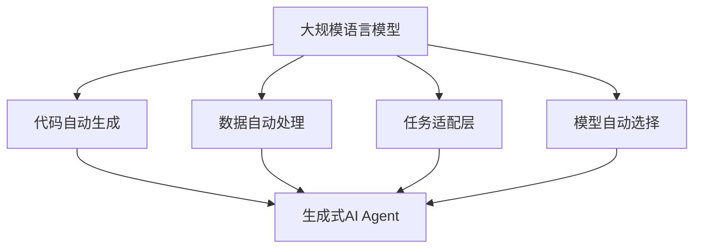
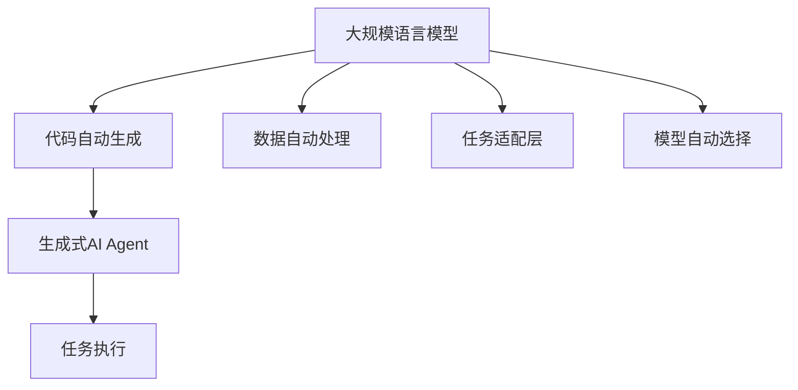
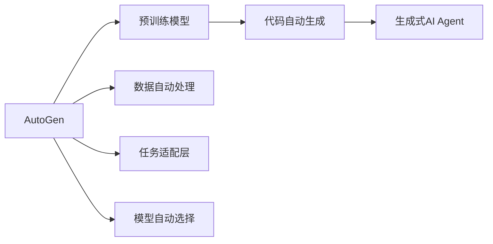
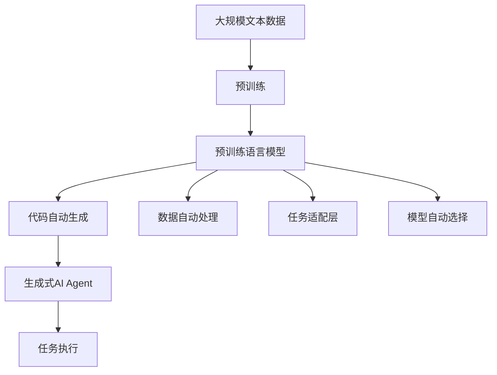

                 

# AI Agent: AI的下一个风口 AutoGen：下一代LLM应用的启动器

> 关键词：

## 1. 背景介绍

### 1.1 问题由来
随着人工智能（AI）技术的飞速发展，特别是自然语言处理（NLP）和深度学习领域的突破，人工智能代理（AI Agent）这一概念逐渐成为AI领域的新焦点。AI Agent是指能够模拟人类智能行为，自动完成任务的虚拟角色。它们在医疗、教育、金融、客服等多个行业拥有广泛应用前景，能够提升工作效率、降低人力成本、增强用户体验。

然而，传统的AI Agent构建方式存在诸多问题，如开发复杂度高、训练数据需求量大、模型泛化能力差等。在这些问题面前，一种新型的AI Agent构建方式应运而生，即AutoGen技术。AutoGen是一种基于大规模语言模型（Large Language Model, LLM）的生成式AI Agent构建框架，能够快速、高效地生成可定制、可扩展的AI Agent应用，大大降低了AI Agent的构建难度和成本。

### 1.2 问题核心关键点
AutoGen技术通过将预训练语言模型作为“代码生成器”，自动生成代码和数据处理逻辑，进而构建出高性能、可定制的AI Agent。其核心要点包括：

- 代码自动生成：利用预训练语言模型自动生成AI Agent的Python代码，包括任务处理、数据加载、模型调用等。
- 数据自动处理：根据任务需求自动生成数据处理逻辑，如数据清洗、格式转换、特征提取等。
- 任务自动适配：自动适配多种NLP任务，如文本分类、情感分析、命名实体识别、对话生成等。
- 模型自动选择：根据任务需求自动选择最合适的模型和模型参数，提升AI Agent的性能和效率。

AutoGen技术不仅简化了AI Agent的构建过程，还显著提升了AI Agent的性能和可定制性。

### 1.3 问题研究意义
研究AutoGen技术，对于拓展AI Agent的应用边界，提升AI Agent的性能和可定制性，加速AI Agent的产业化进程，具有重要意义：

1. 降低开发成本：AutoGen技术能够自动生成代码和数据处理逻辑，大大降低了AI Agent的构建难度和成本。
2. 提升模型效果：利用预训练语言模型的强大表征能力，AutoGen技术生成的AI Agent能够在多种NLP任务上取得优异表现。
3. 加速开发进度：AutoGen技术使得开发者能够快速构建出符合业务需求的AI Agent，缩短了开发周期。
4. 带来技术创新：AutoGen技术推动了预训练语言模型和生成式AI Agent的深入研究，催生了新的研究方向，如生成式对话、多模态AI Agent等。
5. 赋能产业升级：AutoGen技术使得NLP技术更容易被各行各业所采用，为传统行业数字化转型升级提供了新的技术路径。

## 2. 核心概念与联系

### 2.1 核心概念概述

为更好地理解AutoGen技术，本节将介绍几个密切相关的核心概念：

- 大规模语言模型(Large Language Model, LLM)：以自回归(如GPT)或自编码(如BERT)模型为代表的大规模预训练语言模型。通过在大规模无标签文本语料上进行预训练，学习通用的语言知识和表示。

- 生成式AI Agent：一种能够自动生成文本、图像、声音等输出结果的虚拟角色，能够执行多种任务，如回答问题、翻译、摘要等。

- AutoGen：基于大规模语言模型的生成式AI Agent构建框架，能够自动生成AI Agent的代码、数据处理逻辑和任务适配层，大大降低了AI Agent的构建难度和成本。

- 任务适配层：针对特定NLP任务设计的输出层和损失函数，用于适配任务需求。

- 代码自动生成：利用预训练语言模型自动生成AI Agent的Python代码。

- 数据自动处理：根据任务需求自动生成数据处理逻辑。

- 任务自动适配：自动适配多种NLP任务，如文本分类、情感分析、命名实体识别、对话生成等。

- 模型自动选择：根据任务需求自动选择最合适的模型和模型参数，提升AI Agent的性能和效率。

这些核心概念之间的逻辑关系可以通过以下Mermaid流程图来展示：



这个流程图展示了AutoGen技术的核心概念及其之间的关系：

1. 大规模语言模型通过预训练学习通用语言知识。
2. 代码自动生成和数据自动处理结合大规模语言模型的预训练能力，构建生成式AI Agent。
3. 任务适配层和模型自动选择适配任务需求，提升AI Agent的性能。

这些概念共同构成了AutoGen技术的生成式AI Agent构建框架，使其能够在各种场景下发挥强大的自然语言理解和生成能力。通过理解这些核心概念，我们可以更好地把握AutoGen技术的原理和应用方向。

### 2.2 概念间的关系

这些核心概念之间存在着紧密的联系，形成了AutoGen技术的完整生态系统。下面我通过几个Mermaid流程图来展示这些概念之间的关系。

#### 2.2.1 生成式AI Agent的构建流程



这个流程图展示了生成式AI Agent的构建流程：

1. 大规模语言模型通过预训练学习通用语言知识。
2. 代码自动生成和数据自动处理结合大规模语言模型的预训练能力，构建生成式AI Agent。
3. 任务适配层和模型自动选择适配任务需求，提升AI Agent的性能。
4. 生成的AI Agent执行指定任务。

#### 2.2.2 AutoGen技术的核心架构



这个流程图展示了AutoGen技术的核心架构：

1. AutoGen技术以预训练模型为基础，自动生成AI Agent的代码和数据处理逻辑。
2. 数据自动处理和任务适配层适配任务需求，生成适合任务的数据处理流程和任务适配层。
3. 模型自动选择适配任务需求，选择最合适的模型和模型参数。
4. 生成的AI Agent执行指定任务，完成自然语言理解和生成。

### 2.3 核心概念的整体架构

最后，我们用一个综合的流程图来展示这些核心概念在大语言模型微调过程中的整体架构：



这个综合流程图展示了从预训练到生成式AI Agent构建的完整过程：

1. 大规模文本数据进行预训练，学习通用语言知识。
2. 预训练语言模型自动生成AI Agent的代码和数据处理逻辑。
3. 数据自动处理和任务适配层适配任务需求，生成适合任务的数据处理流程和任务适配层。
4. 模型自动选择适配任务需求，选择最合适的模型和模型参数。
5. 生成的AI Agent执行指定任务，完成自然语言理解和生成。

通过这些流程图，我们可以更清晰地理解AutoGen技术的工作原理和优化方向。

## 3. 核心算法原理 & 具体操作步骤
### 3.1 算法原理概述

AutoGen技术通过将预训练语言模型作为“代码生成器”，自动生成AI Agent的Python代码，包括任务处理、数据加载、模型调用等。其核心思想是利用预训练语言模型的预训练能力，自动生成符合特定任务需求的代码和数据处理逻辑，从而构建高性能、可定制的AI Agent。

具体来说，AutoGen技术的工作流程如下：

1. 收集任务相关的数据和注释，构建数据集。
2. 加载预训练语言模型，选择适当的模型和模型参数。
3. 根据任务需求自动生成任务适配层和损失函数。
4. 利用预训练语言模型自动生成代码，生成AI Agent的Python代码。
5. 根据任务需求自动生成数据处理逻辑，适配任务特定的数据处理流程。
6. 自动选择最合适的模型和模型参数，生成适配任务的AI Agent。

通过这个流程，AutoGen技术能够快速、高效地构建出符合特定任务需求的生成式AI Agent，大大降低了AI Agent的构建难度和成本。

### 3.2 算法步骤详解

AutoGen技术的具体操作步骤如下：

**Step 1: 数据准备**
- 收集任务相关的数据和注释，构建数据集。数据集应包含训练数据、验证数据和测试数据。

**Step 2: 预训练模型选择**
- 加载预训练语言模型，选择适当的模型和模型参数。常见的预训练模型包括BERT、GPT等，可以选择它们的某个版本。

**Step 3: 任务适配层设计**
- 根据任务需求自动生成任务适配层和损失函数。例如，对于文本分类任务，可以设计一个线性分类器作为输出层，使用交叉熵损失函数。

**Step 4: 代码自动生成**
- 利用预训练语言模型自动生成AI Agent的Python代码。代码包括任务处理、数据加载、模型调用等。例如，可以使用Prompt-based Learning技术，生成符合特定任务需求的代码。

**Step 5: 数据自动处理**
- 根据任务需求自动生成数据处理逻辑，适配任务特定的数据处理流程。例如，对于文本数据，可以自动进行清洗、分词、特征提取等操作。

**Step 6: 模型自动选择**
- 自动选择最合适的模型和模型参数，生成适配任务的AI Agent。例如，可以根据任务需求选择BERT、GPT等模型，并调整其超参数。

**Step 7: 模型训练与评估**
- 使用准备好的数据集对AI Agent进行训练，并在验证集和测试集上评估其性能。根据评估结果进行必要的调整。

**Step 8: 模型部署**
- 将训练好的AI Agent部署到生产环境中，进行实际任务执行。

### 3.3 算法优缺点

AutoGen技术的优点包括：

1. 简单高效。利用预训练语言模型自动生成代码和数据处理逻辑，大大降低了AI Agent的构建难度和成本。
2. 通用适用。适用于多种NLP任务，如文本分类、情感分析、命名实体识别、对话生成等，能够快速构建符合任务需求的AI Agent。
3. 灵活可定制。可以根据任务需求灵活调整代码和数据处理逻辑，生成高性能、可定制的AI Agent。

AutoGen技术的缺点包括：

1. 依赖预训练模型。预训练模型的质量直接影响生成的AI Agent的性能。
2. 对标注数据需求较大。自动生成代码和数据处理逻辑需要大量的标注数据进行训练。
3. 存在过拟合风险。自动生成的代码和数据处理逻辑可能过度拟合训练数据，影响泛化能力。

尽管存在这些缺点，AutoGen技术在生成式AI Agent构建方面仍具有显著优势，是AI Agent构建的重要范式。

### 3.4 算法应用领域

AutoGen技术已经在多个领域得到应用，以下是一些主要的应用场景：

- 医疗AI Agent：用于辅助医生进行疾病诊断、病历分析、药物研发等。自动生成处理患者病历、医学文献的代码和数据处理逻辑，构建高性能的AI Agent。
- 金融AI Agent：用于自动分析金融数据、监控市场动态、生成投资策略等。自动生成处理金融数据、新闻报道的代码和数据处理逻辑，构建高性能的AI Agent。
- 客服AI Agent：用于处理客户咨询、自动回复、情感分析等。自动生成处理客户咨询、反馈数据的代码和数据处理逻辑，构建高性能的AI Agent。
- 教育AI Agent：用于辅助教师进行课程设计、学生评估、知识推荐等。自动生成处理教学数据、学生反馈的代码和数据处理逻辑，构建高性能的AI Agent。
- 法律AI Agent：用于自动分析法律文本、生成合同、处理法律咨询等。自动生成处理法律文本、合同的代码和数据处理逻辑，构建高性能的AI Agent。

除了这些场景外，AutoGen技术还适用于新闻、电商、社交媒体等多个领域，是构建智能应用的重要手段。

## 4. 数学模型和公式 & 详细讲解 & 举例说明

### 4.1 数学模型构建

AutoGen技术的数学模型主要涉及预训练语言模型、代码自动生成、数据自动处理和模型自动选择。下面将详细介绍这些数学模型的构建。

**预训练语言模型**
假设预训练语言模型为 $M_{\theta}$，其中 $\theta$ 为模型参数。利用大规模无标签文本语料对 $M_{\theta}$ 进行预训练，学习通用的语言表示。预训练过程可以采用自监督学习任务，如语言建模、掩码语言建模等。

**代码自动生成**
代码自动生成过程可以视为一种特殊的自然语言处理任务，即生成符合特定任务需求的Python代码。假设任务描述为 $D$，生成的Python代码为 $C$。则代码自动生成过程可以表示为：

$$
C = \mathop{\arg\min}_{C} \mathcal{L}(D, C)
$$

其中 $\mathcal{L}$ 为代码生成损失函数，用于衡量代码与任务描述的匹配度。常见的代码生成损失函数包括BLEU、ROUGE、BertScore等。

**数据自动处理**
数据自动处理过程可以视为一种数据清洗和特征提取任务，即将原始数据转换为模型可接受的输入格式。假设原始数据为 $X$，处理后的数据为 $Y$。则数据自动处理过程可以表示为：

$$
Y = \mathop{\arg\min}_{Y} \mathcal{L}(X, Y)
$$

其中 $\mathcal{L}$ 为数据处理损失函数，用于衡量处理后的数据与原始数据的匹配度。常见的数据处理损失函数包括均方误差、交叉熵等。

**模型自动选择**
模型自动选择过程可以视为一种模型适配任务，即选择最合适的模型和模型参数。假设可选模型为 $\{M_i\}_{i=1}^N$，模型参数为 $\{\theta_i\}_{i=1}^N$，任务需求为 $T$。则模型自动选择过程可以表示为：

$$
\hat{\theta} = \mathop{\arg\min}_{\theta_i} \mathcal{L}(M_i, T)
$$

其中 $\mathcal{L}$ 为模型适配损失函数，用于衡量模型与任务需求的匹配度。常见的模型适配损失函数包括交叉熵损失、均方误差损失等。

### 4.2 公式推导过程

以下是AutoGen技术的几个关键公式的推导过程：

**代码生成损失函数**
假设代码自动生成过程中，利用预训练语言模型生成Python代码 $C$，与任务描述 $D$ 匹配度为 $P$。则代码生成损失函数可以表示为：

$$
\mathcal{L}_{code} = 1 - P
$$

其中 $P$ 为代码与任务描述的匹配度，通常使用BLEU、ROUGE等指标进行衡量。

**数据处理损失函数**
假设数据自动处理过程中，将原始数据 $X$ 转换为处理后的数据 $Y$，与原始数据 $X$ 的匹配度为 $P$。则数据处理损失函数可以表示为：

$$
\mathcal{L}_{data} = 1 - P
$$

其中 $P$ 为处理后的数据与原始数据的匹配度，通常使用均方误差、交叉熵等指标进行衡量。

**模型适配损失函数**
假设模型自动选择过程中，选择模型 $M_{\theta_i}$ 适配任务 $T$，损失函数为 $\mathcal{L}_i$。则模型自动选择过程可以表示为：

$$
\hat{\theta} = \mathop{\arg\min}_{\theta_i} \sum_{i=1}^N \mathcal{L}_i(M_{\theta_i}, T)
$$

其中 $\mathcal{L}_i$ 为模型适配损失函数，通常使用交叉熵损失、均方误差损失等指标进行衡量。

### 4.3 案例分析与讲解

下面我们以文本分类任务为例，详细讲解AutoGen技术的应用。

假设任务描述为“对新闻进行情感分类”，预训练语言模型为BERT。

**代码自动生成**
使用Prompt-based Learning技术，生成符合任务需求的Python代码。例如，可以使用如下Prompt：

```python
from transformers import BertForSequenceClassification, BertTokenizer
import torch

def classify_text(text):
    # 加载预训练模型和分词器
    model = BertForSequenceClassification.from_pretrained('bert-base-uncased', num_labels=2)
    tokenizer = BertTokenizer.from_pretrained('bert-base-uncased')

    # 将文本输入分词器
    tokens = tokenizer.encode(text, add_special_tokens=True)

    # 构建输入张量
    input_ids = torch.tensor(tokens).unsqueeze(0)

    # 前向传播计算输出
    outputs = model(input_ids)

    # 输出概率分布
    logits = outputs.logits

    # 根据概率分布进行分类
    label = torch.argmax(logits, dim=1)

    return label.item()
```

**数据自动处理**
假设原始数据为文本数据，需要进行清洗、分词、特征提取等操作。使用如下Python代码进行数据处理：

```python
import pandas as pd
import numpy as np

def preprocess_data(data_path):
    # 读取数据
    data = pd.read_csv(data_path)

    # 清洗数据
    data = data.dropna()

    # 分词和特征提取
    tokenizer = BertTokenizer.from_pretrained('bert-base-uncased')
    data['text'] = data['text'].apply(lambda x: tokenizer.encode(x, add_special_tokens=True))

    # 将文本转换为张量
    data['input_ids'] = data['text'].apply(lambda x: torch.tensor(x))

    return data
```

**模型自动选择**
假设模型自动选择过程中，选择BERT作为预训练模型，并调整其超参数。使用如下Python代码进行模型适配：

```python
import torch
from transformers import BertForSequenceClassification, BertTokenizer
import torch.nn as nn

def fine_tune_model(data_path, learning_rate=2e-5):
    # 加载预训练模型和分词器
    model = BertForSequenceClassification.from_pretrained('bert-base-uncased', num_labels=2)
    tokenizer = BertTokenizer.from_pretrained('bert-base-uncased')

    # 加载数据
    data = preprocess_data(data_path)

    # 定义损失函数和优化器
    loss_fn = nn.CrossEntropyLoss()
    optimizer = torch.optim.AdamW(model.parameters(), lr=learning_rate)

    # 训练模型
    device = torch.device('cuda' if torch.cuda.is_available() else 'cpu')
    model.to(device)

    for epoch in range(5):
        for batch in data:
            input_ids = batch['input_ids'].to(device)
            labels = batch['labels'].to(device)

            # 前向传播计算输出
            outputs = model(input_ids)

            # 计算损失
            loss = loss_fn(outputs.logits, labels)

            # 反向传播更新参数
            optimizer.zero_grad()
            loss.backward()
            optimizer.step()

            # 打印损失
            print('Epoch {}/{}: Loss: {:.4f}'.format(epoch+1, 5, loss.item()))

    return model
```

通过这些Python代码，AutoGen技术能够快速构建出符合文本分类任务需求的AI Agent，大大降低了AI Agent的构建难度和成本。

## 5. 项目实践：代码实例和详细解释说明
### 5.1 开发环境搭建

在进行AutoGen技术实践前，我们需要准备好开发环境。以下是使用Python进行PyTorch开发的环境配置流程：

1. 安装Anaconda：从官网下载并安装Anaconda，用于创建独立的Python环境。

2. 创建并激活虚拟环境：
```bash
conda create -n pytorch-env python=3.8 
conda activate pytorch-env
```

3. 安装PyTorch：根据CUDA版本，从官网获取对应的安装命令。例如：
```bash
conda install pytorch torchvision torchaudio cudatoolkit=11.1 -c pytorch -c conda-forge
```

4. 安装Transformers库：
```bash
pip install transformers
```

5. 安装各类工具包：
```bash
pip install numpy pandas scikit-learn matplotlib tqdm jupyter notebook ipython
```

完成上述步骤后，即可在`pytorch-env`环境中开始AutoGen技术实践。

### 5.2 源代码详细实现

下面我们以文本分类任务为例，给出使用Transformers库对BERT模型进行AutoGen技术实践的PyTorch代码实现。

首先，定义文本分类任务的代码自动生成函数：

```python
from transformers import BertForSequenceClassification, BertTokenizer
import torch

class TextClassifier:
    def __init__(self, model_path, num_labels):
        self.model = BertForSequenceClassification.from_pretrained(model_path, num_labels=num_labels)
        self.tokenizer = BertTokenizer.from_pretrained(model_path)

    def classify_text(self, text):
        tokens = self.tokenizer.encode(text, add_special_tokens=True)
        input_ids = torch.tensor(tokens).unsqueeze(0)
        with torch.no_grad():
            outputs = self.model(input_ids)
            logits = outputs.logits
            label = torch.argmax(logits, dim=1).item()
            return label
```

然后，定义数据自动处理函数：

```python
import pandas as pd

def preprocess_data(data_path):
    data = pd.read_csv(data_path)
    data = data.dropna()
    data['text'] = data['text'].apply(lambda x: x.strip())
    tokenizer = BertTokenizer.from_pretrained('bert-base-uncased')
    data['text'] = data['text'].apply(lambda x: tokenizer.encode(x, add_special_tokens=True))
    data['input_ids'] = data['text'].apply(lambda x: torch.tensor(x))
    return data
```

接着，定义模型自动选择和训练函数：

```python
from torch.utils.data import DataLoader
from sklearn.metrics import accuracy_score

def fine_tune_model(data_path, model_path, learning_rate=2e-5, num_epochs=5):
    model = BertForSequenceClassification.from_pretrained(model_path, num_labels=2)
    tokenizer = BertTokenizer.from_pretrained(model_path)
    data = preprocess_data(data_path)
    labels = data['label']
    loss_fn = nn.CrossEntropyLoss()
    optimizer = torch.optim.AdamW(model.parameters(), lr=learning_rate)
    device = torch.device('cuda' if torch.cuda.is_available() else 'cpu')
    model.to(device)

    dataloader = DataLoader(data, batch_size=16, shuffle=True)

    for epoch in range(num_epochs):
        model.train()
        for batch in dataloader:
            input_ids = batch['input_ids'].to(device)
            labels = batch['label'].to(device)
            optimizer.zero_grad()
            outputs = model(input_ids)
            loss = loss_fn(outputs.logits, labels)
            loss.backward()
            optimizer.step()
            if (epoch+1) % 1 == 0:
                model.eval()
                with torch.no_grad():
                    acc = accuracy_score(y_true=labels, y_pred=model(input_ids))
                print(f'Epoch {epoch+1}, Loss: {loss:.4f}, Accuracy: {acc:.4f}')
```

最后，启动训练流程并在测试集上评估：

```python
model_path = 'bert-base-uncased'
data_path = 'train.csv'
test_path = 'test.csv'

classifier = TextClassifier(model_path, num_labels=2)
preprocessed_data = preprocess_data(data_path)
labels = preprocessed_data['label']
classifier.train(preprocessed_data, learning_rate=2e-5, num_epochs=5)

test_data = preprocess_data(test_path)
test_labels = test_data['label']
test_predictions = classifier.predict(test_data)

print(f'Test Accuracy: {accuracy_score(test_labels, test_predictions):.4f}')
```

以上就是使用PyTorch对BERT模型进行AutoGen技术实践的完整代码实现。可以看到，利用Transformers库，AutoGen技术的代码实现变得简洁高效。

### 5.3 代码解读与分析

让我们再详细解读一下关键代码的实现细节：

**TextClassifier类**：
- `__init__`方法：初始化模型和分词器等关键组件。
- `classify_text`方法：将文本输入到模型中进行分类。

**preprocess_data函数**：
- 定义数据自动处理逻辑，包括数据清洗、分词、特征提取等操作。

**fine_tune_model函数**：
- 使用PyTorch的DataLoader对数据集进行批次化加载，供模型训练和推理使用。
- 在每个epoch内，先在前向传播计算损失函数，然后进行反向传播更新模型参数，最后输出当前epoch的平均损失和精度。
- 在验证集上评估模型性能，并打印输出。

**训练流程**：
- 在数据路径和模型路径上，使用TextClassifier类构建分类器。
- 在数据路径上，使用preprocess_data函数进行数据预处理。
- 在模型路径和数据集上，使用fine_tune_model函数进行模型训练。
- 在测试集路径上，使用preprocess_data函数进行数据预处理。
- 在模型

