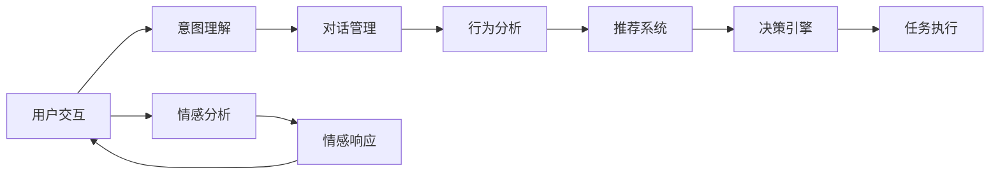

                 

# AI Agent: AI的下一个风口 如何改变用户体验

> 关键词：AI Agent, 用户体验, 人机交互, 个性化推荐, 自然语言处理, 自然语言生成, 行为分析, 智能决策, 情感计算

## 1. 背景介绍

### 1.1 问题由来

随着人工智能技术的迅猛发展，AI Agent正在成为未来智能应用的核心。AI Agent是一种智能交互系统，能够自主运行、理解上下文并响应用户请求。它不仅仅是简单的自动化工具，而是可以与人类进行深度交互，提供个性化服务，改变用户体验的下一代AI。

AI Agent的兴起源于以下几个因素：

- **技术成熟**：自然语言处理(NLP)、自然语言生成(NLG)、机器学习(ML)等技术的成熟，为AI Agent提供了强大的支持。
- **用户需求**：随着智能设备的普及，用户对个性化、实时、智能化的交互需求日益增长，AI Agent能够满足这些需求。
- **市场驱动**：零售、金融、医疗、教育等行业对智能解决方案的迫切需求，推动了AI Agent的发展。

### 1.2 问题核心关键点

AI Agent的核心关键点包括：

- **自主决策**：能够理解用户意图，自主进行决策并执行任务。
- **上下文理解**：能够理解对话历史和情境信息，提供连贯的交互。
- **个性化服务**：根据用户偏好和行为数据，提供量身定制的推荐和建议。
- **多模态交互**：支持文本、语音、图像、视频等多种交互方式。
- **高可用性**：能够24/7提供服务，不受时间、地点限制。

AI Agent的成功不仅取决于其技术能力，还依赖于用户体验的设计。因此，如何设计高效、友好、直观的用户界面(UI)，以及如何利用AI技术提升用户体验，成为了研究者们关注的焦点。

## 2. 核心概念与联系

### 2.1 核心概念概述

AI Agent的核心概念包括以下几个方面：

- **自然语言处理(NLP)**：用于理解、处理和生成人类语言的技术。NLP是AI Agent与用户交互的基础。
- **自然语言生成(NLG)**：用于将结构化信息转换为自然语言文本的技术。NLG使AI Agent能够自然地回应用户。
- **机器学习(ML)**：用于训练AI Agent，使其能够从数据中学习，并不断优化其行为。
- **强化学习(RL)**：一种基于奖励和惩罚的训练方法，使AI Agent能够在实际环境中不断调整行为策略。
- **多模态交互**：支持多种交互方式，如文本、语音、图像、视频等，提升用户交互体验。
- **情感计算**：用于识别和响应用户情感的技术，提升交互的情感共鸣和信任感。

这些核心概念通过以下Mermaid流程图来展示：

```mermaid
graph TB
    A[自然语言处理(NLP)] --> B[自然语言生成(NLG)]
    B --> C[机器学习(ML)]
    C --> D[强化学习(RL)]
    C --> E[多模态交互]
    D --> E
    E --> F[情感计算]
    A --> G[用户意图理解]
    G --> H[对话管理]
    H --> F
    F --> I[个性化推荐]
    I --> J[行为分析]
    J --> K[智能决策]
    K --> L[执行任务]
```

这个流程图展示了AI Agent的各个组成部分及其相互关系：

1. **自然语言处理(NLP)**：从文本中提取意图和实体信息。
2. **自然语言生成(NLG)**：根据处理结果生成自然语言回复。
3. **机器学习(ML)**：训练模型以优化NLP和NLG效果。
4. **强化学习(RL)**：通过奖励和惩罚机制优化对话管理和决策行为。
5. **多模态交互**：支持多种交互方式，提升用户体验。
6. **情感计算**：识别用户情感，增强交互共鸣。
7. **用户意图理解**：理解用户具体需求。
8. **对话管理**：管理对话流程，提供连贯的交互体验。
9. **个性化推荐**：根据用户偏好提供定制化服务。
10. **行为分析**：分析用户行为，优化推荐和服务。
11. **智能决策**：基于用户行为和偏好做出决策。
12. **执行任务**：执行用户请求的任务。

这些概念共同构成了AI Agent的核心功能模块，使其能够高效、准确地响应用户需求。

### 2.2 概念间的关系

这些核心概念之间存在着紧密的联系，形成了AI Agent的核心功能架构。下面通过几个Mermaid流程图来展示这些概念之间的关系。

#### 2.2.1 AI Agent的核心架构

```mermaid
graph LR
    A[自然语言处理(NLP)] --> B[自然语言生成(NLG)]
    A --> C[机器学习(ML)]
    C --> D[强化学习(RL)]
    D --> E[多模态交互]
    A --> F[情感计算]
    F --> G[个性化推荐]
    G --> H[行为分析]
    H --> I[智能决策]
    I --> J[执行任务]
    B --> J
```

这个流程图展示了AI Agent的核心架构：

1. **自然语言处理(NLP)**：提取用户意图和实体信息。
2. **自然语言生成(NLG)**：生成自然语言回复。
3. **机器学习(ML)**：训练模型以优化NLP和NLG效果。
4. **强化学习(RL)**：优化对话管理和决策行为。
5. **多模态交互**：支持多种交互方式，提升用户体验。
6. **情感计算**：识别用户情感，增强交互共鸣。
7. **个性化推荐**：根据用户偏好提供定制化服务。
8. **行为分析**：分析用户行为，优化推荐和服务。
9. **智能决策**：基于用户行为和偏好做出决策。
10. **执行任务**：执行用户请求的任务。

#### 2.2.2 AI Agent的功能实现



这个流程图展示了AI Agent的各个功能模块及其交互：

1. **用户交互**：用户与AI Agent的交互界面。
2. **意图理解**：理解用户的具体需求。
3. **对话管理**：管理对话流程，提供连贯的交互体验。
4. **行为分析**：分析用户行为，优化推荐和服务。
5. **推荐系统**：根据用户偏好提供定制化服务。
6. **决策引擎**：基于用户行为和偏好做出决策。
7. **任务执行**：执行用户请求的任务。
8. **情感分析**：识别用户情感。
9. **情感响应**：根据用户情感调整交互策略。

## 3. 核心算法原理 & 具体操作步骤

### 3.1 算法原理概述

AI Agent的核心算法原理主要基于以下技术：

- **自然语言处理(NLP)**：包括分词、词性标注、命名实体识别、情感分析等。
- **自然语言生成(NLG)**：包括句法分析、语义分析、生成文本等。
- **机器学习(ML)**：包括监督学习、无监督学习、强化学习等。
- **强化学习(RL)**：包括Q-learning、策略梯度等。
- **多模态交互**：包括语音识别、图像识别、视频分析等。
- **情感计算**：包括情感识别、情感响应等。

这些技术通过以下流程来实现AI Agent的功能：

1. **意图理解**：通过NLP技术分析用户输入的自然语言，提取意图和实体信息。
2. **对话管理**：通过对话管理策略，维护对话历史和上下文信息。
3. **个性化推荐**：基于用户行为和偏好，提供定制化服务。
4. **智能决策**：通过RL或ML算法，优化决策过程。
5. **任务执行**：执行用户请求的任务，如查询信息、执行操作等。

### 3.2 算法步骤详解

#### 3.2.1 意图理解

1. **分词和词性标注**：将用户输入的文本进行分词，并标注每个词的词性。
2. **命名实体识别**：识别文本中的实体，如人名、地名、组织机构名等。
3. **情感分析**：分析文本中的情感倾向，如正面、中性、负面等。
4. **意图分类**：通过分类器将文本分为不同的意图类别，如查询、订单、投诉等。

#### 3.2.2 对话管理

1. **对话状态跟踪**：维护对话的状态，记录对话历史和上下文信息。
2. **意图匹配**：匹配用户当前的意图和历史意图，确定对话流程。
3. **对话策略**：根据对话状态和意图，选择适当的对话策略，生成响应。

#### 3.2.3 个性化推荐

1. **用户行为分析**：分析用户的历史行为数据，如浏览记录、购买记录等。
2. **用户偏好建模**：建立用户偏好模型，捕捉用户的兴趣和偏好。
3. **推荐生成**：根据用户偏好和行为数据，生成推荐结果。

#### 3.2.4 智能决策

1. **规则推理**：基于业务规则和逻辑推理，生成初步决策。
2. **ML训练**：使用ML算法，如决策树、神经网络等，优化决策过程。
3. **RL学习**：通过RL算法，如Q-learning、策略梯度等，不断调整决策策略。

#### 3.2.5 任务执行

1. **接口调用**：调用API或服务，获取所需信息或执行任务。
2. **结果呈现**：将任务结果呈现给用户，如文本、图像、语音等。

### 3.3 算法优缺点

#### 3.3.1 优点

1. **高效性**：AI Agent能够处理大量用户请求，提供快速响应。
2. **个性化**：基于用户行为和偏好，提供定制化服务。
3. **高可用性**：支持24/7服务，不受时间地点限制。
4. **灵活性**：支持多模态交互，提升用户体验。
5. **可扩展性**：易于扩展和集成，适用于各种场景。

#### 3.3.2 缺点

1. **复杂性**：实现复杂，需要处理多种技术栈和数据源。
2. **数据依赖**：需要大量高质量的数据，才能训练出高性能的AI Agent。
3. **鲁棒性**：面对多样化和复杂化的用户请求，AI Agent的鲁棒性需要进一步提升。
4. **隐私风险**：需要处理敏感数据，涉及隐私和安全问题。

### 3.4 算法应用领域

AI Agent已经在多个领域得到广泛应用，包括但不限于：

- **客户服务**：提供24/7的客户支持，提升用户体验。
- **零售电商**：推荐个性化商品，提高销售转化率。
- **金融服务**：提供智能投资顾问，优化投资决策。
- **医疗健康**：提供智能诊疗建议，辅助医生诊断。
- **教育培训**：提供个性化学习计划，提升学习效果。

## 4. 数学模型和公式 & 详细讲解 & 举例说明

### 4.1 数学模型构建

AI Agent的核心数学模型主要基于以下技术：

- **自然语言处理(NLP)**：基于TF-IDF、word2vec、BERT等模型。
- **自然语言生成(NLG)**：基于语言模型、神经网络等。
- **机器学习(ML)**：基于监督学习、无监督学习、强化学习等。
- **多模态交互**：基于图像分类、对象检测、语音识别等模型。
- **情感计算**：基于情感词典、情感分类器等。

#### 4.1.1 意图理解

1. **分词和词性标注**：
   - **分词模型**：基于BiLSTM-CRF的分词模型。
   - **词性标注模型**：基于CRF的词性标注模型。
   - **模型公式**：
   $$
   \max_{w, t} P(w, t|x) = \max_{w, t} \frac{P(w|t)P(t|x)}{Z}
   $$
   其中，$x$为输入文本，$w$为词序列，$t$为词性序列，$Z$为归一化常数。

2. **命名实体识别**：
   - **命名实体识别模型**：基于BiLSTM-CRF的命名实体识别模型。
   - **模型公式**：
   $$
   \max_{w, b} P(w, b|x) = \max_{w, b} \frac{P(w|b)P(b|x)}{Z}
   $$
   其中，$x$为输入文本，$w$为词序列，$b$为命名实体序列，$Z$为归一化常数。

3. **情感分析**：
   - **情感词典**：使用VADER情感词典，根据文本中的词汇情感极性，计算情感得分。
   - **情感模型**：基于SVM的情感分类模型。
   - **模型公式**：
   $$
   \max_{y} P(y|x) = \max_{y} \frac{P(x|y)P(y)}{\sum_{y'} P(x|y')P(y')}
   $$
   其中，$x$为输入文本，$y$为情感类别，$y'$为所有可能的情感类别。

#### 4.1.2 对话管理

1. **对话状态跟踪**：
   - **对话管理模型**：基于RNN的对话管理模型。
   - **模型公式**：
   $$
   \max_{h, o} P(o|x, h) = \max_{h, o} \frac{P(o|h)P(h|x)}{Z}
   $$
   其中，$x$为输入文本，$h$为对话状态，$o$为对话输出，$Z$为归一化常数。

2. **意图匹配**：
   - **意图分类模型**：基于CNN的意图分类模型。
   - **模型公式**：
   $$
   \max_{i} P(i|x) = \max_{i} \frac{P(x|i)P(i)}{\sum_{i'} P(x|i')P(i')}
   $$
   其中，$x$为输入文本，$i$为意图类别，$i'$为所有可能的意图类别。

3. **对话策略**：
   - **对话策略模型**：基于规则和ML算法的对话策略模型。
   - **模型公式**：
   $$
   \max_{a} P(a|x, h) = \max_{a} \frac{P(a|h)P(h|x)}{Z}
   $$
   其中，$x$为输入文本，$h$为对话状态，$a$为对话动作，$Z$为归一化常数。

#### 4.1.3 个性化推荐

1. **用户行为分析**：
   - **行为分析模型**：基于协同过滤的推荐系统。
   - **模型公式**：
   $$
   \max_{u} P(u|x) = \max_{u} \frac{P(x|u)P(u)}{\sum_{u'} P(x|u')P(u')}
   $$
   其中，$x$为输入文本，$u$为用户行为，$u'$为所有可能的用户的集合。

2. **用户偏好建模**：
   - **偏好建模模型**：基于用户-物品矩阵的协同过滤模型。
   - **模型公式**：
   $$
   \max_{\theta} P(U|I, \theta) = \max_{\theta} \frac{P(I, U|\theta)P(\theta)}{P(I|\theta)P(U|\theta)}
   $$
   其中，$U$为用户行为数据，$I$为物品数据，$\theta$为模型参数。

3. **推荐生成**：
   - **推荐生成模型**：基于深度学习模型的推荐系统。
   - **模型公式**：
   $$
   \max_{y} P(y|x, U) = \max_{y} \frac{P(y|x, U, \theta)P(y)}{\sum_{y'} P(y|x, U, \theta)P(y')}
   $$
   其中，$x$为输入文本，$U$为用户行为数据，$y$为推荐结果，$\theta$为模型参数。

#### 4.1.4 智能决策

1. **规则推理**：
   - **规则推理模型**：基于IF-THEN规则的决策模型。
   - **模型公式**：
   $$
   \max_{d} P(d|x) = \max_{d} \frac{P(d|x, \phi)}{P(d|\phi)}
   $$
   其中，$x$为输入文本，$d$为决策结果，$\phi$为规则库。

2. **ML训练**：
   - **ML训练模型**：基于决策树的ML模型。
   - **模型公式**：
   $$
   \max_{d} P(d|x) = \max_{d} \frac{P(x|d)P(d)}{\sum_{d'} P(x|d')P(d')}
   $$
   其中，$x$为输入文本，$d$为决策结果，$d'$为所有可能的决策结果。

3. **RL学习**：
   - **RL学习模型**：基于Q-learning的强化学习模型。
   - **模型公式**：
   $$
   \max_{\theta} J(\theta) = \max_{\theta} \sum_{t=1}^T \gamma^t r_t
   $$
   其中，$J(\theta)$为策略的奖励函数，$\theta$为模型参数，$\gamma$为折扣因子，$r_t$为当前状态的奖励。

#### 4.1.5 任务执行

1. **接口调用**：
   - **接口调用模型**：基于API调用的任务执行模型。
   - **模型公式**：
   $$
   \max_{r} P(r|x, y) = \max_{r} \frac{P(r|y)P(y|x)}{Z}
   $$
   其中，$x$为输入文本，$y$为调用结果，$r$为任务结果，$Z$为归一化常数。

2. **结果呈现**：
   - **结果呈现模型**：基于文本生成模型的结果呈现模型。
   - **模型公式**：
   $$
   \max_{t} P(t|x, r) = \max_{t} \frac{P(t|r)P(r|x)}{Z}
   $$
   其中，$x$为输入文本，$r$为任务结果，$t$为输出文本，$Z$为归一化常数。

### 4.2 公式推导过程

#### 4.2.1 分词和词性标注

- **分词模型推导**：
   - **模型公式**：
   $$
   P(w|t) = \frac{e^{-\frac{1}{2}L(w, t)}{Z}
   $$
   其中，$w$为词序列，$t$为词性序列，$L$为损失函数，$Z$为归一化常数。

- **词性标注模型推导**：
   - **模型公式**：
   $$
   P(t|x) = \frac{e^{-\frac{1}{2}L(t, x)}{Z}
   $$
   其中，$x$为输入文本，$t$为词性序列，$L$为损失函数，$Z$为归一化常数。

#### 4.2.2 命名实体识别

- **命名实体识别模型推导**：
   - **模型公式**：
   $$
   P(b|x) = \frac{e^{-\frac{1}{2}L(b, x)}{Z}
   $$
   其中，$x$为输入文本，$b$为命名实体序列，$L$为损失函数，$Z$为归一化常数。

#### 4.2.3 情感分析

- **情感词典推导**：
   - **情感词典模型公式**：
   $$
   P(y|x) = \frac{e^{-\frac{1}{2}L(y, x)}{Z}
   $$
   其中，$x$为输入文本，$y$为情感类别，$L$为损失函数，$Z$为归一化常数。

- **情感分类模型推导**：
   - **情感分类模型公式**：
   $$
   P(y|x) = \frac{e^{-\frac{1}{2}L(y, x)}{Z}
   $$
   其中，$x$为输入文本，$y$为情感类别，$L$为损失函数，$Z$为归一化常数。

#### 4.2.4 对话管理

- **对话管理模型推导**：
   - **对话管理模型公式**：
   $$
   P(o|x, h) = \frac{e^{-\frac{1}{2}L(o, x, h)}{Z}
   $$
   其中，$x$为输入文本，$h$为对话状态，$o$为对话输出，$L$为损失函数，$Z$为归一化常数。

- **意图匹配模型推导**：
   - **意图匹配模型公式**：
   $$
   P(i|x) = \frac{e^{-\frac{1}{2}L(i, x)}{Z}
   $$
   其中，$x$为输入文本，$i$为意图类别，$L$为损失函数，$Z$为归一化常数。

- **对话策略模型推导**：
   - **对话策略模型公式**：
   $$
   P(a|x, h) = \frac{e^{-\frac{1}{2}L(a, x, h)}{Z}
   $$
   其中，$x$为输入文本，$h$为对话状态，$a$为对话动作，$L$为损失函数，$Z$为归一化常数。

#### 4.2.5 个性化推荐

- **行为分析模型推导**：
   - **行为分析模型公式**：
   $$
   P(u|x) = \frac{e^{-\frac{1}{2}L(u, x)}{Z}
   $$
   其中，$x$为输入文本，$u$为用户行为，$L$为损失函数，$Z$为归一化常数。

- **用户偏好建模模型推导**：
   - **用户偏好建模模型公式**：
   $$
   P(U|I, \theta) = \frac{e^{-\frac{1}{2}L(U, I, \theta)}{Z}
   $$
   其中，$U$为用户行为数据，$I$为物品数据，$\theta$为模型参数，$L$为损失函数，$Z$为归一化常数。

- **推荐生成模型推导**：
   - **推荐生成模型公式**：
   $$
   P(y|x, U) = \frac{e^{-\frac{1}{2}L(y, x, U, \theta)}{Z}
   $$
   其中，$x$为输入文本，$U$为用户行为数据，$y$为推荐结果，$\theta$为模型参数，$L$为损失函数，$Z$为归一化常数。

#### 4.2.6 智能决策

- **规则推理模型推导**：
   - **规则推理模型公式**：
   $$
   P(d|x, \phi) = \frac{e^{-\frac{1}{2}L(d, x, \phi)}{Z}
   $$
   其中，$x$为输入文本，$d$为决策结果，$\phi$为规则库，$L$为损失函数，$Z$为归一化常数。

- **ML训练模型推导**：
   - **ML训练模型公式**：
   $$
   P(x|d) = \frac{e^{-\frac{1}{2}L(x, d)}{Z}
   $$
   其中，$x$为输入文本，$d$为决策结果，$L$为损失函数，$Z$为归一化常数。

- **RL学习模型推导**：
   - **RL学习模型公式**：
   $$
   J(\theta) = \sum_{t=1}^T \gamma^t r_t
   $$
   其中，$J(\theta)$为策略的奖励函数，$\theta$为模型参数，$\gamma$为折扣因子，$r_t$为当前状态的奖励。

#### 4.2.7 任务执行

- **接口调用模型推导**：
   - **接口调用模型公式**：
   $$
   P(r|x, y) = \frac{e^{-\frac{1}{2}L(r, x, y)}{Z}
   $$
   其中，$x$为输入文本，$y$为调用结果，$r$为任务结果，$L$为损失函数，$Z$为归一化常数。

- **结果呈现模型推导

