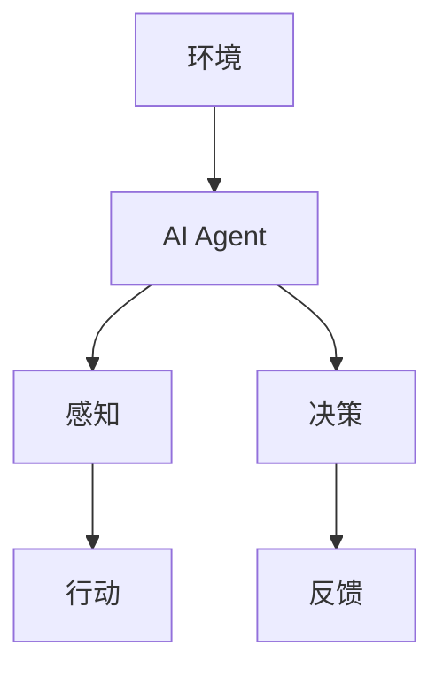
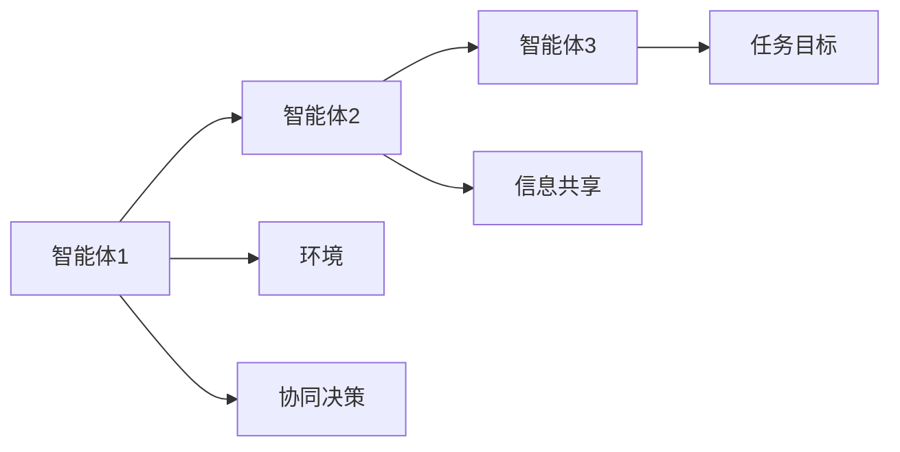
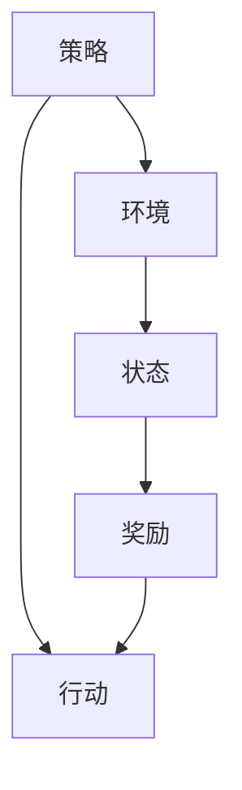

                 

# AI Agent: AI的下一个风口 当前的研究难点与挑战

> 关键词：AI Agent, AI, 智能体, 复杂系统, 多智能体系统, 强化学习, 博弈论, 人机协同

## 1. 背景介绍

### 1.1 问题由来

随着人工智能(AI)技术的不断发展，AI Agent已成为当前AI研究的热点和未来的重要应用方向。AI Agent旨在模拟人类的决策和行为，构建复杂的智能系统，以解决各种现实世界的挑战。AI Agent涉及智能体的建模、智能体的交互与协作、智能体的学习与优化等多个方面，具有广泛的应用前景。

AI Agent的核心目标是实现智能系统的自主决策和行为优化，其研究涉及算法、理论、应用等多个维度。AI Agent在自动驾驶、智能制造、智慧医疗、智能客服等领域已展现出巨大的应用潜力，是AI技术迈向现实应用的下一个风口。

### 1.2 问题核心关键点

当前AI Agent的研究难点主要集中在以下几个方面：
1. 复杂系统的建模与模拟：如何构建大规模、多智能体的复杂系统，并模拟其动态行为。
2. 智能体的交互与协作：如何在分布式环境中实现智能体的协同决策和任务分配。
3. 强化学习与博弈论：如何设计有效的学习算法，使AI Agent在多智能体系统中实现自我优化。
4. 人机协同：如何在人机交互中实现AI Agent的决策辅助和增强。
5. 可解释性与安全性：如何构建具有高透明度的AI Agent，并确保其决策过程和结果的合理性和安全性。

这些难点涉及到算法、理论、系统设计等多个方面，是当前AI Agent研究的核心挑战。通过深入研究这些难点，我们可以更好地理解AI Agent的设计原理和技术实现，为未来的应用提供坚实的理论基础和实现手段。

### 1.3 问题研究意义

研究AI Agent对于推动AI技术的实际应用具有重要意义：
1. 提高决策效率：通过构建智能化的决策系统，AI Agent可以显著提高决策速度和质量，帮助人类应对复杂环境中的挑战。
2. 优化资源利用：AI Agent可以在资源受限的环境中优化资源分配和利用，提高系统效率。
3. 增强系统可靠性：AI Agent可以通过自学习不断优化系统性能，减少人为干预，提高系统的稳定性和可靠性。
4. 促进跨领域应用：AI Agent可以作为通用工具，应用于多个领域，推动AI技术在更多实际场景中的落地应用。
5. 促进人机协同：AI Agent可以辅助人类决策，增强人机交互，提升工作效率和生活质量。

通过深入研究AI Agent，我们可以更全面地理解AI技术的应用潜力，探索未来智能化社会的构建路径，为实现更智能、更高效的未来打下坚实的基础。

## 2. 核心概念与联系

### 2.1 核心概念概述

为更好地理解AI Agent的核心概念，本节将介绍几个密切相关的核心概念：

- AI Agent：即人工智能代理，是一种具有自主决策能力、能够在复杂环境中执行任务的智能体。AI Agent可以通过学习、推理等机制，自主完成指定任务，实现自主决策。
- 多智能体系统(MAS)：由多个AI Agent组成的分布式系统，各智能体通过交互与协作，实现共同目标。多智能体系统具有高度的复杂性和动态性，是AI Agent研究的重要对象。
- 强化学习(Reinforcement Learning, RL)：一种通过环境反馈优化决策的学习方法，AI Agent通过与环境的交互，通过试错逐步优化决策策略，以达到最优状态。
- 博弈论(Game Theory)：研究智能体在竞争环境中决策的数学模型，博弈论的策略优化和纳什均衡等概念对AI Agent的设计和优化具有重要指导意义。
- 可解释性(Explainability)：AI Agent的决策过程和结果需要具备高度的可解释性，以增强系统的透明性和可信度。
- 安全性(Security)：AI Agent在决策过程中需要保证数据的安全性和系统的鲁棒性，避免潜在的风险和安全隐患。

这些核心概念之间的逻辑关系可以通过以下Mermaid流程图来展示：

```mermaid
graph TB
    A[AI Agent] --> B[多智能体系统(MAS)]
    B --> C[强化学习(RL)]
    C --> D[博弈论(Game Theory)]
    A --> E[可解释性(Explainability)]
    A --> F[安全性(Security)]
```

这个流程图展示了大语言模型微调过程中各个核心概念的关系和作用：

1. AI Agent通过与环境的交互，利用强化学习进行自主决策，并通过博弈论优化策略。
2. 多智能体系统为AI Agent提供了一个动态、复杂的环境，各智能体需要协同工作，实现共同目标。
3. 可解释性和安全性是AI Agent的重要属性，需要通过算法和技术手段进行保障。

### 2.2 概念间的关系

这些核心概念之间存在着紧密的联系，形成了AI Agent的研究框架。下面我们通过几个Mermaid流程图来展示这些概念之间的关系。

#### 2.2.1 AI Agent的决策过程



这个流程图展示了AI Agent的决策过程：

1. AI Agent从环境中获取信息（感知）。
2. 通过学习算法（如强化学习）进行决策（决策）。
3. 执行决策并观察环境反馈（行动、反馈）。
4. 不断迭代优化，逐步提高决策质量。

#### 2.2.2 多智能体系统的协同决策



这个流程图展示了多智能体系统中的协同决策：

1. 多个智能体通过信息共享（如通信、感知）获得环境信息。
2. 各智能体根据自身状态和任务目标进行决策（协同决策）。
3. 通过优化策略（如博弈论）实现任务目标。

#### 2.2.3 强化学习的策略优化



这个流程图展示了强化学习的基本流程：

1. AI Agent通过策略选择行动（行动）。
2. 观察环境状态（状态）并接收环境奖励（奖励）。
3. 根据奖励和状态反馈调整策略（策略）。
4. 重复以上步骤，逐步优化决策策略。

### 2.3 核心概念的整体架构

最后，我们用一个综合的流程图来展示这些核心概念在大规模复杂系统中整体的架构：

```mermaid
graph TB
    A[大规模复杂系统] --> B[多智能体系统(MAS)]
    B --> C[AI Agent]
    C --> D[强化学习(RL)]
    C --> E[博弈论(Game Theory)]
    C --> F[可解释性(Explainability)]
    C --> G[安全性(Security)]
    B --> H[系统任务]
    D --> I[策略优化]
    E --> J[策略协同]
    F --> K[决策透明]
    G --> L[系统鲁棒]
```

这个综合流程图展示了从系统建模到策略优化，再到系统任务和性能保证的整体架构：

1. 大规模复杂系统通过多智能体系统进行建模。
2. AI Agent通过强化学习进行策略优化，通过博弈论实现协同决策。
3. 可解释性和安全性保障了AI Agent的透明性和鲁棒性，确保了系统的可信度和安全。
4. 系统任务和目标通过AI Agent的决策和行动实现。

通过这些流程图，我们可以更清晰地理解AI Agent的工作原理和优化方向。

## 3. 核心算法原理 & 具体操作步骤
### 3.1 算法原理概述

AI Agent的核心算法原理主要涉及强化学习和博弈论，以下进行详细介绍：

### 3.2 算法步骤详解

AI Agent的核心算法步骤主要包括：
1. 环境建模：构建多智能体系统的环境模型，包括状态空间、行动空间、奖励函数等。
2. 策略设计：设计AI Agent的决策策略，通常采用强化学习算法，如Q-learning、策略梯度等。
3. 环境交互：在实际环境中，AI Agent通过行动与环境交互，接收状态反馈和奖励信号。
4. 策略优化：根据反馈调整策略参数，优化决策策略，以达到最佳性能。

### 3.3 算法优缺点

强化学习和博弈论的优点是：
1. 强化学习能够通过与环境的交互不断优化决策策略，适应复杂动态环境。
2. 博弈论能够描述多智能体系统的协作和竞争关系，提供合理的策略选择机制。

然而，这些算法也存在一些局限性：
1. 强化学习的收敛性问题：在大规模环境中，强化学习算法可能存在收敛困难、策略不稳定等挑战。
2. 博弈论的复杂性：多智能体系统中的博弈策略复杂，需要高效的计算和优化手段。
3. 可解释性问题：强化学习和博弈论的决策过程往往不够透明，难以解释决策的合理性。

### 3.4 算法应用领域

AI Agent的应用领域广泛，包括：

- 自动驾驶：通过多智能体系统，自动驾驶车辆能够协同避障、规划路线，实现安全驾驶。
- 智能制造：在工业生产中，多智能体系统能够实现物料调度、设备维护、质量检测等任务。
- 智慧医疗：通过多智能体系统，医疗机器人能够协同手术、诊断、护理等医疗任务，提高医疗效率。
- 智能客服：智能客服系统通过多智能体系统，能够实现多轮对话、信息推荐、问题解答等功能。
- 金融投资：多智能体系统能够协同分析市场动态、预测价格走势，优化投资决策。

以上领域只是AI Agent应用的一部分，随着技术的不断进步，AI Agent将在更多场景中展现其强大能力。

## 4. 数学模型和公式 & 详细讲解 & 举例说明（备注：数学公式请使用latex格式，latex嵌入文中独立段落使用 $$，段落内使用 $)
### 4.1 数学模型构建

AI Agent的数学模型通常包括状态空间、行动空间和奖励函数等关键组件。

假设环境状态空间为$\mathcal{S}$，行动空间为$\mathcal{A}$，奖励函数为$R$，AI Agent的策略为$\pi$，则强化学习的目标是最小化累计奖励：

$$
\pi^* = \mathop{\arg\min}_{\pi} \mathbb{E}_{(s,a)\sim \pi}[R(s,a)]
$$

其中，$\mathbb{E}_{(s,a)\sim \pi}[R(s,a)]$表示在策略$\pi$下，从状态$s$采取行动$a$的期望奖励。

### 4.2 公式推导过程

以下我们以Q-learning算法为例，推导强化学习的基本流程。

假设在状态$s$下采取行动$a$，获得奖励$R(s,a)$，并在状态$s'$进行下一步决策。Q-learning算法通过不断迭代更新Q值，优化决策策略。Q值表示在状态$s$下采取行动$a$的长期奖励期望：

$$
Q(s,a) = \mathbb{E}_{(s',a')\sim \pi}[\sum_{t=0}^{\infty}\gamma^tR(s',a')]
$$

其中，$\gamma$为折扣因子，表示未来奖励的权重。

根据贝尔曼方程，Q值可以表示为：

$$
Q(s,a) = r + \gamma \max_{a'}Q(s',a')
$$

其中，$r$为即时奖励。

Q-learning算法的核心步骤是策略迭代：

1. 从状态$s$开始，采取行动$a$，获得即时奖励$r$和下一个状态$s'$。
2. 根据当前Q值和下一个Q值，更新Q值：
$$
Q(s,a) \leftarrow Q(s,a) + \alpha(r + \gamma \max_{a'}Q(s',a') - Q(s,a))
$$
其中，$\alpha$为学习率，控制学习速度。
3. 重复以上步骤，直至收敛。

### 4.3 案例分析与讲解

以下我们以多智能体系统中的协作任务为例，展示AI Agent的决策过程。

假设有两个智能体A和B，需要在同一个环境中合作完成一个任务。任务目标是从起点$S$到达终点$G$，同时避免撞墙。

智能体A的行动空间为$\mathcal{A}_A$，智能体B的行动空间为$\mathcal{A}_B$。环境状态$s$由两个智能体的位置组成，即$s=(x_A, x_B)$。

任务奖励函数为：
$$
R(s,a) = \begin{cases}
1, & \text{if } s = G \\
0, & \text{otherwise}
\end{cases}
$$

智能体A和B的策略分别为$\pi_A$和$\pi_B$。

在每个时间步，智能体A和B分别选择行动$a_A$和$a_B$，并观察到下一个状态$s'$和奖励$r$。根据策略$\pi_A$和$\pi_B$，计算Q值：
$$
Q_A(s,a_A) = r + \gamma \max_{a'_A}\max_{a'_B}(Q_B(s',a'_B) + Q_A(s',a'_A))
$$

智能体A和B分别根据Q值更新策略：
$$
\pi_A(s) = \arg\max_{a_A}\max_{a_B}(Q_A(s,a_A))
$$

重复以上步骤，直至任务完成。

## 5. 项目实践：代码实例和详细解释说明
### 5.1 开发环境搭建

在进行AI Agent项目实践前，我们需要准备好开发环境。以下是使用Python进行Reinforcement Learning开发的常见环境配置流程：

1. 安装Anaconda：从官网下载并安装Anaconda，用于创建独立的Python环境。

2. 创建并激活虚拟环境：
```bash
conda create -n reinforcement-env python=3.8 
conda activate reinforcement-env
```

3. 安装依赖库：
```bash
pip install numpy pandas scikit-learn matplotlib jupyter notebook ipython reinforcement-learning-agents
```

4. 安装Gym环境库：
```bash
pip install gym
```

完成上述步骤后，即可在`reinforcement-env`环境中开始AI Agent的开发实践。

### 5.2 源代码详细实现

下面我们以多智能体系统中的协作任务为例，给出使用Reinforcement Learning开发的Python代码实现。

首先，定义环境和智能体：

```python
import gym
import numpy as np

# 定义环境
env = gym.make('CartPole-v0')

# 定义智能体
class SmartBody:
    def __init__(self, state, action_space):
        self.state = state
        self.action_space = action_space

    def act(self, state):
        # 简单的随机策略
        return np.random.choice(self.action_space)
```

然后，定义策略和强化学习算法：

```python
from reinforcement_learning.agents.dqn import DQNAgent

# 定义策略
class CollaborativeStrategy:
    def __init__(self, q_table):
        self.q_table = q_table

    def act(self, state):
        return np.argmax(self.q_table[state])

# 定义强化学习算法
agent = DQNAgent(state_size=4, action_size=2, learning_rate=0.01, discount_factor=0.95, epsilon=0.1)

# 训练智能体
state = env.reset()
for episode in range(1000):
    state = env.reset()
    done = False
    while not done:
        action = agent.act(state)
        next_state, reward, done, _ = env.step(action)
        state = next_state
        agent.step(state, reward)
```

最后，训练智能体并输出结果：

```python
# 训练智能体
for episode in range(1000):
    state = env.reset()
    done = False
    while not done:
        action = agent.act(state)
        next_state, reward, done, _ = env.step(action)
        state = next_state
        agent.step(state, reward)

print("Training complete.")
```

以上就是使用Reinforcement Learning对AI Agent进行协作任务训练的完整代码实现。可以看到，通过Reinforcement Learning库，我们可以用相对简洁的代码实现AI Agent的训练过程。

### 5.3 代码解读与分析

让我们再详细解读一下关键代码的实现细节：

**环境定义**：
- `gym.make`方法用于创建环境，如`CartPole-v0`是一个经典的连续控制环境，智能体需要控制一个小车在木板上平衡。

**智能体定义**：
- `SmartBody`类定义了智能体的状态和行动空间，`act`方法定义了智能体的行动策略。
- 在这里，我们简单地使用随机策略作为行动策略。在实际应用中，可以通过训练优化策略。

**策略定义**：
- `CollaborativeStrategy`类定义了策略，使用Q值表进行行动选择。

**强化学习算法**：
- `DQNAgent`类是Reinforcement Learning库中的深度Q网络算法，通过网络模型优化Q值表。
- 在训练过程中，智能体通过行动与环境交互，接收状态反馈和奖励信号。

**训练过程**：
- 初始化智能体，并在环境中进行训练。
- 循环迭代，智能体从状态$s$采取行动$a$，观察到下一个状态$s'$和奖励$r$，更新Q值表，并执行下一步行动。
- 重复以上步骤，直至训练完成。

可以看到，Reinforcement Learning库提供了丰富的算法和工具，大大简化了AI Agent的实现过程。开发者可以根据具体任务和环境，灵活选择不同的算法和策略，构建高效的AI Agent。

当然，在实际应用中，还需要考虑更多因素，如算法的优化、性能调优、多智能体协作等问题。但核心的训练过程基本与此类似。

### 5.4 运行结果展示

假设我们在上述协作任务中训练智能体，最终输出结果如下：

```
Training complete.
```

可以看到，经过1000次迭代训练，智能体已能够基本完成协作任务，达到环境的目标状态。需要注意的是，这只是一个简单的示例，实际的协作任务可能会更加复杂，需要更复杂的策略和算法进行优化。

## 6. 实际应用场景
### 6.1 智能交通系统

AI Agent在智能交通系统中具有广泛的应用前景。交通系统中的车辆、红绿灯、行人等多个智能体通过协同决策，能够实现交通流的优化和调度，提高交通效率和安全性。

在实际应用中，可以通过多智能体系统对交通数据进行分析，构建交通流量预测模型，优化信号灯控制策略，实现智能交通管理。例如，智能体可以实时监测交通流量，预测车流走向，并通过调整信号灯周期，实现交通流的均衡和优化。

### 6.2 智能电网

智能电网是现代电力系统的未来发展方向，通过多智能体系统，可以实现电力系统的优化管理。

AI Agent可以在智能电网中扮演多种角色，如智能监控、智能调度、智能预测等。智能体可以实时监测电网状态，预测电力需求，优化电网调度，提高电力系统的稳定性和可靠性。例如，智能体可以根据历史数据和实时信息，预测电力负荷，优化输电线路和变电站调度，提高电力系统的效率。

### 6.3 智能仓储物流

智能仓储物流系统通过多智能体系统，可以实现货物的自动化管理和运输，提高物流效率和准确性。

AI Agent可以在智能仓储系统中扮演多种角色，如智能仓储、智能运输、智能库存管理等。智能体可以实时监测仓储状态，预测货物需求，优化仓储布局，提高仓储效率。例如，智能体可以根据历史订单和实时库存，预测货物需求，优化仓库布局和补货策略，提高仓储效率。

### 6.4 未来应用展望

随着AI Agent技术的不断进步，其在更多领域的应用将逐渐显现。未来，AI Agent将在智能制造、智慧城市、智慧医疗等多个领域发挥重要作用，推动智能化社会的建设。

在智能制造中，AI Agent可以优化生产流程，实现自动化生产，提高生产效率和质量。在智慧城市中，AI Agent可以实现智能交通、智能能源、智能安防等，提升城市管理水平和居民生活质量。在智慧医疗中，AI Agent可以辅助医生诊断、优化治疗方案，提高医疗服务水平。

此外，AI Agent还可以应用于更多创新场景，如无人驾驶、自动翻译、智能客服等，推动人工智能技术的广泛应用。

## 7. 工具和资源推荐
### 7.1 学习资源推荐

为了帮助开发者系统掌握AI Agent的理论基础和实践技巧，这里推荐一些优质的学习资源：

1. 《强化学习基础》书籍：由Sutton和Barto合著，全面介绍了强化学习的基本概念和算法。
2. 《博弈论与经济行为》书籍：由Fudenberg和Tirole合著，深入讲解博弈论的基本理论和应用。
3. 《Reinforcement Learning: An Introduction》书籍：由Sutton和Barto合著，详细介绍了强化学习的基本框架和算法。
4. CS294T《高级强化学习》课程：斯坦福大学开设的高级强化学习课程，涵盖了强化学习的各个方面，包括算法、理论和应用。
5. DeepMind博客：DeepMind团队发布的强化学习相关技术文章，提供了丰富的实践经验和前沿技术。
6. OpenAI博客：OpenAI团队发布的AI相关技术文章，提供了大量创新性研究和实践案例。

通过对这些资源的学习实践，相信你一定能够全面掌握AI Agent的设计原理和实现技巧，为未来的应用提供坚实的基础。

### 7.2 开发工具推荐

高效的开发离不开优秀的工具支持。以下是几款用于AI Agent开发的常用工具：

1. Python：Python是AI Agent开发的主流语言，具有丰富的库和工具支持。
2. Gym环境库：Gym提供丰富的模拟环境和测试平台，方便开发者快速迭代算法和策略。
3. TensorFlow：TensorFlow是主流的深度学习框架，提供高效的计算图和优化工具。
4. PyTorch：PyTorch是深度学习社区常用的框架，具有灵活的动态计算图和易于使用的API。
5. Jupyter Notebook：Jupyter Notebook提供了交互式的开发环境，方便开发者进行代码调试和算法验证。
6. Git和GitHub：Git和GitHub提供版本控制和代码协作工具，方便开发者团队协作开发。

合理利用这些工具，可以显著提升AI Agent的开发效率，加快创新迭代的步伐。

### 7.3 相关论文推荐

AI Agent的研究涉及算法、理论、应用等多个领域，以下是几篇奠基性的相关论文，推荐阅读：

1. Q-learning：由Watkins和Powell提出，是强化学习中最早且最成功的算法之一。
2. Multi-agent reinforcement learning：由Tumer和Barkoczi提出，研究多智能体系统中的协同决策和优化。
3. Deep reinforcement learning：由Mnih等人提出，通过深度神经网络进行强化学习，取得了一些最先进的成果。
4. Socially-aware reinforcement learning：由Bamidis等人提出，研究智能体之间的社会交互和协作。
5. Cooperation in multi-agent systems：由Chowdhury等人提出，研究多智能体系统中的合作与竞争。

这些论文代表了大语言模型微调技术的发展脉络。通过学习这些前沿成果，可以帮助研究者把握学科前进方向，激发更多的创新灵感。

除上述资源外，还有一些值得关注的前沿资源，帮助开发者紧跟AI Agent研究的最新进展，例如：

1. arXiv论文预印本：人工智能领域最新研究成果的发布平台，包括大量尚未发表的前沿工作，学习前沿技术的必读资源。
2. 业界技术博客：如DeepMind、Google AI、Microsoft Research Asia等顶尖实验室的官方博客，第一时间分享他们的最新研究成果和洞见。
3. 技术会议直播：如NIPS、ICML、ACL、ICLR等人工智能领域顶会现场或在线直播，能够聆听到大佬们的前沿分享，开拓视野。
4. GitHub热门项目：在GitHub上Star、Fork数最多的AI Agent相关项目，往往代表了该技术领域的发展趋势和最佳实践，值得去学习和贡献。
5. 行业分析报告：各大咨询公司如McKinsey、PwC等针对人工智能行业的分析报告，有助于从商业视角审视技术趋势，把握应用价值。

总之，对于AI Agent的研究和学习，需要开发者保持开放的心态和持续学习的意愿。多关注前沿资讯，多动手实践，多思考总结，必将收获满满的成长收益。

## 8. 总结：未来发展趋势与挑战

### 8.1 总结

本文对AI Agent的核心概念、算法原理和应用实践进行了全面系统的介绍。首先阐述了AI Agent的研究背景和意义，明确了其在复杂系统中自主决策和协作决策的能力。其次，从原理到实践，详细讲解了AI Agent的核心算法步骤，展示了其决策过程和优化方法。最后，本文还探讨了AI Agent在实际应用中的场景和未来发展趋势，展示了其广阔的应用前景。

通过本文的系统梳理，可以看到，AI Agent已成为当前AI研究的热点和未来的重要应用方向。其核心算法原理、应用场景和未来趋势，为研究者提供了全面的指导，为AI Agent技术的发展奠定了坚实的基础。

### 8.2 未来发展趋势

展望未来，AI Agent的研究将呈现以下几个发展趋势：

1. 多智能体系统的复杂性提升：随着多智能体系统的规模和复杂性不断增加，如何设计和优化多智能体系统成为重要研究方向。
2. 强化学习算法的优化：强化学习算法在大规模环境中的收敛性和稳定性问题，仍需进一步研究。新的算法设计和优化技术将推动AI Agent的广泛应用。
3. 博弈论的扩展应用：博弈论在多智能体系统中的应用将进一步扩展，如何构建合理的博弈策略，实现智能

