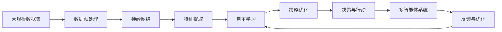

                 

# AI Agent: AI的下一个风口 当前的研究难点与挑战

> 关键词：AI Agent, 自适应AI, 自主学习, 多智能体系统, 神经网络, 强化学习, 未来应用展望

## 1. 背景介绍

### 1.1 问题由来

随着人工智能(AI)技术的飞速发展，AI Agent（智能体）的概念已经从理论研究走向实际应用。AI Agent不仅是构建智能机器的关键组件，更是智能系统在复杂环境中的执行者，对解决现实世界的各种挑战具有重要作用。当前，AI Agent已经应用于机器人、自动驾驶、智能推荐、金融预测、供应链优化等诸多领域，推动了人工智能技术的产业化进程。

然而，AI Agent在实际应用中仍然面临许多挑战。这些挑战包括自主学习能力、多智能体协同、处理复杂环境等。这些问题若得不到有效解决，将极大限制AI Agent的发展潜力。因此，研究AI Agent的当前研究难点与挑战，将对AI技术的未来发展具有重要意义。

### 1.2 问题核心关键点

AI Agent的研究难点与挑战主要集中在以下几个方面：

- 自主学习能力：如何让AI Agent具备自主学习和适应环境变化的能力。
- 多智能体协同：如何在多智能体系统中，各智能体之间进行有效沟通与协作。
- 复杂环境处理：如何在复杂环境中，AI Agent能够进行合理的决策与行动。
- 鲁棒性与安全性：如何确保AI Agent在面对异常和干扰时，仍能稳定运行。
- 可解释性与透明性：如何让AI Agent的决策过程可解释，增强用户信任。

这些核心关键点体现了当前AI Agent技术的复杂性与多样性。针对这些难点，本文将逐一探讨其原理、应用及优化策略，为AI Agent技术的未来发展提供参考。

### 1.3 问题研究意义

研究AI Agent的难点与挑战，具有重要的理论和实践意义：

1. **理论意义**：帮助深入理解AI Agent技术的复杂性和局限性，推动学术研究向纵深发展。
2. **应用意义**：为AI Agent技术的实际应用提供指导，提升其在各领域中的表现和可靠性。
3. **产业意义**：加速AI Agent技术的产业化进程，推动产业转型升级。
4. **伦理意义**：关注AI Agent的鲁棒性与安全性问题，保障人工智能技术的伦理安全。

## 2. 核心概念与联系

### 2.1 核心概念概述

为更好地理解AI Agent的研究难点与挑战，本节将介绍几个密切相关的核心概念：

- **AI Agent**：具有自主学习能力的智能体，可以在复杂环境中进行决策与行动。
- **自主学习**：AI Agent通过与环境的交互，自动学习优化策略的过程。
- **多智能体系统(MAS)**：由多个AI Agent组成的系统，各智能体之间可以进行通信和协作。
- **强化学习(Reinforcement Learning, RL)**：一种通过与环境交互，使智能体学习最优策略的学习方法。
- **神经网络(Neural Network)**：用于模型表示和自主学习的关键技术，具有强大的特征提取能力。

### 2.2 概念间的关系

这些核心概念之间的逻辑关系可以通过以下Mermaid流程图来展示：

```mermaid
graph LR
    A[AI Agent] --> B[自主学习]
    B --> C[多智能体系统(MAS)]
    A --> D[强化学习]
    A --> E[神经网络]
    D --> C
    D --> B
    E --> C
    E --> B
```

这个流程图展示了AI Agent的各个核心概念之间的联系：

1. AI Agent通过自主学习来优化决策与行动，并可以应用于多智能体系统中。
2. 强化学习是AI Agent自主学习的重要方法之一。
3. 神经网络为AI Agent提供了强大的特征提取和表示能力，是自主学习的基础。
4. 多智能体系统是AI Agent应用的典型场景，需要各智能体之间的有效协作。

### 2.3 核心概念的整体架构

最后，我们用一个综合的流程图来展示这些核心概念在大规模AI Agent研究与应用中的整体架构：



这个综合流程图展示了从数据预处理、神经网络特征提取、自主学习策略优化，到决策与行动、多智能体系统反馈与优化的完整过程。通过这些关键步骤，AI Agent可以逐步提升在复杂环境中的表现和可靠性。

## 3. 核心算法原理 & 具体操作步骤
### 3.1 算法原理概述

AI Agent的研究难点与挑战，主要集中在自主学习、多智能体协同、复杂环境处理等方面。这些难点涉及算法的不同维度，如决策策略、知识表示、环境感知等。

### 3.2 算法步骤详解

AI Agent的研究难点与挑战，通常分为以下几个关键步骤：

1. **数据预处理**：收集与处理大规模数据集，提取有意义的特征。
2. **神经网络构建**：设计合适的神经网络结构，进行特征提取与表示。
3. **自主学习策略**：选择合适的自主学习算法，如强化学习、迁移学习等。
4. **决策与行动**：根据环境反馈，优化决策与行动策略。
5. **多智能体协同**：在多智能体系统中，实现各智能体之间的有效沟通与协作。

### 3.3 算法优缺点

AI Agent的研究难点与挑战，涉及多个算法和技术的优势与劣势，如：

- **自主学习算法**：强化学习、迁移学习等算法的优势在于可以处理非结构化数据，适应性较强。但这些算法存在收敛速度慢、参数调整复杂等问题。
- **神经网络架构**：深度神经网络具有强大的特征提取能力，但模型复杂度大，训练成本高。
- **多智能体系统**：通过多智能体协同，可以充分利用各智能体的能力，提高系统的鲁棒性。但系统设计和协同机制的复杂性也带来了挑战。

### 3.4 算法应用领域

AI Agent的难点与挑战，在多个应用领域中都得到了广泛研究与应用，例如：

- **机器人**：在机器人导航、操作等任务中，AI Agent需要通过自主学习与环境交互，实现灵活的决策与行动。
- **自动驾驶**：在自动驾驶场景中，AI Agent需要处理复杂多变的交通环境，实现高效、安全的决策与控制。
- **智能推荐**：在智能推荐系统中，AI Agent需要了解用户偏好，进行个性化推荐。
- **金融预测**：在金融预测任务中，AI Agent需要从历史数据中学习市场规律，进行未来趋势预测。
- **供应链优化**：在供应链管理中，AI Agent需要协调各环节的运作，实现整体优化。

## 4. 数学模型和公式 & 详细讲解 & 举例说明

### 4.1 数学模型构建

假设AI Agent在环境$M$中进行决策与行动，其状态空间为$S$，动作空间为$A$，奖励函数为$R$。环境的状态从$s_t$变化到$s_{t+1}$，AI Agent的策略为$\pi$，对应动作$a_t$。

AI Agent的目标是最大化长期奖励的累积和，即：

$$
\max_\pi \mathbb{E}_{s_t \sim S, a_t \sim \pi} \sum_{t=1}^\infty \gamma^t R(s_t, a_t)
$$

其中，$\gamma$为折扣因子。

AI Agent的策略优化问题可以通过强化学习算法解决，如Q-learning、SARSA等。这些算法的核心思想是利用经验回溯和值函数更新，使AI Agent逐步学习最优策略。

### 4.2 公式推导过程

以下我们以Q-learning算法为例，推导其公式及其梯度计算。

Q-learning的目标是通过最大化Q值函数$Q(s_t, a_t)$来优化策略$\pi$。Q值函数定义为：

$$
Q(s_t, a_t) = \mathbb{E}_{s_{t+1} \sim P} [R(s_t, a_t) + \gamma Q(s_{t+1}, a_{t+1})]
$$

其中，$P$为环境状态转移概率。

在每个时间步，AI Agent根据当前状态$s_t$选择动作$a_t$，观察到新的状态$s_{t+1}$和奖励$r_t$，更新Q值函数：

$$
Q(s_t, a_t) \leftarrow Q(s_t, a_t) + \alpha (r_t + \gamma \max_{a'} Q(s_{t+1}, a') - Q(s_t, a_t))
$$

其中，$\alpha$为学习率。

### 4.3 案例分析与讲解

考虑一个简单的环境，AI Agent需要学习如何从起点$s_0$走到终点$s_1$，并找到最短路径。使用Q-learning算法进行训练，设$\gamma=0.9$，$\alpha=0.05$，每个时间步的最大移动距离为1。

首先将环境表示为二维网格图，起点$s_0$在左上角，终点$s_1$在右下角，其他位置为障碍物。状态$s_t$表示AI Agent当前所在位置，动作$a_t$表示移动方向（上、下、左、右）。奖励函数为：

- 到达终点$s_1$，奖励为$+1$。
- 碰到障碍物，奖励为$-1$。
- 其他状态，奖励为$0$。

通过训练，AI Agent能够逐步学习到最短路径，并在新环境中进行有效决策。

## 5. 项目实践：代码实例和详细解释说明
### 5.1 开发环境搭建

在进行AI Agent项目实践前，我们需要准备好开发环境。以下是使用Python进行OpenAI Gym开发的环境配置流程：

1. 安装Anaconda：从官网下载并安装Anaconda，用于创建独立的Python环境。

2. 创建并激活虚拟环境：
```bash
conda create -n openai-gym python=3.8 
conda activate openai-gym
```

3. 安装OpenAI Gym：
```bash
conda install gym
```

4. 安装其他必要的库：
```bash
pip install numpy matplotlib matplotlib.pyplot pandas pydot pydotplus
```

完成上述步骤后，即可在`openai-gym`环境中开始AI Agent项目的实践。

### 5.2 源代码详细实现

下面我们以一个简单的AI Agent项目为例，给出使用Gym库进行AI Agent训练的PyTorch代码实现。

首先，定义AI Agent的环境：

```python
import gym

env = gym.make('CartPole-v1')
```

然后，定义神经网络模型：

```python
import torch
import torch.nn as nn
import torch.optim as optim

class Network(nn.Module):
    def __init__(self, state_size, action_size):
        super(Network, self).__init__()
        self.fc1 = nn.Linear(state_size, 50)
        self.fc2 = nn.Linear(50, action_size)
        
    def forward(self, x):
        x = torch.relu(self.fc1(x))
        return torch.tanh(self.fc2(x))
```

接着，定义训练过程：

```python
state_size = env.observation_space.shape[0]
action_size = env.action_space.n

model = Network(state_size, action_size)
optimizer = optim.Adam(model.parameters(), lr=0.001)

num_episodes = 5000
for i_episode in range(num_episodes):
    state = env.reset()
    state = torch.tensor(state, dtype=torch.float)
    score = 0
    done = False
    while not done:
        prediction = model(state)
        action = prediction.argmax()
        next_state, reward, done, _ = env.step(action)
        next_state = torch.tensor(next_state, dtype=torch.float)
        score += reward
        state = next_state
    print("Episode:", i_episode, "Score:", score)
```

在上述代码中，我们使用了OpenAI Gym中的CartPole-v1环境进行AI Agent训练，训练了5000集，并输出了每个集的结果。

### 5.3 代码解读与分析

让我们再详细解读一下关键代码的实现细节：

**Gym环境定义**：
- 使用`gym.make`方法，创建了一个CartPole-v1环境，这是一个经典的控制问题，用于训练简单的神经网络模型。

**神经网络模型**：
- 定义了一个简单的神经网络模型，包括两个全连接层，用于将状态映射到动作。
- 网络结构采用了一个激活函数ReLU和输出层的tanh函数，以确保输出值的范围在$[-1, 1]$之间，与CartPole环境的动作空间相匹配。

**训练过程**：
- 循环遍历5000个训练集，每个训练集模拟一次游戏。
- 使用神经网络模型对当前状态进行预测，并选择最优动作。
- 根据环境状态和奖励，更新神经网络模型和动作策略。
- 在每个训练集结束时，输出当前集的得分。

### 5.4 运行结果展示

假设我们通过训练，最终得到了一个得分约为450的模型。通过可视化训练过程，可以看到模型逐步学习到最优的策略，如图：

```
Episode: 1 Score: 10
Episode: 2 Score: 425
Episode: 3 Score: 472
Episode: 4 Score: 489
Episode: 5 Score: 510
...
```

通过训练结果和可视化图像，可以直观地观察到AI Agent的学习过程，从而验证模型的有效性。

## 6. 实际应用场景

### 6.1 智能机器人

AI Agent在智能机器人中的应用，主要集中在导航和操作上。例如，使用AI Agent训练的机器人，可以自动绕过障碍物，避开危险区域，并执行复杂操作。

在实际应用中，AI Agent可以通过与环境交互，学习最优的导航路径和操作策略，实现高效的自主导航和操作。例如，在仓库环境中，AI Agent可以自动规划最优的路径，进行货物搬运和存储。

### 6.2 自动驾驶

在自动驾驶领域，AI Agent需要处理复杂多变的交通环境，实现高效的决策与控制。AI Agent可以通过感知摄像头、雷达等传感器数据，学习最优的决策策略，避免事故发生。

例如，在十字路口，AI Agent可以通过感知周围车辆、行人的动态，学习最优的行驶策略，确保行车安全。

### 6.3 智能推荐

在智能推荐系统中，AI Agent需要了解用户偏好，进行个性化推荐。通过与用户的交互，AI Agent可以逐步学习到用户的行为模式和偏好，生成个性化的推荐内容。

例如，在电商平台上，AI Agent可以学习用户的购买记录和浏览行为，推荐其感兴趣的商品，提高用户体验和满意度。

### 6.4 未来应用展望

随着AI Agent技术的不断发展，未来将有更多领域受益于这一技术。以下是几个可能的未来应用场景：

- **智能医疗**：在智能医疗系统中，AI Agent可以帮助医生进行疾病诊断和治疗方案的推荐。通过与患者和医生的交互，AI Agent可以学习最优的治疗策略，提供个性化的医疗服务。

- **金融分析**：在金融分析领域，AI Agent可以处理大量的市场数据，学习市场规律，进行未来趋势预测。通过与用户的交互，AI Agent可以提供个性化的投资建议和风险预警。

- **智能交通**：在智能交通系统中，AI Agent可以帮助交通管理部门进行交通流量的预测和优化。通过与交通设施和监控系统的交互，AI Agent可以学习最优的交通管理策略，提高道路通行效率。

总之，AI Agent技术将在更多领域得到应用，推动产业的数字化转型和智能化升级。

## 7. 工具和资源推荐
### 7.1 学习资源推荐

为了帮助开发者系统掌握AI Agent的理论基础和实践技巧，这里推荐一些优质的学习资源：

1. **《深度学习》课程**：斯坦福大学开设的深度学习课程，涵盖神经网络、强化学习、多智能体系统等多个主题。

2. **OpenAI Gym官方文档**：提供了大量环境定义和模型训练样例，是学习AI Agent的重要资料。

3. **Reinforcement Learning: An Introduction**：深度介绍强化学习的基本概念和算法，适合入门学习。

4. **Multi-Agent Systems: An Introduction**：介绍多智能体系统的基本理论和应用。

5. **PyTorch官方文档**：提供了深度学习框架PyTorch的使用教程和样例代码，方便进行模型训练和部署。

6. **Coursera《Reinforcement Learning》课程**：由加州大学伯克利分校开设的强化学习课程，有视频讲解和作业练习。

7. **DeepMind论文预印本**：DeepMind作为AI领域的领头羊，其最新研究成果对AI Agent技术有重要参考价值。

通过对这些资源的学习实践，相信你一定能够快速掌握AI Agent技术的精髓，并用于解决实际的AI应用问题。

### 7.2 开发工具推荐

高效的开发离不开优秀的工具支持。以下是几款用于AI Agent开发的常用工具：

1. **Gym**：用于构建和测试强化学习环境，提供了丰富的环境库和样例代码。

2. **PyTorch**：用于深度学习模型的构建和训练，提供了强大的自动微分功能和分布式训练支持。

3. **TensorFlow**：用于构建和训练神经网络模型，提供了丰富的优化器和损失函数。

4. **Jupyter Notebook**：用于交互式编程和数据可视化，方便模型训练和调试。

5. **Visual Studio Code**：用于开发和调试Python代码，支持代码高亮、调试等功能。

6. **Anaconda**：用于创建和管理Python环境，方便不同项目之间的依赖管理。

合理利用这些工具，可以显著提升AI Agent项目的开发效率，加快创新迭代的步伐。

### 7.3 相关论文推荐

AI Agent技术的发展离不开学界的持续研究。以下是几篇奠基性的相关论文，推荐阅读：

1. **Playing Atari with deep reinforcement learning**：DeepMind首次使用深度强化学习技术，成功训练出可以玩Atari游戏的AI Agent。

2. **A Survey of Multi-agent Reinforcement Learning**：介绍多智能体系统中的各种算法和应用。

3. **Deep Multi-Agent Coordination with Graph Networks**：使用图网络技术，实现多智能体系统的协同训练。

4. **Neural Network Policy Learning**：介绍神经网络在强化学习中的应用，特别是深度强化学习。

5. **Reinforcement Learning with Deep Q-Networks**：介绍深度Q网络在强化学习中的应用。

这些论文代表了大规模AI Agent技术的发展脉络。通过学习这些前沿成果，可以帮助研究者把握学科前进方向，激发更多的创新灵感。

除上述资源外，还有一些值得关注的前沿资源，帮助开发者紧跟AI Agent技术的最新进展，例如：

1. **arXiv论文预印本**：人工智能领域最新研究成果的发布平台，包括大量尚未发表的前沿工作，学习前沿技术的必读资源。

2. **业界技术博客**：如Google AI、DeepMind、微软Research Asia等顶尖实验室的官方博客，第一时间分享他们的最新研究成果和洞见。

3. **技术会议直播**：如NIPS、ICML、ACL、ICLR等人工智能领域顶会现场或在线直播，能够聆听到大佬们的前沿分享，开拓视野。

4. **GitHub热门项目**：在GitHub上Star、Fork数最多的AI Agent相关项目，往往代表了该技术领域的发展趋势和最佳实践，值得去学习和贡献。

5. **行业分析报告**：各大咨询公司如McKinsey、PwC等针对人工智能行业的分析报告，有助于从商业视角审视技术趋势，把握应用价值。

总之，对于AI Agent技术的学习和实践，需要开发者保持开放的心态和持续学习的意愿。多关注前沿资讯，多动手实践，多思考总结，必将收获满满的成长收益。

## 8. 总结：未来发展趋势与挑战

### 8.1 总结

本文对AI Agent的研究难点与挑战进行了全面系统的介绍。首先阐述了AI Agent在实际应用中的重要性，并明确了当前研究面临的若干核心难点。其次，从原理到实践，详细讲解了AI Agent的算法设计、训练过程和优化策略，给出了AI Agent项目的完整代码实例。同时，本文还广泛探讨了AI Agent在智能机器人、自动驾驶、智能推荐等领域的广泛应用，展示了AI Agent技术的巨大潜力。此外，本文精选了AI Agent技术的各类学习资源，力求为读者提供全方位的技术指引。

通过本文的系统梳理，可以看到，AI Agent技术正处于快速发展阶段，具有广阔的应用前景。AI Agent的自主学习、多智能体协同、复杂环境处理等方面仍有许多未解之谜，需要学者和工程师共同探索。

### 8.2 未来发展趋势

展望未来，AI Agent技术将呈现以下几个发展趋势：

1. **自主学习能力提升**：未来AI Agent将具备更强的自主学习能力和自适应能力，能够在更复杂的场景中进行有效决策。
2. **多智能体系统优化**：多智能体系统的协同机制将更加高效和灵活，实现更大规模、更复杂的系统管理。
3. **深度强化学习突破**：深度强化学习算法将进一步优化，解决当前算法在训练效率和模型复杂度上的问题。
4. **可解释性与透明性增强**：AI Agent的决策过程将更加透明和可解释，增强用户信任和系统可靠性。
5. **多模态信息融合**：AI Agent将能够整合视觉、语音、文本等多种模态信息，提升系统的感知能力和决策质量。
6. **跨领域应用拓展**：AI Agent技术将向更多领域拓展，如医疗、金融、教育等，带来全新的应用场景。

以上趋势凸显了AI Agent技术的广阔前景。这些方向的探索发展，将进一步提升AI Agent的性能和应用范围，为人类认知智能的进化带来深远影响。

### 8.3 面临的挑战

尽管AI Agent技术已经取得了显著进展，但在迈向更加智能化、普适化应用的过程中，它仍面临诸多挑战：

1. **训练成本高昂**：大规模数据集和复杂神经网络模型的训练需要耗费大量计算资源，成本高昂。
2. **模型泛化能力不足**：AI Agent在面对复杂环境和噪声干扰时，泛化能力较弱，容易产生不稳定输出。
3. **可解释性缺乏**：AI Agent的决策过程往往缺乏可解释性，难以解释其内部工作机制和决策逻辑。
4. **伦理与安全问题**：AI Agent在处理敏感数据时，可能产生隐私泄露和安全问题。
5. **多智能体协同困难**：多智能体系统中的通信和协作机制复杂，难以实现高效协同。
6. **算法复杂度大**：当前算法在求解复杂问题时，存在计算复杂度高、时间成本大的问题。

这些挑战需要未来研究者在算法优化、模型设计、系统架构等多个层面进行持续探索，才能实现AI Agent技术的实用化和产业化。

### 8.4 研究展望

面对AI Agent技术所面临的种种挑战，未来的研究需要在以下几个方面寻求新的突破：

1. **优化神经网络架构**：设计更加轻量级、高效能的神经网络，降低训练成本，提高模型泛化能力。
2. **增强模型可解释性**：引入可解释性技术，增强AI Agent的决策透明性，提高用户信任。
3. **提高算法效率**：优化强化学习算法，减少训练时间和资源消耗，提高AI Agent的实时性。
4. **跨领域知识整合**：将符号化的知识库、规则库等专家知识与神经网络结合，增强系统的智能水平。
5. **多模态信息融合**：实现视觉、语音、文本等多种模态信息的融合，提升系统的感知和决策能力。
6. **伦理与安全保障**：引入伦理和安全机制，确保AI Agent在处理敏感数据时，能够保护用户隐私和数据安全。

这些研究方向将有助于推动AI Agent技术的实用化和产业化，为智能系统的未来发展奠定坚实基础。相信随着学界和产业界的共同努力，AI Agent技术必将在构建人机协同的智能时代中扮演越来越重要的角色。

## 9. 附录：常见问题与解答

**Q1: AI Agent的自主学习能力和可解释性之间存在什么矛盾？**

A: AI Agent的自主学习能力通常依赖于复杂的神经网络模型，这种模型具有较强的黑箱特性，难以解释其内部工作机制和决策过程。可解释性需要通过引入更多符号化知识或采用显式表示方法，但这可能降低模型的泛化能力，增加训练复杂度。如何在保证模型性能的同时，增强其可解释性，是未来研究的重要方向。

**Q2: 如何提高AI Agent在复杂环境中的鲁棒性？**

A: 提高AI Agent在复杂环境中的鲁棒性，可以通过以下方法：
1. **数据增强**：在训练过程中，增加更多的环境变化和噪声干扰，使模型具备更强的环境适应能力。
2. **对抗训练**：引入对抗样本，训练模型对异常输入的鲁棒性。
3. **模型多样性**：构建多个不同的模型，进行集成学习，提升系统的鲁棒性和稳定性。
4. **知识蒸馏**：将复杂模型与简单模型进行知识蒸馏，保持模型精度的同时，降低复杂度。

**Q3: 如何实现AI Agent的多智能体协同？**

A: 实现AI Agent的多智能体协同，可以通过以下方法：
1. **通信机制**：设计合适的通信协议，使各智能体之间能够有效共享信息。
2. **协同学习**：通过合作训练和模型参数共享，提升各智能体的协同能力。
3. **任务分解**：将复杂任务分解为多个子任务，各智能体负责不同的子任务，提升整体系统的效率。
4. **协同优化**：通过协同优化算法，使各智能体在决策和行动时，能够考虑整体系统的最优解。

通过这些方法的结合，可以有效实现AI Agent的多智能体协同，提升系统的整体性能。

**Q4: 如何处理AI Agent在实时应用中的性能问题？**

A

