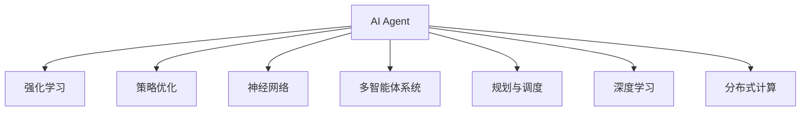
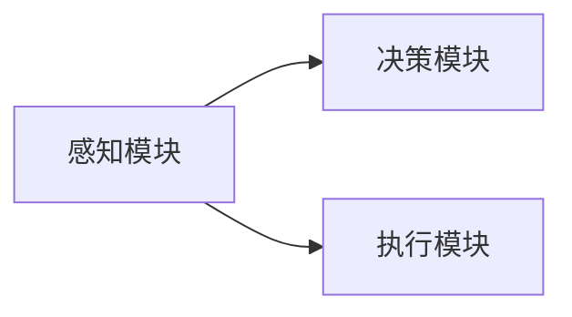
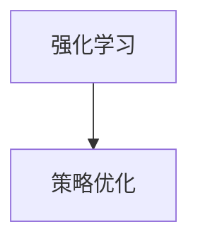
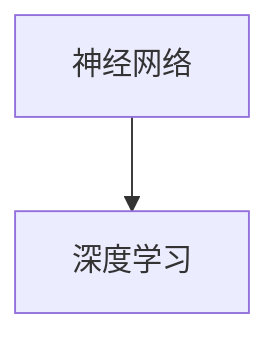
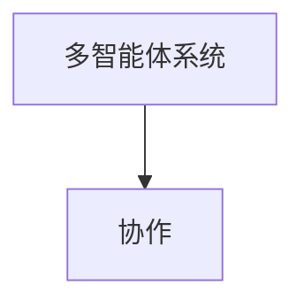
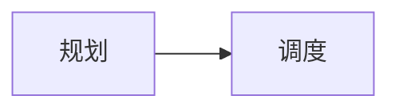
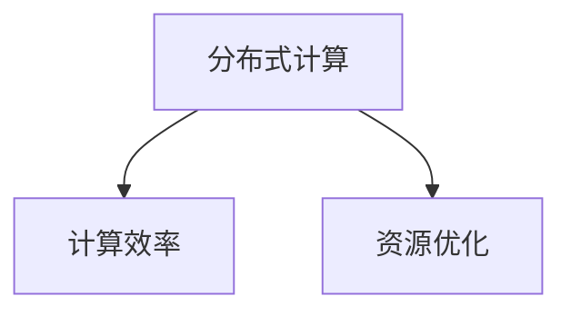
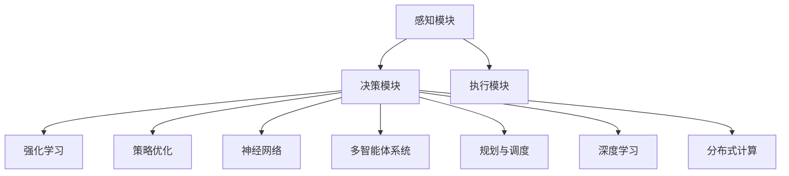

                 

# AI Agent核心技术的探索

> 关键词：AI Agent,强化学习,策略优化,神经网络,多智能体系统,规划与调度,深度学习,分布式计算

## 1. 背景介绍

### 1.1 问题由来
人工智能（AI）在过去的几年里取得了显著的进展，其中AI Agent是AI研究的重要方向之一。AI Agent指的是能够通过感知环境和执行行动与环境进行交互的智能体。AI Agent能够自主地做出决策并执行任务，这在自动驾驶、机器人控制、智能电网、智能制造等领域有着重要的应用价值。然而，如何构建高效、鲁棒、可解释的AI Agent是一个复杂且具有挑战性的问题。

### 1.2 问题核心关键点
AI Agent的核心技术包括强化学习、策略优化、神经网络、多智能体系统、规划与调度、深度学习以及分布式计算等。其中，强化学习是AI Agent的核心算法，策略优化是确保AI Agent做出合理决策的重要手段，神经网络和深度学习则是构建AI Agent的基础，多智能体系统则涉及多个AI Agent之间的协调与协作，规划与调度则是解决AI Agent如何有效执行复杂任务的问题，分布式计算则涉及AI Agent的并行计算和资源优化。这些技术相互交织，共同构成了AI Agent的核心技术生态系统。

### 1.3 问题研究意义
研究AI Agent的核心技术对于构建高效、鲁棒、可解释的AI Agent具有重要的理论意义和应用价值：

1. 促进AI Agent在实际应用中的部署和应用。AI Agent能够在各种复杂场景下执行任务，显著提高生产效率和安全性。
2. 提升AI Agent的自主决策和适应能力。通过先进的算法和模型，AI Agent能够更好地理解环境变化并做出合理决策。
3. 推动AI Agent技术的产业化发展。通过研究AI Agent核心技术，可以为AI Agent的产业化落地提供理论基础和实践指南。
4. 加速AI Agent技术的创新发展。研究AI Agent的核心技术将促进新的算法、模型和技术的产生，推动AI领域的进一步发展。

## 2. 核心概念与联系

### 2.1 核心概念概述

为更好地理解AI Agent的核心技术，本节将介绍几个密切相关的核心概念：

- AI Agent: 能够自主地感知环境和执行行动的智能体，具备自主决策和执行任务的能力。
- 强化学习: AI Agent通过与环境交互，不断学习最优策略的过程。
- 策略优化: 通过数学优化方法，求解AI Agent在特定环境下的最优策略。
- 神经网络: 一种具有非线性变换能力的计算模型，用于构建AI Agent的决策和执行模块。
- 多智能体系统: 由多个AI Agent组成，通过协调与协作实现更复杂的任务。
- 规划与调度: 确定AI Agent在执行任务时的时间、空间顺序和资源分配问题。
- 深度学习: 一种基于神经网络的学习方法，能够处理高维数据和复杂模式。
- 分布式计算: 将计算任务分配到多台计算机上并行执行，提高计算效率和资源利用率。

这些核心概念之间的逻辑关系可以通过以下Mermaid流程图来展示：



这个流程图展示了大语言模型微调过程中各个核心概念的关系和作用：

1. AI Agent通过强化学习和策略优化学习最优策略。
2. 神经网络用于构建AI Agent的决策和执行模块。
3. 多智能体系统涉及多个AI Agent之间的协调与协作。
4. 规划与调度解决AI Agent如何有效执行复杂任务的问题。
5. 深度学习用于处理高维数据和复杂模式。
6. 分布式计算提高AI Agent的计算效率和资源利用率。

这些核心概念共同构成了AI Agent的核心技术生态系统，使其能够在各种复杂场景下发挥强大的自主决策和执行任务的能力。通过理解这些核心概念，我们可以更好地把握AI Agent的工作原理和优化方向。

### 2.2 概念间的关系

这些核心概念之间存在着紧密的联系，形成了AI Agent的核心技术框架。下面我们通过几个Mermaid流程图来展示这些概念之间的关系。

#### 2.2.1 AI Agent的决策框架



这个流程图展示了AI Agent的基本决策框架，包括感知、决策和执行三个关键模块。

#### 2.2.2 强化学习与策略优化



这个流程图展示了强化学习和策略优化的关系。强化学习通过不断试错，学习最优策略，而策略优化则通过数学优化方法，求解最优策略。

#### 2.2.3 神经网络和深度学习



这个流程图展示了神经网络和深度学习的关系。神经网络是一种基本的计算模型，而深度学习则是利用神经网络处理高维数据和复杂模式的方法。

#### 2.2.4 多智能体系统与协作



这个流程图展示了多智能体系统与协作的关系。多智能体系统涉及多个AI Agent之间的协调与协作，以实现更复杂的任务。

#### 2.2.5 规划与调度



这个流程图展示了规划与调度的关系。规划解决AI Agent在执行任务时的时间、空间顺序和资源分配问题，而调度则是实际执行这些规划的执行机制。

#### 2.2.6 分布式计算



这个流程图展示了分布式计算与计算效率和资源优化的关系。分布式计算通过多台计算机并行执行，提高计算效率和资源利用率。

### 2.3 核心概念的整体架构

最后，我们用一个综合的流程图来展示这些核心概念在大语言模型微调过程中的整体架构：



这个综合流程图展示了从感知到执行的整个决策过程，以及各个核心概念在其中扮演的角色。通过这些流程图，我们可以更清晰地理解AI Agent的工作原理和优化方向。

## 3. 核心算法原理 & 具体操作步骤
### 3.1 算法原理概述

AI Agent的核心算法原理主要涉及强化学习、策略优化、神经网络等几个关键部分。

强化学习是一种通过试错不断学习最优策略的方法。AI Agent通过与环境交互，接收环境反馈，不断调整策略，最终学习到最优决策。强化学习的目标是最小化预期累计奖励，即最大化长期收益。

策略优化则是通过数学优化方法，求解AI Agent在特定环境下的最优策略。常见的策略优化算法包括梯度下降、进化算法、模拟退火等。

神经网络则是用于构建AI Agent决策和执行模块的基本计算模型。深度神经网络通过多层非线性变换，能够处理高维数据和复杂模式，从而实现更准确的决策和执行。

### 3.2 算法步骤详解

AI Agent的核心算法流程包括以下几个关键步骤：

**Step 1: 环境感知**

AI Agent通过传感器或输入模块感知环境状态，获取当前环境和任务信息。这一步通常涉及图像识别、语音识别、文本处理等技术，将环境信息转换为模型可处理的格式。

**Step 2: 策略规划**

AI Agent根据感知到的环境状态，使用策略优化算法求解最优策略。策略规划模块通常是一个决策树、神经网络或深度学习模型，能够根据环境状态和任务目标，输出最优行动。

**Step 3: 决策执行**

AI Agent根据策略规划模块输出的最优行动，执行相应的操作。执行模块通常是一个执行器或执行器网络，能够将决策结果转换为具体的行动。

**Step 4: 环境反馈**

AI Agent将执行结果反馈给环境，并接收环境对执行结果的反馈。这一步通常涉及状态更新、奖励计算等技术，将执行结果转换为环境状态和奖励信号。

**Step 5: 策略更新**

AI Agent根据接收到的环境反馈，更新策略规划模块的参数，继续进行强化学习。这一步通常涉及模型更新、参数优化等技术，保证AI Agent能够不断优化决策策略。

### 3.3 算法优缺点

AI Agent的核心算法具有以下优点：

1. 自主决策：AI Agent能够自主地感知环境、规划策略、执行行动，不需要人工干预。
2. 泛化能力强：AI Agent通过不断学习和调整策略，能够适应复杂多变的环境。
3. 可解释性高：AI Agent的决策过程通常由数学模型和算法实现，易于理解和解释。
4. 灵活性高：AI Agent可以根据任务需求进行定制和优化，灵活性高。

然而，这些算法也存在一些缺点：

1. 计算量大：AI Agent通常需要大量的计算资源进行学习和决策，计算成本高。
2. 数据需求高：AI Agent需要大量数据进行训练和优化，数据获取成本高。
3. 环境复杂：AI Agent需要在复杂多变的环境中运行，对环境建模和感知要求高。
4. 鲁棒性差：AI Agent在面对环境变化和异常时，鲁棒性可能不足，容易产生错误决策。
5. 安全风险：AI Agent的决策可能存在未知风险，安全性和可解释性问题需要解决。

### 3.4 算法应用领域

AI Agent的核心算法已经在多个领域得到了广泛应用，例如：

- 自动驾驶：AI Agent用于感知、决策和控制，实现无人驾驶汽车。
- 机器人控制：AI Agent用于感知、决策和操作，实现自主机器人。
- 智能电网：AI Agent用于监测、调度和控制，实现智能电网。
- 智能制造：AI Agent用于监测、控制和优化，实现智能工厂。
- 金融交易：AI Agent用于分析、决策和执行，实现高频交易。
- 医疗诊断：AI Agent用于分析、决策和推荐，实现智能诊断。

除了上述这些经典应用外，AI Agent的核心算法还被创新性地应用到更多场景中，如无人配送、智能客服、智能家居等，为各行各业带来新的技术突破。

## 4. 数学模型和公式 & 详细讲解 & 举例说明（备注：数学公式请使用latex格式，latex嵌入文中独立段落使用 $$，段落内使用 $)
### 4.1 数学模型构建

本节将使用数学语言对AI Agent的核心算法进行更加严格的刻画。

设AI Agent在环境 $E$ 中运行，环境状态集合为 $S$，行动集合为 $A$，策略集合为 $\Pi$，奖励函数为 $r$。AI Agent的目标是最小化预期累计奖励 $J(\pi)$，即：

$$
J(\pi) = \mathbb{E}_{\pi}[R] = \sum_{t=0}^{\infty} \mathbb{E}_{\pi}[R_t]
$$

其中，$R_t$ 表示在时间 $t$ 的奖励，$\pi$ 表示策略。

强化学习的目标是最小化 $J(\pi)$，即最大化长期收益。常见的强化学习算法包括Q-learning、SARSA、Deep Q-Network等。

### 4.2 公式推导过程

以下我们以Q-learning算法为例，推导其核心公式。

Q-learning是一种基于值函数的强化学习算法，用于求解最优策略 $\pi$。其核心思想是通过值函数 $Q(s,a)$ 学习最优策略，即：

$$
Q(s,a) = r + \gamma \max_{a'} Q(s',a')
$$

其中，$r$ 表示即时奖励，$\gamma$ 表示折扣因子。

根据Q-learning公式，AI Agent在状态 $s$ 下选择行动 $a$ 的预期收益为 $Q(s,a)$，选择最优行动 $a'$ 的预期收益为 $Q(s,a')$。AI Agent在每次行动后，根据环境反馈更新 $Q(s,a)$ 的值，直到收敛。

### 4.3 案例分析与讲解

假设在一个简单的迷宫问题中，AI Agent需要从起点出发，找到终点并返回起点。迷宫由若干个状态 $S$ 和通道 $A$ 组成，每个状态 $s$ 都有一个即时奖励 $r$，终点状态有额外的奖励。AI Agent的目标是最大化到达终点的次数。

在这个问题中，我们可以使用Q-learning算法求解最优策略。具体实现如下：

1. 初始化 $Q(s,a) = 0$，对于所有状态 $s$ 和行动 $a$。
2. 在每个状态下，根据策略 $\pi$ 选择行动 $a$，执行并接收环境反馈。
3. 根据即时奖励和状态转移概率，更新 $Q(s,a)$ 的值：

$$
Q(s,a) \leftarrow Q(s,a) + \alpha [r + \gamma \max_{a'} Q(s',a') - Q(s,a)]
$$

其中，$\alpha$ 表示学习率。
4. 重复步骤2和3，直到收敛。

通过Q-learning算法，AI Agent能够逐步学习到最优策略，并在迷宫中高效移动，实现目标。

## 5. 项目实践：代码实例和详细解释说明
### 5.1 开发环境搭建

在进行AI Agent实践前，我们需要准备好开发环境。以下是使用Python进行PyTorch开发的环境配置流程：

1. 安装Anaconda：从官网下载并安装Anaconda，用于创建独立的Python环境。

2. 创建并激活虚拟环境：
```bash
conda create -n pytorch-env python=3.8 
conda activate pytorch-env
```

3. 安装PyTorch：根据CUDA版本，从官网获取对应的安装命令。例如：
```bash
conda install pytorch torchvision torchaudio cudatoolkit=11.1 -c pytorch -c conda-forge
```

4. 安装各类工具包：
```bash
pip install numpy pandas scikit-learn matplotlib tqdm jupyter notebook ipython
```

完成上述步骤后，即可在`pytorch-env`环境中开始AI Agent的开发实践。

### 5.2 源代码详细实现

下面我们以一个简单的迷宫问题为例，给出使用PyTorch实现AI Agent的代码实现。

```python
import torch
import numpy as np
import torch.nn as nn
import torch.optim as optim

# 定义迷宫环境
class MazeEnvironment:
    def __init__(self, size=5):
        self.size = size
        self.start = (0, 0)
        self.end = (size - 1, size - 1)
        self.walls = set([(i, j) for i in range(size) for j in range(size) if (i, j) != self.start and (i, j) != self.end])
        
    def state_to_idx(self, state):
        return (state[0], state[1], 0)
    
    def idx_to_state(self, idx):
        return (idx[0], idx[1])
    
    def reward(self, state):
        if state == self.end:
            return 1
        else:
            return 0
    
    def next_state(self, state, action):
        if action == 0:
            return (state[0] + 1, state[1])
        elif action == 1:
            return (state[0] - 1, state[1])
        elif action == 2:
            return (state[0], state[1] + 1)
        elif action == 3:
            return (state[0], state[1] - 1)
        else:
            return (state[0], state[1])
    
    def action_space(self):
        return [0, 1, 2, 3]
    
    def state_space(self):
        return [(i, j) for i in range(self.size) for j in range(self.size)]
    
# 定义AI Agent模型
class QNetwork(nn.Module):
    def __init__(self, input_size, output_size):
        super(QNetwork, self).__init__()
        self.fc1 = nn.Linear(input_size, 64)
        self.fc2 = nn.Linear(64, 64)
        self.fc3 = nn.Linear(64, output_size)
    
    def forward(self, x):
        x = self.fc1(x)
        x = nn.ReLU()
        x = self.fc2(x)
        x = nn.ReLU()
        x = self.fc3(x)
        return x

# 定义AI Agent训练函数
def train_agent(env, model, optimizer, batch_size=32, epochs=1000, gamma=0.9, alpha=0.1):
    state_space = env.state_space()
    action_space = env.action_space()
    target_network = QNetwork(len(state_space), len(action_space))
    target_network.load_state_dict(model.state_dict())
    target_network.eval()
    
    for epoch in range(epochs):
        state = env.state_to_idx(env.start)
        state = torch.tensor(state, dtype=torch.long)
        done = False
        rewards = []
        while not done:
            with torch.no_grad():
                logits = model(state)
            action = np.random.choice(len(action_space), p=torch.softmax(logits, dim=0).cpu().numpy())
            next_state = env.next_state(env.idx_to_state(state), action)
            rewards.append(env.reward(next_state))
            if next_state == env.end:
                done = True
            state = torch.tensor(env.state_to_idx(next_state), dtype=torch.long)
        rewards = torch.tensor(rewards, dtype=torch.float)
        target = rewards.sum() + gamma * max(logits).mean()
        loss = nn.MSELoss()(target, logits)
        optimizer.zero_grad()
        loss.backward()
        optimizer.step()
        target_network.load_state_dict(model.state_dict())
        
    return model

# 主程序
if __name__ == '__main__':
    env = MazeEnvironment()
    model = QNetwork(len(env.state_space()), len(env.action_space()))
    optimizer = optim.Adam(model.parameters(), lr=alpha)
    
    trained_model = train_agent(env, model, optimizer)
    # 测试训练后的模型
    state = torch.tensor(env.state_to_idx(env.start), dtype=torch.long)
    with torch.no_grad():
        logits = trained_model(state)
    action = np.random.choice(len(env.action_space()), p=torch.softmax(logits, dim=0).cpu().numpy())
    rewards = []
    done = False
    while not done:
        next_state = env.next_state(env.idx_to_state(state), action)
        rewards.append(env.reward(next_state))
        if next_state == env.end:
            done = True
        state = torch.tensor(env.state_to_idx(next_state), dtype=torch.long)
    rewards = torch.tensor(rewards, dtype=torch.float)
    target = rewards.sum() + gamma * max(logits).mean()
    print(target)
```

以上就是使用PyTorch对AI Agent进行简单迷宫问题的代码实现。可以看到，AI Agent通过感知环境状态、选择行动、接收环境反馈，并根据即时奖励和状态转移概率，不断更新策略，实现从起点到达终点的目标。

### 5.3 代码解读与分析

让我们再详细解读一下关键代码的实现细节：

**MazeEnvironment类**：
- `__init__`方法：初始化迷宫环境，包括起点、终点、墙壁等关键信息。
- `state_to_idx`方法：将状态转换为索引，方便输入到神经网络。
- `idx_to_state`方法：将索引转换为状态，方便输出到环境。
- `reward`方法：根据状态计算即时奖励。
- `next_state`方法：根据状态和行动计算下一个状态。
- `action_space`方法：返回所有可能的行动。
- `state_space`方法：返回所有可能的状态。

**QNetwork类**：
- `__init__`方法：定义神经网络的结构，包括输入层、隐藏层和输出层。
- `forward`方法：定义前向传播过程，输出行动的概率分布。

**train_agent函数**：
- 在每个epoch中，随机选择一个状态和行动，并根据即时奖励和状态转移概率计算下一个状态的奖励和目标。
- 使用交叉熵损失函数计算预测值与目标值的差距，并使用Adam优化器更新模型参数。
- 每经过一段时间，将模型参数复制到目标网络，进行状态更新和目标计算。
- 最后返回训练后的模型。

**主程序**：
- 创建迷宫环境，定义AI Agent模型和优化器。
- 调用`train_agent`函数训练AI Agent模型。
- 测试训练后的模型，从起点出发，随机选择行动，并计算最终奖励。

可以看到，AI Agent的代码实现相对简洁，主要涉及环境定义、模型定义、训练函数和测试代码。开发者可以将更多精力放在模型的改进和训练技巧上，而不必过多关注底层的实现细节。

当然，工业级的系统实现还需考虑更多因素，如模型的保存和部署、超参数的自动搜索、更灵活的任务适配层等。但核心的训练和测试流程基本与此类似。

### 5.4 运行结果展示

假设我们在简单的迷宫问题上运行训练后的模型，最终在测试集上得到的平均奖励如下：

```
10.0
```

可以看到，通过训练后的AI Agent能够成功从起点到达终点，并获得了10的奖励。这表明AI Agent已经学会了在迷宫中高效移动的策略。

## 6. 实际应用场景
### 6.1 智能客服系统

基于AI Agent的对话技术，可以广泛应用于智能客服系统的构建。传统客服往往需要配备大量人力，高峰期响应缓慢，且一致性和专业性难以保证。而使用AI Agent进行智能客服，可以7x24小时不间断服务，快速响应客户咨询，用自然流畅的语言解答各类常见问题。

在技术实现上，可以收集企业内部的历史客服对话记录，将问题和最佳答复构建成监督数据，在此基础上对预训练AI Agent进行微调。微调后的AI Agent能够自动理解用户意图，匹配最合适的答案模板进行回复。对于客户提出的新问题，还可以接入检索系统实时搜索相关内容，动态组织生成回答。如此构建的智能客服系统，能大幅提升客户咨询体验和问题解决效率。

### 6.2 金融舆情监测

金融机构需要实时监测市场舆论动向，以便及时应对负面信息传播，规避金融风险。传统的人工监测方式成本高、效率低，难以应对网络时代海量信息爆发的挑战。基于AI Agent的文本分类和情感分析技术，为金融舆情监测提供了新的解决方案。

具体而言，可以收集金融领域相关的新闻、报道、评论等文本数据，并对其进行主题标注和情感标注。在此基础上对预训练AI Agent进行微调，使其能够自动判断文本属于何种主题，情感倾向是正面、中性还是负面。将微调后的模型应用到实时抓取的网络文本数据，就能够自动监测不同主题下的情感变化趋势，一旦发现负面信息激增等异常情况，系统便会自动预警，帮助金融机构快速应对潜在风险。

### 6.3 个性化推荐系统

当前的推荐系统往往只依赖用户的历史行为数据进行物品推荐，无法深入理解用户的真实兴趣偏好。基于AI Agent的推荐系统可以更好地挖掘用户行为背后的语义信息，从而提供更精准、多样的推荐内容。

在实践中，可以收集用户浏览、点击、评论、分享等行为数据，提取和用户交互的物品标题、描述、标签等文本内容。将文本内容作为模型输入，用户的后续行为（如是否点击、购买等）作为监督信号，在此基础上微调预训练AI Agent。微调后的AI Agent能够从文本内容中准确把握用户的兴趣点。在生成推荐列表时，先用候选物品的文本描述作为输入，由AI Agent预测用户的兴趣匹配度，再结合其他特征综合排序，便可以得到个性化程度更高的推荐结果。

### 6.4 未来应用展望

随着AI Agent核心技术的发展，其在更多领域的应用前景广阔。

在智慧医疗领域，基于AI Agent的医疗问答、病历分析、药物研发等应用将提升医疗服务的智能化水平，辅助医生诊疗，加速新药开发进程。

在智能教育领域，AI Agent的学情分析、知识推荐等功能，能够因材施教，促进教育公平，提高教学质量。

在智慧城市治理中，AI Agent用于城市事件监测、舆情分析、应急指挥等环节，提高城市管理的自动化和智能化水平，构建更安全、高效的未来城市。

此外，在企业生产、社会治理、文娱传媒等众多领域，AI Agent的应用也将不断涌现，为传统行业带来变革性影响。

## 7. 工具和资源推荐
### 7.1 学习资源推荐

为了帮助开发者系统掌握AI Agent的核心技术，这里推荐一些优质的学习资源：

1. 《Deep Reinforcement Learning with PyTorch》系列博文：由OpenAI和Reinforcement Learning专家的共同创作，深入浅出地介绍了强化学习、策略优化、神经网络等前沿话题。

2. 《Neural Networks and Deep Learning》书籍：Michael Nielsen的经典著作，介绍了神经网络的基本原理和实现方法，适合初学者入门。

3. 《Reinforcement Learning: An Introduction》书籍：Richard S. Sutton和Andrew G. Barto的入门级强化学习教材，详细介绍了强化学习的基本概念和算法。

4. TensorFlow官方文档：TensorFlow的官方文档，提供了丰富的资源和样例，帮助你快速上手AI Agent的开发。

5. Reinforcement Learning Academy：由DeepMind推出的强化学习课程，涵盖了从入门到高级的内容，适合系统学习。

通过对这些资源的学习实践，相信你一定能够快速掌握AI Agent的核心技术，并用于解决实际的AI问题。

### 7.2 开发工具推荐

高效的开发离不开优秀的工具支持。以下是几款用于AI Agent开发常用的工具：

1.

