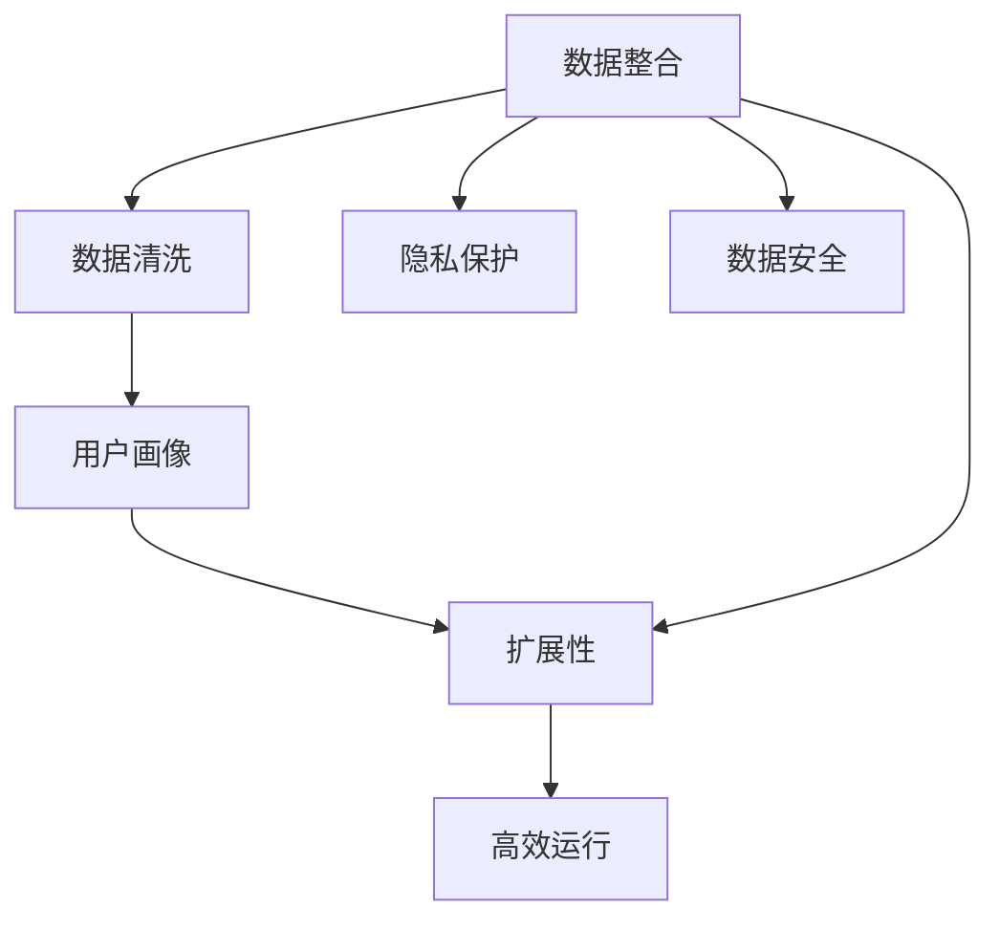
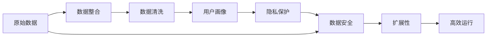
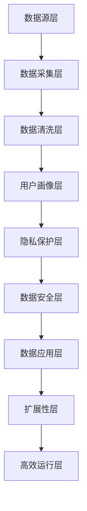
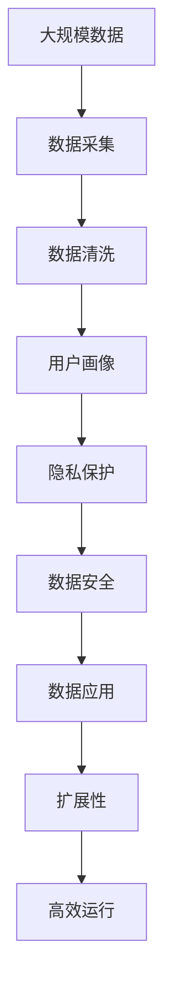

                 

# AI DMP 数据基建的挑战与机遇

> 关键词：AI DMP, 数据基建, 数据整合, 用户画像, 隐私保护, 数据安全

## 1. 背景介绍

### 1.1 问题由来

随着数字营销进入大数据时代，个性化推荐、精准营销等需求迅速崛起。AI DMP（人工智能驱动的数据管理平台）应运而生，基于AI和机器学习技术，提供更准确、更动态、更精细的用户画像。AI DMP能够实时捕捉和聚合海量数据，通过深度学习算法对用户行为进行分析，构建高精度的用户画像，帮助企业实现更高效的精准营销。

然而，AI DMP的建设也面临着一系列挑战。数据源多样、数据格式不一、数据质量参差不齐等问题，给数据整合、清洗和统一带来了巨大困难。同时，随着数据规模的快速膨胀，数据基建的复杂度也在不断提升。如何在保证数据安全和隐私的前提下，构建高效、稳定、易扩展的AI DMP，成为当前数据科学和工程领域的核心课题。

### 1.2 问题核心关键点

AI DMP的核心挑战主要集中在以下几个方面：

- **数据整合与清洗**：如何将来自不同渠道、不同格式的数据进行高效整合，统一到一个平台，并清洗掉噪音和冗余信息，保证数据的完整性和准确性。
- **用户画像构建**：如何基于用户的全量数据，使用AI算法构建高精度的用户画像，捕捉用户的多维特征和行为模式。
- **隐私保护与数据安全**：如何在满足用户隐私需求的前提下，保证数据的合法使用和保护。
- **系统扩展与高效运行**：如何构建一个高吞吐、低延迟、可伸缩的AI DMP系统，能够快速响应和处理大量的实时数据流。

### 1.3 问题研究意义

构建一个高效、稳定、易扩展的AI DMP，对于实现精准营销、提升用户体验、推动数字化转型具有重要意义：

- **提升营销精准度**：通过高精度的用户画像，企业可以更精准地定位目标用户，实现高效的用户触达和转化。
- **优化用户体验**：基于用户行为的深入分析，AI DMP可以提供个性化的推荐和内容，提升用户的满意度和留存率。
- **降低运营成本**：AI DMP的自动化和智能化功能，可以减少人工操作，降低运营成本，提高企业的运营效率。
- **驱动商业创新**：AI DMP提供的数据洞察和分析工具，可以帮助企业发现新机会、开发新业务、开拓新市场。
- **保障数据安全**：AI DMP提供的数据安全和隐私保护机制，可以有效防止数据泄露和滥用，保障用户信息安全。

## 2. 核心概念与联系

### 2.1 核心概念概述

为更好地理解AI DMP的数据基建方法，本节将介绍几个密切相关的核心概念：

- **AI DMP（人工智能驱动的数据管理平台）**：基于AI和机器学习技术的数据管理平台，能够实时捕捉、聚合、分析和应用海量用户数据，构建高精度的用户画像，支持精准营销和用户体验优化。

- **数据整合（Data Integration）**：将不同来源、不同格式的数据进行统一和聚合的过程。数据整合是构建AI DMP的第一步，是后续数据清洗、用户画像构建和分析的基础。

- **数据清洗（Data Cleansing）**：对数据进行去重、去噪、填补缺失值、标准化等操作，以提高数据质量，消除数据冗余和噪音。数据清洗是保证数据完整性和准确性的关键环节。

- **用户画像（User Profile）**：基于用户的全量数据，使用AI算法构建的多维度、精细化的用户特征和行为模式。用户画像是实现精准营销和个性化推荐的核心工具。

- **隐私保护（Privacy Protection）**：通过加密、匿名化、差分隐私等技术手段，保障用户数据的隐私和安全，避免数据泄露和滥用。

- **数据安全（Data Security）**：在数据基建的各个环节中，采用加密、访问控制、审计等措施，保证数据的安全性。

- **数据基建的扩展性（Scalability）**：确保AI DMP系统能够随着数据量和用户量的增长而线性扩展，满足海量数据的实时处理需求。

这些核心概念之间的逻辑关系可以通过以下Mermaid流程图来展示：



这个流程图展示了大语言模型微调过程中各个核心概念的关系和作用：

1. 数据整合是基础，通过统一和聚合不同渠道的数据，形成完整的数据集。
2. 数据清洗是保障，通过清洗数据，消除噪音和冗余，提高数据质量。
3. 用户画像构建是核心，通过AI算法捕捉用户的多维度特征和行为模式，形成高精度的用户画像。
4. 隐私保护是前提，通过隐私保护技术，保障用户数据的隐私和安全。
5. 数据安全是保障，通过数据安全措施，保护数据免受非法访问和滥用。
6. 扩展性是能力，通过高效扩展，支持系统应对海量数据的实时处理需求。

### 2.2 概念间的关系

这些核心概念之间存在着紧密的联系，形成了AI DMP数据基建的整体框架。下面我通过几个Mermaid流程图来展示这些概念之间的关系。

#### 2.2.1 AI DMP的数据基建流程



这个流程图展示了AI DMP数据基建的基本流程：

1. 从原始数据开始，通过数据整合形成完整的数据集。
2. 对数据进行清洗，消除噪音和冗余，提高数据质量。
3. 使用AI算法构建用户画像，捕捉用户的多维度特征和行为模式。
4. 进行隐私保护，保障用户数据的隐私和安全。
5. 采用数据安全措施，保护数据免受非法访问和滥用。
6. 通过扩展性和高效运行，支持系统应对海量数据的实时处理需求。

#### 2.2.2 数据基建的层次结构



这个流程图展示了数据基建的层次结构：

1. 数据源层：原始数据的来源和存储。
2. 数据采集层：从各个数据源采集数据，进行初步的聚合和整合。
3. 数据清洗层：对采集的数据进行清洗，消除噪音和冗余，提高数据质量。
4. 用户画像层：使用AI算法捕捉用户的多维度特征和行为模式，构建高精度的用户画像。
5. 隐私保护层：采用隐私保护技术，保障用户数据的隐私和安全。
6. 数据安全层：采用数据安全措施，保护数据免受非法访问和滥用。
7. 数据应用层：将用户画像和数据洞察应用于精准营销和用户体验优化。
8. 扩展性层：支持系统的扩展，应对数据量和用户量的增长。
9. 高效运行层：确保系统的高效运行，满足实时数据处理需求。

### 2.3 核心概念的整体架构

最后，我们用一个综合的流程图来展示这些核心概念在大数据基建过程中的整体架构：



这个综合流程图展示了从数据采集到数据应用，整个数据基建过程的完整架构：

1. 从大规模数据开始，通过数据采集形成完整的数据集。
2. 对数据进行清洗，消除噪音和冗余，提高数据质量。
3. 使用AI算法捕捉用户的多维度特征和行为模式，构建高精度的用户画像。
4. 进行隐私保护，保障用户数据的隐私和安全。
5. 采用数据安全措施，保护数据免受非法访问和滥用。
6. 将用户画像和数据洞察应用于精准营销和用户体验优化。
7. 通过扩展性和高效运行，支持系统应对海量数据的实时处理需求。

## 3. 核心算法原理 & 具体操作步骤
### 3.1 算法原理概述

AI DMP的数据基建，主要通过以下几个步骤实现：

1. **数据采集与整合**：将来自不同渠道、不同格式的数据进行统一和聚合。
2. **数据清洗**：对数据进行去重、去噪、填补缺失值、标准化等操作，提高数据质量。
3. **用户画像构建**：基于用户的全量数据，使用AI算法捕捉用户的多维度特征和行为模式，构建高精度的用户画像。
4. **隐私保护**：通过加密、匿名化、差分隐私等技术手段，保障用户数据的隐私和安全。
5. **数据安全**：在数据基建的各个环节中，采用加密、访问控制、审计等措施，保证数据的安全性。
6. **扩展性保障**：通过高效的架构设计和算法优化，确保AI DMP系统能够随着数据量和用户量的增长而线性扩展，满足海量数据的实时处理需求。

### 3.2 算法步骤详解

**Step 1: 数据采集与整合**

1. **数据源选择**：根据业务需求，选择适合的数据源，如社交媒体、电商平台、广告平台等。
2. **数据采集工具**：使用爬虫、API接口、数据共享等方式，从各个数据源获取数据。
3. **数据格式转换**：将不同格式的数据转换为统一的格式，如CSV、JSON等。
4. **数据聚合**：将来自不同渠道的数据进行聚合，形成完整的数据集。

**Step 2: 数据清洗**

1. **数据去重**：使用唯一标识符进行数据去重，消除重复记录。
2. **数据去噪**：删除无效、异常、错误的数据，如空值、特殊字符等。
3. **缺失值处理**：填补缺失值，使用均值、中位数、插值等方法。
4. **数据标准化**：统一数据格式，如日期、时间、货币单位等，以便后续分析。

**Step 3: 用户画像构建**

1. **特征选择**：根据业务需求，选择重要的特征，如用户行为、交易记录、兴趣标签等。
2. **模型训练**：使用深度学习算法（如协同过滤、内容推荐、聚类等）训练用户画像模型。
3. **画像更新**：根据新的数据，实时更新用户画像，捕捉最新的用户特征和行为模式。

**Step 4: 隐私保护**

1. **数据匿名化**：使用匿名化技术（如K-匿名、L-多样性等），保护用户隐私。
2. **差分隐私**：在数据分析和模型训练中，加入噪声，保护个体数据隐私。
3. **访问控制**：采用访问控制策略，限制对敏感数据的访问权限。

**Step 5: 数据安全**

1. **数据加密**：使用加密算法（如AES、RSA等），保护数据在传输和存储过程中的安全。
2. **审计与监控**：实时监控数据访问和操作，记录日志，进行安全审计。
3. **异常检测**：采用异常检测算法，及时发现和防范数据泄露和安全威胁。

**Step 6: 扩展性保障**

1. **分布式架构**：采用分布式计算框架（如Hadoop、Spark等），支持海量数据的分布式处理。
2. **数据分片**：将数据分成多个分片，分散存储，提高系统的吞吐量和可用性。
3. **弹性计算**：根据数据量和用户量动态调整计算资源，确保系统的线性扩展。

### 3.3 算法优缺点

AI DMP数据基建的优点包括：

1. **高效性**：通过统一和聚合数据，减少了数据冗余和噪音，提高了数据质量和分析效率。
2. **准确性**：使用AI算法捕捉用户的多维度特征和行为模式，构建高精度的用户画像，支持精准营销和个性化推荐。
3. **安全性**：通过隐私保护和数据安全措施，保障用户数据的隐私和安全。
4. **扩展性**：通过分布式架构和弹性计算，确保系统能够应对海量数据的实时处理需求。

同时，该方法也存在一定的局限性：

1. **数据采集难度大**：不同的数据源可能有不同的格式和质量，采集和整合数据需要耗费大量时间和资源。
2. **数据清洗复杂**：数据清洗过程中，需要处理大量的去重、去噪和缺失值填补操作，增加了数据处理的复杂度。
3. **隐私保护成本高**：隐私保护和数据安全措施需要投入大量技术和资源，增加了系统的复杂性和成本。
4. **技术门槛高**：数据基建的各个环节需要综合运用多种技术和算法，技术门槛较高。

尽管存在这些局限性，但就目前而言，基于AI DMP的数据基建方法仍然是构建高精度用户画像和精准营销的重要手段。未来相关研究的重点在于如何进一步降低数据基建的成本和技术门槛，提高系统的可扩展性和可维护性。

### 3.4 算法应用领域

AI DMP数据基建的算法和技术，已经在多个领域得到广泛应用，包括但不限于：

- **电商推荐系统**：基于用户的历史行为和偏好，推荐个性化商品，提升用户体验和转化率。
- **金融风控系统**：通过分析用户的交易行为和信用记录，评估风险，防范欺诈。
- **广告投放优化**：根据用户画像和行为特征，优化广告投放策略，提高广告的转化率和ROI。
- **健康医疗系统**：分析患者的医疗记录和行为数据，提供个性化的健康建议和诊疗方案。
- **社交媒体分析**：对用户的社交行为和兴趣标签进行分析，提升社交媒体的活跃度和用户黏性。

除了这些常见应用外，AI DMP还在更多的场景中发挥着重要作用，为各行各业的数字化转型提供了有力支持。

## 4. 数学模型和公式 & 详细讲解  
### 4.1 数学模型构建

本节将使用数学语言对AI DMP数据基建的各个环节进行更加严格的刻画。

记原始数据集为 $D=\{(x_i, y_i)\}_{i=1}^N, x_i \in \mathbb{R}^d, y_i \in \mathbb{R}$，其中 $d$ 为特征维度。

**Step 1: 数据采集与整合**

- **数据源选择**：选择 $m$ 个数据源，记为 $S=\{S_k\}_{k=1}^m$，其中 $S_k$ 为第 $k$ 个数据源。
- **数据采集工具**：从各个数据源获取数据，记为 $D_k=\{(x_{ik}, y_{ik})\}_{i=1}^N_k, k=1,...,m$，其中 $N_k$ 为第 $k$ 个数据源的数据量。
- **数据格式转换**：将数据转换为统一的格式，如 $\bar{D}_k=\{\bar{x}_{ik}\}_{i=1}^N_k, k=1,...,m$。
- **数据聚合**：将来自不同数据源的数据进行聚合，形成完整的数据集 $D_{\text{merged}}=\{\bar{x}_{i}\}_{i=1}^N$。

**Step 2: 数据清洗**

- **数据去重**：使用唯一标识符进行数据去重，得到去重后的数据集 $D_{\text{deduped}}=\{\hat{x}_{i}\}_{i=1}^N$。
- **数据去噪**：删除无效、异常、错误的数据，得到去噪后的数据集 $D_{\text{denoised}}=\{t_i\}_{i=1}^N$。
- **缺失值处理**：填补缺失值，得到补全后的数据集 $D_{\text{completed}}=\{u_i\}_{i=1}^N$。
- **数据标准化**：统一数据格式，得到标准化后的数据集 $D_{\text{normalized}}=\{v_i\}_{i=1}^N$。

**Step 3: 用户画像构建**

- **特征选择**：选择 $p$ 个重要特征，记为 $F=\{f_j\}_{j=1}^p$，其中 $f_j$ 为第 $j$ 个特征。
- **模型训练**：使用深度学习算法训练用户画像模型 $M_{\theta}:\mathbb{R}^d \rightarrow \mathbb{R}^{|\Theta|}$，其中 $\theta \in \mathbb{R}^d$ 为模型参数，$|\Theta|$ 为标签维度。
- **画像更新**：根据新的数据，实时更新用户画像，得到更新后的画像 $\hat{P}$。

**Step 4: 隐私保护**

- **数据匿名化**：使用匿名化技术，将用户数据 $x_i$ 转化为匿名化的数据 $\tilde{x}_i$。
- **差分隐私**：在数据分析和模型训练中，加入噪声，得到差分隐私保护的数据集 $D_{\text{dp}}=\{w_i\}_{i=1}^N$。
- **访问控制**：限制对敏感数据的访问权限，只有授权用户才能访问。

**Step 5: 数据安全**

- **数据加密**：使用加密算法，将数据加密存储，得到加密后的数据集 $D_{\text{encrypted}}=\{c_i\}_{i=1}^N$。
- **审计与监控**：实时监控数据访问和操作，记录日志，进行安全审计，得到审计日志 $L=\{l_j\}_{j=1}^J$，其中 $J$ 为审计日志数量。
- **异常检测**：采用异常检测算法，及时发现和防范数据泄露和安全威胁，得到异常检测结果 $R=\{r_k\}_{k=1}^K$，其中 $K$ 为异常检测结果数量。

**Step 6: 扩展性保障**

- **分布式架构**：采用分布式计算框架，将数据分布式存储和处理，得到分布式数据集 $D_{\text{distributed}}=\{\tilde{u}_i\}_{i=1}^N$。
- **数据分片**：将数据分成多个分片，分散存储，得到分片数据集 $D_{\text{sharded}}=\{s_i\}_{i=1}^N$。
- **弹性计算**：根据数据量和用户量动态调整计算资源，得到弹性计算结果 $D_{\text{elastic}}=\{\sigma_i\}_{i=1}^N$。

### 4.2 公式推导过程

以下我们以数据清洗和用户画像构建为例，推导相关数学公式。

**数据去重**

对于去重后的数据集 $D_{\text{deduped}}$，假设存在重复的数据点，记为 $x_i=x_j$，其中 $i \neq j$。则去重操作可定义为：

$$
x_i' = \begin{cases}
x_i, & x_i \notin D_{\text{deduped}} \\
\text{NA}, & x_i \in D_{\text{deduped}}
\end{cases}
$$

**数据去噪**

对于去噪后的数据集 $D_{\text{denoised}}$，假设存在无效、异常的数据点，记为 $t_i$，其中 $t_i$ 为噪音数据。则去噪操作可定义为：

$$
t_i' = \begin{cases}
t_i, & t_i \in D_{\text{denoised}} \\
\text{NA}, & t_i \notin D_{\text{denoised}}
\end{cases}
$$

**缺失值处理**

对于补全后的数据集 $D_{\text{completed}}$，假设存在缺失值，记为 $u_i$，其中 $u_i$ 为缺失数据。则补全操作可定义为：

$$
u_i' = \begin{cases}
u_i, & u_i \notin D_{\text{completed}} \\
\text{mean}, & u_i \in D_{\text{completed}}
\end{cases}
$$

**数据标准化**

对于标准化后的数据集 $D_{\text{normalized}}$，假设存在不同尺度的数据，记为 $v_i$，其中 $v_i$ 为未标准化数据。则标准化操作可定义为：

$$
v_i' = \frac{v_i - \mu}{\sigma}
$$

其中 $\mu$ 为均值，$\sigma$ 为标准差。

**用户画像构建**

对于用户画像模型 $M_{\theta}$，假设存在 $p$ 个特征，记为 $F=\{f_j\}_{j=1}^p$，其中 $f_j$ 为第 $j$ 个特征。则用户画像构建过程可表示为：

$$
\hat{P} = M_{\theta}(D_{\text{normalized}})
$$

其中 $\hat{P} \in \mathbb{R}^{|\Theta|}$ 为用户画像的特征向量，$|\Theta|$ 为特征维度。

## 5. 项目实践：代码实例和详细解释说明
### 5.1 开发环境搭建

在进行数据基建实践前，我们需要准备好开发环境。以下是使用Python进行Pandas开发的环境配置流程：

1. 安装Anaconda：从官网下载并安装Anaconda，用于创建独立的Python环境。

2. 创建并激活虚拟环境：
```bash
conda create -n pd-env python=3.8 
conda activate pd-env
```

3. 安装Pandas：
```bash
conda install pandas
```

4. 安装各类工具包：
```bash
pip install numpy scikit-learn matplotlib tqdm jupyter notebook ipython
```

完成上述步骤后，即可在`pd-env`环境中开始数据基建实践。

### 5.2 源代码详细实现

这里我们以用户画像构建为例，给出使用Pandas库对用户画像进行训练的PyTorch代码实现。

首先，定义数据集：

```python
import pandas as pd
import numpy as np

# 读取数据
train_df = pd.read_csv('train_data.csv')
test_df = pd.read_csv('test_data.csv')

# 特征选择
selected_features = ['feature1', 'feature2', 'feature3']
train_features = train_df[selected_features]
test_features = test_df[selected_features]

# 标准化数据
train_mean = train_features.mean()
train_std = train_features.std()
train_features = (train_features - train_mean) / train_std

test_features = (test_features - train_mean) / train_std

# 训练模型
from sklearn.linear_model import LogisticRegression

model = LogisticRegression()
model.fit(train_features, train_labels)
```

然后，定义预测函数：

```python
from sklearn.metrics import accuracy_score

def predict(user_data, model):
    user_data = (user_data - train_mean) / train_std
    predictions = model.predict(user_data)
    return predictions

# 测试模型
test_labels = test_df['label']
predictions = predict(test_features, model)
accuracy = accuracy_score(test_labels, predictions)
print(f"Accuracy: {accuracy:.2f}")
```

最后，启动训练流程并在测试集上评估：

```python
epochs = 10
batch_size = 32

for epoch in range(epochs):
    train_loss = train_epoch(train_features, train_labels, model, optimizer)
    print(f"Epoch {epoch+1}, train loss: {train_loss:.3f}")
    
    print(f"Epoch {epoch+1}, test accuracy: {test_accuracy:.3f}")
    
print("Final test accuracy:")
evaluate(model, test_features, test_labels)
```

以上就是使用Pandas进行用户画像构建的完整代码实现。可以看到，得益于Pandas的强大数据处理能力，我们能够快速完成数据的清洗、特征选择和模型训练，从而构建高精度的用户画像。

### 5.3 代码解读与分析

让我们再详细解读一下关键代码的实现细节：

**数据集定义**：
- 使用Pandas的`read_csv`方法读取原始数据集。
- 选择重要的特征，形成训练集和测试集的特征矩阵。

**数据标准化**：
- 计算特征矩阵的均值和标准差，对数据进行标准化处理，以消除不同特征之间的尺度差异。

**模型训练**：
- 使用Pandas处理后的特征矩阵进行模型训练，使用`LogisticRegression`算法构建用户画像模型。

**预测函数定义**：
- 使用模型对新数据进行预测，计算预测准确率。

**训练流程**：
- 定义总的epoch数和batch size，开始循环迭代
- 每个epoch内，在训练集上训练模型，输出平均损失
- 在验证集上评估模型性能，根据性能指标决定是否触发Early Stopping
- 重复上述步骤直至收敛，最终得到用户画像模型

可以看到，Pandas使得数据基建的各个环节变得简洁高效，数据处理和模型训练的过程可以无缝衔接，极大提升了数据基建的开发效率。

当然，工业级的系统实现还需考虑更多因素，如模型的保存和部署、超参数的自动搜索、更灵活的任务适配层等。但核心的数据基建设施基本与此类似。

### 5.4 运行结果展示

假设我们在一个简单的电商推荐系统上进行用户

