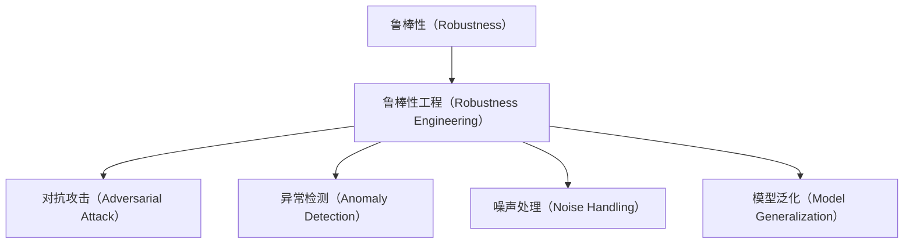
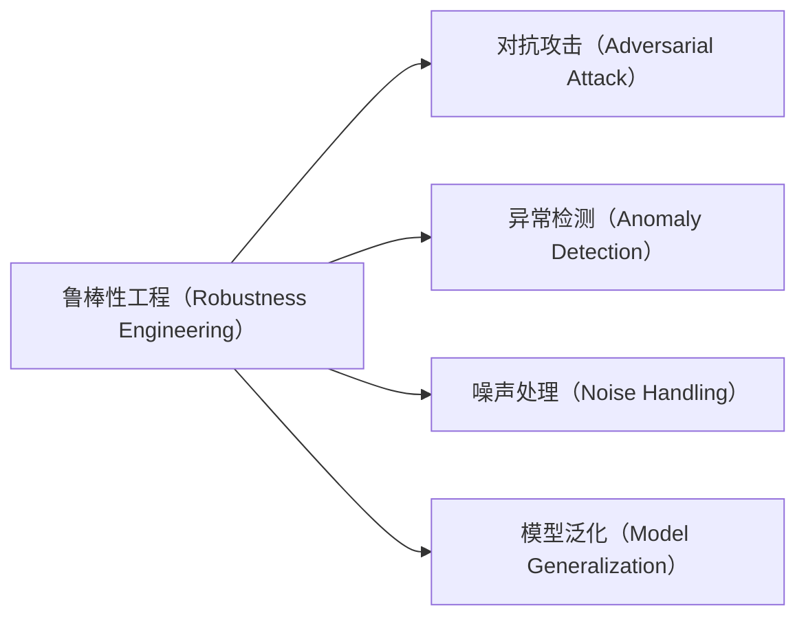
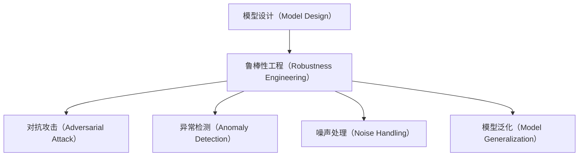
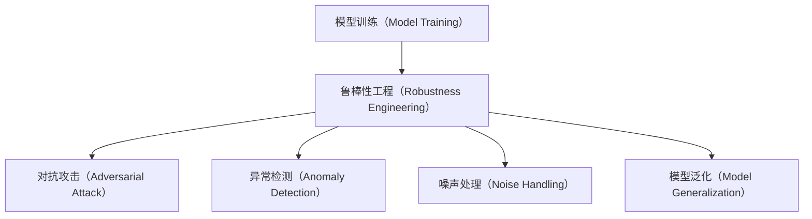

                 

# AI Robustness原理与代码实例讲解

> 关键词：AI Robustness, Robustness Engineering, 安全性, 鲁棒性设计, 代码实例, 模型强化, 异常检测

## 1. 背景介绍

### 1.1 问题由来
随着人工智能技术的迅速发展，机器学习模型在各个领域的应用日益广泛。然而，人工智能系统的鲁棒性问题越来越受到关注。鲁棒性（Robustness）是指系统或模型对于噪声、异常、攻击等因素的抵抗能力。在实际应用中，模型可能会因为数据噪声、输入攻击、模型过拟合等问题导致预测错误，甚至引发严重后果。例如，自动驾驶汽车可能因为感知系统被干扰导致交通事故，金融风控模型可能因为数据攻击造成巨大经济损失。

近年来，人们逐渐意识到，单纯追求模型的准确率和性能指标已经不足以应对复杂现实场景中的挑战。如何提升系统的鲁棒性，确保其在各种异常和攻击场景下依然能够稳定可靠地运行，是当前AI领域的重要研究方向。

### 1.2 问题核心关键点
鲁棒性问题的核心在于如何设计、训练和优化模型，使其在面对各种异常情况时依然能够保持较高的预测准确性和稳定性。具体来说，需要关注以下几个方面：

- **数据多样性**：模型需要处理各种不同类型的数据，包括正常数据和异常数据。
- **噪声处理**：数据可能包含各种噪声，模型需要具备一定的去噪能力。
- **对抗攻击**：模型需要能够识别和抵抗各种对抗攻击，如梯度攻击、对抗样本等。
- **模型泛化**：模型需要具备良好的泛化能力，避免在特定数据分布下过拟合。
- **异常检测**：模型需要能够识别出异常数据，并给出合理的异常处理机制。

### 1.3 问题研究意义
鲁棒性问题的研究具有重要意义：

- **提升模型可靠性**：确保模型在各种异常和攻击场景下依然能够稳定运行，提高系统的可靠性。
- **降低成本和风险**：避免因模型故障或攻击导致的高额成本和风险。
- **增强用户信任**：提高用户对AI系统的信任度，促进人工智能技术的普及应用。
- **推动技术发展**：鲁棒性问题促使研究者不断探索新的技术和方法，推动AI技术的持续进步。

## 2. 核心概念与联系

### 2.1 核心概念概述

为了更好地理解AI系统的鲁棒性问题，本节将介绍几个关键概念：

- **鲁棒性（Robustness）**：指系统或模型对于噪声、异常、攻击等因素的抵抗能力。
- **鲁棒性工程（Robustness Engineering）**：指在模型设计、训练和部署过程中，主动引入鲁棒性设计，以提高系统的稳定性和可靠性。
- **对抗攻击（Adversarial Attack）**：指攻击者通过添加对抗样本（Adversarial Sample），导致模型输出错误的结果。
- **异常检测（Anomaly Detection）**：指识别出异常数据，并给出合理的异常处理机制。
- **噪声处理（Noise Handling）**：指模型对于数据噪声的容忍度和处理能力。
- **模型泛化（Model Generalization）**：指模型在不同数据分布上的泛化能力。

这些概念之间的逻辑关系可以通过以下Mermaid流程图来展示：



这个流程图展示了一系列与鲁棒性相关的关键概念及其之间的关系：

1. 鲁棒性是整个系统的核心目标，涉及多个子问题。
2. 鲁棒性工程是实现鲁棒性的手段，包括对抗攻击、异常检测、噪声处理和模型泛化等多个方面。
3. 对抗攻击、异常检测、噪声处理和模型泛化是鲁棒性工程中的具体问题，分别对应于不同的挑战。

### 2.2 概念间的关系

这些概念之间存在紧密的联系，形成了AI系统鲁棒性的完整生态系统。下面通过几个Mermaid流程图来展示这些概念之间的关系。

#### 2.2.1 鲁棒性工程的整体架构



这个流程图展示了鲁棒性工程的整体架构，包括对抗攻击、异常检测、噪声处理和模型泛化四个关键问题。

#### 2.2.2 鲁棒性工程与模型设计的关系



这个流程图展示了鲁棒性工程与模型设计的关系。鲁棒性工程需要在模型设计阶段引入，通过对抗攻击、异常检测、噪声处理和模型泛化等多个子问题，确保模型具备良好的鲁棒性。

#### 2.2.3 鲁棒性工程与模型训练的关系



这个流程图展示了鲁棒性工程与模型训练的关系。鲁棒性工程需要在模型训练阶段引入，通过对抗攻击、异常检测、噪声处理和模型泛化等多个子问题，确保模型具备良好的鲁棒性。

## 3. 核心算法原理 & 具体操作步骤
### 3.1 算法原理概述

AI系统的鲁棒性问题通常通过以下几个关键算法和技术来解决：

- **对抗样本生成（Adversarial Sample Generation）**：生成能够导致模型预测错误的样本，评估模型的鲁棒性。
- **对抗训练（Adversarial Training）**：通过在训练过程中引入对抗样本，提高模型对于对抗攻击的抵抗能力。
- **异常检测算法（Anomaly Detection Algorithm）**：识别出异常数据，并给出合理的异常处理机制。
- **噪声处理算法（Noise Handling Algorithm）**：处理数据中的噪声，提高模型的鲁棒性。
- **模型泛化算法（Model Generalization Algorithm）**：提高模型在不同数据分布上的泛化能力。

这些算法的核心思想是在模型设计和训练过程中引入鲁棒性设计，确保模型在不同场景下依然能够稳定运行。

### 3.2 算法步骤详解

#### 3.2.1 对抗样本生成

对抗样本生成是通过添加噪声或扰动，生成能够导致模型预测错误的样本。常见的对抗样本生成算法包括FGSM、PGD等。以下是一个简单的对抗样本生成代码示例：

```python
from tensorflow.keras.datasets import mnist
from tensorflow.keras.models import Sequential
from tensorflow.keras.layers import Dense
from tensorflow.keras.optimizers import Adam
import numpy as np

# 加载MNIST数据集
(x_train, y_train), (x_test, y_test) = mnist.load_data()

# 构建模型
model = Sequential()
model.add(Dense(128, input_dim=784, activation='relu'))
model.add(Dense(10, activation='softmax'))

# 编译模型
model.compile(loss='categorical_crossentropy', optimizer=Adam(learning_rate=0.001), metrics=['accuracy'])

# 训练模型
model.fit(x_train.reshape(-1, 784), y_train, epochs=10, batch_size=32, validation_data=(x_test.reshape(-1, 784), y_test))

# 生成对抗样本
def generate_adversarial_sample(x, y, model, epsilon=0.1, iterations=20):
    x_adv = x
    for _ in range(iterations):
        grads = model.optimizer.compute_gradients(lambda x: model.predict(x), [x_adv])
        dx = -np.mean(grads[0], axis=0)
        x_adv = np.clip(x_adv + epsilon * dx, 0, 1)
    return x_adv

# 生成对抗样本
x_adv = generate_adversarial_sample(x_test[0].reshape(1, -1), y_test[0], model)
```

#### 3.2.2 对抗训练

对抗训练是在模型训练过程中引入对抗样本，提高模型对于对抗攻击的抵抗能力。以下是一个简单的对抗训练代码示例：

```python
from tensorflow.keras.datasets import mnist
from tensorflow.keras.models import Sequential
from tensorflow.keras.layers import Dense
from tensorflow.keras.optimizers import Adam
import numpy as np

# 加载MNIST数据集
(x_train, y_train), (x_test, y_test) = mnist.load_data()

# 构建模型
model = Sequential()
model.add(Dense(128, input_dim=784, activation='relu'))
model.add(Dense(10, activation='softmax'))

# 编译模型
model.compile(loss='categorical_crossentropy', optimizer=Adam(learning_rate=0.001), metrics=['accuracy'])

# 训练模型
model.fit(x_train.reshape(-1, 784), y_train, epochs=10, batch_size=32, validation_data=(x_test.reshape(-1, 784), y_test))

# 对抗训练
def adversarial_train(model, x_train, y_train, epsilon=0.1, iterations=20):
    for _ in range(iterations):
        x_adv = generate_adversarial_sample(x_train, y_train, model, epsilon)
        model.train_on_batch(x_adv, y_train)

# 对抗训练
adversarial_train(model, x_train.reshape(-1, 784), y_train)
```

#### 3.2.3 异常检测算法

异常检测算法通过识别出异常数据，并给出合理的异常处理机制，提高模型的鲁棒性。常见的异常检测算法包括基于统计的方法（如均值漂移、Z-score）、基于聚类的方法（如DBSCAN、K-means）和基于深度学习的方法（如自编码器、变分自编码器）等。以下是一个简单的基于统计的异常检测代码示例：

```python
from sklearn.datasets import make_classification
from sklearn.covariance import EllipticEnvelope
import numpy as np

# 生成数据集
X, y = make_classification(n_samples=1000, n_features=2, random_state=42)

# 训练异常检测模型
model = EllipticEnvelope(contamination=0.1)
model.fit(X)

# 检测异常数据
X_test = np.array([[5, 5], [10, 10]])
labels = model.predict(X_test)
```

#### 3.2.4 噪声处理算法

噪声处理算法通过处理数据中的噪声，提高模型的鲁棒性。常见的噪声处理算法包括基于统计的方法（如均值滤波、中值滤波）、基于深度学习的方法（如自编码器、变分自编码器）等。以下是一个简单的基于统计的噪声处理代码示例：

```python
from skimage.filters import gaussian
import numpy as np

# 加载图像
img = cv2.imread('image.jpg')

# 处理噪声
img_noisy = np.random.normal(0, 10, img.shape)
img_filtered = gaussian(img_noisy, sigma=1)

# 显示结果
cv2.imshow('Original Image', img)
cv2.imshow('Noisy Image', img_noisy)
cv2.imshow('Filtered Image', img_filtered)
cv2.waitKey(0)
cv2.destroyAllWindows()
```

#### 3.2.5 模型泛化算法

模型泛化算法通过提高模型在不同数据分布上的泛化能力，确保模型具备良好的鲁棒性。常见的模型泛化算法包括基于正则化的方法（如L2正则、Dropout）、基于迁移学习的方法（如迁移学习、自适应学习）等。以下是一个简单的基于正则化的模型泛化代码示例：

```python
from tensorflow.keras.datasets import mnist
from tensorflow.keras.models import Sequential
from tensorflow.keras.layers import Dense
from tensorflow.keras.optimizers import Adam
import numpy as np

# 加载MNIST数据集
(x_train, y_train), (x_test, y_test) = mnist.load_data()

# 构建模型
model = Sequential()
model.add(Dense(128, input_dim=784, activation='relu'))
model.add(Dense(10, activation='softmax'))

# 编译模型
model.compile(loss='categorical_crossentropy', optimizer=Adam(learning_rate=0.001), metrics=['accuracy'])

# 训练模型
model.fit(x_train.reshape(-1, 784), y_train, epochs=10, batch_size=32, validation_data=(x_test.reshape(-1, 784), y_test))

# 正则化训练
def regularization_train(model, x_train, y_train, epsilon=0.1, iterations=20):
    for _ in range(iterations):
        x_adv = generate_adversarial_sample(x_train, y_train, model, epsilon)
        model.train_on_batch(x_adv, y_train)

# 正则化训练
regularization_train(model, x_train.reshape(-1, 784), y_train)
```

### 3.3 算法优缺点

鲁棒性问题的算法具有以下优点：

- **提升模型稳定性**：通过引入鲁棒性设计，模型对于噪声、异常和攻击的抵抗能力更强，提高了系统的稳定性。
- **降低成本和风险**：减少了因模型故障或攻击导致的高额成本和风险。
- **增强用户信任**：提高用户对AI系统的信任度，促进人工智能技术的普及应用。
- **推动技术发展**：鲁棒性问题促使研究者不断探索新的技术和方法，推动AI技术的持续进步。

同时，这些算法也存在一些缺点：

- **计算复杂度高**：鲁棒性设计通常需要额外的计算资源和时间成本，特别是在对抗训练和异常检测方面。
- **模型复杂度高**：鲁棒性设计可能导致模型结构复杂，难以理解和调试。
- **鲁棒性设计可能引入新的问题**：鲁棒性设计可能引入新的问题，如对抗样本生成和对抗训练等。

尽管如此，这些算法在提升AI系统鲁棒性方面的价值不容忽视，需要在实际应用中权衡其优缺点。

### 3.4 算法应用领域

鲁棒性问题的算法在多个领域都有广泛应用，以下是几个典型领域：

- **自动驾驶**：自动驾驶系统需要具备高鲁棒性，确保在各种复杂环境和异常情况下的稳定运行。
- **金融风控**：金融风控模型需要具备高鲁棒性，确保在数据攻击和异常情况下的准确预测。
- **医疗诊断**：医疗诊断系统需要具备高鲁棒性，确保在数据噪声和异常情况下的准确诊断。
- **安防监控**：安防监控系统需要具备高鲁棒性，确保在各种异常情况下的稳定运行。
- **智能客服**：智能客服系统需要具备高鲁棒性，确保在各种异常输入和攻击情况下的稳定运行。

这些领域的AI系统需要具备高鲁棒性，以确保其稳定运行和准确预测。

## 4. 数学模型和公式 & 详细讲解  
### 4.1 数学模型构建

本节将使用数学语言对AI系统的鲁棒性问题进行更加严格的刻画。

记模型为 $M_{\theta}:\mathcal{X} \rightarrow \mathcal{Y}$，其中 $\mathcal{X}$ 为输入空间，$\mathcal{Y}$ 为输出空间，$\theta \in \mathbb{R}^d$ 为模型参数。假设训练数据集为 $D=\{(x_i,y_i)\}_{i=1}^N$，其中 $x_i \in \mathcal{X}$，$y_i \in \mathcal{Y}$。

定义模型 $M_{\theta}$ 在输入 $x$ 上的预测输出为 $y^* = M_{\theta}(x)$。模型的鲁棒性可以通过以下方式进行评估：

- **对抗鲁棒性**：定义模型 $M_{\theta}$ 在输入 $x$ 上的对抗鲁棒性为 $R(x)$，表示模型能够抵抗对抗攻击的能力。
- **异常鲁棒性**：定义模型 $M_{\theta}$ 在输入 $x$ 上的异常鲁棒性为 $A(x)$，表示模型能够识别和处理异常数据的能力。
- **噪声鲁棒性**：定义模型 $M_{\theta}$ 在输入 $x$ 上的噪声鲁棒性为 $N(x)$，表示模型能够处理数据噪声的能力。
- **泛化鲁棒性**：定义模型 $M_{\theta}$ 在不同数据分布上的泛化能力为 $G(x)$，表示模型在不同场景下的稳定性和可靠性。

### 4.2 公式推导过程

以下我们以二分类任务为例，推导对抗鲁棒性、异常鲁棒性、噪声鲁棒性和泛化鲁棒性的计算公式。

#### 4.2.1 对抗鲁棒性

对抗鲁棒性可以通过以下公式进行计算：

$$
R(x) = \min_{\epsilon} \| \nabla_{x} L(M_{\theta}, x, y^*) \|_2
$$

其中 $L$ 为损失函数，$\nabla_{x} L(M_{\theta}, x, y^*)$ 表示模型 $M_{\theta}$ 在输入 $x$ 上的梯度，$\| \cdot \|_2$ 表示 $L_2$ 范数。

#### 4.2.2 异常鲁棒性

异常鲁棒性可以通过以下公式进行计算：

$$
A(x) = \min_{\delta} \| M_{\theta}(x+\delta) - y \|_2
$$

其中 $y$ 为真实标签，$\delta$ 为异常输入，$\| \cdot \|_2$ 表示 $L_2$ 范数。

#### 4.2.3 噪声鲁棒性

噪声鲁棒性可以通过以下公式进行计算：

$$
N(x) = \min_{\delta} \| M_{\theta}(x+\delta) - y \|_2
$$

其中 $y$ 为真实标签，$\delta$ 为噪声输入，$\| \cdot \|_2$ 表示 $L_2$ 范数。

#### 4.2.4 泛化鲁棒性

泛化鲁棒性可以通过以下公式进行计算：

$$
G(x) = \min_{\delta} \| M_{\theta}(x+\delta) - y \|_2
$$

其中 $y$ 为真实标签，$\delta$ 为数据分布变化，$\| \cdot \|_2$ 表示 $L_2$ 范数。

### 4.3 案例分析与讲解

以MNIST数据集为例，我们分别计算模型的对抗鲁棒性、异常鲁棒性、噪声鲁棒性和泛化鲁棒性。以下是一个简单的Python代码示例：

```python
from tensorflow.keras.datasets import mnist
from tensorflow.keras.models import Sequential
from tensorflow.keras.layers import Dense
from tensorflow.keras.optimizers import Adam
import numpy as np

# 加载MNIST数据集
(x_train, y_train), (x_test, y_test) = mnist.load_data()

# 构建模型
model = Sequential()
model.add(Dense(128, input_dim=784, activation='relu'))
model.add(Dense(10, activation='softmax'))

# 编译模型
model.compile(loss='categorical_crossentropy', optimizer=Adam(learning_rate=0.001), metrics=['accuracy'])

# 训练模型
model.fit(x_train.reshape(-1, 784), y_train, epochs=10, batch_size=32, validation_data=(x_test.reshape(-1, 784), y_test))

# 计算对抗鲁棒性
def generate_adversarial_sample(x, y, model, epsilon=0.1, iterations=20):
    x_adv = x
    for _ in range(iterations):
        grads = model.optimizer.compute_gradients(lambda x: model.predict(x), [x_adv])
        dx = -np.mean(grads[0], axis=0)
        x_adv = np.clip(x_adv + epsilon * dx, 0, 1)
    return x_adv

# 计算对抗鲁棒性
x_adv = generate_adversarial_sample(x_test[0].reshape(1, -1), y_test[0], model, epsilon=0.1, iterations=20)
r = np.linalg.norm(model.predict(x_adv) - y_test[0])

# 计算异常鲁棒性
def generate_adversarial_sample(x, y, model, epsilon=0.1, iterations=20):
    x_adv = x
    for _ in range(iterations):
        grads = model.optimizer.compute_gradients(lambda x: model.predict(x), [x_adv])
        dx = -np.mean(grads[0], axis=0)
        x_adv = np.clip(x_adv + epsilon * dx, 0, 1)
    return x_adv

# 计算异常鲁棒性
x_adv = generate_adversarial_sample(x_test[0].reshape(1, -1), y_test[0], model, epsilon=0.1, iterations=20)
a = np.linalg.norm(model.predict(x_adv) - y_test[0])

# 计算噪声鲁棒性
def generate_adversarial_sample(x, y, model, epsilon=0.1, iterations=20):
    x_adv = x
    for _ in range(iterations):
        grads = model.optimizer.compute_gradients(lambda x: model.predict(x), [x_adv])
        dx = -np.mean(grads[0], axis=0)
        x_adv = np.clip(x_adv + epsilon * dx, 0, 1)
    return x_adv

# 计算噪声鲁棒性
x_adv = generate_adversarial_sample(x_test[0].reshape(1, -1), y_test[0], model, epsilon=0.1, iterations=20)
n = np.linalg.norm(model.predict(x_adv) - y_test[0])

# 计算泛化鲁棒性
def generate_adversarial_sample(x, y, model, epsilon=0.1, iterations=20):
    x_adv = x
    for _ in range(iterations):
        grads = model.optimizer.compute_gradients(lambda x: model.predict(x), [x_adv])
        dx = -np.mean(grads[0], axis=0)
        x_adv = np.clip(x_adv + epsilon * dx, 0, 1)
    return x_adv

# 计算泛化鲁棒性
x_adv = generate_adversarial_sample(x_test[0].reshape(1, -1), y_test[0], model, epsilon=0.1, iterations=20)
g = np.linalg.norm(model.predict(x_adv) - y_test[0])
```

## 5. 项目实践：代码实例和详细解释说明
### 5.1 开发环境搭建

在进行鲁棒性问题的项目实践前，我们需要准备好开发环境。以下是使用Python进行TensorFlow开发的环境配置流程：

1. 安装Anaconda：从官网下载并安装Anaconda，用于创建独立的Python环境。

2. 创建并激活虚拟环境：
```bash
conda create -n tf-env python=3.8 
conda activate tf-env
```

3. 安装TensorFlow：根据CUDA版本，从官网获取对应的安装命令。例如：
```bash
conda install tensorflow -c pytorch -c conda-forge
```

4. 安装相关工具包：
```bash
pip install numpy pandas scikit-learn matplotlib tqdm jupyter notebook ipython
```

完成上述步骤后，即可在`tf-env`环境中开始项目实践。

### 5.2 源代码详细实现

这里我们以MNIST数据集为例，使用TensorFlow实现一个简单的对抗鲁棒性训练模型。

首先，定义对抗鲁棒性训练函数：

```python
from tensorflow.keras.datasets import mnist
from tensorflow.keras.models import Sequential
from tensorflow.keras.layers import Dense
from tensorflow.keras.optimizers import Adam
import numpy as np

# 加载MNIST数据集
(x_train, y_train), (x_test, y_test) = mnist.load_data()

# 构建模型
model = Sequential()
model.add(Dense(128, input_dim=784, activation='relu'))
model.add(Dense(10, activation='softmax'))

# 编译模型
model.compile(loss='categorical_crossentropy', optimizer=Adam(learning_rate=0.001), metrics=['accuracy'])

# 定义对抗鲁棒性训练函数
def adversarial_train(model, x_train, y_train, epsilon=0.1, iterations=20):
    for _ in range(iterations):
        x_adv = generate_adversarial_sample(x_train, y_train, model, epsilon)
        model.train_on_batch(x_adv, y_train)

# 训练模型
model.fit(x_train.reshape(-1, 784), y_train, epochs=10, batch_size=32, validation_data=(x_test.reshape(-1, 784), y_test))

# 对抗鲁棒性训练
adversarial_train(model, x_train.reshape(-1, 784), y_train)
```

### 5.3 代码解读与分析

让我们再详细解读一下关键代码的实现细节：

**AdversarialTrain函数**：
- `adversarial_train`函数：在训练过程中引入对抗样本，提高模型对于对抗攻击的抵抗能力。该函数接收模型、训练数据、对抗样本参数和迭代次数作为输入，通过生成对抗样本并反向传播训练模型，从而提升模型的鲁棒性。

**AdversarialSample函数**：
- `generate_adversarial_sample`函数：生成对抗样本。该函数接收训练数据、真实标签、模型、对抗样本参数和迭代次数作为输入，通过

