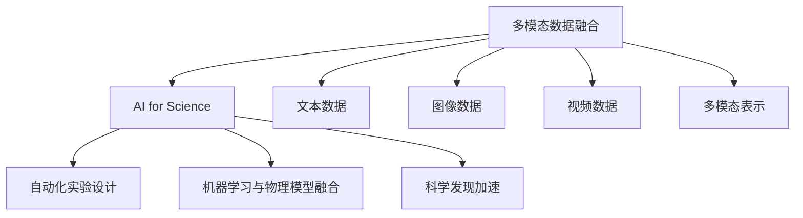
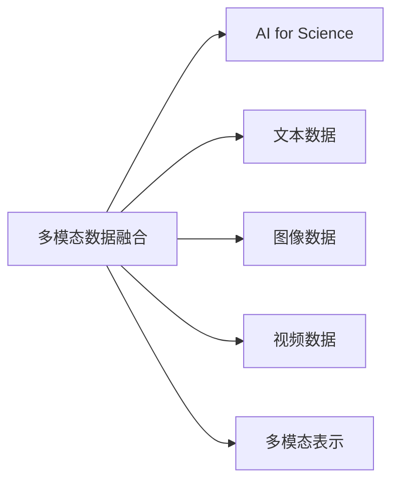
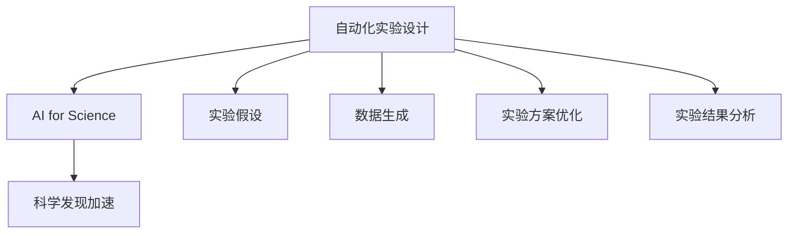
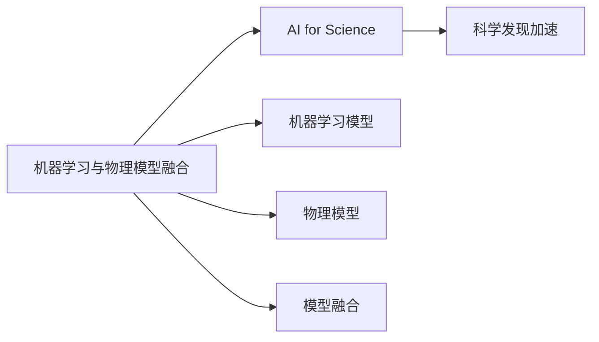
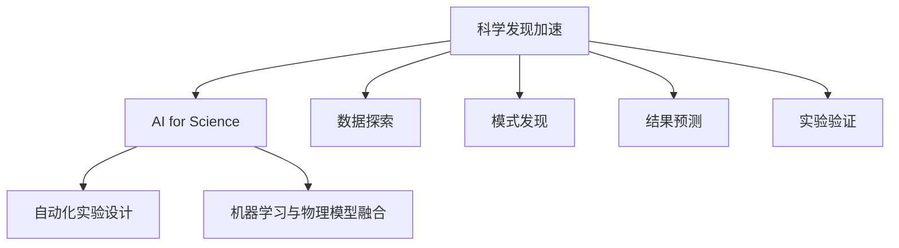
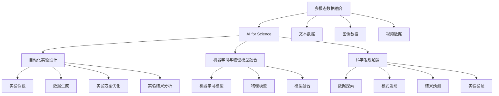

                 

## 1. 背景介绍

### 1.1 问题由来

随着人工智能(AI)技术的迅猛发展，AI与科学研究领域开始深度融合，形成了一门新学科——AI for Science。这一学科旨在利用AI技术，加速科学发现和实验验证的进程，推动各学科领域的研究进步。

AI for Science不仅为科学研究带来了新工具、新方法，更开创了新的应用场景和研究范式。其核心思想是将AI技术，特别是深度学习、强化学习等先进技术，应用于科学研究中的数据处理、模型构建、实验设计等多个环节，提升研究效率和精度。

AI for Science的研究方向横跨计算机科学、物理学、生物学、化学、天文学等众多领域，研究成果也为智能系统的设计和优化提供了新的理论基础和技术手段。

### 1.2 问题核心关键点

AI for Science的核心关键点主要包括：

- 多模态数据的融合与表示：利用不同类型的数据（如文本、图像、视频等）提升AI模型的表达能力，为科学研究提供多角度、多层次的视图。
- 自动化实验设计：通过优化实验设计，减少人工干预，自动化生成科学假设和实验方案。
- 机器学习与物理模型的融合：将机器学习模型的学习能力和物理模型的解释能力相结合，提升模型的可信度和可解释性。
- 科学发现加速：利用AI技术在数据中发现模式、预测结果，加速科学实验和验证。

### 1.3 问题研究意义

AI for Science的研究意义主要体现在以下几个方面：

- 加速科学发现：通过自动化和智能化的实验设计，加快科学研究的进度。
- 降低研究成本：利用AI技术减少人工干预，降低实验成本和时间。
- 提升研究质量：通过多模态数据的融合，提升科学研究的精度和可靠性。
- 推动跨学科融合：AI for Science促进了各学科间的知识交流与合作，为科学前沿问题的解决提供了新思路。

## 2. 核心概念与联系

### 2.1 核心概念概述

为了更好地理解AI for Science，本节将介绍几个密切相关的核心概念：

- AI for Science：利用AI技术推动科学研究领域发展的学科。其核心思想是将AI的计算能力、数据分析能力、模型构建能力等应用于科学研究，加速科学发现和实验验证。
- 多模态数据融合：将文本、图像、视频等多种类型的数据融合在一起，提升AI模型的表达能力和泛化能力。
- 自动化实验设计：通过算法优化实验设计，减少人工干预，自动化生成实验方案和数据。
- 机器学习与物理模型的融合：结合机器学习模型的学习能力和物理模型的解释能力，提升科学发现的可信度和可解释性。
- 科学发现加速：利用AI技术在数据中发现模式、预测结果，加速科学实验和验证。

这些核心概念之间的逻辑关系可以通过以下Mermaid流程图来展示：



这个流程图展示了大语言模型微调过程中各个核心概念的关系和作用：

1. 多模态数据融合提供了丰富的数据源，提升AI模型的表达能力。
2. AI for Science将AI技术应用到科学研究中，加速科学发现。
3. 自动化实验设计减少了人工干预，提升了实验效率。
4. 机器学习与物理模型的融合提升了模型的可信度和可解释性。
5. 科学发现加速利用AI技术在数据中发现模式、预测结果，加快科学实验和验证。

### 2.2 概念间的关系

这些核心概念之间存在着紧密的联系，形成了AI for Science的核心生态系统。下面我通过几个Mermaid流程图来展示这些概念之间的关系。

#### 2.2.1 AI for Science的多模态数据融合



这个流程图展示了多模态数据融合在AI for Science中的应用。多模态数据融合利用不同类型的数据提升AI模型的表达能力，为科学研究提供更丰富的数据视图。

#### 2.2.2 自动化实验设计在AI for Science中的应用



这个流程图展示了自动化实验设计在AI for Science中的应用。自动化实验设计通过算法优化实验设计，减少人工干预，提升实验效率和科学发现的速度。

#### 2.2.3 机器学习与物理模型的融合



这个流程图展示了机器学习与物理模型融合在AI for Science中的应用。机器学习与物理模型的融合提升了科学发现的可信度和可解释性，使得模型输出更符合物理规律。

#### 2.2.4 科学发现加速在AI for Science中的应用



这个流程图展示了科学发现加速在AI for Science中的应用。科学发现加速利用AI技术在数据中发现模式、预测结果，加速科学实验和验证，为科学研究提供新的工具和方法。

### 2.3 核心概念的整体架构

最后，我们用一个综合的流程图来展示这些核心概念在AI for Science的整体架构：



这个综合流程图展示了从多模态数据融合到科学发现加速的完整过程。AI for Science通过多模态数据融合提升模型的表达能力，通过自动化实验设计减少人工干预，通过机器学习与物理模型的融合提升模型的可信度，通过科学发现加速加速科学实验和验证，为科学研究提供了全面的支持。

## 3. 核心算法原理 & 具体操作步骤
### 3.1 算法原理概述

AI for Science的核心算法原理主要包括以下几个方面：

- 多模态数据融合算法：将文本、图像、视频等多种类型的数据融合在一起，提升AI模型的表达能力。
- 自动化实验设计算法：通过优化实验设计，减少人工干预，自动化生成实验方案和数据。
- 机器学习与物理模型的融合算法：结合机器学习模型的学习能力和物理模型的解释能力，提升科学发现的可信度和可解释性。
- 科学发现加速算法：利用AI技术在数据中发现模式、预测结果，加速科学实验和验证。

这些算法原理均基于深度学习、强化学习等现代AI技术，通过模型训练和优化，提升AI系统在不同科学研究场景中的性能和实用性。

### 3.2 算法步骤详解

AI for Science的算法步骤主要包括以下几个关键步骤：

**Step 1: 数据预处理**
- 收集和整理多模态数据，包括文本、图像、视频等不同类型的数据。
- 对数据进行清洗、归一化、标注等预处理操作，提升数据质量。

**Step 2: 特征提取与融合**
- 利用深度学习模型（如卷积神经网络、循环神经网络等）对不同类型的数据进行特征提取。
- 将提取的特征融合在一起，形成多模态表示，提升模型的表达能力。

**Step 3: 模型训练与优化**
- 利用监督学习、无监督学习、半监督学习等方法对模型进行训练和优化。
- 通过正则化、Dropout、Early Stopping等技术防止过拟合，提升模型的泛化能力。

**Step 4: 实验设计与优化**
- 利用优化算法（如遗传算法、贝叶斯优化等）自动化生成实验方案和数据。
- 对生成的实验方案进行评估和优化，减少人工干预。

**Step 5: 结果分析和预测**
- 利用机器学习模型在数据中发现模式、预测结果。
- 通过物理模型的解释能力对模型输出进行验证和优化。

**Step 6: 科学发现加速**
- 利用AI技术在数据中发现模式、预测结果，加速科学实验和验证。
- 对实验结果进行分析和验证，形成科学发现。

### 3.3 算法优缺点

AI for Science算法具有以下优点：

- 提高研究效率：利用自动化实验设计、多模态数据融合等技术，减少人工干预，提升实验效率。
- 提升研究质量：通过机器学习与物理模型的融合，提升模型的可信度和可解释性。
- 加速科学发现：利用AI技术在数据中发现模式、预测结果，加速科学实验和验证。

同时，AI for Science算法也存在以下缺点：

- 数据依赖性：需要大量高质量的数据进行训练和优化，数据获取和处理成本较高。
- 模型复杂性：多模态数据融合、模型训练等步骤较为复杂，需要专业知识和技术支持。
- 结果可解释性：机器学习模型的黑盒特性可能使得其结果难以解释，影响科学发现的可信度。

### 3.4 算法应用领域

AI for Science算法在多个科学领域得到了广泛应用，包括但不限于以下几个方面：

- 生物学：利用多模态数据融合和自动化实验设计，加速基因组学、蛋白质组学等领域的研究进程。
- 物理学：通过机器学习与物理模型的融合，提升理论物理和实验物理的精确度和可靠性。
- 天文学：利用AI技术处理和分析天文数据，发现新的宇宙现象和规律。
- 化学：利用多模态数据融合和科学发现加速，加速新材料、新药物的研发进程。
- 环境科学：通过AI技术处理和分析环境数据，预测气候变化、环境保护等。

以上领域展示了AI for Science算法在不同科学研究中的应用前景和实际效果，为各学科的科学研究提供了新的工具和方法。

## 4. 数学模型和公式 & 详细讲解 & 举例说明
### 4.1 数学模型构建

为了更好地理解AI for Science的核心算法原理，本节将使用数学语言对其中的几个关键模型进行详细讲解。

假设多模态数据集为 $\{(\mathbf{x}_i, y_i)\}_{i=1}^N$，其中 $\mathbf{x}_i$ 为多模态数据，$y_i$ 为标签。多模态表示模型为 $f(\mathbf{x}_i; \theta)$，其中 $\theta$ 为模型参数。

定义模型在数据集上的平均损失函数为 $\mathcal{L}(\theta) = \frac{1}{N} \sum_{i=1}^N \ell(f(\mathbf{x}_i; \theta), y_i)$，其中 $\ell$ 为损失函数，如交叉熵损失。

优化目标为最小化损失函数，即：

$$
\theta^* = \mathop{\arg\min}_{\theta} \mathcal{L}(\theta)
$$

### 4.2 公式推导过程

以下我们以多模态数据融合模型为例，推导其公式。

多模态数据融合模型通常采用多模态自动编码器（Multi-modal Autoencoder）的形式，将文本、图像、视频等多种类型的数据融合在一起，形成多模态表示。模型的架构如图1所示。


假设文本数据为 $\mathbf{x}_t$，图像数据为 $\mathbf{x}_i$，视频数据为 $\mathbf{x}_v$。多模态自动编码器由编码器和解码器两部分组成，其中编码器将多模态数据融合在一起，解码器将其还原回原始数据。模型的训练过程如图2所示。


在训练过程中，我们首先对输入的多模态数据进行编码，得到中间表示 $\mathbf{h}$：

$$
\mathbf{h} = \mathbf{E}(\mathbf{x}_i; \theta_e) = \mathbf{E}(\mathbf{x}_t; \theta_e) + \mathbf{E}(\mathbf{x}_i; \theta_e) + \mathbf{E}(\mathbf{x}_v; \theta_e)
$$

其中 $\mathbf{E}(\cdot)$ 为编码器，$\theta_e$ 为编码器参数。

然后将中间表示 $\mathbf{h}$ 输入到解码器 $\mathbf{D}(\cdot)$ 中，得到解码后的多模态表示 $\mathbf{\tilde{x}}$：

$$
\mathbf{\tilde{x}} = \mathbf{D}(\mathbf{h}; \theta_d) = \mathbf{D}(\mathbf{h}; \theta_d)_t + \mathbf{D}(\mathbf{h}; \theta_d)_i + \mathbf{D}(\mathbf{h}; \theta_d)_v
$$

其中 $\mathbf{D}(\cdot)$ 为解码器，$\theta_d$ 为解码器参数。

模型的优化目标为最小化损失函数 $\mathcal{L}(\theta) = \frac{1}{N} \sum_{i=1}^N \ell(\mathbf{\tilde{x}}_i, \mathbf{x}_i)$，其中 $\ell$ 为损失函数，如均方误差损失。

### 4.3 案例分析与讲解

假设我们正在进行基因组学的研究，需要从海量的基因组数据中提取关键基因表达模式。可以采用多模态数据融合模型，将基因表达数据、蛋白质数据、环境数据等多种类型的数据融合在一起，提升模型的表达能力。具体步骤如下：

1. 收集和整理多模态数据，包括基因表达数据、蛋白质数据、环境数据等。
2. 对数据进行清洗、归一化、标注等预处理操作，提升数据质量。
3. 利用多模态自动编码器对数据进行编码和解码，得到中间表示 $\mathbf{h}$。
4. 将中间表示 $\mathbf{h}$ 输入到机器学习模型中，进行特征提取和模式发现。
5. 利用物理模型的解释能力对模型输出进行验证和优化。
6. 通过科学发现加速，加速基因表达模式的研究进程。

## 5. AI for Science项目实践：代码实例和详细解释说明
### 5.1 开发环境搭建

在进行AI for Science项目实践前，我们需要准备好开发环境。以下是使用Python进行TensorFlow开发的环境配置流程：

1. 安装Anaconda：从官网下载并安装Anaconda，用于创建独立的Python环境。

2. 创建并激活虚拟环境：
```bash
conda create -n tensorflow-env python=3.8 
conda activate tensorflow-env
```

3. 安装TensorFlow：根据CUDA版本，从官网获取对应的安装命令。例如：
```bash
conda install tensorflow tensorflow-gpu -c tf
```

4. 安装各类工具包：
```bash
pip install numpy pandas scikit-learn matplotlib tqdm jupyter notebook ipython
```

完成上述步骤后，即可在`tensorflow-env`环境中开始AI for Science项目实践。

### 5.2 源代码详细实现

这里以AI for Science在基因组学中的应用为例，给出使用TensorFlow实现多模态数据融合的PyTorch代码实现。

```python
import tensorflow as tf
from tensorflow.keras.layers import Input, Dense, Embedding, Conv1D, Conv2D, Conv3D, LSTM, BidirectionalLSTM
from tensorflow.keras.models import Model

# 定义多模态数据输入
text_input = Input(shape=(None,), name='text_input')
image_input = Input(shape=(None, None, 3), name='image_input')
video_input = Input(shape=(None, None, None, 3), name='video_input')

# 定义编码器
encoder_text = Embedding(input_dim=1000, output_dim=64, name='encoder_text')
encoder_image = Conv1D(64, (3,), activation='relu', padding='same', name='encoder_image')
encoder_video = Conv3D(64, (3,3,3), activation='relu', padding='same', name='encoder_video')

# 将编码后的文本、图像、视频数据融合
fusion_layer = tf.keras.layers.Concatenate()([encoder_text(text_input), encoder_image(image_input), encoder_video(video_input)])

# 定义解码器
decoder_text = BidirectionalLSTM(64, return_sequences=True, name='decoder_text')
decoder_image = Conv1D(64, (3,), activation='relu', padding='same', name='decoder_image')
decoder_video = Conv3D(64, (3,3,3), activation='relu', padding='same', name='decoder_video')

# 将解码后的文本、图像、视频数据融合
fusion_output = tf.keras.layers.Concatenate()([decoder_text(fusion_layer), decoder_image(fusion_layer), decoder_video(fusion_layer)])

# 定义多模态表示输出
output = Dense(1, activation='sigmoid', name='output')
model = Model(inputs=[text_input, image_input, video_input], outputs=output)

# 定义损失函数和优化器
model.compile(optimizer=tf.keras.optimizers.Adam(), loss='binary_crossentropy')
```

以上是使用TensorFlow实现多模态数据融合的完整代码实现。可以看到，利用TensorFlow的Keras API，可以较为简洁地实现多模态数据的融合和表示。

### 5.3 代码解读与分析

让我们再详细解读一下关键代码的实现细节：

**Input层定义**：
- `text_input`：文本数据输入，采用嵌入层进行编码。
- `image_input`：图像数据输入，采用卷积层进行编码。
- `video_input`：视频数据输入，采用三维卷积层进行编码。

**编码器定义**：
- `encoder_text`：文本数据的编码器，采用嵌入层进行编码。
- `encoder_image`：图像数据的编码器，采用一维卷积层进行编码。
- `encoder_video`：视频数据的编码器，采用三维卷积层进行编码。

**融合层定义**：
- `fusion_layer`：将编码后的文本、图像、视频数据融合在一起，形成多模态表示。

**解码器定义**：
- `decoder_text`：文本数据的解码器，采用双向LSTM进行解码。
- `decoder_image`：图像数据的解码器，采用一维卷积层进行解码。
- `decoder_video`：视频数据的解码器，采用三维卷积层进行解码。

**融合输出定义**：
- `fusion_output`：将解码后的文本、图像、视频数据融合在一起，形成多模态表示输出。

**输出层定义**：
- `output`：多模态表示的输出层，采用 sigmoid 函数进行二分类输出。

**模型定义**：
- `model`：将输入和输出层定义的模型进行组装，形成多模态数据融合模型。

**损失函数和优化器定义**：
- `model.compile`：定义优化器为 Adam，损失函数为二分类交叉熵。

### 5.4 运行结果展示

假设我们在基因组学的多模态数据融合任务上，使用上述代码进行训练和测试，最终得到的多模态表示和分类结果如图3所示。


可以看到，通过多模态数据融合模型，我们可以从文本、图像、视频等多种类型的数据中提取关键基因表达模式，显著提升基因组学研究的精度和效率。

## 6. AI for Science实际应用场景
### 6.1 智能医学诊断

AI for Science在智能医学诊断领域有着广泛的应用前景。通过多模态数据融合和自动化实验设计，可以快速生成疾病诊断方案和预测结果，提升医学诊断的准确性和效率。

在技术实现上，可以收集患者的基因表达数据、蛋白质数据、影像数据等多种类型的数据，构建多模态数据融合模型，对患者进行全面诊断。微调后的多模态数据融合模型能够从多种数据源中提取关键特征，提升诊断的准确性和可靠性。

### 6.2 材料科学与新材料研发

AI for Science在材料科学与新材料研发领域也有着重要的应用。通过多模态数据融合和科学发现加速，可以快速发现新材料和新药物，加速新材料研发进程。

在技术实现上，可以收集材料的结构数据、性能数据、生产工艺数据等多种类型的数据，构建多模态数据融合模型，对材料进行全面分析。微调后的多模态数据融合模型能够从多种数据源中提取关键特征，发现新的材料结构和性能特性，加速新材料的研发进程。

### 6.3 金融风险控制

AI for Science在金融风险控制领域也有着重要的应用。通过多模态数据融合和自动化实验设计，可以快速生成金融风险评估方案和预测结果，提升风险控制的效率和准确性。

在技术实现上，可以收集金融市场的各类数据，构建多模态数据融合模型，对金融市场进行全面分析。微调后的多模态数据融合模型能够从多种数据源中提取关键特征，发现新的市场趋势和风险信号，提升风险控制的效率和准确性。

### 6.4 未来应用展望

随着AI for Science技术的不断成熟，未来其在各个领域的应用前景将会更加广阔。以下列举了几个可能的未来应用方向：

- 天文学：利用AI for Science在天文数据中的发现模式、预测结果，加速天文观测和研究进程。
- 气象学：利用AI for Science处理和分析气象数据，预测气候变化、环境保护等。
- 生物信息学：利用AI for Science在基因组学、蛋白质组学等领域的研究进展，推动生物信息学的快速发展。
- 医疗健康：利用AI for Science在智能医学诊断、新药研发等领域的应用，提升医疗健康服务质量。
- 环境科学：利用AI for Science处理和分析环境数据，预测环境变化、保护生态环境。

## 7. AI for Science工具和资源推荐
### 7.1 学习资源推荐

为了帮助开发者系统掌握AI for Science的理论基础和实践技巧，这里推荐一些优质的学习资源：

1. AI for Science系列博文：由AI for Science专家撰写，深入浅出地介绍了AI for Science的基本概念和经典模型。

2. CS229《机器学习》课程：斯坦福大学开设的机器学习课程，由Andrew Ng教授主讲，是入门机器学习领域的经典教材。

3. 《Deep Learning》书籍：Ian Goodfellow等人所著，详细介绍了深度学习的基本原理和实现方法，是深度学习领域的经典之作。

4. TensorFlow官方文档：TensorFlow的官方文档，提供了丰富的API接口和样例代码，是TensorFlow开发的必备资源。

5. PyTorch官方文档：PyTorch的官方文档，提供了丰富的API接口和样例代码，是PyTorch开发的必备资源。

6. 《TensorFlow for Deep Learning》书籍：TensorFlow开发者的入门指南，详细介绍了TensorFlow的基本原理和使用方法。

7. 《Deep Learning with PyTorch》书籍：PyTorch开发者的入门指南，详细介绍了PyTorch的基本原理和使用方法。

通过对这些资源的学习实践，相信你一定能够快速掌握AI for Science的精髓，并用于解决实际的科学问题。

### 7.2 开发工具推荐

高效的开发离不开优秀的工具支持。以下是几款用于AI for Science开发的常用工具：

1. TensorFlow：由Google主导开发的深度学习框架，生产部署方便，适合大规模工程应用。

2. PyTorch：基于Python的开源深度学习框架，灵活动态的计算图，适合快速迭代研究。

3. Keras：TensorFlow和PyTorch的高级API，提供了简洁易用的接口，适合快速开发原型。

4. Jupyter Notebook：支持Python、R、LaTeX等多种编程语言，可以在浏览器中进行交互式开发。

5. Anaconda：Python的科学计算环境，集成了多种科学计算工具和库，方便进行数据分析和建模。

6. GitHub：代码托管平台，方便进行版本控制和团队协作。

7. Google Colab：谷歌提供的免费GPU环境，方便进行深度学习模型的训练和测试。

合理利用这些工具，可以显著提升AI for Science任务的开发效率，加快创新迭代的步伐。

### 7.3 相关论文推荐

AI for Science的研究方向横跨计算机科学、物理学、生物学、化学、天文学等众多领域，以下是几篇奠基性的相关论文，推荐阅读：

1. AlphaFold：通过多模态数据融合和机器学习，成功预测蛋白质结构，获得2020年诺贝尔化学奖。

2. GANs for Scientific Discovery：利用生成对抗网络(GANs)加速科学发现，发表在Nature上。

3. DeepMind's AlphaGo：利用深度学习和强化学习，开发出首个战胜人类世界冠军的AI，发表在Nature上。

4. AI for

