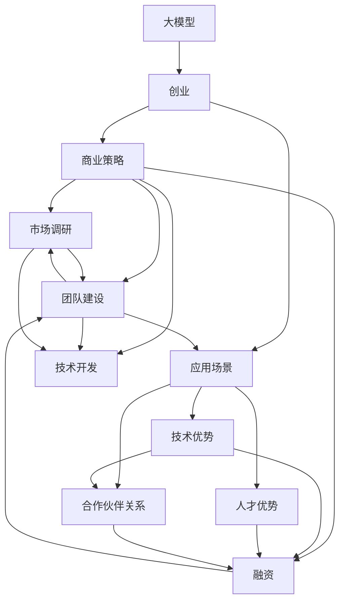
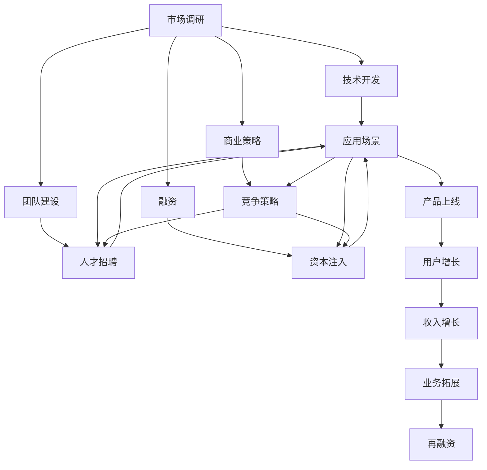
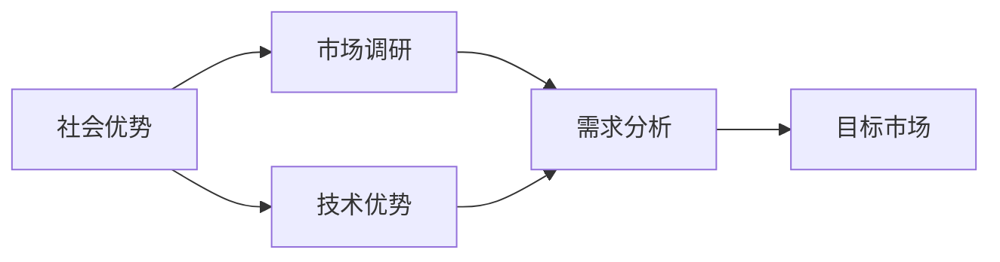
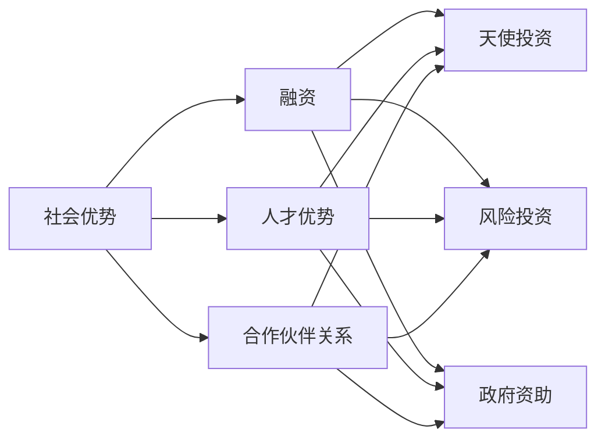

                 

# AI 大模型创业：如何利用社会优势？

> 关键词：大模型,创业,社会优势,商业策略,应用场景

## 1. 背景介绍

### 1.1 问题由来
近年来，人工智能(AI)技术取得了飞速发展，尤其是在深度学习、自然语言处理(NLP)和计算机视觉等领域，大模型以其庞大的参数规模、卓越的性能和广泛的应用前景，成为AI创业的热门选择。许多初创公司和个人开发者利用大模型进行NLP和计算机视觉等任务，开启了AI创业之旅。然而，从实验室到市场的转化并非易事，大模型创业面临诸多挑战。其中，如何利用社会优势，提升模型的应用价值，是创业成功的关键。

### 1.2 问题核心关键点
大模型创业的核心在于如何将模型优势转化为商业价值。具体来说，就是要通过算法创新、业务拓展、市场推广和团队建设等手段，将模型技术转化为可用的产品和服务，满足市场需求，实现商业变现。这需要创业者深刻理解模型的特点，明确应用场景，并结合社会资源进行精细化运营。

### 1.3 问题研究意义
研究如何利用社会优势进行大模型创业，对于推动AI技术在各行业的落地应用，培育新兴产业，以及促进经济社会数字化转型具有重要意义：

1. **推动技术普及**：大模型的应用可以大幅提升相关行业的智能化水平，降低人力成本，加速技术普及。
2. **促进产业升级**：AI技术的应用能够为传统行业注入新的发展动力，推动产业升级和结构调整。
3. **实现创新突破**：社会优势的合理利用可以加速技术创新，推动新产品、新服务和新业态的涌现。
4. **优化社会资源配置**：通过社会资源的协同合作，可以实现资源的最优配置，提升社会整体效益。

## 2. 核心概念与联系

### 2.1 核心概念概述

为更好地理解大模型创业，本节将介绍几个密切相关的核心概念：

- **大模型(Large Model)**：指参数规模超过千万级的深度学习模型，如BERT、GPT系列、ViT等，这些模型在特定任务上表现出卓越的性能。

- **创业(Creating Business)**：指从零开始创立和发展AI企业的过程，包括市场调研、技术开发、团队建设、融资等环节。

- **商业策略(Commercial Strategy)**：指制定和实施商业计划，以实现企业目标的过程。包括市场定位、竞争策略、营销策略等。

- **应用场景(Application Scenarios)**：指模型在大规模真实数据上展现出的特定功能或能力。

- **社会优势(Social Advantages)**：指企业可以利用的社会资源和优势，如技术优势、人才优势、合作伙伴关系等。

这些核心概念之间的联系可以通过以下Mermaid流程图来展示：



这个流程图展示了大模型创业的基本流程和关键要素，以及社会优势在其中所扮演的角色。

### 2.2 概念间的关系

这些核心概念之间存在着紧密的联系，构成了大模型创业的完整生态系统。下面我们通过几个Mermaid流程图来展示这些概念之间的关系。

#### 2.2.1 大模型创业的流程



这个流程图展示了大模型创业的基本流程，从市场调研开始，逐步经过技术开发、团队建设、融资等环节，最终实现产品上线、用户增长和业务拓展。

#### 2.2.2 社会优势与市场调研



这个流程图展示了如何利用社会优势进行市场调研，通过技术优势和需求分析，找到合适的目标市场，从而制定有效的市场策略。

#### 2.2.3 社会优势与融资



这个流程图展示了如何利用社会优势进行融资，通过人才优势和合作伙伴关系，获取天使投资、风险投资和政府资助等资本支持。

## 3. 核心算法原理 & 具体操作步骤
### 3.1 算法原理概述

大模型创业的核心在于如何通过商业策略，将模型优势转化为商业价值。以下是核心算法原理的概述：

1. **市场定位**：根据目标市场和用户需求，选择合适的应用场景和商业模式。
2. **竞争分析**：分析竞争对手的优势和劣势，制定差异化竞争策略。
3. **用户需求分析**：深入理解目标用户的需求和痛点，设计符合用户期望的产品功能。
4. **产品设计**：基于用户需求和技术优势，设计具有竞争力的产品和服务。
5. **市场推广**：通过多种营销手段，将产品推向市场，获取用户反馈。
6. **业务拓展**：根据市场反馈和用户需求，不断优化产品和服务，拓展新业务领域。

### 3.2 算法步骤详解

以下是大模型创业的具体操作步骤：

**Step 1: 市场调研**
- 分析目标市场和用户需求，确定潜在的业务机会。
- 收集行业报告、市场数据、用户反馈等信息，进行需求分析。
- 识别目标用户群体，了解他们的痛点、期望和行为模式。

**Step 2: 技术开发**
- 选择合适的大模型，进行微调或定制开发，以适应特定应用场景。
- 设计算法模型，开发API接口，实现产品功能的自动化和智能化。
- 进行测试验证，优化模型性能和用户体验。

**Step 3: 商业策略**
- 制定市场定位策略，明确产品差异化优势。
- 制定竞争策略，分析竞争对手的优劣势，确定自身竞争策略。
- 设计营销策略，制定推广计划和用户获取策略。

**Step 4: 团队建设**
- 招募高素质的技术人才和业务人才，构建高效的团队。
- 建立合理的激励机制，保持团队高效协作和创新动力。
- 进行团队文化建设，打造有凝聚力的企业文化。

**Step 5: 融资**
- 准备商业计划书，向投资者展示商业模式和市场前景。
- 选择融资渠道，获取天使投资、风险投资或政府资助等资本支持。
- 优化财务结构，确保企业可持续发展。

**Step 6: 市场推广**
- 制定推广计划，选择合适的推广渠道，如社交媒体、广告、线下活动等。
- 进行用户教育和产品演示，提高用户对产品的认知和接受度。
- 收集用户反馈，持续改进产品和服务。

**Step 7: 业务拓展**
- 根据市场反馈和用户需求，调整产品策略和业务模式。
- 拓展新业务领域，实现多元化发展。
- 获取更多资本支持，保持企业持续增长。

### 3.3 算法优缺点

大模型创业的算法原理和操作步骤具有以下优缺点：

**优点**：
1. **技术优势**：大模型具备强大的数据处理和预测能力，能够在多个应用场景中提供高效、可靠的服务。
2. **快速迭代**：通过持续的模型微调和产品优化，能够快速响应市场需求，提升用户满意度。
3. **社会资源丰富**：利用社会优势，如人才、资本、合作伙伴关系等，能够降低创业成本，加速发展。

**缺点**：
1. **数据依赖**：大模型的性能高度依赖于数据的质量和多样性，数据获取和标注成本较高。
2. **资源消耗大**：大模型的计算资源和存储资源需求较高，对硬件配置要求较高。
3. **竞争激烈**：市场竞争激烈，需要不断创新，保持竞争力。

### 3.4 算法应用领域

大模型创业在多个领域得到了广泛应用，例如：

- **自然语言处理(NLP)**：大模型可以用于文本分类、情感分析、机器翻译、问答系统等任务。
- **计算机视觉(CV)**：大模型可以用于图像识别、目标检测、视频分析等任务。
- **医疗健康**：大模型可以用于疾病预测、智能问诊、健康数据分析等任务。
- **金融服务**：大模型可以用于风险评估、信用评分、智能投顾等任务。
- **智能制造**：大模型可以用于质量检测、工艺优化、故障诊断等任务。
- **智能交通**：大模型可以用于自动驾驶、交通流量分析、智能调度等任务。

## 4. 数学模型和公式 & 详细讲解 & 举例说明

### 4.1 数学模型构建

本节将使用数学语言对大模型创业的商业策略进行更加严格的刻画。

记大模型为 $M_{\theta}$，其中 $\theta$ 为模型参数。假设目标市场为 $M$，目标用户群体为 $U$，商业模式为 $B$。则大模型创业的目标是最大化企业价值 $V$，具体数学模型为：

$$
V = \max_{\theta, M, U, B} \left\{ \mathbb{E} \left[ \text{Revenue}(M, U, B) \right] - \mathbb{E} \left[ \text{Cost}(\theta, M, U, B) \right] \right\}
$$

其中，$\text{Revenue}(M, U, B)$ 表示企业的收入，$\text{Cost}(\theta, M, U, B)$ 表示企业的成本，包括技术研发成本、市场推广成本、运营维护成本等。

### 4.2 公式推导过程

以下我们以二分类问题为例，推导大模型创业的收入和成本模型：

假设目标市场 $M$ 中，用户群体 $U$ 占比为 $p$，用户群体 $U$ 购买大模型的平均价格为 $P$。则大模型创业的预期收入 $R$ 可以表示为：

$$
R = p \times P \times \text{User Growth Rate}
$$

其中 $\text{User Growth Rate}$ 表示用户数量的增长率，可以通过市场调研和用户反馈估算。

假设技术研发成本为 $C_{\text{研发}}$，市场推广成本为 $C_{\text{推广}}$，运营维护成本为 $C_{\text{运营}}$。则大模型创业的总成本 $C$ 可以表示为：

$$
C = C_{\text{研发}} + C_{\text{推广}} + C_{\text{运营}}
$$

其中 $C_{\text{研发}}$ 可以进一步分解为模型微调成本、算法开发成本、数据标注成本等。

因此，大模型创业的目标可以表示为：

$$
V = p \times P \times \text{User Growth Rate} - C_{\text{研发}} - C_{\text{推广}} - C_{\text{运营}}
$$

通过优化上述模型，可以找到最优的大模型创业策略。

### 4.3 案例分析与讲解

假设我们有一家初创公司，目标市场为B2B医疗领域，目标用户群体为医院和医疗机构。该公司计划使用BERT模型进行疾病预测任务，通过API接口提供给医院使用。其商业策略如下：

**市场调研**：
- 收集医院和医疗机构的需求数据，确定目标用户群体。
- 分析行业报告，了解市场规模和增长趋势。

**技术开发**：
- 选择BERT模型，进行微调以适应疾病预测任务。
- 开发API接口，实现模型部署和调用。

**商业策略**：
- 定位为专业化的疾病预测解决方案，提供高精度、高可靠性的服务。
- 采取差异化竞争策略，区分于传统人工诊断方式。

**团队建设**：
- 招募医疗领域的技术和业务人才，组建专业团队。
- 建立激励机制，保持团队创新动力。

**融资**：
- 准备商业计划书，向医疗领域的天使投资人和风投机构进行融资。

**市场推广**：
- 通过医疗展会、线上宣传等方式进行市场推广。
- 与医院合作，进行产品演示和用户教育。

**业务拓展**：
- 根据医院反馈，调整产品策略，推出新的预测功能。
- 拓展其他医疗领域的应用，如智能问诊、健康数据分析等。

## 5. 项目实践：代码实例和详细解释说明
### 5.1 开发环境搭建

在进行大模型创业实践前，我们需要准备好开发环境。以下是使用Python进行PyTorch开发的环境配置流程：

1. 安装Anaconda：从官网下载并安装Anaconda，用于创建独立的Python环境。

2. 创建并激活虚拟环境：
```bash
conda create -n pytorch-env python=3.8 
conda activate pytorch-env
```

3. 安装PyTorch：根据CUDA版本，从官网获取对应的安装命令。例如：
```bash
conda install pytorch torchvision torchaudio cudatoolkit=11.1 -c pytorch -c conda-forge
```

4. 安装Transformers库：
```bash
pip install transformers
```

5. 安装各类工具包：
```bash
pip install numpy pandas scikit-learn matplotlib tqdm jupyter notebook ipython
```

完成上述步骤后，即可在`pytorch-env`环境中开始大模型创业的实践。

### 5.2 源代码详细实现

下面我们以疾病预测任务为例，给出使用Transformers库对BERT模型进行创业实践的PyTorch代码实现。

首先，定义疾病预测任务的数据处理函数：

```python
from transformers import BertTokenizer
from torch.utils.data import Dataset
import torch

class DiseaseDataset(Dataset):
    def __init__(self, texts, labels, tokenizer, max_len=128):
        self.texts = texts
        self.labels = labels
        self.tokenizer = tokenizer
        self.max_len = max_len
        
    def __len__(self):
        return len(self.texts)
    
    def __getitem__(self, item):
        text = self.texts[item]
        label = self.labels[item]
        
        encoding = self.tokenizer(text, return_tensors='pt', max_length=self.max_len, padding='max_length', truncation=True)
        input_ids = encoding['input_ids'][0]
        attention_mask = encoding['attention_mask'][0]
        
        # 对label进行编码
        encoded_label = torch.tensor(label, dtype=torch.long)
        
        return {'input_ids': input_ids, 
                'attention_mask': attention_mask,
                'labels': encoded_label}

# 标签与id的映射
label2id = {'健康': 0, '疾病': 1}
id2label = {v: k for k, v in label2id.items()}

# 创建dataset
tokenizer = BertTokenizer.from_pretrained('bert-base-cased')

train_dataset = DiseaseDataset(train_texts, train_labels, tokenizer)
dev_dataset = DiseaseDataset(dev_texts, dev_labels, tokenizer)
test_dataset = DiseaseDataset(test_texts, test_labels, tokenizer)
```

然后，定义模型和优化器：

```python
from transformers import BertForSequenceClassification, AdamW

model = BertForSequenceClassification.from_pretrained('bert-base-cased', num_labels=2)

optimizer = AdamW(model.parameters(), lr=2e-5)
```

接着，定义训练和评估函数：

```python
from torch.utils.data import DataLoader
from tqdm import tqdm
from sklearn.metrics import classification_report

device = torch.device('cuda') if torch.cuda.is_available() else torch.device('cpu')
model.to(device)

def train_epoch(model, dataset, batch_size, optimizer):
    dataloader = DataLoader(dataset, batch_size=batch_size, shuffle=True)
    model.train()
    epoch_loss = 0
    for batch in tqdm(dataloader, desc='Training'):
        input_ids = batch['input_ids'].to(device)
        attention_mask = batch['attention_mask'].to(device)
        labels = batch['labels'].to(device)
        model.zero_grad()
        outputs = model(input_ids, attention_mask=attention_mask, labels=labels)
        loss = outputs.loss
        epoch_loss += loss.item()
        loss.backward()
        optimizer.step()
    return epoch_loss / len(dataloader)

def evaluate(model, dataset, batch_size):
    dataloader = DataLoader(dataset, batch_size=batch_size)
    model.eval()
    preds, labels = [], []
    with torch.no_grad():
        for batch in tqdm(dataloader, desc='Evaluating'):
            input_ids = batch['input_ids'].to(device)
            attention_mask = batch['attention_mask'].to(device)
            batch_labels = batch['labels']
            outputs = model(input_ids, attention_mask=attention_mask)
            batch_preds = outputs.logits.argmax(dim=2).to('cpu').tolist()
            batch_labels = batch_labels.to('cpu').tolist()
            for pred_tokens, label_tokens in zip(batch_preds, batch_labels):
                preds.append(pred_tokens[:len(label_tokens)])
                labels.append(label_tokens)
                
    print(classification_report(labels, preds))
```

最后，启动训练流程并在测试集上评估：

```python
epochs = 5
batch_size = 16

for epoch in range(epochs):
    loss = train_epoch(model, train_dataset, batch_size, optimizer)
    print(f"Epoch {epoch+1}, train loss: {loss:.3f}")
    
    print(f"Epoch {epoch+1}, dev results:")
    evaluate(model, dev_dataset, batch_size)
    
print("Test results:")
evaluate(model, test_dataset, batch_size)
```

以上就是使用PyTorch对BERT进行疾病预测任务创业实践的完整代码实现。可以看到，得益于Transformers库的强大封装，我们可以用相对简洁的代码完成BERT模型的加载和创业实践。

### 5.3 代码解读与分析

让我们再详细解读一下关键代码的实现细节：

**DiseaseDataset类**：
- `__init__`方法：初始化文本、标签、分词器等关键组件。
- `__len__`方法：返回数据集的样本数量。
- `__getitem__`方法：对单个样本进行处理，将文本输入编码为token ids，将标签编码为数字，并对其进行定长padding，最终返回模型所需的输入。

**label2id和id2label字典**：
- 定义了标签与数字id之间的映射关系，用于将标签进行编码。

**训练和评估函数**：
- 使用PyTorch的DataLoader对数据集进行批次化加载，供模型训练和推理使用。
- 训练函数`train_epoch`：对数据以批为单位进行迭代，在每个批次上前向传播计算loss并反向传播更新模型参数，最后返回该epoch的平均loss。
- 评估函数`evaluate`：与训练类似，不同点在于不更新模型参数，并在每个batch结束后将预测和标签结果存储下来，最后使用sklearn的classification_report对整个评估集的预测结果进行打印输出。

**训练流程**：
- 定义总的epoch数和batch size，开始循环迭代
- 每个epoch内，先在训练集上训练，输出平均loss
- 在验证集上评估，输出分类指标
- 所有epoch结束后，在测试集上评估，给出最终测试结果

可以看到，PyTorch配合Transformers库使得BERT创业的代码实现变得简洁高效。开发者可以将更多精力放在数据处理、模型改进等高层逻辑上，而不必过多关注底层的实现细节。

当然，工业级的系统实现还需考虑更多因素，如模型的保存和部署、超参数的自动搜索、更灵活的任务适配层等。但核心的创业流程基本与此类似。

## 6. 实际应用场景
### 6.1 智能医疗系统

基于大模型创业的智能医疗系统，可以为医院和医疗机构提供高效的疾病预测和诊断服务，提升医疗服务的智能化水平。

在技术实现上，可以收集医院和医疗机构的历史病例数据，将病人的症状描述、影像数据等作为输入，训练大模型进行疾病预测。微调后的模型能够自动理解症状和影像信息，预测病人的健康状况。对于新病例，模型还可以根据病人的实时症状，给出疾病预测结果，辅助医生进行诊断和治疗。

### 6.2 智能客服系统

智能客服系统是大模型创业的另一热门应用场景。传统客服往往需要配备大量人力，高峰期响应缓慢，且一致性和专业性难以保证。通过大模型创业，可以7x24小时不间断服务，快速响应客户咨询，用自然流畅的语言解答各类常见问题。

在技术实现上，可以收集企业内部的历史客服对话记录，将问题和最佳答复构建成监督数据，在此基础上对预训练对话模型进行微调。微调后的对话模型能够自动理解用户意图，匹配最合适的答案模板进行回复。对于客户提出的新问题，还可以接入检索系统实时搜索相关内容，动态组织生成回答。如此构建的智能客服系统，能大幅提升客户咨询体验和问题解决效率。

### 6.3 金融风控平台

金融风控平台是大模型创业的重要应用场景。通过大模型进行用户行为分析和风险评估，可以显著提升金融机构的风险控制能力。

在技术实现上，可以收集金融领域相关用户的交易数据、行为数据和舆情数据，训练大模型进行用户行为分析和风险评估。微调后的模型能够自动理解用户的交易行为和风险偏好，预测用户的违约概率，辅助金融机构进行贷款审批、信用评分等工作。

### 6.4 未来应用展望

随着大模型创业技术的不断发展，其在更多领域的应用前景将逐步显现：

1. **智慧城市治理**：利用大模型进行城市事件监测、舆情分析、应急指挥等环节，提高城市管理的自动化和智能化水平，构建更安全、高效的未来城市。
2. **智能教育**：大模型可以用于作业批改、学情分析、知识推荐等方面，因材施教，促进教育公平，提高教学质量。
3. **智能制造**：大模型可以用于质量检测、工艺优化、故障诊断等任务，提升制造业的智能化水平。
4. **智慧零售**：利用大模型进行用户行为分析、产品推荐、库存管理等工作，提升零售企业的运营效率和客户满意度。

此外，在医疗、金融、制造、零售等多个行业，基于大模型创业的人工智能应用也将不断涌现，为经济社会发展注入新的动力。相信随着技术的日益成熟，大模型创业必将在构建人机协同的智能时代中扮演越来越重要的角色。

## 7. 工具和资源推荐
### 7.1 学习资源推荐

为了帮助创业者系统掌握大模型创业的理论基础和实践技巧，这里推荐一些优质的学习资源：

1. **《Transformer from Scratch》**：博客系列，由大模型技术专家撰写，深入浅出地介绍了Transformer原理、BERT模型、微调技术等前沿话题。

2. **《Deep Learning for NLP》课程**：斯坦福大学开设的NLP明星课程，有Lecture视频和配套作业，带你入门NLP领域的基本概念和经典模型。

3. **《Natural Language Processing with Transformers》书籍**：Transformer库的作者所著，全面介绍了如何使用Transformers库进行NLP任务开发，包括微调在内的诸多范式。

4. **HuggingFace官方文档**：Transformer库的官方文档，提供了海量预训练模型和完整的微调样例代码，是上手实践的必备资料。

5. **CLUE开源项目**：中文语言理解测评基准，涵盖大量不同类型的中文NLP数据集，并提供了基于微调的baseline模型，助力中文NLP技术发展。

通过对这些资源的学习实践，相信创业者一定能够快速掌握大模型创业的精髓，并用于解决实际的NLP问题。

### 7.2 开发工具推荐

高效的开发离不开优秀的工具支持。以下是几款用于大模型创业开发的常用工具：

1. **PyTorch**：基于Python的开源深度学习框架，灵活动态的计算图，适合快速迭代研究。大部分预训练语言模型都有PyTorch版本的实现。

2. **TensorFlow**：由Google主导开发的开源深度学习框架，生产部署方便，适合大规模工程应用。同样有丰富的预训练语言模型资源。

3. **Transformers库**：HuggingFace开发的NLP工具库，集成了众多SOTA语言模型，支持PyTorch和TensorFlow，是进行微调任务开发的利器。

4. **Weights & Biases**：模型训练的实验跟踪工具，可以记录和可视化模型训练过程中的各项指标，方便对比和调优。与主流深度学习框架无缝集成。

5. **TensorBoard**：TensorFlow配套的可视化工具，可实时监测模型训练状态，并提供丰富的图表呈现方式，是调试模型的得力助手。

6. **Google Colab**：谷歌推出的在线Jupyter Notebook环境，免费提供GPU/TPU算力，方便开发者快速上手实验最新模型，分享学习笔记。

合理利用这些工具，可以显著提升大模型创业的开发效率，加快创新迭代的步伐。

### 7.3 相关论文推荐

大模型创业的背后是AI技术的

