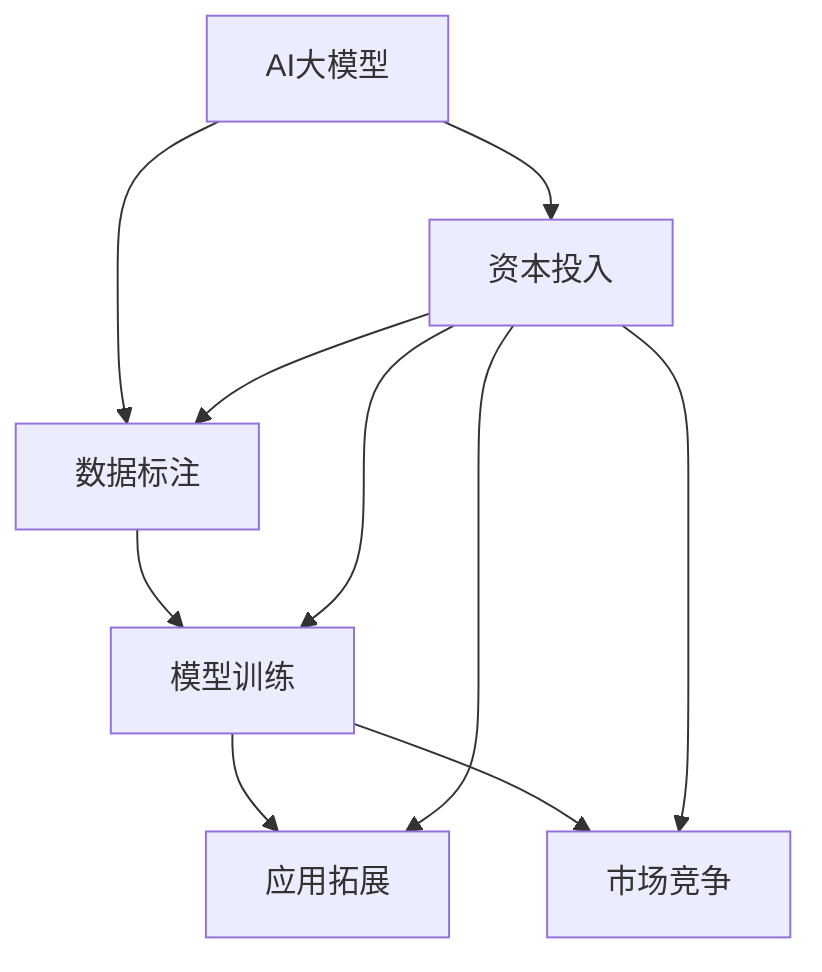

                 

# AI 大模型创业：如何利用资本优势？

在当今的科技创新浪潮中，人工智能（AI）大模型以其卓越的性能和广泛的应用前景吸引了大量投资者的目光。如何利用资本优势，让大模型创业公司更好地发展，是每一个创业者和投资者都值得深思的问题。本文将从背景介绍、核心概念与联系、核心算法原理及具体操作步骤、数学模型和公式讲解、项目实践、实际应用场景、工具和资源推荐、总结与展望、常见问题解答等方面，深入探讨AI大模型创业过程中如何充分利用资本优势。

## 1. 背景介绍

### 1.1 问题由来

近年来，随着深度学习技术的快速发展，AI大模型在自然语言处理、计算机视觉、推荐系统等领域取得了显著的突破。大模型如GPT、BERT、ViT等，凭借其庞大的参数量和丰富的知识库，展现了强大的通用性和适应性。这些大模型在多种任务上表现优异，例如生成文本、图像识别、对话系统等，为各行各业提供了强大的技术支撑。

然而，大模型的开发和训练需要大量资金投入，包括计算资源、标注数据和人力成本。这使得大模型创业公司面临巨大的资金压力。如何有效利用资本优势，提升大模型创业公司的竞争力，成为亟待解决的问题。

### 1.2 问题核心关键点

利用资本优势进行AI大模型创业，需要关注以下几个核心关键点：

1. **数据获取与标注**：大模型需要大量的高质量数据进行训练，如何高效获取并标注这些数据，是资本利用的一个重点。
2. **模型训练与优化**：训练一个高效的大模型需要先进的技术和算法支持，如何优化模型结构，提高训练效率，是资本投入的关键。
3. **应用场景拓展**：如何将大模型应用到具体的业务场景中，提升用户体验，是资本投入的重要方向。
4. **市场竞争策略**：如何在激烈的市场竞争中脱颖而出，占据有利位置，是资本利用的一个核心问题。
5. **人才培养与团队建设**：吸引和留住顶尖人才，是构建高效创业团队的关键。

### 1.3 问题研究意义

利用资本优势进行AI大模型创业，不仅能够加速技术创新，还能带来显著的经济效益。通过合理利用资本，可以在以下几个方面提升大模型创业公司的竞争力：

1. **降低成本**：高效利用资本进行数据获取和标注，降低模型训练成本。
2. **提升性能**：通过先进的算法和优化技术，提升大模型的性能。
3. **拓展应用**：通过资本支持，拓展大模型在更多行业的应用场景，提升市场影响力。
4. **保持领先**：通过持续的资本投入，保持技术领先优势，占据市场主导地位。
5. **推动产业化**：利用资本加速大模型技术的产业化进程，促进经济社会发展。

## 2. 核心概念与联系

### 2.1 核心概念概述

在进行AI大模型创业时，涉及多个核心概念，包括：

- **AI大模型**：基于深度学习技术训练的大型模型，如GPT、BERT等，具备强大的通用性和适应性。
- **数据标注**：对无标签数据进行人工标注，生成有监督数据的过程。
- **模型训练**：利用标注数据训练大模型，提升其性能的过程。
- **应用拓展**：将大模型应用到具体业务场景中，提升用户体验的过程。
- **市场竞争**：在大模型市场中占据有利位置的策略。
- **资本投入**：通过资本投入，提升大模型创业公司的竞争力。

这些核心概念相互关联，共同构成了AI大模型创业的完整生态系统。

### 2.2 概念间的关系

这些核心概念之间存在着紧密的联系，可以通过以下Mermaid流程图来展示：



这个流程图展示了AI大模型创业中各关键环节的相互关系：

1. **数据标注**：为大模型提供训练数据。
2. **模型训练**：训练并优化大模型。
3. **应用拓展**：将大模型应用到具体场景中，提升用户体验。
4. **市场竞争**：在市场中占据有利位置，保持竞争优势。
5. **资本投入**：通过资本投入支持上述环节，提升整体竞争力。

理解这些概念之间的关系，可以帮助创业者和投资者更好地制定发展策略。

## 3. 核心算法原理 & 具体操作步骤

### 3.1 算法原理概述

AI大模型创业的核心算法原理包括以下几个方面：

1. **自监督预训练**：利用无标签数据进行预训练，学习通用的语言表示。
2. **有监督微调**：在特定任务上，利用少量标注数据进行微调，提升模型性能。
3. **迁移学习**：利用预训练模型在大模型创业中的迁移学习能力，减少从头训练的时间和成本。
4. **参数高效微调**：只调整少量参数，保持大部分预训练权重不变，提升微调效率。
5. **少样本学习**：通过提示学习和模型泛化能力，在少数样本上也能取得良好的效果。

这些算法原理为大模型创业提供了技术基础，需要创业者深入理解和掌握。

### 3.2 算法步骤详解

1. **数据获取与标注**：
   - 选择合适的数据集，获取高质量标注数据。
   - 采用自动化工具减少标注成本。

2. **模型训练**：
   - 选择适合的模型架构，如GPT、BERT等。
   - 设计合适的损失函数和优化器，如AdamW、SGD等。
   - 进行自监督预训练，提升模型通用性。

3. **模型微调**：
   - 在特定任务上，利用少量标注数据进行微调。
   - 选择合适的学习率，避免过拟合。
   - 使用正则化技术，提高模型泛化能力。

4. **应用拓展**：
   - 将大模型应用到具体业务场景中，提升用户体验。
   - 进行A/B测试，评估模型效果。

5. **市场竞争**：
   - 进行市场调研，了解竞争对手情况。
   - 制定差异化策略，提升市场竞争力。

6. **资本投入**：
   - 合理规划资本投入，支持上述各个环节。
   - 利用资本进行市场营销，提升品牌影响力。

### 3.3 算法优缺点

利用资本进行AI大模型创业，具有以下优点：

1. **效率提升**：通过高效利用资本，加速大模型开发和训练，提升模型性能。
2. **成本降低**：优化数据获取和标注流程，降低模型训练成本。
3. **市场拓展**：通过资本投入，拓展大模型应用场景，提升市场竞争力。

同时，也存在以下缺点：

1. **资金压力**：大模型开发和训练需要大量资金投入，资金不足可能影响公司发展。
2. **管理复杂**：资金管理和使用需要谨慎，不当使用可能导致资金浪费。
3. **技术挑战**：大模型开发和训练技术复杂，需要高水平的技术团队支持。

### 3.4 算法应用领域

利用资本优势进行AI大模型创业，适用于多个领域，例如：

1. **自然语言处理**：如文本生成、文本分类、机器翻译等。
2. **计算机视觉**：如图像识别、目标检测、图像生成等。
3. **推荐系统**：如商品推荐、新闻推荐、视频推荐等。
4. **智能交互**：如聊天机器人、语音助手等。
5. **医疗健康**：如疾病诊断、智能问诊等。
6. **金融科技**：如风险评估、交易预测等。

## 4. 数学模型和公式 & 详细讲解 & 举例说明

### 4.1 数学模型构建

在大模型创业中，常用的数学模型包括：

1. **自监督预训练模型**：利用无标签数据进行预训练，学习通用的语言表示。
2. **有监督微调模型**：在特定任务上，利用少量标注数据进行微调，提升模型性能。

### 4.2 公式推导过程

1. **自监督预训练**：
   - 损失函数：$$L_{pre} = -\sum_{i=1}^n y_i \log p(y_i)$$
   - 其中，$y_i$ 为标签，$p(y_i)$ 为模型预测概率。

2. **有监督微调**：
   - 损失函数：$$L_{fin} = -\sum_{i=1}^n y_i \log p(y_i)$$
   - 其中，$y_i$ 为标签，$p(y_i)$ 为模型预测概率。

### 4.3 案例分析与讲解

以文本分类为例，利用BERT进行有监督微调，步骤如下：

1. **数据准备**：获取标注数据集，划分为训练集、验证集和测试集。
2. **模型初始化**：使用BERT作为预训练模型，初始化微调模型。
3. **微调过程**：
   - 设置学习率、优化器等参数。
   - 在前向传播中，输入数据，计算损失函数。
   - 在反向传播中，更新模型参数。
   - 在验证集上评估模型性能，进行超参数调整。

## 5. 项目实践：代码实例和详细解释说明

### 5.1 开发环境搭建

1. **安装Python**：安装Python 3.8版本。
2. **安装PyTorch**：通过conda或pip安装PyTorch。
3. **安装Transformer**：通过conda或pip安装Transformer库。
4. **安装其他依赖**：安装numpy、pandas、scikit-learn等库。

### 5.2 源代码详细实现

以BERT进行文本分类为例，实现步骤如下：

```python
import torch
import torch.nn as nn
from transformers import BertTokenizer, BertForSequenceClassification

# 加载预训练模型和分词器
tokenizer = BertTokenizer.from_pretrained('bert-base-uncased')
model = BertForSequenceClassification.from_pretrained('bert-base-uncased', num_labels=2)

# 准备训练数据
train_data = ...
val_data = ...
test_data = ...

# 定义训练函数
def train(model, device, train_data, val_data, epochs, batch_size, learning_rate):
    ...
    for epoch in range(epochs):
        ...
        for batch in data_loader:
            ...
        ...
    return model

# 定义评估函数
def evaluate(model, device, val_data, test_data, batch_size):
    ...
    for batch in data_loader:
        ...
    ...
    return model

# 训练模型
model = train(model, device, train_data, val_data, 5, 32, 2e-5)

# 评估模型
model = evaluate(model, device, val_data, test_data, 32)

# 保存模型
torch.save(model.state_dict(), 'model.pth')
```

### 5.3 代码解读与分析

1. **预训练模型和分词器**：使用预训练的BERT模型和分词器，初始化微调模型。
2. **数据准备**：准备训练集、验证集和测试集，划分数据。
3. **训练函数**：定义训练循环，包括前向传播、损失计算、反向传播和模型更新。
4. **评估函数**：定义评估循环，在验证集和测试集上评估模型性能。
5. **训练和评估**：使用训练函数和评估函数，训练和评估模型。
6. **模型保存**：将训练好的模型保存为pickle文件。

### 5.4 运行结果展示

训练完成后，可以使用以下代码进行评估：

```python
model = BertForSequenceClassification.from_pretrained('bert-base-uncased', num_labels=2)
model = torch.load('model.pth')
...
evaluate(model, device, val_data, test_data, 32)
```

## 6. 实际应用场景

### 6.1 智能客服系统

在智能客服系统中，利用大模型进行对话生成和问题回答，可以大幅提升客户咨询体验。创业者可以通过资本投入，获取高质量的客户咨询数据，进行模型训练和微调，提升服务质量。

### 6.2 金融风控

在金融风控领域，利用大模型进行风险评估和欺诈检测，可以提高金融机构的决策效率和准确性。创业者可以通过资本投入，获取金融数据，进行模型训练和优化，提升风险预测能力。

### 6.3 医疗影像分析

在医疗影像分析中，利用大模型进行图像识别和病理分析，可以辅助医生诊断疾病。创业者可以通过资本投入，获取医疗影像数据，进行模型训练和微调，提升诊断准确性。

### 6.4 未来应用展望

未来，AI大模型创业将进一步拓展到更多领域，如自动驾驶、智慧城市、智能家居等。创业者需要持续创新，提升大模型的应用能力，满足不同行业的需求。

## 7. 工具和资源推荐

### 7.1 学习资源推荐

1. **Coursera课程**：《Deep Learning Specialization》，由深度学习专家Andrew Ng开设，涵盖了深度学习的基础知识和应用。
2. **Stanford CS229课程**：《Machine Learning》，由斯坦福大学教授讲解，介绍了机器学习的理论基础和实用技巧。
3. **Kaggle竞赛**：参与Kaggle数据科学竞赛，积累实际项目经验，提升模型开发能力。
4. **GitHub开源项目**：查看开源项目，学习先进的模型和算法实现。
5. **Google Colab**：利用Google Colab进行在线实验，学习最新技术。

### 7.2 开发工具推荐

1. **PyTorch**：基于Python的深度学习框架，支持动态图和静态图，灵活高效。
2. **TensorFlow**：由Google开发的深度学习框架，支持分布式计算和GPU加速。
3. **Jupyter Notebook**：交互式编程环境，支持代码运行和数据可视化。
4. **Weights & Biases**：实验跟踪工具，记录和分析模型训练过程。
5. **TensorBoard**：可视化工具，展示模型训练状态和性能。

### 7.3 相关论文推荐

1. **Attention is All You Need**：Transformer模型，提出了自注意力机制，开启了深度学习的新时代。
2. **BERT: Pre-training of Deep Bidirectional Transformers for Language Understanding**：BERT模型，引入了自监督预训练任务，提升了模型的通用性和泛化能力。
3. **Language Models are Unsupervised Multitask Learners**：GPT-2模型，展示了大规模语言模型的强大自学习能力。
4. **Parameter-Efficient Transfer Learning for NLP**：Adapter等参数高效微调方法，减少了模型参数量，提高了微调效率。
5. **AdaLoRA: Adaptive Low-Rank Adaptation for Parameter-Efficient Fine-Tuning**：LoRA方法，使用自适应低秩适应技术，提升了微调模型的参数效率。

## 8. 总结：未来发展趋势与挑战

### 8.1 研究成果总结

利用资本优势进行AI大模型创业，已经取得了显著的进展和成就。通过高效利用资本，可以在数据获取、模型训练和应用拓展等方面实现技术突破，提升大模型创业公司的竞争力。

### 8.2 未来发展趋势

未来，AI大模型创业将呈现以下几个趋势：

1. **技术迭代加速**：随着深度学习技术的发展，大模型的性能将不断提升，应用场景将进一步拓展。
2. **多模态融合**：AI大模型将逐渐从单模态扩展到多模态，实现视觉、语音、文本等多种信息的协同处理。
3. **自动化程度提升**：自动化数据标注、自动化模型训练等技术将得到广泛应用，提升大模型创业的效率和质量。
4. **跨行业应用**：大模型将在更多行业得到应用，推动经济社会发展。

### 8.3 面临的挑战

利用资本进行AI大模型创业，也面临以下挑战：

1. **数据获取难度大**：高质量数据获取成本高，数据标注工作量大。
2. **技术门槛高**：深度学习技术复杂，需要高水平的技术团队支持。
3. **市场竞争激烈**：AI大模型创业市场竞争激烈，需要制定有效的市场策略。
4. **资金管理风险**：资金投入需要谨慎规划和管理，不当使用可能导致资金浪费。

### 8.4 研究展望

未来的AI大模型创业，需要在以下几个方面进行研究：

1. **数据高效获取**：研究自动化数据标注技术和数据增强方法，提升数据获取效率。
2. **模型高效训练**：研究高效的模型架构和优化算法，提升模型训练速度和效果。
3. **应用场景拓展**：研究大模型在更多行业的应用，提升用户体验。
4. **技术创新**：研究新的算法和技术，提升大模型的性能和应用能力。

## 9. 附录：常见问题与解答

**Q1：大模型创业如何确保数据安全和隐私？**

A: 在数据安全和隐私方面，需要采取以下措施：
1. 数据加密：对数据进行加密存储和传输，防止数据泄露。
2. 访问控制：设置严格的访问权限，确保只有授权人员可以访问数据。
3. 匿名化处理：对数据进行匿名化处理，保护用户隐私。
4. 合规审查：确保数据处理符合相关法律法规和行业标准。

**Q2：如何评估大模型在特定任务上的性能？**

A: 评估大模型在特定任务上的性能，需要采用以下指标：
1. 准确率（Accuracy）：模型正确分类的样本数占总样本数的比例。
2. 精确率（Precision）：模型预测为正样本中实际为正样本的比例。
3. 召回率（Recall）：实际为正样本中被模型预测为正样本的比例。
4. F1分数（F1 Score）：精确率和召回率的调和平均数。

**Q3：如何应对AI大模型创业中的资金压力？**

A: 应对资金压力，可以采取以下措施：
1. 选择合适的融资渠道：通过天使投资、风险投资、政府补助等方式筹集资金。
2. 优化资金使用：合理规划资金使用，确保资金投入到最关键的技术和市场拓展环节。
3. 提升盈利能力：通过优化产品和服务，提升公司盈利能力，缓解资金压力。

通过合理利用资本优势，AI大模型创业公司可以加速技术创新，拓展应用场景，提升市场竞争力，实现可持续发展。希望本文能为创业者提供有价值的参考和指导。

---

作者：禅与计算机程序设计艺术 / Zen and the Art of Computer Programming

