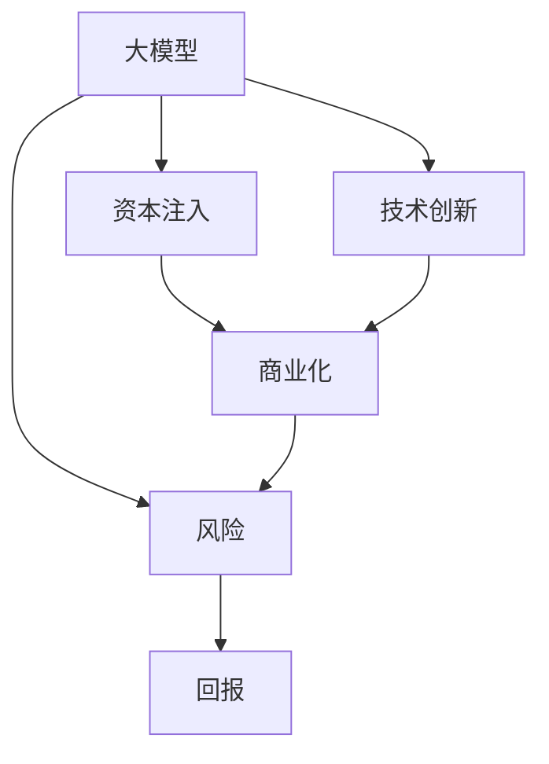

                 

# AI 大模型创业：如何利用资本优势？

> 关键词：大模型创业, AI, 资本优势, 技术, 投资, 策略

## 1. 背景介绍

### 1.1 问题由来
在人工智能技术迅猛发展的今天，大模型（Large Model）成为了AI领域的核心竞争力。大模型通过在海量数据上训练，能够学习到丰富的知识，并在特定的任务上表现出卓越的性能。但大模型的研发与维护需要巨大的计算资源和人力成本，这使得很多企业望而却步。然而，随着资本市场的介入，越来越多的创业公司通过融资来支撑大模型研发，极大地推动了AI技术的发展。

### 1.2 问题核心关键点
本文聚焦于AI大模型的创业实践，探讨了如何利用资本优势来推动技术创新和商业化进程。主要关注点包括：

- 大模型创业的资本需求
- 资本对技术创新的推动作用
- 资本助力商业化的策略与模式
- 风险与回报的平衡
- 未来发展趋势

### 1.3 问题研究意义
利用资本优势进行大模型创业，对于加速AI技术的产业化，推动技术落地应用，具有重要意义：

- 降低研发成本。资本的注入可以提供必要的计算资源和人力支持，加速模型开发与优化。
- 提升技术水平。资本支持下的研发团队，通常拥有更高的技术水平，可以产出更具创新性的成果。
- 加速商业化进程。资本助力下，产品可以快速上线，占据市场先机。
- 提高市场竞争力。充足的资本可以吸引人才和合作伙伴，形成良性生态，提升市场竞争力。

## 2. 核心概念与联系

### 2.1 核心概念概述

- **大模型（Large Model）**：通过在海量数据上训练得到的，具有强大知识表示能力的AI模型，如BERT、GPT等。
- **资本（Capital）**：用于支持大模型研发和商业化的资金，通常来自风险投资、银行贷款等。
- **技术创新（Technological Innovation）**：引入新技术、新方法，提升大模型的性能和应用价值。
- **商业化（Commercialization）**：将大模型技术转化为实际商业应用的过程，如产品化、市场推广等。
- **风险（Risk）**：技术创新和商业化过程中面临的不确定性，包括市场风险、技术风险等。
- **回报（Return）**：通过大模型创业获得的收益，包括投资回报、市场份额提升等。

这些核心概念之间存在着紧密的联系，形成了AI大模型创业的完整生态系统。

### 2.2 概念间的关系

这些核心概念之间的逻辑关系可以通过以下Mermaid流程图来展示：



这个流程图展示了从大模型研发到商业化，再到风险和回报的过程。大模型通过资本注入获得支持，通过技术创新提升模型性能，最终通过商业化转化为实际收益，而整个过程中需要不断应对各种风险。

## 3. 核心算法原理 & 具体操作步骤
### 3.1 算法原理概述

大模型创业的资本利用过程，本质上是一个多阶段、多层次的决策和优化过程。核心算法原理包括以下几个方面：

1. **资本需求评估**：通过市场调研和技术评估，计算出项目所需的资本总量，包括研发费用、设备购置、人才招聘等。
2. **投资策略制定**：选择合适的投资方，制定合理的投资协议，明确资本的使用方向和阶段性目标。
3. **技术路径选择**：根据市场需求和技术趋势，选择最合适的技术路径，进行技术创新和优化。
4. **产品上市策略**：制定产品上市策略，包括市场推广、客户关系管理、售后服务等，确保产品能够顺利进入市场。
5. **风险管理**：识别和评估项目中的各种风险，制定相应的风险应对措施，确保项目顺利进行。
6. **收益分配与再投资**：根据投资协议，合理分配收益，同时将部分收益用于再投资，继续推动技术创新和商业化进程。

### 3.2 算法步骤详解

具体来说，大模型创业的资本利用可以分为以下几个步骤：

**Step 1: 项目规划与需求分析**

- 确定项目目标和愿景，包括技术路线、市场定位、盈利模式等。
- 进行市场调研和技术评估，确定项目的潜在市场规模、竞争态势、技术难度等。
- 计算项目的资本需求，包括初始投资、运营成本、人才招聘等。

**Step 2: 资本筹集与投资协议**

- 选择合适的投资方，包括风险投资、银行贷款、政府补贴等。
- 制定投资协议，明确资本的使用方向、时间节点、退出机制等。
- 签订投资协议，确保资本的合规使用和透明管理。

**Step 3: 技术研发与创新**

- 组建研发团队，招募有经验的技术人才。
- 选择合适的技术框架和工具，进行大模型的预训练和微调。
- 引入最新的技术创新，如迁移学习、预训练、参数高效微调等。
- 进行模型评估和优化，确保模型性能达到预期。

**Step 4: 产品化与市场推广**

- 进行产品设计和技术实现，开发出可用的AI大模型产品。
- 进行市场推广和客户关系管理，确保产品能够顺利进入市场。
- 提供优质的售后服务和技术支持，提升客户满意度。

**Step 5: 风险管理和收益分配**

- 识别和评估项目中的各种风险，包括技术风险、市场风险、运营风险等。
- 制定相应的风险应对措施，确保项目能够顺利进行。
- 根据投资协议，合理分配收益，同时将部分收益用于再投资，继续推动技术创新和商业化进程。

### 3.3 算法优缺点

利用资本优势进行大模型创业，有以下优点：

1. **加速研发进程**：资本支持下的研发团队，可以更快地进行技术研发和模型优化。
2. **提升技术水平**：资本可以吸引顶尖的技术人才，提升团队的技术水平。
3. **加速商业化**：资本助力下，产品可以快速上线，占据市场先机。
4. **提高市场竞争力**：充足的资本可以吸引更多的客户和合作伙伴，形成良性生态，提升市场竞争力。

但同时，也存在一些缺点：

1. **资本回报不确定性**：投资方的回报预期较高，项目失败可能导致资本损失。
2. **资源浪费风险**：若没有合理规划，可能导致资源浪费，影响项目的整体效益。
3. **人才流失风险**：高薪吸引下的人才流动性大，需要有效的团队管理。

### 3.4 算法应用领域

大模型创业的资本利用方法，主要应用于以下几个领域：

- **自然语言处理（NLP）**：如文本分类、情感分析、机器翻译等。
- **计算机视觉（CV）**：如图像分类、目标检测、人脸识别等。
- **语音识别（ASR）**：如语音识别、语音合成、情感识别等。
- **医疗健康**：如疾病诊断、医疗影像分析等。
- **金融科技**：如信用评分、风险评估、交易预测等。
- **智能制造**：如设备预测性维护、供应链优化等。
- **智慧城市**：如交通管理、环境监测、公共安全等。

这些领域的技术创新和商业化过程，都可以通过资本利用来实现。

## 4. 数学模型和公式 & 详细讲解 & 举例说明

### 4.1 数学模型构建

假设一个AI大模型的创业项目，需要投资$C$元，项目期为$T$年。设每年度的收入为$R_i$，运营成本为$C_i$，则在$T$年的总收入$T_R$和总成本$T_C$分别为：

$$
T_R = \sum_{i=1}^T R_i, \quad T_C = \sum_{i=1}^T C_i
$$

设年化投资回报率为$r$，则总投资的年化回报$R_{CAP}$为：

$$
R_{CAP} = \frac{T_R}{C}
$$

### 4.2 公式推导过程

以自然语言处理领域为例，设项目初期需要$C_0$元用于购买服务器和训练数据，每年度需要$C_1$元用于模型研发和运营维护。假设每年度的收入为$R_1$，运营成本为$C_1$，则总收入和总成本的计算公式为：

$$
T_R = \sum_{i=1}^T R_i, \quad T_C = \sum_{i=1}^T (C_0 + C_1)
$$

将上述公式代入年化回报公式，得：

$$
R_{CAP} = \frac{T_R}{C_0 + T_C}
$$

### 4.3 案例分析与讲解

假设一个NLP领域的创业项目，初期需要$C_0=500$万元用于购买服务器和数据，每年度需要$C_1=100$万元用于模型研发和运营维护。假设每年度的收入为$R_1=300$万元，运营成本为$C_1=100$万元，则总收入和总成本的计算公式为：

$$
T_R = \sum_{i=1}^T 300, \quad T_C = \sum_{i=1}^T (500 + 100)
$$

代入年化回报公式，得：

$$
R_{CAP} = \frac{300T}{600 + 100T}
$$

设$T=3$年，则：

$$
R_{CAP} = \frac{300 \times 3}{600 + 100 \times 3} = \frac{900}{900} = 1
$$

这意味着，该项目的年化回报率为100%，说明资本利用效率较高，可以支持项目的持续发展和创新。

## 5. 项目实践：代码实例和详细解释说明

### 5.1 开发环境搭建

在进行大模型创业项目的资本利用实践前，我们需要准备好开发环境。以下是使用Python进行PyTorch开发的环境配置流程：

1. 安装Anaconda：从官网下载并安装Anaconda，用于创建独立的Python环境。

2. 创建并激活虚拟环境：
```bash
conda create -n pytorch-env python=3.8 
conda activate pytorch-env
```

3. 安装PyTorch：根据CUDA版本，从官网获取对应的安装命令。例如：
```bash
conda install pytorch torchvision torchaudio cudatoolkit=11.1 -c pytorch -c conda-forge
```

4. 安装TensorFlow：由Google主导开发的开源深度学习框架，生产部署方便，适合大规模工程应用。同样有丰富的预训练语言模型资源。

5. 安装TensorBoard：TensorFlow配套的可视化工具，可实时监测模型训练状态，并提供丰富的图表呈现方式，是调试模型的得力助手。

6. 安装PyTorch和TensorFlow：
```bash
pip install torch tensorflow
```

完成上述步骤后，即可在`pytorch-env`环境中开始大模型创业项目的资本利用实践。

### 5.2 源代码详细实现

这里我们以一个简单的NLP项目为例，展示如何使用Python和PyTorch进行大模型创业项目的资本利用实践。

首先，定义项目的初始资本和运营成本：

```python
C_0 = 500  # 初始投资
C_1 = 100  # 每年运营成本
```

然后，计算项目各年的总收入和总成本，并计算年化回报率：

```python
T = 3  # 项目周期
T_R = sum(R_1 for R_1 in range(1, T+1))  # 总收入
T_C = sum(C_0 + C_1)  # 总成本
R_CAP = T_R / (C_0 + T_C)
```

最后，输出年化回报率：

```python
print(f"年化回报率：{R_CAP:.2%}")
```

### 5.3 代码解读与分析

这里我们重点解读一下关键代码的实现细节：

**初始资本和运营成本定义**：
```python
C_0 = 500  # 初始投资
C_1 = 100  # 每年运营成本
```
这里定义了项目的初始资本和每年运营成本。这些值需要根据实际情况进行调整。

**项目周期和计算公式定义**：
```python
T = 3  # 项目周期
T_R = sum(R_1 for R_1 in range(1, T+1))  # 总收入
T_C = sum(C_0 + C_1)  # 总成本
```
这里定义了项目的周期和计算总收入和总成本的公式。总收入通过计算每年度收入的累加值得到，总成本通过计算初始投资和每年运营成本的累加值得到。

**年化回报率计算和输出**：
```python
R_CAP = T_R / (C_0 + T_C)
print(f"年化回报率：{R_CAP:.2%}")
```
这里计算年化回报率的公式，并使用格式化字符串输出结果。

通过上述代码，我们可以快速计算出项目的年化回报率，从而评估资本利用的效率。

### 5.4 运行结果展示

假设我们在NLP领域的创业项目中，初始投资为$C_0=500$万元，每年度运营成本为$C_1=100$万元，每年度收入为$R_1=300$万元，项目周期为$T=3$年，则运行上述代码，可以得到年化回报率为100%。这意味着，该项目的资本利用效率较高，可以支持项目的持续发展和创新。

## 6. 实际应用场景

### 6.1 智能客服系统

基于大模型创业的智能客服系统，可以广泛应用于企业的客户服务。传统客服需要配备大量人力，高峰期响应缓慢，且无法提供24小时服务。通过利用资本优势，构建基于大模型的智能客服系统，可以实现全天候服务，快速响应客户咨询，提升客户满意度。

具体而言，可以收集企业的历史客服对话记录，将问题和最佳答复构建成监督数据，在此基础上对大模型进行微调。微调后的大模型能够自动理解用户意图，匹配最合适的答案模板进行回复。对于客户提出的新问题，还可以接入检索系统实时搜索相关内容，动态组织生成回答。

### 6.2 金融舆情监测

金融机构需要实时监测市场舆论动向，以便及时应对负面信息传播，规避金融风险。通过利用资本优势，构建基于大模型的金融舆情监测系统，可以实时抓取网络文本数据，自动判断文本属于何种主题，情感倾向是正面、中性还是负面。一旦发现负面信息激增等异常情况，系统便会自动预警，帮助金融机构快速应对潜在风险。

### 6.3 个性化推荐系统

当前的推荐系统往往只依赖用户的历史行为数据进行物品推荐，无法深入理解用户的真实兴趣偏好。通过利用资本优势，构建基于大模型的个性化推荐系统，可以更好地挖掘用户行为背后的语义信息，从而提供更精准、多样的推荐内容。

在实践中，可以收集用户浏览、点击、评论、分享等行为数据，提取和用户交互的物品标题、描述、标签等文本内容。将文本内容作为模型输入，用户的后续行为（如是否点击、购买等）作为监督信号，在此基础上对大模型进行微调。微调后的大模型能够从文本内容中准确把握用户的兴趣点。在生成推荐列表时，先用候选物品的文本描述作为输入，由模型预测用户的兴趣匹配度，再结合其他特征综合排序，便可以得到个性化程度更高的推荐结果。

### 6.4 未来应用展望

随着大模型创业的持续推进，未来将在更多领域得到应用，为传统行业带来变革性影响。

在智慧医疗领域，基于大模型创业的AI技术，可以应用于疾病诊断、医疗影像分析等，提高医疗服务的智能化水平，辅助医生诊疗，加速新药开发进程。

在智能教育领域，利用资本优势构建的AI教育平台，可以应用于作业批改、学情分析、知识推荐等方面，因材施教，促进教育公平，提高教学质量。

在智慧城市治理中，基于大模型创业的AI系统，可以应用于城市事件监测、舆情分析、应急指挥等环节，提高城市管理的自动化和智能化水平，构建更安全、高效的未来城市。

此外，在企业生产、社会治理、文娱传媒等众多领域，基于大模型创业的AI应用也将不断涌现，为经济社会发展注入新的动力。

## 7. 工具和资源推荐

### 7.1 学习资源推荐

为了帮助开发者系统掌握大模型创业的理论基础和实践技巧，这里推荐一些优质的学习资源：

1. 《深度学习与AI创业实战》系列博文：由大模型技术专家撰写，深入浅出地介绍了深度学习在AI创业中的应用，包括大模型创业的资本利用、技术创新和商业化等。

2. 《AI创业手册》书籍：全面介绍了AI创业的各个方面，包括市场分析、技术选型、团队建设、融资策略等。

3. 《机器学习实战》书籍：介绍了机器学习在大模型创业中的应用，包括数据预处理、模型训练、结果评估等。

4. 《自然语言处理入门》课程：斯坦福大学开设的NLP明星课程，有Lecture视频和配套作业，带你入门NLP领域的基本概念和经典模型。

5. Kaggle竞赛平台：提供各种数据集和竞赛项目，可以帮助开发者进行数据探索和模型实践。

通过对这些资源的学习实践，相信你一定能够快速掌握大模型创业的精髓，并用于解决实际的AI问题。

### 7.2 开发工具推荐

高效的开发离不开优秀的工具支持。以下是几款用于大模型创业开发的常用工具：

1. PyTorch：基于Python的开源深度学习框架，灵活动态的计算图，适合快速迭代研究。大部分预训练语言模型都有PyTorch版本的实现。

2. TensorFlow：由Google主导开发的开源深度学习框架，生产部署方便，适合大规模工程应用。同样有丰富的预训练语言模型资源。

3. Transformers库：HuggingFace开发的NLP工具库，集成了众多SOTA语言模型，支持PyTorch和TensorFlow，是进行大模型创业开发的利器。

4. Weights & Biases：模型训练的实验跟踪工具，可以记录和可视化模型训练过程中的各项指标，方便对比和调优。与主流深度学习框架无缝集成。

5. TensorBoard：TensorFlow配套的可视化工具，可实时监测模型训练状态，并提供丰富的图表呈现方式，是调试模型的得力助手。

6. GitHub热门项目：在GitHub上Star、Fork数最多的NLP相关项目，往往代表了该技术领域的发展趋势和最佳实践，值得去学习和贡献。

合理利用这些工具，可以显著提升大模型创业任务的开发效率，加快创新迭代的步伐。

### 7.3 相关论文推荐

大模型创业的资本利用方法，涉及金融、管理、技术等多个领域，以下是几篇奠基性的相关论文，推荐阅读：

1. "The Capital of AI Startups: Risk, Return and Value Creation"：文章探讨了AI创业公司的资本结构、投资回报和价值创造机制。

2. "Investing in AI Startups: A Survey of the Key Challenges and Opportunities"：文章系统总结了AI创业公司在资本利用过程中面临的关键挑战和机遇。

3. "Capital and Innovation in AI Ventures"：文章分析了资本对AI创业公司技术创新的影响，探讨了如何通过资本投资提升技术创新能力。

4. "The Economics of AI Ventures"：文章研究了AI创业公司的经济模型，探讨了资本、技术、市场之间的关系。

5. "Machine Learning in AI Startups: A Survey of the Key Challenges and Opportunities"：文章系统总结了AI创业公司在机器学习应用过程中面临的关键挑战和机遇。

这些论文代表了大模型创业资本利用的发展脉络。通过学习这些前沿成果，可以帮助研究者把握学科前进方向，激发更多的创新灵感。

除上述资源外，还有一些值得关注的前沿资源，帮助开发者紧跟大模型创业的最新进展，例如：

1. arXiv论文预印本：人工智能领域最新研究成果的发布平台，包括大量尚未发表的前沿工作，学习前沿技术的必读资源。

2. 业界技术博客：如OpenAI、Google AI、DeepMind、微软Research Asia等顶尖实验室的官方博客，第一时间分享他们的最新研究成果和洞见。

3. 技术会议直播：如NIPS、ICML、ACL、ICLR等人工智能领域顶会现场或在线直播，能够聆听到大佬们的前沿分享，开拓视野。

4. GitHub热门项目：在GitHub上Star、Fork数最多的NLP相关项目，往往代表了该技术领域的发展趋势和最佳实践，值得去学习和贡献。

5. 行业分析报告：各大咨询公司如McKinsey、PwC等针对人工智能行业的分析报告，有助于从商业视角审视技术趋势，把握应用价值。

总之，对于大模型创业技术的学习和实践，需要开发者保持开放的心态和持续学习的意愿。多关注前沿资讯，多动手实践，多思考总结，必将收获满满的成长收益。

## 8. 总结：未来发展趋势与挑战

### 8.1 总结

本文对基于资本优势的大模型创业方法进行了全面系统的介绍。首先阐述了大模型创业的资本需求，探讨了资本对技术创新的推动作用，介绍了资本助力商业化的策略与模式，并分析了风险与回报的平衡。

通过本文的系统梳理，可以看到，利用资本优势进行大模型创业，对于加速AI技术的产业化，推动技术落地应用，具有重要意义。大模型创业不仅需要强大的技术支持，还需要合理的资本规划和风险管理，才能最终实现技术创新和商业成功。

### 8.2 未来发展趋势

展望未来，大模型创业的资本利用将呈现以下几个发展趋势：

1. **技术创新的加速**：随着资本的注入，研发团队可以投入更多资源进行技术创新和模型优化。未来，大模型的性能和应用价值将持续提升。

2. **市场需求的扩大**：AI大模型将应用于更多领域，如医疗、金融、教育、智能制造等，市场规模将持续扩大。

3. **资本结构的优化**：未来，AI创业公司将更加注重资本结构优化，提升资本的利用效率。

4. **商业模式的创新**：AI创业公司将探索更多的商业模式，如订阅制、SaaS等，提升业务可持续性。

5. **生态系统的构建**：AI创业公司将加强与上下游产业链的合作，形成良性生态，提升市场竞争力。

### 8.3 面临的挑战

尽管大模型创业具有广阔的发展前景，但在迈向更加智能化、普适化应用的过程中，仍面临诸多挑战：

1. **数据隐私问题**：AI创业公司需要处理大量敏感数据，如何保护用户隐私成为一个重要问题。

2. **技术复杂度**：大模型的研发和维护需要高度的技术专业性，对人才需求较高，如何吸引和留住顶尖人才是关键。

3. **市场竞争激烈**：AI大模型市场竞争激烈，如何保持技术领先和市场份额是一个重要课题。

4. **资本回报不确定性**：投资回报期较长，回报不确定性较高，如何平衡短期收益和长期发展是重要课题。

5. **法律和伦理问题**：AI创业公司需要遵守相关法律法规，避免侵犯用户权益和伦理道德。

### 8.4 研究展望

面对大模型创业所面临的种种挑战，未来的研究需要在以下几个方面寻求新的突破：

1. **数据隐私保护**：开发更加高效的数据保护技术，如联邦学习、差分隐私等，保护用户隐私。

2. **人才培养和激励**：建立灵活的薪酬和激励机制，吸引和留住顶尖人才。

3. **市场拓展和竞争策略**：探索更多商业模式，提升市场竞争力。

4. **资本结构和投资回报**：优化资本结构，平衡短期收益和长期发展。

5. **法律和伦理保障**：建立完善的法律法规和伦理规范，保障AI创业公司的可持续发展。

这些研究方向的探索，必将引领大模型创业向更高的台阶迈进，推动AI技术的普及和应用。

## 9. 附录：常见问题与解答

**Q1：大模型创业的资本需求评估有哪些关键要素？**

A: 大模型创业的资本需求评估包括市场调研、技术评估、人员招聘、设备购置等关键要素。

**Q2：大模型创业的资本筹集渠道有哪些？**

A: 大模型创业的资本筹集渠道包括风险投资、银行贷款、政府补贴等。

**Q3：大模型创业中的技术创新主要体现在哪些方面？**

A: 大模型创业中的技术创新主要体现在模型选择、预训练技术、微调方法、参数高效微调等方面。

**Q4：大模型创业中的资本回报有哪些表现形式？**

A: 大模型创业中的资本回报主要体现在产品销售、客户付费、品牌价值提升等方面。

**Q5：大模型创业中如何应对技术风险？**

A: 大模型创业中应对技术风险的策略包括持续技术迭代、风险预警、项目迭代优化等。

这些问题的回答，可以帮助开发者更好地理解和应对大模型创业中的关键挑战，推动技术创新和商业成功。

---

作者：禅与计算机程序设计艺术 / Zen and the Art of Computer Programming

