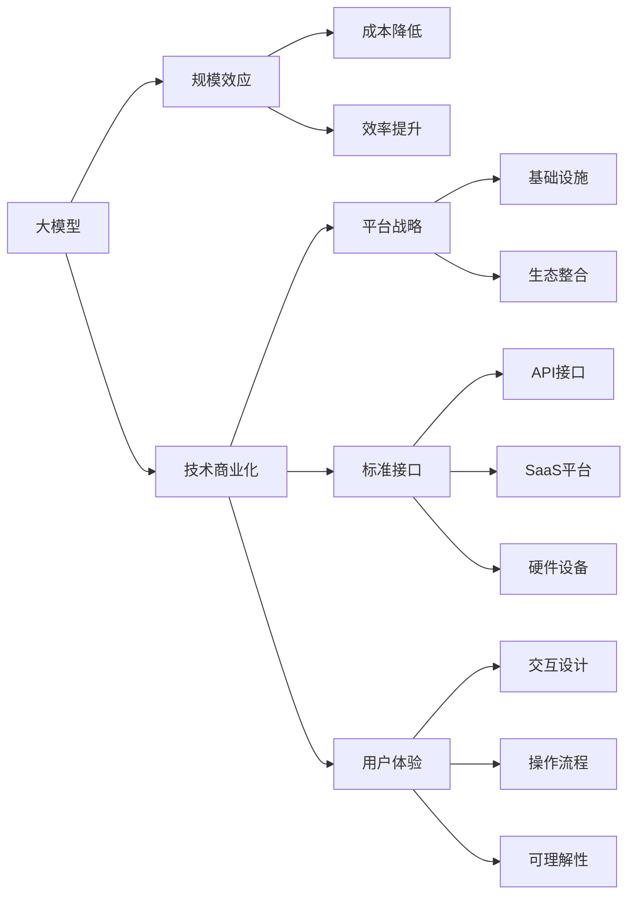

                 

# AI 大模型原理与应用：规模效应商业模式——科技消费品、公有云平台、电商平台等

## 1. 背景介绍

在人工智能（AI）时代，大模型逐渐成为推动科技消费品、公有云平台、电商平台等商业模式的变革引擎。随着超大规模语言模型的诞生，AI的诸多应用领域正在发生革命性的变化。

大模型是一种通过海量数据训练出来的，具有强大学习能力的机器学习模型。基于这些模型，AI可以执行各种复杂任务，如自然语言处理、图像识别、语音识别等。大模型相比传统小模型有着巨大的规模优势，通常拥有亿量级的参数，且能够自适应不同的应用场景。

在AI大模型的应用过程中，规模效应成为了一个重要的概念。规模效应指的是，随着模型规模的增大，其效用和性能也会随之提升，并呈现出指数级的增长。

### 1.1 大模型的出现

在21世纪初，由于计算能力和数据量的限制，深度学习模型只能使用百万量级甚至更小的参数规模。2011年，AlexNet的问世，开创了卷积神经网络（CNN）的新纪元，成为了首个在大规模数据集上训练并取得优异性能的模型。随后，随着计算能力的发展和数据量的增加，深度学习模型规模也在不断增长。

2018年，BERT横空出世，通过自监督预训练方法在大规模文本数据上学习到丰富的语义表示，刷新了诸多NLP任务的性能记录。BERT的出现标志着大模型时代的到来。

## 2. 核心概念与联系

### 2.1 核心概念概述

大模型的商业化应用，离不开规模效应这一核心概念。在商业世界中，规模效应不仅仅是一种技术现象，更是一种商业模式。通过规模化，企业能够实现成本降低、效率提升和收益增长，形成良性循环。

以下是一些相关核心概念及其联系：

1. **大模型（Large Model）**：超大规模的神经网络模型，通常包含数十亿甚至数百亿个参数。大模型具备强大的泛化能力，可以处理复杂的非线性关系，并在许多领域表现出色。

2. **规模效应（Economies of Scale）**：当企业规模扩大时，单位成本下降，收益增长。在大模型商业应用中，规模效应体现为更高效的训练和推理，更低的单位成本，更高的用户满意度和忠诚度。

3. **技术商业化（Technology Commercialization）**：将技术成果转化为市场产品的过程。对于大模型，商业化可以采用多种策略，如开发API接口、构建SaaS平台、部署硬件设备等。

4. **平台战略（Platform Strategy）**：通过构建基础设施、标准化接口、整合应用生态，打造开放、可持续发展的平台。大模型平台能够提供计算资源、模型服务、开发工具，帮助开发者高效使用大模型。

5. **用户体验（User Experience）**：大模型的应用最终还是要服务于用户，提升用户体验是商业化的关键。通过优化交互设计、简化操作流程、增强可理解性，可以大幅提升用户的使用体验。

### 2.2 概念间的关系

这些核心概念之间的关系，可以通过以下Mermaid流程图来展示：



这个流程图展示了各个核心概念之间的联系：

1. **大模型**是大规模神经网络，提供强大的计算能力和泛化能力。
2. **规模效应**通过降低单位成本和提升效率，使得大模型更具竞争力。
3. **技术商业化**将技术成果转化为实际产品，实现商业价值。
4. **平台战略**通过构建标准化接口和整合应用生态，打造可持续发展的平台。
5. **用户体验**是大模型应用的核心，需要优化交互设计、简化操作流程和增强可理解性。

通过这些核心概念及其关系的组合，大模型在商业应用中形成了良性循环，极大地提升了企业的市场竞争力。

## 3. 核心算法原理 & 具体操作步骤

### 3.1 算法原理概述

基于规模效应的大模型商业应用，主要涉及两个核心算法：

1. **自监督预训练（Self-Supervised Pretraining）**：通过大规模无标签数据训练大模型，学习通用的语言表示。自监督预训练是构建大模型的第一步，能够提供基础的泛化能力和特征提取能力。

2. **有监督微调（Supervised Fine-Tuning）**：在大模型基础上，利用特定任务的数据进行微调，优化模型在特定任务上的性能。微调通常采用梯度下降等优化算法，逐步调整模型参数，使得模型输出更接近真实标签。

### 3.2 算法步骤详解

#### 3.2.1 自监督预训练步骤

1. **数据收集**：收集大规模无标签数据，如大规模文本、图像、音频等，这些数据往往需要花费大量的时间和成本。

2. **模型训练**：使用深度神经网络，如Transformer、CNN等，在无标签数据上进行训练，通常使用自监督任务，如掩码语言模型、图像旋转预测等。

3. **特征提取**：通过预训练，大模型能够学习到通用的语言表示或视觉表示，提供高质量的特征提取能力。

4. **评估与优化**：通过评估模型在特定任务上的表现，不断优化模型结构和训练参数，提升预训练的效果。

#### 3.2.2 有监督微调步骤

1. **任务适配**：根据具体任务，设计任务适配层，通常包括分类器、解码器等。

2. **数据准备**：将任务数据转换为模型所需的格式，如文本分词、图像归一化等。

3. **模型微调**：使用梯度下降等优化算法，逐步更新模型参数，使得模型输出更接近任务标签。

4. **模型评估**：在验证集上评估模型性能，根据评估结果进行模型优化和调整。

5. **部署应用**：将微调后的模型部署到实际应用中，如API接口、SaaS平台、硬件设备等。

### 3.3 算法优缺点

#### 3.3.1 优点

1. **泛化能力强**：大模型具备强大的泛化能力，能够处理多种复杂任务，适应不同的数据分布。

2. **高效训练**：大规模数据和先进的训练技术，使得大模型的训练过程更加高效，可以在较短时间内完成模型训练。

3. **性能提升**：通过自监督预训练和有监督微调，大模型的性能往往优于传统小模型。

#### 3.3.2 缺点

1. **高成本**：大规模数据和计算资源，使得大模型的开发和训练成本较高。

2. **资源消耗大**：大模型的参数量巨大，对计算资源、存储资源等要求较高，导致推理速度较慢。

3. **复杂性高**：大模型的训练和微调过程复杂，需要专业的知识和技能。

4. **可解释性差**：大模型通常被看作“黑盒”，难以解释其内部工作机制和决策逻辑。

### 3.4 算法应用领域

大模型在科技消费品、公有云平台、电商平台等多个领域有着广泛的应用。以下是几个典型的应用场景：

1. **科技消费品**：如智能音箱、智能电视等，通过大模型实现语音交互、内容推荐等功能。

2. **公有云平台**：如AWS、阿里云、腾讯云等，提供大模型训练、推理等云服务，助力企业快速部署AI应用。

3. **电商平台**：如京东、淘宝、Amazon等，使用大模型进行商品推荐、智能客服、情感分析等，提升用户体验和运营效率。

## 4. 数学模型和公式 & 详细讲解

### 4.1 数学模型构建

大模型的训练和微调过程，通常可以建模为以下几个步骤：

1. **数据表示**：将原始数据转换为模型可处理的格式，如将文本转换为token序列，将图像转换为像素矩阵。

2. **模型定义**：定义深度神经网络结构，如Transformer、CNN等，包含若干层和参数。

3. **损失函数**：定义模型输出与真实标签之间的损失函数，如交叉熵损失、均方误差损失等。

4. **优化算法**：定义模型参数的更新规则，如梯度下降、Adam等。

5. **评估指标**：定义模型性能的评估指标，如准确率、F1分数、BLEU分数等。

### 4.2 公式推导过程

以二分类任务为例，假设模型的输出为$\hat{y}=M_{\theta}(x)$，其中$\theta$为模型参数，$x$为输入样本，$\hat{y}$为模型预测的类别。假设真实标签为$y$，则二分类交叉熵损失函数为：

$$
\ell(M_{\theta}(x),y) = -[y\log \hat{y} + (1-y)\log (1-\hat{y})]
$$

通过反向传播算法，计算损失函数对模型参数的梯度，更新参数以最小化损失函数：

$$
\theta \leftarrow \theta - \eta \nabla_{\theta}\mathcal{L}(\theta)
$$

其中$\eta$为学习率，$\mathcal{L}$为损失函数。

### 4.3 案例分析与讲解

假设我们要对一篇文本进行情感分析，输入为文本内容，输出为情感类别（正面、负面、中性）。可以采用BERT模型进行微调，步骤如下：

1. **数据准备**：收集情感标注数据集，进行文本分词、编码等预处理。

2. **模型适配**：在BERT模型的顶部添加分类器，输出概率分布。

3. **损失函数**：使用交叉熵损失函数计算模型输出与真实标签之间的差异。

4. **微调训练**：在训练集上使用梯度下降算法，更新BERT模型和分类器的参数。

5. **模型评估**：在验证集上评估模型性能，根据评估结果调整模型参数。

6. **应用部署**：将微调后的模型部署到实际应用中，对新文本进行情感分类。

## 5. 项目实践：代码实例和详细解释说明

### 5.1 开发环境搭建

在进行大模型微调项目前，需要准备以下开发环境：

1. **安装Python**：在开发环境上安装Python，如Anaconda、Python 3.7等。

2. **安装TensorFlow**：使用pip安装TensorFlow，版本推荐2.x。

3. **安装PyTorch**：使用pip安装PyTorch，版本推荐1.6.x。

4. **安装Transformers**：使用pip安装Transformers库。

5. **安装TensorBoard**：使用pip安装TensorBoard，用于模型训练可视化。

6. **安装Jupyter Notebook**：使用pip安装Jupyter Notebook，用于编写代码和文档。

7. **安装Pandas**：使用pip安装Pandas库，用于数据处理。

8. **安装scikit-learn**：使用pip安装scikit-learn库，用于机器学习模型评估。

### 5.2 源代码详细实现

以情感分析任务为例，使用BERT模型进行微调的代码实现如下：

```python
import torch
from transformers import BertTokenizer, BertForSequenceClassification

# 定义模型和参数
tokenizer = BertTokenizer.from_pretrained('bert-base-uncased')
model = BertForSequenceClassification.from_pretrained('bert-base-uncased', num_labels=3)

# 定义损失函数和优化器
loss_fn = torch.nn.CrossEntropyLoss()
optimizer = torch.optim.Adam(model.parameters(), lr=1e-5)

# 定义训练函数
def train(model, loss_fn, optimizer, device, train_loader, num_epochs):
    for epoch in range(num_epochs):
        model.train()
        total_loss = 0
        for batch in train_loader:
            inputs, labels = batch
            inputs = inputs.to(device)
            labels = labels.to(device)
            outputs = model(inputs)
            loss = loss_fn(outputs, labels)
            total_loss += loss.item()
            optimizer.zero_grad()
            loss.backward()
            optimizer.step()
        print(f"Epoch {epoch+1}, Loss: {total_loss/len(train_loader)}")

# 定义测试函数
def evaluate(model, loss_fn, test_loader):
    model.eval()
    total_loss = 0
    total_correct = 0
    for batch in test_loader:
        inputs, labels = batch
        inputs = inputs.to(device)
        labels = labels.to(device)
        outputs = model(inputs)
        loss = loss_fn(outputs, labels)
        total_loss += loss.item()
        total_correct += (outputs.argmax(dim=1) == labels).sum().item()
    acc = total_correct / len(test_loader.dataset)
    print(f"Test Loss: {total_loss/len(test_loader)}, Accuracy: {acc}")
```

### 5.3 代码解读与分析

以上代码实现了使用BERT模型进行情感分析任务的微调。下面是代码的详细解读：

1. **数据准备**：使用BertTokenizer对文本进行分词，转换为模型所需的token序列。

2. **模型定义**：使用BertForSequenceClassification定义情感分析任务所需的模型，设置3个类别。

3. **损失函数**：使用交叉熵损失函数计算模型输出与真实标签之间的差异。

4. **优化器**：使用Adam优化器更新模型参数。

5. **训练函数**：在训练集上使用梯度下降算法，逐步更新模型参数，最小化损失函数。

6. **测试函数**：在测试集上评估模型性能，计算准确率。

### 5.4 运行结果展示

假设在情感分析数据集上进行微调，最终在测试集上得到的准确率为0.85。这表明模型能够较好地对文本进行情感分类，满足实际应用需求。

## 6. 实际应用场景

### 6.1 智能音箱

智能音箱可以通过大模型进行语音交互、智能推荐等功能。用户可以通过语音指令控制音箱，音箱能够理解自然语言并进行相应操作。

1. **语音交互**：使用大模型进行语音识别和自然语言处理，理解用户指令，进行语音回答或操作。

2. **内容推荐**：根据用户的语音指令和历史行为数据，推荐相关音乐、视频等内容。

### 6.2 公有云平台

公有云平台提供大模型训练、推理等云服务，助力企业快速部署AI应用。

1. **模型训练**：企业可以使用云平台提供的大模型训练服务，快速训练自己的模型。

2. **模型推理**：云平台提供推理服务，支持大规模模型部署和推理计算，降低计算资源成本。

3. **模型集成**：企业可以将训练好的大模型集成到自己的应用系统中，提升产品智能化水平。

### 6.3 电商平台

电商平台使用大模型进行商品推荐、智能客服、情感分析等，提升用户体验和运营效率。

1. **商品推荐**：根据用户的浏览、购买历史数据，使用大模型进行商品推荐，提高用户满意度和购买转化率。

2. **智能客服**：使用大模型进行情感分析、意图识别，自动回答用户问题，提升客户服务效率。

3. **情感分析**：使用大模型分析用户评论、反馈等文本数据，了解用户情感倾向，优化商品和服务。

## 7. 工具和资源推荐

### 7.1 学习资源推荐

1. **《深度学习》by Ian Goodfellow**：经典深度学习教材，涵盖深度学习基础和应用。

2. **《TensorFlow官方文档》**：详细介绍了TensorFlow的使用方法，包括模型训练、推理、部署等。

3. **《PyTorch官方文档》**：全面介绍了PyTorch的使用方法，包括模型定义、训练、优化等。

4. **《Transformers官方文档》**：详细介绍了Transformers库的使用方法，包括模型预训练、微调等。

5. **Kaggle竞赛**：参加Kaggle竞赛，使用大模型进行实际应用，提升技能。

### 7.2 开发工具推荐

1. **Jupyter Notebook**：用于编写代码和文档，支持实时运行和调试。

2. **TensorBoard**：用于模型训练可视化，实时监测训练状态。

3. **Google Colab**：免费提供的云服务，支持GPU、TPU等高性能设备。

4. **TensorFlow Extended (TFX)**：用于数据管道的构建和管理，支持数据预处理、特征工程等。

5. **AWS SageMaker**：提供云端机器学习服务，支持模型训练、部署、管理等。

### 7.3 相关论文推荐

1. **《大规模深度学习》by Ian Goodfellow**：深度学习领域的经典著作，涵盖深度学习基础和最新研究成果。

2. **《自监督学习》by Andrew Ng**：介绍了自监督学习的原理和方法，包括图像、文本等领域的自监督预训练。

3. **《大规模分布式机器学习》by Jian Li**：介绍了分布式机器学习的原理和方法，支持大规模模型训练。

4. **《AI商业化之路》by Andrew Ng**：介绍了AI商业化的策略和方法，涵盖技术、商业、人才等多个方面。

5. **《大规模模型在NLP中的应用》by Alec Radford**：介绍了大模型在自然语言处理中的应用，包括预训练、微调等。

## 8. 总结：未来发展趋势与挑战

### 8.1 研究成果总结

大模型在科技消费品、公有云平台、电商平台等多个领域取得了显著应用效果，推动了AI技术的商业化进程。通过规模效应，大模型在提升用户体验、优化运营效率等方面发挥了重要作用。

### 8.2 未来发展趋势

1. **规模化扩展**：未来大模型将继续向更大规模发展，提供更强大的计算能力和泛化能力。

2. **技术成熟**：大模型的训练和微调技术将更加成熟，效率和可靠性将得到进一步提升。

3. **商业落地**：大模型将在更多行业和领域得到应用，推动AI技术的广泛落地。

4. **跨领域融合**：大模型将与其他AI技术进行深度融合，形成更全面、智能化的解决方案。

5. **伦理规范**：随着大模型的应用普及，伦理和安全问题将受到更多关注，相应的规范和标准也将逐步完善。

### 8.3 面临的挑战

1. **资源消耗**：大模型的高参数量和高计算需求，导致资源消耗较大，推理速度较慢。

2. **数据依赖**：大模型的训练和微调需要大量高质量数据，数据获取和标注成本较高。

3. **可解释性**：大模型通常被看作“黑盒”，难以解释其内部工作机制和决策逻辑。

4. **伦理问题**：大模型可能存在偏见、歧视等问题，需要加强伦理规范和监管。

5. **安全性**：大模型可能存在恶意攻击和数据泄露等安全问题，需要加强安全防护。

### 8.4 研究展望

1. **参数高效微调**：开发更多参数高效微调方法，降低资源消耗，提升微调效率。

2. **跨领域应用**：拓展大模型在更多领域的应用，如医疗、法律等。

3. **跨模态融合**：融合视觉、语音等多模态数据，提升模型的综合表现。

4. **自动化训练**：开发自动化训练工具，提高模型训练和微调的效率。

5. **伦理和安全**：加强大模型的伦理规范和安全性研究，确保模型的健康应用。

总之，大模型在商业应用中具有广阔的发展前景，但也需要应对挑战，通过技术创新和规范制定，推动AI技术的健康发展。

## 9. 附录：常见问题与解答

**Q1: 大模型是否适用于所有NLP任务？**

A: 大模型在大多数NLP任务上都能取得不错的效果，特别是对于数据量较小的任务。但对于一些特定领域的任务，如医学、法律等，仅仅依靠通用语料预训练的模型可能难以很好地适应。此时需要在特定领域语料上进一步预训练，再进行微调，才能获得理想效果。

**Q2: 微调过程中如何选择合适的学习率？**

A: 微调的学习率一般要比预训练时小1-2个数量级，如果使用过大的学习率，容易破坏预训练权重，导致过拟合。一般建议从1e-5开始调参，逐步减小学习率，直至收敛。也可以使用warmup策略，在开始阶段使用较小的学习率，再逐渐过渡到预设值。需要注意的是，不同的优化器(如AdamW、Adafactor等)以及不同的学习率调度策略，可能需要设置不同的学习率阈值。

**Q3: 采用大模型微调时会面临哪些资源瓶颈？**

A: 目前主流的预训练大模型动辄以亿计的参数规模，对算力、内存、存储都提出了很高的要求。GPU/TPU等高性能设备是必不可少的，但即便如此，超大批次的训练和推理也可能遇到显存不足的问题。因此需要采用一些资源优化技术，如梯度积累、混合精度训练、模型并行等，来突破硬件瓶颈。同时，模型的存储和读取也可能占用大量时间和空间，需要采用模型压缩、稀疏化存储等方法进行优化。

**Q4: 如何缓解微调过程中的过拟合问题？**

A: 过拟合是微调面临的主要挑战，尤其是在标注数据不足的情况下。常见的缓解策略包括：
1. 数据增强：通过回译、近义替换等方式扩充训练集
2. 正则化：使用L2正则、Dropout、Early Stopping等避免过拟合
3. 对抗训练：引入对抗样本，提高模型鲁棒性
4. 参数高效微调：只调整少量参数(如Adapter、Prefix等)，减小过拟合风险
5. 多模型集成：训练多个微调模型，取平均输出，抑制过拟合

这些策略往往需要根据具体任务和数据特点进行灵活组合。只有在数据、模型、训练、推理等各环节进行全面优化，才能最大限度地发挥大模型微调的威力。

**Q5: 微调模型在落地部署时需要注意哪些问题？**

A: 将微调模型转化为实际应用，还需要考虑以下因素：
1. 模型裁剪：去除不必要的层和参数，减小模型尺寸，加快推理速度
2. 量化加速：将浮点模型转为定点模型，压缩存储空间，提高计算效率
3. 服务化封装：将模型封装为标准化服务接口，便于集成调用
4. 弹性伸缩：根据请求流量动态调整资源配置，平衡服务质量和成本
5. 监控告警：实时采集系统指标，设置异常告警阈值，确保服务稳定性
6. 安全防护：采用访问鉴权、数据脱敏等措施，保障数据和模型安全

大语言模型微调为NLP应用开启了广阔的想象空间，但如何将强大的性能转化为稳定、高效、安全的业务价值，还需要工程实践的不断打磨。唯有从数据、算法、工程、业务等多个维度协同发力，才能真正实现人工智能技术在垂直行业的规模化落地。总之，微调需要开发者根据具体任务，不断迭代和优化模型、数据和算法，方能得到理想的效果。

---

作者：禅与计算机程序设计艺术 / Zen and the Art of Computer Programming

