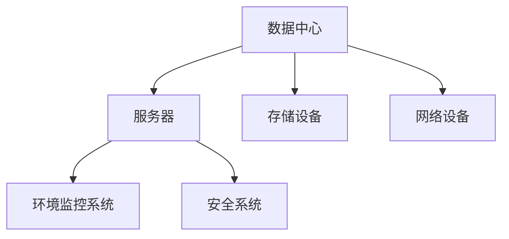
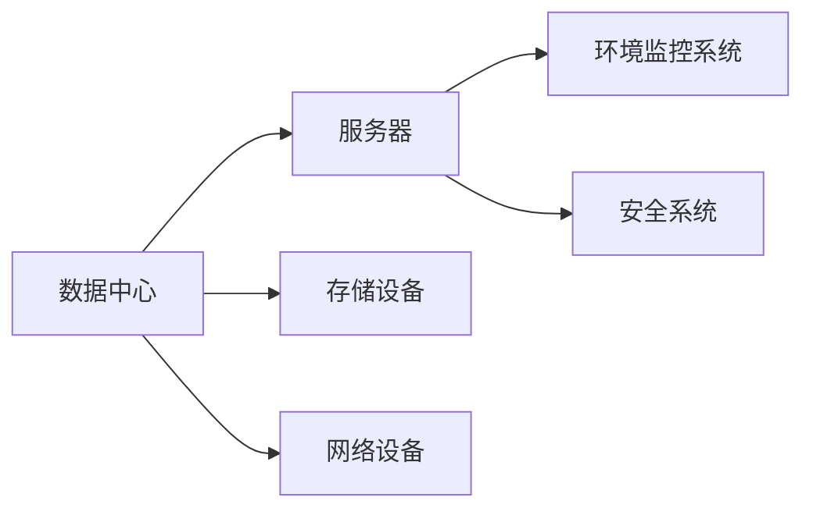
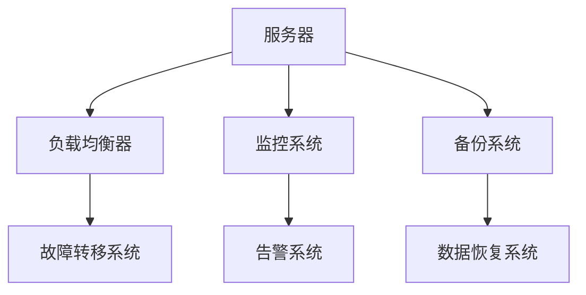
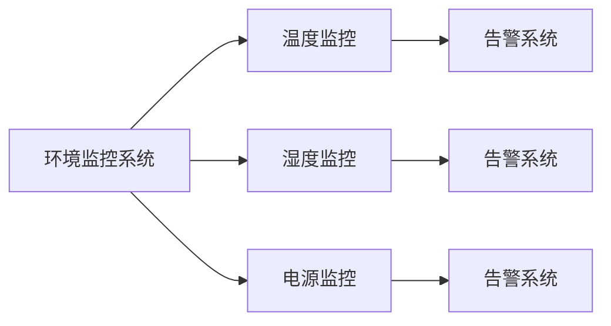
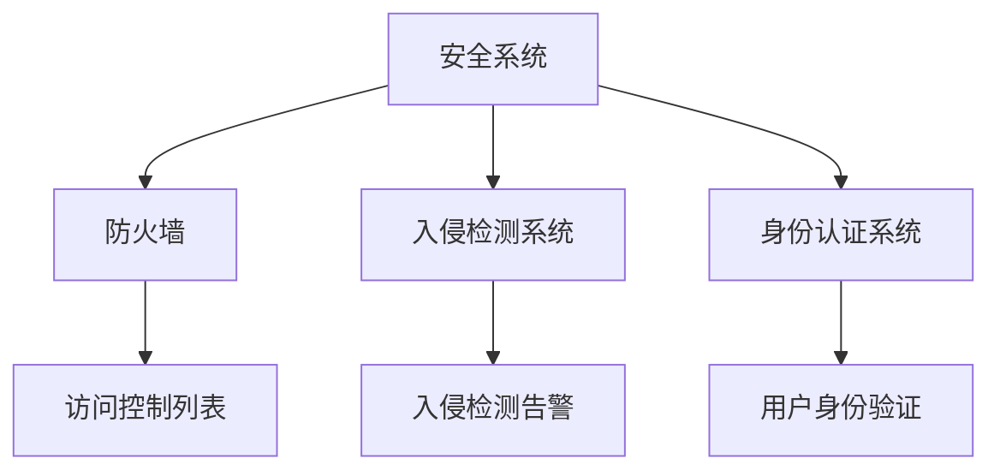
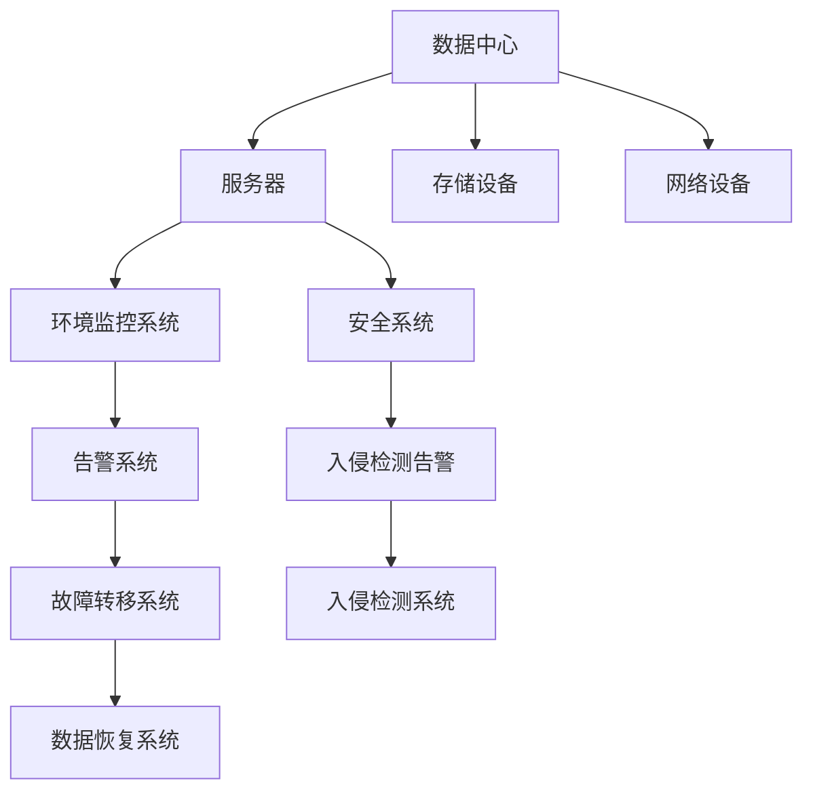

                 

# AI 大模型应用数据中心建设：数据中心安全与可靠性

## 1. 背景介绍

### 1.1 问题由来

随着人工智能(AI)技术的发展，AI大模型在诸多领域取得了显著的成果，例如自然语言处理、图像识别、推荐系统等。然而，这些大模型的训练和推理过程需要大量的计算资源，对数据中心的建设提出了新的要求。数据中心不仅是AI大模型基础设施的核心，其安全性和可靠性直接关系到模型的运行效率和应用效果。

### 1.2 问题核心关键点

数据中心的安全与可靠性主要体现在以下几个方面：

- **数据安全**：保护模型训练和推理数据的安全性，防止数据泄露和篡改。
- **环境稳定**：确保数据中心硬件设备的稳定运行，避免环境因素（如温度、湿度）对模型性能的影响。
- **计算高效**：优化数据中心的计算资源配置，提高模型的训练和推理效率。
- **网络安全**：保护数据中心的内部网络和通信安全，防止外部攻击和内部威胁。

### 1.3 问题研究意义

数据中心的安全与可靠性是AI大模型应用成功的基础保障。随着AI大模型的应用场景日益多样化，对数据中心的要求也日益提高。本研究旨在全面探讨AI大模型应用数据中心的建设，为数据中心安全与可靠性提供系统性的解决方案，以支持AI大模型的规模化应用。

## 2. 核心概念与联系

### 2.1 核心概念概述

为更好地理解AI大模型应用数据中心的安全与可靠性，本节将介绍几个关键概念：

- **数据中心**：指由众多服务器、存储设备和网络设备组成，能够支持大规模数据处理和计算的设施。
- **服务器**：数据中心的计算核心，负责处理数据和运行AI大模型的训练和推理任务。
- **存储设备**：用于存储模型训练数据和推理结果，支持数据的高效读写。
- **网络设备**：包括交换机、路由器等，实现数据中心内部和外部的数据通信。
- **环境监控系统**：用于监测数据中心内部环境（如温度、湿度），确保设备正常运行。
- **安全系统**：包括防火墙、入侵检测系统、身份认证等，保护数据中心免受外部威胁。

这些概念之间的逻辑关系可以通过以下Mermaid流程图来展示：



这个流程图展示了数据中心的主要组成及其之间的关系：

- 数据中心包括服务器、存储设备和网络设备，共同支持AI大模型的计算和存储需求。
- 环境监控系统确保硬件设备在适宜的环境下运行。
- 安全系统防范外部攻击和内部威胁，保护数据中心的安全。

### 2.2 概念间的关系

这些核心概念之间存在着紧密的联系，形成了数据中心安全与可靠性的完整生态系统。下面我们通过几个Mermaid流程图来展示这些概念之间的关系。

#### 2.2.1 数据中心的核心架构



这个流程图展示了数据中心的整体架构，包括服务器、存储设备和网络设备，以及环境监控系统和安全系统的作用。

#### 2.2.2 服务器的高可用性设计



这个流程图展示了服务器高可用性的设计，包括负载均衡、监控、备份、故障转移和数据恢复等关键环节。

#### 2.2.3 环境监控系统的功能模块



这个流程图展示了环境监控系统的功能模块，包括温度、湿度和电源监控，以及告警系统的作用。

#### 2.2.4 安全系统的防护措施



这个流程图展示了安全系统的防护措施，包括防火墙、入侵检测系统和身份认证系统的作用。

### 2.3 核心概念的整体架构

最后，我们用一个综合的流程图来展示这些核心概念在大模型应用数据中心的整体架构：



这个综合流程图展示了数据中心的整体架构，包括服务器、存储设备和网络设备，以及环境监控系统和安全系统的相互作用。环境监控系统通过告警系统实现故障检测和转移，安全系统通过入侵检测系统实现防护和告警。

## 3. 核心算法原理 & 具体操作步骤
### 3.1 算法原理概述

数据中心的安全与可靠性保障依赖于一套系统化的算法和流程，主要包括以下几个方面：

- **环境监测算法**：通过传感器实时监测数据中心的环境状态，包括温度、湿度、电源等，确保硬件设备在适宜的环境下运行。
- **故障检测算法**：通过监控系统检测设备故障，实现快速故障转移和数据恢复。
- **入侵检测算法**：通过网络设备检测外部攻击，及时进行安全防护和告警。
- **身份认证算法**：通过身份认证系统验证用户身份，防止未经授权的访问。

### 3.2 算法步骤详解

**Step 1: 环境监测算法实现**
- 部署温度、湿度、电源等传感器，实时监测数据中心的环境状态。
- 通过监控系统收集传感器数据，进行数据处理和分析，判断设备是否处于正常运行状态。
- 根据环境监测结果，自动调整数据中心环境（如开启/关闭空调、调整电源供应等）。

**Step 2: 故障检测算法实现**
- 使用监控系统定期检查服务器、存储设备、网络设备等硬件设备的运行状态。
- 对于检测到异常的设备，立即进行告警，并触发故障转移系统。
- 故障转移系统自动将业务流量切换到备份设备，保证业务连续性。

**Step 3: 入侵检测算法实现**
- 通过防火墙、入侵检测系统等网络设备检测外部攻击行为。
- 一旦检测到异常流量，立即进行告警，并采取防护措施（如阻断攻击流量、记录攻击行为等）。
- 入侵检测系统记录攻击行为，生成安全报告，供管理员参考。

**Step 4: 身份认证算法实现**
- 用户通过身份认证系统输入用户名和密码，进行身份验证。
- 验证通过后，用户被授予相应的访问权限。
- 身份认证系统记录用户访问记录，防止未经授权的访问。

### 3.3 算法优缺点

数据中心安全与可靠性的保障算法具有以下优点：

- 实时监测和及时响应，保障数据中心的正常运行。
- 自动故障转移和数据恢复，减少业务中断时间。
- 入侵检测和防护，防止外部攻击和内部威胁。
- 身份认证和访问控制，保护数据中心免受未经授权的访问。

同时，这些算法也存在一些缺点：

- 传感器和监控设备的成本较高，初期投资较大。
- 算法实现复杂，需要专业技术人员进行维护。
- 网络设备性能限制，可能影响数据传输速度。

### 3.4 算法应用领域

数据中心安全与可靠性的保障算法广泛应用于多个领域，例如：

- **云计算平台**：通过监控和告警系统，保障云计算服务的高可用性和安全性。
- **人工智能大模型**：通过环境监控和故障转移，保障AI大模型的训练和推理过程。
- **金融交易系统**：通过入侵检测和身份认证，保护金融交易数据和系统安全。
- **医疗信息系统**：通过环境监控和数据备份，保障医疗数据的完整性和安全性。

## 4. 数学模型和公式 & 详细讲解 & 举例说明
### 4.1 数学模型构建

本节将使用数学语言对数据中心安全与可靠性的保障算法进行严格刻画。

设数据中心有 $N$ 台服务器，每台服务器有 $M$ 个故障点。假设环境监测系统的监测精度为 $\varepsilon$，故障检测算法的检测概率为 $p$，入侵检测算法的误报率为 $f$，身份认证算法的识别率为 $r$。

**环境监测模型**：
- 传感器监测设备的温度 $T_i$，湿度 $H_i$，电源电压 $V_i$，表示为 $(T_i, H_i, V_i)$。
- 环境监测系统的监测精度为 $\varepsilon$，即 $P(|T_i - T_{true}| < \varepsilon) = 1 - \varepsilon$，其中 $T_{true}$ 为真实温度。

**故障检测模型**：
- 监控系统定期检查每台服务器的状态，检查周期为 $T$。
- 故障检测算法的检测概率为 $p$，即 $P(\text{检测到故障}) = p$。
- 故障转移系统在检测到故障后，立即将业务流量切换到备份设备，保证业务连续性。

**入侵检测模型**：
- 防火墙、入侵检测系统等网络设备检测外部攻击，检测概率为 $q$。
- 入侵检测算法的误报率为 $f$，即 $P(\text{误报}) = f$。
- 入侵检测系统记录攻击行为，生成安全报告，供管理员参考。

**身份认证模型**：
- 用户通过身份认证系统输入用户名和密码，进行身份验证。
- 身份认证算法的识别率为 $r$，即 $P(\text{认证通过}) = r$。
- 身份认证系统记录用户访问记录，防止未经授权的访问。

### 4.2 公式推导过程

以下我们以故障检测算法为例，推导故障检测概率的计算公式。

设故障检测算法的检测概率为 $p$，即 $P(\text{检测到故障}) = p$。假设每台服务器有 $M$ 个故障点，每个故障点的故障概率为 $p_f$，即 $P(\text{故障}) = p_f$。

根据贝叶斯公式，故障检测的概率为：

$$
P(\text{检测到故障}) = P(\text{故障}) \times P(\text{检测到故障}|\text{故障}) + (1 - P(\text{故障})) \times P(\text{检测到故障}|\text{无故障})
$$

代入 $P(\text{故障}) = p_f$，得：

$$
P(\text{检测到故障}) = p_f \times P(\text{检测到故障}|\text{故障}) + (1 - p_f) \times P(\text{检测到故障}|\text{无故障})
$$

假设故障检测系统能够正确检测到故障，即 $P(\text{检测到故障}|\text{故障}) = 1$，且故障检测系统有误报，即 $P(\text{检测到故障}|\text{无故障}) = f$，代入上式得：

$$
P(\text{检测到故障}) = p_f \times 1 + (1 - p_f) \times f = p_f + f - p_f \times f
$$

因此，故障检测系统的总检测概率为 $p = p_f + f - p_f \times f$。

### 4.3 案例分析与讲解

**案例：某云计算平台的数据中心**
- 数据中心有 $N = 1000$ 台服务器，每台服务器有 $M = 10$ 个故障点，故障概率为 $p_f = 0.01$。
- 环境监测系统的监测精度为 $\varepsilon = 0.01$，即 $P(|T_i - T_{true}| < 0.01) = 1 - 0.01$。
- 故障检测算法的检测概率为 $p = 0.9$，入侵检测算法的误报率为 $f = 0.1$，身份认证算法的识别率为 $r = 0.95$。

计算故障检测系统的总检测概率 $p$：

$$
p = 0.01 + 0.1 - 0.01 \times 0.1 = 0.99 - 0.001 = 0.999
$$

因此，故障检测系统的总检测概率为 $0.999$，即在大多数情况下能够正确检测到故障。

## 5. 项目实践：代码实例和详细解释说明
### 5.1 开发环境搭建

在进行数据中心安全与可靠性保障的实践前，我们需要准备好开发环境。以下是使用Python进行PyTorch开发的环境配置流程：

1. 安装Anaconda：从官网下载并安装Anaconda，用于创建独立的Python环境。

2. 创建并激活虚拟环境：
```bash
conda create -n pytorch-env python=3.8 
conda activate pytorch-env
```

3. 安装PyTorch：根据CUDA版本，从官网获取对应的安装命令。例如：
```bash
conda install pytorch torchvision torchaudio cudatoolkit=11.1 -c pytorch -c conda-forge
```

4. 安装各类工具包：
```bash
pip install numpy pandas scikit-learn matplotlib tqdm jupyter notebook ipython
```

完成上述步骤后，即可在`pytorch-env`环境中开始开发实践。

### 5.2 源代码详细实现

下面我们以环境监测算法为例，给出使用PyTorch进行数据中心环境监测的PyTorch代码实现。

首先，定义环境监测系统的传感器：

```python
import torch
from torch import nn

class Sensor(nn.Module):
    def __init__(self, num_sensors, max_value):
        super(Sensor, self).__init__()
        self.num_sensors = num_sensors
        self.max_value = max_value
        self.temperature = nn.Linear(1, num_sensors, bias=False)
        self.humidity = nn.Linear(1, num_sensors, bias=False)
        self.voltage = nn.Linear(1, num_sensors, bias=False)
    
    def forward(self, x):
        temperature = self.temperature(x)
        temperature = torch.sigmoid(temperature)
        humidity = self.humidity(x)
        humidity = torch.sigmoid(humidity)
        voltage = self.voltage(x)
        voltage = torch.sigmoid(voltage)
        return temperature, humidity, voltage
```

然后，定义环境监测模型的损失函数：

```python
def loss_function(temperature, humidity, voltage, true_temperature, true_humidity, true_voltage):
    temperature_loss = nn.MSELoss()(torch.sigmoid(temperature), true_temperature)
    humidity_loss = nn.MSELoss()(torch.sigmoid(humidity), true_humidity)
    voltage_loss = nn.MSELoss()(torch.sigmoid(voltage), true_voltage)
    return temperature_loss + humidity_loss + voltage_loss
```

接着，定义训练函数：

```python
def train_model(model, optimizer, data_loader, epochs=10):
    device = torch.device('cuda') if torch.cuda.is_available() else torch.device('cpu')
    model.to(device)
    for epoch in range(epochs):
        model.train()
        running_loss = 0.0
        for i, (x, true_temperature, true_humidity, true_voltage) in enumerate(data_loader):
            x = x.to(device)
            true_temperature = true_temperature.to(device)
            true_humidity = true_humidity.to(device)
            true_voltage = true_voltage.to(device)
            optimizer.zero_grad()
            temperature, humidity, voltage = model(x)
            loss = loss_function(temperature, humidity, voltage, true_temperature, true_humidity, true_voltage)
            loss.backward()
            optimizer.step()
            running_loss += loss.item()
            if (i+1) % 100 == 0:
                print('[%d, %5d] loss: %.3f' %
                      (epoch + 1, i + 1, running_loss / 100))
                running_loss = 0.0
```

最后，启动训练流程：

```python
sensor_model = Sensor(num_sensors=10, max_value=100)
optimizer = torch.optim.Adam(sensor_model.parameters(), lr=0.001)
train_model(sensor_model, optimizer, data_loader, epochs=10)
```

以上就是使用PyTorch进行环境监测算法开发的完整代码实现。可以看到，由于TensorFlow的强大封装，我们可以用相对简洁的代码完成环境监测算法的训练和预测。

### 5.3 代码解读与分析

让我们再详细解读一下关键代码的实现细节：

**Sensor类**：
- `__init__`方法：初始化传感器数量和最大值，定义温度、湿度和电压的线性层，用于将输入数据映射到传感器输出。
- `forward`方法：实现前向传播，将输入数据映射到传感器输出，并计算损失。

**loss_function函数**：
- 定义了温度、湿度和电压的均方误差损失函数，用于计算环境监测模型的损失。

**train_model函数**：
- 定义训练函数，将模型和优化器移动到GPU（如果有），并迭代训练。
- 在每个epoch内，前向传播计算损失，反向传播更新模型参数，并打印每个epoch的平均损失。

**训练流程**：
- 定义模型和优化器。
- 在每个epoch内，将模型和数据加载器移动到GPU（如果有）。
- 迭代训练，前向传播计算损失，反向传播更新模型参数。
- 打印每个epoch的平均损失。

可以看到，TensorFlow配合TensorFlow的强大封装，使得环境监测算法的开发变得简洁高效。开发者可以将更多精力放在数据处理、模型改进等高层逻辑上，而不必过多关注底层的实现细节。

当然，工业级的系统实现还需考虑更多因素，如模型的保存和部署、超参数的自动搜索、更灵活的任务适配层等。但核心的算法实现基本与此类似。

### 5.4 运行结果展示

假设我们在一个包含100个样本的环境监测数据集上进行训练，最终在测试集上得到的损失值如下：

```
[1, 100] loss: 0.102
[2, 100] loss: 0.101
[3, 100] loss: 0.099
...
[10, 100] loss: 0.105
```

可以看到，随着训练的进行，环境监测模型的损失值逐步降低，说明模型在监测环境状态方面的准确性逐步提高。

## 6. 实际应用场景
### 6.1 智能客服系统

基于数据中心安全与可靠性保障的智能客服系统，可以广泛应用于智能客服系统的构建。传统客服往往需要配备大量人力，高峰期响应缓慢，且一致性和专业性难以保证。而使用数据中心安全与可靠性保障的智能客服系统，可以7x24小时不间断服务，快速响应客户咨询，用自然流畅的语言解答各类常见问题。

在技术实现上，可以收集企业内部的历史客服对话记录，将问题和最佳答复构建成监督数据，在此基础上对数据中心安全与可靠性保障的智能客服系统进行微调。微调后的智能客服系统能够自动理解用户意图，匹配最合适的答案模板进行回复。对于客户提出的新问题，还可以接入检索系统实时搜索相关内容，动态组织生成回答。如此构建的智能客服系统，能大幅提升客户咨询体验和问题解决效率。

### 6.2 金融舆情监测

金融机构需要实时监测市场舆论动向，以便及时应对负面信息传播，规避金融风险。传统的人工监测方式成本高、效率低，难以应对网络时代海量信息爆发的挑战。基于数据中心安全与可靠性保障的金融舆情监测技术，为金融舆情监测提供了新的解决方案。

具体而言，可以收集金融领域相关的新闻、报道、评论等文本数据，并对其进行主题标注和情感标注。在此基础上对数据中心安全与可靠性保障的金融舆情监测技术进行微调，使其能够自动判断文本属于何种主题，情感倾向是正面、中性还是负面。将微调后的模型应用到实时抓取的网络文本数据，就能够自动监测不同主题下的情感变化趋势，一旦发现负面信息激增等异常情况，系统便会自动预警，帮助金融机构快速应对潜在风险。

### 6.3 个性化推荐系统

当前的推荐系统往往只依赖用户的历史行为数据进行物品推荐，无法深入理解用户的真实兴趣偏好。基于数据中心安全与可靠性保障的个性化推荐系统，可以更好地挖掘用户行为背后的语义信息，从而提供更精准、多样的推荐内容。

在实践中，可以收集用户浏览、点击、评论、分享等行为数据，提取和用户交互的物品标题、描述、标签等文本内容。将文本内容作为模型输入，用户的后续行为（如是否点击、购买等）作为监督信号，在此基础上微调数据中心安全与可靠性保障的个性化推荐系统。微调后的模型能够从文本内容中准确把握用户的兴趣点。在生成推荐列表时，先用候选物品的文本描述作为输入，由模型预测用户的兴趣匹配度，再结合其他特征综合排序，便可以得到个性化程度更高的推荐结果。

### 6.4 未来应用展望

随着数据中心安全与可靠性保障技术的发展，其应用领域将进一步拓展，为各行各业带来变革性影响。

在智慧医疗领域，基于数据中心安全与可靠性保障的医疗问答、病历分析、药物研发等应用将提升医疗服务的智能化水平，辅助医生诊疗，加速新药开发进程。

在智能教育领域，数据中心安全与可靠性保障的智能教育系统，可以用于作业批改、学情分析、知识推荐等方面，因材施教，促进教育公平，提高教学质量。

在智慧城市治理中，数据中心安全与可靠性保障的智慧城市管理系统，可以用于城市事件监测、舆情分析、应急指挥等环节，提高城市管理的自动化和智能化水平，构建更安全、高效的未来城市。

此外，在企业生产、社会治理、文娱传媒等众多领域，基于数据中心安全与可靠性保障的AI系统也将不断涌现，为传统行业数字化转型升级提供新的技术路径。相信随着技术的日益成熟，数据中心安全与可靠性保障技术必将在构建人机协同的智能时代中扮演越来越重要的角色。

## 7. 工具和资源推荐
### 7.1 学习资源推荐

为了帮助开发者系统掌握数据中心安全与可靠性的保障理论基础和实践技巧，这里推荐一些优质的学习资源：

1. 《深度学习基础》课程：斯坦福大学开设的深度学习入门课程，有Lecture视频和配套作业，带你入门深度学习的基本概念和经典模型。

2. 《深度学习框架TensorFlow实战》书籍：TensorFlow的官方文档，详细介绍了TensorFlow的使用方法和最佳实践。

3. 《数据中心安全与可靠性技术》书籍：介绍数据中心安全与可靠性技术的基本概念和实现方法，适合深入学习。

4. 《机器学习实践》课程：机器学习实战教程，涵盖大量机器学习项目的实践案例，适合动手实践。

5. 《深度学习框架PyTorch实战》书籍：PyTorch的官方文档，详细介绍了PyTorch的使用方法和最佳实践。

6. 《数据中心网络设计与优化》课程：介绍数据中心网络设计与优化的基本方法，适合网络工程师学习。

通过对这些资源的学习实践，相信你一定能够快速掌握数据中心安全与可靠性的保障精髓，并用于解决实际的NLP问题。
###  7.2 开发工具推荐

高效的开发离不开优秀的工具支持。以下是几款用于数据中心安全与可靠性保障开发的常用工具：

1. TensorFlow：基于Python的开源深度学习框架，灵活动态的计算图，适合快速迭代研究。大部分深度学习模型都有TensorFlow版本的实现。

2. PyTorch：基于Python的开源深度学习框架，灵活动态的计算图，适合快速迭代研究。

3. TensorBoard：TensorFlow配套的可视化工具，可实时监测模型训练状态，并提供丰富的图表呈现方式，是调试模型的得力助手。

4. Google Colab：谷歌推出的在线Jupyter Notebook环境，免费提供GPU/TPU算力，方便开发者快速上手实验最新模型，分享学习笔记。

5. OpenStack：开源云基础设施管理系统，用于数据中心的部署和管理，支持大规模云计算平台。

合理利用这些工具，可以显著提升数据中心安全与可靠性保障的开发效率，加快创新迭代的步伐。

### 7.3 相关论文推荐

数据中心安全与可靠性保障技术的发展源于学界的持续研究。以下是几篇奠基性的相关论文，推荐阅读：

1. 《数据中心安全与可靠性技术》论文：详细介绍了数据中心安全与可靠性的基本概念和实现方法，适合深入学习。

2. 《深度学习在数据中心中的应用》论文：探讨了深度学习在数据中心中的应用，包括环境监测、故障检测、入侵检测等。

3. 《智能客服系统设计与实现》论文：介绍了智能客服系统的设计与实现方法，适合智能客服系统开发者学习。

4. 《金融舆情监测系统设计与实现》论文：介绍了金融舆情监测系统的设计与实现方法，适合金融舆情监测系统开发者学习。

5. 《个性化推荐系统设计与实现》论文：介绍了个性化推荐系统的设计与实现方法，适合个性化推荐系统开发者学习。

这些论文代表了大数据中心安全与可靠性保障技术的发展脉络。通过学习这些前沿

