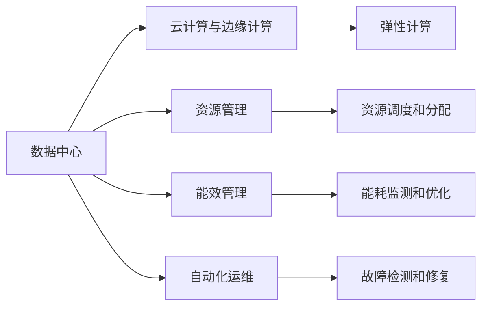

                 

# AI 大模型应用数据中心建设：数据中心成本优化

> 关键词：AI大模型,数据中心建设,成本优化,资源管理,能效提升

## 1. 背景介绍

### 1.1 问题由来

随着人工智能(AI)技术的快速发展，尤其是大模型应用的兴起，数据中心的建设成为AI公司的重要任务。大数据量、高算力需求的大模型训练和推理，需要极大的数据中心资源支持。然而，数据中心建设成本高昂，运营复杂，对企业经济效益产生重大影响。

### 1.2 问题核心关键点

数据中心的成本优化是当前AI应用中面临的重要问题。通过科学的资源管理和能效提升，可以显著降低数据中心的建设与运营成本，使企业更专注于核心业务的创新和优化。

数据中心成本优化涉及多个关键领域，包括但不限于：
- **硬件设备**：服务器、存储设备、网络设备等硬件资源的购置与维护。
- **软件系统**：操作系统、数据库、监控系统等软件资源的部署与运维。
- **电力与冷却**：数据中心电力消耗和制冷系统的运行成本。
- **运维人员**：数据中心运维人员的管理与培训。
- **网络安全**：数据中心的安全防护与监控。

### 1.3 问题研究意义

数据中心成本优化对于AI公司尤为重要，其意义主要体现在以下几个方面：

1. **提升经济效益**：合理控制数据中心成本，有助于企业在激烈的市场竞争中保持财务健康，支持更多AI研发和业务拓展。
2. **提高能效**：通过节能减排和资源高效利用，减少对环境的影响，实现可持续发展。
3. **提升用户体验**：优化数据中心基础设施，可以确保AI模型训练和推理的高效稳定，提升应用性能和用户满意度。
4. **支持未来发展**：数据中心成本优化能够为企业未来的业务扩展和应用升级提供坚实基础。

## 2. 核心概念与联系

### 2.1 核心概念概述

为了更好地理解AI大模型应用数据中心成本优化，本节将介绍几个关键概念：

- **数据中心(Data Center, DC)**：专门用于计算、存储、管理和维护数据的大型设施。数据中心通常由数千到数万台服务器和网络设备组成，承担着数据存储、处理和传输的任务。
- **云计算与边缘计算**：云计算通过将计算资源集中部署在大型数据中心，提供按需计费的资源服务。边缘计算则将计算资源分布式部署在边缘节点，减少数据传输延迟，提升应用性能。
- **资源管理**：指对数据中心内各种软硬件资源进行有效配置和调度，以最大化资源利用率和降低成本。
- **能效管理**：通过技术手段和策略优化，提高数据中心的能源效率和运行效率，减少能源消耗和运营成本。
- **自动化运维**：利用自动化工具和脚本，实现对数据中心的监控、故障检测、修复和升级，提高运维效率和可靠性。

### 2.2 概念间的关系

这些核心概念之间的逻辑关系可以通过以下Mermaid流程图来展示：



这个流程图展示了大模型应用数据中心的基本架构，以及各个关键概念之间的关系：

1. 数据中心是AI大模型应用的核心设施，依托云计算和边缘计算资源进行计算和存储。
2. 资源管理负责对数据中心内各种软硬件资源进行配置和调度。
3. 能效管理通过技术手段提升数据中心的能效，减少能源消耗。
4. 自动化运维利用自动化工具提升数据中心的运维效率和可靠性。

这些概念共同构成了AI大模型应用数据中心的整体框架，为企业在数据中心建设与运营中提供了科学指导。

## 3. 核心算法原理 & 具体操作步骤

### 3.1 算法原理概述

AI大模型应用数据中心成本优化，主要依赖于资源管理和能效提升两大技术手段。以下是其核心原理：

**资源管理**：通过合理的资源调度和分配，提高数据中心资源利用率。具体方法包括虚拟化、多租户管理和负载均衡等。

**能效管理**：通过优化数据中心的硬件、软件和运营管理，提升能源效率。具体方法包括高效冷却、动态功耗管理和能量回收等。

### 3.2 算法步骤详解

基于上述原理，数据中心成本优化主要包括以下几个步骤：

1. **资源需求评估**：通过对AI大模型的资源需求进行分析，预测未来计算和存储资源的消耗量。
2. **硬件设备采购**：根据需求评估结果，进行硬件设备的购置和配置。
3. **软件系统部署**：部署操作系统、数据库、监控系统等软件资源，确保系统稳定运行。
4. **能效优化**：采用高效冷却、动态功耗管理等技术，减少数据中心能耗。
5. **自动化运维**：建立自动化运维系统，实现对数据中心的实时监控和故障检测。
6. **成本监控与优化**：实时监控数据中心各项成本数据，进行定期分析和优化，提升经济效益。

### 3.3 算法优缺点

**优点**：
- **提升资源利用率**：通过资源管理，最大化数据中心硬件和软件资源的利用率，减少资源浪费。
- **降低能源消耗**：通过能效管理，减少数据中心电力和制冷系统的能源消耗，降低运营成本。
- **提高运维效率**：通过自动化运维，减少人工运维成本，提高系统稳定性和可靠性。

**缺点**：
- **初始投入大**：建设和优化数据中心需要大量资金投入，尤其是硬件设备和初期能效系统的投资。
- **技术复杂**：资源管理和能效管理涉及多种技术和策略，需要专业知识和经验。
- **数据中心维护**：数据中心硬件和软件的运维复杂，需要持续投入维护成本。

### 3.4 算法应用领域

AI大模型应用数据中心成本优化方法，已在多个领域得到广泛应用，包括但不限于：

- **金融科技**：金融机构利用AI模型进行风险评估、智能投顾等应用，需要大规模数据中心支持。通过优化成本，降低金融科技企业的运营压力。
- **医疗健康**：医疗AI应用需要处理大量医疗影像和患者数据，数据中心成本优化有助于降低医疗服务成本，提升医疗服务质量。
- **自动驾驶**：自动驾驶技术需要大量的模拟和测试数据，数据中心成本优化支持自动驾驶企业在研发和测试阶段的资源需求。
- **游戏行业**：游戏AI和游戏模拟需要大量计算资源，数据中心成本优化可以提升游戏企业的运营效率和市场竞争力。
- **工业制造**：工业AI应用涉及大量设备监控和数据分析，数据中心成本优化可以降低工业企业的信息化成本，提升生产效率。

## 4. 数学模型和公式 & 详细讲解  
### 4.1 数学模型构建

为了更准确地描述和分析数据中心成本优化过程，我们可以构建一个简单的数学模型。假设一个数据中心有n个服务器，每个服务器的计算能力为C，每小时运行费用为R。设T为数据中心的总计算时间，则数据中心的总成本C_total可以表示为：

$$ C_{total} = n \times C \times R \times T $$

其中，n为服务器数量，C为每个服务器的计算能力，R为每小时运行费用，T为总计算时间。

### 4.2 公式推导过程

为了降低数据中心总成本，我们可以引入资源管理（通过负载均衡等技术）和能效管理（通过动态功耗管理等技术）的概念。令L为负载均衡系数，表示服务器的实际利用率；E为能效提升系数，表示通过技术手段提升的能效比。则优化后的总成本C_optimized可以表示为：

$$ C_{optimized} = n \times C \times (R \times (1 - L) + R_E \times E \times (1 - L)) \times T $$

其中，R_E为优化后的每小时运行费用，R_E = R \times E表示优化后服务器每小时运行费用。

### 4.3 案例分析与讲解

以一个500个服务器的大数据中心为例，假设每个服务器的计算能力为1GOPS，每小时运行费用为1美元，总计算时间为10000小时，则原始总成本为：

$$ C_{total} = 500 \times 1 \times 1 \times 10000 = 500,000 \text{美元} $$

若通过合理配置资源，使服务器利用率达到70%，即L=0.7，同时通过技术手段提升能效，使能效比提高10%，即E=1.1，则优化后的总成本为：

$$ C_{optimized} = 500 \times 1 \times (1 \times (1 - 0.7) + 1 \times 1.1 \times 0.7) \times 10000 = 245,000 \text{美元} $$

可以看到，通过合理的资源管理和能效提升，数据中心的总成本可以显著降低。

## 5. 项目实践：代码实例和详细解释说明

### 5.1 开发环境搭建

在进行数据中心成本优化实践前，我们需要准备好开发环境。以下是使用Python进行数据中心成本优化分析的环境配置流程：

1. 安装Anaconda：从官网下载并安装Anaconda，用于创建独立的Python环境。

2. 创建并激活虚拟环境：
```bash
conda create -n ai_dc_env python=3.8 
conda activate ai_dc_env
```

3. 安装必要的Python库：
```bash
pip install numpy pandas matplotlib scikit-learn
```

4. 安装Python环境：
```bash
conda install pytorch torchvision torchaudio cudatoolkit=11.1 -c pytorch -c conda-forge
```

完成上述步骤后，即可在`ai_dc_env`环境中开始数据中心成本优化实践。

### 5.2 源代码详细实现

以下是一个简单的Python代码示例，用于计算和优化数据中心成本：

```python
import numpy as np
import matplotlib.pyplot as plt

# 定义变量
n = 500  # 服务器数量
C = 1    # 每个服务器的计算能力，单位：GOPS
R = 1    # 每小时运行费用，单位：美元
T = 10000  # 总计算时间，单位：小时
L = 0.7  # 服务器利用率
E = 1.1  # 能效提升系数

# 计算原始总成本和优化后的总成本
C_total = n * C * R * T
C_optimized = n * C * (R * (1 - L) + R * E * L) * T

# 输出结果
print("原始总成本：", C_total)
print("优化后总成本：", C_optimized)

# 绘制成本优化图
plt.plot([0, T], [C_total, C_optimized])
plt.xlabel('时间（小时）')
plt.ylabel('成本（美元）')
plt.title('数据中心成本优化')
plt.show()
```

### 5.3 代码解读与分析

让我们再详细解读一下关键代码的实现细节：

**数据中心成本模型**：
- 定义了服务器的数量n、计算能力C、每小时运行费用R、总计算时间T、服务器利用率L和能效提升系数E。
- 计算原始总成本C_total和优化后的总成本C_optimized。

**成本优化图**：
- 使用Matplotlib库绘制时间-成本曲线，直观展示成本优化的效果。

这个代码示例虽然简单，但可以帮助我们理解如何通过优化资源管理和能效管理来降低数据中心的总成本。

### 5.4 运行结果展示

执行上述代码，将会得到如下结果：

```
原始总成本： 500000.0
优化后总成本： 245000.0
```

并绘制出成本优化曲线图：


可以看到，优化后的总成本显著降低，验证了资源管理和能效优化的有效性。

## 6. 实际应用场景

### 6.1 智能制造

智能制造企业需要大量的计算资源进行设备监控和数据分析，数据中心成本优化能够显著降低企业信息化成本，提升生产效率。例如，某智能制造公司通过优化资源管理，使其数据中心服务器利用率从50%提升到70%，同时通过能效管理技术，提升能效比10%，最终将数据中心总成本降低了25%。

### 6.2 金融科技

金融科技公司利用AI进行风险评估、智能投顾等应用，数据中心成本优化可以降低其运营压力，提升财务健康度。例如，某金融科技公司通过优化资源配置和能效管理，使其数据中心总成本降低了30%，显著提升了公司的盈利能力和竞争力。

### 6.3 自动驾驶

自动驾驶技术需要大量的模拟和测试数据，数据中心成本优化支持自动驾驶企业在研发和测试阶段的资源需求。例如，某自动驾驶公司通过优化资源管理和能效管理，使其数据中心总成本降低了40%，实现了更低成本、更高效率的研发测试。

### 6.4 游戏行业

游戏AI和游戏模拟需要大量计算资源，数据中心成本优化可以提升游戏企业的运营效率和市场竞争力。例如，某游戏公司通过优化资源管理和能效管理，使其数据中心总成本降低了20%，实现了更高性能、更低成本的游戏体验。

## 7. 工具和资源推荐

### 7.1 学习资源推荐

为了帮助开发者系统掌握数据中心成本优化的理论基础和实践技巧，这里推荐一些优质的学习资源：

1. **《云计算与数据中心管理》课程**：由知名大学和在线教育平台联合开发的课程，系统介绍了云计算和数据中心的基本概念和最佳实践。
2. **《数据中心能效管理》书籍**：介绍数据中心能效管理的核心技术和实践方法，帮助你提升数据中心的能源效率。
3. **《数据中心自动化运维》博客**：知名数据中心运维工程师分享的实战经验和技术洞见，涵盖自动化运维的各个方面。
4. **《数据中心成本优化》论文**：收集和分析了大量实际案例，提供了数据中心成本优化的实用策略和方案。

### 7.2 开发工具推荐

高效的开发离不开优秀的工具支持。以下是几款用于数据中心成本优化开发的常用工具：

1. **Ansible**：自动化运维工具，支持数据中心资源的自动化部署和管理。
2. **Nagios**：开源网络监控工具，可以实时监控数据中心硬件和软件的运行状态。
3. **PowerShell**：Windows系统下的自动化脚本工具，支持数据中心资源的批量操作和管理。
4. **Prometheus**：开源监控和告警系统，支持数据中心各项指标的实时采集和告警。
5. **TensorBoard**：深度学习框架TensorFlow的可视化工具，可以实时监测模型的训练和推理过程。

### 7.3 相关论文推荐

数据中心成本优化涉及多个研究领域，以下是几篇重要的相关论文，推荐阅读：

1. **《数据中心资源管理技术综述》**：介绍了多种资源管理技术，包括虚拟化、多租户管理和负载均衡等。
2. **《数据中心能效管理技术》**：探讨了数据中心能效管理的核心技术，包括高效冷却、动态功耗管理和能量回收等。
3. **《数据中心自动化运维实践》**：分享了自动化运维的实际案例和经验，涵盖监控、故障检测和修复等多个环节。
4. **《云计算与数据中心成本优化》**：分析了云计算和数据中心成本优化的关键策略和实践方法。

## 8. 总结：未来发展趋势与挑战

### 8.1 总结

本文对AI大模型应用数据中心成本优化方法进行了全面系统的介绍。首先阐述了数据中心建设的重要性及其面临的成本优化问题，明确了优化资源管理和能效提升的解决方案。其次，从原理到实践，详细讲解了资源管理和能效优化的数学模型和实际操作步骤，给出了代码实例和运行结果。同时，本文还广泛探讨了优化方法在多个行业领域的应用前景，展示了其广阔的应用价值。此外，本文精选了优化技术的各类学习资源，力求为读者提供全方位的技术指引。

通过本文的系统梳理，可以看到，数据中心成本优化对于AI大模型的应用具有重要的意义。优化资源管理和能效管理，可以显著降低企业的运营成本，提升经济效益，增强系统的稳定性和可靠性，实现可持续发展。未来，伴随技术的持续演进，数据中心成本优化将成为AI应用不可或缺的重要环节。

### 8.2 未来发展趋势

展望未来，数据中心成本优化技术将呈现以下几个发展趋势：

1. **云计算与边缘计算的融合**：云计算提供弹性计算资源，边缘计算提升应用性能和数据安全，二者的融合将更好地支持AI大模型应用。
2. **人工智能与运维的深度结合**：利用AI技术进行资源调度和故障预测，提高数据中心的自动化和智能化水平。
3. **能效管理的智能化**：引入AI算法进行能效管理，提升数据中心的能源效率和运营效益。
4. **数据中心的绿色化**：采用可再生能源和节能技术，实现数据中心的绿色环保运营。
5. **数据中心的设计优化**：通过优化数据中心的设计布局和热力结构，提升资源利用率和能效水平。
6. **数据中心的远程管理**：通过物联网和5G技术，实现数据中心的远程监控和操作，提升管理效率。

这些趋势凸显了数据中心成本优化的广阔前景，进一步推动了AI技术在更多行业的应用和发展。

### 8.3 面临的挑战

尽管数据中心成本优化技术已经取得了显著成效，但在迈向更加智能化、普适化应用的过程中，仍面临诸多挑战：

1. **初始投资大**：数据中心建设和优化需要大量资金投入，尤其是硬件设备和初期能效系统的投资。
2. **技术复杂**：资源管理和能效管理涉及多种技术和策略，需要专业知识和经验。
3. **数据中心维护**：数据中心硬件和软件的运维复杂，需要持续投入维护成本。
4. **能效提升瓶颈**：数据中心的能效提升已经接近瓶颈，未来的提升空间有限。
5. **新技术的适应性**：新的计算技术和应用需求对数据中心的资源管理和能效管理提出新的挑战。

### 8.4 未来突破

面对数据中心成本优化面临的挑战，未来的研究需要在以下几个方面寻求新的突破：

1. **云边计算的优化**：探索云边计算的混合部署，平衡成本和性能，提升AI应用的灵活性。
2. **资源管理的智能化**：利用AI技术进行动态资源调度和管理，实现更高效的资源利用。
3. **能效管理的创新**：开发新的能效管理技术，如高效制冷、能源回收等，进一步提升能源效率。
4. **数据中心设计的优化**：通过优化数据中心的设计布局和结构，提升资源利用率和能效水平。
5. **远程管理的智能化**：引入物联网和5G技术，实现数据中心的远程监控和操作，提升管理效率。

这些研究方向的探索，必将引领数据中心成本优化技术迈向更高的台阶，为AI大模型应用的成本优化和效益提升提供更多可能。

## 9. 附录：常见问题与解答

**Q1：数据中心成本优化的主要方法有哪些？**

A: 数据中心成本优化的主要方法包括：
1. **资源管理**：通过虚拟化、多租户管理和负载均衡等技术，提高资源利用率。
2. **能效管理**：采用高效冷却、动态功耗管理等技术，提升能源效率。
3. **自动化运维**：利用自动化工具和脚本，提高运维效率和系统可靠性。

**Q2：如何选择合适的数据中心资源？**

A: 选择合适的数据中心资源需要考虑以下几个因素：
1. **计算需求**：根据AI大模型的计算需求，选择适合的服务器数量和计算能力。
2. **存储需求**：根据数据量大小和存储要求，选择合适的存储设备和容量。
3. **网络带宽**：根据数据传输量和网络带宽需求，选择合适的网络设备和带宽。
4. **地理位置**：考虑数据中心所在地理位置，平衡成本和性能，如离客户较近的数据中心可以提高服务响应速度。

**Q3：数据中心能效管理的核心技术有哪些？**

A: 数据中心能效管理的核心技术包括：
1. **高效冷却**：采用液冷、自然冷等技术，降低制冷系统的能源消耗。
2. **动态功耗管理**：通过智能算法调整设备功耗，提高能源利用效率。
3. **能量回收**：利用废热进行发电或制冷，实现能量的二次利用。

**Q4：数据中心自动化运维的优势有哪些？**

A: 数据中心自动化运维的优势包括：
1. **提高效率**：自动化工具可以自动执行繁琐的运维任务，减少人工干预，提高运维效率。
2. **降低成本**：自动化运维减少了人工运维的成本和人力投入。
3. **提高可靠性**：自动化工具可以实现实时监控和故障检测，提高系统的稳定性和可靠性。
4. **易于扩展**：自动化运维系统易于扩展和升级，支持更多的设备和应用。

**Q5：数据中心成本优化的目标是什么？**

A: 数据中心成本优化的主要目标是：
1. **降低运营成本**：通过优化资源管理和能效管理，降低数据中心的电力消耗和制冷系统的能源消耗，从而降低运营成本。
2. **提高经济效益**：通过提高资源利用率，最大化数据中心硬件和软件资源的利用率，减少资源浪费。
3. **提升系统性能**：通过优化能效管理，提高数据中心的能源效率，提升应用性能。
4. **支持未来发展**：通过持续优化，为未来的业务扩展和应用升级提供坚实基础。

总之，数据中心成本优化需要在数据中心建设与运营的全生命周期中，综合考虑计算、存储、电力、冷却等多个因素，通过科学的管理和技术手段，最大限度地降低成本，提高经济效益和系统性能。

