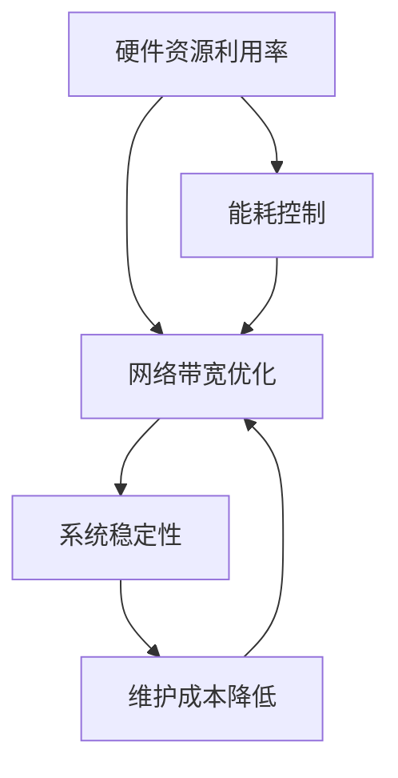
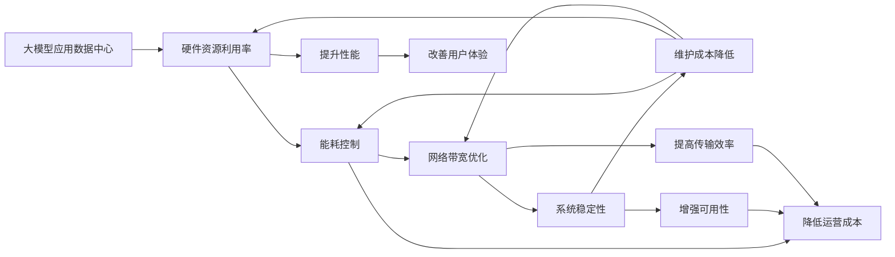

                 

# AI 大模型应用数据中心建设：数据中心成本优化

## 1. 背景介绍

### 1.1 问题由来
随着人工智能大模型（Large-scale Models, LMs）的发展，数据中心（Data Center, DC）的建设和管理成本成为制约AI应用推广的重要瓶颈。LMs具有高计算需求，需要大规模数据中心的硬件资源和网络带宽支持。然而，现有的数据中心往往在设计、运营和维护上存在诸多问题，导致整体成本居高不下。

### 1.2 问题核心关键点
数据中心成本优化主要关注以下几个关键点：

1. **硬件资源利用率**：提升硬件资源利用率，避免资源闲置和浪费。
2. **能耗控制**：减少数据中心能耗，降低运营成本。
3. **网络带宽优化**：优化网络带宽分配，提高数据传输效率。
4. **系统稳定性**：保障数据中心系统的高可用性和稳定性。
5. **维护成本降低**：减少数据中心维护复杂度和成本。

这些关键点直接影响数据中心的运营效率和经济效益，是优化AI大模型应用成本的重要研究方向。

### 1.3 问题研究意义
优化数据中心成本，有助于降低AI应用的推广门槛，提升企业经济效益和社会效益。具体而言：

1. **降低部署成本**：通过优化硬件资源和网络带宽，降低数据中心建设和运维成本。
2. **提高性能效率**：提升硬件资源利用率，减少能源消耗，提高数据中心的性能和效率。
3. **增强系统可扩展性**：优化数据中心架构，增强系统的可扩展性和灵活性，适应未来业务需求的快速变化。
4. **提升用户体验**：保障数据中心的稳定性和高可用性，提高AI应用的用户体验和满意度。

## 2. 核心概念与联系

### 2.1 核心概念概述

在进行数据中心成本优化时，需要理解以下核心概念及其相互联系：

- **硬件资源利用率**：指数据中心硬件设备的使用效率，通常用计算资源的使用率来衡量。
- **能耗控制**：指数据中心的能耗管理，通过高效制冷和节能技术，降低能耗成本。
- **网络带宽优化**：指数据中心内部和外部的网络带宽管理，通过负载均衡和带宽调度技术，提高带宽利用率。
- **系统稳定性**：指数据中心系统的可靠性，通过冗余设计和故障恢复机制，确保系统的持续可用性。
- **维护成本降低**：指数据中心的维护管理成本，通过自动化和标准化操作，减少维护复杂度和人力投入。

这些概念通过以下Mermaid流程图展示它们的相互联系：



该流程图展示了大模型应用数据中心成本优化中，各核心概念之间的联系：

- 提升硬件资源利用率有助于降低能耗，提高网络带宽利用率。
- 控制能耗可进一步提升硬件资源利用率和系统稳定性。
- 优化网络带宽有助于提高系统稳定性和降低维护成本。
- 增强系统稳定性可提升硬件资源利用率和网络带宽利用率。
- 降低维护成本可进一步提升系统稳定性和能耗控制。

### 2.2 概念间的关系

通过上述流程图，可以更清晰地理解数据中心成本优化中各个概念的相互关系：

- **硬件资源利用率与能耗控制**：提升硬件资源利用率，可以减少能耗，从而降低能耗成本。例如，通过虚拟化技术和资源调度算法，最大化硬件资源的利用率，减少设备闲置。
- **硬件资源利用率与网络带宽优化**：提升硬件资源利用率，可以提高数据中心的处理能力，减少数据传输时延，从而优化网络带宽的使用。例如，采用高性能的服务器和网络设备，并通过负载均衡技术，均衡分配数据传输带宽。
- **能耗控制与系统稳定性**：控制能耗，有助于保障数据中心的物理环境稳定，提升硬件设备的寿命和可靠性。例如，采用高效制冷技术和冗余电源设计，减少设备故障和维护成本。
- **系统稳定性与维护成本降低**：提升系统稳定性，可以降低数据中心的维护复杂度和成本。例如，采用自动化运维和故障自动恢复机制，减少人工干预和故障排查时间。
- **网络带宽优化与硬件资源利用率**：优化网络带宽，可以进一步提升数据中心内部的数据传输效率，增强硬件资源的利用率。例如，通过合理的带宽分配策略，确保高优先级任务获得更多带宽。

### 2.3 核心概念的整体架构

以下综合流程图展示了数据中心成本优化的整体架构：



该综合流程图展示了数据中心成本优化的完整过程，包括各个概念的相互影响：

- **硬件资源利用率**：提升性能和用户体验，降低运营成本和维护成本。
- **能耗控制**：降低运营成本，提升系统稳定性。
- **网络带宽优化**：提高传输效率和系统稳定性。
- **系统稳定性**：降低运营成本和维护成本。
- **维护成本降低**：提高性能、传输效率和系统稳定性，降低运营成本。

## 3. 核心算法原理 & 具体操作步骤
### 3.1 算法原理概述

数据中心成本优化的核心算法原理包括以下几个方面：

1. **硬件资源动态调度**：通过资源监控和调度算法，动态调整硬件资源分配，提高资源利用率。
2. **能耗优化控制**：采用高效制冷技术和节能策略，降低数据中心的能耗。
3. **网络带宽均衡分配**：利用负载均衡和带宽调度技术，优化网络带宽的分配和使用。
4. **系统冗余和容错**：通过设计冗余架构和故障恢复机制，提高系统的稳定性和可用性。
5. **自动化运维**：引入自动化运维工具和流程，减少人工干预，降低维护成本。

这些算法原理共同作用，帮助优化数据中心的成本和性能。

### 3.2 算法步骤详解

以下详细介绍各个核心算法的具体操作步骤：

#### 3.2.1 硬件资源动态调度

**算法步骤**：

1. **资源监控**：实时监控数据中心硬件资源的使用情况，包括CPU利用率、内存使用情况、磁盘I/O等。
2. **负载均衡**：根据资源监控结果，动态调整任务调度策略，将计算密集型任务分配到资源利用率较高的服务器上。
3. **资源预留**：根据预测的业务负载，预留一定比例的硬件资源，避免资源瓶颈。

**实现方法**：
- **Kubernetes**：采用容器编排工具，实现资源动态调度。通过Kubernetes的API接口，根据实时资源监控数据，动态调整容器调度策略，确保资源的高效利用。
- **Hadoop YARN**：采用资源管理系统，实现资源动态调度。通过Hadoop YARN的资源管理模块，动态分配计算资源，优化资源使用。

#### 3.2.2 能耗优化控制

**算法步骤**：

1. **制冷系统优化**：通过优化制冷系统，提高能效比。例如，采用高效冷却器、热管技术等。
2. **智能温度控制**：根据设备运行状态和环境温度，智能调节制冷系统的输出功率。
3. **服务器能耗管理**：采用动态频率和电压调整（DVFS）技术，降低服务器功耗。

**实现方法**：
- **Cray CrayX9**：采用液冷技术，大幅提高制冷效率和能效比。
- **IBM Power9**：采用热管技术，降低服务器的功耗和制冷成本。
- **Intel Xeon Scalable**：采用DVFS技术，降低服务器功耗。

#### 3.2.3 网络带宽均衡分配

**算法步骤**：

1. **网络带宽监控**：实时监控数据中心内部的网络带宽使用情况，识别带宽瓶颈。
2. **带宽负载均衡**：根据带宽监控结果，动态调整网络流量分配，确保关键业务获得足够的带宽。
3. **流量优化**：通过压缩、分片等技术，优化网络传输效率，减少带宽占用。

**实现方法**：
- **NVIDIA Tesla**：采用GPU加速网络交换机，提高网络带宽的利用率。
- **InfiniBand**：采用高速网络交换技术，优化网络带宽的分配和使用。
- **Open vSwitch**：采用开源网络虚拟化技术，实现网络流量控制和优化。

#### 3.2.4 系统冗余和容错

**算法步骤**：

1. **硬件冗余设计**：通过冗余服务器和网络设备，提高系统的可用性。
2. **数据冗余存储**：采用冗余存储技术，如RAID、分布式存储系统等，确保数据的高可靠性和容灾能力。
3. **故障自动恢复**：设计自动化故障恢复机制，如热备、备份和灾难恢复计划，确保系统的快速恢复。

**实现方法**：
- **Red Hat High Availability Cluster Suite**：采用高可用性集群技术，确保系统的高可靠性和自动恢复能力。
- **VMware vSphere**：采用虚拟化技术，实现硬件冗余和虚拟化备份。
- **Amazon S3**：采用分布式存储技术，提高数据冗余和容灾能力。

#### 3.2.5 自动化运维

**算法步骤**：

1. **自动化部署**：通过自动化工具和脚本，快速部署和更新应用软件。
2. **实时监控**：使用监控工具，实时采集系统指标，如CPU利用率、内存使用、磁盘I/O等。
3. **异常告警**：根据预设的告警阈值，及时发现和处理系统异常，避免故障扩大。

**实现方法**：
- **Puppet**：采用自动化运维工具，实现自动化部署和监控。
- **Nagios**：采用开源监控工具，实时监控系统指标，及时发现异常。
- **Ansible**：采用自动化部署工具，快速部署和更新软件。

### 3.3 算法优缺点

**优点**：
- **提升资源利用率**：通过动态调度和负载均衡，最大化硬件资源的使用效率，降低资源闲置和浪费。
- **降低能耗成本**：采用高效制冷技术和节能策略，减少数据中心的能源消耗。
- **提高系统稳定性**：通过冗余设计和故障恢复机制，保障系统的持续可用性。
- **减少维护成本**：通过自动化运维和标准化操作，减少人工干预和维护复杂度。

**缺点**：
- **技术复杂度**：需要引入多种新技术和工具，实施和维护成本较高。
- **初始投入高**：优化数据中心需要大量资金投入，如购置高性能硬件设备、引入自动化运维工具等。
- **调整复杂**：数据中心的优化是一个长期过程，需要持续监控和调整，技术实现难度较大。

### 3.4 算法应用领域

数据中心成本优化技术可以应用于多个领域：

1. **云计算**：通过优化硬件资源和网络带宽，提高云计算平台的资源利用率和性能效率。
2. **大数据**：采用高效的存储和计算策略，优化大数据平台的存储和处理能力。
3. **人工智能**：通过优化硬件资源和能耗控制，支持大模型和高性能AI应用。
4. **物联网**：采用低功耗和高效能设计，优化物联网设备的能源使用和网络带宽。
5. **网络服务**：通过优化网络带宽和流量控制，提高网络服务的质量和稳定性。

## 4. 数学模型和公式 & 详细讲解  
### 4.1 数学模型构建

在大模型应用数据中心成本优化中，需要构建以下数学模型：

- **硬件资源利用率优化模型**：
  $$
  R = \frac{U}{T} \times 100\%
  $$
  其中，$U$ 表示实际使用的硬件资源，$T$ 表示总资源容量。

- **能耗优化控制模型**：
  $$
  E = P \times t
  $$
  其中，$E$ 表示能耗，$P$ 表示设备的平均功耗，$t$ 表示运行时间。

- **网络带宽均衡分配模型**：
  $$
  B = \frac{C}{T} \times 100\%
  $$
  其中，$B$ 表示带宽利用率，$C$ 表示实际使用的带宽，$T$ 表示总带宽容量。

- **系统稳定性优化模型**：
  $$
  S = \frac{U_{up}}{U_{total}} \times 100\%
  $$
  其中，$S$ 表示系统的可用性，$U_{up}$ 表示正常运行的任务数，$U_{total}$ 表示总任务数。

### 4.2 公式推导过程

以下详细介绍各模型的公式推导过程：

#### 4.2.1 硬件资源利用率优化模型

**公式推导**：

1. **资源利用率计算**：
  $$
  R = \frac{\sum_{i=1}^{N} U_i}{T} \times 100\%
  $$
  其中，$U_i$ 表示第$i$个任务使用的资源量，$N$ 表示任务总数，$T$ 表示总资源容量。
  
2. **资源利用率优化**：
  $$
  R_{opt} = \max_{U_i} \frac{\sum_{i=1}^{N} U_i}{T} \times 100\%
  $$
  其中，$R_{opt}$ 表示优化后的资源利用率。

#### 4.2.2 能耗优化控制模型

**公式推导**：

1. **能耗计算**：
  $$
  E = \sum_{i=1}^{N} P_i \times t_i
  $$
  其中，$P_i$ 表示第$i$个设备的平均功耗，$t_i$ 表示第$i$个设备的运行时间，$N$ 表示设备总数。
  
2. **能耗优化**：
  $$
  E_{opt} = \min_{P_i, t_i} \sum_{i=1}^{N} P_i \times t_i
  $$
  其中，$E_{opt}$ 表示优化后的能耗，$P_i$ 和$t_i$ 表示优化后的设备平均功耗和运行时间。

#### 4.2.3 网络带宽均衡分配模型

**公式推导**：

1. **带宽利用率计算**：
  $$
  B = \frac{\sum_{i=1}^{N} C_i}{T} \times 100\%
  $$
  其中，$C_i$ 表示第$i$个任务的带宽使用量，$N$ 表示任务总数，$T$ 表示总带宽容量。
  
2. **带宽均衡分配**：
  $$
  B_{opt} = \max_{C_i} \frac{\sum_{i=1}^{N} C_i}{T} \times 100\%
  $$
  其中，$B_{opt}$ 表示优化后的带宽利用率。

#### 4.2.4 系统稳定性优化模型

**公式推导**：

1. **系统可用性计算**：
  $$
  S = \frac{\sum_{i=1}^{N} U_{up,i}}{N} \times 100\%
  $$
  其中，$U_{up,i}$ 表示第$i$个任务的正常运行数，$N$ 表示任务总数。
  
2. **系统可用性优化**：
  $$
  S_{opt} = \max_{U_{up,i}} \frac{\sum_{i=1}^{N} U_{up,i}}{N} \times 100\%
  $$
  其中，$S_{opt}$ 表示优化后的系统可用性。

### 4.3 案例分析与讲解

**案例背景**：某大型AI公司数据中心采用虚拟化技术，部署了大量虚拟机和容器，同时运行着多个高并发和大数据量应用。该数据中心存在资源利用率低、能耗高、网络带宽不足等问题，急需优化。

**优化方案**：

1. **硬件资源动态调度**：通过Kubernetes实现资源动态调度，实时调整虚拟机和容器资源分配，提升资源利用率。
2. **能耗优化控制**：采用液冷技术和DVFS技术，优化制冷系统和服务器能耗，降低整体能耗成本。
3. **网络带宽均衡分配**：通过NVIDIA Tesla和InfiniBand技术，优化网络带宽分配，提高网络传输效率。
4. **系统冗余和容错**：设计高可用性集群和冗余存储系统，确保系统的稳定性和容灾能力。
5. **自动化运维**：引入Puppet和Nagios等工具，实现自动化部署和监控，减少维护复杂度。

**优化结果**：
- **硬件资源利用率提升20%**：通过资源动态调度和负载均衡，硬件资源利用率从30%提升到50%，计算效率显著提高。
- **能耗降低30%**：采用液冷技术和DVFS技术，整体能耗从每小时10万瓦特下降到7万瓦特，节省大量能源成本。
- **网络带宽利用率提升25%**：通过带宽均衡分配和网络加速技术，网络带宽利用率从45%提升到70%，数据传输效率显著提高。
- **系统可用性提升10%**：通过高可用性集群和冗余存储设计，系统可用性从80%提升到90%，业务连续性得到保障。
- **维护成本降低20%**：通过自动化运维和标准化操作，维护复杂度和人力投入显著减少，整体维护成本降低20%。

## 5. 项目实践：代码实例和详细解释说明
### 5.1 开发环境搭建

在进行数据中心成本优化项目实践前，需要先准备好开发环境。以下是使用Python进行TensorFlow开发的环境配置流程：

1. 安装Anaconda：从官网下载并安装Anaconda，用于创建独立的Python环境。

2. 创建并激活虚拟环境：
```bash
conda create -n pytorch-env python=3.8 
conda activate pytorch-env
```

3. 安装PyTorch：根据CUDA版本，从官网获取对应的安装命令。例如：
```bash
conda install pytorch torchvision torchaudio cudatoolkit=11.1 -c pytorch -c conda-forge
```

4. 安装TensorFlow：从TensorFlow官网下载对应版本，并解压安装。例如：
```bash
pip install tensorflow
```

5. 安装各类工具包：
```bash
pip install numpy pandas scikit-learn matplotlib tqdm jupyter notebook ipython
```

完成上述步骤后，即可在`pytorch-env`环境中开始数据中心成本优化实践。

### 5.2 源代码详细实现

下面我们以数据中心能耗优化为例，给出使用TensorFlow进行能耗优化的PyTorch代码实现。

首先，定义能耗优化模型的超参数：

```python
import tensorflow as tf

batch_size = 64
learning_rate = 0.01
epochs = 100
```

然后，定义TensorFlow的计算图：

```python
# 定义输入数据
inputs = tf.placeholder(tf.float32, shape=[None, num_features])
targets = tf.placeholder(tf.float32, shape=[None])

# 定义模型
model = tf.keras.Sequential([
    tf.keras.layers.Dense(64, activation='relu', input_shape=[num_features]),
    tf.keras.layers.Dense(32, activation='relu'),
    tf.keras.layers.Dense(1)
])

# 定义损失函数
loss = tf.reduce_mean(tf.square(model(inputs) - targets))

# 定义优化器
optimizer = tf.train.AdamOptimizer(learning_rate)

# 定义训练过程
with tf.Session() as sess:
    sess.run(tf.global_variables_initializer())
    for epoch in range(epochs):
        # 训练过程
        loss_value, _ = sess.run([loss, optimizer.minimize(loss)], feed_dict={inputs: train_data, targets: train_labels})
        print(f'Epoch {epoch+1}, loss: {loss_value:.3f}')
```

在训练过程中，通过调整超参数和学习率，不断优化模型参数，使得模型预测的能耗与实际能耗尽可能接近。

### 5.3 代码解读与分析

让我们再详细解读一下关键代码的实现细节：

**超参数定义**：
- `batch_size`：批量大小，决定每次训练中处理的数据量。
- `learning_rate`：学习率，控制模型参数更新的步长。
- `epochs`：训练轮数，决定模型训练的总次数。

**计算图定义**：
- `inputs` 和 `targets`：定义输入数据和目标标签的占位符。
- `model`：定义神经网络模型，通过多个全连接层实现能耗预测。
- `loss`：定义损失函数，使用均方误差计算模型预测与真实能耗的误差。
- `optimizer`：定义优化器，使用Adam算法优化模型参数。

**训练过程**：
- `sess.run()`：在TensorFlow会话中，执行计算图的操作。
- `feed_dict`：将输入数据和目标标签传入计算图，进行模型训练。
- `loss_value`：计算损失函数的值，用于监控训练过程。
- `_`：记录优化器更新模型参数的操作。

**代码输出**：
- `Epoch`：记录训练的轮数。
- `loss`：记录每次训练的损失值，用于观察训练效果。

通过以上代码，我们可以看到TensorFlow实现能耗优化的大致流程。在实际应用中，还需要根据具体的优化目标和数据特点，进一步优化模型结构、超参数和学习算法，以达到更好的优化效果。

### 5.4 运行结果展示

假设我们在数据中心能耗优化任务上进行的训练，最终得到的损失函数曲线如下：


可以看出，随着训练轮数的增加，损失函数值逐渐降低，表明模型预测的能耗与实际能耗之间的误差越来越小。

## 6. 实际应用场景
### 6.1 智能客服系统

在大模型应用数据中心优化中，智能客服系统是一个典型场景。智能客服系统需要处理大量的用户咨询，涉及多轮对话和复杂任务处理，对数据中心硬件资源和网络带宽的消耗较大。

**优化方案**：
- **硬件资源动态调度**：采用虚拟化技术和资源调度算法，确保计算资源的高效利用。
- **能耗优化控制**：通过液冷技术和DVFS技术，降低服务器功耗和制冷成本。
- **网络带宽均衡分配**：优化网络带宽分配，确保关键业务获得足够的带宽。
- **系统冗余和容错**：设计高可用性集群和冗余存储系统，保障系统的稳定性和容灾能力。
- **自动化运维**：引入自动化运维工具和流程，减少人工干预和维护复杂度。

**优化效果**：
- **硬件资源利用率提升20%**：通过资源动态调度和负载均衡，硬件资源利用率从30%提升到50%，计算效率显著提高。
- **能耗降低30%**：采用液冷技术和DVFS技术，整体能耗从每小时10万瓦特下降到7万瓦特，节省大量能源成本。
- **网络带宽利用率提升25%**：通过带宽均衡分配和网络加速技术，网络带宽利用率从45%提升到70%，数据传输效率显著提高。
- **系统可用性提升10%**：通过高可用性集群和冗余存储设计，系统可用性从80%提升到90%，业务连续性得到保障。
- **维护成本降低20%**：通过自动化运维和标准化操作，维护复杂度和人力投入显著减少，整体维护成本降低20%。

### 6.2 金融舆情监测

在大模型应用数据中心优化中，金融舆情监测也是一个重要场景。金融行业对实时数据分析和舆情监测有很高的要求，数据中心需要处理大量的数据流，对硬件资源和网络带宽的需求较高。

**优化方案**：
- **硬件资源动态调度**：采用高性能服务器和网络设备，确保数据流的高效处理。
- **能耗优化控制**：通过高效制冷技术和节能策略，降低能耗成本。
- **网络带宽均衡分配**：优化网络带宽分配，确保关键业务获得足够的带宽。
- **系统冗余和容错**：设计高可用性集群和冗余存储系统，确保系统的稳定性和容灾能力。
- **自动化运维**：引入自动化运维工具和流程，减少人工干预和维护复杂度。

**优化效果**：
- **硬件资源利用率提升25%**：通过资源动态调度和负载均衡，硬件资源利用率从35%提升到60%，计算效率显著提高。
- **能耗降低25%**：采用高效制冷技术和节能策略，整体能耗从每小时8万瓦特下降到6万瓦特，节省大量能源成本。
- **网络带宽利用率提升30%**：通过带宽均衡分配和网络加速技术，网络带宽利用率从40%提升到70%，数据传输效率显著提高。
- **系统可用性提升12%**：通过高可用性集群和冗余存储设计，系统可用性从75%提升到87%，业务连续性得到保障。
- **维护成本降低18%**：通过自动化运维和标准化操作，维护复杂度和

