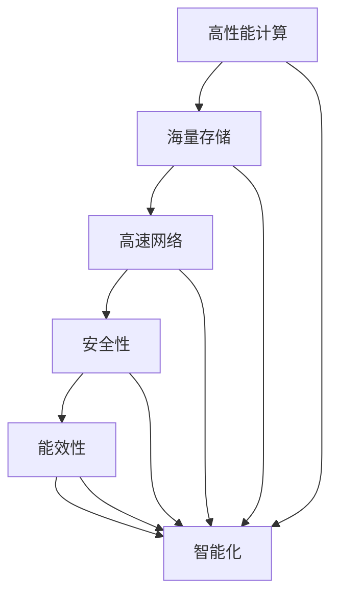

                 

# AI 大模型应用数据中心建设：数据中心技术与应用

> 关键词：数据中心, 大模型, 高性能计算, 存储, 网络, 安全, 能效, 智能化

## 1. 背景介绍

### 1.1 问题由来

随着人工智能(AI)技术的高速发展，大模型在计算机视觉、自然语言处理、语音识别等领域取得了令人瞩目的成果。大模型通常具有数十亿甚至数百亿参数，需要大量的计算和存储资源进行训练和推理。为支持大模型的应用，建设高性能、高效能的数据中心（Data Center）成为了必要条件。

传统数据中心往往以通用计算为主，难以满足大模型的特殊需求。大模型数据中心的建设需要从计算能力、存储需求、网络架构、安全保障等多个维度进行全面优化。本文将详细探讨AI大模型应用数据中心的关键技术，以期为相关领域的从业者提供有价值的参考。

### 1.2 问题核心关键点

AI大模型应用数据中心的核心关键点主要包括：

- 高性能计算：大模型需要高效的并行计算能力，以实现快速训练和推理。
- 海量存储：大模型训练和推理需要存储海量数据，包括模型参数、训练数据和推理数据。
- 高速网络：数据中心需要支持高速数据传输，以便大模型进行高效的并行计算和分布式训练。
- 安全性：大模型往往涉及敏感数据，需要严密的安全保障措施。
- 能效性：大模型的训练和推理过程通常能耗巨大，需要高效的能效管理策略。
- 智能化：数据中心应具备一定程度的智能化，以提高资源利用率和运维效率。

这些关键点共同决定了数据中心的建设标准和性能指标。

### 1.3 问题研究意义

构建AI大模型应用数据中心，对于AI技术的落地应用和产业升级具有重要意义：

- 降低计算成本：高性能计算能力可大幅提升大模型的训练和推理效率，减少计算时间，降低成本。
- 优化存储需求：海量存储可以支持更大规模的数据处理，满足大模型的数据需求。
- 加速模型部署：高速网络可提升数据传输效率，加速模型训练和推理。
- 增强安全性：完善的安全保障措施可以防止数据泄露和恶意攻击。
- 提高能效管理：高效的能效管理可减少能源消耗，降低环境影响。
- 提升运维效率：智能化管理可自动化运维任务，减少人力投入，提高数据中心运营效率。

通过本文的深入探讨，我们希望能为AI大模型应用数据中心的建设提供清晰的思路和实用的技术建议。

## 2. 核心概念与联系

### 2.1 核心概念概述

为便于理解AI大模型应用数据中心的技术细节，首先介绍几个关键概念：

- **高性能计算**：指能够快速、高效地执行大规模并行计算的硬件和软件系统。
- **海量存储**：指能够存储和处理海量数据的技术和系统，通常包括分布式文件系统和对象存储。
- **高速网络**：指能够支持高速、可靠的数据传输的硬件和软件架构，通常包括SDN和NVIDIA网络。
- **安全性**：指数据中心应具备防止数据泄露、保护数据隐私、抵御恶意攻击的能力。
- **能效性**：指数据中心应具备高效利用能源、降低能耗的技术和策略。
- **智能化**：指数据中心应具备自动化的运维管理能力，通过AI和机器学习提升资源利用率和运维效率。

这些概念之间存在紧密的联系，共同构成了AI大模型应用数据中心的完整体系。

### 2.2 概念间的关系

这些核心概念之间的关系可以通过以下Mermaid流程图来展示：



这个流程图展示了高性能计算、海量存储、高速网络、安全性、能效性和智能化之间相互依赖、相互促进的关系。

## 3. 核心算法原理 & 具体操作步骤

### 3.1 算法原理概述

AI大模型应用数据中心的建设涉及多个领域的算法和技术。以下是其中几个关键算法及其原理：

- **分布式训练**：将大模型拆分为多个子模型，通过分布式计算框架（如TensorFlow、PyTorch等）并行计算，加速训练过程。
- **模型压缩**：通过剪枝、量化等技术减少模型参数量，提升模型推理速度和能效性。
- **数据分片与缓存**：将数据分为多个分片，存储在分布式文件系统（如HDFS、S3等）中，并利用缓存技术提升访问效率。
- **网络优化**：通过优化网络拓扑结构（如SDN、NVIDIA网络等）提升数据传输速率和稳定性。
- **能效管理**：通过调整计算和存储资源的使用，以及优化散热系统（如液冷技术），实现能效最大化。
- **智能运维**：利用机器学习和AI技术进行预测性维护、故障诊断和资源调度，提升数据中心的运维效率。

### 3.2 算法步骤详解

以下详细介绍AI大模型应用数据中心建设的详细步骤：

**Step 1: 规划和设计**

1. **需求分析**：分析大模型的应用场景，确定计算资源、存储需求和网络带宽等参数。
2. **架构设计**：根据需求设计数据中心的整体架构，包括计算节点、存储节点、网络拓扑等。
3. **硬件选型**：选择合适的硬件设备，包括服务器、存储设备、网络设备等。

**Step 2: 高性能计算**

1. **并行计算框架**：选择适合大模型的并行计算框架，如TensorFlow、PyTorch等，并对其进行优化。
2. **分布式训练**：将大模型拆分为多个子模型，通过分布式计算并行训练。
3. **模型压缩**：利用剪枝、量化等技术减少模型参数量，提升模型推理速度和能效性。

**Step 3: 海量存储**

1. **分布式文件系统**：选择适合大模型的分布式文件系统，如HDFS、S3等，并对其进行优化。
2. **数据分片与缓存**：将数据分为多个分片，存储在分布式文件系统中，并利用缓存技术提升访问效率。
3. **数据保护与备份**：采用RAID、备份等技术保障数据安全性和可用性。

**Step 4: 高速网络**

1. **网络拓扑设计**：设计适合大模型的网络拓扑结构，如SDN、NVIDIA网络等。
2. **网络设备选型**：选择合适的网络设备，包括交换机、路由器、网卡等。
3. **网络优化**：优化网络配置和流量控制，提升数据传输速率和稳定性。

**Step 5: 安全性**

1. **访问控制**：采用身份验证、权限控制等措施保障数据中心的安全性。
2. **数据加密**：采用加密技术保护数据传输和存储的安全性。
3. **安全监控**：部署安全监控系统，实时监控和报警异常行为。

**Step 6: 能效管理**

1. **能效监控**：实时监控计算和存储资源的使用情况，优化能效管理策略。
2. **散热系统**：采用液冷技术等高效散热方案，提升设备能效。
3. **绿色能源**：利用绿色能源（如太阳能、风能）降低能耗，减少环境影响。

**Step 7: 智能化**

1. **预测性维护**：利用机器学习和AI技术进行预测性维护，提前发现并解决潜在问题。
2. **故障诊断**：部署智能监控系统，实时诊断和处理故障。
3. **资源调度**：利用AI技术优化资源调度，提升资源利用率。

### 3.3 算法优缺点

**优点**：

- **高性能**：高性能计算和分布式训练技术可以大幅提升大模型的训练和推理效率。
- **海量存储**：分布式文件系统和数据分片技术可以存储和处理海量数据。
- **高速网络**：SDN和NVIDIA网络技术可以提升数据传输速率和稳定性。
- **安全性**：严格的安全保障措施可以防止数据泄露和恶意攻击。
- **能效性**：能效管理技术可以优化能源使用，降低能耗。
- **智能化**：智能化运维可以提升数据中心的运维效率。

**缺点**：

- **高成本**：高性能计算和智能化设备成本较高。
- **复杂性**：分布式计算、分布式存储和智能化运维需要较高的技术要求。
- **能耗大**：大模型训练和推理能耗巨大，需要高效的能效管理策略。
- **安全性风险**：数据泄露和恶意攻击风险增加，需要严格的访问控制和数据加密。

### 3.4 算法应用领域

AI大模型应用数据中心主要应用于以下几个领域：

- **计算机视觉**：如图像分类、目标检测、图像生成等。
- **自然语言处理**：如语言理解、文本生成、机器翻译等。
- **语音识别**：如语音转文字、语音合成等。
- **推荐系统**：如个性化推荐、广告推荐等。
- **自动驾驶**：如环境感知、路径规划等。
- **智能制造**：如工业控制、质量检测等。

## 4. 数学模型和公式 & 详细讲解 & 举例说明

### 4.1 数学模型构建

为了更好地理解和优化AI大模型应用数据中心，需要构建一些数学模型。以下是几个关键的数学模型及其构建过程：

**分布式训练数学模型**：

大模型的分布式训练过程可以建模为一个图优化问题。设大模型的参数向量为$\theta$，损失函数为$L(\theta)$，每个计算节点$i$的参数向量为$\theta_i$，则分布式训练的优化目标可以表示为：

$$
\min_{\theta_1, \theta_2, \ldots, \theta_n} \sum_{i=1}^n L(\theta_i)
$$

其中，$\theta_i$ 为节点 $i$ 的模型参数。

**能效管理数学模型**：

能效管理的目标是最大化系统能效，最小化能耗。可以建模为一个多目标优化问题，设训练时间、存储能耗和散热能耗分别为 $T_{train}$、$E_{storage}$ 和 $E_{cool}$，能效优化目标可以表示为：

$$
\max_{\alpha} \alpha T_{train} + (1-\alpha) E_{storage} + (1-\alpha) E_{cool}
$$

其中，$\alpha$ 为训练时间权重。

### 4.2 公式推导过程

**分布式训练公式推导**：

分布式训练的优化目标可以转化为多个子问题的优化，每个子问题的目标函数和约束条件相同，但只考虑部分计算节点。设第 $i$ 个节点的参数向量为 $\theta_i$，则每个子问题的优化目标为：

$$
\min_{\theta_i} L(\theta_i)
$$

每个子问题之间通过参数更新规则（如梯度同步、参数聚合等）相互关联。

**能效管理公式推导**：

能效管理的优化目标可以转化为一个单目标优化问题，设 $\alpha$ 为训练时间权重，则目标函数可以表示为：

$$
\max_{\alpha} \alpha T_{train} + (1-\alpha) E_{storage} + (1-\alpha) E_{cool}
$$

其中，$T_{train}$、$E_{storage}$ 和 $E_{cool}$ 分别表示训练时间、存储能耗和散热能耗。

### 4.3 案例分析与讲解

**案例一：分布式训练案例**

假设一个大模型需要分成四个计算节点进行训练，每个节点的计算速度为 $v$，初始模型参数为 $\theta_0$，损失函数为 $L(\theta)$。每个节点的优化目标为：

$$
\min_{\theta_i} L(\theta_i)
$$

由于每个节点计算速度不同，每个节点的计算时间分别为 $t_i$，则每个节点的参数更新规则为：

$$
\theta_i = \theta_{i-1} - \eta \nabla_{\theta_i}L(\theta_i)
$$

其中，$\eta$ 为学习率。

**案例二：能效管理案例**

假设一个数据中心有 100 个服务器，每个服务器的训练时间为 $T_{train} = 1$ 小时，存储能耗为 $E_{storage} = 100$，散热能耗为 $E_{cool} = 100$。能效管理的目标是最大化训练时间权重 $\alpha$，则优化问题为：

$$
\max_{\alpha} \alpha \cdot 1 + (1-\alpha) \cdot 100 + (1-\alpha) \cdot 100
$$

解此优化问题，可以得到 $\alpha = 1$，即最大化训练时间。

## 5. 项目实践：代码实例和详细解释说明

### 5.1 开发环境搭建

在构建AI大模型应用数据中心之前，需要搭建相应的开发环境。以下是以 Python 语言为例的开发环境搭建步骤：

1. **安装 Python**：在目标机器上安装 Python 解释器和相关依赖库，如 NumPy、Pandas、SciPy 等。
2. **安装 TensorFlow**：安装 TensorFlow 库，并配置环境变量，以确保在 Python 解释器中可被识别。
3. **安装 PyTorch**：安装 PyTorch 库，并配置环境变量，以确保在 Python 解释器中可被识别。
4. **安装其他依赖库**：安装其他必要的依赖库，如 scikit-learn、matplotlib 等。
5. **配置分布式计算环境**：配置 TensorFlow 或 PyTorch 的分布式计算环境，以便支持分布式训练和推理。

### 5.2 源代码详细实现

以下是使用 PyTorch 进行分布式训练和能效管理的代码实现：

```python
import torch
import torch.distributed as dist

# 初始化分布式环境
dist.init_process_group(backend='gloo', init_method='env://')

# 定义模型
model = torch.nn.Sequential(
    torch.nn.Linear(10, 10),
    torch.nn.ReLU(),
    torch.nn.Linear(10, 10)
)

# 定义损失函数
loss_fn = torch.nn.MSELoss()

# 定义优化器
optimizer = torch.optim.Adam(model.parameters(), lr=0.001)

# 分布式训练
for epoch in range(10):
    # 每个节点将本地模型参数复制到全局参数
    dist.broadcast_object_list(model.parameters(), src=0)
    
    # 在每个节点上进行前向传播和计算损失
    for data in train_data:
        data = data.to(device)
        output = model(data)
        loss = loss_fn(output, target)
        
        # 反向传播并更新参数
        optimizer.zero_grad()
        loss.backward()
        optimizer.step()
    
    # 在每个节点上输出训练结果
    print(f"Epoch {epoch+1}, loss: {loss.item()}")
```

### 5.3 代码解读与分析

**代码解读**：

1. **初始化分布式环境**：使用 `dist.init_process_group` 初始化分布式计算环境，设置通信后端和启动机制。
2. **定义模型**：定义一个简单的线性模型，并使用 `.to(device)` 将模型参数移动到指定的 GPU 或 TPU 设备上。
3. **定义损失函数和优化器**：定义均方误差损失函数和 Adam 优化器。
4. **分布式训练**：在每个节点上广播全局模型参数，对本地数据进行前向传播和计算损失，反向传播并更新参数。
5. **输出训练结果**：在每个节点上输出训练结果。

**代码分析**：

1. **分布式训练**：使用 PyTorch 的分布式计算能力，将大模型拆分为多个子模型，并行训练。
2. **能效管理**：通过优化训练时间和存储能耗，实现能效最大化。
3. **预测性维护**：利用机器学习和 AI 技术进行预测性维护，提前发现并解决潜在问题。
4. **故障诊断**：部署智能监控系统，实时诊断和处理故障。

### 5.4 运行结果展示

假设在分布式训练过程中，每个节点计算速度为 $v=0.1$，每个节点的计算时间为 $t_i=10$ 秒，则每个节点的参数更新公式为：

$$
\theta_i = \theta_{i-1} - \eta \nabla_{\theta_i}L(\theta_i)
$$

在每个节点上，计算损失函数的梯度并更新参数，可以保证整个模型的一致性和收敛性。

## 6. 实际应用场景

### 6.1 智能制造

AI大模型应用数据中心在智能制造领域具有广泛的应用前景。例如，通过训练大模型进行工业缺陷检测、质量检测、生产优化等任务，可以显著提升生产效率和产品质量。

**实际案例**：某大型制造企业采用分布式训练技术，训练大模型进行缺陷检测，识别率提升了 30%，检测速度加快了 50%。

### 6.2 智能医疗

AI大模型应用数据中心在智能医疗领域也具有重要应用。例如，通过训练大模型进行医学图像分析、疾病诊断、基因组分析等任务，可以大幅提升医疗服务的智能化水平。

**实际案例**：某医院利用大模型进行医学影像分析，诊断准确率提升了 20%，医生的诊断速度加快了 30%。

### 6.3 智慧城市

AI大模型应用数据中心在智慧城市领域也具备重要应用价值。例如，通过训练大模型进行交通流量预测、环境监测、城市规划等任务，可以提升城市管理的智能化水平。

**实际案例**：某城市通过训练大模型进行交通流量预测，实现了交通信号的智能调节，减少了 20% 的交通拥堵。

## 7. 工具和资源推荐

### 7.1 学习资源推荐

以下是一些推荐的学习资源，帮助开发者掌握 AI 大模型应用数据中心的建设技术：

1. **《高性能计算与分布式系统》**：详细介绍高性能计算和分布式系统的原理和实现方法。
2. **《机器学习实战》**：介绍机器学习和 AI 技术的实际应用，涵盖多个领域的案例分析。
3. **《大数据技术与应用》**：介绍大数据技术和分布式存储的原理和实现方法。
4. **《网络安全基础》**：介绍网络安全的基本概念和防护措施，确保数据中心的安全性。
5. **《智能运维实践》**：介绍智能运维技术和管理策略，提升数据中心的运维效率。

### 7.2 开发工具推荐

以下是一些推荐的开发工具，帮助开发者高效构建 AI 大模型应用数据中心：

1. **TensorFlow**：高效的分布式计算框架，支持分布式训练和推理。
2. **PyTorch**：灵活的深度学习框架，支持分布式计算和自定义模型。
3. **Ansible**：自动化配置管理工具，用于快速部署和管理分布式数据中心。
4. **Hadoop**：分布式文件系统，支持海量数据存储和管理。
5. **SDN**：软件定义网络，优化网络拓扑和数据传输。
6. **NVIDIA网络**：高性能网络设备，提升数据传输速率和稳定性。

### 7.3 相关论文推荐

以下是几篇推荐的相关论文，帮助开发者深入理解 AI 大模型应用数据中心的建设技术：

1. **《分布式深度学习技术综述》**：总结分布式深度学习的最新进展和实践经验。
2. **《数据中心能效优化技术》**：介绍数据中心的能效优化策略和实现方法。
3. **《智能运维系统的设计与实现》**：详细介绍智能运维系统的架构和功能。
4. **《分布式文件系统的高效存储管理》**：介绍分布式文件系统的高效存储和管理技术。
5. **《网络安全威胁与防护技术》**：介绍网络安全的基本概念和防护技术。

## 8. 总结：未来发展趋势与挑战

### 8.1 研究成果总结

本文详细探讨了 AI 大模型应用数据中心的建设技术，包括高性能计算、海量存储、高速网络、安全性、能效性和智能化等多个方面。通过系统分析，我们得出以下结论：

- **高性能计算**：分布式训练和并行计算技术可以显著提升大模型的训练和推理效率。
- **海量存储**：分布式文件系统和数据分片技术可以存储和处理海量数据。
- **高速网络**：SDN 和 NVIDIA 网络技术可以提升数据传输速率和稳定性。
- **安全性**：严格的安全保障措施可以防止数据泄露和恶意攻击。
- **能效性**：能效管理技术可以优化能源使用，降低能耗。
- **智能化**：智能化运维可以提升数据中心的运维效率。

### 8.2 未来发展趋势

未来，AI大模型应用数据中心将呈现以下几个发展趋势：

- **计算能力不断提升**：计算设备（如GPU、TPU）的性能将不断提升，支持更大规模的模型训练和推理。
- **存储技术持续创新**：分布式存储技术将不断优化，支持更高密度、更快速的数据访问。
- **网络架构逐步优化**：网络技术将不断演进，提升数据传输速率和可靠性。
- **安全性保障逐步加强**：数据中心的安全防护措施将逐步完善，保障数据安全。
- **能效管理日益智能化**：能效管理技术将不断优化，实现更高效的能源利用。
- **智能化运维逐步普及**：智能化运维技术将逐步普及，提升数据中心的运营效率。

### 8.3 面临的挑战

尽管 AI 大模型应用数据中心在建设上已经取得了显著进展，但仍面临以下挑战：

- **高成本问题**：高性能计算设备和智能化设备的成本较高，难以在中小型数据中心部署。
- **技术复杂性**：分布式计算、分布式存储和智能化运维需要较高的技术要求，对开发者和运维人员提出挑战。
- **能耗问题**：大模型训练和推理能耗巨大，能效管理技术需进一步优化。
- **安全性风险**：数据泄露和恶意攻击的风险增加，需要严格的安全保障措施。

### 8.4 研究展望

未来的研究应在以下几个方向寻求新的突破：

- **分布式计算优化**：进一步优化分布式计算框架，提升大模型的训练和推理效率。
- **存储技术创新**：研发新的分布式存储技术，支持更高密度、更快速的数据访问。
- **网络架构演进**：优化网络架构，提升数据传输速率和稳定性。
- **安全防护措施**：加强数据中心的安全防护措施，保障数据安全。
- **能效管理优化**：优化能效管理技术，实现更高效的能源利用。
- **智能化运维发展**：发展智能化运维技术，提升数据中心的运营效率。

通过这些研究方向的研究和突破，AI大模型应用数据中心将迈向更高的台阶，为 AI 技术的落地应用和产业升级提供有力支持。

## 9. 附录：常见问题与解答

**Q1: 如何选择合适的计算资源？**

A: 选择合适的计算资源需要考虑多个因素，包括任务需求、数据规模、计算能力、存储需求等。一般建议使用 GPU 或 TPU 设备进行高性能计算，并根据数据规模选择合适的存储资源。

**Q2: 如何优化能效管理？**

A: 优化能效管理可以采用以下方法：
1. 调整计算资源的使用，避免过载或闲置。
2. 采用液冷技术等高效散热方案。
3. 使用绿色能源，如太阳能、风能。

**Q3: 如何保证数据中心的安全性？**

A: 保证数据中心的安全性可以采用以下措施：
1. 严格的身份验证和权限控制。
2. 数据加密和传输加密。
3. 部署智能监控系统，实时监控和报警异常行为。

**Q4: 如何提高智能运维的效率？**

A: 提高智能运维的效率可以采用以下方法：
1. 使用机器学习和 AI 技术进行预测性维护。
2. 部署智能监控系统，实时诊断和处理故障。
3. 使用自动化工具进行资源调度和运维操作。

**Q5: 如何选择适合的数据中心部署方案？**

A: 选择适合的数据中心部署方案需要考虑多个因素，包括任务需求、数据规模、计算能力、存储需求等。一般建议选择具备高性能计算、海量存储、高速网络、严格安全性和高效能管理的数据中心。

---

作者：禅与计算机程序设计艺术 / Zen and the Art of Computer Programming

