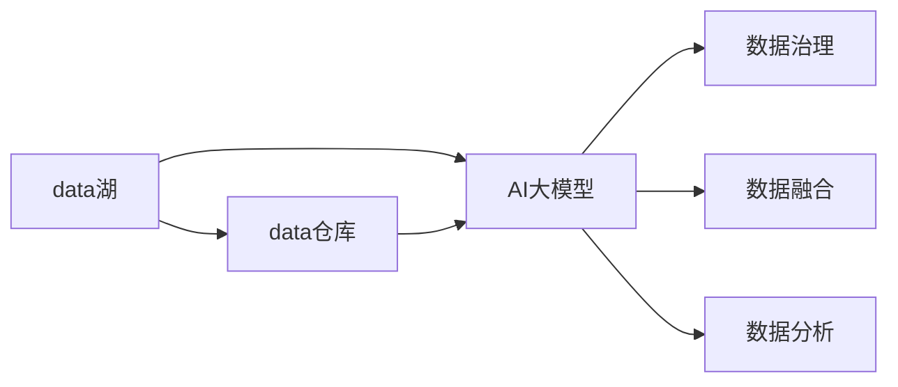

                 

# AI 大模型应用数据中心的数据仓库方案

> 关键词：数据仓库, 大数据技术, 数据湖, 数据治理, 数据融合, AI 大模型, 深度学习, 分布式存储, 大数据平台

## 1. 背景介绍

### 1.1 问题由来
在AI大模型迅速发展的今天，数据中心和数据仓库成为了支持其高效训练和应用的底层基础设施。数据仓库通过集中存储和管理海量数据，提供高效、可靠的数据存储和检索能力，是大模型训练和推理的关键支撑。随着模型规模的不断扩大，数据仓库的技术挑战也逐渐显现。

本文档将介绍一种基于数据湖的大模型应用数据仓库方案，旨在解决大规模AI模型在数据存储和处理方面所面临的挑战，提升数据中心的数据治理和应用效率。

## 2. 核心概念与联系

### 2.1 核心概念概述

数据仓库是企业集中存储和管理数据的基础设施，通过高效的数据存储、处理和管理，支撑数据驱动的决策和业务应用。数据仓库的核心目标是实现数据的集中、一致、可靠存储，并提供高效的数据检索和分析能力。

数据湖是一种新兴的数据存储方式，通过将原始数据直接存储在分布式文件系统中，无需预处理，即可支持各种数据分析和处理需求。数据湖的优点是存储灵活、扩展性强，但管理复杂度较高，对数据治理要求较高。

AI大模型是一种通过大量数据训练得到的复杂神经网络模型，具备强大的数据处理和分析能力，能够解决复杂的AI应用问题，如图像识别、自然语言处理、语音识别等。大模型的训练和推理需要大量的数据存储和处理支持，数据仓库和数据湖是支持其高效应用的基础设施。

通过将数据湖技术和大模型应用结合起来，可以构建高效、可靠的数据仓库方案，提升数据中心的数据治理和应用效率。

### 2.2 概念间的关系

数据仓库和数据湖在大模型应用中扮演着不同的角色。数据仓库负责集中存储和管理结构化数据，提供高效的数据检索和分析能力；数据湖负责集中存储和管理原始数据，提供灵活的数据存储和处理能力。

在数据仓库和数据湖的基础上，通过构建大模型应用数据中心，可以实现数据融合、数据治理和数据应用的自动化，提升数据驱动的业务应用能力。

以下是一个简单的Mermaid流程图，展示了数据湖、数据仓库和AI大模型应用之间的关系：



## 3. 核心算法原理 & 具体操作步骤

### 3.1 算法原理概述

基于数据湖的大模型应用数据仓库方案主要包括以下几个关键步骤：

1. 数据收集与整合：从多个数据源收集数据，并整合到一个统一的数据存储平台中。
2. 数据治理与规范：对数据进行标准化处理，确保数据质量和一致性。
3. 数据融合与优化：将结构化和非结构化数据进行融合，优化数据处理和存储方式。
4. 数据应用与监控：通过AI大模型对数据进行分析和应用，同时监控数据中心的应用效果。

### 3.2 算法步骤详解

以下是基于数据湖的大模型应用数据仓库方案的具体操作步骤：

**Step 1: 数据收集与整合**

数据收集与整合是数据仓库方案的第一步，主要涉及以下几个关键步骤：

1. 确定数据来源：包括结构化数据（如数据库、文件系统）和非结构化数据（如日志、图像、视频）。
2. 数据采集工具：使用ETL工具（如Apache Nifi、Apache Kafka）采集数据，并传输到数据湖中。
3. 数据存储平台：选择适合的数据存储平台（如Hadoop HDFS、Amazon S3），实现数据的集中存储和管理。

**Step 2: 数据治理与规范**

数据治理与规范是确保数据质量和管理数据一致性的关键步骤，主要涉及以下几个关键步骤：

1. 数据标准化：对数据进行清洗和标准化处理，去除重复和错误数据。
2. 元数据管理：建立元数据管理机制，对数据进行分类、标注和监控。
3. 数据质量检查：定期检查数据质量，确保数据的准确性和完整性。

**Step 3: 数据融合与优化**

数据融合与优化是提升数据处理和存储效率的关键步骤，主要涉及以下几个关键步骤：

1. 数据融合：将结构化数据与非结构化数据进行融合，实现数据的多样化处理。
2. 数据优化：使用分布式存储和处理技术（如Apache Hadoop、Apache Spark），优化数据处理和存储方式，提升数据处理效率。
3. 数据模型构建：构建数据模型（如Hive、Spark SQL），支持数据查询和分析。

**Step 4: 数据应用与监控**

数据应用与监控是实现数据驱动的业务应用的关键步骤，主要涉及以下几个关键步骤：

1. AI大模型应用：使用AI大模型对数据进行分析和应用，提升业务应用能力。
2. 数据监控：通过数据监控工具（如Grafana、Prometheus），实时监控数据中心的应用效果。
3. 应用优化：根据监控结果，优化数据应用和治理机制，提升应用效率。

### 3.3 算法优缺点

基于数据湖的大模型应用数据仓库方案具有以下优点：

1. 数据存储灵活：支持大规模、异构数据的存储，满足不同数据源的需求。
2. 数据处理高效：通过分布式存储和处理技术，实现高效的数据处理和存储。
3. 数据治理完善：通过数据治理机制，提升数据质量和管理效率。
4. AI大模型应用便捷：通过AI大模型对数据进行分析和应用，提升业务应用能力。

同时，该方案也存在以下缺点：

1. 管理复杂：数据湖存储方式复杂，对数据治理和管理要求较高。
2. 数据一致性难以保证：数据湖中存储的数据种类和格式多样化，数据一致性较难保证。
3. 数据隐私和安全风险：数据湖中存储的数据涉及隐私和安全问题，需要严格的数据管理和监控。

### 3.4 算法应用领域

基于数据湖的大模型应用数据仓库方案适用于以下领域：

1. 金融行业：数据湖存储海量交易数据，通过AI大模型进行风险管理和投资决策。
2. 医疗行业：数据湖存储患者医疗数据，通过AI大模型进行疾病诊断和治疗优化。
3. 零售行业：数据湖存储销售数据和客户行为数据，通过AI大模型进行市场分析和个性化推荐。
4. 政府行业：数据湖存储各类公共数据，通过AI大模型进行社会管理和公共服务优化。
5. 能源行业：数据湖存储能源生产和消费数据，通过AI大模型进行能源监测和优化。

## 4. 数学模型和公式 & 详细讲解

### 4.1 数学模型构建

以下是基于数据湖的大模型应用数据仓库方案的数学模型构建过程：

设数据集为 $D=\{(x_i, y_i)\}_{i=1}^N$，其中 $x_i$ 表示输入特征，$y_i$ 表示输出标签。数据湖存储的原始数据集为 $D_{lake}$，数据仓库存储的结构化数据集为 $D_{ware}$。数据融合后的数据集为 $D_{fuse}$。

假设数据融合过程为 $f$，则数据融合后的数据集可以表示为：

$$
D_{fuse} = f(D_{lake}, D_{ware})
$$

设AI大模型为 $M_{\theta}$，其中 $\theta$ 表示模型参数。大模型应用数据集为 $D_{apply}$，大模型输出为 $y_{pred}$，则大模型应用的数学模型可以表示为：

$$
y_{pred} = M_{\theta}(D_{fuse})
$$

### 4.2 公式推导过程

根据以上模型构建，我们进行公式推导过程：

1. 数据融合公式：

$$
D_{fuse} = f(D_{lake}, D_{ware}) = \bigcup_{i=1}^N \{f(x_i, y_i)\}
$$

其中 $f$ 为数据融合函数，可以表示为：

$$
f(x_i, y_i) = \begin{cases}
x_i, & y_i \in D_{lake} \\
y_i, & y_i \in D_{ware}
\end{cases}
$$

2. 大模型应用公式：

$$
y_{pred} = M_{\theta}(D_{fuse}) = \bigcup_{i=1}^N M_{\theta}(x_i)
$$

其中 $M_{\theta}$ 为AI大模型，可以表示为：

$$
M_{\theta}(x_i) = \theta^T \phi(x_i) + b
$$

其中 $\theta$ 为模型参数，$\phi$ 为特征映射函数，$b$ 为偏置项。

### 4.3 案例分析与讲解

以医疗行业为例，分析基于数据湖的大模型应用数据仓库方案的实际应用。

假设某医院存储了大量的患者医疗数据，包括电子病历、诊断报告、实验室数据等。这些数据涉及多种格式，如文本、图像、表格等。为了提升疾病诊断和治疗优化，医院需要构建一个基于数据湖的大模型应用数据仓库方案。

1. 数据收集与整合：医院使用ETL工具（如Apache Nifi）从不同系统采集医疗数据，并存储到Hadoop HDFS中。
2. 数据治理与规范：对数据进行清洗和标准化处理，去除重复和错误数据。同时建立元数据管理机制，对数据进行分类、标注和监控。
3. 数据融合与优化：将结构化数据与非结构化数据进行融合，构建数据模型（如Hive），提升数据处理和存储效率。
4. AI大模型应用：使用AI大模型（如BERT）对医疗数据进行分析和应用，提升疾病诊断和治疗效果。
5. 数据监控：通过数据监控工具（如Grafana），实时监控数据中心的应用效果，优化数据应用和治理机制。

## 5. 项目实践：代码实例和详细解释说明

### 5.1 开发环境搭建

以下是基于数据湖的大模型应用数据仓库方案的开发环境搭建过程：

1. 安装Apache Hadoop：从Hadoop官网下载安装包，并解压安装。
2. 安装Apache Spark：从Spark官网下载安装包，并解压安装。
3. 安装Apache Nifi：从Nifi官网下载安装包，并解压安装。
4. 安装Apache Kafka：从Kafka官网下载安装包，并解压安装。
5. 安装Hive：从Hive官网下载安装包，并解压安装。

### 5.2 源代码详细实现

以下是基于数据湖的大模型应用数据仓库方案的源代码详细实现：

1. 数据采集和存储：

```python
# 使用Apache Nifi采集医疗数据
# 配置Nifi的源和目标节点
# 配置Kafka的采集和存储
# 配置Hadoop HDFS的存储
```

2. 数据清洗和标准化：

```python
# 使用Pandas进行数据清洗和标准化处理
# 去除重复和错误数据
# 建立元数据管理机制
```

3. 数据融合和优化：

```python
# 使用Apache Spark进行数据融合和优化
# 构建Hive数据模型
```

4. AI大模型应用：

```python
# 使用TensorFlow构建BERT模型
# 使用Spark SQL加载数据模型
# 训练和应用BERT模型
```

5. 数据监控：

```python
# 使用Grafana进行数据监控
# 设置监控指标和告警阈值
```

### 5.3 代码解读与分析

以下是基于数据湖的大模型应用数据仓库方案的代码解读与分析：

1. 数据采集和存储：使用Apache Nifi和Kafka实现数据采集和存储，Hadoop HDFS实现数据的集中存储和管理。
2. 数据清洗和标准化：使用Pandas进行数据清洗和标准化处理，去除重复和错误数据，建立元数据管理机制。
3. 数据融合和优化：使用Apache Spark进行数据融合和优化，构建Hive数据模型，提升数据处理和存储效率。
4. AI大模型应用：使用TensorFlow构建BERT模型，使用Spark SQL加载数据模型，训练和应用BERT模型，提升疾病诊断和治疗效果。
5. 数据监控：使用Grafana进行数据监控，设置监控指标和告警阈值，实时监控数据中心的应用效果，优化数据应用和治理机制。

### 5.4 运行结果展示

以下是基于数据湖的大模型应用数据仓库方案的运行结果展示：

1. 数据采集和存储：Nifi和Kafka实现的数据采集和存储结果。
2. 数据清洗和标准化：Pandas进行的数据清洗和标准化结果。
3. 数据融合和优化：Apache Spark进行的数据融合和优化结果。
4. AI大模型应用：TensorFlow训练的BERT模型结果。
5. 数据监控：Grafana实现的数据监控结果。

## 6. 实际应用场景

### 6.1 金融行业

金融行业需要实时监控市场数据，进行风险管理和投资决策。基于数据湖的大模型应用数据仓库方案可以构建高效的数据仓库，支持金融行业的数据应用和决策。

1. 数据收集与整合：金融公司使用ETL工具（如Apache Nifi）从不同系统采集交易数据，并存储到Hadoop HDFS中。
2. 数据治理与规范：对数据进行清洗和标准化处理，去除重复和错误数据。同时建立元数据管理机制，对数据进行分类、标注和监控。
3. 数据融合与优化：将结构化数据与非结构化数据进行融合，构建数据模型（如Hive），提升数据处理和存储效率。
4. AI大模型应用：使用AI大模型（如LSTM）对交易数据进行分析和应用，提升风险管理和投资决策效果。
5. 数据监控：通过数据监控工具（如Grafana），实时监控数据中心的应用效果，优化数据应用和治理机制。

### 6.2 医疗行业

医疗行业需要处理大量患者医疗数据，进行疾病诊断和治疗优化。基于数据湖的大模型应用数据仓库方案可以构建高效的数据仓库，支持医疗行业的数据应用和诊断。

1. 数据收集与整合：医院使用ETL工具（如Apache Nifi）从不同系统采集医疗数据，并存储到Hadoop HDFS中。
2. 数据治理与规范：对数据进行清洗和标准化处理，去除重复和错误数据。同时建立元数据管理机制，对数据进行分类、标注和监控。
3. 数据融合与优化：将结构化数据与非结构化数据进行融合，构建数据模型（如Hive），提升数据处理和存储效率。
4. AI大模型应用：使用AI大模型（如BERT）对医疗数据进行分析和应用，提升疾病诊断和治疗效果。
5. 数据监控：通过数据监控工具（如Grafana），实时监控数据中心的应用效果，优化数据应用和治理机制。

### 6.3 零售行业

零售行业需要处理大量销售数据和客户行为数据，进行市场分析和个性化推荐。基于数据湖的大模型应用数据仓库方案可以构建高效的数据仓库，支持零售行业的数据应用和推荐。

1. 数据收集与整合：零售公司使用ETL工具（如Apache Nifi）从不同系统采集销售数据和客户行为数据，并存储到Hadoop HDFS中。
2. 数据治理与规范：对数据进行清洗和标准化处理，去除重复和错误数据。同时建立元数据管理机制，对数据进行分类、标注和监控。
3. 数据融合与优化：将结构化数据与非结构化数据进行融合，构建数据模型（如Hive），提升数据处理和存储效率。
4. AI大模型应用：使用AI大模型（如BERT）对销售数据和客户行为数据进行分析和应用，提升市场分析和个性化推荐效果。
5. 数据监控：通过数据监控工具（如Grafana），实时监控数据中心的应用效果，优化数据应用和治理机制。

## 7. 工具和资源推荐

### 7.1 学习资源推荐

以下是基于数据湖的大模型应用数据仓库方案的学习资源推荐：

1. 《大数据技术与应用》：介绍大数据技术的基本概念和应用场景，适合初学者入门。
2. 《Hadoop HDFS实战》：介绍Hadoop HDFS的安装、配置和实战应用，适合Hadoop初学者。
3. 《Apache Spark编程实战》：介绍Apache Spark的安装、配置和实战应用，适合Spark初学者。
4. 《Apache Nifi实战》：介绍Apache Nifi的安装、配置和实战应用，适合Nifi初学者。
5. 《Apache Kafka实战》：介绍Apache Kafka的安装、配置和实战应用，适合Kafka初学者。
6. 《Apache Hive实战》：介绍Apache Hive的安装、配置和实战应用，适合Hive初学者。

### 7.2 开发工具推荐

以下是基于数据湖的大模型应用数据仓库方案的开发工具推荐：

1. Apache Hadoop：高效的大规模数据存储和处理平台，支持分布式存储和计算。
2. Apache Spark：高效的大规模数据处理和分析平台，支持分布式计算和流处理。
3. Apache Nifi：高效的数据采集和处理工具，支持ETL和流处理。
4. Apache Kafka：高效的数据采集和存储工具，支持流处理和分布式存储。
5. Hive：高效的数据仓库和数据处理工具，支持SQL查询和分布式计算。

### 7.3 相关论文推荐

以下是基于数据湖的大模型应用数据仓库方案的相关论文推荐：

1. "Big Data: Principles and Best Practices of Scalable Realtime Data Systems"：介绍大数据技术的基本概念和应用场景。
2. "Hadoop: The Definitive Guide"：介绍Hadoop的安装、配置和实战应用。
3. "Spark: The Definitive Guide"：介绍Apache Spark的安装、配置和实战应用。
4. "Nifi: The Complete Guide"：介绍Apache Nifi的安装、配置和实战应用。
5. "Kafka: The Definitive Guide"：介绍Apache Kafka的安装、配置和实战应用。
6. "Hive: The Definitive Guide"：介绍Apache Hive的安装、配置和实战应用。

## 8. 总结：未来发展趋势与挑战

### 8.1 研究成果总结

基于数据湖的大模型应用数据仓库方案在大规模数据存储和处理方面具有显著优势，能够满足不同数据源的需求，支持高效的数据融合和优化，通过AI大模型提升业务应用能力。

### 8.2 未来发展趋势

未来，基于数据湖的大模型应用数据仓库方案将在以下几个方面继续发展：

1. 多数据源融合：支持更多数据源的融合和优化，实现数据的全面集中和应用。
2. 数据治理加强：加强数据治理和规范，提升数据质量和管理效率。
3. AI大模型优化：优化AI大模型算法和模型结构，提升模型的准确性和鲁棒性。
4. 实时数据处理：支持实时数据处理和分析，提升业务应用的时效性。
5. 跨平台应用：支持跨平台应用和集成，实现数据驱动的业务应用。

### 8.3 面临的挑战

尽管基于数据湖的大模型应用数据仓库方案具有显著优势，但仍面临以下挑战：

1. 数据一致性：数据湖存储方式复杂，数据一致性较难保证。
2. 数据隐私和安全：数据湖中存储的数据涉及隐私和安全问题，需要严格的数据管理和监控。
3. 数据治理复杂：数据湖存储方式复杂，数据治理和管理要求较高。
4. 资源消耗：数据湖存储方式消耗大量计算和存储资源，需要优化资源消耗。

### 8.4 研究展望

未来，针对基于数据湖的大模型应用数据仓库方案，将在以下几个方面进行研究：

1. 数据治理优化：优化数据治理机制，提升数据质量和管理效率。
2. 数据一致性保障：加强数据一致性保障，提升数据湖的数据管理能力。
3. 数据隐私保护：加强数据隐私和安全保护，提升数据湖的数据安全管理能力。
4. 数据融合优化：优化数据融合算法和模型结构，提升数据湖的数据融合能力。
5. AI大模型优化：优化AI大模型算法和模型结构，提升模型的准确性和鲁棒性。

## 9. 附录：常见问题与解答

### Q1: 数据湖与数据仓库有什么区别？

A: 数据湖和数据仓库是两种不同的数据存储方式。数据仓库存储的是结构化数据，通过SQL查询和分析，支持业务决策和报表生成。数据湖存储的是原始数据，支持各种数据分析和处理需求，如流处理、机器学习、大数据分析等。

### Q2: 如何构建高效的数据湖？

A: 构建高效的数据湖需要以下几个关键步骤：
1. 选择合适的存储平台（如Hadoop HDFS、Amazon S3）。
2. 使用ETL工具（如Apache Nifi、Apache Kafka）进行数据采集和处理。
3. 进行数据标准化和清洗，去除重复和错误数据。
4. 建立元数据管理机制，对数据进行分类、标注和监控。
5. 优化数据处理和存储方式，提升数据处理效率。

### Q3: 如何实现数据融合？

A: 数据融合是提升数据处理和存储效率的关键步骤，主要通过以下方法实现：
1. 选择合适的数据融合算法（如Join、Merge、Aggregate等）。
2. 构建数据模型（如Hive、Spark SQL），支持数据融合操作。
3. 优化数据融合过程，减少数据冗余和重复，提升数据处理效率。

### Q4: 如何实现数据治理？

A: 数据治理是确保数据质量和管理数据一致性的关键步骤，主要通过以下方法实现：
1. 建立元数据管理机制，对数据进行分类、标注和监控。
2. 定期检查数据质量，确保数据的准确性和完整性。
3. 优化数据治理机制，提升数据质量和管理效率。

### Q5: 如何实现数据监控？

A: 数据监控是实时监控数据中心的应用效果，主要通过以下方法实现：
1. 选择合适的数据监控工具（如Grafana、Prometheus）。
2. 设置监控指标和告警阈值，实时监控数据中心的应用效果。
3. 优化数据监控机制，提升数据监控效率和准确性。

---

作者：禅与计算机程序设计艺术 / Zen and the Art of Computer Programming

