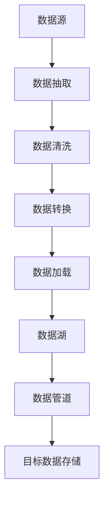

                 

# AI 大模型应用数据中心的数据集成方案

## 1. 背景介绍

在人工智能（AI）大模型应用的推动下，数据中心的角色正变得越来越关键。数据中心作为AI模型的基础设施，其数据集成能力直接决定了AI模型的性能和效率。随着AI大模型的应用场景不断拓展，数据中心的负载也在不断增加，如何高效、灵活、可靠地集成数据，成为数据中心的一个重要挑战。本文将深入探讨AI大模型应用数据中心的数据集成方案，以期为数据中心运营提供切实可行的参考。

## 2. 核心概念与联系

### 2.1 核心概念概述

在探讨数据集成的核心概念之前，我们需要先了解几个关键术语：

- **数据集成（Data Integration）**：是指将多个数据源中的数据进行收集、清洗、转换和整合，形成一个统一、可用的数据仓库。
- **数据湖（Data Lake）**：是一种灵活、非结构化的数据存储方式，可以存储大量不同来源和格式的数据。
- **数据管道（Data Pipeline）**：是一系列的数据处理步骤，通常用于自动化、可重复的数据集成任务。
- **ETL过程（Extract, Transform, Load）**：数据集成的核心流程，包括数据抽取、转换和加载到目标数据存储。

### 2.2 核心概念原理和架构的 Mermaid 流程图



这个流程图展示了数据集成的基本流程。从数据源开始，通过数据抽取、清洗、转换和加载，最终形成目标数据存储。数据湖和数据管道在此过程中起着重要的作用。

## 3. 核心算法原理 & 具体操作步骤

### 3.1 算法原理概述

在AI大模型应用数据中心的数据集成中，我们需要将来自不同数据源的数据进行高效整合，并使其能够被AI模型所利用。这一过程涉及以下核心算法：

- **数据抽取（Extract）**：从不同数据源中收集数据。
- **数据清洗（Transform）**：对抽取到的数据进行去重、填补缺失值、异常值处理等操作。
- **数据转换（Transform）**：将清洗后的数据转换成模型所需的格式和结构。
- **数据加载（Load）**：将转换后的数据加载到目标数据存储中，供模型使用。

### 3.2 算法步骤详解

以下是数据集成的详细步骤：

1. **数据源识别**：识别数据中心内所有潜在的数据源，包括内部系统、外部API、数据库等。
2. **数据抽取**：使用ETL工具从数据源中抽取数据。
3. **数据清洗**：对抽取到的数据进行去重、填补缺失值、异常值处理等操作，确保数据质量。
4. **数据转换**：将清洗后的数据转换成模型所需的格式和结构，如TensorFlow、PyTorch等深度学习框架所需的格式。
5. **数据加载**：将转换后的数据加载到目标数据存储中，如Hadoop、Spark等大数据平台。
6. **数据管道搭建**：搭建数据管道，自动执行上述流程，提高数据集成效率。

### 3.3 算法优缺点

数据集成的优点包括：

- **灵活性高**：可以整合来自不同来源和格式的数据，满足不同应用场景的需求。
- **效率高**：通过自动化流程，减少手动操作，提高数据集成的效率。
- **可扩展性强**：支持大规模数据集成，适应不同规模的数据中心。

然而，数据集成的缺点包括：

- **复杂度高**：数据抽取、清洗、转换等步骤复杂，需要专业知识。
- **性能瓶颈**：数据清洗和转换可能会占用大量计算资源，影响数据集成的效率。
- **数据一致性问题**：不同数据源的数据格式和质量可能不一致，导致数据集成后的一致性问题。

### 3.4 算法应用领域

数据集成在AI大模型应用的数据中心中有广泛的应用，包括但不限于以下领域：

- **自然语言处理（NLP）**：集成大规模文本数据，供NLP模型训练和推理使用。
- **计算机视觉（CV）**：集成图像和视频数据，供CV模型训练和推理使用。
- **推荐系统**：集成用户行为数据和物品信息，供推荐模型训练和推荐使用。
- **金融分析**：集成市场数据、交易数据等，供金融模型分析使用。

## 4. 数学模型和公式 & 详细讲解

### 4.1 数学模型构建

在数据集成过程中，我们需要对数据进行清洗和转换，以确保其质量。以下是一个简单的数学模型，用于描述数据清洗的过程：

假设我们有一组数据集，其中包含了缺失值和异常值。我们需要对其进行清洗和转换。

**输入数据**：
$$
x_1, x_2, \ldots, x_n
$$

**缺失值处理**：
$$
\hat{x}_i = \begin{cases} 
x_i & \text{if } x_i \neq \text{NaN} \\
\text{median}(x) & \text{if } x_i = \text{NaN}
\end{cases}
$$

**异常值处理**：
$$
\tilde{x}_i = \begin{cases} 
x_i & \text{if } |x_i - \text{median}(x)| \leq \text{IQR}(x) \\
\text{median}(x) & \text{if } |x_i - \text{median}(x)| > \text{IQR}(x)
\end{cases}
$$

其中，IQR为四分位距，median为中位数。

### 4.2 公式推导过程

在上述公式中，我们使用了统计学方法来处理缺失值和异常值。缺失值处理通常采用均值、中位数或众数进行填补，异常值处理通常采用截断或替换的方法。

### 4.3 案例分析与讲解

假设我们有一个电商网站的用户购买数据，其中包含了用户的年龄、性别、购买金额等信息。但有些用户的数据中年龄字段为缺失值，购买金额字段中有些异常值。

**缺失值处理**：
- 年龄字段缺失值可以使用中位数进行填补：
$$
\hat{age} = \text{median}(age)
$$
- 购买金额字段的异常值可以使用截断方法进行处理：
$$
\tilde{amount} = \begin{cases} 
amount & \text{if } |amount - \text{median}(amount)| \leq \text{IQR}(amount) \\
\text{median}(amount) & \text{if } |amount - \text{median}(amount)| > \text{IQR}(amount)
\end{cases}
$$

通过上述方法，我们可以将缺失值和异常值进行处理，确保数据的完整性和一致性。

## 5. 项目实践：代码实例和详细解释说明

### 5.1 开发环境搭建

在开始数据集成项目前，我们需要搭建开发环境。以下是一个典型的开发环境搭建步骤：

1. **安装ETL工具**：安装如Apache NiFi、Talend等ETL工具。
2. **配置数据源**：配置数据源的连接信息，如数据库、API等。
3. **搭建数据管道**：使用ETL工具搭建数据管道，自动执行数据集成任务。

### 5.2 源代码详细实现

以下是一个使用Python和Pandas库实现数据集成的示例代码：

```python
import pandas as pd
import numpy as np

# 读取数据
df = pd.read_csv('data.csv')

# 处理缺失值
df.fillna(df.median(), inplace=True)

# 处理异常值
df['amount'] = df['amount'].apply(lambda x: np.median(df['amount']) if np.abs(x - np.median(df['amount'])) > np.quantile(df['amount'], 0.25) else x)

# 保存数据
df.to_csv('cleaned_data.csv', index=False)
```

### 5.3 代码解读与分析

- **数据读取**：使用Pandas库的read_csv方法读取数据集。
- **缺失值处理**：使用fillna方法，使用中位数填补缺失值。
- **异常值处理**：使用apply方法和lambda函数，根据IQR判断是否需要处理异常值。
- **数据保存**：使用to_csv方法保存处理后的数据。

### 5.4 运行结果展示

假设我们有一个名为data.csv的数据集，其中包含年龄和购买金额两列数据。经过上述处理后，我们得到了一个新的数据集cleaned_data.csv，其中缺失值和异常值已经被处理。

## 6. 实际应用场景

### 6.1 自然语言处理（NLP）

在自然语言处理领域，数据中心的数据集成尤为重要。NLP模型需要大量的文本数据进行训练，这些数据往往来自不同的来源，如新闻、社交媒体、网页等。通过高效的数据集成，可以快速构建大规模的文本数据集，供NLP模型训练和推理使用。

### 6.2 计算机视觉（CV）

计算机视觉领域的数据集成也至关重要。CV模型需要大量的图像和视频数据进行训练，这些数据通常来自不同的摄像头、传感器等设备。通过数据集成，可以将这些数据高效整合，构建大规模的数据集，供CV模型训练和推理使用。

### 6.3 推荐系统

在推荐系统领域，数据中心的数据集成也是基础。推荐系统需要大量的用户行为数据和物品信息，这些数据通常来自不同的系统和服务。通过数据集成，可以将这些数据高效整合，构建大规模的数据集，供推荐模型训练和推荐使用。

### 6.4 金融分析

在金融分析领域，数据中心的数据集成同样重要。金融模型需要大量的市场数据、交易数据等，这些数据通常来自不同的系统和服务。通过数据集成，可以将这些数据高效整合，构建大规模的数据集，供金融模型分析使用。

## 7. 工具和资源推荐

### 7.1 学习资源推荐

为了帮助开发者系统掌握数据集成的理论基础和实践技巧，这里推荐一些优质的学习资源：

1. **Apache NiFi官方文档**：Apache NiFi是常用的ETL工具之一，其官方文档提供了详细的安装、配置和使用方法。
2. **Talend官方文档**：Talend是另一款流行的ETL工具，其官方文档提供了丰富的教程和案例。
3. **Kaggle数据集**：Kaggle提供了大量的公开数据集，可以用于数据集成项目的实践。
4. **数据科学社区**：如DataCamp、Kaggle等社区，提供了大量的学习资源和案例分享。
5. **数据科学博客**：如 Towards Data Science、KDnuggets等博客，提供了大量的数据分析和数据集成技巧。

### 7.2 开发工具推荐

在数据集成的开发过程中，以下工具可以帮助开发者提高效率：

1. **ETL工具**：如Apache NiFi、Talend、Pentaho等，提供了数据抽取、清洗、转换和加载的自动化功能。
2. **大数据平台**：如Hadoop、Spark、Flink等，提供了高效的大数据处理能力。
3. **数据可视化工具**：如Tableau、Power BI等，提供了直观的数据可视化功能。
4. **编程语言**：如Python、R等，提供了丰富的数据处理和分析库。

### 7.3 相关论文推荐

以下是几篇具有代表性的相关论文，推荐阅读：

1. **《大数据集成：方法与技术》**：该书详细介绍了大数据集成的各种方法和技术，适合系统学习数据集成的理论基础。
2. **《ETL in Action》**：该书详细介绍了ETL工具的使用方法和最佳实践，适合实践操作。
3. **《数据仓库与数据挖掘：技术与实现》**：该书详细介绍了数据仓库的构建与数据挖掘的方法，适合系统学习数据集成的流程和技术。

## 8. 总结：未来发展趋势与挑战

### 8.1 研究成果总结

数据集成在大模型应用中发挥了重要作用，是数据中心基础设施建设的关键环节。通过数据集成，可以高效整合来自不同数据源的数据，为AI模型提供高质量的数据支持。

### 8.2 未来发展趋势

未来数据集成的发展趋势包括：

- **自动化程度提升**：自动化数据集成的需求将进一步提升，更多智能化的工具和平台将出现，简化数据集成流程。
- **大数据处理能力增强**：随着数据量的不断增加，对大数据处理的能力需求将进一步提升，高效的大数据平台将得到广泛应用。
- **跨领域数据集成**：跨领域的集成需求将进一步增加，更多领域的数据融合将成为可能。
- **安全性和隐私保护**：数据集成的安全性、隐私保护问题将得到更多重视，数据集成的过程将更加透明和可控。

### 8.3 面临的挑战

尽管数据集成在大模型应用中发挥了重要作用，但其仍面临一些挑战：

- **数据质量问题**：不同数据源的数据质量可能存在差异，如何保证数据的一致性和完整性是一大挑战。
- **数据安全问题**：在数据集成的过程中，数据安全和隐私保护问题不容忽视，如何确保数据安全是一大挑战。
- **计算资源限制**：数据集成的计算资源需求高，如何高效利用计算资源是一大挑战。
- **技术更新迅速**：数据集成的技术更新迅速，如何跟踪新技术、及时更新系统是一大挑战。

### 8.4 研究展望

未来的数据集成研究应关注以下方向：

- **自动化和智能化**：进一步提升数据集成的自动化和智能化水平，减少人工干预，提高效率。
- **大数据处理能力**：增强对大规模数据的处理能力，支持更复杂的数据集成的需求。
- **跨领域数据集成**：探索跨领域的集成方法，提升数据融合的能力。
- **安全性和隐私保护**：加强数据集成的安全性和隐私保护，确保数据安全。

## 9. 附录：常见问题与解答

**Q1：数据集成对AI模型的影响是什么？**

A：数据集成对AI模型的影响主要体现在数据质量和数据量上。通过高效的数据集成，可以为AI模型提供高质量、多样化的数据，提高模型的训练效果和泛化能力。

**Q2：数据集成的复杂性如何评估？**

A：数据集成的复杂性可以从以下几个方面评估：数据源数量、数据质量、数据格式、数据量等。复杂性越高，数据集成的难度越大，需要更多的资源和技能支持。

**Q3：如何提高数据集成的效率？**

A：提高数据集成的效率可以从以下几个方面入手：
- 使用高效的ETL工具和平台。
- 自动化数据抽取、清洗、转换和加载。
- 使用大数据处理框架，提高计算能力。
- 优化数据集成的流程，减少不必要的步骤。

**Q4：数据集成的安全性如何保障？**

A：保障数据集成的安全性可以从以下几个方面入手：
- 使用安全的数据传输协议，如SSL/TLS。
- 对数据进行加密存储和传输。
- 对数据访问进行严格的权限控制。
- 定期进行数据安全审计和风险评估。

**Q5：数据集成的成本如何控制？**

A：控制数据集成的成本可以从以下几个方面入手：
- 选择合适的数据集成工具和平台。
- 优化数据集成的流程，减少不必要的计算和存储资源消耗。
- 采用分布式计算和存储，提高资源利用率。
- 定期评估数据集成的成本，优化资源配置。

---

作者：禅与计算机程序设计艺术 / Zen and the Art of Computer Programming

