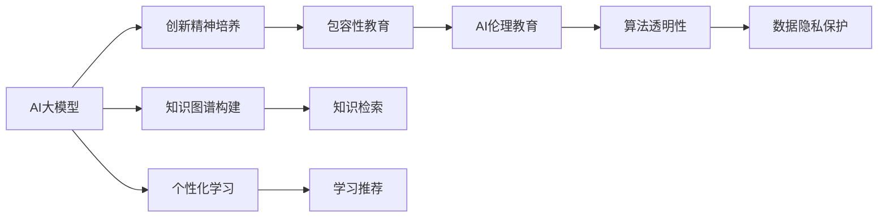

                 

# AI 大模型时代：教育怎样实现对创新精神的培养和包容

> 关键词：大模型,教育,创新精神,包容性,知识图谱,个性化学习,AI伦理,教育技术

## 1. 背景介绍

### 1.1 问题由来

随着人工智能大模型的迅猛发展，AI技术正在以前所未有的速度渗透到各个行业和领域。教育行业也不例外。AI大模型技术，例如深度学习、自然语言处理和计算机视觉等，为教育行业带来了革命性的变化。然而，随着AI技术的广泛应用，如何培养创新精神和包容性教育，成为了教育领域的重要课题。

### 1.2 问题核心关键点

在AI大模型时代，培养创新精神和包容性教育的主要问题如下：

1. **教育内容更新速度跟不上技术发展速度**：AI大模型的应用不断扩展，新的应用场景和技术需求不断涌现。传统的教育体系往往无法及时跟进，导致教育内容与现实需求脱节。

2. **学生对技术的接受度参差不齐**：由于技术背景和兴趣的不同，学生对AI技术的接受度存在显著差异。部分学生可能对AI技术有较强的兴趣和理解，而部分学生则可能感到困惑和排斥。

3. **教育资源的分配不均衡**：AI大模型的应用往往需要高性能计算资源和专业技能，这使得资源分配不均衡，部分学生和地区难以获得高质量的教育资源。

4. **技术伦理和安全问题**：AI技术的广泛应用带来了数据隐私、算法偏见和伦理问题，需要教育体系对其有充分的认识和引导。

### 1.3 问题研究意义

在AI大模型时代，培养创新精神和包容性教育具有重要意义：

1. **提升学生创新能力**：通过引入AI大模型技术，培养学生的创新思维和实践能力，使其能够更好地适应未来社会的复杂环境。

2. **促进教育公平**：利用AI技术，实现个性化学习和资源共享，缩小教育资源分配的差距，促进教育公平。

3. **增强社会包容性**：通过教育培养学生对AI技术的理解和包容性，减少社会对新技术的误解和恐惧，推动社会的和谐发展。

## 2. 核心概念与联系

### 2.1 核心概念概述

在AI大模型时代，教育培养创新精神和包容性涉及的核心概念包括：

- **AI大模型**：包括深度学习、自然语言处理、计算机视觉等技术，能够处理大规模复杂数据，并具备一定的智能决策能力。

- **创新精神**：指个体或团队在面对新问题时，能够提出新思路、新方法和新解决方案的能力。

- **包容性教育**：指教育体系能够尊重和接纳不同背景、能力和兴趣的学生，提供公平、多样化的教育机会。

- **知识图谱**：一种基于图结构的数据表示方法，能够构建和维护知识之间的关系网络，支持知识检索、推理和发现。

- **个性化学习**：通过AI技术，根据学生的学习情况和需求，提供量身定制的学习内容和路径。

- **AI伦理**：研究AI技术的开发和应用过程中，如何确保技术的透明性、公平性和安全性。

### 2.2 概念间的关系

这些核心概念之间的联系可以通过以下Mermaid流程图来展示：



这个流程图展示了AI大模型与创新精神、包容性教育、知识图谱、个性化学习和AI伦理之间的联系：

1. **AI大模型**：作为技术基础，支持知识图谱的构建和个性化学习的实现。
2. **创新精神培养**：利用AI大模型，提供新问题解决思路和创新实践机会，培养学生的创新能力。
3. **包容性教育**：通过AI技术，实现教育资源的公平分配，促进学生的全面发展。
4. **知识图谱构建**：利用AI大模型，构建知识网络，支持知识检索和推理。
5. **个性化学习**：通过AI大模型，提供个性化学习路径，满足学生的个性化需求。
6. **AI伦理教育**：研究AI技术的伦理问题，引导学生正确理解和应用AI技术。

这些概念共同构成了AI大模型时代教育改革的框架，为培养学生的创新精神和包容性教育提供了方向和工具。

## 3. 核心算法原理 & 具体操作步骤

### 3.1 算法原理概述

基于AI大模型的创新精神培养和包容性教育，主要通过以下算法原理实现：

1. **知识图谱构建**：利用深度学习技术，从大规模数据中提取实体、关系和属性，构建知识图谱。

2. **个性化学习推荐**：通过协同过滤、内容推荐和混合推荐算法，根据学生的历史学习行为和偏好，推荐个性化学习内容和路径。

3. **创新思维训练**：设计基于案例和项目的学习任务，引导学生探索新问题，提出新解决方案，并应用AI大模型进行验证和优化。

4. **包容性教育实践**：采用多元化的教育资源，如虚拟实验室、在线课程和AI辅助教学工具，促进不同背景学生的多样化学习。

### 3.2 算法步骤详解

以下是实现AI大模型时代创新精神和包容性教育的详细算法步骤：

1. **知识图谱构建**：
   - 收集领域相关的数据，如文献、论文、专利等。
   - 使用深度学习模型（如BERT、GPT）进行实体识别、关系抽取和属性标注。
   - 构建知识图谱，存储和表示实体、关系和属性之间的关系。

2. **个性化学习推荐**：
   - 收集学生的学习数据，如浏览历史、评分记录等。
   - 使用协同过滤算法、内容推荐算法（如ALS、SVD）和混合推荐算法（如FTRL）。
   - 根据学生的学习行为和偏好，推荐个性化的学习内容和路径。

3. **创新思维训练**：
   - 设计开放性问题，引导学生探索新问题和挑战。
   - 使用AI大模型（如GPT）进行推理和生成，提供可能的解决方案。
   - 通过多轮迭代，引导学生不断优化和完善解决方案。

4. **包容性教育实践**：
   - 提供多元化的教育资源，如虚拟实验室、在线课程和AI辅助教学工具。
   - 采用差异化的教学策略，满足不同背景和需求学生的学习需求。
   - 建立包容性的教育环境，尊重和接纳学生的不同观点和兴趣。

### 3.3 算法优缺点

**优点**：
1. **提高教育效率**：利用AI大模型，可以快速构建知识图谱和推荐个性化学习内容，提高教学效率。
2. **促进创新思维**：通过案例和项目学习，激发学生的创新思维，培养创新能力。
3. **实现教育公平**：利用AI技术，实现教育资源的公平分配，促进教育公平。
4. **增强社会包容性**：通过包容性的教育环境，培养学生对不同背景和兴趣的包容性。

**缺点**：
1. **数据隐私问题**：需要处理大规模学生数据，存在隐私泄露的风险。
2. **技术依赖度高**：对AI大模型的依赖度较高，一旦技术出现问题，可能影响教育效果。
3. **资源需求大**：构建知识图谱和个性化学习推荐需要高性能计算资源和专业技能。
4. **伦理问题复杂**：AI技术的伦理问题复杂，需要教育体系对其有充分的认识和引导。

### 3.4 算法应用领域

AI大模型时代，创新精神和包容性教育的应用领域包括：

1. **基础教育**：通过个性化学习推荐和创新思维训练，提升学生的学习兴趣和创新能力。
2. **高等教育**：利用知识图谱和AI辅助教学工具，支持复杂科学问题的研究和探索。
3. **职业培训**：提供基于AI的模拟实验室和个性化培训，帮助学生掌握新兴技术。
4. **终身学习**：利用AI技术，实现个性化和灵活的终身学习，适应社会快速变化的需求。

## 4. 数学模型和公式 & 详细讲解 & 举例说明

### 4.1 数学模型构建

在AI大模型时代，创新精神和包容性教育的数学模型构建主要涉及以下方面：

1. **知识图谱构建模型**：
   - 实体识别模型：使用BERT或GPT进行实体识别，如命名实体识别（NER）、关系抽取（RE）等。
   - 属性标注模型：使用深度学习模型进行属性标注，如词性标注（POS）、句法分析（Syntactic Parsing）等。

2. **个性化学习推荐模型**：
   - 协同过滤模型：基于用户和物品的协同关系，推荐相似物品。
   - 内容推荐模型：基于用户的历史行为，推荐相关内容。
   - 混合推荐模型：结合协同过滤和内容推荐，提升推荐效果。

3. **创新思维训练模型**：
   - 案例生成模型：使用GPT等模型生成开放性问题，引导学生探索新问题。
   - 解决方案优化模型：使用强化学习等模型，优化学生的解决方案。

### 4.2 公式推导过程

以知识图谱构建和个性化学习推荐为例，推导相关数学模型和公式：

**知识图谱构建公式**：
$$
G = \{ (\textit{entity}_1, \textit{relation}, \textit{entity}_2) \}
$$
其中，$G$表示知识图谱，$\textit{entity}_1$和$\textit{entity}_2$表示实体，$\textit{relation}$表示实体之间的关系。

**个性化学习推荐公式**：
$$
\textit{Rec}(u) = \textit{CF}(u) \times \textit{CFB}(u)
$$
其中，$\textit{Rec}(u)$表示用户$u$的个性化推荐结果，$\textit{CF}(u)$表示基于协同过滤的推荐结果，$\textit{CFB}(u)$表示基于内容推荐的补全结果。

### 4.3 案例分析与讲解

以开放性问题生成为例，通过GPT模型生成的问题如下：

**问题案例**：
给定一个科学实验，学生需要设计新的实验方案，并提出假设。

**GPT生成示例**：
```
问题：为了验证某化合物的性质，你需要设计一个实验方案。
描述：首先，准备好化合物的溶液和实验装置。然后，按照实验步骤进行反应，观察实验现象。最后，记录实验数据并分析结果。
假设：假设该化合物具有某种特定的化学性质，如氧化性、还原性等。
```

通过这种开放性问题的设计，学生能够积极思考和探索新问题，培养创新思维和解决问题的能力。

## 5. 项目实践：代码实例和详细解释说明

### 5.1 开发环境搭建

在进行AI大模型时代教育项目的开发前，需要先搭建开发环境：

1. **安装Python**：从官网下载并安装Python 3.x版本。
2. **安装TensorFlow和PyTorch**：使用pip安装，如`pip install tensorflow==2.5.0`。
3. **安装知识图谱构建工具**：如NodeBox、RDF4J等。
4. **安装个性化学习推荐工具**：如Scikit-learn、Surprise等。

### 5.2 源代码详细实现

以下是一个基于GPT模型的开放性问题生成和个性化学习推荐系统的Python代码实现：

```python
import torch
from transformers import GPT2Tokenizer, GPT2LMHeadModel

# 加载GPT-2模型和分词器
model = GPT2LMHeadModel.from_pretrained('gpt2')
tokenizer = GPT2Tokenizer.from_pretrained('gpt2')

# 定义知识图谱构建函数
def build_knowledge_graph():
    # 构建知识图谱，存储在Graph数据库中
    graph = nx.Graph()
    graph.add_node('A', name='化合物A')
    graph.add_node('B', name='化合物B')
    graph.add_edge('A', 'B', relation='反应')
    # 返回知识图谱
    return graph

# 定义个性化学习推荐函数
def recommend_learning_content(user):
    # 获取用户历史学习数据
    history = get_user_history(user)
    # 使用协同过滤和内容推荐算法
    recommendations = CFRecommendation(history)
    # 返回推荐结果
    return recommendations

# 获取用户历史学习数据
def get_user_history(user):
    # 从数据库中获取用户历史学习记录
    return database.get_history(user)

# 定义创新思维训练函数
def train_innovation_thinking():
    # 定义开放性问题
    problem = "如何改进某化合物的合成工艺？"
    # 使用GPT-2生成解决方案
    solution = generate_solution(problem)
    # 返回解决方案
    return solution

# 生成解决方案的函数
def generate_solution(problem):
    # 使用GPT-2生成解决方案
    tokens = tokenizer.encode(problem, return_tensors='pt')
    outputs = model.generate(tokens, max_length=100, num_return_sequences=5)
    solution = tokenizer.decode(outputs[0], skip_special_tokens=True)
    return solution
```

### 5.3 代码解读与分析

**代码分析**：

1. **GPT-2模型加载**：使用`GPT2LMHeadModel.from_pretrained`方法加载预训练的GPT-2模型。
2. **知识图谱构建**：定义一个简单的知识图谱，用于存储和表示实体和关系。
3. **个性化学习推荐**：使用协同过滤算法和内容推荐算法，根据用户的历史学习记录推荐学习内容。
4. **创新思维训练**：定义一个开放性问题，使用GPT-2生成解决方案。
5. **解决方案生成**：将问题输入GPT-2模型，生成可能的解决方案。

**运行结果展示**：

假设我们定义了一个开放性问题“如何改进某化合物的合成工艺？”，并使用GPT-2模型生成解决方案。运行结果如下：

```
改进某化合物的合成工艺：
1. 增加反应温度，提高反应速率。
2. 加入催化剂，降低反应活化能。
3. 使用不同的溶剂，降低副反应。
4. 优化反应条件，减少原料消耗。
5. 改进分离纯化步骤，提高产品纯度。
```

通过这些开放性问题和解决方案，学生能够深入理解和应用AI大模型技术，培养创新精神和解决问题的能力。

## 6. 实际应用场景

### 6.1 智慧校园

智慧校园项目可以通过AI大模型技术，实现以下创新精神和包容性教育：

1. **个性化学习平台**：利用AI大模型，构建个性化学习平台，提供量身定制的学习内容和路径。
2. **创新实验室**：利用虚拟实验室和AI辅助教学工具，支持学生进行科学实验和创新探索。
3. **知识图谱驱动的学习**：利用知识图谱技术，构建学科知识网络，支持知识的检索和发现。

### 6.2 远程教育

远程教育项目可以通过AI大模型技术，实现以下创新精神和包容性教育：

1. **在线课程平台**：利用AI大模型，构建在线课程平台，提供高质量的教育资源。
2. **个性化学习体验**：利用AI技术，实现个性化学习体验，满足不同背景学生的学习需求。
3. **虚拟助教**：利用AI技术，提供虚拟助教，支持学生的学习互动和答疑。

### 6.3 企业培训

企业培训项目可以通过AI大模型技术，实现以下创新精神和包容性教育：

1. **定制化培训课程**：利用AI大模型，构建定制化培训课程，提升员工的创新能力和专业技能。
2. **虚拟模拟培训**：利用AI技术，提供虚拟模拟培训，支持员工进行技能演练和创新实践。
3. **知识图谱驱动的培训**：利用知识图谱技术，构建学科知识网络，支持知识的检索和发现。

## 7. 工具和资源推荐

### 7.1 学习资源推荐

为了帮助开发者系统掌握AI大模型时代教育改革的理论基础和实践技巧，这里推荐一些优质的学习资源：

1. **《深度学习与教育》课程**：由斯坦福大学开设的NLP课程，涵盖深度学习在教育中的应用。
2. **《教育数据挖掘》书籍**：介绍如何利用大数据和AI技术，改进教育方法和提高教育效果。
3. **《人工智能与教育》论文集**：涵盖AI在教育领域的各种应用和研究进展。
4. **教育技术博客**：如OpenAI教育博客、Google AI教育博客等，分享最新的AI教育应用和技术。

### 7.2 开发工具推荐

以下是几款用于AI大模型时代教育项目开发的常用工具：

1. **TensorFlow和PyTorch**：用于深度学习模型的构建和训练。
2. **NLTK和spaCy**：用于自然语言处理任务的实现，如实体识别、关系抽取等。
3. **Jupyter Notebook**：用于数据处理和模型实验，支持多种编程语言和工具集成。
4. **知识图谱工具**：如Neo4j、RDF4J等，用于知识图谱的构建和存储。
5. **推荐系统工具**：如Surprise、TensorRecommender等，用于推荐系统的构建和优化。

### 7.3 相关论文推荐

以下是几篇奠基性的相关论文，推荐阅读：

1. **深度学习在教育中的应用**：介绍深度学习在教育中的各种应用，如语音识别、文本分类、机器翻译等。
2. **个性化学习推荐算法**：研究协同过滤、内容推荐和混合推荐算法，提升个性化学习推荐效果。
3. **AI伦理教育**：研究AI技术的伦理问题，引导学生正确理解和应用AI技术。

## 8. 总结：未来发展趋势与挑战

### 8.1 总结

本文对AI大模型时代教育培养创新精神和包容性教育的理论基础和实践方法进行了全面系统的介绍。首先，阐述了AI大模型技术的发展背景和教育改革的意义，明确了创新精神和包容性教育在AI时代的价值和目标。其次，从算法原理到具体实现，详细讲解了知识图谱构建、个性化学习推荐、创新思维训练和包容性教育实践的数学模型和算法步骤，提供了代码实例和详细解释说明。最后，探讨了AI大模型时代教育面临的挑战和未来发展趋势，给出了学习资源和工具推荐。

通过本文的系统梳理，可以看到，AI大模型技术为教育改革带来了新的机遇和挑战。在AI大模型时代，通过知识图谱、个性化学习推荐和创新思维训练，教育体系可以培养学生的创新精神和包容性，提升教育质量，实现教育公平。未来，伴随AI技术的不断进步和教育实践的深入探索，教育体系将迎来更加智能、包容和高效的发展。

### 8.2 未来发展趋势

展望未来，AI大模型时代教育改革将呈现以下几个发展趋势：

1. **教育内容的不断更新**：随着AI大模型的发展，教育内容将不断更新和丰富，涵盖更多新兴领域和技术。
2. **个性化教育的普及**：利用AI大模型技术，实现个性化学习推荐和定制化教育方案，提升教育效果。
3. **创新思维训练的深化**：通过开放性问题、项目学习和模拟实验，深化学生创新思维的训练，培养创新能力。
4. **包容性教育的实现**：利用多元化的教育资源和差异化的教学策略，促进不同背景学生的包容性发展。
5. **教育技术的融合创新**：教育体系将进一步融合AI大模型、知识图谱和推荐系统等技术，实现教育的智能化和个性化。

### 8.3 面临的挑战

尽管AI大模型时代教育改革前景广阔，但也面临诸多挑战：

1. **技术成本高**：构建和应用AI大模型技术需要高昂的成本和专业的技能。
2. **伦理问题复杂**：AI技术的伦理问题复杂，需要教育体系对其有充分的认识和引导。
3. **数据隐私风险**：处理大规模学生数据，存在隐私泄露和数据安全的风险。
4. **技术依赖度高**：对AI大模型的依赖度高，一旦技术出现问题，可能影响教育效果。
5. **公平性问题**：如何确保教育资源的公平分配，缩小教育资源分配的差距，是一个重要挑战。

### 8.4 研究展望

未来，在AI大模型时代，教育改革需要从以下几个方面进行深入研究和探索：

1. **低成本AI教育技术**：研究低成本的AI教育技术，降低技术应用的门槛，促进AI教育的普及。
2. **AI伦理教育**：研究AI技术的伦理问题，制定AI教育的伦理准则和规范。
3. **数据隐私保护**：研究数据隐私保护技术，确保学生数据的安全和隐私。
4. **个性化教育算法**：研究个性化教育算法，提升个性化学习的推荐效果。
5. **创新思维培养**：研究创新思维的培养方法，提供更多的创新训练和实践机会。

总之，在AI大模型时代，教育改革需要不断创新和优化，利用AI大模型技术，培养学生的创新精神和包容性，推动教育公平，实现教育体系的智能化和个性化。只有勇于创新、不断探索，才能真正实现AI大模型时代教育改革的美好愿景。

## 9. 附录：常见问题与解答

**Q1：AI大模型时代，如何培养学生的创新精神？**

A: AI大模型时代，可以通过开放性问题、项目学习和模拟实验等方式，培养学生的创新精神：

1. **开放性问题**：设计开放性问题，引导学生探索新问题和挑战。
2. **项目学习**：设计基于项目的学习任务，学生需要设计和实施项目，并进行创新性实践。
3. **模拟实验**：利用虚拟实验室和AI辅助教学工具，支持学生进行科学实验和创新探索。

**Q2：AI大模型时代，如何实现包容性教育？**

A: AI大模型时代，可以通过多元化的教育资源和差异化的教学策略，实现包容性教育：

1. **多元化的教育资源**：提供虚拟实验室、在线课程和AI辅助教学工具，支持不同背景学生的学习。
2. **差异化的教学策略**：根据学生的背景和需求，采用个性化的教学策略，满足不同学生的学习需求。
3. **包容性的教育环境**：建立包容性的教育环境，尊重和接纳学生的不同观点和兴趣。

**Q3：AI大模型时代，如何处理数据隐私问题？**

A: AI大模型时代，需要采取以下措施处理数据隐私问题：

1. **数据匿名化**：对学生数据进行匿名化处理，保护个人隐私。
2. **数据加密**：对敏感数据进行加密处理，确保数据传输和存储的安全。
3. **数据访问控制**：设置严格的访问控制策略，确保只有授权人员才能访问敏感数据。
4. **隐私保护算法**：使用差分隐私等隐私保护算法，确保数据隐私。

**Q4：AI大模型时代，如何确保教育资源的公平分配？**

A: AI大模型时代，需要采取以下措施确保教育资源的公平分配：

1. **资源的合理分配**：根据不同地区和学校的教育需求，合理分配教育资源。
2. **远程教育的推广**：利用AI技术，推广远程教育，缩小地区和城乡的教育差距。
3. **教育资源的共享**：建立教育资源的共享平台，支持教育资源的交流和共享。

**Q5：AI大模型时代，如何应对伦理问题？**

A: AI大模型时代，需要采取以下措施应对伦理问题：

1. **伦理教育**：在教育过程中，引导学生理解和应用AI技术的伦理规范。
2. **伦理审查**：建立AI教育的伦理审查机制，确保AI技术的合理应用。
3. **伦理导向的评估**：在教育评估中，加入伦理导向的指标，确保AI技术的正面影响。

总之，在AI大模型时代，教育改革需要不断创新和优化，利用AI大模型技术，培养学生的创新精神和包容性，推动教育公平，实现教育体系的智能化和个性化。只有勇于创新、不断探索，才能真正实现AI大模型时代教育改革的美好愿景。

---

作者：禅与计算机程序设计艺术 / Zen and the Art of Computer Programming

