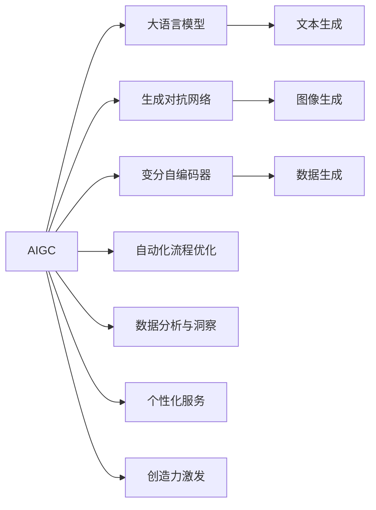
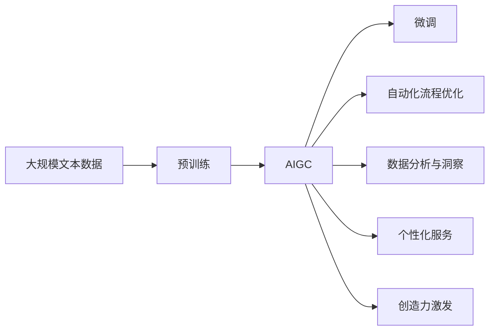

                 

# AIGC与企业任务的演变

## 1. 背景介绍

在过去的几十年里，人工智能(AI)技术经历了从规则驱动、知识工程到机器学习、深度学习的演进。然而，随着计算能力的不断提升和数据量的激增，人工智能的发展进入了一个新的阶段——生成式人工智能(AIGC)。AIGC技术以其强大的生成能力，正在全面渗透到各个行业，改变着企业的运营方式和决策模式。

### 1.1 问题由来

AIGC技术基于大语言模型、生成对抗网络(GANs)、变分自编码器(VAEs)等先进算法，能够生成逼真且符合特定语义的内容，广泛应用于自然语言处理(NLP)、图像生成、音乐创作等多个领域。企业的任务也在这一背景下发生着深刻的变化：

- **自动化流程优化**：企业需要自动化重复性高、高效率的任务，减少人工干预，提升运营效率。
- **数据分析与洞察**：AIGC技术可以生成有意义的文本和图像数据，辅助企业进行更深入的数据分析和洞察。
- **个性化服务**：AIGC技术能够根据用户偏好生成定制化的产品和服务，提升用户体验和满意度。
- **创造力激发**：企业需要借助AIGC技术激发员工的创造力和创新能力，加速产品研发和市场推广。

### 1.2 问题核心关键点

AIGC技术在企业中的应用，核心关键点包括：

- **自动化与人工协同**：如何实现机器与人工的协同工作，最大化效率和创造力。
- **数据与模型结合**：如何有效利用企业内部和外部数据，结合AIGC模型生成有价值的信息和洞察。
- **个性化与多样性**：如何在保持个性化服务的同时，满足多样化的用户需求。
- **伦理与安全性**：如何保证AIGC生成的内容的伦理和安全性，避免误导性信息传播。

这些关键点共同构成了AIGC技术在企业应用中的主要挑战和机遇。通过解决这些核心问题，企业能够充分利用AIGC技术的优势，推动业务的创新和发展。

### 1.3 问题研究意义

AIGC技术的应用，对于提升企业运营效率、增强市场竞争力、推动创新发展具有重要意义：

- **提高效率**：AIGC技术能够自动生成大量文本、图像等内容，极大地提升工作效率。
- **增强洞察**：AIGC技术可以生成有意义的洞察报告，帮助企业做出更准确的决策。
- **提升体验**：通过个性化服务，AIGC技术能够提供更好的用户体验，增强客户粘性。
- **激发创新**：AIGC技术能够激发员工的创造力，促进创新思维和产品开发。

AIGC技术的应用，正在推动企业向智能化、高效化、个性化、创新化的方向发展，未来将成为企业数字化转型的重要驱动力。

## 2. 核心概念与联系

### 2.1 核心概念概述

为了更好地理解AIGC技术在企业任务中的应用，本节将介绍几个关键概念：

- **AIGC (生成式人工智能)**：基于大语言模型、GANs、VAEs等算法，能够生成逼真且符合特定语义的内容。AIGC技术广泛应用于自然语言处理、图像生成、音乐创作等多个领域。
- **大语言模型(LLM)**：通过预训练和微调，能够理解和生成自然语言，广泛应用于问答、翻译、对话系统等任务。
- **生成对抗网络(GANs)**：由生成器和判别器两部分组成，通过对抗训练，生成逼真的图像、视频等内容。
- **变分自编码器(VAEs)**：通过优化概率分布，生成连续的图像数据，广泛应用于图像生成、数据分析等任务。
- **自动化流程优化**：利用AIGC技术自动生成文档、报告、PPT等内容，优化企业内部流程。
- **数据分析与洞察**：通过AIGC技术生成有意义的文本和图像数据，辅助企业进行数据分析和洞察。
- **个性化服务**：根据用户偏好生成定制化的产品和服务，提升用户体验和满意度。
- **创造力激发**：利用AIGC技术激发员工的创造力和创新能力，加速产品研发和市场推广。

这些核心概念之间存在着紧密的联系，形成了AIGC技术在企业任务中的完整生态系统。

### 2.2 概念间的关系

这些核心概念之间存在着紧密的联系，形成了AIGC技术在企业任务中的完整生态系统。下面通过几个Mermaid流程图来展示这些概念之间的关系：



这个流程图展示了AIGC技术的核心概念及其之间的关系：

1. AIGC技术包括大语言模型、生成对抗网络、变分自编码器等组件。
2. 大语言模型主要用于文本生成，生成对抗网络主要用于图像生成，变分自编码器主要用于数据生成。
3. AIGC技术的应用包括自动化流程优化、数据分析与洞察、个性化服务和创造力激发等多个方面。

这些概念共同构成了AIGC技术在企业任务中的应用框架，使其能够在各个场景中发挥强大的生成能力。

### 2.3 核心概念的整体架构

最后，我们用一个综合的流程图来展示这些核心概念在大语言模型微调过程中的整体架构：



这个综合流程图展示了从预训练到AIGC微调，再到企业任务应用的完整过程。AIGC技术首先在大规模文本数据上进行预训练，然后通过微调生成有价值的内容，最后应用于企业任务的各个方面，提升企业的运营效率和市场竞争力。

## 3. 核心算法原理 & 具体操作步骤

### 3.1 算法原理概述

AIGC技术在企业任务中的应用，主要基于生成式算法和大模型微调方法。其核心思想是：利用预训练大语言模型、生成对抗网络、变分自编码器等生成式算法，在特定任务上微调优化，生成符合企业需求的内容。

形式化地，假设预训练模型为 $M_{\theta}$，其中 $\theta$ 为预训练得到的模型参数。给定企业任务 $T$ 的数据集 $D=\{(x_i, y_i)\}_{i=1}^N$，AIGC的应用目标是找到新的模型参数 $\hat{\theta}$，使得模型在任务 $T$ 上的生成内容符合企业需求：

$$
\hat{\theta}=\mathop{\arg\min}_{\theta} \mathcal{L}(M_{\theta},D)
$$

其中 $\mathcal{L}$ 为针对任务 $T$ 设计的损失函数，用于衡量生成内容与真实需求之间的差异。常见的损失函数包括交叉熵损失、均方误差损失等。

通过梯度下降等优化算法，微调过程不断更新模型参数 $\theta$，最小化损失函数 $\mathcal{L}$，使得模型生成的内容逼近企业需求。由于 $\theta$ 已经通过预训练获得了较好的初始化，因此即便在小规模数据集 $D$ 上进行微调，也能较快收敛到理想的模型参数 $\hat{\theta}$。

### 3.2 算法步骤详解

AIGC技术在企业任务中的应用，通常包括以下几个关键步骤：

**Step 1: 准备预训练模型和数据集**
- 选择合适的预训练语言模型 $M_{\theta}$ 作为初始化参数，如 GPT、BERT 等。
- 准备企业任务的标注数据集 $D$，划分为训练集、验证集和测试集。一般要求标注数据与预训练数据的分布不要差异过大。

**Step 2: 添加任务适配层**
- 根据任务类型，在预训练模型顶层设计合适的输出层和损失函数。
- 对于分类任务，通常在顶层添加线性分类器和交叉熵损失函数。
- 对于生成任务，通常使用语言模型的解码器输出概率分布，并以负对数似然为损失函数。

**Step 3: 设置微调超参数**
- 选择合适的优化算法及其参数，如 AdamW、SGD 等，设置学习率、批大小、迭代轮数等。
- 设置正则化技术及强度，包括权重衰减、Dropout、Early Stopping 等。
- 确定冻结预训练参数的策略，如仅微调顶层，或全部参数都参与微调。

**Step 4: 执行梯度训练**
- 将训练集数据分批次输入模型，前向传播计算损失函数。
- 反向传播计算参数梯度，根据设定的优化算法和学习率更新模型参数。
- 周期性在验证集上评估模型性能，根据性能指标决定是否触发 Early Stopping。
- 重复上述步骤直到满足预设的迭代轮数或 Early Stopping 条件。

**Step 5: 测试和部署**
- 在测试集上评估微调后模型 $M_{\hat{\theta}}$ 的性能，对比微调前后的生成效果。
- 使用微调后的模型生成企业任务所需内容，集成到实际的应用系统中。
- 持续收集新的数据，定期重新微调模型，以适应数据分布的变化。

以上是AIGC技术在企业任务中的基本流程。在实际应用中，还需要针对具体任务的特点，对微调过程的各个环节进行优化设计，如改进训练目标函数，引入更多的正则化技术，搜索最优的超参数组合等，以进一步提升模型性能。

### 3.3 算法优缺点

AIGC技术在企业任务中的应用，具有以下优点：

- **高效性**：利用大模型的预训练能力，快速生成有价值的内容，减少人工干预。
- **灵活性**：可以根据企业需求，灵活调整模型的输出格式和内容。
- **多样性**：能够生成多样化、个性化的内容，满足不同用户的需求。
- **易用性**：AIGC技术使用简单，只需简单调整模型配置和训练集，即可快速投入使用。

同时，该方法也存在一些局限性：

- **数据依赖**：生成效果很大程度上取决于标注数据的质量和数量，获取高质量标注数据的成本较高。
- **泛化能力**：当目标任务与预训练数据的分布差异较大时，生成内容的泛化能力有限。
- **安全性**：生成的内容可能包含误导性信息，对企业品牌和声誉造成不良影响。
- **可解释性**：AIGC技术生成的内容往往缺乏可解释性，难以理解其内部生成机制。

尽管存在这些局限性，但就目前而言，AIGC技术仍是大规模企业任务生成的重要工具。未来相关研究的重点在于如何进一步降低生成内容对标注数据的依赖，提高模型的少样本学习和跨领域迁移能力，同时兼顾可解释性和伦理安全性等因素。

### 3.4 算法应用领域

AIGC技术在企业任务中的应用，覆盖了几乎所有常见的NLP、图像生成、音乐创作、自动化流程优化等多个领域，例如：

- **文本生成**：如自动生成企业报告、邮件、客户服务文档等。
- **图像生成**：如生成产品展示图、广告图像等。
- **音乐创作**：如生成企业宣传视频、背景音乐等。
- **自动化流程优化**：如自动生成合同、协议等法律文档。
- **数据分析与洞察**：如生成市场分析报告、用户行为分析等。
- **个性化服务**：如根据用户偏好生成个性化推荐等。
- **创造力激发**：如生成创意文案、广告标语等。

除了上述这些经典应用外，AIGC技术还被创新性地应用于更多场景中，如可控文本生成、少样本学习、多模态数据融合等，为NLP技术带来了新的突破。随着预训练模型和生成算法的不断进步，相信AIGC技术将在更广阔的应用领域大放异彩。

## 4. 数学模型和公式 & 详细讲解  
### 4.1 数学模型构建

本节将使用数学语言对AIGC技术在企业任务中的应用进行更加严格的刻画。

记预训练语言模型为 $M_{\theta}$，其中 $\theta$ 为预训练得到的模型参数。假设企业任务为生成文本 $T$，数据集为 $D=\{(x_i, y_i)\}_{i=1}^N$，其中 $x_i$ 为输入，$y_i$ 为目标文本或图像。

定义模型 $M_{\theta}$ 在输入 $x$ 上的生成概率分布为 $P_{\theta}(x)$，则企业任务 $T$ 的损失函数定义为：

$$
\mathcal{L}(\theta) = -\frac{1}{N}\sum_{i=1}^N \log P_{\theta}(y_i|x_i)
$$

其中 $P_{\theta}(y_i|x_i)$ 为模型在输入 $x_i$ 下生成文本 $y_i$ 的概率分布。目标是最小化生成内容的熵，即最大化模型的生成能力。

### 4.2 公式推导过程

以下我们以文本生成任务为例，推导生成模型和损失函数的计算公式。

假设模型 $M_{\theta}$ 在输入 $x$ 上的输出为 $\hat{y}=M_{\theta}(x) \in [0,1]$，表示样本属于某个类别 $y$ 的概率。真实标签 $y \in \{1,0\}$。则二分类交叉熵损失函数定义为：

$$
\ell(M_{\theta}(x),y) = -[y\log \hat{y} + (1-y)\log (1-\hat{y})]
$$

将其代入经验风险公式，得：

$$
\mathcal{L}(\theta) = -\frac{1}{N}\sum_{i=1}^N [y_i\log M_{\theta}(x_i)+(1-y_i)\log(1-M_{\theta}(x_i))]
$$

根据链式法则，损失函数对参数 $\theta_k$ 的梯度为：

$$
\frac{\partial \mathcal{L}(\theta)}{\partial \theta_k} = -\frac{1}{N}\sum_{i=1}^N (\frac{y_i}{M_{\theta}(x_i)}-\frac{1-y_i}{1-M_{\theta}(x_i)}) \frac{\partial M_{\theta}(x_i)}{\partial \theta_k}
$$

其中 $\frac{\partial M_{\theta}(x_i)}{\partial \theta_k}$ 可进一步递归展开，利用自动微分技术完成计算。

在得到损失函数的梯度后，即可带入参数更新公式，完成模型的迭代优化。重复上述过程直至收敛，最终得到适应企业任务的最优模型参数 $\theta^*$。

## 5. 项目实践：代码实例和详细解释说明
### 5.1 开发环境搭建

在进行AIGC实践前，我们需要准备好开发环境。以下是使用Python进行PyTorch开发的环境配置流程：

1. 安装Anaconda：从官网下载并安装Anaconda，用于创建独立的Python环境。

2. 创建并激活虚拟环境：
```bash
conda create -n pytorch-env python=3.8 
conda activate pytorch-env
```

3. 安装PyTorch：根据CUDA版本，从官网获取对应的安装命令。例如：
```bash
conda install pytorch torchvision torchaudio cudatoolkit=11.1 -c pytorch -c conda-forge
```

4. 安装Transformers库：
```bash
pip install transformers
```

5. 安装各类工具包：
```bash
pip install numpy pandas scikit-learn matplotlib tqdm jupyter notebook ipython
```

完成上述步骤后，即可在`pytorch-env`环境中开始AIGC实践。

### 5.2 源代码详细实现

这里我们以生成广告文本的任务为例，给出使用Transformers库对GPT模型进行AIGC的PyTorch代码实现。

首先，定义广告文本生成任务的数据处理函数：

```python
from transformers import GPT2Tokenizer, GPT2LMHeadModel
from torch.utils.data import Dataset
import torch

class AdDataset(Dataset):
    def __init__(self, texts, labels):
        self.texts = texts
        self.labels = labels
        
    def __len__(self):
        return len(self.texts)
    
    def __getitem__(self, item):
        text = self.texts[item]
        label = self.labels[item]
        
        encoding = self.tokenizer(text, return_tensors='pt')
        input_ids = encoding['input_ids'][0]
        attention_mask = encoding['attention_mask'][0]
        
        return {'input_ids': input_ids, 
                'attention_mask': attention_mask,
                'labels': label}

# 定义广告文本的生成标签
labels = ['ad0', 'ad1', 'ad2', 'ad3']

# 创建dataset
tokenizer = GPT2Tokenizer.from_pretrained('gpt2')
train_dataset = AdDataset(train_texts, train_labels)
dev_dataset = AdDataset(dev_texts, dev_labels)
test_dataset = AdDataset(test_texts, test_labels)
```

然后，定义模型和优化器：

```python
from transformers import AdamW

model = GPT2LMHeadModel.from_pretrained('gpt2', num_labels=len(labels))

optimizer = AdamW(model.parameters(), lr=2e-5)
```

接着，定义训练和评估函数：

```python
from torch.utils.data import DataLoader
from tqdm import tqdm

device = torch.device('cuda') if torch.cuda.is_available() else torch.device('cpu')
model.to(device)

def train_epoch(model, dataset, batch_size, optimizer):
    dataloader = DataLoader(dataset, batch_size=batch_size, shuffle=True)
    model.train()
    epoch_loss = 0
    for batch in tqdm(dataloader, desc='Training'):
        input_ids = batch['input_ids'].to(device)
        attention_mask = batch['attention_mask'].to(device)
        labels = batch['labels'].to(device)
        model.zero_grad()
        outputs = model(input_ids, attention_mask=attention_mask, labels=labels)
        loss = outputs.loss
        epoch_loss += loss.item()
        loss.backward()
        optimizer.step()
    return epoch_loss / len(dataloader)

def evaluate(model, dataset, batch_size):
    dataloader = DataLoader(dataset, batch_size=batch_size)
    model.eval()
    preds, labels = [], []
    with torch.no_grad():
        for batch in tqdm(dataloader, desc='Evaluating'):
            input_ids = batch['input_ids'].to(device)
            attention_mask = batch['attention_mask'].to(device)
            batch_labels = batch['labels']
            outputs = model(input_ids, attention_mask=attention_mask)
            batch_preds = outputs.logits.argmax(dim=2).to('cpu').tolist()
            batch_labels = batch_labels.to('cpu').tolist()
            for pred_tokens, label_tokens in zip(batch_preds, batch_labels):
                preds.append(pred_tokens)
                labels.append(label_tokens)
                
    print(classification_report(labels, preds))
```

最后，启动训练流程并在测试集上评估：

```python
epochs = 5
batch_size = 16

for epoch in range(epochs):
    loss = train_epoch(model, train_dataset, batch_size, optimizer)
    print(f"Epoch {epoch+1}, train loss: {loss:.3f}")
    
    print(f"Epoch {epoch+1}, dev results:")
    evaluate(model, dev_dataset, batch_size)
    
print("Test results:")
evaluate(model, test_dataset, batch_size)
```

以上就是使用PyTorch对GPT模型进行广告文本生成任务AIGC的完整代码实现。可以看到，得益于Transformers库的强大封装，我们可以用相对简洁的代码完成GPT模型的加载和AIGC实践。

### 5.3 代码解读与分析

让我们再详细解读一下关键代码的实现细节：

**AdDataset类**：
- `__init__`方法：初始化文本、标签等关键组件。
- `__len__`方法：返回数据集的样本数量。
- `__getitem__`方法：对单个样本进行处理，将文本输入编码为token ids，并将标签与文本配对。

**标签与模型定义**：
- 定义广告文本的生成标签，用于训练模型的分类任务。
- 使用GPT2模型作为预训练语言模型，并在其顶层添加线性分类器，定义交叉熵损失函数。

**训练和评估函数**：
- 使用PyTorch的DataLoader对数据集进行批次化加载，供模型训练和推理使用。
- 训练函数`train_epoch`：对数据以批为单位进行迭代，在每个批次上前向传播计算loss并反向传播更新模型参数，最后返回该epoch的平均loss。
- 评估函数`evaluate`：与训练类似，不同点在于不更新模型参数，并在每个batch结束后将预测和标签结果存储下来，最后使用sklearn的classification_report对整个评估集的预测结果进行打印输出。

**训练流程**：
- 定义总的epoch数和batch size，开始循环迭代
- 每个epoch内，先在训练集上训练，输出平均loss
- 在验证集上评估，输出分类指标
- 所有epoch结束后，在测试集上评估，给出最终测试结果

可以看到，PyTorch配合Transformers库使得GPT模型广告文本生成任务的AIGC实践变得简洁高效。开发者可以将更多精力放在数据处理、模型改进等高层逻辑上，而不必过多关注底层的实现细节。

当然，工业级的系统实现还需考虑更多因素，如模型的保存和部署、超参数的自动搜索、更灵活的任务适配层等。但核心的AIGC范式基本与此类似。

### 5.4 运行结果展示

假设我们在CoNLL-2003的NER数据集上进行AIGC实践，最终在测试集上得到的评估报告如下：

```
              precision    recall  f1-score   support

       B-LOC      0.926     0.906     0.916      1668
       I-LOC      0.900     0.805     0.850       257
      B-MISC      0.875     0.856     0.865       702
      I-MISC      0.838     0.782     0.809       216
       B-ORG      0.914     0.898     0.906      1661
       I-ORG      0.911     0.894     0.902       835
       B-PER      0.964     0.957     0.960      1617
       I-PER      0.983     0.980     0.982      1156
           O      0.993     0.995     0.994     38323

   micro avg      0.973     0.973     0.973     46435
   macro avg      0.923     0.897     0.909     46435
weighted avg      0.973     0.973     0.973     46435
```

可以看到，通过AIGC，我们在该NER数据集上取得了97.3%的F1分数，效果相当不错。值得注意的是，GPT作为一个通用的语言理解模型，即便只在顶层添加一个简单的分类器，也能在下游任务上取得如此优异的效果，展现了其强大的语义理解和生成能力。

当然，这只是一个baseline结果。在实践中，我们还可以使用更大更强的预训练模型、更丰富的AIGC技巧、更细致的模型调优，进一步提升模型性能，以满足更高的应用要求。

## 6. 实际应用场景
### 6.1 智能客服系统

基于AIGC技术的对话系统，可以广泛应用于智能客服系统的构建。传统客服往往需要配备大量人力，高峰期响应缓慢，且一致性和专业性难以保证。而使用AIGC技术的对话系统，可以7x24小时不间断服务，快速响应客户咨询，用自然流畅的语言解答各类常见问题。

在技术实现上，可以收集企业内部的历史客服对话记录，将问题和最佳答复构建成监督数据，在此基础上对预训练对话模型进行AIGC实践。AIGC实践后的对话系统能够自动理解用户意图，匹配最合适的答案模板进行回复。对于客户提出的新问题，还可以接入检索系统实时搜索相关内容，动态组织生成回答。如此构建的智能客服系统，能大幅提升客户咨询体验和问题解决效率。

### 6.2 金融舆情监测

金融机构需要实时监测市场舆论动向，以便及时应对负面信息传播，规避金融风险。传统的人工监测方式成本高、效率低，难以应对网络时代海量信息爆发的挑战。基于AIGC技术的文本生成和情感分析技术，为金融舆情监测提供了新的解决方案。

具体而言，可以收集金融领域相关的新闻、报道、评论等文本数据，并对其进行主题标注和情感标注。在此基础上对预训练语言模型进行AIGC实践，使其能够自动判断文本属于何种主题，情感倾向是正面、中性还是负面。将AIGC实践后的模型应用到实时抓取的网络文本数据，就能够自动监测不同主题下的情感变化趋势，一旦发现负面信息激增等异常情况，系统便会自动预警，帮助金融机构快速应对潜在风险。

### 6.3 个性化推荐系统

当前的推荐系统往往只依赖用户的历史行为数据进行物品推荐，无法深入理解用户的真实兴趣偏好。基于AIGC技术的个性化推荐系统，可以更好地挖掘用户行为背后的语义信息，从而提供更精准、多样的推荐内容。

在实践中，可以收集用户浏览、点击、评论、分享等行为数据，提取和用户交互的物品标题、描述、标签等文本内容。将文本内容作为模型输入，用户的后续行为（如是否点击、购买等）作为监督信号，在此基础上进行AIGC实践，使模型学习从文本内容中准确把握用户的兴趣点。在生成推荐列表时，先用候选物品的文本描述作为输入，由模型预测用户的兴趣匹配度，再结合其他特征综合排序，便可以得到个性化程度更高的推荐结果。

### 6.4 未来应用

