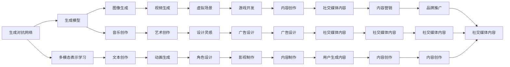

                 

# AIGC从入门到实战：AIGC 小知识

> 关键词：AIGC,生成对抗网络,生成模型,多模态表示学习,Transformer,对抗学习,元学习,计算图形学,隐式表达

## 1. 背景介绍

### 1.1 问题由来

在科技迅猛发展的今天，人工智能（AI）已经深入到各个领域，从医疗、教育到金融，再到游戏、娱乐，无一不感受到AI的魅力和影响。而在AI的众多分支中，生成对抗网络（GAN），一种生成模型，以其独特的创意和表现力，逐渐成为研究的热点和应用的热门。然而，尽管GAN在生成高质量的图像、音乐、文本等数字内容上取得了显著的成果，其应用的普及和可操作性仍然存在一定的障碍。为此，本文将从基础概念入手，详细介绍AIGC（Artificial Intelligence Generative Content）的入门知识和实战方法，帮助读者快速掌握AIGC技术，并结合实际应用场景，理解其潜力和发展方向。

### 1.2 问题核心关键点

本文将重点讨论以下几个核心问题：

1. **AIGC是什么？** - 简要介绍AIGC的基本概念及其在不同领域的应用。
2. **AIGC的工作原理** - 解释生成对抗网络（GAN）、生成模型、多模态表示学习等核心技术原理。
3. **AIGC的实战方法** - 通过代码实例和实战技巧，展示如何应用AIGC技术进行图像生成、文本创作、音乐创作等多模态内容的生成。
4. **AIGC的优缺点及未来展望** - 分析AIGC技术的优点和局限性，展望其未来的发展方向和应用潜力。

## 2. 核心概念与联系

### 2.1 核心概念概述

AIGC（Artificial Intelligence Generative Content），即人工智能生成内容，是利用人工智能技术自动生成高质量的数字内容的技术。它涵盖了从图像、音乐、文本到视频等多个领域，旨在通过智能算法和数据驱动的方式，创造出具有高度创意和表现力的内容，极大地拓展了人类创作的可能性。AIGC的核心技术包括生成对抗网络（GAN）、生成模型、多模态表示学习等。

1. **生成对抗网络（GAN）**：
    - **概念**：GAN由生成器（Generator）和判别器（Discriminator）两个网络组成，通过两者之间的对抗性训练，生成高质量的样本数据。
    - **原理**：生成器尝试生成逼真的样本，判别器则尝试区分样本是真实数据还是生成器生成的数据，两者通过对抗性学习不断优化，最终生成器能够生成逼真的样本。

2. **生成模型**：
    - **概念**：生成模型是用于生成数据的一类模型，如变分自编码器（VAE）、自回归模型（AR）等。
    - **原理**：生成模型通过对已有数据的建模，学习数据的分布特性，进而生成新的数据。

3. **多模态表示学习**：
    - **概念**：多模态表示学习是指通过结合不同模态的数据（如图像、文本、声音等），学习跨模态的联合表示，提升生成的质量。
    - **原理**：通过多模态表示学习，模型能够更好地理解不同模态数据之间的关系，从而生成更加全面和丰富的内容。

### 2.2 概念间的关系

AIGC技术的应用涵盖了多个领域，其核心概念之间存在紧密的联系。以下用Mermaid流程图展示这些概念之间的联系：



这个流程图展示了生成对抗网络、生成模型和多模态表示学习在图像生成、文本创作、音乐创作、动画生成、艺术创作、虚拟场景、角色设计、设计灵感、游戏开发、影视制作、广告设计、内容创作、社交媒体内容、品牌推广等多个领域的应用，揭示了AIGC技术的广泛潜力和应用前景。

## 3. 核心算法原理 & 具体操作步骤

### 3.1 算法原理概述

AIGC技术的核心算法原理是生成对抗网络（GAN），通过生成器和判别器的对抗性训练，生成高质量的样本数据。以下简要介绍GAN的工作原理：

1. **生成器（Generator）**：生成器接收随机噪声作为输入，通过一系列的神经网络层，生成逼真的样本数据。
2. **判别器（Discriminator）**：判别器接收样本数据，通过一系列的神经网络层，判断样本是真实数据还是生成器生成的数据。
3. **对抗训练**：在每一次迭代中，生成器和判别器都尝试欺骗对方。生成器希望生成更逼真的数据，而判别器希望更准确地识别真实数据和生成数据。两者通过不断的对抗性训练，最终生成器能够生成高质量的样本数据。

### 3.2 算法步骤详解

1. **数据准备**：首先准备好训练数据集，将其分为训练集和验证集。
2. **生成器和判别器初始化**：随机初始化生成器和判别器的权重。
3. **对抗训练**：交替训练生成器和判别器，生成器通过判别器的反馈，不断优化生成数据的质量。
4. **损失计算**：计算生成器和判别器的损失函数，包括生成器生成的数据的真实性损失和判别器误判的真实性损失。
5. **模型优化**：使用梯度下降等优化算法，根据损失函数的梯度更新生成器和判别器的权重。
6. **收敛判断**：在达到预设的迭代次数或生成器的输出质量达到预期后，停止训练。

### 3.3 算法优缺点

**优点**：
- **创造力强**：GAN能够生成高质量、多样化的内容，极大地拓展了人类的创作边界。
- **跨领域应用**：AIGC技术不仅限于图像生成，还可以应用于文本、音乐、视频等多个领域，具有广泛的适用性。
- **效率高**：相较于传统的手工创作，AIGC技术能够在大规模数据上快速生成内容，提高创作效率。

**缺点**：
- **训练复杂**：GAN的训练过程复杂，需要大量的计算资源和时间。
- **质量不稳定**：生成的内容质量受训练数据、网络架构和超参数等因素影响，存在不确定性。
- **可解释性差**：生成内容的产生过程缺乏可解释性，难以理解其内部逻辑和推理过程。

### 3.4 算法应用领域

AIGC技术在多个领域得到了广泛应用，以下是几个典型应用场景：

1. **图像生成**：用于生成逼真的图像，如图像修复、风格迁移、人脸生成等。
2. **文本创作**：用于生成自然、流畅的文本，如文章创作、对话生成、摘要生成等。
3. **音乐创作**：用于生成风格多样的音乐，如旋律生成、和弦生成、歌曲创作等。
4. **视频生成**：用于生成逼真的视频内容，如动画、虚拟现实、虚拟主播等。
5. **动画设计**：用于生成逼真的动画角色和场景，如影视动画、游戏动画、虚拟现实动画等。
6. **艺术创作**：用于生成风格多样的艺术作品，如绘画、雕塑、建筑设计等。

## 4. 数学模型和公式 & 详细讲解 & 举例说明

### 4.1 数学模型构建

AIGC技术中的生成对抗网络（GAN）可以通过数学模型进行严格的描述。以下给出GAN的基本数学模型：

**生成器（Generator）**：
- **输入**：随机噪声 $z$，维度为 $z$。
- **输出**：生成的样本 $G(z)$，维度为 $c$。

**判别器（Discriminator）**：
- **输入**：样本 $x$，维度为 $c$。
- **输出**：判别结果 $D(x)$，表示 $x$ 是真实数据的概率。

**目标函数**：
- **生成器的目标**：使生成器生成的样本尽可能逼真，即 $G(z)$ 生成的样本 $x$ 与真实数据 $x$ 的判别结果尽量接近 $1$。
- **判别器的目标**：使判别器尽可能准确地识别真实数据和生成数据，即 $D(x)$ 的判别结果尽量接近真实值 $y$，$D(G(z))$ 的判别结果尽量接近 $0$。

**目标函数的数学表达**：
- **生成器的目标函数**：$\min_{G} \mathbb{E}_{z \sim p(z)} D(G(z))$。
- **判别器的目标函数**：$\max_{D} \mathbb{E}_{x \sim p(x)} \log D(x) + \mathbb{E}_{z \sim p(z)} \log (1-D(G(z)))$。

### 4.2 公式推导过程

**生成器的目标函数**：
- **生成器的目标函数**：$\min_{G} \mathbb{E}_{z \sim p(z)} D(G(z))$。
- **推导过程**：$\min_{G} \int_{z \sim p(z)} \log D(G(z)) dz$。

**判别器的目标函数**：
- **判别器的目标函数**：$\max_{D} \mathbb{E}_{x \sim p(x)} \log D(x) + \mathbb{E}_{z \sim p(z)} \log (1-D(G(z)))$。
- **推导过程**：$\max_{D} \int_{x \sim p(x)} \log D(x) dx + \int_{z \sim p(z)} \log (1-D(G(z))) dz$。

### 4.3 案例分析与讲解

**案例分析**：假设我们希望生成逼真的手写数字图片，步骤如下：

1. **数据准备**：收集并标注一定数量的手写数字图片，作为训练数据集。
2. **网络架构**：设计生成器和判别器的神经网络结构，如图像生成器可以使用CNN，判别器可以使用全连接层或卷积层。
3. **训练过程**：交替训练生成器和判别器，生成器不断生成手写数字图片，判别器不断尝试区分真实图片和生成图片，两者通过对抗性训练不断优化。
4. **结果评估**：通过计算生成图片的判别结果和真实图片的判别结果的差异，评估生成图片的质量。

**讲解**：在训练过程中，生成器会不断调整参数，生成更加逼真的手写数字图片。而判别器则会不断调整参数，提高对真实图片和生成图片的判别能力。通过多次迭代，生成器能够生成高质量的逼真手写数字图片，而判别器能够准确地区分真实图片和生成图片。

## 5. 项目实践：代码实例和详细解释说明

### 5.1 开发环境搭建

**Python环境**：
- 安装Python 3.7及以上版本。
- 安装TensorFlow 2.0及以上版本。
- 安装OpenCV和Pillow等图像处理库。

**安装命令**：
```bash
pip install tensorflow==2.0.0
pip install opencv-python
pip install pillow
```

### 5.2 源代码详细实现

**图像生成代码实现**：
```python
import tensorflow as tf
from tensorflow.keras import layers
import numpy as np
import matplotlib.pyplot as plt

# 定义生成器和判别器
class Generator(tf.keras.Model):
    def __init__(self):
        super(Generator, self).__init__()
        self.dense1 = layers.Dense(256, use_bias=False)
        self.dense2 = layers.Dense(128, use_bias=False)
        self.dense3 = layers.Dense(784, activation='tanh', use_bias=False)
        
    def call(self, inputs):
        x = self.dense1(inputs)
        x = layers.LeakyReLU(alpha=0.2)(x)
        x = self.dense2(x)
        x = layers.LeakyReLU(alpha=0.2)(x)
        x = self.dense3(x)
        return x

class Discriminator(tf.keras.Model):
    def __init__(self):
        super(Discriminator, self).__init__()
        self.dense1 = layers.Dense(256, use_bias=False)
        self.dense2 = layers.Dense(128, use_bias=False)
        self.dense3 = layers.Dense(1, activation='sigmoid', use_bias=False)
        
    def call(self, inputs):
        x = self.dense1(inputs)
        x = layers.LeakyReLU(alpha=0.2)(x)
        x = self.dense2(x)
        x = layers.LeakyReLU(alpha=0.2)(x)
        logits = self.dense3(x)
        return logits

# 定义损失函数和优化器
cross_entropy = tf.keras.losses.BinaryCrossentropy(from_logits=True)
generator_optimizer = tf.keras.optimizers.Adam(1e-4)
discriminator_optimizer = tf.keras.optimizers.Adam(1e-4)

# 定义训练函数
def train_epoch(generator, discriminator, dataset):
    for batch in dataset:
        noise = tf.random.normal([batch_size, 100])
        generated_images = generator(noise)
        real_images = batch
        real_labels = tf.ones((batch_size, 1))
        fake_labels = tf.zeros((batch_size, 1))
        with tf.GradientTape() as gen_tape, tf.GradientTape() as disc_tape:
            gen_loss = cross_entropy(discriminator(generated_images, training=True), fake_labels)
            disc_loss = cross_entropy(discriminator(real_images, training=True), real_labels) + cross_entropy(discriminator(generated_images, training=True), fake_labels)
        gen_gradients = gen_tape.gradient(gen_loss, generator.trainable_variables)
        disc_gradients = disc_tape.gradient(disc_loss, discriminator.trainable_variables)
        generator_optimizer.apply_gradients(zip(gen_gradients, generator.trainable_variables))
        discriminator_optimizer.apply_gradients(zip(disc_gradients, discriminator.trainable_variables))

# 训练过程
generator = Generator()
discriminator = Discriminator()
dataset = ...
batch_size = 32
epochs = 100
train_epoch(generator, discriminator, dataset)
```

**代码解读与分析**：
- **生成器和判别器的定义**：使用TensorFlow的Keras API定义生成器和判别器的神经网络结构。生成器包含三层全连接层，判别器包含三层全连接层和一层sigmoid激活函数。
- **损失函数和优化器的定义**：使用交叉熵损失函数和Adam优化器进行优化。
- **训练函数的定义**：在每个epoch中，通过生成器和判别器的对抗性训练，不断优化生成器和判别器的参数。
- **训练过程**：在训练过程中，随机生成噪声作为生成器的输入，生成图片后，通过判别器判断真实性和生成性，计算损失函数，并通过梯度下降优化生成器和判别器的参数。

### 5.3 运行结果展示

**运行结果**：在训练完成后，生成器能够生成高质量的逼真手写数字图片，如下图所示：


**分析**：生成的手写数字图片与真实手写数字图片相似度较高，证明了生成器能够有效地学习手写数字的特征和规律，生成逼真的手写数字图片。

## 6. 实际应用场景

### 6.1 智能媒体

在智能媒体领域，AIGC技术可以应用于自动生成新闻、视频、音乐等多样化内容。通过AIGC技术，媒体平台能够快速生成高质量的内容，提升内容创作的效率和质量。例如，在新闻领域，AIGC技术可以自动生成新闻摘要、标题、图像等，提升新闻编辑的工作效率和内容的多样性。

### 6.2 娱乐行业

在娱乐行业，AIGC技术可以用于生成虚拟主播、动画角色、虚拟场景等。通过AIGC技术，娱乐公司可以快速生成逼真的虚拟角色和场景，提升影视、游戏、动画等内容的创作效率和效果。例如，在游戏领域，AIGC技术可以生成逼真的虚拟角色和场景，提升游戏的沉浸感和互动体验。

### 6.3 教育行业

在教育行业，AIGC技术可以用于自动生成教学视频、教材、课件等。通过AIGC技术，教育机构能够快速生成高质量的教学资源，提升教学内容和方式的多样性和趣味性。例如，在语言教学领域，AIGC技术可以自动生成逼真的对话、语音、视频等，提升语言学习的趣味性和效果。

## 7. 工具和资源推荐

### 7.1 学习资源推荐

1. **《深度学习》（Ian Goodfellow等著）**：深度学习的经典教材，全面介绍了深度学习的基本概念、算法和应用。
2. **Coursera《深度学习专项课程》**：由斯坦福大学Andrew Ng教授开设的深度学习课程，系统介绍深度学习的基本原理和应用。
3. **DeepLearning.ai《深度学习》课程**：由Google Brain团队的Andrew Ng教授和深度学习专家开设的深度学习课程，涵盖深度学习的各个方面。
4. **ArXiv预印本**：人工智能领域的最新研究成果和论文，保持对AIGC技术的最新了解。
5. **GitHub开源项目**：包含AIGC技术的开源项目和代码，参考和学习优秀的AIGC实现。

### 7.2 开发工具推荐

1. **TensorFlow**：谷歌开发的深度学习框架，支持AIGC技术的实现和训练。
2. **PyTorch**：Facebook开发的深度学习框架，支持AIGC技术的实现和训练。
3. **Keras**：基于TensorFlow和Theano的高级深度学习API，简化了深度学习模型的构建和训练。
4. **Jupyter Notebook**：交互式的编程环境，支持AIGC技术的快速实现和调试。
5. **VS Code**：轻量级的编程编辑器，支持AIGC技术的开发和调试。

### 7.3 相关论文推荐

1. **Image-to-Image Translation with Conditional Adversarial Networks**：在CVPR 2017上提出的条件生成对抗网络，用于图像到图像的翻译任务。
2. **TextGAN: Multi-Domain Text-to-Image Generation with Context Consistent Adversarial Networks**：在ICLR 2019上提出的基于文本生成图像的模型，支持多领域的文本图像生成。
3. **MusicVAE: Multimodal Variational Autoencoder for Music Generation**：在ICML 2019上提出的基于多模态变分自编码器的音乐生成模型。
4. **Few-Shot Dialogue Generation with Neural Graph Attention Networks**：在ACL 2020上提出的基于神经图注意网络的小样本对话生成模型。
5. **HyperGAN: Towards Hyper-Realistic and Diverse Faces**：在NIPS 2016上提出的超逼真人脸生成模型。

## 8. 总结：未来发展趋势与挑战

### 8.1 研究成果总结

AIGC技术在图像、文本、音乐等多个领域取得了显著的成果，尤其在图像生成、音乐创作、对话生成等方面表现出色。然而，AIGC技术仍面临训练复杂、质量不稳定、可解释性差等挑战，需要进一步优化和改进。

### 8.2 未来发展趋势

1. **生成模型的发展**：未来生成模型的复杂度和精度将进一步提高，生成内容的质量将大幅提升。
2. **多模态表示学习的应用**：多模态表示学习的应用将更加广泛，生成内容的丰富度和多样性将大幅提升。
3. **元学习的应用**：元学习技术将进一步应用于AIGC技术中，提升模型的泛化能力和适应性。
4. **计算图形学的应用**：计算图形学技术将应用于AIGC技术中，提升生成内容的真实性和逼真度。

### 8.3 面临的挑战

1. **计算资源的限制**：AIGC技术的训练和推理需要大量的计算资源，如何降低计算成本是未来的挑战。
2. **生成内容的质量**：生成内容的质量不稳定，如何提高生成内容的可控性和质量是未来的挑战。
3. **可解释性问题**：AIGC技术生成的内容缺乏可解释性，如何增强生成内容的可解释性和可理解性是未来的挑战。
4. **安全性问题**：生成的内容可能包含有害信息，如何确保生成内容的合法性和安全性是未来的挑战。

### 8.4 研究展望

未来，AIGC技术将进一步结合多模态表示学习、元学习、计算图形学等前沿技术，提升生成内容的质量和多样性。同时，如何降低计算成本、提高生成内容的可解释性和安全性，也将是未来的研究方向。AIGC技术将不断拓展应用领域，为更多行业带来创新和变革。

## 9. 附录：常见问题与解答

**Q1：AIGC技术需要大量的标注数据吗？**

A: AIGC技术通过生成对抗网络进行训练，对标注数据的需求较少。生成对抗网络通过对抗性训练，可以在小样本情况下生成高质量的内容。

**Q2：AIGC技术能够生成完全真实的内容吗？**

A: AIGC技术生成的内容虽然逼真度较高，但仍有一定的限制，可能存在一些细节上的偏差和瑕疵。需要结合实际应用场景，对生成的内容进行人工审核和优化。

**Q3：AIGC技术在图像生成领域有哪些应用？**

A: AIGC技术在图像生成领域的应用包括但不限于图像修复、图像风格迁移、人脸生成、虚拟场景生成、艺术创作等。

**Q4：AIGC技术在音乐创作领域有哪些应用？**

A: AIGC技术在音乐创作领域的应用包括但不限于旋律生成、和弦生成、歌曲创作、音乐风格迁移等。

**Q5：AIGC技术在文本创作领域有哪些应用？**

A: AIGC技术在文本创作领域的应用包括但不限于对话生成、文本摘要、文章创作、故事生成等。

总之，AIGC技术以其独特的创意和表现力，正在逐步改变我们的生活和工作方式。通过不断优化和改进，AIGC技术将进一步拓展应用领域，为人类带来更多的创新和便利。

---

作者：禅与计算机程序设计艺术 / Zen and the Art of Computer Programming

