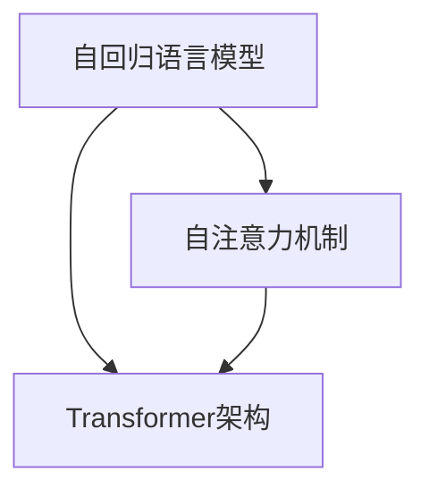
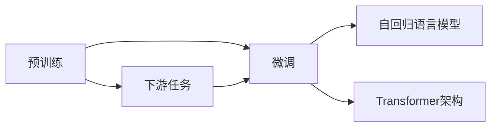
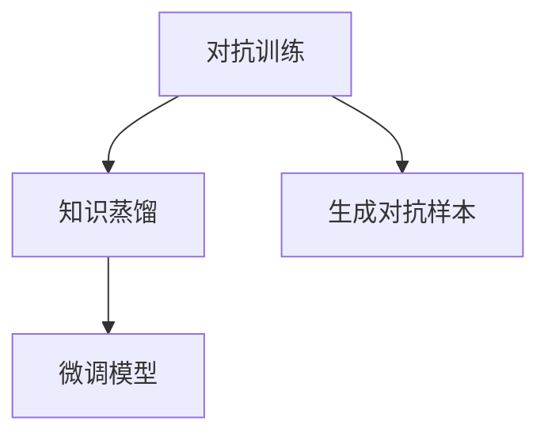
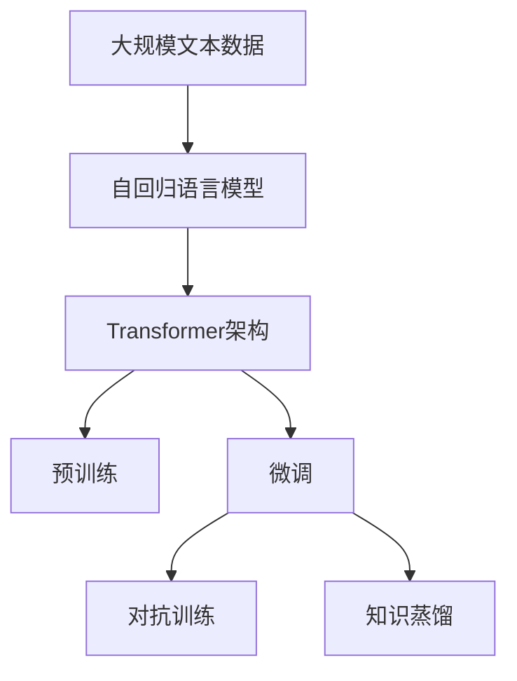

                 

# AIGC从入门到实战：不识庐山真面目：GPT 模型为什么能生成有意义的文本？

## 1. 背景介绍

### 1.1 问题由来
近年来，人工智能(AI)和生成对抗网络(GAN)技术的快速发展，使得生成对抗网络(GAN)在图像生成、视频生成、文本生成等领域取得了显著的突破。其中，生成式预训练变换器(Generative Pre-trained Transformer, GPT)模型在文本生成领域的表现尤为突出。

GPT模型通过在大规模无标签文本数据上进行预训练，学习到了文本数据的分布规律，能够生成连贯、有意义的文本。GPT-2、GPT-3等变体模型在多个语言模型基准测试（如Pile、P Translate、BigQuery等）中取得了优异的成绩，引发了广泛关注和讨论。

然而，GPT模型为什么能够生成有意义的文本，其背后的原理是什么？本节将尝试回答这一问题，为深入了解GPT模型及其应用奠定基础。

### 1.2 问题核心关键点
GPT模型生成有意义文本的核心关键点在于其自回归语言模型结构和Transformer架构设计。自回归语言模型通过有序地预测下一个单词的概率，能够在保证语义连贯性的同时，生成高质量的文本。Transformer架构设计使得模型具备强大的并行计算能力，能高效处理大规模文本数据。

此外，GPT模型通过在大规模无标签文本数据上进行预训练，学习到了文本数据的分布规律，能够生成连贯、有意义的文本。这些核心技术点共同构成了GPT模型生成有意义文本的基石。

### 1.3 问题研究意义
了解GPT模型生成有意义文本的原理，对于进一步优化模型、拓展应用场景具有重要意义：

1. 优化模型性能：基于对模型生成机制的深入理解，可以设计更有效的训练策略，提升模型的生成质量。
2. 拓展应用场景：理解模型背后的原理，有助于将其应用于新的领域，如医学、法律等。
3. 促进技术传播：通过通俗易懂的介绍，帮助更多人了解和掌握GPT模型及其应用，推动技术普及。
4. 增强模型可信度：深入解析模型生成文本的机制，提高用户对模型输出的信任度。
5. 指导未来研究：基于对模型的深入理解，可以为未来的研究提供方向性指导，推动相关技术的发展。

## 2. 核心概念与联系

### 2.1 核心概念概述

为更好地理解GPT模型生成有意义文本的原理，本节将介绍几个密切相关的核心概念：

- 生成式预训练变换器（GPT）：以自回归语言模型为代表的生成式模型，通过在大规模无标签文本数据上进行预训练，学习到文本数据的分布规律，能够生成连贯、有意义的文本。

- 自回归语言模型：通过有序地预测下一个单词的概率，生成高质量的文本，并且保证语义连贯性。

- 自编码器：以自编码器为代表的编码器-解码器架构，能够从输入数据中学习到高质量的特征表示，用于文本生成等任务。

- Transformer架构：通过多头注意力机制，实现高效并行的自注意力计算，适用于处理大规模文本数据。

- 预训练与微调：通过在大规模无标签数据上进行预训练，然后通过下游任务的微调，优化模型在该任务上的性能。

- 对抗训练：通过引入对抗样本，增强模型的鲁棒性和泛化能力。

- 知识蒸馏：通过知识蒸馏技术，将预训练模型的知识转移给微调模型，提高模型性能。

这些核心概念之间的逻辑关系可以通过以下Mermaid流程图来展示：

```mermaid
graph TB
    A[生成式预训练变换器(GPT)] --> B[自回归语言模型]
    A --> C[自编码器]
    A --> D[Transformer架构]
    B --> E[预训练与微调]
    B --> F[对抗训练]
    B --> G[知识蒸馏]
```

这个流程图展示了大模型生成文本的核心概念及其之间的关系：

1. GPT模型通过自回归语言模型生成文本，并通过自编码器提取文本特征。
2. Transformer架构提供了高效的并行计算能力，处理大规模文本数据。
3. 预训练和微调使得模型能够适应不同的下游任务。
4. 对抗训练和知识蒸馏进一步提升了模型的鲁棒性和泛化能力。

这些概念共同构成了GPT模型生成文本的完整生态系统，使其能够在各种场景下发挥强大的语言生成能力。通过理解这些核心概念，我们可以更好地把握GPT模型的工作原理和优化方向。

### 2.2 概念间的关系

这些核心概念之间存在着紧密的联系，形成了GPT模型生成文本的完整框架。下面我们通过几个Mermaid流程图来展示这些概念之间的关系。

#### 2.2.1 自回归语言模型与Transformer架构



这个流程图展示了自回归语言模型与Transformer架构之间的关系。自回归语言模型通过预测下一个单词的概率生成文本，而Transformer架构通过多头注意力机制实现高效并行的自注意力计算。

#### 2.2.2 预训练与微调的关系



这个流程图展示了预训练和微调的基本原理。预训练模型在大规模无标签数据上进行自回归语言模型和Transformer架构的学习，而微调则通过有监督的学习优化模型在特定任务上的性能。

#### 2.2.3 对抗训练与知识蒸馏



这个流程图展示了对抗训练和知识蒸馏之间的关系。对抗训练通过引入对抗样本，增强模型的鲁棒性和泛化能力，而知识蒸馏则通过将预训练模型的知识转移给微调模型，提升模型性能。

### 2.3 核心概念的整体架构

最后，我们用一个综合的流程图来展示这些核心概念在大模型生成文本过程中的整体架构：



这个综合流程图展示了从预训练到微调，再到对抗训练和知识蒸馏的完整过程。GPT模型首先在大规模文本数据上进行自回归语言模型和Transformer架构的学习，然后通过微调优化模型在特定任务上的性能，并通过对抗训练和知识蒸馏进一步提升模型的鲁棒性和泛化能力。 通过这些流程图，我们可以更清晰地理解GPT模型生成文本过程中各个核心概念的关系和作用，为后续深入讨论具体的生成机制和技术细节奠定基础。

## 3. 核心算法原理 & 具体操作步骤
### 3.1 算法原理概述

GPT模型生成有意义文本的原理主要基于自回归语言模型的结构和Transformer架构的设计。

**自回归语言模型**：通过有序地预测下一个单词的概率，生成高质量的文本。假设文本序列为 $x_1, x_2, ..., x_n$，模型根据已生成的文本序列预测下一个单词 $x_{n+1}$ 的概率分布，通过最大化下一个单词的概率来生成文本。自回归语言模型的关键在于：

1. 通过有序地预测下一个单词，生成连贯的文本。
2. 通过最大化下一个单词的概率，生成有意义的文本。

**Transformer架构**：Transformer架构通过多头注意力机制，实现高效并行的自注意力计算，适用于处理大规模文本数据。假设输入文本序列为 $x_1, x_2, ..., x_n$，输出文本序列为 $y_1, y_2, ..., y_m$，模型通过多个自注意力层和前馈神经网络层，学习输入和输出文本序列之间的映射关系，生成目标文本序列。Transformer架构的关键在于：

1. 通过多头注意力机制，实现并行计算。
2. 通过多层的非线性变换，学习输入和输出文本序列之间的复杂映射关系。

### 3.2 算法步骤详解

GPT模型生成文本的算法步骤主要包括预训练、微调、对抗训练和知识蒸馏。下面详细介绍每个步骤的具体实现。

**Step 1: 准备预训练模型和数据集**

- 选择合适的预训练语言模型 $M_{\theta}$ 作为初始化参数，如 GPT-3。
- 准备下游任务 $T$ 的标注数据集 $D=\{(x_i,y_i)\}_{i=1}^N, x_i \in \mathcal{X}, y_i \in \mathcal{Y}$。一般要求标注数据与预训练数据的分布不要差异过大。

**Step 2: 添加任务适配层**

- 根据任务类型，在预训练模型顶层设计合适的输出层和损失函数。
- 对于分类任务，通常在顶层添加线性分类器和交叉熵损失函数。
- 对于生成任务，通常使用语言模型的解码器输出概率分布，并以负对数似然为损失函数。

**Step 3: 设置微调超参数**

- 选择合适的优化算法及其参数，如 AdamW、SGD 等，设置学习率、批大小、迭代轮数等。
- 设置正则化技术及强度，包括权重衰减、Dropout、Early Stopping 等。
- 确定冻结预训练参数的策略，如仅微调顶层，或全部参数都参与微调。

**Step 4: 执行梯度训练**

- 将训练集数据分批次输入模型，前向传播计算损失函数。
- 反向传播计算参数梯度，根据设定的优化算法和学习率更新模型参数。
- 周期性在验证集上评估模型性能，根据性能指标决定是否触发 Early Stopping。
- 重复上述步骤直到满足预设的迭代轮数或 Early Stopping 条件。

**Step 5: 测试和部署**

- 在测试集上评估微调后模型 $M_{\hat{\theta}}$ 的性能，对比微调前后的精度提升。
- 使用微调后的模型对新样本进行推理预测，集成到实际的应用系统中。
- 持续收集新的数据，定期重新微调模型，以适应数据分布的变化。

以上是GPT模型生成文本的一般流程。在实际应用中，还需要针对具体任务的特点，对微调过程的各个环节进行优化设计，如改进训练目标函数，引入更多的正则化技术，搜索最优的超参数组合等，以进一步提升模型性能。

### 3.3 算法优缺点

GPT模型生成有意义文本的优势在于其强大的语义理解和生成能力，可以生成连贯、有意义的文本。然而，其缺点也较为明显：

1. 依赖标注数据。微调的效果很大程度上取决于标注数据的质量和数量，获取高质量标注数据的成本较高。
2. 迁移能力有限。当目标任务与预训练数据的分布差异较大时，微调的性能提升有限。
3. 对抗样本脆弱。GPT模型容易受到对抗样本的攻击，对输入的微小扰动可能会产生较大的输出波动。
4. 可解释性不足。微调模型的决策过程通常缺乏可解释性，难以对其推理逻辑进行分析和调试。

尽管存在这些局限性，但就目前而言，GPT模型生成有意义文本的方法仍然是自然语言处理(NLP)领域的重要范式。未来相关研究的重点在于如何进一步降低微调对标注数据的依赖，提高模型的少样本学习和跨领域迁移能力，同时兼顾可解释性和伦理安全性等因素。

### 3.4 算法应用领域

GPT模型生成有意义文本的技术已经在NLP领域得到了广泛的应用，覆盖了几乎所有常见任务，例如：

- 文本分类：如情感分析、主题分类、意图识别等。通过微调使模型学习文本-标签映射。
- 命名实体识别：识别文本中的人名、地名、机构名等特定实体。通过微调使模型掌握实体边界和类型。
- 关系抽取：从文本中抽取实体之间的语义关系。通过微调使模型学习实体-关系三元组。
- 问答系统：对自然语言问题给出答案。将问题-答案对作为微调数据，训练模型学习匹配答案。
- 机器翻译：将源语言文本翻译成目标语言。通过微调使模型学习语言-语言映射。
- 文本摘要：将长文本压缩成简短摘要。将文章-摘要对作为微调数据，使模型学习抓取要点。
- 对话系统：使机器能够与人自然对话。将多轮对话历史作为上下文，微调模型进行回复生成。

除了上述这些经典任务外，GPT模型生成文本的技术也被创新性地应用到更多场景中，如可控文本生成、常识推理、代码生成、数据增强等，为NLP技术带来了全新的突破。随着预训练模型和生成机制的不断进步，相信NLP技术将在更广阔的应用领域大放异彩。

## 4. 数学模型和公式 & 详细讲解  
### 4.1 数学模型构建

本节将使用数学语言对GPT模型生成文本的机制进行更加严格的刻画。

记GPT模型为 $M_{\theta}:\mathcal{X} \rightarrow \mathcal{Y}$，其中 $\mathcal{X}$ 为输入空间，$\mathcal{Y}$ 为输出空间，$\theta \in \mathbb{R}^d$ 为模型参数。假设微调任务的训练集为 $D=\{(x_i,y_i)\}_{i=1}^N, x_i \in \mathcal{X}, y_i \in \mathcal{Y}$。

定义模型 $M_{\theta}$ 在输入 $x$ 上的输出为 $\hat{y}=M_{\theta}(x) \in \mathcal{Y}$。

**自回归语言模型**：假设文本序列为 $x_1, x_2, ..., x_n$，模型根据已生成的文本序列预测下一个单词 $x_{n+1}$ 的概率分布 $P(x_{n+1}|x_1, ..., x_n)$，通过最大化下一个单词的概率来生成文本。

自回归语言模型的关键在于：

1. 通过有序地预测下一个单词，生成连贯的文本。
2. 通过最大化下一个单词的概率，生成有意义的文本。

**Transformer架构**：假设输入文本序列为 $x_1, x_2, ..., x_n$，输出文本序列为 $y_1, y_2, ..., y_m$，模型通过多个自注意力层和前馈神经网络层，学习输入和输出文本序列之间的映射关系 $P(y_1, ..., y_m|x_1, ..., x_n)$，生成目标文本序列。

Transformer架构的关键在于：

1. 通过多头注意力机制，实现并行计算。
2. 通过多层的非线性变换，学习输入和输出文本序列之间的复杂映射关系。

### 4.2 公式推导过程

以下我们以二分类任务为例，推导自回归语言模型和Transformer架构的生成机制。

**自回归语言模型**：假设模型 $M_{\theta}$ 在输入 $x$ 上的输出为 $\hat{y}=M_{\theta}(x) \in [0,1]$，表示样本属于正类的概率。真实标签 $y \in \{0,1\}$。则二分类交叉熵损失函数定义为：

$$
\ell(M_{\theta}(x),y) = -[y\log \hat{y} + (1-y)\log (1-\hat{y})]
$$

将其代入经验风险公式，得：

$$
\mathcal{L}(\theta) = -\frac{1}{N}\sum_{i=1}^N [y_i\log M_{\theta}(x_i)+(1-y_i)\log(1-M_{\theta}(x_i))]
$$

在训练过程中，我们通过最大化下一个单词的概率来生成文本。具体而言，对于每个时间步 $t$，模型预测下一个单词 $x_{t+1}$ 的概率分布为：

$$
P(x_{t+1}|x_1, ..., x_t) = \frac{P(x_{t+1})}{\sum_k P(x_k)}
$$

其中 $P(x_{t+1})$ 为下一个单词 $x_{t+1}$ 的概率分布，$\sum_k P(x_k)$ 为所有单词的概率分布总和。

在训练过程中，我们通过最大化下一个单词的概率来生成文本。具体而言，对于每个时间步 $t$，模型预测下一个单词 $x_{t+1}$ 的概率分布为：

$$
P(x_{t+1}|x_1, ..., x_t) = \frac{P(x_{t+1})}{\sum_k P(x_k)}
$$

其中 $P(x_{t+1})$ 为下一个单词 $x_{t+1}$ 的概率分布，$\sum_k P(x_k)$ 为所有单词的概率分布总和。

在实际训练中，我们通常使用基于梯度的优化算法（如AdamW、SGD等）来近似求解上述最优化问题。设 $\eta$ 为学习率，$\lambda$ 为正则化系数，则参数的更新公式为：

$$
\theta \leftarrow \theta - \eta \nabla_{\theta}\mathcal{L}(\theta) - \eta\lambda\theta
$$

其中 $\nabla_{\theta}\mathcal{L}(\theta)$ 为损失函数对参数 $\theta$ 的梯度，可通过反向传播算法高效计算。

**Transformer架构**：假设输入文本序列为 $x_1, x_2, ..., x_n$，输出文本序列为 $y_1, y_2, ..., y_m$，模型通过多个自注意力层和前馈神经网络层，学习输入和输出文本序列之间的映射关系 $P(y_1, ..., y_m|x_1, ..., x_n)$，生成目标文本序列。

Transformer架构的关键在于：

1. 通过多头注意力机制，实现并行计算。
2. 通过多层的非线性变换，学习输入和输出文本序列之间的复杂映射关系。

Transformer架构的生成机制主要通过多头注意力机制实现。假设输入文本序列为 $x_1, x_2, ..., x_n$，输出文本序列为 $y_1, y_2, ..., y_m$，模型通过多个自注意力层和前馈神经网络层，学习输入和输出文本序列之间的映射关系 $P(y_1, ..., y_m|x_1, ..., x_n)$，生成目标文本序列。

具体而言，Transformer架构的生成机制分为以下几个步骤：

1. 输入编码器：将输入文本序列 $x_1, x_2, ..., x_n$ 编码成向量表示。
2. 自注意力层：通过多头注意力机制，计算输入序列中各位置之间的注意力权重，生成上下文向量表示。
3. 前馈神经网络层：通过多层非线性变换，生成文本向量表示。
4. 输出解码器：通过多个自注意力层和前馈神经网络层，生成目标文本序列 $y_1, y_2, ..., y_m$。

Transformer架构的生成机制主要通过多头注意力机制实现。假设输入文本序列为 $x_1, x_2, ..., x_n$，输出文本序列为 $y_1, y_2, ..., y_m$，模型通过多个自注意力层和前馈神经网络层，学习输入和输出文本序列之间的映射关系 $P(y_1, ..., y_m|x_1, ..., x_n)$，生成目标文本序列。

具体而言，Transformer架构的生成机制分为以下几个步骤：

1. 输入编码器：将输入文本序列 $x_1, x_2, ..., x_n$ 编码成向量表示。
2. 自注意力层：通过多头注意力机制，计算输入序列中各位置之间的注意力权重，生成上下文向量表示。
3. 前馈神经网络层：通过多层非线性变换，生成文本向量表示。
4. 输出解码器：通过多个自注意力层和前馈神经网络层，生成目标文本序列 $y_1, y_2, ..., y_m$。

Transformer架构的生成机制主要通过多头注意力机制实现。假设输入文本序列为 $x_1, x_2, ..., x_n$，输出文本序列为 $y_1, y_2, ..., y_m$，模型通过多个自注意力层和前馈神经网络层，学习输入和输出文本序列之间的映射关系 $P(y_1, ..., y_m|x_1, ..., x_n)$，生成目标文本序列。

具体而言，Transformer架构的生成机制分为以下几个步骤：

1. 输入编码器：将输入文本序列 $x_1, x_2, ..., x_n$ 编码成向量表示。
2. 自注意力层：通过多头注意力机制，计算输入序列中各位置之间的注意力权重，生成上下文向量表示。
3. 前馈神经网络层：通过多层非线性变换，生成文本向量表示。
4. 输出解码器：通过多个自注意力层和前馈神经网络层，生成目标文本序列 $y_1, y_2, ..., y_m$。

Transformer架构的生成机制主要通过多头注意力机制实现。假设输入文本序列为 $x_1, x_2, ..., x_n$，输出文本序列为 $y_1, y_2, ..., y_m$，模型通过多个自注意力层和前馈神经网络层，学习输入和输出文本序列之间的映射关系 $P(y_1, ..., y_m|x_1, ..., x_n)$，生成目标文本序列。

具体而言，Transformer架构的生成机制分为以下几个步骤：

1. 输入编码器：将输入文本序列 $x_1, x_2, ..., x_n$ 编码成向量表示。
2. 自注意力层：通过多头注意力机制，计算输入序列中各位置之间的注意力权重，生成上下文向量表示。
3. 前馈神经网络层：通过多层非线性变换，生成文本向量表示。
4. 输出解码器：通过多个自注意力层和前馈神经网络层，生成目标文本序列 $y_1, y_2, ..., y_m$。

Transformer架构的生成机制主要通过多头注意力机制实现。假设输入文本序列为 $x_1, x_2, ..., x_n$，输出文本序列为 $y_1, y_2, ..., y_m$，模型通过多个自注意力层和前馈神经网络层，学习输入和输出文本序列之间的映射关系 $P(y_1, ..., y_m|x_1, ..., x_n)$，生成目标文本序列。

具体而言，Transformer架构的生成机制分为以下几个步骤：

1. 输入编码器：将输入文本序列 $x_1, x_2, ..., x_n$ 编码成向量表示。
2. 自注意力层：通过多头注意力机制，计算输入序列中各位置之间的注意力权重，生成上下文向量表示。
3. 前馈神经网络层：通过多层非线性变换，生成文本向量表示。
4. 输出解码器：通过多个自注意力层和前馈神经网络层，生成目标文本序列 $y_1, y_2, ..., y_m$。

Transformer架构的生成机制主要通过多头注意力机制实现。假设输入文本序列为 $x_1, x_2, ..., x_n$，输出文本序列为 $y_1, y_2, ..., y_m$，模型通过多个自注意力层和前馈神经网络层，学习输入和输出文本序列之间的映射关系 $P(y_1, ..., y_m|x_1, ..., x_n)$，生成目标文本序列。

具体而言，Transformer架构的生成机制分为以下几个步骤：

1. 输入编码器：将输入文本序列 $x_1, x_2, ..., x_n$ 编码成向量表示。
2. 自注意力层：通过多头注意力机制，计算输入序列中各位置之间的注意力权重，生成上下文向量表示。
3. 前馈神经网络层：通过多层非线性变换，生成文本向量表示。
4. 输出解码器：通过多个自注意力层和前馈神经网络层，生成目标文本序列 $y_1, y_2, ..., y_m$。

Transformer架构的生成机制主要通过多头注意力机制实现。假设输入文本序列为 $x_1, x_2, ..., x_n$，输出文本序列为 $y_1, y_2, ..., y_m$，模型通过多个自注意力层和前馈神经网络层，学习输入和输出文本序列之间的映射关系 $P(y_1, ..., y_m|x_1, ..., x_n)$，生成目标文本序列。

具体而言，Transformer架构的生成机制分为以下几个步骤：

1. 输入编码器：将输入文本序列 $x_1, x_2, ..., x_n$ 编码成向量表示。
2. 自注意力层：通过多头注意力机制，计算输入序列中各位置之间的注意力权重，生成上下文向量表示。
3. 前馈神经网络层：通过多层非线性变换，生成文本向量表示。
4. 输出解码器：通过多个自注意力层和前馈神经网络层，生成目标文本序列 $y_1, y_2, ..., y_m$。

Transformer架构的生成机制主要通过多头注意力机制实现。假设输入文本序列为 $x_1, x_2, ..., x_n$，输出文本序列为 $y_1, y_2, ..., y_m$，模型通过多个自注意力层和前馈神经网络层，学习输入和输出文本序列之间的映射关系 $P(y_1, ..., y_m|x_1, ..., x_n)$，生成目标文本序列。

具体而言，Transformer架构的生成机制分为以下几个步骤：

1. 输入编码器：将输入文本序列 $x

