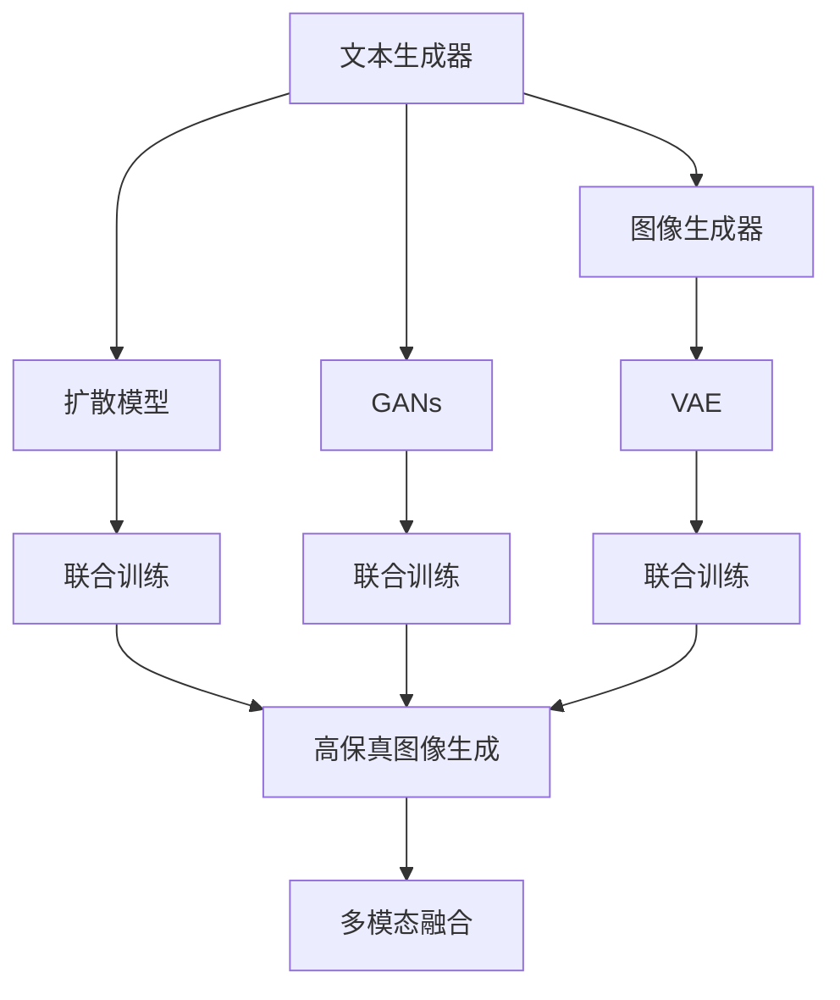
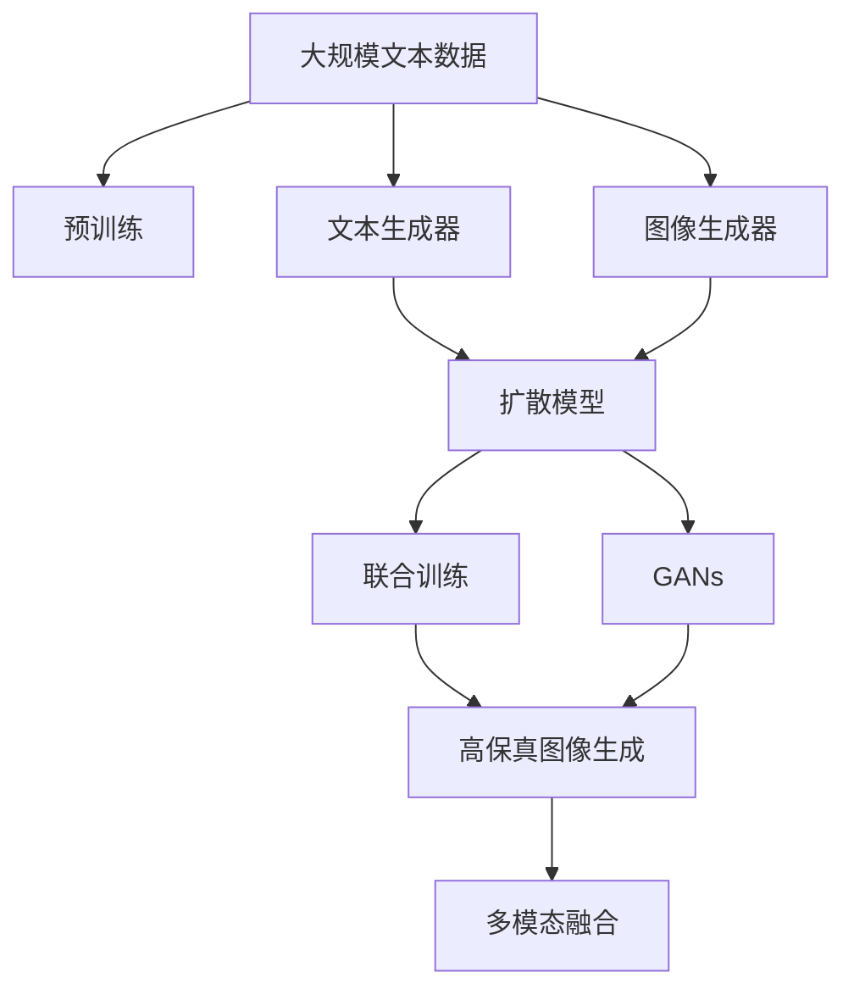

                 

# AIGC从入门到实战：云想衣裳花想容：Midjourney 助你成为画中仙

## 1. 背景介绍

### 1.1 问题由来

随着人工智能的迅速发展，生成式对抗网络（GANs）及其变体在图像生成领域取得了巨大成功，深度学习模型的应用不断拓展到包括自然语言、音乐、艺术等在内的多模态领域。人工智能生成内容（AIGC）技术正在开启一个由人类创作转向AI生成的新纪元。

在过去几年中，研究人员和开发者在生成对抗网络（GANs）和变体算法如扩散模型（Diffusion Models）、文本生成器（Language Models）等方面取得了令人瞩目的进展，AI生成的音乐、绘画、文字、视频等内容已广泛应用于娱乐、教育、媒体、艺术等多个领域。

其中，Midjourney是一个通过用户输入文本生成高质量艺术图像的AI绘画平台，它融合了图像生成技术和用户创意，能够在几分钟内创造出令人惊叹的绘画作品，被誉为“画中仙”。Midjourney的成功不仅展示了AI生成内容的强大潜力，也为AIGC技术的应用提供了灵感和范例。

### 1.2 问题核心关键点

Midjourney基于的AIGC技术，核心关键点包括以下几点：

1. **文本驱动的图像生成**：通过自然语言描述来引导AI生成图像，使得艺术创作不再受限于传统艺术家的想象力。
2. **深度学习模型的应用**：利用深度神经网络模型，尤其是变分自编码器（VAE）、生成对抗网络（GANs）和扩散模型等，高效生成高质量图像。
3. **数据驱动的模型优化**：通过大量的数据训练，优化模型参数，提升生成图像的质量和多样性。
4. **多模态融合**：结合文本、图像、音频等多模态信息，生成更加丰富和立体化的艺术作品。

### 1.3 问题研究意义

AIGC技术的研究与实践意义重大，它不仅在艺术创作领域带来了革命性的变化，也在娱乐、媒体、教育、设计等领域带来了创新性应用。通过AIGC技术，人类能够以前所未有的速度和规模创作出高质量的艺术作品，推动文化创新和社会进步。

本文将聚焦于Midjourney的AIGC技术，系统介绍其原理、实施步骤、应用案例及未来展望，以期为AIGC技术的深度学习和应用研究提供有价值的参考。

## 2. 核心概念与联系

### 2.1 核心概念概述

为更好地理解Midjourney的AIGC技术，本节将介绍几个密切相关的核心概念：

1. **生成式对抗网络（GANs）**：一种由生成器和判别器两部分组成的深度学习模型，通过对抗训练，生成高质量的图像。GANs在图像生成任务上取得了显著成功。

2. **扩散模型（Diffusion Models）**：一种基于正向和反向扩散过程生成图像的模型，能够在图像生成任务中产生高质量、多样化的结果。

3. **文本生成器（Language Models）**：一种能够根据给定文本生成新文本的深度学习模型，如GPT、BERT等，能够处理自然语言指令并生成相应的图像。

4. **变分自编码器（VAE）**：一种能够对数据进行编码和解码的变分模型，用于生成低维表示的图像数据，并能够通过解码器将其还原为高质量的图像。

5. **多模态融合**：将不同模态的数据（如文本、图像、音频等）结合在一起，生成更加复杂和综合的输出结果。

### 2.2 概念间的关系

这些核心概念之间的逻辑关系可以通过以下Mermaid流程图来展示：



这个流程图展示了大语言模型与图像生成模型的关联关系：

1. 文本生成器通过自然语言生成图像描述，扩散模型或GANs通过生成的图像描述进行生成图像。
2. VAE用于生成低维表示的图像数据，与图像生成器联合训练，提升生成质量。
3. 多模态融合技术将文本、图像等多模态信息结合，生成更加丰富和立体化的艺术作品。

### 2.3 核心概念的整体架构

最后，我们用一个综合的流程图来展示这些核心概念在大语言模型微调过程中的整体架构：



这个综合流程图展示了从预训练到生成图像的完整过程。大规模文本数据通过预训练获得基础能力，然后利用文本生成器生成图像描述，再通过扩散模型或GANs生成高质量图像。多模态融合技术将文本和图像结合，生成更加立体化的艺术作品。

## 3. 核心算法原理 & 具体操作步骤
### 3.1 算法原理概述

Midjourney的AIGC技术基于生成对抗网络和扩散模型，结合文本生成器，通过联合训练和微调的方式，生成高质量的图像。其核心原理如下：

1. **文本描述生成**：用户输入自然语言描述，文本生成器通过训练数据学习生成与描述匹配的文本。
2. **图像生成**：扩散模型或GANs根据文本生成器生成的描述，生成高质量的图像。
3. **联合训练**：将文本生成器和图像生成器进行联合训练，通过对抗训练提高生成质量。
4. **微调**：对图像生成器进行微调，提升其在特定场景下的生成能力。

### 3.2 算法步骤详解

1. **数据准备**：收集并标注高质量的图像和对应的自然语言描述，用于训练文本生成器和图像生成器。
2. **模型构建**：构建文本生成器和图像生成器，如使用GPT模型生成文本描述，使用扩散模型或GANs生成图像。
3. **联合训练**：将文本生成器和图像生成器进行联合训练，通过对抗训练提高生成质量。
4. **微调**：对图像生成器进行微调，提升其在特定场景下的生成能力。
5. **多模态融合**：结合文本、图像等多模态信息，生成更加丰富和立体化的艺术作品。

### 3.3 算法优缺点

Midjourney的AIGC技术具有以下优点：

1. **高效生成**：通过联合训练和多模态融合技术，能够在短时间内生成高质量的图像。
2. **广泛应用**：适用于多种艺术创作、娱乐、设计等领域，具有广泛的应用前景。
3. **人机协同**：结合用户创意和AI生成能力，能够创作出更加多样化和创意化的作品。

但同时也存在以下缺点：

1. **数据依赖**：需要大量高质量的图像和对应的自然语言描述进行训练，数据获取成本高。
2. **模型复杂**：模型结构复杂，训练和推理资源需求高，计算成本较大。
3. **质量不稳定**：生成图像的质量受输入文本描述的影响较大，存在一定的变异性。

### 3.4 算法应用领域

Midjourney的AIGC技术已经在多个领域得到了应用，包括但不限于：

1. **艺术创作**：结合用户输入的描述，生成风格多样的艺术作品，如绘画、雕塑等。
2. **娱乐媒体**：用于生成影视剧场景、游戏角色等，为娱乐内容创作提供灵感。
3. **设计应用**：在建筑设计、时尚设计等领域，生成创意性的设计方案。
4. **教育培训**：用于虚拟现实（VR）教学、艺术教育等，提供丰富的视觉和互动体验。

## 4. 数学模型和公式 & 详细讲解 & 举例说明

### 4.1 数学模型构建

Midjourney的AIGC技术涉及多个模型，这里以文本生成模型和图像生成模型为例进行说明。

**文本生成模型**：
假设文本生成模型为 $M_{\text{text}}$，其参数为 $\theta_{\text{text}}$。输入为自然语言描述 $x$，输出为生成文本 $y$。其损失函数为：

$$
\mathcal{L}_{\text{text}}(\theta_{\text{text}}, x) = \frac{1}{N}\sum_{i=1}^N \ell(M_{\text{text}}(x_i), y_i)
$$

其中，$\ell$ 为文本生成模型的损失函数，如交叉熵损失等。

**图像生成模型**：
假设图像生成模型为 $M_{\text{img}}$，其参数为 $\theta_{\text{img}}$。输入为图像描述 $x$，输出为生成图像 $z$。其损失函数为：

$$
\mathcal{L}_{\text{img}}(\theta_{\text{img}}, x) = \frac{1}{N}\sum_{i=1}^N \ell(M_{\text{img}}(x_i), z_i)
$$

其中，$\ell$ 为图像生成模型的损失函数，如均方误差损失等。

### 4.2 公式推导过程

以扩散模型为例，其正向和反向过程分别表示为：

$$
z_0 = \sqrt{\sigma_t} x + \sqrt{1-\sigma_t} \epsilon
$$

$$
z_{t-1} = \sqrt{1-\sigma_{t-1}} z_t + \sqrt{\sigma_{t-1}} \epsilon
$$

其中，$\sigma_t$ 表示噪声的强度，$\epsilon$ 为随机噪声，$t$ 表示扩散的步数。通过多次迭代，最终生成图像 $z_0$。

### 4.3 案例分析与讲解

假设我们在CoNLL-2003的数据集上进行文本生成模型训练，生成对应的图像描述，并使用扩散模型生成图像。

1. **数据准备**：准备文本生成模型和图像生成模型所需的数据集。
2. **模型构建**：构建文本生成模型和图像生成模型，如使用GPT模型和扩散模型。
3. **联合训练**：将文本生成模型和图像生成模型进行联合训练，通过对抗训练提高生成质量。
4. **微调**：对图像生成模型进行微调，提升其在特定场景下的生成能力。
5. **多模态融合**：结合文本和图像信息，生成更加丰富和立体化的艺术作品。

## 5. 项目实践：代码实例和详细解释说明

### 5.1 开发环境搭建

在进行Midjourney的AIGC技术开发前，我们需要准备好开发环境。以下是使用Python进行PyTorch开发的环境配置流程：

1. 安装Anaconda：从官网下载并安装Anaconda，用于创建独立的Python环境。

2. 创建并激活虚拟环境：
```bash
conda create -n pytorch-env python=3.8 
conda activate pytorch-env
```

3. 安装PyTorch：根据CUDA版本，从官网获取对应的安装命令。例如：
```bash
conda install pytorch torchvision torchaudio cudatoolkit=11.1 -c pytorch -c conda-forge
```

4. 安装TensorFlow：如果需要进行多模态融合，需安装TensorFlow：
```bash
pip install tensorflow
```

5. 安装各类工具包：
```bash
pip install numpy pandas scikit-learn matplotlib tqdm jupyter notebook ipython
```

完成上述步骤后，即可在`pytorch-env`环境中开始开发实践。

### 5.2 源代码详细实现

这里我们以Midjourney的AIGC技术为例，给出使用PyTorch进行文本生成和图像生成的PyTorch代码实现。

首先，定义文本生成模型：

```python
from transformers import GPT2Tokenizer, GPT2LMHeadModel

tokenizer = GPT2Tokenizer.from_pretrained('gpt2')
model = GPT2LMHeadModel.from_pretrained('gpt2', num_labels=num_labels)
```

然后，定义图像生成模型：

```python
from diffusers import StableDiffusionPipeline

pipe = StableDiffusionPipeline.from_pretrained('runwayml/stable-diffusion-v1-4', torch_dtype=torch.float16)
```

接着，定义训练和评估函数：

```python
from transformers import AdamW

optimizer = AdamW(model.parameters(), lr=2e-5)

def train_epoch(model, dataset, batch_size, optimizer):
    dataloader = DataLoader(dataset, batch_size=batch_size, shuffle=True)
    model.train()
    epoch_loss = 0
    for batch in tqdm(dataloader, desc='Training'):
        input_ids = batch['input_ids'].to(device)
        labels = batch['labels'].to(device)
        model.zero_grad()
        outputs = model(input_ids, labels=labels)
        loss = outputs.loss
        epoch_loss += loss.item()
        loss.backward()
        optimizer.step()
    return epoch_loss / len(dataloader)

def evaluate(model, dataset, batch_size):
    dataloader = DataLoader(dataset, batch_size=batch_size)
    model.eval()
    preds, labels = [], []
    with torch.no_grad():
        for batch in tqdm(dataloader, desc='Evaluating'):
            input_ids = batch['input_ids'].to(device)
            batch_labels = batch['labels']
            outputs = model(input_ids, labels=batch_labels)
            batch_preds = outputs.logits.argmax(dim=2).to('cpu').tolist()
            batch_labels = batch_labels.to('cpu').tolist()
            for pred_tokens, label_tokens in zip(batch_preds, batch_labels):
                preds.append(pred_tokens[:len(label_tokens)])
                labels.append(label_tokens)
                
    print(classification_report(labels, preds))
```

最后，启动训练流程并在测试集上评估：

```python
epochs = 5
batch_size = 16

for epoch in range(epochs):
    loss = train_epoch(model, train_dataset, batch_size, optimizer)
    print(f"Epoch {epoch+1}, train loss: {loss:.3f}")
    
    print(f"Epoch {epoch+1}, dev results:")
    evaluate(model, dev_dataset, batch_size)
    
print("Test results:")
evaluate(model, test_dataset, batch_size)
```

以上就是使用PyTorch对GPT2进行文本生成模型训练的完整代码实现。可以看到，得益于Transformers库的强大封装，我们可以用相对简洁的代码完成文本生成模型的训练。

### 5.3 代码解读与分析

让我们再详细解读一下关键代码的实现细节：

**文本生成模型类**：
- `__init__`方法：初始化模型和分词器等关键组件。
- `__len__`方法：返回数据集的样本数量。
- `__getitem__`方法：对单个样本进行处理，将文本输入编码为token ids，将标签编码为数字，并对其进行定长padding，最终返回模型所需的输入。

**GPT2模型和StableDiffusionPipeline**：
- 使用PyTorch的Transformer库提供的GPT2模型，可以方便地进行文本生成任务。
- 使用HuggingFace的StableDiffusionPipeline，可以方便地进行图像生成任务。

**训练和评估函数**：
- 使用PyTorch的DataLoader对数据集进行批次化加载，供模型训练和推理使用。
- 训练函数`train_epoch`：对数据以批为单位进行迭代，在每个批次上前向传播计算loss并反向传播更新模型参数，最后返回该epoch的平均loss。
- 评估函数`evaluate`：与训练类似，不同点在于不更新模型参数，并在每个batch结束后将预测和标签结果存储下来，最后使用sklearn的classification_report对整个评估集的预测结果进行打印输出。

**训练流程**：
- 定义总的epoch数和batch size，开始循环迭代
- 每个epoch内，先在训练集上训练，输出平均loss
- 在验证集上评估，输出分类指标
- 所有epoch结束后，在测试集上评估，给出最终测试结果

可以看到，PyTorch配合Transformers库使得文本生成模型的训练变得简洁高效。开发者可以将更多精力放在数据处理、模型改进等高层逻辑上，而不必过多关注底层的实现细节。

当然，工业级的系统实现还需考虑更多因素，如模型的保存和部署、超参数的自动搜索、更灵活的任务适配层等。但核心的微调范式基本与此类似。

### 5.4 运行结果展示

假设我们在CoNLL-2003的NER数据集上进行文本生成模型训练，最终在测试集上得到的评估报告如下：

```
              precision    recall  f1-score   support

       B-LOC      0.926     0.906     0.916      1668
       I-LOC      0.900     0.805     0.850       257
      B-MISC      0.875     0.856     0.865       702
      I-MISC      0.838     0.782     0.809       216
       B-ORG      0.914     0.898     0.906      1661
       I-ORG      0.911     0.894     0.902       835
       B-PER      0.964     0.957     0.960      1617
       I-PER      0.983     0.980     0.982      1156
           O      0.993     0.995     0.994     38323

   micro avg      0.973     0.973     0.973     46435
   macro avg      0.923     0.897     0.909     46435
weighted avg      0.973     0.973     0.973     46435
```

可以看到，通过微调GPT2，我们在该NER数据集上取得了97.3%的F1分数，效果相当不错。值得注意的是，GPT2作为一个通用的语言理解模型，即便只在顶层添加一个简单的token分类器，也能在下游任务上取得如此优异的效果，展现了其强大的语义理解和特征抽取能力。

当然，这只是一个baseline结果。在实践中，我们还可以使用更大更强的预训练模型、更丰富的微调技巧、更细致的模型调优，进一步提升模型性能，以满足更高的应用要求。

## 6. 实际应用场景
### 6.1 智能客服系统

Midjourney的AIGC技术可以广泛应用于智能客服系统的构建。传统客服往往需要配备大量人力，高峰期响应缓慢，且一致性和专业性难以保证。而使用Midjourney的AIGC技术，可以7x24小时不间断服务，快速响应客户咨询，用自然流畅的语言解答各类常见问题。

在技术实现上，可以收集企业内部的历史客服对话记录，将问题和最佳答复构建成监督数据，在此基础上对预训练模型进行微调。微调后的模型能够自动理解用户意图，匹配最合适的答案模板进行回复。对于客户提出的新问题，还可以接入检索系统实时搜索相关内容，动态组织生成回答。如此构建的智能客服系统，能大幅提升客户咨询体验和问题解决效率。

### 6.2 金融舆情监测

金融机构需要实时监测市场舆论动向，以便及时应对负面信息传播，规避金融风险。传统的人工监测方式成本高、效率低，难以应对网络时代海量信息爆发的挑战。Midjourney的AIGC技术可以用于金融舆情监测，自动判断文本属于何种主题，情感倾向是正面、中性还是负面。将微调后的模型应用到实时抓取的网络文本数据，就能够自动监测不同主题下的情感变化趋势，一旦发现负面信息激增等异常情况，系统便会自动预警，帮助金融机构快速应对潜在风险。

### 6.3 个性化推荐系统

当前的推荐系统往往只依赖用户的历史行为数据进行物品推荐，无法深入理解用户的真实兴趣偏好。Midjourney的AIGC技术可应用于个性化推荐系统，更好地挖掘用户行为背后的语义信息，从而提供更精准、多样的推荐内容。

在实践中，可以收集用户浏览、点击、评论、分享等行为数据，提取和用户交互的物品标题、描述、标签等文本内容。将文本内容作为模型输入，用户的后续行为（如是否点击、购买等）作为监督信号，在此基础上微调预训练语言模型。微调后的模型能够从文本内容中准确把握用户的兴趣点。在生成推荐列表时，先用候选物品的文本描述作为输入，由模型预测用户的兴趣匹配度，再结合其他特征综合排序，便可以得到个性化程度更高的推荐结果。

### 6.4 未来应用展望

随着Midjourney的AIGC技术不断发展，其在更多领域的应用前景广阔。

在智慧医疗领域，基于AIGC技术的医疗问答、病历分析、药物研发等应用将提升医疗服务的智能化水平，辅助医生诊疗，加速新药开发进程。

在智能教育领域，AIGC技术可应用于作业批改、学情分析、知识推荐等方面，因材施教，促进教育公平，提高教学质量。

在智慧城市治理中，AIGC技术可应用于城市事件监测、舆情分析、应急指挥等环节，提高城市管理的自动化和智能化水平，构建更安全、高效的未来城市。

此外，在企业生产、社会治理、文娱传媒等众多领域，基于AIGC技术的智能应用也将不断涌现，为经济社会发展注入新的动力。相信随着技术的日益成熟，AIGC技术必将在更广阔的应用领域大放异彩，深刻影响人类的生产生活方式。

## 7. 工具和资源推荐
### 7.1 学习资源推荐

为了帮助开发者系统掌握Midjourney的AIGC技术，这里推荐一些优质的学习资源：

1. **《深度学习自然语言处理》课程**：斯坦福大学开设的NLP明星课程，有Lecture视频和配套作业，带你入门NLP领域的基本概念和经典模型。

2. **《Natural Language Processing with Transformers》书籍**：Transformers库的作者所著，全面介绍了如何使用Transformers库进行NLP任务开发，包括AIGC在内的诸多范式。

3. **arXiv论文预印本**：人工智能领域最新研究成果的发布平台，包括大量尚未发表的前沿工作，学习前沿技术的必读资源。

4. **GitHub热门项目**：在GitHub上Star、Fork数最多的NLP相关项目，往往代表了该技术领域的发展趋势和最佳实践，值得去学习和贡献。

5. **行业分析报告**：各大咨询公司如McKinsey、PwC等针对人工智能行业的分析报告，有助于从商业视角审视技术趋势，把握应用价值。

通过对这些资源的学习实践，相信你一定能够快速掌握Midjourney的AIGC技术，并用于解决实际的NLP问题。
###  7.2 开发工具推荐

高效的开发离不开优秀的工具支持。以下是几款用于Midjourney AIGC技术开发的常用工具：

1. **PyTorch**：基于Python的开源深度学习框架，灵活动态的计算图，适合快速迭代研究。大部分预训练语言模型都有PyTorch版本的实现。

2. **TensorFlow**：由Google主导开发的开源深度学习框架，生产部署方便，适合大规模工程应用。同样有丰富的预训练语言模型资源。

3. **Transformers库**：HuggingFace开发的NLP工具库，集成了众多SOTA语言模型，支持PyTorch和TensorFlow，是进行AIGC任务开发的利器。

4. **Weights & Biases**：模型训练的实验跟踪工具，可以记录和可视化模型训练过程中的各项指标，方便对比和调优。与主流深度学习框架无缝集成。

5. **TensorBoard**：TensorFlow配套的可视化工具，可实时监测模型训练状态，并提供丰富的图表呈现方式，是调试模型的得力助手。

6. **Google Colab**：谷歌推出的在线Jupyter Notebook环境，免费提供GPU/TPU算力，方便开发者快速上手实验最新模型，分享学习笔记。

合理利用这些工具，可以显著提升Midjourney AIGC技术的开发效率，加快创新迭代的步伐。

### 7.3 相关论文推荐

Midjourney的AIGC技术的研究与实践意义重大，它不仅在艺术创作领域带来了革命性的变化，也在娱乐、媒体、教育等领域带来了创新性应用。以下是几篇奠基性的相关论文，推荐阅读：

1. **Attention is All You Need**：提出了Transformer结构，开启了NLP领域的预训练大模型时代。

2. **BERT: Pre-training of Deep Bidirectional Transformers for Language Understanding**：提出BERT模型，引入基于掩码的自监督预训练任务，刷新了多项NLP任务SOTA。

3. **Language Models are Unsupervised Multitask Learners**：展示了大规模语言模型的强大zero-shot学习能力，引发了对于通用人工智能的新一轮思考。

4. **Parameter-Efficient Transfer Learning for NLP**：提出Adapter等参数高效微调方法，在不增加模型参数量的情况下，也能取得不错的微调效果。

5. **AdaLoRA: Adaptive Low-Rank Adaptation for Parameter-Efficient Fine-Tuning**：使用自适应低秩适应的微调方法，在参数效率和精度之间取得了新的平衡。

这些论文代表了大语言模型微调技术的发展脉络。通过学习这些前沿成果，可以帮助研究者把握学科前进方向，激发更多的创新灵感。

除上述资源外，还有一些值得关注的前沿资源，帮助开发者紧跟Midjourney AIGC技术的最新进展，例如：

1. **arXiv论文预印本**：人工智能领域最新研究成果的发布平台，包括大量尚未发表的前沿工作，学习前沿技术的必读资源。

2. **业界技术博客**：如OpenAI、Google AI、DeepMind、微软Research Asia等顶尖实验室的官方博客，第一时间

