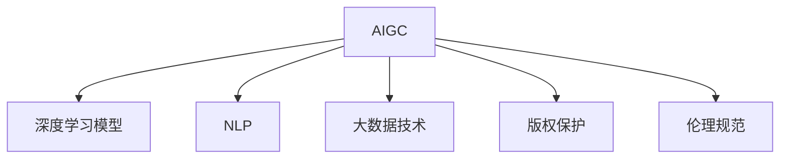
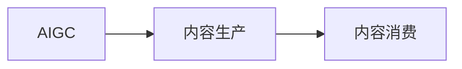
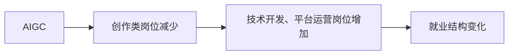
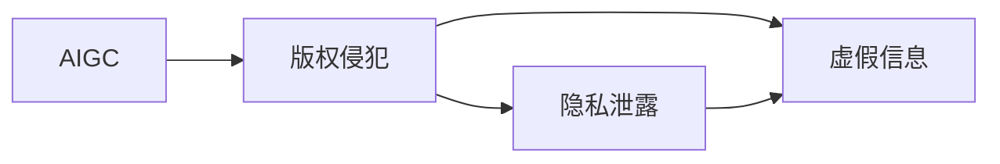
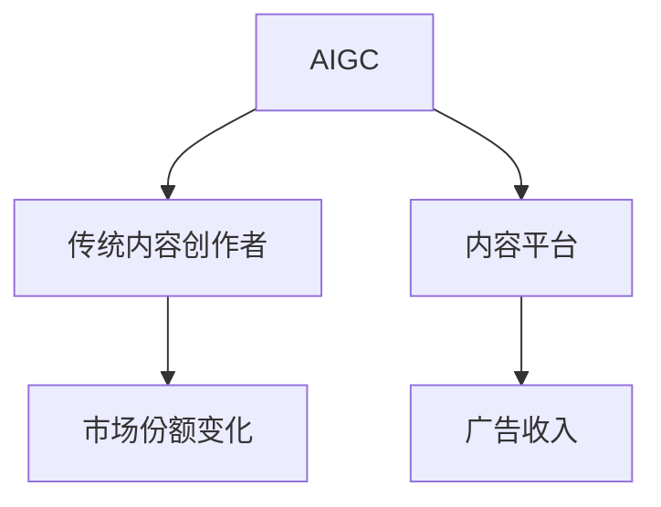
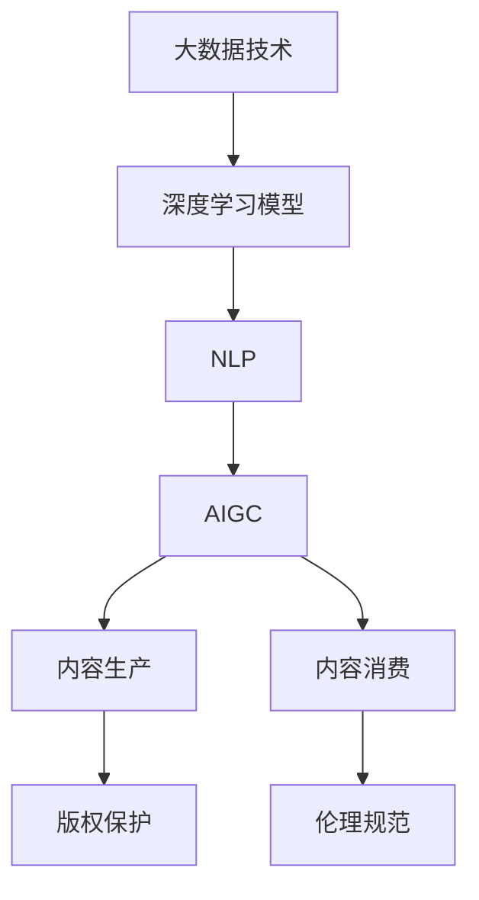

                 

# AIGC对行业和经济的影响

## 1. 背景介绍

随着人工智能(AI)和大数据技术的迅猛发展，人工智能生成内容(AIGC)逐渐成为热门话题。与传统的基于规则或人工操作的自动化技术不同，AIGC通过深度学习模型，自动生成高质量的内容，涉及文本、图像、音频、视频等多个领域。这种技术不仅能大大提升内容创作效率，还能带来新的商业模式和价值空间。

### 1.1 问题由来
AIGC技术的快速发展，极大地改变了内容创作的传统方式。从新闻报道到社交媒体，从电影电视到游戏娱乐，从教育培训到广告营销，AIGC的身影无处不在。但与此同时，AIGC也引发了一系列经济、社会、伦理等方面的问题，需要我们深入探讨其影响，以期制定合理的策略和政策，最大化其积极作用，并防范潜在风险。

### 1.2 问题核心关键点
AIGC的核心影响包括以下几个方面：

- **生产效率提升**：AIGC技术可以显著提升内容生成速度，缩短创作周期，降低人力成本。
- **质量提升**：生成内容往往比人工创作的低成本内容更专业、更具有吸引力。
- **市场竞争格局变化**：内容创作者和内容平台可能面临来自AIGC的冲击，重新调整竞争策略。
- **就业结构变化**：创作类岗位的需求可能减少，而技术开发、平台运营等相关岗位的需求增加。
- **伦理道德问题**：AIGC生成的内容可能存在版权、隐私、虚假信息等伦理问题，需要建立相关法律和规范。

## 2. 核心概念与联系

### 2.1 核心概念概述

为更好地理解AIGC对行业和经济的影响，本节将介绍几个密切相关的核心概念：

- **人工智能生成内容(AIGC)**：使用AI技术自动生成文本、图像、音频、视频等内容的技术，代表模型如GPT-4、DALL·E等。
- **深度学习模型**：神经网络模型的一种，通过多层次的非线性变换学习数据表示，广泛应用于AIGC中。
- **自然语言处理(NLP)**：研究如何让计算机理解和生成人类语言的技术，AIGC的一个重要应用领域。
- **大数据技术**：用于存储、分析和处理海量数据的技术，AIGC生成高质量内容的基础。
- **版权保护**：AIGC内容可能涉及的版权问题，需建立有效的法律框架。
- **伦理规范**：AIGC生成的内容可能引发伦理道德问题，需制定相关的行为准则。

这些核心概念之间的逻辑关系可以通过以下Mermaid流程图来展示：



这个流程图展示了大规模内容生成技术(AIGC)与核心技术（深度学习模型、自然语言处理、大数据技术）、相关问题（版权保护、伦理规范）之间的联系，为我们理解AIGC的影响提供了基本框架。

### 2.2 概念间的关系

这些核心概念之间存在着紧密的联系，形成了AIGC技术的影响生态系统。下面我通过几个Mermaid流程图来展示这些概念之间的关系。

#### 2.2.1 AIGC的生产和消费



这个流程图展示了AIGC技术在内容生产和消费过程中的作用。

#### 2.2.2 AIGC对就业的影响



这个流程图展示了AIGC对就业结构的影响，即创作类岗位减少，技术开发、平台运营等相关岗位需求增加。

#### 2.2.3 AIGC的伦理风险



这个流程图展示了AIGC可能引发的伦理风险，包括版权侵犯、隐私泄露、虚假信息等问题。

#### 2.2.4 AIGC的市场竞争



这个流程图展示了AIGC对市场竞争格局的影响，即传统内容创作者可能失去市场份额，而内容平台则可能获得更多广告收入。

### 2.3 核心概念的整体架构

最后，我们用一个综合的流程图来展示这些核心概念在大规模内容生成技术(AIGC)中的整体架构：



这个综合流程图展示了大数据技术、深度学习模型、自然语言处理等核心技术在大规模内容生成技术中的作用，以及版权保护和伦理规范等社会问题在大规模内容生成过程中的重要性。通过这个架构图，我们可以更清晰地理解AIGC技术的核心原理和应用场景。

## 3. 核心算法原理 & 具体操作步骤
### 3.1 算法原理概述

AIGC的核心算法原理主要包括深度学习模型和自然语言处理。其中，深度学习模型通过多层非线性变换学习数据表示，自然语言处理则通过语言模型、序列生成模型等技术，使计算机理解和生成人类语言。AIGC技术的典型应用包括文本生成、图像生成、音频生成等。

### 3.2 算法步骤详解

基于AIGC的核心算法原理，AIGC的具体操作步骤一般包括以下几个步骤：

**Step 1: 数据预处理**
- 收集大规模数据集，如文本、图像、音频等，并进行清洗、标注和预处理。
- 使用深度学习模型进行特征提取，获得数据的高维表示。

**Step 2: 模型训练**
- 使用训练数据集训练深度学习模型，优化模型参数。
- 在训练过程中使用正则化技术，防止模型过拟合。

**Step 3: 内容生成**
- 使用训练好的模型对新数据进行生成，如文本生成、图像生成等。
- 生成后的内容需经过后处理，如文本校正、图像滤波等，以提升内容质量。

**Step 4: 内容评估**
- 对生成内容进行评估，包括内容质量、语义一致性、版权归属等。
- 根据评估结果调整模型参数，进一步提升内容质量。

**Step 5: 发布与监测**
- 将生成内容发布到目标平台，如网站、社交媒体等。
- 对发布后的内容进行监测，及时发现并处理版权侵权、虚假信息等问题。

### 3.3 算法优缺点

AIGC算法具有以下优点：
1. 高效生产高质量内容：AIGC技术能够快速生成高质量内容，显著提升内容生产效率。
2. 降低成本：相比人工创作，AIGC可以大幅降低人力和制作成本。
3. 创造更多价值：AIGC生成的内容具有更强的市场吸引力和商业价值，可以为平台带来更多流量和收入。

同时，AIGC算法也存在以下缺点：
1. 版权问题：AIGC生成的内容可能侵犯他人版权，引发法律纠纷。
2. 伦理问题：生成的内容可能存在虚假信息、偏见等伦理道德问题。
3. 技术依赖：AIGC技术对高质量数据和强大计算资源有较高要求，技术门槛较高。

### 3.4 算法应用领域

AIGC技术在多个领域都取得了显著应用，例如：

- **媒体娱乐**：如电影、电视剧、音乐等内容的自动生成，提升娱乐产品的生产效率和创新性。
- **广告营销**：生成动态广告内容，提升广告效果和用户体验。
- **教育培训**：生成教育内容，如自动生成试卷、教材等，提升教学质量和效率。
- **客户服务**：生成客服对话内容，提升客户服务体验。
- **创意设计**：如自动生成设计图、文案等，提升设计效率和创意多样性。
- **智能推荐**：如自动生成推荐内容，提升推荐系统的个性化和准确性。
- **法律咨询**：如自动生成法律文书、合同等，提升法律服务效率。

## 4. 数学模型和公式 & 详细讲解 & 举例说明

### 4.1 数学模型构建

基于深度学习模型，AIGC技术的数学模型构建如下：

- **文本生成模型**：如GPT模型，使用语言模型进行文本生成，目标函数为最大似然估计。
- **图像生成模型**：如DALL·E模型，使用生成对抗网络(GAN)进行图像生成，目标函数为对抗损失。
- **音频生成模型**：如WaveNet模型，使用卷积神经网络(CNN)进行音频生成，目标函数为重构损失。

### 4.2 公式推导过程

以下以文本生成模型为例，推导语言模型的目标函数：

- 假设生成文本的词汇集合为 $V$，长度为 $L$ 的文本序列为 $X=(X_1, X_2, ..., X_L)$，对应的概率分布为 $p(X)$。
- 对于长度为 $L$ 的文本序列，使用最大似然估计，目标函数为：

$$
\max_{\theta} \log p(X) = \log \prod_{t=1}^{L} p(X_t|X_{<t})
$$

其中 $\theta$ 为模型参数，$X_{<t}$ 表示序列 $X$ 中位置小于 $t$ 的所有词汇。

### 4.3 案例分析与讲解

**案例1: GPT-4文本生成**
- 使用GPT-4模型生成新闻报道、学术论文等文本内容。
- 在训练过程中，使用自监督学习任务（如掩码语言模型、预测下一个词汇等）进行预训练。
- 在微调过程中，使用特定领域的数据集进行任务适配，提升在特定领域的生成效果。

**案例2: DALL·E图像生成**
- 使用DALL·E模型生成逼真度高的图像内容。
- 在训练过程中，使用生成对抗网络(GAN)架构进行训练，生成图像与真实图像相似度达到高水平。
- 在应用过程中，可以生成任何指定的文本描述对应的图像，如风景、人物、物品等。

**案例3: WaveNet音频生成**
- 使用WaveNet模型生成自然流畅的音频内容，如语音合成、音乐生成等。
- 在训练过程中，使用卷积神经网络(CNN)进行音频信号建模，生成语音和音乐等内容。
- 在应用过程中，可以生成高质量的音频内容，用于语音合成、音乐创作等场景。

## 5. 项目实践：代码实例和详细解释说明

### 5.1 开发环境搭建

在进行AIGC项目实践前，我们需要准备好开发环境。以下是使用Python进行PyTorch开发的环境配置流程：

1. 安装Anaconda：从官网下载并安装Anaconda，用于创建独立的Python环境。

2. 创建并激活虚拟环境：
```bash
conda create -n pytorch-env python=3.8 
conda activate pytorch-env
```

3. 安装PyTorch：根据CUDA版本，从官网获取对应的安装命令。例如：
```bash
conda install pytorch torchvision torchaudio cudatoolkit=11.1 -c pytorch -c conda-forge
```

4. 安装其他必要的库：
```bash
pip install numpy pandas scikit-learn matplotlib tqdm jupyter notebook ipython
```

完成上述步骤后，即可在`pytorch-env`环境中开始AIGC项目实践。

### 5.2 源代码详细实现

这里以文本生成为例，展示使用Transformers库进行GPT模型的文本生成实践。

首先，导入必要的库：

```python
from transformers import AutoTokenizer, AutoModelForCausalLM
import torch
```

然后，定义训练函数：

```python
def train_model(model, tokenizer, train_dataset, device, optimizer, num_epochs):
    model.train()
    total_loss = 0
    for epoch in range(num_epochs):
        for batch in train_dataset:
            inputs = tokenizer(batch['input_ids'], padding=True, truncation=True, max_length=256, return_tensors='pt').to(device)
            outputs = model.generate(**inputs, num_return_sequences=1)
            loss = compute_loss(outputs, batch['input_ids'])
            optimizer.zero_grad()
            loss.backward()
            optimizer.step()
            total_loss += loss.item()
    return total_loss / len(train_dataset)
```

接着，定义评估函数：

```python
def evaluate_model(model, tokenizer, eval_dataset, device):
    model.eval()
    total_loss = 0
    total_sample = 0
    for batch in eval_dataset:
        inputs = tokenizer(batch['input_ids'], padding=True, truncation=True, max_length=256, return_tensors='pt').to(device)
        outputs = model.generate(**inputs, num_return_sequences=1)
        loss = compute_loss(outputs, batch['input_ids'])
        total_loss += loss.item()
        total_sample += batch['input_ids'].shape[0]
    return total_loss / total_sample
```

然后，进行模型训练：

```python
device = torch.device('cuda') if torch.cuda.is_available() else torch.device('cpu')
model = AutoModelForCausalLM.from_pretrained('gpt2')
tokenizer = AutoTokenizer.from_pretrained('gpt2')
optimizer = torch.optim.Adam(model.parameters(), lr=2e-5)

train_dataset = load_train_dataset()
eval_dataset = load_eval_dataset()

num_epochs = 5
batch_size = 32

total_loss = train_model(model, tokenizer, train_dataset, device, optimizer, num_epochs)
evaluate_loss = evaluate_model(model, tokenizer, eval_dataset, device)

print(f"Training loss: {total_loss:.4f}")
print(f"Evaluation loss: {evaluate_loss:.4f}")
```

以上代码展示了使用GPT-2模型进行文本生成的完整过程。在实际应用中，还需要进一步优化模型结构、改进训练策略、调整超参数等，以提升生成效果。

### 5.3 代码解读与分析

这里我们详细解读一下关键代码的实现细节：

**AutoTokenizer和AutoModelForCausalLM类**：
- 使用Transformers库中的预训练模型和分词器，方便进行模型的加载和预处理。

**train_model和evaluate_model函数**：
- 训练函数用于迭代训练数据，更新模型参数。在每个epoch结束时，计算平均损失并返回。
- 评估函数用于在验证集上评估模型性能，计算平均损失并返回。

**GPT-2模型生成**：
- 在训练过程中，使用自监督任务进行预训练。
- 在微调过程中，使用特定领域的标注数据进行任务适配，提升生成效果。

## 6. 实际应用场景

### 6.1 媒体娱乐

AIGC技术在媒体娱乐领域有着广泛的应用，如自动生成新闻报道、电视剧剧本、电影特效等。自动生成新闻报道可以快速生成大量新闻内容，减少人力成本；自动生成电影剧本可以提升编剧效率，降低创作门槛；自动生成电影特效可以大幅缩短制作周期，降低制作成本。

### 6.2 广告营销

AIGC技术在广告营销领域也有着重要应用，如自动生成广告文案、动态广告素材等。自动生成广告文案可以根据用户的兴趣和行为，生成更加个性化的广告内容，提升广告效果和用户体验。动态广告素材可以根据用户的实时反馈，实时调整广告内容，提升广告的点击率和转化率。

### 6.3 教育培训

AIGC技术在教育培训领域也有着广泛应用，如自动生成学习材料、智能辅导系统等。自动生成学习材料可以根据学生的学习情况，生成个性化的学习内容和练习题，提升学习效果。智能辅导系统可以根据学生的回答，生成个性化的辅导建议，提升学习效率。

### 6.4 客户服务

AIGC技术在客户服务领域也有着重要应用，如自动生成客服对话、智能客服系统等。自动生成客服对话可以根据用户的问题，生成个性化的回答，提升客户体验。智能客服系统可以根据用户的行为和反馈，动态调整回答策略，提升客户满意度。

### 6.5 创意设计

AIGC技术在创意设计领域也有着广泛应用，如自动生成设计图、创意文案等。自动生成设计图可以根据设计要求，生成符合设计风格的设计图，提升设计效率和创意多样性。自动生成创意文案可以根据用户的喜好，生成符合用户需求的内容，提升创作效果。

### 6.6 智能推荐

AIGC技术在智能推荐领域也有着重要应用，如自动生成推荐内容、推荐系统等。自动生成推荐内容可以根据用户的兴趣和行为，生成个性化的推荐内容，提升推荐系统的准确性和用户体验。推荐系统可以根据用户的反馈，动态调整推荐策略，提升推荐效果。

## 7. 工具和资源推荐

### 7.1 学习资源推荐

为了帮助开发者系统掌握AIGC的理论基础和实践技巧，这里推荐一些优质的学习资源：

1. 《深度学习》系列书籍：由Ian Goodfellow等作者编写，全面介绍了深度学习的基础理论和应用。
2. 《自然语言处理综论》（CS224N）课程：斯坦福大学开设的NLP明星课程，涵盖NLP基础和最新研究进展。
3. 《生成对抗网络：理论与实践》书籍：作者Ian Goodfellow等人，深入浅出地介绍了GAN的理论和实践。
4. 《Transformers》论文及代码：HuggingFace官方博客和GitHub代码库，涵盖最前沿的预训练语言模型和微调技术。
5. 《人工智能生成内容技术与应用》（AI-GC）课程：北京大学等高校开设的在线课程，系统讲解AIGC的理论与应用。

通过对这些资源的学习实践，相信你一定能够快速掌握AIGC技术的精髓，并用于解决实际的AI问题。

### 7.2 开发工具推荐

高效的开发离不开优秀的工具支持。以下是几款用于AIGC开发常用的工具：

1. PyTorch：基于Python的开源深度学习框架，灵活动态的计算图，适合快速迭代研究。大多数预训练语言模型都有PyTorch版本的实现。
2. TensorFlow：由Google主导开发的开源深度学习框架，生产部署方便，适合大规模工程应用。同样有丰富的预训练语言模型资源。
3. Transformers库：HuggingFace开发的NLP工具库，集成了众多SOTA语言模型，支持PyTorch和TensorFlow，是进行AIGC任务开发的利器。
4. Weights & Biases：模型训练的实验跟踪工具，可以记录和可视化模型训练过程中的各项指标，方便对比和调优。与主流深度学习框架无缝集成。
5. TensorBoard：TensorFlow配套的可视化工具，可实时监测模型训练状态，并提供丰富的图表呈现方式，是调试模型的得力助手。
6. Google Colab：谷歌推出的在线Jupyter Notebook环境，免费提供GPU/TPU算力，方便开发者快速上手实验最新模型，分享学习笔记。

合理利用这些工具，可以显著提升AIGC任务的开发效率，加快创新迭代的步伐。

### 7.3 相关论文推荐

AIGC技术的发展源于学界的持续研究。以下是几篇奠基性的相关论文，推荐阅读：

1. GPT-4：语言模型预训练和微调，展示了大规模语言模型的强大零样本学习能力。
2. DALL·E：基于生成对抗网络(GAN)的图像生成模型，生成逼真度高的图像内容。
3. WaveNet：基于卷积神经网络(CNN)的音频生成模型，生成自然流畅的音频内容。
4. Attention is All You Need：提出了Transformer结构，开启了NLP领域的预训练大模型时代。
5. Generative Adversarial Nets（GAN）：提出了生成对抗网络，为AIGC技术奠定了基础。

这些论文代表了大规模内容生成技术的发展脉络。通过学习这些前沿成果，可以帮助研究者把握学科前进方向，激发更多的创新灵感。

除上述资源外，还有一些值得关注的前沿资源，帮助开发者紧跟AIGC技术的最新进展，例如：

1. arXiv论文预印本：人工智能领域最新研究成果的发布平台，包括大量尚未发表的前沿工作，学习前沿技术的必读资源。
2. 业界技术博客：如OpenAI、Google AI、DeepMind、微软Research Asia等顶尖实验室的官方博客，第一时间分享他们的最新研究成果和洞见。
3. 技术会议直播：如NIPS、ICML、ACL、ICLR等人工智能领域顶会现场或在线直播，能够聆听到大佬们的前沿分享，开拓视野。
4. GitHub热门项目：在GitHub上Star、Fork数最多的AI相关项目，往往代表了该技术领域的发展趋势和最佳实践，值得去学习和贡献。
5. 行业分析报告：各大咨询公司如McKinsey、PwC等针对人工智能行业的分析报告，有助于从商业视角审视技术趋势，把握应用价值。

总之，对于AIGC技术的学习和实践，需要开发者保持开放的心态和持续学习的意愿。多关注前沿资讯，多动手实践，多思考总结，必将收获满满的成长收益。

## 8. 总结：未来发展趋势与挑战

### 8.1 总结

本文对基于深度学习模型的大规模内容生成技术（AIGC）进行了全面系统的介绍。首先阐述了AIGC技术的背景和应用意义，明确了其对生产效率、市场竞争、就业结构、伦理道德等方面的影响。其次，从原理到实践，详细讲解了AIGC技术的核心算法和操作步骤，给出了AIGC项目开发的完整代码实例。同时，本文还广泛探讨了AIGC技术在媒体娱乐、广告营销、教育培训、客户服务、创意设计、智能推荐等多个行业领域的应用前景，展示了AIGC技术的巨大潜力。此外，本文精选了AIGC技术的各类学习资源，力求为读者提供全方位的技术指引。

通过本文的系统梳理，可以看到，基于深度学习模型的大规模内容生成技术（AIGC）正在成为AI领域的重大突破，极大地拓展了内容创作的边界，催生了新的商业模式和价值空间。未来，伴随深度学习模型和生成技术的不断演进，AIGC技术有望进一步提升内容生产效率和质量，为各行各业带来深远的影响。

### 8.2 未来发展趋势

展望未来，AIGC技术将呈现以下几个发展趋势：

1. 技术突破与融合：AIGC技术将继续在深度学习模型、自然语言处理、生成对抗网络等领域取得突破，与NLP、图像处理、语音识别等技术进行深度融合，生成更加多样化、高质量的内容。
2. 应用场景扩展：AIGC技术将在更多行业和领域得到应用，如智能制造、智慧农业、智慧城市等，提升各行各业的智能化水平。
3. 人机协同增强：AIGC技术将与自然语言交互、机器人技术等结合，实现更加自然、智能的人机交互体验。
4. 数据驱动优化：AIGC技术将更依赖大数据和人工智能技术进行优化，提升生成内容的准确性和多样性。
5. 隐私保护增强：AIGC技术将更注重数据隐私保护，防止个人信息泄露，提高数据使用的透明度和安全性。
6. 伦理道德保障：AIGC技术将更注重伦理道德问题，防止虚假信息传播、版权侵犯等问题，建立可信的生成内容环境。

以上趋势凸显了AIGC技术的广阔前景。这些方向的探索发展，必将进一步提升AIGC技术的生成效果和应用价值，为人类认知智能的进化带来深远影响。

### 8.3 面临的挑战

尽管AIGC技术已经取得了瞩目成就，但在迈向更加智能化、普适化应用的过程中，它仍面临诸多挑战：

1. 版权问题：AIGC生成的内容可能侵犯他人版权，引发法律纠纷。如何制定有效的版权保护机制，是一个重要问题。
2. 伦理问题：生成的内容可能存在虚假信息、偏见等伦理道德问题。如何建立伦理规范，防止有害信息的传播，需要深入研究。
3. 技术依赖：AIGC技术对高质量数据和强大计算资源有较高要求，技术门槛较高。如何降低技术门槛，普及AIGC技术，是一个重要问题。
4. 数据隐私：生成的内容可能涉及用户隐私信息，如何保护用户隐私，防止数据泄露，需要加强隐私保护措施。
5. 自动化冲突：AIGC技术可能导致自动化与人类工作的冲突，如何平衡自动化与人类就业的关系，需要深入研究。
6. 生成质量：生成的内容可能存在质量不稳定的现象，如何提升生成内容的准确性和多样性，是一个重要问题。
7. 对抗攻击：AIGC技术可能受到对抗攻击，生成虚假或误导性内容，如何提升模型的鲁棒性，是一个重要问题。

正视AIGC技术面临的这些挑战，积极应对并寻求突破，将是大规模内容生成技术迈向成熟的必由之路。相信随着学界和产业界的共同努力，这些挑战终将一一被克服，AIGC技术必将在构建人机协同的智能时代中扮演越来越重要的角色。

### 8.4 研究展望

面对AIGC技术面临的种种挑战，未来的研究需要在以下几个方面寻求新的突破：

1. 探索更加高效的生成算法：开发更加高效、灵活的生成算法，提升内容生成的速度和质量。
2. 引入更多先验知识：将符号化的先验知识，如知识图谱、逻辑规则等，与神经网络模型进行巧妙融合，增强生成内容的合理性和可信度。
3. 建立更加完善的伦理规范：制定更加完善的伦理规范，防止虚假信息、偏见等伦理问题的出现，建立可信的生成内容环境。
4. 开发更加智能的反馈机制：引入用户反馈机制，动态调整生成策略，提升生成内容的适应性和多样性。
5. 优化模型结构：优化模型结构，降低技术门槛，普及AIG

