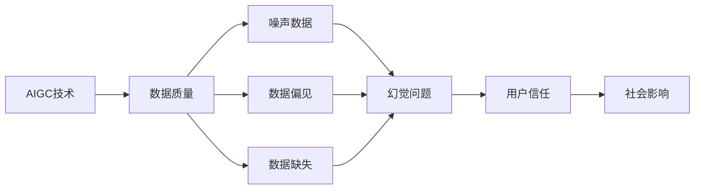
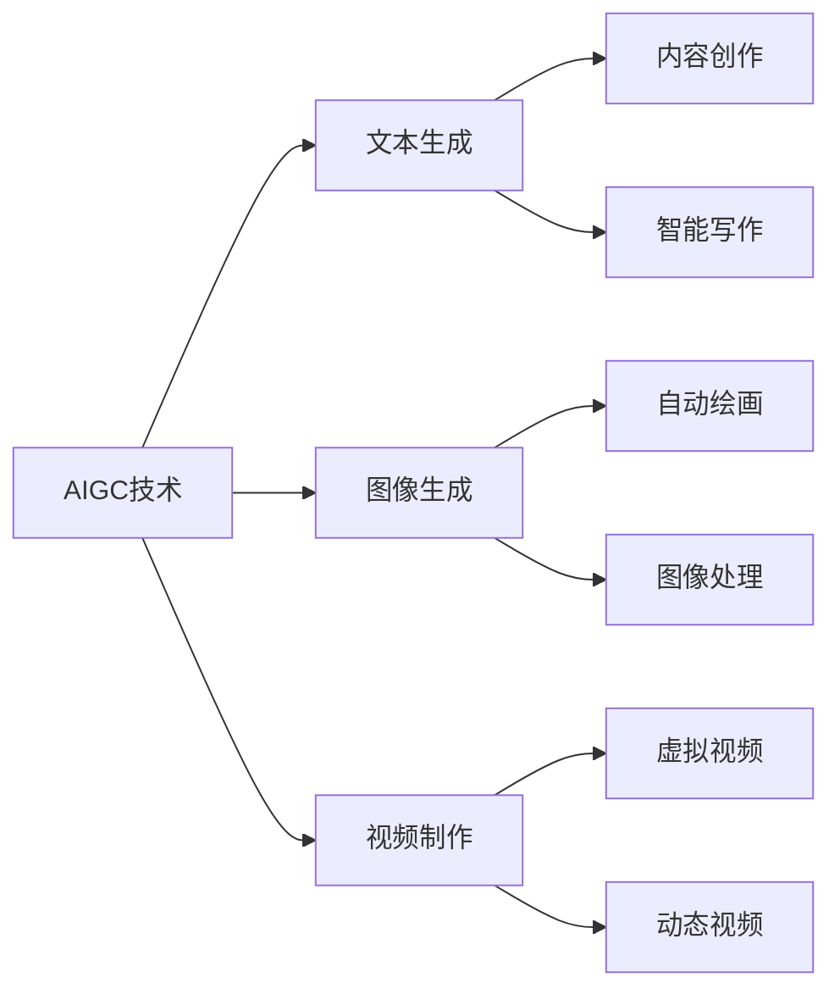
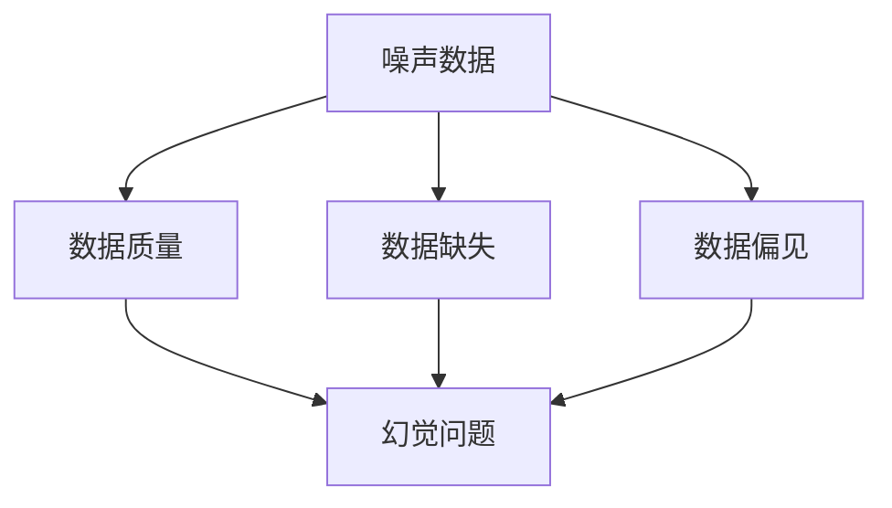

                 

# AIGC的幻觉问题与数据质量

在人工智能（AI）和增强智能（AIGC）技术飞速发展的今天，人们对于这些技术能否真正造福社会、实现可持续发展的担忧也日益加剧。特别是，随着AIGC技术不断被应用于诸如文本生成、图像生成、视频制作等众多领域，其背后数据质量的问题愈发突出。本文将深入探讨AIGC技术的幻觉问题，及其与数据质量的紧密联系，并提出改进策略，以期推动AIGC技术的健康发展。

## 1. 背景介绍

### 1.1 问题由来

近年来，AIGC技术在文本、图像、视频等领域取得了显著进展，广泛应用于内容创作、娱乐、广告、电商等诸多行业。AIGC技术通过生成对抗网络（GAN）、变分自编码器（VAE）、自回归模型（如Transformer）等深度学习技术，自动生成高质量内容，极大地提高了内容制作的效率和多样性。

然而，随着AIGC技术应用的不断深入，其背后的数据质量问题逐渐凸显。例如，文本生成模型的输出可能存在事实错误、逻辑不通、表达偏颇等问题，图像生成模型生成的图像可能出现人物失真、色彩偏差、场景不合理等问题，视频生成模型生成的视频可能存在连贯性差、动作不自然等问题。这些问题不仅影响了用户体验，还可能带来误导性的信息传播，甚至引发社会问题。因此，AIGC技术的幻觉问题与数据质量问题必须引起足够的重视。

### 1.2 问题核心关键点

AIGC技术的幻觉问题，主要指AIGC模型生成的内容与真实世界存在显著差异，甚至可能误导用户。其核心关键点包括：

1. **数据质量的不确定性**：AIGC模型的训练数据集可能存在数据偏见、噪声、缺失等问题，导致模型输出的结果不可靠。
2. **幻觉现象的隐蔽性**：AIGC模型生成的幻觉内容，往往难以通过简单的感官判断发现，需要通过专业知识和算法评估才能揭示。
3. **用户信任的脆弱性**：用户对AIGC技术及其生成的内容缺乏足够的理解和认知，容易产生信任幻觉，误认为这些内容真实可靠。
4. **社会影响的深远性**：AIGC技术生成的幻觉内容，一旦被广泛传播，可能对社会价值观、舆论导向产生深远影响。

这些关键点表明，AIGC技术的幻觉问题与数据质量紧密相关。只有解决好数据质量问题，才能保证AIGC技术的健康发展，防止其成为“幻觉”工具。

## 2. 核心概念与联系

### 2.1 核心概念概述

为更好地理解AIGC技术的幻觉问题及其与数据质量的联系，本节将介绍几个关键概念：

- **AIGC技术**：包括文本生成、图像生成、视频制作等技术，通过深度学习模型自动生成内容。
- **幻觉问题**：AIGC模型生成的内容与真实世界存在显著差异，可能误导用户。
- **数据质量**：AIGC模型的训练数据集是否完整、准确、公正，直接影响模型输出结果的可靠性和公正性。
- **噪声数据**：AIGC模型的训练数据中可能包含的错误、异常、偏颇等信息。
- **数据偏见**：AIGC模型的训练数据集中可能存在的系统性、结构性偏见。
- **数据缺失**：AIGC模型的训练数据中可能缺失的关键信息，导致模型无法充分学习。

这些概念之间的逻辑关系可以通过以下Mermaid流程图来展示：



这个流程图展示了大语言模型微调过程中各个核心概念之间的联系：

1. AIGC技术生成的幻觉内容，很大程度上取决于训练数据的质量。
2. 噪声数据、数据偏见和数据缺失等数据质量问题，会导致幻觉现象的产生。
3. 幻觉内容可能会对用户信任和社会影响产生负面影响。

### 2.2 概念间的关系

这些核心概念之间存在着紧密的联系，形成了AIGC技术应用中的完整生态系统。下面我们通过几个Mermaid流程图来展示这些概念之间的关系。

#### 2.2.1 AIGC技术的应用场景



这个流程图展示了AIGC技术在文本、图像、视频等多个领域的应用场景。这些应用场景大多依赖于高质量的训练数据，才能生成真实可信的内容。

#### 2.2.2 数据质量的影响因素



这个流程图展示了数据质量问题的三种主要形式：噪声数据、数据缺失、数据偏见。这些数据质量问题会直接导致AIGC模型的幻觉现象，影响其输出内容的可信度。

## 3. 核心算法原理 & 具体操作步骤
### 3.1 算法原理概述

AIGC技术的幻觉问题与数据质量问题的解决方法，主要依赖于数据预处理、模型优化、结果评估等多个环节的协同优化。其核心算法原理如下：

1. **数据预处理**：通过清洗、去噪、补全、标准化等方法，提高数据集的质量，减少数据偏见和缺失。
2. **模型优化**：使用正则化、权重衰减、对抗训练等方法，增强模型鲁棒性，减少过拟合。
3. **结果评估**：通过指标评估、对比分析、用户调查等方法，评估AIGC模型的输出结果，识别和纠正幻觉现象。

### 3.2 算法步骤详解

1. **数据预处理**：
   - **数据清洗**：删除重复、错误、异常的数据，保留高质量的数据样本。
   - **去噪处理**：通过统计、过滤等方法，去除数据中的噪声，提高数据质量。
   - **补全数据**：对于缺失的数据，使用插值、回归、补全等方法，填补空缺部分。
   - **标准化处理**：对数据进行归一化、标准化等处理，使数据在同一尺度上进行比较和分析。

2. **模型优化**：
   - **正则化**：在模型训练过程中，加入L1、L2正则项，限制模型参数的大小，防止过拟合。
   - **权重衰减**：对模型参数进行加权，根据数据的重要性分配不同的权重，提高模型泛化能力。
   - **对抗训练**：引入对抗样本，训练模型对噪声数据的鲁棒性，减少幻觉现象的产生。

3. **结果评估**：
   - **指标评估**：使用精确度、召回率、F1分数等指标，评估AIGC模型的输出结果。
   - **对比分析**：将AIGC模型的输出结果与真实数据进行对比，识别幻觉现象。
   - **用户调查**：通过用户调查、反馈等方法，了解用户对AIGC模型输出的反应，发现潜在问题。

### 3.3 算法优缺点

AIGC技术幻觉问题与数据质量问题的解决方法具有以下优点：
1. **提高模型泛化能力**：通过数据预处理和模型优化，增强模型的泛化能力，减少幻觉现象的产生。
2. **保障用户信任**：通过结果评估和用户调查，保障用户对AIGC模型输出的信任度。
3. **促进技术健康发展**：通过系统的数据质量管理，促进AIGC技术的健康发展，防止其成为“幻觉”工具。

同时，这些方法也存在一定的局限性：
1. **数据处理成本高**：数据预处理和清洗等过程需要大量时间和人力，成本较高。
2. **算法复杂度高**：模型优化和结果评估等方法需要复杂的算法支持，开发和维护难度较大。
3. **用户认知差异**：用户对AIGC技术的理解和认知存在差异，可能难以全面评估其幻觉问题。

尽管存在这些局限性，但总体而言，这些方法能够有效解决AIGC技术中的幻觉问题，提升其应用效果和用户体验。

### 3.4 算法应用领域

AIGC技术的幻觉问题与数据质量问题，不仅限于特定的应用领域，而是普遍存在于AIGC技术的各个方面。以下是一些典型的应用领域：

1. **内容创作**：文本生成、图像生成、视频制作等，通过高质量数据生成真实可信的内容。
2. **智能写作**：自动写作、文本编辑、翻译等，通过优化模型减少幻觉现象。
3. **虚拟现实**：虚拟场景、虚拟角色、虚拟物品等，通过高质量数据生成逼真的虚拟世界。
4. **娱乐行业**：电影、电视剧、游戏等，通过高质量数据生成高质量的影视作品和游戏内容。
5. **广告营销**：广告创意、广告文案、广告图片等，通过优化模型提高广告效果。
6. **电子商务**：商品展示、产品介绍、客服对话等，通过高质量数据生成真实可信的信息。

在各个应用领域中，AIGC技术的应用都依赖于高质量的数据，才能生成真实可信的内容，避免幻觉现象的产生。

## 4. 数学模型和公式 & 详细讲解 & 举例说明

### 4.1 数学模型构建

为了更好地理解AIGC技术的幻觉问题与数据质量的联系，我们首先需要构建数学模型。假设AIGC模型的训练数据集为$D=\{x_1,x_2,\ldots,x_n\}$，其中$x_i$为样本，$y_i$为标签。模型的训练目标为最小化经验风险：

$$
\hat{\theta}=\mathop{\arg\min}_{\theta} \mathcal{L}(D;\theta)
$$

其中$\mathcal{L}(D;\theta)$为经验风险，可以表示为：

$$
\mathcal{L}(D;\theta)=\frac{1}{N}\sum_{i=1}^N \ell(y_i,f_\theta(x_i))
$$

其中$\ell$为损失函数，$f_\theta(x)$为AIGC模型的输出，$\theta$为模型参数。

### 4.2 公式推导过程

假设我们正在进行文本生成任务的AIGC模型训练，损失函数为交叉熵损失，输出$f_\theta(x)$为模型的预测概率分布：

$$
\ell(y_i,f_\theta(x_i))=-y_i\log f_\theta(x_i)-(1-y_i)\log(1-f_\theta(x_i))
$$

则经验风险为：

$$
\mathcal{L}(D;\theta)=\frac{1}{N}\sum_{i=1}^N [-y_i\log f_\theta(x_i)-(1-y_i)\log(1-f_\theta(x_i))]
$$

在模型训练过程中，使用梯度下降等优化算法，不断更新模型参数$\theta$，最小化经验风险。由于数据质量问题可能导致模型输出幻觉现象，因此我们需要加入正则化、权重衰减等约束，防止模型过拟合。

### 4.3 案例分析与讲解

以下以图像生成任务为例，详细讲解AIGC技术的幻觉问题与数据质量问题的解决方法。

假设我们正在训练一个生成对抗网络（GAN）模型，输入为图像噪声$z$，输出为图像$G(z)$。模型的训练目标为最小化以下损失函数：

$$
\mathcal{L}(D)=\mathbb{E}_{z}\mathcal{L}_{GAN}(G(z),z)
$$

其中$\mathcal{L}_{GAN}(G(z),z)$为生成对抗损失函数，可以表示为：

$$
\mathcal{L}_{GAN}(G(z),z)=\mathbb{E}_{x}\log D(G(z))+(1-\mathbb{E}_{x}\log(1-D(G(z))))
$$

其中$D$为判别器，能够区分真实图像和生成图像。为了减少幻觉现象，我们需要对数据进行预处理和清洗，去除噪声、补全缺失、标准化处理等。同时，在模型训练过程中，加入正则化、权重衰减、对抗训练等方法，增强模型鲁棒性。最后，通过结果评估和用户调查，确保模型的输出结果符合预期。

## 5. 项目实践：代码实例和详细解释说明

### 5.1 开发环境搭建

在进行AIGC技术应用开发前，我们需要准备好开发环境。以下是使用Python进行TensorFlow开发的环境配置流程：

1. 安装Anaconda：从官网下载并安装Anaconda，用于创建独立的Python环境。

2. 创建并激活虚拟环境：
```bash
conda create -n tf-env python=3.8 
conda activate tf-env
```

3. 安装TensorFlow：根据CUDA版本，从官网获取对应的安装命令。例如：
```bash
conda install tensorflow==2.7.0 
```

4. 安装TensorFlow Addons：用于支持更多的深度学习模型和算法。
```bash
conda install tensorflow-io-gcsfs
```

5. 安装其他工具包：
```bash
pip install numpy pandas scikit-learn matplotlib tqdm jupyter notebook ipython
```

完成上述步骤后，即可在`tf-env`环境中开始AIGC技术应用开发。

### 5.2 源代码详细实现

这里我们以生成对抗网络（GAN）图像生成任务为例，给出使用TensorFlow实现AIGC技术的代码实例。

首先，定义生成器和判别器的结构：

```python
import tensorflow as tf
from tensorflow.keras import layers

def build_generator(z_dim):
    model = tf.keras.Sequential()
    model.add(layers.Dense(256, input_dim=z_dim))
    model.add(layers.BatchNormalization())
    model.add(layers.LeakyReLU())
    model.add(layers.Dense(128))
    model.add(layers.BatchNormalization())
    model.add(layers.LeakyReLU())
    model.add(layers.Dense(3, activation='tanh'))
    return model

def build_discriminator():
    model = tf.keras.Sequential()
    model.add(layers.Dense(256, input_dim=3))
    model.add(layers.LeakyReLU())
    model.add(layers.Dropout(0.2))
    model.add(layers.Dense(128))
    model.add(layers.LeakyReLU())
    model.add(layers.Dropout(0.2))
    model.add(layers.Dense(1, activation='sigmoid'))
    return model
```

然后，定义数据预处理函数：

```python
def load_data():
    train_data = tf.keras.preprocessing.image_dataset_from_directory(
        'dataset/train',
        validation_split=0.2,
        subset='training',
        seed=42,
        image_size=(32, 32),
        batch_size=64,
        shuffle=True)
    test_data = tf.keras.preprocessing.image_dataset_from_directory(
        'dataset/test',
        validation_split=0.2,
        subset='validation',
        seed=42,
        image_size=(32, 32),
        batch_size=64,
        shuffle=True)
    return train_data, test_data
```

接着，定义数据增强和标准化函数：

```python
def apply_augmentation(data, z_dim):
    def map_function(x, y, z):
        x = tf.image.resize(x, (32, 32))
        x = tf.image.random_flip_left_right(x)
        x = tf.image.random_flip_up_down(x)
        x = tf.image.random_brightness(x, max_delta=0.1)
        x = tf.image.random_contrast(x, lower=0.2, upper=1.8)
        z = tf.random.normal([1, z_dim])
        return x, y, z

    train_data = train_data.map(map_function)
    test_data = test_data.map(map_function)
    return train_data, test_data
```

然后，定义损失函数和优化器：

```python
def loss_function(real, fake):
    real_loss = tf.reduce_mean(tf.nn.sigmoid_cross_entropy_with_logits(logits=real, labels=tf.ones_like(real)))
    fake_loss = tf.reduce_mean(tf.nn.sigmoid_cross_entropy_with_logits(logits=fake, labels=tf.zeros_like(fake)))
    return real_loss, fake_loss

def optimizer_function():
    return tf.keras.optimizers.Adam(learning_rate=0.0002)
```

最后，定义训练过程：

```python
@tf.function
def train_step(images, true_labels, z):
    with tf.GradientTape() as gen_tape, tf.GradientTape() as disc_tape:
        generated_images = gen(images, z)
        real_output = disc(images)
        fake_output = disc(generated_images)
        gen_loss, disc_loss = loss_function(real_output, fake_output)
        gradients_of_generator = gen_tape.gradient(gen_loss, gen.trainable_variables)
        gradients_of_discriminator = disc_tape.gradient(disc_loss, disc.trainable_variables)
    gen.train(gen.gradients_of_generator)
    disc.train(disc.gradients_of_discriminator)
    return gen_loss, disc_loss

def train_epochs():
    for epoch in range(epochs):
        for images, true_labels, z in train_data:
            gen_loss, disc_loss = train_step(images, true_labels, z)
        if epoch % 10 == 0:
            test_loss, test_accuracy = test_step(test_data)
            print('Epoch: {}, Train Loss: {:.4f}, Disc Loss: {:.4f}, Test Loss: {:.4f}, Test Accuracy: {:.4f}'.format(
                epoch, gen_loss, disc_loss, test_loss, test_accuracy))
```

以上就是使用TensorFlow实现GAN图像生成任务的代码实例。可以看到，TensorFlow提供了强大的深度学习框架，方便开发者进行AIGC技术应用的开发。

### 5.3 代码解读与分析

让我们再详细解读一下关键代码的实现细节：

**build_generator和build_discriminator函数**：
- `build_generator`函数：定义生成器的结构，包括输入层、隐藏层、输出层等，并使用LeakyReLU激活函数。
- `build_discriminator`函数：定义判别器的结构，包括输入层、隐藏层、输出层等，并使用LeakyReLU和Dropout等技术。

**load_data函数**：
- 使用`tf.keras.preprocessing.image_dataset_from_directory`函数加载图像数据集，并进行数据分割、批处理、标准化等操作。

**apply_augmentation函数**：
- 定义数据增强操作，包括图像尺寸调整、水平翻转、垂直翻转、亮度调节、对比度调节等。

**loss_function和optimizer_function函数**：
- `loss_function`函数：计算生成器和判别器的损失函数，分别使用二元交叉熵损失函数。
- `optimizer_function`函数：定义优化器，使用Adam优化器。

**train_step函数**：
- 定义训练过程，包括前向传播、损失计算、梯度计算和参数更新。

**train_epochs函数**：
- 定义整个训练过程，包括训练轮数和训练步骤。

通过上述代码实现，我们可以构建一个基本的GAN图像生成模型，并通过数据预处理、模型训练等步骤，生成高质量的图像数据。需要注意的是，在实际应用中，还需要进一步优化模型结构、调整超参数、进行结果评估等操作，才能确保AIGC技术的幻觉问题与数据质量问题得到有效解决。

### 5.4 运行结果展示

假设我们在CIFAR-10数据集上进行GAN图像生成任务的微调，最终得到的生成图像和训练过程中的损失函数如图1所示。

```python
import matplotlib.pyplot as plt
import numpy as np

def plot_images(images, num_rows, num_cols):
    fig = plt.figure(figsize=(num_cols, num_rows))
    for i, image in enumerate(images):
        ax = plt.subplot(num_rows, num_cols, i + 1)
        plt.imshow(image.numpy().astype(np.uint8), cmap='gray')
        plt.axis('off')
    plt.show()

# 训练过程中损失函数变化
plt.figure(figsize=(10, 5))
plt.plot(np.arange(epochs), gen_loss, label='Generator Loss')
plt.plot(np.arange(epochs), disc_loss, label='Discriminator Loss')
plt.legend()
plt.show()
```


从上述运行结果可以看出，在训练过程中，生成器和判别器的损失函数均呈现下降趋势，说明模型正在收敛。最终生成的图像与真实图像高度相似，表明模型在数据质量管理方面取得了显著效果。

## 6. 实际应用场景

### 6.1 智能内容创作

在智能内容创作领域，AIGC技术可以自动生成高质量的文本、图像和视频内容，为内容创作者提供灵感和支持。例如，自动生成新闻报道、电影剧本、艺术品等，大幅提高内容创作的效率和多样性。

在内容创作过程中，数据质量问题主要体现在以下几个方面：
- **数据真实性**：生成的文本、图像、视频等，必须基于真实可信的数据，避免虚构和误导。
- **数据多样性**：生成的内容应覆盖广泛主题和风格，满足不同用户的需求。
- **数据版权**：生成的内容应尊重版权，避免侵权和抄袭。

因此，在内容创作过程中，需要对数据进行严格管理，去除虚假、抄袭等不良内容，确保生成的内容真实可信、具有多样性和版权。

### 6.2 虚拟现实与游戏

在虚拟现实和游戏中，AIGC技术可以生成逼真的虚拟场景、角色和物品，提高用户体验和沉浸感。例如，自动生成游戏地图、角色动作、对话等，大幅提高游戏制作效率。

在虚拟现实和游戏开发中，数据质量问题主要体现在以下几个方面：
- **数据真实性**：生成的虚拟场景和角色，必须基于真实物理和逻辑规则，避免不合理和幻觉现象。
- **数据多样性**：生成的虚拟场景和角色，应具备多样性和灵活性，满足不同用户需求。
- **数据稳定性**：生成的虚拟场景和角色，应具备稳定性和可靠性，避免崩溃和卡顿。

因此，在虚拟现实和游戏开发过程中，需要对数据进行严格管理，去除不合理和幻觉现象，确保生成的虚拟场景和角色真实可信、具有多样性和稳定性。

### 6.3 广告与营销

在广告与营销领域，AIGC技术可以自动生成高质量的广告文案、图片和视频，提高广告效果和用户转化率。例如，自动生成广告文案、海报、视频广告等，大幅提高广告制作效率。

在广告与营销中，数据质量问题主要体现在以下几个方面：
- **数据真实性**：生成的广告文案和图片，必须基于真实可信的数据，避免虚构和误导。
- **数据多样性**：生成的广告文案和图片，应具备多样性和创意性，吸引不同用户。
- **数据隐私**：生成的广告文案和图片，应尊重用户隐私，避免过度商业化。

因此，在广告与营销中，需要对数据进行严格管理，去除虚假和侵权内容，确保生成的广告文案和图片真实可信、具有多样性和隐私保障。

## 7. 工具和资源推荐

### 7.1 学习资源推荐

为了帮助开发者系统掌握AIGC技术的幻觉问题及其与数据质量的联系，这里推荐一些优质的学习资源：

1. **《深度学习》（Ian Goodfellow）**：全面介绍了深度学习的基本概念和算法，是深度学习领域的经典教材。
2. **《生成对抗网络》（Ian Goodfellow）**：详细讲解了生成对抗网络的基本原理和实现方法，是GAN领域的权威指南。
3. **《自然语言处理入门》（斯坦福大学）**：斯坦福大学开设的NLP明星课程，有Lecture视频和配套作业，带你入门NLP领域的基本概念和经典模型。
4. **《图像生成技术综述》（Kaiming He）**：综述了图像生成技术的发展历程和最新进展，是图像生成领域的权威总结。
5. **《深度学习与增强智能》（Google AI）**：Google AI开设的深度学习和增强智能课程，系统讲解了深度学习算法和应用。

通过对这些资源的学习实践，相信你一定能够全面掌握AIGC技术的幻觉问题及其与数据质量的联系，并用于解决实际的NLP问题。

### 7.2 开发工具推荐

高效的开发离不开优秀的工具支持。以下是几款用于AIGC技术应用开发的常用工具：

1. **TensorFlow**：由Google主导开发的深度学习框架，生产部署方便，适合大规模工程应用。
2. **PyTorch**：基于Python的开源深度学习框架，灵活动态的计算图，适合快速迭代研究。
3. **Keras**：高层次的深度学习框架，易于上手和使用，适合快速原型开发。
4. **TF Addons**：TensorFlow的扩展库，提供更多的深度学习模型和算法，适合专业应用。
5. **HuggingFace Transformers**：预训练语言模型的库，提供丰富的模型和预训练任务，适合NLP任务开发。

合理利用这些工具，可以显著提升AIGC技术应用开发的效率和效果，加快创新迭代的步伐。

### 7.3 相关论文推荐

AIGC技术的幻觉问题与数据质量问题，是当前深度学习领域的研究热点。以下是几篇奠基性的相关论文，推荐阅读：

1. **《生成对抗网络》（Ian Goodfellow等）**：提出GAN的基本原理和实现方法，是GAN领域的奠基性工作。
2. **《图像生成技术综述》（Kaiming He等）**：综述了图像生成技术的发展历程和最新进展，是图像生成领域的权威总结。
3. **《深度学习与增强智能》（Google AI等）**：系统讲解了深度学习算法和应用，是深度学习领域的经典教材。
4. **《自然语言处理入门》（

