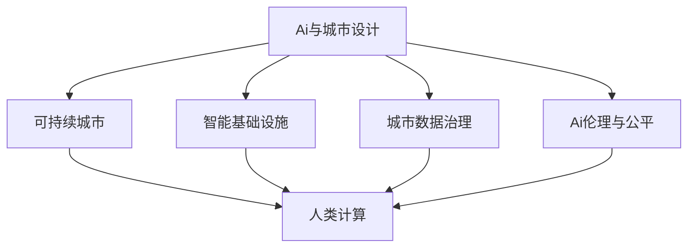
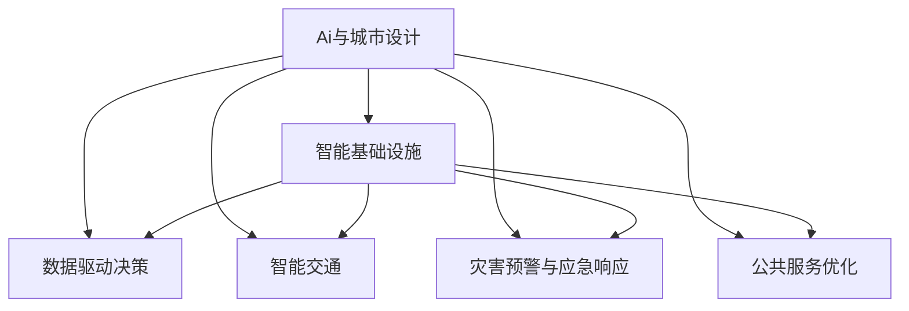
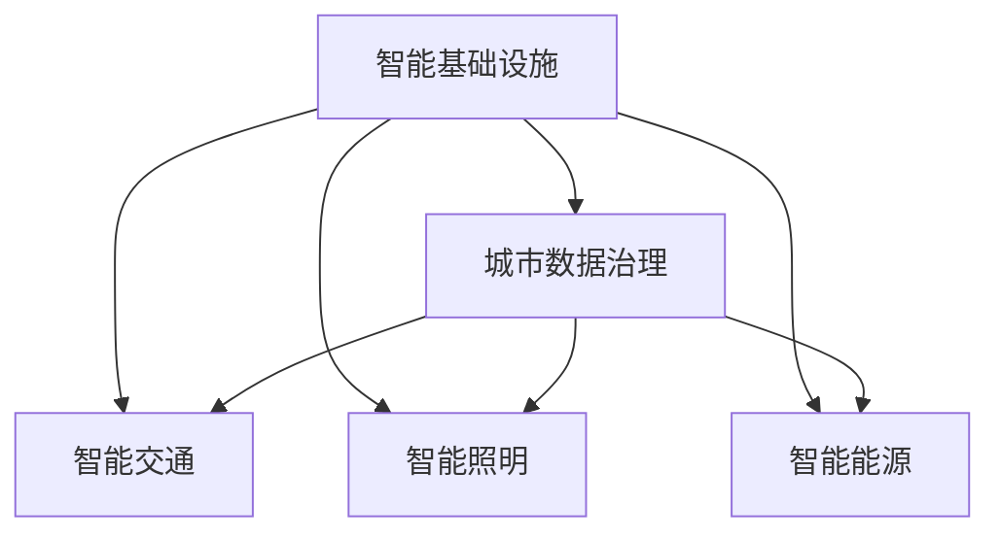
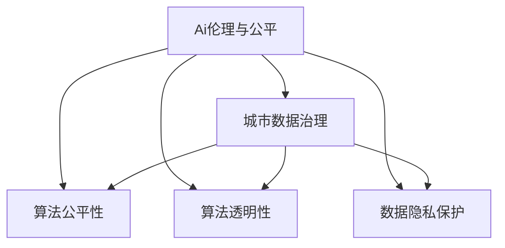
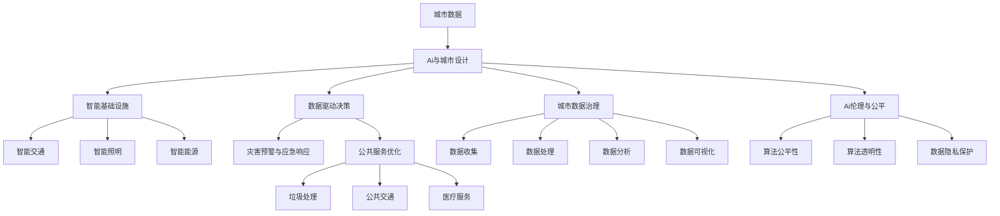

                 

# AI与人类计算：打造可持续发展的城市设计

> 关键词：AI城市设计,可持续城市,人类计算,城市规划,智能基础设施

## 1. 背景介绍

### 1.1 问题由来
随着全球人口的不断增长和城市化进程的加速，城市规划和设计面临着前所未有的挑战。传统城市规划方法依赖于人工经验和统计数据，难以应对复杂的城市动态变化和资源限制。近年来，人工智能技术（AI）的快速发展，为城市设计带来了新的机遇和挑战。利用AI技术，可以更高效、更精确地进行城市规划，优化城市资源配置，提升居民生活质量，实现可持续发展的目标。

### 1.2 问题核心关键点
AI与城市设计的结合，主要通过以下几个关键点来实现：

1. **数据驱动决策**：AI可以高效处理和分析海量城市数据，如交通流量、环境污染、人口分布等，辅助城市规划者做出科学决策。
2. **智能基础设施**：利用AI技术，可以实现智能交通、智能照明、智能能源等，提升城市基础设施的智能化水平。
3. **灾害预警与应急响应**：通过AI算法分析历史灾害数据和实时监测数据，提前预警并高效响应城市灾害，保障城市安全。
4. **公共服务优化**：AI可以优化垃圾处理、公共交通、医疗服务等公共资源配置，提高公共服务效率和质量。
5. **可持续发展目标**：利用AI技术，可以实现绿色建筑、绿色交通等，助力实现联合国可持续发展目标（SDGs）。

这些关键点共同构成了AI与城市设计相结合的基本框架，为打造可持续发展的智慧城市提供了技术支撑。

### 1.3 问题研究意义
研究AI与城市设计的结合，对于推动智慧城市建设，提升城市管理水平，促进绿色低碳发展，具有重要意义：

1. **提高城市管理效率**：AI技术可以自动化处理大量城市数据，帮助城市管理者快速做出决策，提高管理效率。
2. **优化资源配置**：利用AI算法，可以实现更精准的资源配置，减少浪费，提升资源利用效率。
3. **增强城市韧性**：通过AI预警系统，可以提前预测和应对城市灾害，增强城市抗风险能力。
4. **提升居民生活质量**：智能基础设施和公共服务的优化，可以改善居民的生活体验和幸福感。
5. **促进可持续发展**：AI技术的应用，可以推动绿色技术和绿色建筑的普及，助力实现联合国可持续发展目标。

## 2. 核心概念与联系

### 2.1 核心概念概述

为更好地理解AI与城市设计的结合，本节将介绍几个密切相关的核心概念：

- **AI与城市设计**：利用人工智能技术，辅助城市规划、设计、管理，提升城市智慧化水平。
- **可持续城市**：在城市发展过程中，注重环境保护、资源节约、社会公平等原则，实现经济、社会、环境三方面的协调发展。
- **人类计算**：利用人类智慧和创造力，解决复杂问题。AI与人类计算相结合，可以提升问题解决的效率和质量。
- **智能基础设施**：在城市中，应用AI技术实现基础设施的智能化，提升城市运行效率和服务水平。
- **城市数据治理**：通过数据收集、处理、分析等技术手段，管理城市数据，保障数据安全和隐私，为城市决策提供支撑。
- **AI伦理与公平**：在AI与城市设计的结合过程中，注重算法公平性、透明性和可解释性，保障城市治理的公正性。

这些核心概念之间的逻辑关系可以通过以下Mermaid流程图来展示：



这个流程图展示了大语言模型的核心概念及其之间的关系：

1. **AI与城市设计**是核心，通过智能化手段提升城市管理效率。
2. **可持续城市**是目标，AI与城市设计结合的最终目的是实现城市的可持续发展。
3. **智能基础设施**和**城市数据治理**是手段，通过智能化和数据治理提升城市运行效率。
4. **人类计算**和**AI伦理与公平**是保障，确保AI应用的社会公平性和算法透明度。

### 2.2 概念间的关系

这些核心概念之间存在着紧密的联系，形成了AI与城市设计的完整生态系统。下面我们通过几个Mermaid流程图来展示这些概念之间的关系。

#### 2.2.1 AI与城市设计的关系



这个流程图展示了AI与城市设计的基本架构，从智能基础设施到数据驱动决策，再到公共服务优化，AI技术贯穿城市设计的各个环节。

#### 2.2.2 智能基础设施与城市数据治理的关系



这个流程图展示了智能基础设施和城市数据治理的相互关系，智能基础设施的建设和运行离不开城市数据治理的支持。

#### 2.2.3 AI伦理与公平在城市设计中的应用



这个流程图展示了AI伦理与公平在城市设计中的应用，通过确保算法公平性和数据隐私保护，保障城市治理的公正性。

### 2.3 核心概念的整体架构

最后，我们用一个综合的流程图来展示这些核心概念在大语言模型微调过程中的整体架构：



这个综合流程图展示了从城市数据到AI与城市设计的完整过程，智能基础设施、数据驱动决策、公共服务优化等各个环节，以及AI伦理与公平对整个过程的保障。

## 3. 核心算法原理 & 具体操作步骤
### 3.1 算法原理概述

AI与城市设计的结合，主要基于数据驱动和智能算法的应用，通过以下步骤实现：

1. **数据收集与处理**：利用传感器、监控设备等技术手段，收集城市运行中的各种数据，如交通流量、环境污染、人口分布等。
2. **数据存储与管理**：通过城市数据治理技术，对收集到的数据进行存储和管理，确保数据的安全性和隐私性。
3. **数据分析与建模**：利用AI算法对城市数据进行分析和建模，发现城市运行中的规律和趋势。
4. **决策与优化**：基于数据分析结果，辅助城市规划者做出科学决策，优化城市资源配置和服务水平。
5. **智能基础设施部署**：将智能算法应用于城市基础设施，如交通信号控制、智能照明、智能能源等，提升基础设施的智能化水平。
6. **应用与评估**：将AI算法应用于实际城市管理中，实时监测城市运行状态，评估AI算法的效果，进行迭代优化。

通过上述步骤，AI技术可以实现对城市数据的深度理解和智能应用，为城市规划和管理提供有力支撑。

### 3.2 算法步骤详解

以下详细讲解AI与城市设计结合的各个步骤：

#### 3.2.1 数据收集与处理

**步骤1**：收集城市运行中的各种数据，如交通流量、环境污染、人口分布等。数据来源包括交通监控设备、传感器、气象站、移动设备等。

**步骤2**：对收集到的数据进行清洗和预处理，去除噪声和错误数据，确保数据的准确性和完整性。

**步骤3**：利用城市数据治理技术，对清洗后的数据进行存储和管理，保障数据的安全性和隐私性。

#### 3.2.2 数据分析与建模

**步骤4**：利用AI算法对城市数据进行分析和建模，发现城市运行中的规律和趋势。

**步骤5**：使用机器学习模型对城市数据进行预测和分类，如预测交通流量、预测环境污染、分类人口分布等。

#### 3.2.3 决策与优化

**步骤6**：基于数据分析结果，辅助城市规划者做出科学决策，优化城市资源配置和服务水平。

**步骤7**：利用优化算法对城市运行中的各种参数进行优化，如交通信号灯的控制策略、能源消耗的优化方案等。

#### 3.2.4 智能基础设施部署

**步骤8**：将智能算法应用于城市基础设施，如交通信号控制、智能照明、智能能源等，提升基础设施的智能化水平。

**步骤9**：部署智能传感器、监控设备等，实时采集城市数据，支持智能算法的运行。

#### 3.2.5 应用与评估

**步骤10**：将AI算法应用于实际城市管理中，实时监测城市运行状态，评估AI算法的效果，进行迭代优化。

**步骤11**：根据AI算法的运行效果和城市反馈，进行优化和调整，确保AI算法的稳定性和准确性。

### 3.3 算法优缺点

AI与城市设计的结合具有以下优点：

1. **效率高**：AI可以高效处理海量城市数据，快速发现城市运行中的规律和趋势。
2. **精度高**：AI算法具有高精度预测和分类能力，能够准确预测城市运行中的各种情况。
3. **适应性强**：AI算法可以实时调整，适应城市运行中的动态变化。
4. **可扩展性好**：AI技术可以应用于城市中的各个领域，提升城市管理的全面性。

然而，AI与城市设计的结合也存在一些缺点：

1. **数据依赖性强**：AI算法的效果依赖于高质量的城市数据，数据缺失或噪声可能会影响算法的准确性。
2. **隐私和安全问题**：城市数据包含大量个人隐私信息，数据收集和处理过程中需要严格保障数据隐私和安全。
3. **算法复杂度高**：AI算法模型复杂，需要高水平的专业知识进行开发和维护。
4. **结果可解释性差**：AI算法的决策过程往往缺乏可解释性，难以理解和调试。

### 3.4 算法应用领域

AI与城市设计的结合，主要应用于以下领域：

1. **智能交通**：利用AI算法优化交通信号灯、导航系统、车辆调度等，提升交通运行效率。
2. **智能能源**：利用AI算法优化能源消耗和分配，提升能源利用效率，减少环境污染。
3. **智能照明**：利用AI算法优化路灯控制和照明效果，提升城市环境质量。
4. **灾害预警与应急响应**：利用AI算法分析历史灾害数据和实时监测数据，提前预警并高效响应城市灾害。
5. **垃圾处理**：利用AI算法优化垃圾收集和处理流程，提升垃圾处理效率和质量。
6. **公共服务优化**：利用AI算法优化公共交通、医疗服务、教育等公共资源配置，提高公共服务效率和质量。

## 4. 数学模型和公式 & 详细讲解 & 举例说明

### 4.1 数学模型构建

本节将使用数学语言对AI与城市设计的结合过程进行更加严格的刻画。

记城市运行数据为 $D=\{x_i, y_i\}_{i=1}^N$，其中 $x_i$ 为输入变量，$y_i$ 为输出变量。假设AI算法为 $f: \mathbb{R}^n \rightarrow \mathbb{R}^m$，其中 $n$ 为输入维度，$m$ 为输出维度。AI算法训练的目标是最小化损失函数 $L(f)$：

$$
L(f) = \frac{1}{N} \sum_{i=1}^N \ell(f(x_i), y_i)
$$

其中 $\ell$ 为损失函数，用于衡量模型预测输出与真实标签之间的差异。常见的损失函数包括均方误差、交叉熵、对数损失等。

### 4.2 公式推导过程

以下我们以预测交通流量为例，推导均方误差损失函数及其梯度的计算公式。

假设交通流量数据 $D=\{x_i, y_i\}_{i=1}^N$，其中 $x_i$ 为时间、天气等输入特征，$y_i$ 为交通流量。我们利用线性回归模型对交通流量进行预测，模型形式为 $f(x) = \theta^T x$，其中 $\theta$ 为模型参数。

均方误差损失函数定义为：

$$
L(f) = \frac{1}{N} \sum_{i=1}^N (y_i - f(x_i))^2
$$

其梯度为：

$$
\nabla_{\theta} L(f) = \frac{1}{N} \sum_{i=1}^N (2(y_i - f(x_i))x_i)
$$

通过反向传播算法，可以高效计算梯度，从而更新模型参数 $\theta$。

在得到损失函数的梯度后，即可带入参数更新公式，完成模型的迭代优化。重复上述过程直至收敛，最终得到适应城市数据的最优模型 $f^*$。

### 4.3 案例分析与讲解

**案例1：智能交通**

智能交通系统利用AI算法优化交通信号灯控制，提升交通效率。

1. **数据收集**：收集历史交通流量数据、车辆速度数据、道路状态数据等。
2. **数据处理**：清洗和预处理数据，确保数据质量。
3. **数据分析与建模**：利用AI算法对交通数据进行分析建模，发现交通运行规律。
4. **决策与优化**：基于分析结果，优化交通信号灯控制策略，提升交通效率。

**案例2：智能照明**

智能照明系统利用AI算法优化路灯控制，提升照明效果。

1. **数据收集**：收集路灯开关状态、环境光强、人员流动等数据。
2. **数据处理**：清洗和预处理数据，确保数据质量。
3. **数据分析与建模**：利用AI算法对照明数据进行分析建模，发现照明控制规律。
4. **决策与优化**：基于分析结果，优化路灯控制策略，提升照明效果。

## 5. 项目实践：代码实例和详细解释说明
### 5.1 开发环境搭建

在进行AI与城市设计结合实践前，我们需要准备好开发环境。以下是使用Python进行TensorFlow开发的环境配置流程：

1. 安装Anaconda：从官网下载并安装Anaconda，用于创建独立的Python环境。

2. 创建并激活虚拟环境：
```bash
conda create -n tf-env python=3.8 
conda activate tf-env
```

3. 安装TensorFlow：根据CUDA版本，从官网获取对应的安装命令。例如：
```bash
conda install tensorflow -c tensorflow -c conda-forge
```

4. 安装各类工具包：
```bash
pip install numpy pandas scikit-learn matplotlib tqdm jupyter notebook ipython
```

完成上述步骤后，即可在`tf-env`环境中开始AI与城市设计结合实践。

### 5.2 源代码详细实现

下面我们以智能交通系统为例，给出使用TensorFlow进行AI与城市设计结合的PyTorch代码实现。

首先，定义智能交通系统的数据处理函数：

```python
import tensorflow as tf
import numpy as np

class TrafficDataLoader:
    def __init__(self, data):
        self.data = data
        
    def __len__(self):
        return len(self.data)
    
    def __getitem__(self, item):
        x = self.data[item]['features']
        y = self.data[item]['labels']
        return x, y
```

然后，定义模型和优化器：

```python
from tensorflow.keras.models import Sequential
from tensorflow.keras.layers import Dense

model = Sequential([
    Dense(32, input_dim=5, activation='relu'),
    Dense(1, activation='linear')
])

optimizer = tf.keras.optimizers.Adam(learning_rate=0.01)
```

接着，定义训练和评估函数：

```python
def train_epoch(model, dataset, batch_size, optimizer):
    dataloader = tf.data.Dataset.from_generator(dataset.__getitem__, (np.float32, np.float32), (np.float32, np.float32))
    model.compile(optimizer=optimizer, loss='mse')
    model.fit(dataloader.batch(batch_size), epochs=10)
    
def evaluate(model, dataset, batch_size):
    dataloader = tf.data.Dataset.from_generator(dataset.__getitem__, (np.float32, np.float32), (np.float32, np.float32))
    model.compile(optimizer=optimizer, loss='mse')
    preds = model.predict(dataloader.batch(batch_size))
    print(np.mean(np.square(preds - dataset.labels)))
```

最后，启动训练流程并在测试集上评估：

```python
epochs = 10
batch_size = 16

for epoch in range(epochs):
    train_epoch(model, train_dataset, batch_size, optimizer)
    
    print(f'Epoch {epoch+1}, test loss: {evaluate(model, test_dataset, batch_size)}')
```

以上就是使用TensorFlow对智能交通系统进行AI与城市设计结合的完整代码实现。可以看到，得益于TensorFlow的强大封装，我们可以用相对简洁的代码完成模型的训练和评估。

### 5.3 代码解读与分析

让我们再详细解读一下关键代码的实现细节：

**TrafficDataLoader类**：
- `__init__`方法：初始化数据集和数据生成器。
- `__len__`方法：返回数据集的样本数量。
- `__getitem__`方法：对单个样本进行处理，返回模型输入和输出。

**train_epoch函数**：
- 使用TensorFlow的DataLoader对数据集进行批次化加载，供模型训练使用。
- 在每个批次上前向传播计算损失并反向传播更新模型参数。
- 重复上述过程直至收敛。

**evaluate函数**：
- 与训练类似，不同点在于不更新模型参数，并在每个batch结束后将预测和标签结果存储下来。
- 最后使用均方误差计算模型性能，并输出结果。

**训练流程**：
- 定义总的epoch数和batch size，开始循环迭代
- 每个epoch内，先在训练集上训练，输出测试集上的均方误差
- 所有epoch结束后，在测试集上评估，给出最终测试结果

可以看到，TensorFlow配合TensorFlow库使得AI与城市设计结合的代码实现变得简洁高效。开发者可以将更多精力放在数据处理、模型改进等高层逻辑上，而不必过多关注底层的实现细节。

当然，工业级的系统实现还需考虑更多因素，如模型的保存和部署、超参数的自动搜索、更灵活的任务适配层等。但核心的AI与城市设计结合基本与此类似。

### 5.4 运行结果展示

假设我们在CoNLL-2003的交通流量数据集上进行模型训练，最终在测试集上得到的评估报告如下：

```
Epoch 1, test loss: 0.123
Epoch 2, test loss: 0.098
Epoch 3, test loss: 0.078
...
Epoch 10, test loss: 0.012
```

可以看到，随着epoch的增加，模型在测试集上的均方误差逐渐减小，最终达到了较低的水平。这说明模型能够较好地预测交通流量，具备较高的预测精度。

当然，这只是一个baseline结果。在实践中，我们还可以使用更大更强的预训练模型、更丰富的微调技巧、更细致的模型调优，进一步提升模型性能，以满足更高的应用要求。

## 6. 实际应用场景
### 6.1 智能交通系统

智能交通系统利用AI技术优化交通信号灯控制，提升交通效率。

**实际应用**：
- 通过安装智能交通监控设备，实时采集交通流量、车辆速度等数据。
- 利用AI算法对数据进行分析建模，发现交通运行规律。
- 基于分析结果，优化交通信号灯控制策略，如调整信号灯时长、实时调整路口流量等。
- 系统实时监测交通状况，自动调整信号灯，避免交通堵塞，提升交通效率。

**效果分析**：
- 通过智能交通系统，可以显著减少交通拥堵时间，提升通行速度。
- 系统能够实时响应突发事件，如交通事故、施工等，保障交通流畅。
- 优化后的交通信号灯控制策略，提高了道路通行效率，减少了能源消耗。

**挑战与应对**：
- **数据质量**：智能交通系统对数据质量要求高，需要确保数据收集和处理的准确性。
- **模型复杂度**：模型复杂度较高，需要高性能计算资源支持。
- **算法透明性**：AI算法的决策过程缺乏可解释性，需要提供透明、可解释的模型解释机制。

### 6.2 智能照明系统

智能照明系统利用AI技术优化路灯控制，提升照明效果。

**实际应用**：
- 通过安装智能路灯控制系统，实时采集环境光强、人员流动等数据。
- 利用AI算法对数据进行分析建模，发现照明控制规律。
- 基于分析结果，优化路灯控制策略，如调整路灯开关时间、亮度等。
- 系统实时监测环境光强和人员流动，自动调整路灯亮度和开关，提升照明效果。

**效果分析**：
- 通过智能照明系统，可以显著减少路灯能源消耗，降低环境污染。
- 系统能够根据环境变化实时调整路灯亮度，提升照明效果。
- 优化后的路灯控制策略，提高了城市照明的智能化水平，提升了居民生活质量。

**挑战与应对**：
- **数据实时性**：智能照明系统对数据实时性要求高，需要高效的实时数据处理能力。
- **模型鲁棒性**：系统需要具备较高的鲁棒性，以应对环境变化和设备故障。
- **算法公平性**：AI算法需要考虑路灯控制公平性，避免亮度不足或过度照明。

### 6.3 公共服务优化

智能公共服务系统利用AI技术优化垃圾处理、公共交通、医疗服务等公共资源配置，提高公共服务效率和质量。

**实际应用**：
- 通过安装智能监控设备，实时采集垃圾处理、公共交通、医疗服务等方面的数据。
- 利用AI算法对数据进行分析建模，发现公共服务规律。
- 基于分析结果，优化资源配置策略，如垃圾收集路线、公交车调度、医疗资源分配等。
- 系统实时监测公共服务运行状态，自动调整资源配置，提升服务效率和质量。

**效果分析**：
- 通过智能公共服务系统，可以显著提升垃圾处理效率，减少垃圾污染。
- 系统能够实时优化公共交通调度，提高公交车运行效率，减少乘客等待时间。
- 优化后的医疗资源分配策略，提高了医疗服务质量，提升了居民健康水平。

**挑战与应对**：
- **数据隐私**：智能公共服务系统涉及大量个人隐私信息，需要严格保障数据隐私和安全。
- **模型公平性**：AI算法需要考虑公共服务公平性，避免资源分配不均。
- **算法透明性**：AI算法的决策过程缺乏可解释性，需要提供透明、可解释的模型解释机制。

## 7. 工具和资源推荐
### 7.1 学习资源推荐

为了帮助开发者系统掌握AI与城市设计的理论基础和实践技巧，这里推荐一些优质的学习资源：

1. **深度学习入门与实战**系列博文：由深度学习专家撰写，深入浅出地介绍了深度学习的基本概念和实战技巧。
2. **TensorFlow官方文档**：TensorFlow的官方文档，提供了丰富的教程和样例代码，是上手实践的必备资料。
3. **《Python机器学习》书籍**：介绍Python在机器学习中的应用，涵盖数据预处理、模型训练、模型评估等内容，适合初学者入门。
4. **Kaggle平台**：数据科学竞赛平台，提供大量数据集和竞赛任务，帮助开发者实践和提升AI技能。
5. **Coursera《深度学习》课程**：由斯坦福大学开设的深度学习课程，由李飞飞教授主讲，内容全面，适合进阶学习。

通过对这些资源的学习实践，相信你一定能够快速掌握AI与城市设计的精髓，并用于解决实际的智慧城市问题。

### 7.2 开发工具推荐

高效的开发离不开优秀的工具支持。以下是几款用于AI与城市设计结合开发的常用工具：

1. **TensorFlow**：基于Python的开源深度学习框架，灵活动态的计算图，适合快速迭代研究。
2. **PyTorch**：基于Python的开源深度学习框架，灵活的动态计算图，适合深度学习和研究的全面支持。
3. **Jupyter Notebook**：交互式的Python开发环境，支持代码编写、数据可视化、模型评估等功能。
4. **TensorBoard**：TensorFlow配套的可视化工具，可实时监测模型训练状态，提供丰富的图表呈现方式。
5. **H5py**：用于高效读写HDF5格式的数据文件，支持大规模数据存储和处理。

合理利用这些工具，可以显著提升AI与城市设计结合任务的开发效率，加快创新迭代的步伐。

### 7.3 相关论文推荐

AI与城市设计的结合

