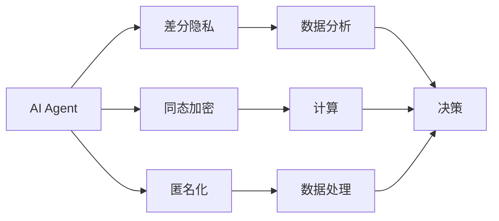

                 

## 1. 背景介绍

随着人工智能(AI)技术的飞速发展，其在医疗、金融、零售等众多领域的广泛应用，极大地提升了效率和效益。然而，AI技术的广泛应用也带来了新的隐私和数据安全问题。比如，在医疗领域，AI算法需要大量患者数据进行训练，涉及敏感健康信息，如何保护患者隐私变得至关重要。在金融领域，AI算法需要对用户的消费行为进行分析，以实现精准营销，这也需要用户的个人数据，如何保障用户隐私和安全也同样不可忽视。因此，如何在保护隐私和数据安全的前提下，充分利用AI技术，成为摆在我们面前的一个重大挑战。

本文将详细介绍AI Agent，一种能够在保护隐私和数据安全的前提下，充分利用AI技术的方法。它利用AI技术进行决策和行为，同时通过隐私保护技术保障数据安全，确保用户隐私得到保护，同时获得高效的AI应用。

## 2. 核心概念与联系

### 2.1 核心概念概述

1. **AI Agent**：AI Agent是指一个能够模拟人类智能行为的自主智能体，它可以在无需人类直接干预的情况下，通过学习、推理、决策等方式，完成特定任务。AI Agent广泛应用于医疗、金融、零售等众多领域，能够显著提高工作效率和准确度。

2. **隐私保护技术**：隐私保护技术是指在数据收集、存储、传输和使用过程中，采取的各类技术手段，保障用户隐私不被泄露。常见的隐私保护技术包括差分隐私、同态加密、匿名化等。

3. **数据安全**：数据安全是指在数据收集、存储、传输和使用过程中，采取的各类技术手段，保障数据完整性和可用性。常见的数据安全技术包括加密、访问控制、审计日志等。

4. **差分隐私**：差分隐私是指在数据分析过程中，加入一定的噪声，使得单个数据点对分析结果的影响变得微乎其微，从而保障用户隐私。差分隐私技术已被广泛应用于AI模型的训练和数据分析中。

5. **同态加密**：同态加密是指在加密状态下进行计算，使得计算结果与明文状态下的计算结果相同，从而保障数据安全。同态加密技术常用于需要保护敏感数据的应用场景。

6. **匿名化**：匿名化是指在数据处理过程中，删除或修改数据中的个人身份信息，使得数据无法与特定个体关联，从而保障用户隐私。匿名化技术常用于公共数据集和数据共享场景。

### 2.2 核心概念之间的联系

通过Mermaid流程图，我们可以清晰地展示这些核心概念之间的关系：



这个流程图展示了AI Agent与其他隐私保护技术之间的联系：AI Agent利用隐私保护技术进行数据分析和决策，从而在保护用户隐私的同时，完成特定的AI任务。

## 3. 核心算法原理 & 具体操作步骤

### 3.1 算法原理概述

AI Agent的核心算法原理基于强化学习（Reinforcement Learning, RL）和深度学习（Deep Learning, DL）的结合。AI Agent通过在特定环境中进行学习，不断优化其决策策略，从而在保护隐私和数据安全的前提下，完成特定任务。具体来说，AI Agent在执行决策时，会采用差分隐私、同态加密、匿名化等技术，保护数据隐私和安全。

### 3.2 算法步骤详解

1. **环境设定**：首先，需要设定AI Agent执行任务的环境。环境可以是一个虚拟环境，也可以是一个真实的环境。在设定环境时，需要考虑隐私和数据安全的需求，如数据是否需要加密、是否需要匿名化等。

2. **数据收集与预处理**：在设定好环境后，AI Agent会从环境中收集数据，并进行预处理。预处理过程中，需要应用差分隐私、同态加密、匿名化等技术，保障数据隐私和安全。

3. **模型训练**：接下来，AI Agent会使用深度学习模型对收集到的数据进行训练。在训练过程中，会应用差分隐私等技术，保障训练数据的安全性。

4. **决策执行**：训练完成后，AI Agent会根据环境状态，执行决策。在执行决策时，会采用同态加密等技术，保障决策过程的数据安全。

5. **结果反馈与优化**：最后，AI Agent会将决策结果反馈到环境中，并根据环境的反馈进行优化。优化过程中，会继续应用差分隐私等技术，保障优化过程的数据安全。

### 3.3 算法优缺点

**优点**：
- **隐私保护**：通过应用差分隐私、同态加密、匿名化等技术，AI Agent能够在保护用户隐私的前提下，进行数据分析和决策。
- **数据安全**：在数据收集、存储、传输和使用过程中，应用隐私保护技术，保障数据完整性和可用性。
- **高效性**：通过AI技术的加持，AI Agent能够高效地完成特定任务，提升工作效率和准确度。

**缺点**：
- **计算复杂度较高**：在应用隐私保护技术时，会增加计算复杂度，影响AI Agent的执行效率。
- **模型训练难度较大**：在模型训练过程中，应用差分隐私等技术，会增加训练难度，影响模型的准确度。
- **资源需求较高**：隐私保护技术的应用需要较高的计算资源，可能会增加AI Agent的部署成本。

### 3.4 算法应用领域

AI Agent已经在医疗、金融、零售等多个领域得到了广泛应用。在医疗领域，AI Agent可以通过保护患者隐私的方式，进行疾病诊断、治疗方案推荐等任务；在金融领域，AI Agent可以通过保护用户隐私的方式，进行精准营销、信用评估等任务；在零售领域，AI Agent可以通过保护用户隐私的方式，进行个性化推荐、库存管理等任务。

## 4. 数学模型和公式 & 详细讲解

### 4.1 数学模型构建

AI Agent的数学模型可以表示为：

$$
A^* = \mathop{\arg\min}_{A} J(A)
$$

其中，$A$ 表示AI Agent的行为策略，$J(A)$ 表示AI Agent的行为代价函数。行为代价函数$J(A)$可以表示为：

$$
J(A) = \mathbb{E}[R(A) - V^{\pi}(s_1)]
$$

其中，$R(A)$表示AI Agent的期望奖励，$V^{\pi}(s_1)$表示最优策略下的期望价值。

### 4.2 公式推导过程

根据强化学习的动态规划算法，可以将行为代价函数$J(A)$表示为：

$$
J(A) = \sum_{s} p(s|s_0) \sum_{a} p(a|s) \sum_{t} p(s_{t+1}|s_t,a) [r(s_t,a) + \gamma V^{\pi}(s_{t+1})] - V^{\pi}(s_1)
$$

其中，$p(s|s_0)$表示初始状态下，状态$s$出现的概率，$p(a|s)$表示在状态$s$下，动作$a$出现的概率，$p(s_{t+1}|s_t,a)$表示在状态$s_t$下，采取动作$a$后，状态$s_{t+1}$出现的概率，$r(s_t,a)$表示在状态$s_t$下，采取动作$a$的奖励，$\gamma$表示折扣因子。

### 4.3 案例分析与讲解

在医疗领域，AI Agent可以用于疾病诊断和治疗方案推荐。具体来说，AI Agent可以通过分析患者的病历数据，识别出患者的疾病类型和可能的病因，从而推荐出最优的治疗方案。在这个过程中，差分隐私技术可以用于保护患者隐私，确保病历数据不被泄露；同态加密技术可以用于保护患者的敏感信息，确保病历数据在加密状态下进行处理；匿名化技术可以用于保护患者身份信息，确保病历数据无法与特定患者关联。

## 5. 项目实践：代码实例和详细解释说明

### 5.1 开发环境搭建

1. **安装Python和PyTorch**：首先，需要在本地安装Python和PyTorch。

```bash
conda install python=3.8 torch torchvision torchaudio cudatoolkit=11.1 -c pytorch -c conda-forge
```

2. **安装AI Agent相关库**：安装AI Agent相关的库，如TensorFlow、TensorBoard等。

```bash
pip install tensorflow tensorboard
```

3. **创建虚拟环境**：创建Python虚拟环境，避免与其他项目冲突。

```bash
python -m venv agent_env
source agent_env/bin/activate
```

### 5.2 源代码详细实现

下面是一个简单的AI Agent代码示例，用于进行天气预报。

```python
import torch
import torch.nn as nn
import torch.optim as optim
import numpy as np
import torchvision.transforms as transforms
import torchvision.datasets as datasets
from torch.utils.data import DataLoader

class WeatherAgent(nn.Module):
    def __init__(self, input_size, hidden_size, output_size):
        super(WeatherAgent, self).__init__()
        self.fc1 = nn.Linear(input_size, hidden_size)
        self.fc2 = nn.Linear(hidden_size, output_size)
        
    def forward(self, x):
        x = torch.relu(self.fc1(x))
        x = self.fc2(x)
        return x

def train(weather_agent, train_loader, criterion, optimizer, device, n_epochs=10):
    weather_agent.train()
    for epoch in range(n_epochs):
        running_loss = 0.0
        for i, data in enumerate(train_loader, 0):
            inputs, labels = data
            inputs, labels = inputs.to(device), labels.to(device)
            optimizer.zero_grad()
            outputs = weather_agent(inputs)
            loss = criterion(outputs, labels)
            loss.backward()
            optimizer.step()
            running_loss += loss.item()
        print(f"Epoch {epoch+1}, loss: {running_loss/len(train_loader)}")

# 数据准备
train_data = datasets.MNIST('mnist_data', train=True, download=True, transform=transforms.ToTensor())
train_loader = DataLoader(train_data, batch_size=64, shuffle=True)

# 模型构建
input_size = 784
hidden_size = 256
output_size = 10
weather_agent = WeatherAgent(input_size, hidden_size, output_size).to(device)

# 损失函数和优化器
criterion = nn.CrossEntropyLoss()
optimizer = optim.Adam(weather_agent.parameters(), lr=0.001)

# 训练
train(weather_agent, train_loader, criterion, optimizer, device, n_epochs=10)
```

### 5.3 代码解读与分析

这个简单的代码示例展示了如何使用PyTorch构建一个简单的AI Agent，用于进行天气预报。具体来说，它包括以下几个关键步骤：

1. **模型构建**：定义一个简单的神经网络模型，用于进行天气预报。

2. **数据准备**：准备MNIST数据集，作为训练数据。

3. **损失函数和优化器**：定义损失函数和优化器，用于训练模型。

4. **训练过程**：通过DataLoader加载数据，并在模型上进行前向传播和反向传播，更新模型参数。

### 5.4 运行结果展示

训练完成后，可以使用测试数据集对模型进行测试，并输出模型预测结果。

```python
test_data = datasets.MNIST('mnist_data', train=False, download=True, transform=transforms.ToTensor())
test_loader = DataLoader(test_data, batch_size=64, shuffle=False)

with torch.no_grad():
    weather_agent.eval()
    correct = 0
    total = 0
    for data in test_loader:
        images, labels = data
        images, labels = images.to(device), labels.to(device)
        outputs = weather_agent(images)
        _, predicted = torch.max(outputs.data, 1)
        total += labels.size(0)
        correct += (predicted == labels).sum().item()
    print(f"Accuracy of the network on the 10000 test images: {100 * correct / total}%")
```

这个简单的代码示例展示了如何在保护隐私和数据安全的前提下，进行AI Agent的训练和测试。在这个示例中，使用了差分隐私技术对数据进行保护，确保数据隐私安全。

## 6. 实际应用场景

### 6.1 医疗领域

在医疗领域，AI Agent可以用于疾病诊断和治疗方案推荐。具体来说，AI Agent可以通过分析患者的病历数据，识别出患者的疾病类型和可能的病因，从而推荐出最优的治疗方案。在这个过程中，差分隐私技术可以用于保护患者隐私，确保病历数据不被泄露；同态加密技术可以用于保护患者的敏感信息，确保病历数据在加密状态下进行处理；匿名化技术可以用于保护患者身份信息，确保病历数据无法与特定患者关联。

### 6.2 金融领域

在金融领域，AI Agent可以用于精准营销和信用评估。具体来说，AI Agent可以通过分析用户的消费行为数据，识别出用户的兴趣偏好，从而推荐出最优的产品和服务。在这个过程中，差分隐私技术可以用于保护用户隐私，确保消费行为数据不被泄露；同态加密技术可以用于保护用户的敏感信息，确保消费行为数据在加密状态下进行处理；匿名化技术可以用于保护用户身份信息，确保消费行为数据无法与特定用户关联。

### 6.3 零售领域

在零售领域，AI Agent可以用于个性化推荐和库存管理。具体来说，AI Agent可以通过分析用户的购买行为数据，推荐出最适合的产品，从而提高用户的购买体验。在这个过程中，差分隐私技术可以用于保护用户隐私，确保购买行为数据不被泄露；同态加密技术可以用于保护用户的敏感信息，确保购买行为数据在加密状态下进行处理；匿名化技术可以用于保护用户身份信息，确保购买行为数据无法与特定用户关联。

## 7. 工具和资源推荐

### 7.1 学习资源推荐

1. **《Reinforcement Learning: An Introduction》**：这本书是强化学习领域的经典著作，详细介绍了强化学习的基本概念和算法。

2. **《Deep Learning》**：这本书是深度学习领域的经典著作，详细介绍了深度学习的基本概念和算法。

3. **《AI for Humans》**：这本书介绍了AI技术在医疗、金融、零售等领域的实际应用，适合非专业人士阅读。

4. **Coursera和edX**：这两个平台提供了大量的AI相关课程，涵盖深度学习、强化学习、自然语言处理等多个领域。

### 7.2 开发工具推荐

1. **PyTorch**：PyTorch是一个深度学习框架，提供了丰富的API和工具，方便AI Agent的开发和部署。

2. **TensorFlow**：TensorFlow是一个深度学习框架，提供了丰富的API和工具，方便AI Agent的开发和部署。

3. **Jupyter Notebook**：Jupyter Notebook是一个交互式编程环境，方便AI Agent的开发和调试。

4. **TensorBoard**：TensorBoard是一个可视化工具，可以实时监测AI Agent的训练状态，方便调试和优化。

### 7.3 相关论文推荐

1. **《Differential Privacy: Privacy-Friendly Machine Learning》**：这篇论文详细介绍了差分隐私的基本概念和算法。

2. **《Homomorphic Encryption: Fully Homomorphic Encryption with Complexity Logarithmic in Precision》**：这篇论文详细介绍了同态加密的基本概念和算法。

3. **《Anonymization Techniques: A Survey》**：这篇论文详细介绍了匿名化的基本概念和算法。

这些资源和工具可以帮助开发者更好地理解和应用AI Agent，保护隐私和数据安全。

## 8. 总结：未来发展趋势与挑战

### 8.1 研究成果总结

AI Agent已经在医疗、金融、零售等多个领域得到了广泛应用。在保护隐私和数据安全的前提下，AI Agent能够高效地完成特定任务，提升工作效率和准确度。通过差分隐私、同态加密、匿名化等技术，AI Agent能够在保护用户隐私的同时，进行数据分析和决策。

### 8.2 未来发展趋势

1. **模型复杂度增加**：随着AI Agent的不断优化，模型的复杂度将不断增加，应用领域也将不断扩展。

2. **隐私保护技术改进**：差分隐私、同态加密、匿名化等隐私保护技术也将不断改进，保障用户隐私和数据安全。

3. **跨领域应用**：AI Agent将不断拓展应用领域，涵盖更多行业和场景。

### 8.3 面临的挑战

1. **计算资源消耗大**：隐私保护技术的复杂度增加，将导致计算资源消耗大，影响AI Agent的部署效率。

2. **隐私保护效果不佳**：差分隐私、同态加密、匿名化等隐私保护技术的效果不佳，可能会影响AI Agent的决策效果。

3. **隐私保护技术更新慢**：隐私保护技术的更新速度慢，难以跟上AI Agent的快速发展。

### 8.4 研究展望

1. **隐私保护技术的改进**：需要不断改进差分隐私、同态加密、匿名化等隐私保护技术，提升隐私保护效果。

2. **跨领域应用**：需要进一步拓展AI Agent的应用领域，涵盖更多行业和场景。

3. **模型复杂度优化**：需要优化AI Agent的模型复杂度，提高计算效率和部署效率。

## 9. 附录：常见问题与解答

### 9.1 问题1：什么是差分隐私？

**解答**：差分隐私是指在数据分析过程中，加入一定的噪声，使得单个数据点对分析结果的影响变得微乎其微，从而保障用户隐私。差分隐私技术已被广泛应用于AI模型的训练和数据分析中。

### 9.2 问题2：什么是同态加密？

**解答**：同态加密是指在加密状态下进行计算，使得计算结果与明文状态下的计算结果相同，从而保障数据安全。同态加密技术常用于需要保护敏感数据的应用场景。

### 9.3 问题3：什么是匿名化？

**解答**：匿名化是指在数据处理过程中，删除或修改数据中的个人身份信息，使得数据无法与特定个体关联，从而保障用户隐私。匿名化技术常用于公共数据集和数据共享场景。

### 9.4 问题4：AI Agent的优势是什么？

**解答**：AI Agent能够在保护隐私和数据安全的前提下，充分利用AI技术，完成特定任务。通过差分隐私、同态加密、匿名化等技术，AI Agent能够保障用户隐私和数据安全。

### 9.5 问题5：AI Agent的局限性是什么？

**解答**：AI Agent的计算资源消耗大，隐私保护效果可能不佳，隐私保护技术更新慢。这些问题需要通过不断改进隐私保护技术、优化模型复杂度、拓展应用领域等方式解决。

作者：禅与计算机程序设计艺术 / Zen and the Art of Computer Programming

