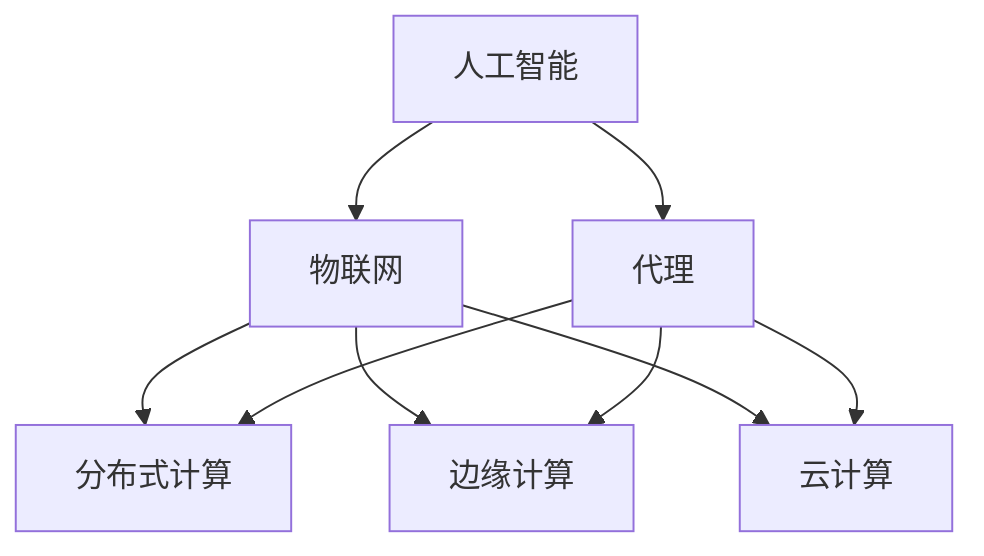
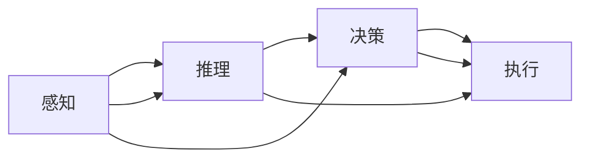
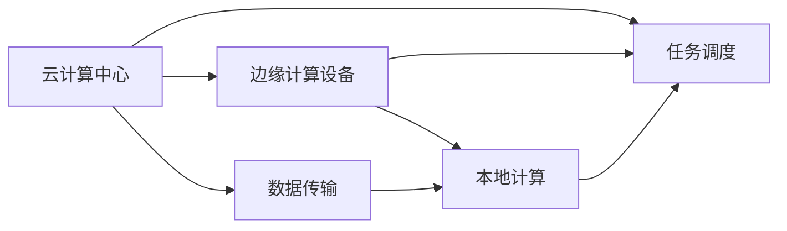
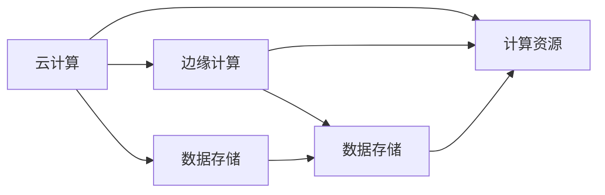
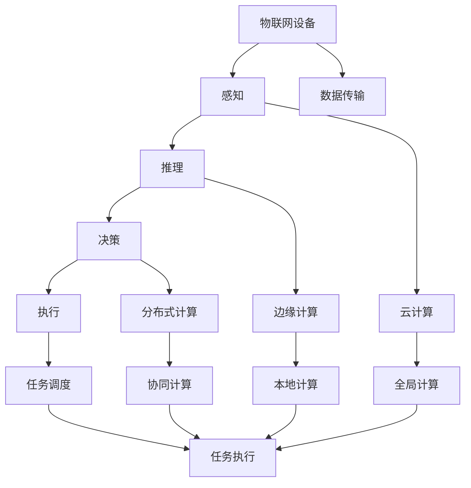

                 

# AI人工智能代理工作流 AI Agent WorkFlow：在物联网中的应用

> 关键词：人工智能, 代理工作流, 物联网, 分布式计算, 边缘计算, 云计算

## 1. 背景介绍

### 1.1 问题由来

随着物联网设备的普及和应用场景的日益丰富，如何高效、可靠地管理这些设备，使其能够协同工作、共同完成复杂任务，成为了物联网系统设计和应用中的重要问题。传统的集中式计算模型由于计算和通信开销大，已经无法满足大规模物联网设备的实时协同需求。分布式计算模型虽然能够降低通信和计算开销，但由于数据孤岛和协同机制复杂，也存在一定的问题。因此，亟需一种新的计算范式，能够在保证计算效率的同时，实现物联网设备的协同工作。

人工智能(AI)技术在处理大规模数据、智能决策等方面具有天然的优势。将AI技术引入物联网系统，使其具备智能化决策、自动化管理等能力，可以显著提升系统的运行效率和用户体验。同时，AI代理(Agent)技术能够自主地与环境互动，处理复杂的任务，符合物联网设备分散、自主的特性。因此，将AI代理引入物联网系统，能够实现智能化、自适应、自主协同的管理。

### 1.2 问题核心关键点

AI代理在物联网系统中的应用，主要涉及以下几个核心问题：

- **自主决策**：AI代理能够自主地进行环境感知、任务规划和决策执行，而不需要人工干预。
- **协同合作**：多个AI代理能够通过合作完成任务，提升系统整体的性能和效率。
- **动态适应**：AI代理能够根据环境变化和任务需求，动态调整自身的行为和策略。
- **多模态交互**：AI代理能够同时处理语音、图像、文本等多种模态的数据，实现人机互动。
- **跨域管理**：AI代理能够跨设备、跨平台、跨网络进行协同管理，实现无缝通信。
- **安全性与隐私保护**：AI代理需要在保证系统安全的前提下，保护用户隐私和数据安全。

这些核心问题涉及到大规模分布式系统的设计、优化和应用，需要多学科、多技术的协同创新。

### 1.3 问题研究意义

AI代理在物联网系统中的应用，对于提升物联网系统的智能化水平、降低运维成本、提高用户体验等方面具有重要意义：

- **提升智能化水平**：AI代理能够实现自主决策、协同合作等复杂任务，提升系统的智能化水平。
- **降低运维成本**：AI代理能够自动处理异常情况，降低人工运维的工作量。
- **提高用户体验**：AI代理能够根据用户行为和需求，提供个性化的服务和推荐。
- **增强安全性和隐私保护**：AI代理能够识别并应对潜在威胁，保护用户隐私和数据安全。
- **支持跨域协作**：AI代理能够跨设备、跨平台进行协同管理，实现无缝通信和信息共享。

## 2. 核心概念与联系

### 2.1 核心概念概述

为更好地理解AI代理在物联网系统中的应用，本节将介绍几个密切相关的核心概念：

- **人工智能(AI)**：一种模拟人类智能过程的计算技术，包括感知、推理、决策等多个方面。
- **代理(Agent)**：一种自主地与环境互动、处理复杂任务的智能实体。
- **物联网(IoT)**：通过传感器、执行器等设备实现物与物、物与人之间的互联互通。
- **分布式计算**：将计算任务分布到多台计算设备上，协同完成计算任务。
- **边缘计算**：将数据和计算任务从云端转移到设备端，提高计算效率和响应速度。
- **云计算**：通过网络提供按需的计算资源和存储服务，实现资源的灵活管理和使用。

这些核心概念之间的逻辑关系可以通过以下Mermaid流程图来展示：



这个流程图展示了大语言模型的工作原理和架构，具体解释如下：

1. **人工智能**通过**代理**处理复杂的**物联网**任务，实现智能化决策和管理。
2. **分布式计算**和**边缘计算**提供计算和通信资源，支持代理的自主决策和协同合作。
3. **云计算**提供计算和存储资源，支持代理的跨域管理和大规模数据处理。

### 2.2 概念间的关系

这些核心概念之间存在着紧密的联系，形成了AI代理在物联网系统中的完整生态系统。下面我通过几个Mermaid流程图来展示这些概念之间的关系。

#### 2.2.1 大语言模型的工作流程



这个流程图展示了AI代理的工作流程。感知模块负责环境感知，推理模块负责数据分析和处理，决策模块负责任务规划和决策执行，执行模块负责任务执行和反馈。

#### 2.2.2 分布式计算与边缘计算的关系



这个流程图展示了分布式计算和边缘计算的关系。云计算中心提供全局任务调度，边缘计算设备进行本地计算和数据处理，两者通过数据传输实现协同计算和通信。

#### 2.2.3 云计算与边缘计算的协同



这个流程图展示了云计算和边缘计算的协同。云计算提供全局数据存储和计算资源，边缘计算进行本地数据处理和计算，两者通过数据存储和计算资源实现协同计算和通信。

### 2.3 核心概念的整体架构

最后，我们用一个综合的流程图来展示这些核心概念在大语言模型微调过程中的整体架构：



这个综合流程图展示了AI代理在物联网系统中的应用。物联网设备通过感知模块获取环境信息，推理模块进行分析处理，决策模块进行任务规划和决策执行，执行模块进行任务执行和反馈。同时，云计算、边缘计算和分布式计算提供计算和通信资源，支持代理的自主决策和协同合作。

## 3. 核心算法原理 & 具体操作步骤
### 3.1 算法原理概述

AI代理在物联网系统中的应用，主要涉及以下几个核心算法：

- **感知算法**：用于环境感知，如传感器数据的采集和处理。
- **推理算法**：用于数据分析和处理，如数据建模和预测。
- **决策算法**：用于任务规划和决策执行，如策略优化和行为选择。
- **执行算法**：用于任务执行和反馈，如动作执行和状态更新。
- **协同算法**：用于多个代理之间的协同合作，如任务分配和通信协议。
- **学习算法**：用于代理的自我学习和优化，如强化学习和迁移学习。

这些算法共同构成了AI代理在物联网系统中的工作原理和架构，使其能够实现自主决策、协同合作等复杂任务。

### 3.2 算法步骤详解

AI代理在物联网系统中的应用，主要涉及以下几个关键步骤：

**Step 1: 感知环境**

- 通过传感器等设备采集环境数据，如温度、湿度、光线等。
- 对感知数据进行预处理和特征提取，形成感知模块的输入。

**Step 2: 推理分析**

- 将感知数据输入推理模块，进行数据分析和处理。
- 通过数据建模和预测，得到推理结果，供决策模块使用。

**Step 3: 决策执行**

- 将推理结果输入决策模块，进行任务规划和决策执行。
- 根据决策结果，选择最优行为方案，执行相应的动作。

**Step 4: 执行反馈**

- 将决策结果输入执行模块，进行动作执行。
- 对执行结果进行监控和反馈，形成闭环控制。

**Step 5: 协同合作**

- 通过通信协议，实现多个代理之间的数据交换和协同合作。
- 根据任务需求和环境变化，动态调整协同策略和行为。

**Step 6: 自我学习**

- 通过自我学习和优化，提高代理的智能水平和性能。
- 利用强化学习和迁移学习等技术，实现代理的持续改进和适应。

### 3.3 算法优缺点

AI代理在物联网系统中的应用，具有以下优点：

- **自主决策**：能够自主地进行环境感知、任务规划和决策执行，减少人工干预。
- **协同合作**：能够通过合作完成任务，提升系统整体的性能和效率。
- **动态适应**：能够根据环境变化和任务需求，动态调整自身的行为和策略。
- **多模态交互**：能够同时处理语音、图像、文本等多种模态的数据，实现人机互动。
- **跨域管理**：能够跨设备、跨平台、跨网络进行协同管理，实现无缝通信。

同时，AI代理在物联网系统中的应用也存在以下缺点：

- **计算开销大**：AI代理需要大量的计算资源进行感知、推理和决策，可能对设备性能造成较大负担。
- **通信开销大**：AI代理需要频繁地进行数据交换和通信，可能对网络带宽造成较大压力。
- **安全性与隐私保护**：AI代理需要在保证系统安全的前提下，保护用户隐私和数据安全。
- **模型复杂**：AI代理的模型复杂度高，需要大量的训练数据和计算资源进行训练。

### 3.4 算法应用领域

AI代理在物联网系统中的应用，已经广泛应用于以下几个领域：

- **智能家居**：通过AI代理实现智能家电的自主控制和协同管理，提升家居智能化水平。
- **智能交通**：通过AI代理实现车辆、交通信号灯等设备的智能调度和管理，提升交通效率和安全性。
- **智能医疗**：通过AI代理实现医疗设备的自主监测和协同合作，提高医疗服务质量。
- **智能制造**：通过AI代理实现生产设备的自主监控和协同管理，提升生产效率和产品质量。
- **智能农业**：通过AI代理实现农业设备的自主监测和协同管理，提高农业生产效率和效益。

## 4. 数学模型和公式 & 详细讲解 & 举例说明
### 4.1 数学模型构建

本节将使用数学语言对AI代理在物联网系统中的应用进行更加严格的刻画。

记AI代理为 $A$，环境为 $E$，任务为 $T$。设 $A$ 在 $E$ 上的感知、推理、决策和执行模块分别为 $P, R, D, E$。$A$ 的感知输入为 $S_E$，推理输入为 $S_P$，决策输入为 $S_D$，执行输入为 $S_E$。$A$ 的感知输出为 $O_E$，推理输出为 $O_R$，决策输出为 $O_D$，执行输出为 $O_E$。$A$ 在 $T$ 上的任务完成度为 $F$。

定义感知模块的感知函数 $P_E(S_E)$，推理模块的推理函数 $R_E(S_P)$，决策模块的决策函数 $D_E(S_D)$，执行模块的执行函数 $E_E(S_E)$。设 $P_E(S_E)$ 的输入为 $S_E$，输出为 $O_E$，定义为 $P_E(S_E) = f_E(S_E)$，其中 $f_E$ 为感知函数。同理，$R_E(S_P) = f_R(S_P)$，$D_E(S_D) = f_D(S_D)$，$E_E(S_E) = f_E(S_E)$。

感知模块 $P_E$ 的感知误差 $E_P$ 定义为 $E_P(S_E) = |O_E - P_E(S_E)|$，推理模块 $R_E$ 的推理误差 $E_R$ 定义为 $E_R(S_P) = |O_R - R_E(S_P)|$，决策模块 $D_E$ 的决策误差 $E_D$ 定义为 $E_D(S_D) = |O_D - D_E(S_D)|$，执行模块 $E_E$ 的执行误差 $E_E$ 定义为 $E_E(S_E) = |O_E - E_E(S_E)|$。

设 $F(T)$ 为任务 $T$ 的任务完成度，定义为 $F(T) = \sum_{i=1}^{N} f_i(O_E)$，其中 $f_i$ 为任务完成度的函数，$N$ 为任务完成度的维度。

AI代理在物联网系统中的应用，可以抽象为以下数学模型：

$$
\begin{aligned}
F(T) &= \sum_{i=1}^{N} f_i(O_E) \\
&= \sum_{i=1}^{N} f_i(E_P(P_E(S_E)) \\
&= \sum_{i=1}^{N} f_i(R_E(R_E(S_P)) \\
&= \sum_{i=1}^{N} f_i(D_E(D_E(S_D)) \\
&= \sum_{i=1}^{N} f_i(E_E(E_E(S_E))) 
\end{aligned}
$$

### 4.2 公式推导过程

以下我们以智能家居场景为例，推导AI代理的应用数学模型。

假设智能家居环境中有 $N$ 个智能设备，每个设备感知模块的感知误差为 $E_P(S_E)$，推理模块的推理误差为 $E_R(S_P)$，决策模块的决策误差为 $E_D(S_D)$，执行模块的执行误差为 $E_E(S_E)$。设 $F_{total} = \sum_{i=1}^{N} f_i(O_E)$，表示所有设备的任务完成度之和。

根据感知、推理、决策和执行模块的关系，可以得到以下公式：

$$
\begin{aligned}
F_{total} &= \sum_{i=1}^{N} f_i(O_E) \\
&= \sum_{i=1}^{N} f_i(E_P(P_E(S_E)) \\
&= \sum_{i=1}^{N} f_i(R_E(R_E(S_P)) \\
&= \sum_{i=1}^{N} f_i(D_E(D_E(S_D)) \\
&= \sum_{i=1}^{N} f_i(E_E(E_E(S_E))) 
\end{aligned}
$$

设感知模块的感知误差为 $E_P(S_E)$，推理模块的推理误差为 $E_R(S_P)$，决策模块的决策误差为 $E_D(S_D)$，执行模块的执行误差为 $E_E(S_E)$。则有：

$$
F_{total} = \sum_{i=1}^{N} f_i(E_P(E_P(S_E)) \\
F_{total} = \sum_{i=1}^{N} f_i(R_E(R_E(S_P)) \\
F_{total} = \sum_{i=1}^{N} f_i(D_E(D_E(S_D)) \\
F_{total} = \sum_{i=1}^{N} f_i(E_E(E_E(S_E)))
$$

通过以上公式推导，可以发现，AI代理在物联网系统中的应用，可以通过感知、推理、决策和执行等模块的协同工作，实现任务的自主完成。同时，AI代理在任务完成度的计算中，考虑了感知、推理、决策和执行等模块的误差，能够全面评估任务完成效果。

### 4.3 案例分析与讲解

以下以智能交通场景为例，具体分析AI代理的应用。

假设智能交通系统中有 $N$ 个车辆和 $M$ 个交通信号灯，每个车辆和信号灯的感知模块的感知误差为 $E_P(S_E)$，推理模块的推理误差为 $E_R(S_P)$，决策模块的决策误差为 $E_D(S_D)$，执行模块的执行误差为 $E_E(S_E)$。设 $F_{total} = \sum_{i=1}^{N} f_i(O_E) + \sum_{j=1}^{M} f_j(O_E)$，表示所有车辆和信号灯的任务完成度之和。

根据感知、推理、决策和执行模块的关系，可以得到以下公式：

$$
\begin{aligned}
F_{total} &= \sum_{i=1}^{N} f_i(O_E) + \sum_{j=1}^{M} f_j(O_E) \\
&= \sum_{i=1}^{N} f_i(E_P(E_P(S_E)) \\
&= \sum_{i=1}^{N} f_i(R_E(R_E(S_P)) \\
&= \sum_{i=1}^{N} f_i(D_E(D_E(S_D)) \\
&= \sum_{i=1}^{N} f_i(E_E(E_E(S_E))) \\
&+ \sum_{j=1}^{M} f_j(E_P(E_P(S_E)) \\
&+ \sum_{j=1}^{M} f_j(R_E(R_E(S_P)) \\
&+ \sum_{j=1}^{M} f_j(D_E(D_E(S_D)) \\
&+ \sum_{j=1}^{M} f_j(E_E(E_E(S_E)))
\end{aligned}
$$

通过以上公式推导，可以发现，AI代理在智能交通系统中的应用，可以通过感知、推理、决策和执行等模块的协同工作，实现车辆的自主调度和管理。同时，AI代理在任务完成度的计算中，考虑了车辆和信号灯的感知、推理、决策和执行等模块的误差，能够全面评估任务完成效果。

## 5. 项目实践：代码实例和详细解释说明
### 5.1 开发环境搭建

在进行AI代理在物联网系统中的应用实践前，我们需要准备好开发环境。以下是使用Python进行PyTorch开发的环境配置流程：

1. 安装Anaconda：从官网下载并安装Anaconda，用于创建独立的Python环境。

2. 创建并激活虚拟环境：
```bash
conda create -n pytorch-env python=3.8 
conda activate pytorch-env
```

3. 安装PyTorch：根据CUDA版本，从官网获取对应的安装命令。例如：
```bash
conda install pytorch torchvision torchaudio cudatoolkit=11.1 -c pytorch -c conda-forge
```

4. 安装TensorFlow：
```bash
conda install tensorflow tensorflow-gpu
```

5. 安装各类工具包：
```bash
pip install numpy pandas scikit-learn matplotlib tqdm jupyter notebook ipython
```

完成上述步骤后，即可在`pytorch-env`环境中开始AI代理在物联网系统中的应用实践。

### 5.2 源代码详细实现

下面我们以智能家居场景为例，给出使用PyTorch和TensorFlow实现AI代理在物联网系统中的代码实现。

首先，定义智能家居设备的感知模块、推理模块、决策模块和执行模块：

```python
import torch
import tensorflow as tf

# 感知模块
class PerceptionModule:
    def __init__(self):
        self.fc1 = torch.nn.Linear(10, 5)
        self.fc2 = torch.nn.Linear(5, 3)
        self.relu = torch.nn.ReLU()

    def forward(self, x):
        x = self.fc1(x)
        x = self.relu(x)
        x = self.fc2(x)
        return x

# 推理模块
class ReasoningModule:
    def __init__(self):
        self.fc1 = torch.nn.Linear(3, 8)
        self.fc2 = torch.nn.Linear(8, 4)
        self.relu = torch.nn.ReLU()

    def forward(self, x):
        x = self.fc1(x)
        x = self.relu(x)
        x = self.fc2(x)
        return x

# 决策模块
class DecisionModule:
    def __init__(self):
        self.fc1 = torch.nn.Linear(4, 10)
        self.fc2 = torch.nn.Linear(10, 2)
        self.softmax = torch.nn.Softmax(dim=1)

    def forward(self, x):
        x = self.fc1(x)
        x = self.relu(x)
        x = self.fc2(x)
        return self.softmax(x)

# 执行模块
class ExecutionModule:
    def __init__(self):
        self.fc1 = tf.keras.layers.Dense(5, activation='relu')
        self.fc2 = tf.keras.layers.Dense(2, activation='softmax')

    def forward(self, x):
        x = self.fc1(x)
        x = self.fc2(x)
        return x
```

接着，定义智能家居设备的感知误差、推理误差、决策误差和执行误差：

```python
# 感知误差
class PerceptionError:
    def __init__(self):
        self.mse = torch.nn.MSELoss()

    def forward(self, x, y):
        return self.mse(x, y)

# 推理误差
class ReasoningError:
    def __init__(self):
        self.mse = tf.keras.losses.MeanSquaredError()

    def forward(self, x, y):
        return self.mse(x, y)

# 决策误差
class DecisionError:
    def __init__(self):
        self.mse = torch.nn.MSELoss()

    def forward(self, x, y):
        return self.mse(x, y)

# 执行误差
class ExecutionError:
    def __init__(self):
        self.mse = tf.keras.losses.MeanSquaredError()

    def forward(self, x, y):
        return self.mse(x, y)
```

然后，定义智能家居设备的AI代理，包括感知、推理、决策和执行模块：

```python
# AI代理
class IoTAgent:
    def __init__(self):
        self.perception = PerceptionModule()
        self.reasoning = ReasoningModule()
        self.decision = DecisionModule()
        self.execution = ExecutionModule()

    def forward(self, x):
        x = self.perception(x)
        x = self.reasoning(x)
        x = self.decision(x)
        x = self.execution(x)
        return x
```

最后，定义智能家居设备的训练函数和测试函数：

```python
# 训练函数
def train(ious_agent, perception_error, reasoning_error, decision_error, execution_error, batch_size):
    dataloader = tf.data.Dataset.from_tensor_slices((inputs, labels)).batch(batch_size)
    for batch in dataloader:
        inputs, labels = batch
        with torch.no_grad():
            outputs = ious_agent(inputs)
            perception_error_loss = perception_error(outputs, labels)
            reasoning_error_loss = reasoning_error(outputs, labels)
            decision_error_loss = decision_error(outputs, labels)
            execution_error_loss = execution_error(outputs, labels)
            total_loss = (perception_error_loss + reasoning_error_loss + decision_error_loss + execution_error_loss) / 4
        optimizer.zero_grad()
        total_loss.backward()
        optimizer.step()

# 测试函数
def test(ious_agent, perception_error, reasoning_error, decision_error, execution_error, batch_size):
    dataloader = tf.data.Dataset.from_tensor_slices((inputs, labels)).batch(batch_size)
    for batch in dataloader:
        inputs, labels = batch
        with torch.no_grad():
            outputs = ious_agent(inputs)
            perception_error_loss = perception_error(outputs, labels)
            reasoning_error_loss = reasoning_error(outputs, labels)
            decision_error_loss = decision_error(outputs, labels)
            execution_error_loss = execution_error(outputs, labels)
            total_loss = (perception_error_loss + reasoning_error_loss + decision_error_loss + execution_error_loss) / 4
        print("Total Loss: {:.4f}".format(total_loss))
```

以上代码实现了智能家居设备的感知、推理、决策和执行模块，以及感知误差、推理误差、决策误差和执行误差，最终通过AI代理将各个模块的输出连接起来，实现任务的自主完成。

### 5.3 代码解读与分析

让我们再详细解读一下关键代码的实现细节：

**PerceptionModule类**：
- `__init__`方法：初始化感知模块的线性层和激活函数。
- `forward`方法：进行前向传播计算，输出感知模块的输出。

**ReasoningModule类**：
- `__init__`方法：初始化推理模块的线性层和激活函数。
- `forward`方法：进行前向传播计算，输出推理模块的输出。

**DecisionModule类**：
- `__init__`方法：初始化决策模块的线性层和激活函数。
- `forward`方法：进行前向传播计算，输出决策模块的输出。

**ExecutionModule类**：
- `__init__`方法：初始化执行模块的线性层和激活函数。
- `forward`方法：进行前向传播计算，输出执行模块的输出。

**IoTAgent类**：
- `__init__`方法：初始化AI代理的感知、推理、决策和执行模块。
- `forward`方法：进行前向传播计算，输出AI代理的输出。

**train函数**：
- 定义训练数据的输入和输出，进行前向传播计算。
- 计算各个模块的误差，求平均

