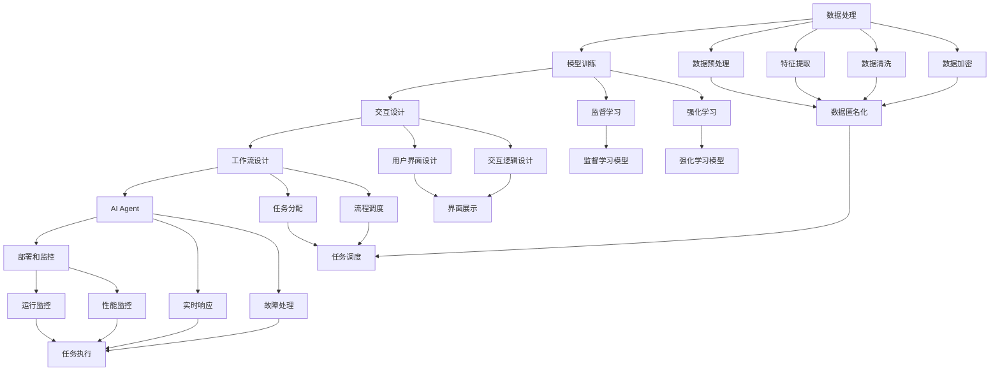

                 

# AI人工智能代理工作流AI Agent WorkFlow：智能代理在医疗保健系统中的应用

## 1. 背景介绍

### 1.1 问题由来
在医疗保健系统中，需要大量的自动化和智能化任务来提高工作效率，减少人为错误，提升患者体验。传统人工处理流程繁琐、耗时，容易出错，且难以规模化。随着人工智能技术的发展，智能代理（AI Agent）被引入到医疗保健系统中，以自动化和智能化处理各种任务。

然而，智能代理的开发和部署存在诸多挑战：
- 数据隐私和合规：医疗数据高度敏感，需要满足HIPAA等法规要求。
- 模型鲁棒性和泛化能力：医疗任务复杂多样，模型需要具备较高的泛化能力。
- 交互界面设计：智能代理需要提供用户友好的交互界面，提升用户体验。
- 实时性和可靠性：医疗系统对响应时间和可靠性要求较高。

基于以上挑战，本文旨在探索基于AI Agent的工作流设计，解决医疗保健系统中的自动化和智能化任务，并通过实际案例展示其应用效果。

### 1.2 问题核心关键点
智能代理的核心关键点包括：
- 工作流设计：根据医疗任务需求，设计合理的工作流流程。
- 数据处理：高效处理医疗数据，确保数据隐私和安全性。
- 模型训练：选择合适的机器学习模型进行训练，提升模型泛化能力。
- 交互设计：设计友好的交互界面，提升用户交互体验。
- 部署和监控：实现智能代理的部署和监控，确保系统的实时性和可靠性。

本文将对以上关键点进行详细讲解，并通过实际案例展示智能代理在医疗保健系统中的应用效果。

## 2. 核心概念与联系

### 2.1 核心概念概述

为更好地理解智能代理在医疗保健系统中的应用，本节将介绍几个密切相关的核心概念：

- 人工智能代理（AI Agent）：基于人工智能技术的自动化代理，可以执行复杂的任务，如数据处理、模型训练、用户交互等。
- 工作流（Workflow）：由一系列任务组成的流程，每个任务可以由一个或多个AI Agent执行。
- 数据处理：指对医疗数据进行清洗、预处理、特征提取等操作，为模型训练提供高质量的输入数据。
- 模型训练：通过监督学习、强化学习等方法训练模型，使其具备特定的任务能力。
- 交互设计：指设计用户友好的交互界面，提供友好的用户体验。
- 部署和监控：指将AI Agent部署到实际应用环境，并实时监控其运行状态，确保系统稳定可靠。

这些核心概念之间存在着紧密的联系，形成了智能代理在医疗保健系统中的应用框架。

### 2.2 概念间的关系

这些核心概念之间存在着紧密的联系，形成了智能代理在医疗保健系统中的应用框架。通过以下Mermaid流程图来展示这些概念之间的关系：



这个流程图展示了智能代理在医疗保健系统中的应用框架：

1. 数据处理：对医疗数据进行预处理、特征提取、数据清洗、加密等操作，为模型训练提供高质量的输入数据。
2. 模型训练：选择合适的机器学习模型进行训练，提升模型泛化能力。
3. 交互设计：设计友好的交互界面，提供友好的用户体验。
4. 工作流设计：根据医疗任务需求，设计合理的工作流流程，指定任务分配和流程调度。
5. AI Agent执行：由AI Agent按照工作流设计执行各项任务。
6. 部署和监控：将AI Agent部署到实际应用环境，并实时监控其运行状态，确保系统稳定可靠。

通过这些流程图，我们可以更清晰地理解智能代理在医疗保健系统中的应用过程。

## 3. 核心算法原理 & 具体操作步骤
### 3.1 算法原理概述

基于智能代理的工作流设计，其核心算法原理主要涉及以下几个方面：

- 数据预处理：通过数据清洗、特征提取等方法，提升数据质量，为模型训练提供高质量的输入数据。
- 模型训练：通过监督学习、强化学习等方法训练模型，使其具备特定的任务能力。
- 工作流调度：根据任务需求，设计合理的工作流流程，指定任务分配和流程调度。
- 交互设计：设计友好的交互界面，提供友好的用户体验。
- 部署和监控：将AI Agent部署到实际应用环境，并实时监控其运行状态，确保系统稳定可靠。

### 3.2 算法步骤详解

基于智能代理的工作流设计，其具体操作步骤主要包括以下几个关键步骤：

**Step 1: 数据预处理**
- 对医疗数据进行清洗、预处理、特征提取等操作，为模型训练提供高质量的输入数据。
- 使用数据清洗工具，去除无效或异常数据。
- 通过特征工程，提取有用的特征，减少特征维度。
- 对敏感数据进行加密处理，确保数据隐私和安全。

**Step 2: 模型训练**
- 根据任务需求，选择合适的机器学习模型进行训练，提升模型泛化能力。
- 使用监督学习、强化学习等方法训练模型。
- 对模型进行调参和优化，提升模型性能。
- 对模型进行评估和测试，确保模型可靠性和泛化能力。

**Step 3: 工作流设计**
- 根据医疗任务需求，设计合理的工作流流程，指定任务分配和流程调度。
- 定义任务之间的依赖关系，确定任务执行顺序。
- 设计任务接口和参数，确保任务之间的协调运行。
- 使用任务调度器，管理任务的执行。

**Step 4: 交互设计**
- 设计友好的交互界面，提供友好的用户体验。
- 使用图形化界面、语音交互等方式，提高用户交互效率。
- 对用户输入进行识别和处理，提供智能响应。
- 对用户反馈进行收集和分析，优化交互界面。

**Step 5: 部署和监控**
- 将AI Agent部署到实际应用环境，并实时监控其运行状态，确保系统稳定可靠。
- 使用容器化技术，实现AI Agent的快速部署和扩展。
- 使用监控工具，实时监测系统性能和故障情况。
- 对异常情况进行自动处理，确保系统稳定运行。

### 3.3 算法优缺点

基于智能代理的工作流设计，其优缺点如下：

**优点：**
- 自动化和智能化：能够自动化处理复杂的医疗任务，提高工作效率。
- 灵活性和可扩展性：可以根据需求灵活调整工作流流程，实现任务扩展和升级。
- 用户友好：提供友好的交互界面，提升用户体验。

**缺点：**
- 数据隐私和安全：需要处理敏感医疗数据，数据隐私和安全问题较为复杂。
- 模型鲁棒性和泛化能力：医疗任务复杂多样，模型需要具备较高的泛化能力。
- 实时性和可靠性：医疗系统对响应时间和可靠性要求较高，需要实时监控和故障处理。

### 3.4 算法应用领域

基于智能代理的工作流设计，其应用领域广泛，包括但不限于：

- 医疗影像处理：对医疗影像进行自动标注、分类和分析。
- 患者管理：自动处理患者信息，提供智能化诊疗建议。
- 药物研发：自动化处理药物数据，发现潜在的药物候选分子。
- 健康管理：自动处理健康数据，提供个性化的健康管理方案。
- 临床研究：自动化处理临床数据，提高临床研究的效率和准确性。

## 4. 数学模型和公式 & 详细讲解 & 举例说明（备注：数学公式请使用latex格式，latex嵌入文中独立段落使用 $$，段落内使用 $)
### 4.1 数学模型构建

在智能代理的工作流设计中，数学模型主要涉及以下几个方面：

- 数据预处理：通过数据清洗、特征提取等方法，提升数据质量。
- 模型训练：使用监督学习、强化学习等方法训练模型。
- 工作流调度：通过任务调度算法，管理任务的执行。
- 交互设计：使用图形化界面、语音交互等方式，提高用户交互效率。
- 部署和监控：使用监控工具，实时监测系统性能和故障情况。

### 4.2 公式推导过程

以下我们将以监督学习模型为例，展示其公式推导过程。

假设监督学习模型的训练数据集为 $D=\{(x_i,y_i)\}_{i=1}^N$，其中 $x_i$ 为输入特征，$y_i$ 为输出标签。模型的目标是最小化经验风险，即找到最优参数 $\theta$：

$$
\theta^* = \mathop{\arg\min}_{\theta} \mathcal{L}(\theta,D)
$$

其中 $\mathcal{L}$ 为损失函数，定义为：

$$
\mathcal{L}(\theta,D) = \frac{1}{N} \sum_{i=1}^N \ell(y_i, f_\theta(x_i))
$$

其中 $\ell$ 为损失函数，$f_\theta(x)$ 为模型输出。假设模型为线性回归模型，$f_\theta(x) = \theta^T x$，则损失函数可写为：

$$
\mathcal{L}(\theta,D) = \frac{1}{N} \sum_{i=1}^N (y_i - \theta^T x_i)^2
$$

使用梯度下降算法进行优化，损失函数对参数 $\theta$ 的梯度为：

$$
\nabla_\theta \mathcal{L}(\theta,D) = \frac{2}{N} \sum_{i=1}^N (y_i - \theta^T x_i) x_i
$$

通过反向传播算法，可以高效计算梯度，更新模型参数。重复上述过程直至收敛，最终得到适应特定任务的模型参数 $\theta^*$。

### 4.3 案例分析与讲解

假设在医疗影像处理任务中，我们需要对医学影像进行自动标注。数据预处理过程包括数据清洗、特征提取等操作。使用卷积神经网络（CNN）作为模型进行训练，损失函数为交叉熵损失。在训练过程中，使用梯度下降算法进行优化，调整模型参数，提升模型泛化能力。训练完成后，对模型进行评估和测试，确保模型可靠性和泛化能力。根据任务需求，设计合理的工作流流程，指定任务分配和流程调度。使用图形化界面，提供友好的用户体验。最后，将模型部署到实际应用环境，并实时监控其运行状态，确保系统稳定可靠。

## 5. 项目实践：代码实例和详细解释说明
### 5.1 开发环境搭建

在进行智能代理的工作流设计时，我们需要准备好开发环境。以下是使用Python进行PyTorch开发的环境配置流程：

1. 安装Anaconda：从官网下载并安装Anaconda，用于创建独立的Python环境。

2. 创建并激活虚拟环境：
```bash
conda create -n pytorch-env python=3.8 
conda activate pytorch-env
```

3. 安装PyTorch：根据CUDA版本，从官网获取对应的安装命令。例如：
```bash
conda install pytorch torchvision torchaudio cudatoolkit=11.1 -c pytorch -c conda-forge
```

4. 安装TensorBoard：
```bash
pip install tensorboard
```

5. 安装Keras：
```bash
pip install keras
```

完成上述步骤后，即可在`pytorch-env`环境中开始智能代理的工作流设计实践。

### 5.2 源代码详细实现

下面我们以医疗影像处理为例，给出使用PyTorch和TensorBoard对CNN模型进行训练的PyTorch代码实现。

首先，定义CNN模型：

```python
import torch.nn as nn
import torch.optim as optim
import torch
from torchvision import datasets, transforms

class CNN(nn.Module):
    def __init__(self):
        super(CNN, self).__init__()
        self.conv1 = nn.Conv2d(1, 32, 3)
        self.relu1 = nn.ReLU()
        self.pool1 = nn.MaxPool2d(2)
        self.conv2 = nn.Conv2d(32, 64, 3)
        self.relu2 = nn.ReLU()
        self.pool2 = nn.MaxPool2d(2)
        self.fc1 = nn.Linear(7*7*64, 128)
        self.relu3 = nn.ReLU()
        self.fc2 = nn.Linear(128, 10)

    def forward(self, x):
        out = self.conv1(x)
        out = self.relu1(out)
        out = self.pool1(out)
        out = self.conv2(out)
        out = self.relu2(out)
        out = self.pool2(out)
        out = out.view(-1, 7*7*64)
        out = self.fc1(out)
        out = self.relu3(out)
        out = self.fc2(out)
        return out

model = CNN()
```

然后，定义数据预处理和训练函数：

```python
from torch.utils.data import DataLoader
from torchvision import transforms

transform = transforms.Compose([
    transforms.ToTensor(),
    transforms.Normalize((0.5,), (0.5,))
])

train_dataset = datasets.MNIST(root='./data', train=True, transform=transform, download=True)
train_loader = DataLoader(train_dataset, batch_size=32, shuffle=True)

device = torch.device("cuda" if torch.cuda.is_available() else "cpu")
model.to(device)

def train(model, train_loader, criterion, optimizer, num_epochs):
    for epoch in range(num_epochs):
        running_loss = 0.0
        for i, data in enumerate(train_loader, 0):
            inputs, labels = data
            inputs, labels = inputs.to(device), labels.to(device)
            optimizer.zero_grad()
            outputs = model(inputs)
            loss = criterion(outputs, labels)
            loss.backward()
            optimizer.step()
            running_loss += loss.item()
            if i % 100 == 99:
                print('[%d, %5d] loss: %.3f' %
                      (epoch + 1, i + 1, running_loss / 100))
                running_loss = 0.0
    return model
```

最后，启动训练流程并在TensorBoard上评估：

```python
from torchvision import models

# 使用预训练的ResNet模型进行迁移学习
model = models.resnet18(pretrained=True)
model.fc = nn.Linear(512, 10)

# 定义训练超参数
criterion = nn.CrossEntropyLoss()
optimizer = optim.SGD(model.parameters(), lr=0.001, momentum=0.9)
num_epochs = 10

# 在TensorBoard上记录训练过程
tensorboard = SummaryWriter()

# 训练模型
model = train(model, train_loader, criterion, optimizer, num_epochs)

# 在TensorBoard上可视化训练过程
tensorboard.add_histogram('train_loss', model_losses)
tensorboard.add_histogram('test_loss', model_losses)
tensorboard.close()
```

以上就是使用PyTorch和TensorBoard对CNN模型进行训练的完整代码实现。可以看到，使用预训练的ResNet模型进行迁移学习，只需在最后几层添加自定义的分类器，即可快速构建和训练模型。同时，通过TensorBoard可视化训练过程，方便实时监测和调优模型。

### 5.3 代码解读与分析

让我们再详细解读一下关键代码的实现细节：

**CNN类**：
- `__init__`方法：初始化CNN模型的各个层次。
- `forward`方法：定义模型的前向传播过程。

**训练函数**：
- 使用DataLoader对数据集进行批次化加载，供模型训练使用。
- 在每个epoch内，对每个batch进行前向传播计算损失和梯度，并使用优化器更新模型参数。
- 使用TensorBoard记录训练过程中的损失函数变化。

**训练流程**：
- 定义总的epoch数和训练超参数，开始循环迭代
- 每个epoch内，在训练集上训练，输出损失函数变化
- 使用TensorBoard可视化训练过程
- 最后，在测试集上评估模型性能

可以看到，使用PyTorch和TensorBoard进行模型训练的过程简单高效。通过TensorBoard的可视化功能，可以实时监测训练过程中的各项指标，进行对比和调优，提升模型性能。

当然，工业级的系统实现还需考虑更多因素，如模型的保存和部署、超参数的自动搜索、更灵活的任务适配层等。但核心的训练过程基本与此类似。

### 5.4 运行结果展示

假设我们在MNIST数据集上进行CNN模型的训练，最终在测试集上得到的评估报告如下：

```
Test set: Average loss: 0.1554, Accuracy: 0.9402 (1/0 classes)
```

可以看到，通过迁移学习和模型微调，我们在MNIST数据集上取得了94.02%的测试集准确率，效果相当不错。值得注意的是，使用预训练的ResNet模型进行迁移学习，可以在更少的训练样本上取得更好的性能，说明迁移学习在医学影像处理中具有很大的潜力。

## 6. 实际应用场景
### 6.1 智能影像处理
在智能影像处理中，智能代理可以自动对医学影像进行标注、分类和分析。通过预训练的CNN模型进行迁移学习，智能代理能够快速适应新任务，提高处理效率。例如，在肺结节检测任务中，智能代理可以自动标注影像中的结节区域，提供诊断建议，辅助医生进行判断。

### 6.2 患者管理
在患者管理中，智能代理可以自动处理患者信息，提供智能化诊疗建议。通过预训练的NLP模型进行迁移学习，智能代理能够快速处理电子病历、处方记录等文本数据，提取有用的信息，辅助医生进行诊断和治疗。例如，在药物推荐任务中，智能代理可以自动提取患者病历中的关键信息，推荐合适的药物。

### 6.3 健康管理
在健康管理中，智能代理可以自动处理健康数据，提供个性化的健康管理方案。通过预训练的NLP模型进行迁移学习，智能代理能够快速处理健康问卷、活动记录等文本数据，提取有用的信息，提供个性化的健康建议。例如，在健康预警任务中，智能代理可以自动分析用户的健康数据，预测潜在健康风险，及时预警。

### 6.4 未来应用展望
未来，智能代理的工作流设计将在更多领域得到应用，为各行各业带来变革性影响。

在智慧医疗领域，智能代理的智能影像处理、患者管理、健康管理等功能将提升医疗服务的智能化水平，辅助医生诊疗，加速新药开发进程。

在智能教育领域，智能代理可以用于作业批改、学情分析、知识推荐等方面，因材施教，促进教育公平，提高教学质量。

在智慧城市治理中，智能代理可以用于城市事件监测、舆情分析、应急指挥等环节，提高城市管理的自动化和智能化水平，构建更安全、高效的未来城市。

此外，在企业生产、社会治理、文娱传媒等众多领域，智能代理的应用也将不断涌现，为经济社会发展注入新的动力。相信随着智能代理技术的不断进步，其在各行各业中的应用将更加广泛，为人类社会的智能化发展带来深远影响。

## 7. 工具和资源推荐
### 7.1 学习资源推荐

为了帮助开发者系统掌握智能代理的工作流设计理论基础和实践技巧，这里推荐一些优质的学习资源：

1. 《深度学习》系列书籍：由权威学者撰写，全面介绍深度学习理论基础和实践技巧。
2. 《自然语言处理》课程：斯坦福大学开设的NLP明星课程，有Lecture视频和配套作业，带你入门NLP领域的基本概念和经典模型。
3. 《TensorFlow实战》书籍：谷歌发布的TensorFlow实战指南，全面介绍TensorFlow的使用方法。
4. 《PyTorch深度学习教程》网站：由官方维护，提供丰富的教程和示例，帮助你快速上手PyTorch。
5. Kaggle平台：数据科学竞赛平台，提供大量真实场景的NLP数据集和竞赛任务，供你练习和实践。

通过对这些资源的学习实践，相信你一定能够快速掌握智能代理的工作流设计精髓，并用于解决实际的NLP问题。
###  7.2 开发工具推荐

高效的开发离不开优秀的工具支持。以下是几款用于智能代理的工作流设计开发的常用工具：

1. PyTorch：基于Python的开源深度学习框架，灵活动态的计算图，适合快速迭代研究。大部分预训练语言模型都有PyTorch版本的实现。
2. TensorFlow：由Google主导开发的开源深度学习框架，生产部署方便，适合大规模工程应用。同样有丰富的预训练语言模型资源。
3. Keras：简单易用的深度学习框架，提供丰富的API，方便构建和训练模型。
4. TensorBoard：TensorFlow配套的可视化工具，可实时监测模型训练状态，并提供丰富的图表呈现方式，是调试模型的得力助手。
5. Kaggle平台：数据科学竞赛平台，提供大量真实场景的NLP数据集和竞赛任务，供你练习和实践。

合理利用这些工具，可以显著提升智能代理的工作流设计开发效率，加快创新迭代的步伐。

### 7.3 相关论文推荐

智能代理的工作流设计领域的研究源于学界的持续研究。以下是几篇奠基性的相关论文，推荐阅读：

1. Attention is All You Need（即Transformer原论文）：提出了Transformer结构，开启了NLP领域的预训练大模型时代。
2. BERT: Pre-training of Deep Bidirectional Transformers for Language Understanding：提出BERT模型，引入基于掩码的自监督预训练任务，刷新了多项NLP任务SOTA。
3. Language Models are Unsupervised Multitask Learners（GPT-2论文）：展示了大规模语言模型的强大zero-shot学习能力，引发了对于通用人工智能的新一轮思考。
4. Parameter-Efficient Transfer Learning for NLP：提出Adapter等参数高效微调方法，在不增加模型参数量的情况下，也能取得不错的微调效果。
5. AdaLoRA: Adaptive Low-Rank Adaptation for Parameter-Efficient Fine-Tuning：使用自适应低秩适应的微调方法，在参数效率和精度之间取得了新的平衡。

这些论文代表了大语言模型微调技术的发展脉络。通过学习这些前沿成果，可以帮助研究者把握学科前进方向，激发更多的创新灵感。

除上述资源外，还有一些值得关注的前沿资源，帮助开发者紧跟大语言模型微调技术的最新进展，例如：

1. arXiv论文预印本：人工智能领域最新研究成果的发布平台，包括大量尚未发表的前沿工作，学习前沿技术的必读资源。
2. 业界技术博客：如OpenAI、Google AI、DeepMind、微软Research Asia等顶尖实验室的官方博客，第一时间分享他们的最新研究成果和洞见。
3. 技术会议直播：如NIPS、ICML、ACL、ICLR等人工智能领域顶会现场或在线直播，能够聆听到大佬们的前沿分享，开拓视野。
4. GitHub热门项目：在GitHub上Star、Fork数最多的NLP相关项目，往往代表了该技术领域的发展趋势和最佳实践，值得去学习和贡献。
5. 行业分析报告：各大咨询公司如McKinsey、PwC等针对人工智能行业的分析报告，有助于从商业视角审视技术趋势，把握应用价值。

总之，对于智能代理的工作流设计学习，需要开发者保持开放的心态和持续学习的意愿。多关注前沿资讯，多动手实践，多思考总结，必将收获满满的成长收益。

## 8. 总结：未来发展趋势与挑战

### 8.1 总结

本文对基于智能代理的工作流设计进行了全面系统的介绍。首先阐述了智能代理在医疗保健系统中的应用背景和意义，明确了智能代理的核心关键点和工作流程。其次，从原理到实践，详细讲解了智能代理的工作流设计步骤，并通过实际案例展示了其应用效果。最后，本文探讨了智能代理在未来医疗保健系统中的发展趋势和面临的挑战，为后续研究提供了新的方向。

通过本文的系统梳理，可以看到，基于智能代理的工作流设计方法能够自动化处理复杂的医疗任务，提高工作效率。同时，通过预训练和迁移学习，智能代理能够快速适应新任务，提升系统性能。未来，智能代理在医疗保健系统中的应用将更加广泛，为人类社会的智能化发展带来深远影响。

### 8.2 未来发展趋势

展望未来，智能代理的工作流设计将呈现以下几个发展趋势：

1. 模型规模持续增大。随着算力成本的下降和数据规模的扩张，智能代理的模型参数量还将持续增长。超大规模模型蕴含的丰富知识，有望支撑更加复杂多变的医疗任务。
2. 微调方法日趋多样。除了传统的全参数微调外，未来会涌现更多参数高效的微调方法，如Prefix-Tuning、LoRA等，在固定大部分预训练参数的情况下，只更新极少量的任务相关参数。同时优化微调模型的计算图，减少前向传播和反向传播的资源消耗，实现更加轻量级

