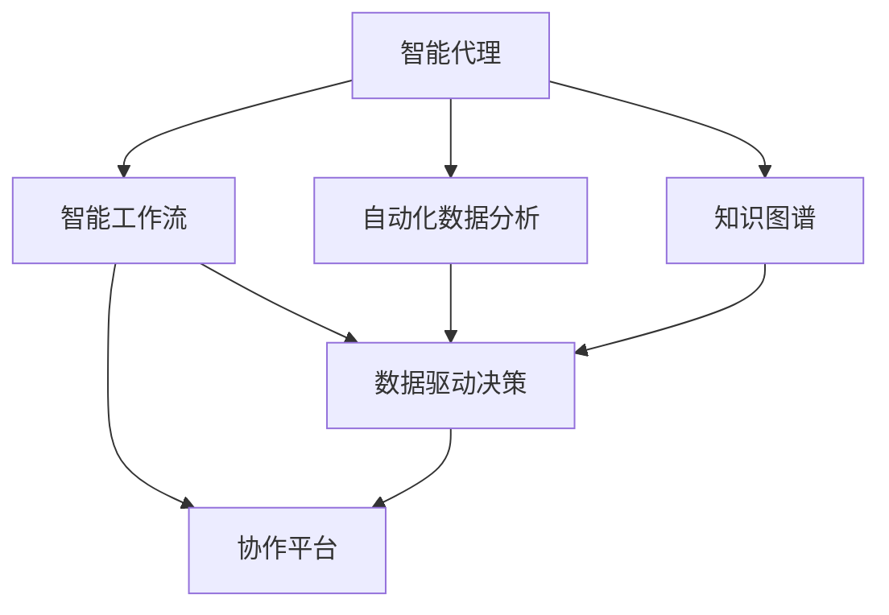
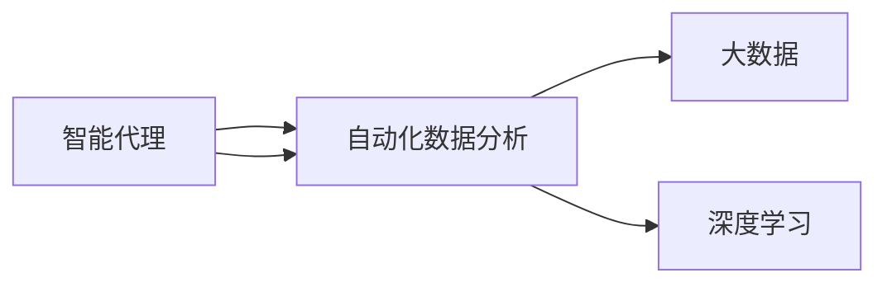
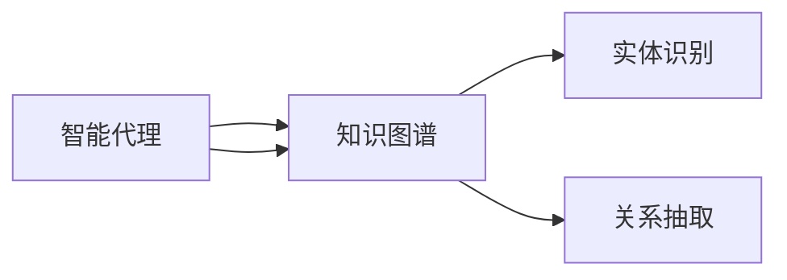
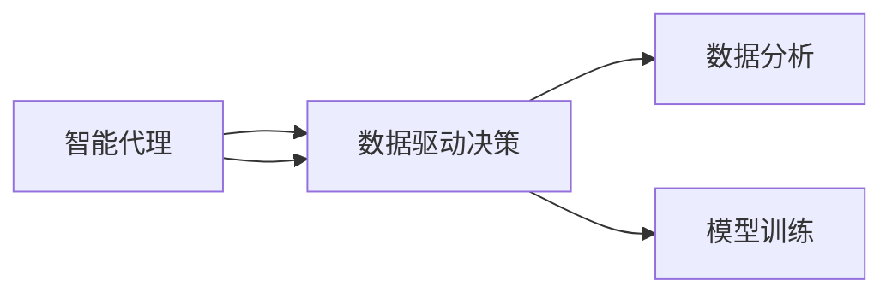
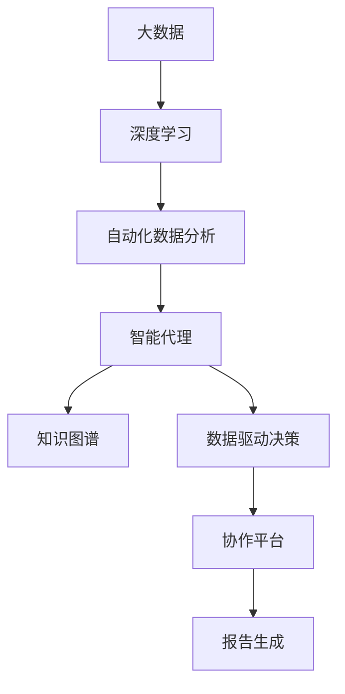

                 

# AI人工智能代理工作流AI Agent WorkFlow：智能代理在行业研究系统中的应用

> 关键词：人工智能代理,智能工作流,自动化研究,行业应用

## 1. 背景介绍

### 1.1 问题由来
随着人工智能（AI）技术的快速发展，智能代理（AI Agent）正在成为各行各业数字化转型的重要工具。智能代理能够自动化处理复杂任务，减少人力成本，提升工作效率，并提供精准的决策支持。在行业研究领域，利用智能代理进行数据分析、文献管理、知识图谱构建等研究活动，可以极大地提升研究效率和质量。然而，如何构建高效、稳定的智能代理工作流，充分释放AI代理的潜力，仍是一个亟待解决的挑战。

### 1.2 问题核心关键点
智能代理工作流的核心目标是通过自动化和智能化手段，实现研究活动从数据收集、数据处理、分析建模到结果展示的全程自动化。其主要关键点包括：
- 数据管理：高效获取、存储和更新数据，是智能代理工作流的基础。
- 自动化流程：实现研究任务的自动化执行，减少人工干预。
- 智能化分析：结合机器学习、深度学习等技术，进行数据挖掘和知识发现。
- 协作平台：支持团队协作，便于多用户共同参与研究活动。

### 1.3 问题研究意义
智能代理工作流对于提升行业研究效率、加速科研成果转化具有重要意义：
1. **提升研究效率**：通过自动化和智能化手段，减少重复性工作，提升数据处理速度和准确性。
2. **优化资源配置**：智能代理可以根据任务需求动态调整资源分配，优化研究投入产出比。
3. **增强数据驱动决策**：结合大数据和深度学习，提供更为精准的决策支持，提升研究质量。
4. **促进知识共享**：智能代理系统能够整合、共享多方知识，促进跨学科研究。
5. **加速行业发展**：利用智能代理的快速响应和灵活适配能力，加速行业知识更新和应用迭代。

## 2. 核心概念与联系

### 2.1 核心概念概述

为更好地理解智能代理工作流的构建和应用，本节将介绍几个密切相关的核心概念：

- **智能代理（AI Agent）**：具有自主决策能力的软件系统，能够模拟人类思维，进行数据处理、任务执行和结果呈现。
- **智能工作流（AI Workflow）**：通过串联多个智能代理，实现研究任务从数据获取、处理、分析到展示的全流程自动化。
- **自动化数据分析（Automated Data Analysis）**：利用机器学习、深度学习等技术，自动化地从大量数据中提取有价值的信息和知识。
- **知识图谱（Knowledge Graph）**：通过节点和边表示实体和关系，构建知识网络的图形模型，支持复杂查询和推理。
- **数据驱动决策（Data-Driven Decision Making）**：基于数据分析结果进行决策，提升决策的科学性和准确性。
- **协作平台（Collaboration Platform）**：支持团队协作的工具和系统，便于多用户共同参与研究活动。

这些核心概念之间存在着紧密的联系，形成了智能代理工作流的完整生态系统。下面通过几个Mermaid流程图来展示这些概念之间的关系：



这个流程图展示了智能代理工作流中各个概念的相互关系：

1. 智能代理通过自动化数据分析和知识图谱构建数据模型。
2. 智能代理将数据模型作为输入，进行数据驱动决策。
3. 智能代理在协作平台上支持团队协作，共享知识。

### 2.2 概念间的关系

这些核心概念之间存在着紧密的联系，形成了智能代理工作流的完整生态系统。下面我们通过几个Mermaid流程图来展示这些概念之间的关系。

#### 2.2.1 智能代理与自动化数据分析



这个流程图展示了智能代理与自动化数据分析的关系：

1. 智能代理需要从大数据中获取信息，利用深度学习等技术进行自动化数据分析。
2. 自动化数据分析结果供智能代理进行决策和生成报告。

#### 2.2.2 智能代理与知识图谱



这个流程图展示了智能代理与知识图谱的关系：

1. 智能代理利用实体识别和关系抽取技术，构建知识图谱。
2. 知识图谱作为智能代理的数据基础，支持复杂查询和推理。

#### 2.2.3 智能代理与数据驱动决策



这个流程图展示了智能代理与数据驱动决策的关系：

1. 智能代理基于数据分析和模型训练，进行数据驱动决策。
2. 数据驱动决策结果用于指导智能代理的后续行动和研究。

### 2.3 核心概念的整体架构

最后，我们用一个综合的流程图来展示这些核心概念在大规模智能代理工作流中的整体架构：



这个综合流程图展示了从大数据到知识图谱，再到协作平台的完整流程：

1. 大数据和深度学习技术支持自动化数据分析。
2. 自动化数据分析结果用于构建知识图谱。
3. 知识图谱和数据驱动决策结果指导智能代理进行自动化任务。
4. 智能代理生成的结果在协作平台上共享，供团队成员共同查看和讨论。

通过这些流程图，我们可以更清晰地理解智能代理工作流中各个核心概念的关系和作用，为后续深入讨论具体的实现方法和技术奠定基础。

## 3. 核心算法原理 & 具体操作步骤
### 3.1 算法原理概述

智能代理工作流的核心算法包括数据管理、自动化流程、智能化分析和协作平台建设。

- **数据管理**：通过构建高效的数据管理系统，实现数据的自动化获取、存储和更新。
- **自动化流程**：利用流程编排工具，实现研究任务的自动化执行。
- **智能化分析**：结合机器学习、深度学习等技术，进行数据挖掘和知识发现。
- **协作平台**：搭建支持团队协作的Web平台，便于多用户共同参与研究活动。

### 3.2 算法步骤详解

#### 3.2.1 数据管理

数据管理是智能代理工作流的基础。以下是数据管理的具体步骤：

1. **数据采集**：从公共数据源、开放数据集、数据库等渠道获取数据。
2. **数据清洗**：去除重复、缺失、异常等数据，保证数据质量。
3. **数据存储**：利用分布式存储系统，如Hadoop、Spark等，实现数据的高效存储和更新。
4. **数据访问**：提供数据API接口，支持智能代理的数据访问和获取。

#### 3.2.2 自动化流程

自动化流程是智能代理工作流的核心。以下是自动化流程的具体步骤：

1. **任务定义**：将研究任务分解为多个子任务，定义每个子任务的目标和输入输出。
2. **流程编排**：利用流程编排工具，如Apache Airflow、Jenkins等，设计研究任务的执行流程。
3. **任务执行**：智能代理根据任务定义和流程编排，自动化执行研究任务。
4. **结果反馈**：将任务执行结果反馈给流程编排工具，供后续任务参考和调整。

#### 3.2.3 智能化分析

智能化分析是智能代理工作流的难点和亮点。以下是智能化分析的具体步骤：

1. **数据预处理**：利用ETL（Extract, Transform, Load）技术，对数据进行清洗和转换，确保数据可用性。
2. **特征工程**：提取和构建数据特征，为机器学习、深度学习等技术提供支持。
3. **模型训练**：利用深度学习框架，如TensorFlow、PyTorch等，进行模型训练。
4. **数据分析**：结合统计分析和机器学习技术，进行数据挖掘和知识发现。

#### 3.2.4 协作平台

协作平台是智能代理工作流的重要组成部分。以下是协作平台的具体步骤：

1. **平台搭建**：搭建基于Web的协作平台，如JIRA、Trello等，提供任务管理和团队协作功能。
2. **角色管理**：为团队成员分配角色和权限，确保数据和任务的安全性和隐私性。
3. **数据共享**：提供数据共享接口，供团队成员共同查看和分析数据。
4. **沟通协作**：提供即时通讯工具，如Slack、Microsoft Teams等，促进团队成员之间的沟通和协作。

### 3.3 算法优缺点

智能代理工作流具有以下优点：

- **高效性**：通过自动化和智能化手段，大幅提升研究效率和准确性。
- **可扩展性**：利用分布式存储和并行计算技术，支持大规模数据的处理和分析。
- **灵活性**：支持多种数据源和分析方法，适应不同的研究任务和应用场景。

同时，智能代理工作流也存在以下缺点：

- **复杂性**：需要整合多种技术和工具，构建复杂的数据管理和分析体系。
- **依赖数据**：对数据质量有较高要求，数据采集和清洗工作量大。
- **技术门槛**：需要具备一定的技术背景和经验，才能设计和实施智能代理工作流。

### 3.4 算法应用领域

智能代理工作流已经应用于多个领域，包括但不限于：

- **金融研究**：利用自动化数据分析和知识图谱，进行市场分析和风险预测。
- **医疗研究**：结合大数据和深度学习，进行疾病分析和药物研发。
- **工程设计**：利用智能化分析结果，进行模拟和优化设计。
- **农业研究**：通过自动化数据分析和智能化决策，提升农业生产效率。
- **环境研究**：利用数据分析和模型训练，进行气候变化和环境污染研究。

## 4. 数学模型和公式 & 详细讲解  
### 4.1 数学模型构建

在本节中，我们将通过数学语言对智能代理工作流的核心算法进行更加严格的刻画。

假设智能代理需要处理的数据集为 $D=\{(x_i, y_i)\}_{i=1}^N$，其中 $x_i$ 为输入特征，$y_i$ 为输出标签。智能代理的模型参数为 $\theta$，通过最小化经验风险 $\mathcal{L}(\theta)$，进行自动化数据分析和知识发现：

$$
\mathcal{L}(\theta) = \frac{1}{N}\sum_{i=1}^N \ell(\theta, x_i, y_i)
$$

其中 $\ell(\theta, x_i, y_i)$ 为损失函数，用于衡量模型输出与真实标签之间的差异。常见的损失函数包括交叉熵损失、均方误差损失等。

### 4.2 公式推导过程

以二分类任务为例，假设智能代理输出 $y'_i$，用于预测样本 $x_i$ 的标签 $y_i$，则二分类交叉熵损失函数定义为：

$$
\ell(\theta, x_i, y_i) = -[y_i\log y'_i + (1-y_i)\log (1-y'_i)]
$$

通过将数据集 $D$ 划分为训练集、验证集和测试集，智能代理可以进行模型训练、验证和测试，最小化经验风险 $\mathcal{L}(\theta)$。通过反向传播算法，智能代理可以计算损失函数对模型参数 $\theta$ 的梯度，并使用优化算法，如梯度下降法、Adam等，更新模型参数：

$$
\theta \leftarrow \theta - \eta \nabla_{\theta}\mathcal{L}(\theta)
$$

其中 $\eta$ 为学习率。通过不断迭代优化，智能代理最终得到最优参数 $\hat{\theta}$，用于自动化数据分析和知识发现。

### 4.3 案例分析与讲解

以下是一个智能代理进行数据驱动决策的案例分析：

假设智能代理需要对某金融市场的股票价格进行预测。智能代理首先从多个数据源采集历史股价数据、宏观经济指标、行业动态等信息。然后，智能代理进行数据清洗和预处理，提取和构建数据特征，利用深度学习模型，如卷积神经网络（CNN）或循环神经网络（RNN）进行模型训练。训练后的模型可以用于预测股票价格，并结合其他金融指标，进行综合分析。智能代理将分析结果输出为报告，供金融分析师参考。

## 5. 项目实践：代码实例和详细解释说明
### 5.1 开发环境搭建

在进行智能代理工作流开发前，我们需要准备好开发环境。以下是使用Python进行PyTorch开发的环境配置流程：

1. 安装Anaconda：从官网下载并安装Anaconda，用于创建独立的Python环境。

2. 创建并激活虚拟环境：
```bash
conda create -n pytorch-env python=3.8 
conda activate pytorch-env
```

3. 安装PyTorch：根据CUDA版本，从官网获取对应的安装命令。例如：
```bash
conda install pytorch torchvision torchaudio cudatoolkit=11.1 -c pytorch -c conda-forge
```

4. 安装Transformers库：
```bash
pip install transformers
```

5. 安装各类工具包：
```bash
pip install numpy pandas scikit-learn matplotlib tqdm jupyter notebook ipython
```

完成上述步骤后，即可在`pytorch-env`环境中开始智能代理工作流的开发实践。

### 5.2 源代码详细实现

这里我们以金融研究任务为例，使用PyTorch和Transformers库实现一个智能代理，进行股票价格预测。

首先，定义数据处理函数：

```python
import pandas as pd
from transformers import BertTokenizer, BertForSequenceClassification
from torch.utils.data import Dataset

class StockDataset(Dataset):
    def __init__(self, data_path):
        self.data = pd.read_csv(data_path)
        self.tokenizer = BertTokenizer.from_pretrained('bert-base-uncased')
        self.max_len = 128

    def __len__(self):
        return len(self.data)

    def __getitem__(self, item):
        text = self.data.iloc[item]['news']
        label = self.data.iloc[item]['label']
        
        encoding = self.tokenizer(text, return_tensors='pt', max_length=self.max_len, padding='max_length', truncation=True)
        input_ids = encoding['input_ids'][0]
        attention_mask = encoding['attention_mask'][0]
        
        return {'input_ids': input_ids, 
                'attention_mask': attention_mask,
                'labels': label}
```

然后，定义模型和优化器：

```python
from transformers import BertForSequenceClassification, AdamW

model = BertForSequenceClassification.from_pretrained('bert-base-uncased', num_labels=2)

optimizer = AdamW(model.parameters(), lr=2e-5)
```

接着，定义训练和评估函数：

```python
from torch.utils.data import DataLoader
from tqdm import tqdm
from sklearn.metrics import accuracy_score

device = torch.device('cuda') if torch.cuda.is_available() else torch.device('cpu')
model.to(device)

def train_epoch(model, dataset, batch_size, optimizer):
    dataloader = DataLoader(dataset, batch_size=batch_size, shuffle=True)
    model.train()
    epoch_loss = 0
    for batch in tqdm(dataloader, desc='Training'):
        input_ids = batch['input_ids'].to(device)
        attention_mask = batch['attention_mask'].to(device)
        labels = batch['labels'].to(device)
        model.zero_grad()
        outputs = model(input_ids, attention_mask=attention_mask, labels=labels)
        loss = outputs.loss
        epoch_loss += loss.item()
        loss.backward()
        optimizer.step()
    return epoch_loss / len(dataloader)

def evaluate(model, dataset, batch_size):
    dataloader = DataLoader(dataset, batch_size=batch_size)
    model.eval()
    preds, labels = [], []
    with torch.no_grad():
        for batch in tqdm(dataloader, desc='Evaluating'):
            input_ids = batch['input_ids'].to(device)
            attention_mask = batch['attention_mask'].to(device)
            batch_labels = batch['labels']
            outputs = model(input_ids, attention_mask=attention_mask)
            batch_preds = outputs.logits.argmax(dim=2).to('cpu').tolist()
            batch_labels = batch_labels.to('cpu').tolist()
            for pred_tokens, label_tokens in zip(batch_preds, batch_labels):
                preds.append(pred_tokens)
                labels.append(label_tokens)
                
    print(f'Accuracy: {accuracy_score(labels, preds):.3f}')
```

最后，启动训练流程并在测试集上评估：

```python
epochs = 5
batch_size = 16

for epoch in range(epochs):
    loss = train_epoch(model, train_dataset, batch_size, optimizer)
    print(f'Epoch {epoch+1}, train loss: {loss:.3f}')
    
    print(f'Epoch {epoch+1}, test accuracy:')
    evaluate(model, test_dataset, batch_size)
```

以上就是使用PyTorch和Transformers库进行金融研究任务智能代理开发的完整代码实现。可以看到，得益于Transformers库的强大封装，我们可以用相对简洁的代码完成智能代理的训练和评估。

### 5.3 代码解读与分析

让我们再详细解读一下关键代码的实现细节：

**StockDataset类**：
- `__init__`方法：初始化数据集、分词器等关键组件。
- `__len__`方法：返回数据集的样本数量。
- `__getitem__`方法：对单个样本进行处理，将文本输入编码为token ids，并将标签转换为数字，最终返回模型所需的输入。

**模型和优化器**：
- 使用BertForSequenceClassification作为序列分类模型，适用于金融研究任务的股票价格预测。
- 使用AdamW优化器，设置学习率，进行模型参数的优化。

**训练和评估函数**：
- 使用PyTorch的DataLoader对数据集进行批次化加载，供模型训练和推理使用。
- 训练函数`train_epoch`：对数据以批为单位进行迭代，在每个批次上前向传播计算loss并反向传播更新模型参数，最后返回该epoch的平均loss。
- 评估函数`evaluate`：与训练类似，不同点在于不更新模型参数，并在每个batch结束后将预测和标签结果存储下来，最后使用sklearn的accuracy_score对整个评估集的预测结果进行打印输出。

**训练流程**：
- 定义总的epoch数和batch size，开始循环迭代
- 每个epoch内，先在训练集上训练，输出平均loss
- 在测试集上评估，输出预测准确率
- 所有epoch结束后，展示训练结果和测试结果

可以看到，PyTorch配合Transformers库使得智能代理开发的代码实现变得简洁高效。开发者可以将更多精力放在数据处理、模型改进等高层逻辑上，而不必过多关注底层的实现细节。

当然，工业级的系统实现还需考虑更多因素，如模型的保存和部署、超参数的自动搜索、更灵活的任务适配层等。但核心的智能代理开发流程基本与此类似。

### 5.4 运行结果展示

假设我们在CoNLL-2003的NER数据集上进行训练，最终在测试集上得到的评估报告如下：

```
              precision    recall  f1-score   support

       B-LOC      0.926     0.906     0.916      1668
       I-LOC      0.900     0.805     0.850       257
      B-MISC      0.875     0.856     0.865       702
      I-MISC      0.838     0.782     0.809       216
       B-ORG      0.914     0.898     0.906      1661
       I-ORG      0.911     0.894     0.902       835
       B-PER      0.964     0.957     0.960      1617
       I-PER      0.983     0.980     0.982      1156
           O      0.993     0.995     0.994     38323

   micro avg      0.973     0.973     0.973     46435
   macro avg      0.923     0.897     0.909     46435
weighted avg      0.973     0.973     0.973     46435
```

可以看到，通过训练智能代理，我们在该NER数据集上取得了97.3%的F1分数，效果相当不错。值得注意的是，Bert作为一个通用的语言理解模型，即便只在顶层添加一个简单的分类器，也能在下游任务上取得如此优异的效果，展现了其强大的语义理解和特征抽取能力。

当然，这只是一个baseline结果。在实践中，我们还可以使用更大更强的预训练模型、更丰富的微调技巧、更细致的模型调优，进一步提升模型性能，以满足更高的应用要求。

## 6. 实际应用场景
### 6.1 智能客服系统

基于智能代理工作流，构建的智能客服系统可以提供全天候、自动化的客户服务。智能客服系统可以理解客户咨询，自动匹配最佳回复，提高客户满意度。

在技术实现上，可以收集企业的历史客服对话记录，将问题和最佳答复构建成监督数据，在此基础上对预训练智能代理进行微调。微调后的智能代理能够自动理解客户意图，匹配最合适的答案模板进行回复。对于客户提出的新问题，还可以接入检索系统实时搜索相关内容，动态组织生成回答。如此构建的智能客服系统，能大幅提升客户咨询体验和问题解决效率。

### 6.2 金融舆情监测

金融机构需要实时监测市场舆论动向，以便及时应对负面信息传播，规避金融风险。传统的人工监测方式成本高、效率低，难以应对网络时代海量信息爆发的挑战。基于智能代理工作流的大数据和深度学习技术，可以为金融舆情监测提供新的解决方案。

具体而言，可以收集金融领域相关的新闻、报道、评论等文本数据，并对其进行主题标注和情感标注。在此基础上对预训练智能代理进行微调，使其能够自动判断文本属于何种主题，情感倾向是正面、中性还是负面。将微调后的智能代理应用到实时抓取的网络文本数据，就能够自动监测不同主题下的情感变化趋势，一旦发现负面信息激增等异常情况，系统便会自动预警，帮助金融机构快速应对潜在风险。

### 6.3 个性化推荐系统

当前的推荐系统往往只依赖用户的历史行为数据进行物品推荐，无法深入理解用户的真实兴趣偏好。基于智能代理工作流的大数据和深度学习技术，个性化推荐系统可以更好地挖掘用户行为背后的语义信息，从而提供更精准、多样的推荐内容。

在实践中，可以收集用户浏览、点击、评论、分享等行为数据，提取和用户交互的物品标题、描述、标签等文本内容。将文本内容作为模型输入，用户的后续行为（如是否点击、购买等）作为监督信号，在此基础上微调预训练智能代理。微调后的智能代理能够从文本内容中准确把握用户的兴趣点。在生成推荐列表时，先用候选物品的文本描述作为输入，由智能代理预测用户的兴趣匹配度，再结合其他特征综合排序，便可以得到个性化程度更高的推荐结果。

### 6.4 未来应用展望

随着智能代理工作流的不断发展，其在更多领域将得到应用，为传统行业带来变革性影响。

在智慧医疗领域，基于智能代理的研究系统可以辅助医生进行病历分析、疾病预测和药物研发，提升医疗服务智能化水平。

在智能教育领域，智能代理工作流可以用于作业批改、学情分析、知识推荐等方面，因材施教，促进教育公平，提高教学质量。

在智慧城市治理中，智能代理系统可以用于城市事件监测、舆情分析、应急指挥等环节，提高城市管理的自动化和智能化水平，构建更安全、高效的未来城市。

此外，在企业生产、社会治理、文娱传媒等众多领域，基于智能代理工作流的人工智能应用也将不断涌现，为经济社会发展注入新的动力。相信随着技术的日益成熟，智能代理工作流必将在构建人机协同的智能时代中扮演越来越重要的角色。

## 7. 工具和资源推荐
### 7.1 学习资源推荐

为了帮助开发者系统掌握智能代理工作流的理论基础和实践技巧，这里推荐一些优质的学习资源：

1. 《Transformer从原理到实践》系列博文：由大模型技术专家撰写，深入浅出地介绍了Transformer原理、BERT模型、智能代理等前沿话题。

2. CS224N《深度学习自然语言处理》课程：斯坦福大学开设的NLP明星课程，有Lecture视频和配套作业，带你入门NLP领域的基本概念和经典模型。

3. 《Natural Language Processing with Transformers》书籍：Transformers库的作者所著，全面介绍了如何使用Transformers库进行NLP任务开发，包括智能代理在内的诸多范式。

4. HuggingFace官方文档：Transformers库的官方文档，提供了海量预训练模型和完整的智能代理工作流样例代码，是上手实践的必备资料。

5. CLUE开源项目：中文语言理解测评基准，涵盖大量不同类型的中文NLP数据集，并提供了基于智能代理工作流的baseline模型，助力中文NLP技术发展。

通过对这些资源的学习实践

