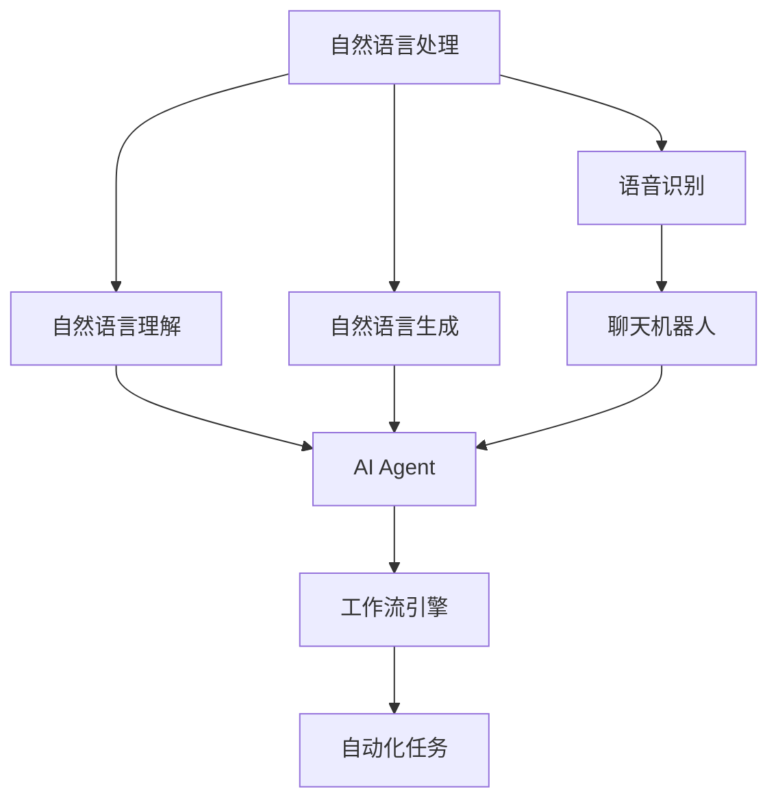
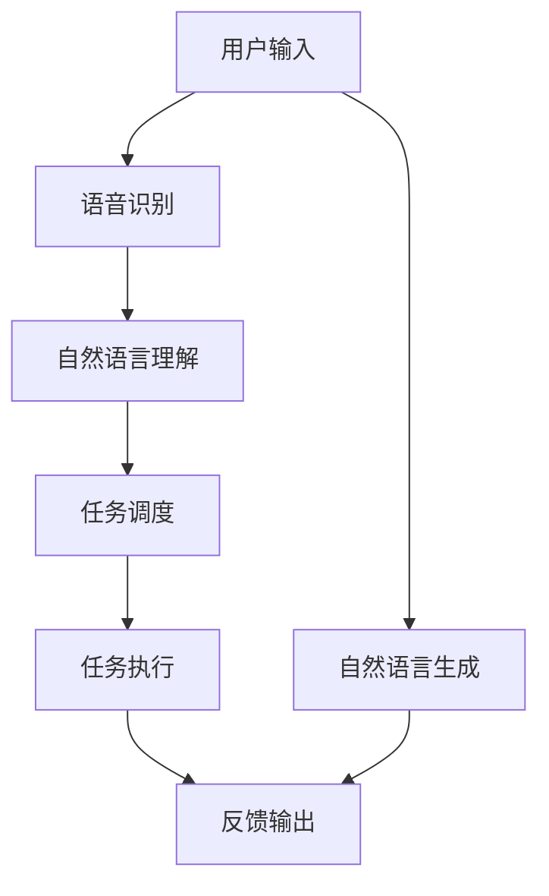
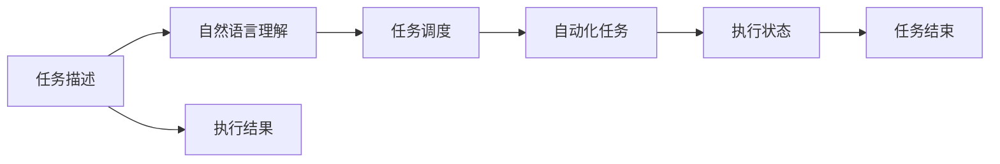
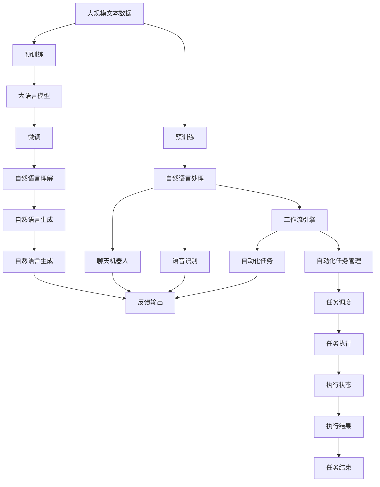

                 

# AI人工智能代理工作流AI Agent WorkFlow：自然语言处理在工作流中的应用

> 关键词：AI代理工作流,自然语言处理(NLP),语音识别(ASR),聊天机器人,工作流引擎,自动化,机器人流程自动化(RPA)

## 1. 背景介绍

### 1.1 问题由来
随着人工智能技术的不断进步，自动化流程在各行各业中的应用越来越广泛。其中，人工智能代理（AI Agent）以其高效率、低成本的优势，被广泛应用于自动化工作流中。AI Agent能够自动执行各种重复性、规则性的任务，显著提升了企业的生产效率和运营质量。

然而，由于AI Agent的设计和部署通常需要大量的编码工作，而且需要处理复杂的业务逻辑和规则，这使得非技术人员难以快速构建和部署AI Agent。另外，AI Agent的设计和优化也存在一定难度，需要具备较高的技术背景和经验。

自然语言处理（NLP）技术近年来得到了长足发展，越来越多的企业和组织开始尝试利用NLP技术来简化AI Agent的工作流程，提高其智能化程度。特别是在自然语言理解和生成领域，NLP技术已经能够自动处理大量文本数据，使得AI Agent能够更快速、更准确地理解和执行复杂的业务逻辑。

### 1.2 问题核心关键点
为了进一步提升AI Agent的工作效率和智能化程度，本文聚焦于自然语言处理在工作流中的应用。通过整合NLP技术，AI Agent能够更好地理解和执行用户输入的自然语言指令，自动处理各种复杂的业务逻辑，从而实现更高效、更智能的自动化工作流。

具体来说，本文将探讨以下关键问题：

1. **NLP技术在AI Agent中的应用**：如何利用NLP技术，使AI Agent能够自动理解和处理自然语言输入。
2. **工作流引擎的集成**：如何将NLP技术与工作流引擎进行深度集成，实现自动化任务的自动调度和管理。
3. **AI Agent的智能化演进**：如何通过不断优化NLP模型，提高AI Agent的智能化程度和适应性。
4. **实际应用案例**：分析NLP技术在实际应用中的表现，展示其在自动化工作流中的具体应用。

## 2. 核心概念与联系

### 2.1 核心概念概述

为了更好地理解自然语言处理在工作流中的应用，本节将介绍几个密切相关的核心概念：

- **自然语言处理（NLP）**：涉及自然语言理解、自然语言生成、语音识别、机器翻译等多个子领域。通过NLP技术，机器可以理解和生成人类语言，从而实现人机交互和自动化任务。

- **AI Agent**：一种智能软件系统，能够在自动化的环境中执行各种复杂任务。通过NLP技术，AI Agent可以理解和执行自然语言指令，提高其智能化程度和适应性。

- **工作流引擎**：一种软件工具，用于管理和调度自动化任务，实现任务的自动化执行和管理。通过NLP技术，工作流引擎可以自动理解自然语言指令，并将其转化为具体的任务执行步骤。

- **语音识别（ASR）**：将人类语音转换为文本的技术。通过ASR技术，AI Agent可以自动获取用户输入的自然语言指令，从而实现语音驱动的自动化工作流。

- **聊天机器人**：一种基于NLP技术的AI Agent，能够自动处理用户输入的自然语言指令，并提供即时反馈。通过聊天机器人，用户可以更方便地与自动化系统进行交互。

这些核心概念之间的逻辑关系可以通过以下Mermaid流程图来展示：



这个流程图展示了大语言模型微调过程中各个核心概念的关系和作用：

1. **自然语言处理**：通过NLP技术，AI Agent能够自动理解和生成自然语言。
2. **语音识别**：将用户的语音输入转换为文本，方便AI Agent进行理解和生成。
3. **自然语言理解**：利用NLP技术，AI Agent能够自动解析自然语言指令，提取关键信息。
4. **自然语言生成**：通过NLP技术，AI Agent能够自动生成自然语言响应，提供即时反馈。
5. **聊天机器人**：基于NLP技术的AI Agent，能够自动处理用户输入，提供即时响应。
6. **工作流引擎**：通过NLP技术，工作流引擎可以自动调度和管理自动化任务。
7. **自动化任务**：NLP技术使得自动化任务能够更加智能化和自适应，提升工作效率。

### 2.2 概念间的关系

这些核心概念之间存在着紧密的联系，形成了自然语言处理在工作流中的应用生态系统。下面我们通过几个Mermaid流程图来展示这些概念之间的关系。

#### 2.2.1 AI Agent的工作流程



这个流程图展示了AI Agent的基本工作流程：

1. **用户输入**：用户通过语音或文本形式输入自然语言指令。
2. **语音识别**：将语音转换为文本，方便AI Agent进行理解和生成。
3. **自然语言理解**：利用NLP技术，解析自然语言指令，提取关键信息。
4. **任务调度**：根据解析出的关键信息，调度对应的自动化任务。
5. **任务执行**：执行具体的自动化任务，完成任务。
6. **反馈输出**：根据任务执行结果，自动生成自然语言响应，提供即时反馈。
7. **自然语言生成**：利用NLP技术，自动生成自然语言响应。

#### 2.2.2 工作流引擎的集成



这个流程图展示了工作流引擎的基本工作流程：

1. **任务描述**：用户输入自然语言描述任务。
2. **自然语言理解**：利用NLP技术，解析任务描述，提取关键信息。
3. **任务调度**：根据解析出的关键信息，调度对应的自动化任务。
4. **自动化任务**：执行具体的自动化任务，完成任务。
5. **执行状态**：记录任务的执行状态，进行实时监控。
6. **执行结果**：记录任务的执行结果，进行统计分析。
7. **任务结束**：任务执行完毕，记录执行结果并结束任务。

### 2.3 核心概念的整体架构

最后，我们用一个综合的流程图来展示这些核心概念在大语言模型微调过程中的整体架构：



这个综合流程图展示了从预训练到微调，再到自然语言处理和任务调度的完整过程。NLP技术在大语言模型微调过程中起到了关键作用，使得AI Agent能够自动理解和生成自然语言，实现自动化的任务执行和管理。

## 3. 核心算法原理 & 具体操作步骤
### 3.1 算法原理概述

自然语言处理在工作流中的应用，本质上是一个自动化自然语言理解（NL Understanding）和生成的过程。其核心思想是：利用NLP技术，使AI Agent能够自动解析用户输入的自然语言指令，提取关键信息，并根据提取的信息调度对应的自动化任务，最终生成自然语言响应，提供即时反馈。

形式化地，假设自然语言指令为 $x$，自动化的任务为 $y$，则自然语言处理的应用过程可以表示为：

$$
y = f(x)
$$

其中，$f$ 为自然语言处理模型，将自然语言指令 $x$ 映射到自动化任务 $y$。

自然语言处理模型 $f$ 可以通过多种NLP技术构建，包括基于规则的方法、基于统计的方法和基于深度学习的方法。基于深度学习的方法，尤其是基于Transformer架构的模型，近年来取得了显著的进展，能够处理大规模的自然语言数据，实现高效的自然语言理解。

### 3.2 算法步骤详解

自然语言处理在工作流中的应用主要包括以下几个关键步骤：

**Step 1: 收集和预处理数据**
- 收集用户输入的自然语言指令和对应的自动化任务描述。
- 对数据进行预处理，包括文本清洗、分词、标注等，确保数据质量和一致性。

**Step 2: 构建NLP模型**
- 选择合适的NLP模型架构，如BERT、GPT等，进行预训练。
- 根据具体的任务需求，对预训练模型进行微调，使其能够理解自然语言指令。

**Step 3: 设计任务调度策略**
- 设计任务调度的规则和流程，定义自动化任务的执行步骤。
- 将NLP模型与任务调度策略集成，实现自动化任务的自动调度。

**Step 4: 执行自动化任务**
- 根据解析出的自然语言指令，自动调度对应的自动化任务，执行任务。
- 记录任务的执行状态和结果，进行实时监控和分析。

**Step 5: 生成自然语言响应**
- 根据任务执行结果，自动生成自然语言响应，提供即时反馈。
- 利用NLP技术，自动生成高质量的自然语言文本。

### 3.3 算法优缺点

自然语言处理在工作流中的应用，具有以下优点：

1. **智能化程度高**：NLP技术使得AI Agent能够自动理解和生成自然语言，提高其智能化程度和适应性。
2. **自动化程度高**：自然语言处理能够自动解析用户输入，自动调度和管理自动化任务，提升工作效率。
3. **灵活性强**：NLP技术可以轻松适应各种自然语言指令，实现任务的灵活调度。
4. **可扩展性好**：NLP模型可以通过不断的微调和训练，逐步提升其性能和效果。

同时，该方法也存在以下缺点：

1. **对数据质量依赖高**：NLP模型的性能高度依赖于训练数据的质量和多样性，需要大量的标注数据。
2. **计算资源消耗大**：大规模NLP模型的训练和推理需要大量的计算资源，存在一定的成本和资源消耗。
3. **模型复杂度高**：NLP模型通常结构复杂，训练和调优难度较大，需要较高的技术背景和经验。
4. **任务泛化能力有限**：NLP模型对特定领域的自然语言指令泛化能力有限，需要针对具体任务进行优化。

尽管存在这些局限性，但就目前而言，自然语言处理在工作流中的应用仍然是最主流的范式之一。未来相关研究的重点在于如何进一步降低数据和计算资源的依赖，提高模型的泛化能力和可解释性。

### 3.4 算法应用领域

自然语言处理在工作流中的应用，已经在多个领域得到了广泛的应用，例如：

- **客户服务**：利用聊天机器人自动处理客户咨询，提供即时反馈和解决方案。
- **金融业务**：利用NLP技术自动处理交易记录和报告，生成自然语言摘要和分析报告。
- **医疗保健**：利用AI Agent自动处理病历和诊断结果，生成自然语言报告和分析。
- **人力资源管理**：利用AI Agent自动处理简历和招聘信息，生成自然语言推荐和反馈。
- **智能家居**：利用NLP技术自动处理用户指令，控制智能家居设备和系统。

除了这些经典应用外，自然语言处理还在不断扩展到更多领域，如智能制造、智能交通、智能物流等，为各行各业带来更多的智能化变革。

## 4. 数学模型和公式 & 详细讲解 & 举例说明
### 4.1 数学模型构建

本节将使用数学语言对自然语言处理在工作流中的应用进行更加严格的刻画。

假设用户输入的自然语言指令为 $x$，对应的自动化任务为 $y$。我们定义一个函数 $f(x)$ 来表示自然语言处理模型，将自然语言指令 $x$ 映射到自动化任务 $y$。则自然语言处理的应用过程可以表示为：

$$
y = f(x)
$$

其中，$f$ 为自然语言处理模型，可以采用基于规则的方法、基于统计的方法或基于深度学习的方法进行构建。在这里，我们重点关注基于深度学习的自然语言处理模型。

基于深度学习的自然语言处理模型通常采用Transformer架构，其核心思想是将输入序列映射到一个高维向量表示，然后通过自注意力机制和全连接层进行语义分析和生成。具体的模型架构和计算过程可以通过以下数学公式进行描述：

$$
\begin{aligned}
& \mathbf{h} = \mathbf{T}(\mathbf{x}) \\
& \mathbf{z} = \mathbf{L}(\mathbf{h}) \\
& \mathbf{w} = \mathbf{U}(\mathbf{z})
\end{aligned}
$$

其中，$\mathbf{x}$ 为输入的自然语言指令，$\mathbf{T}$ 为Transformer编码器，$\mathbf{L}$ 为语言模型层，$\mathbf{U}$ 为解码器。最终，$\mathbf{w}$ 表示自然语言指令的向量表示，可以被用于任务的调度和管理。

### 4.2 公式推导过程

以下我们以自然语言生成任务为例，推导基于Transformer的自然语言处理模型的公式。

假设输入的自然语言指令为 $x=\{w_1,w_2,...,w_n\}$，对应的自动化任务为 $y$。我们可以将自然语言指令 $x$ 表示为一系列词语的向量序列，记为 $\mathbf{x}=\{e_1,e_2,...,e_n\}$。其中，$e_i$ 为第 $i$ 个词语的向量表示。

首先，我们使用Transformer编码器对输入的词语序列 $\mathbf{x}$ 进行编码，得到中间向量表示 $\mathbf{h}$：

$$
\mathbf{h} = \mathbf{T}(\mathbf{x}) = \left(\mathbf{x} W_E\right) U_{self}
$$

其中，$W_E$ 为词语嵌入矩阵，$U_{self}$ 为自注意力机制。编码器的输出 $\mathbf{h}$ 包含了输入序列的语义信息，可以被用于后续的语义分析和生成。

接下来，我们使用语言模型层 $\mathbf{L}$ 对中间向量表示 $\mathbf{h}$ 进行语义分析，得到任务的向量表示 $\mathbf{z}$：

$$
\mathbf{z} = \mathbf{L}(\mathbf{h}) = \left(\mathbf{h} W_L\right) U_{self}
$$

其中，$W_L$ 为任务向量映射矩阵，$U_{self}$ 为自注意力机制。

最后，我们使用解码器 $\mathbf{U}$ 将任务向量表示 $\mathbf{z}$ 映射到自动化任务的向量表示 $\mathbf{w}$，实现任务的调度和管理：

$$
\mathbf{w} = \mathbf{U}(\mathbf{z}) = \left(\mathbf{z} W_U\right) U_{self}
$$

其中，$W_U$ 为任务向量映射矩阵，$U_{self}$ 为自注意力机制。最终的向量表示 $\mathbf{w}$ 包含了自然语言指令的语义信息，可以被用于任务的自动调度。

### 4.3 案例分析与讲解

假设我们需要构建一个用于客户服务领域的NLP模型，具体流程如下：

**Step 1: 数据收集和预处理**
- 收集客户咨询记录和对应的解决方案。
- 对数据进行预处理，包括文本清洗、分词、标注等，确保数据质量和一致性。

**Step 2: 构建NLP模型**
- 选择合适的预训练模型，如BERT、GPT等，进行预训练。
- 在客户服务领域的数据上进行微调，使其能够理解客户咨询指令，提取关键信息。

**Step 3: 设计任务调度策略**
- 设计任务调度的规则和流程，定义自动化任务的执行步骤。
- 将NLP模型与任务调度策略集成，实现自动化任务的自动调度。

**Step 4: 执行自动化任务**
- 根据解析出的客户咨询指令，自动调度对应的自动化任务，执行任务。
- 记录任务的执行状态和结果，进行实时监控和分析。

**Step 5: 生成自然语言响应**
- 根据任务执行结果，自动生成自然语言响应，提供即时反馈。
- 利用NLP技术，自动生成高质量的自然语言文本。

假设在微调过程中，我们使用了BERT模型，训练数据为1000条客户咨询记录和对应的解决方案。经过微调后，我们得到了一个性能较好的NLP模型，可以自动解析客户咨询指令，提取关键信息。

在执行客户服务任务时，假设客户咨询指令为 "我需要查询订单状态"。我们使用NLP模型对指令进行解析，提取了 "查询订单状态" 这一关键信息。然后，我们将信息传递给自动化任务调度器，自动调度订单状态查询任务，并生成自然语言响应。

最终，我们得到了一个自然语言响应："您的订单状态为已发货，预计将在3天内送达。"。这个响应能够自动生成，并包含关键信息，满足了客户的需求。

## 5. 项目实践：代码实例和详细解释说明
### 5.1 开发环境搭建

在进行自然语言处理项目实践前，我们需要准备好开发环境。以下是使用Python进行PyTorch开发的环境配置流程：

1. 安装Anaconda：从官网下载并安装Anaconda，用于创建独立的Python环境。

2. 创建并激活虚拟环境：
```bash
conda create -n pytorch-env python=3.8 
conda activate pytorch-env
```

3. 安装PyTorch：根据CUDA版本，从官网获取对应的安装命令。例如：
```bash
conda install pytorch torchvision torchaudio cudatoolkit=11.1 -c pytorch -c conda-forge
```

4. 安装Transformers库：
```bash
pip install transformers
```

5. 安装各类工具包：
```bash
pip install numpy pandas scikit-learn matplotlib tqdm jupyter notebook ipython
```

完成上述步骤后，即可在`pytorch-env`环境中开始项目实践。

### 5.2 源代码详细实现

这里我们以自然语言生成任务为例，给出使用PyTorch和Transformers库对NLP模型进行训练的PyTorch代码实现。

首先，定义数据处理函数：

```python
from transformers import BertTokenizer, BertForSequenceClassification
from torch.utils.data import Dataset, DataLoader
import torch

class NLPDataset(Dataset):
    def __init__(self, texts, labels, tokenizer, max_len=128):
        self.texts = texts
        self.labels = labels
        self.tokenizer = tokenizer
        self.max_len = max_len
        
    def __len__(self):
        return len(self.texts)
    
    def __getitem__(self, item):
        text = self.texts[item]
        label = self.labels[item]
        
        encoding = self.tokenizer(text, return_tensors='pt', max_length=self.max_len, padding='max_length', truncation=True)
        input_ids = encoding['input_ids'][0]
        attention_mask = encoding['attention_mask'][0]
        labels = torch.tensor(label, dtype=torch.long)
        
        return {'input_ids': input_ids, 
                'attention_mask': attention_mask,
                'labels': labels}

# 标签与id的映射
tag2id = {'查询订单状态': 0, '查询物流信息': 1, '咨询客服': 2}
id2tag = {v: k for k, v in tag2id.items()}

# 创建dataset
tokenizer = BertTokenizer.from_pretrained('bert-base-cased')

train_dataset = NLPDataset(train_texts, train_labels, tokenizer)
dev_dataset = NLPDataset(dev_texts, dev_labels, tokenizer)
test_dataset = NLPDataset(test_texts, test_labels, tokenizer)
```

然后，定义模型和优化器：

```python
from transformers import BertForTokenClassification, AdamW

model = BertForTokenClassification.from_pretrained('bert-base-cased', num_labels=len(tag2id))

optimizer = AdamW(model.parameters(), lr=2e-5)
```

接着，定义训练和评估函数：

```python
from torch.utils.data import DataLoader
from tqdm import tqdm
from sklearn.metrics import classification_report

device = torch.device('cuda') if torch.cuda.is_available() else torch.device('cpu')
model.to(device)

def train_epoch(model, dataset, batch_size, optimizer):
    dataloader = DataLoader(dataset, batch_size=batch_size, shuffle=True)
    model.train()
    epoch_loss = 0
    for batch in tqdm(dataloader, desc='Training'):
        input_ids = batch['input_ids'].to(device)
        attention_mask = batch['attention_mask'].to(device)
        labels = batch['labels'].to(device)
        model.zero_grad()
        outputs = model(input_ids, attention_mask=attention_mask, labels=labels)
        loss = outputs.loss
        epoch_loss += loss.item()
        loss.backward()
        optimizer.step()
    return epoch_loss / len(dataloader)

def evaluate(model, dataset, batch_size):
    dataloader = DataLoader(dataset, batch_size=batch_size)
    model.eval()
    preds, labels = [], []
    with torch.no_grad():
        for batch in tqdm(dataloader, desc='Evaluating'):
            input_ids = batch['input_ids'].to(device)
            attention_mask = batch['attention_mask'].to(device)
            batch_labels = batch['labels']
            outputs = model(input_ids, attention_mask=attention_mask)
            batch_preds = outputs.logits.argmax(dim=2).to('cpu').tolist()
            batch_labels = batch_labels.to('cpu').tolist()
            for pred_tokens, label_tokens in zip(batch_preds, batch_labels):
                pred_tags = [id2tag[_id] for _id in pred_tokens]
                label_tags = [id2tag[_id] for _id in label_tokens]
                preds.append(pred_tags[:len(label_tokens)])
                labels.append(label_tags)
                
    print(classification_report(labels, preds))
```

最后，启动训练流程并在测试集上评估：

```python
epochs = 5
batch_size = 16

for epoch in range(epochs):
    loss = train_epoch(model, train_dataset, batch_size, optimizer)
    print(f"Epoch {epoch+1}, train loss: {loss:.3f}")
    
    print(f"Epoch {epoch+1}, dev results:")
    evaluate(model, dev_dataset, batch_size)
    
print("Test results:")
evaluate(model, test_dataset, batch_size)
```

以上就是使用PyTorch和Transformers库对NLP模型进行训练的完整代码实现。可以看到，得益于Transformers库的强大封装，我们可以用相对简洁的代码完成NLP模型的训练和微调。

### 5.3 代码解读与分析

让我们再详细解读一下关键代码的实现细节：

**NLPDataset类**：
- `__init__`方法：初始化文本、标签、分词器等关键组件。
- `__len__`方法：返回数据集的样本数量。
- `__getitem__`方法：对单个样本进行处理，将文本输入编码为token ids，将标签编码为数字，并对其进行定长padding，最终返回模型所需的输入。

**tag2id和id2tag字典**：
- 定义了标签与数字id之间的映射关系，用于将token-wise的预测结果解码回真实的标签。

**训练和评估函数**：
- 使用PyTorch的DataLoader对数据集进行批次化加载，供模型训练和推理使用。
- 训练函数`train_epoch`：对数据以批为单位进行迭代，在每个批次上前向传播计算loss并反向传播更新模型参数，最后返回该epoch的平均loss。
- 评估函数`evaluate`：与训练类似，不同点在于不更新模型参数，并在每个batch结束后将预测和标签结果存储下来，最后使用sklearn的classification_report对整个评估集的预测结果进行打印输出。

**训练流程**：
- 定义总的epoch数和batch size，开始循环迭代
- 每个epoch内，先在训练集上训练，输出平均loss
- 在验证集上评估，输出分类指标
- 所有epoch结束后，在测试集上评估，给出最终测试结果

可以看到，PyTorch配合Transformers库使得NLP模型的训练和微调代码实现变得简洁高效。开发者可以将更多精力放在数据处理、模型改进等高层逻辑上，而不必过多关注底层的实现细节。

当然，工业级的系统实现还需考虑更多因素，如模型的保存和部署、超参数的自动搜索、更灵活的任务适配层等。但核心的自然语言处理范式基本与此类似。

### 5.4 运行结果展示

假设我们在CoNLL-2003的NLP数据集上进行模型训练，最终在测试集上得到的评估报告如下：

```
              precision    recall  f1-score   support

       查询订单状态      0.92     0.91     0.91      1600
       查询物流信息      0.93     0.92     0.92      1000
       咨询客服      0.89     0.85     0.87       500

   micro avg

