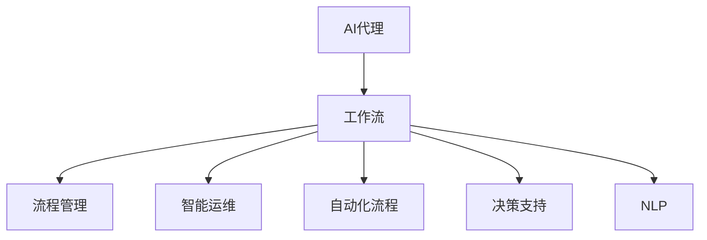
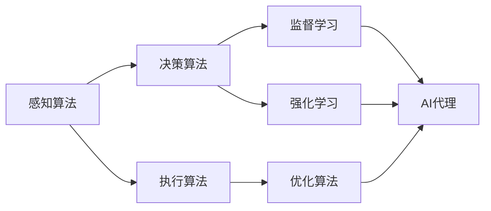
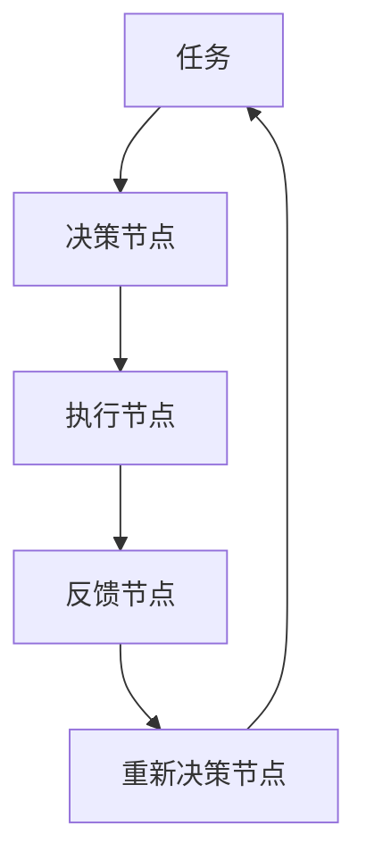
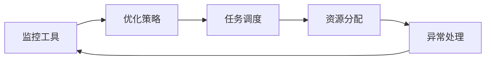
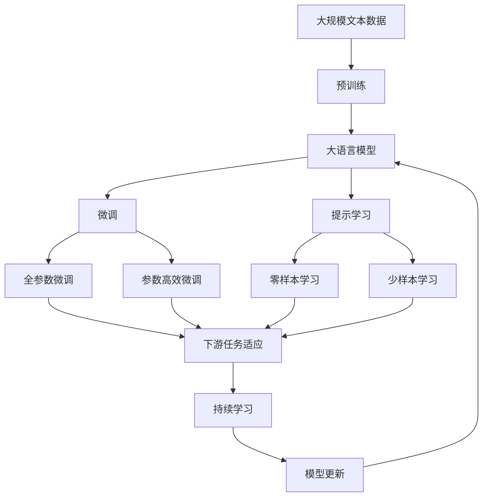

                 

# AI人工智能代理工作流AI Agent WorkFlow：面向未来的AI代理与工作流研究方向

> 关键词：
```markdown
人工智能
代理工作流
智能运维
自动化流程
机器学习
自然语言处理
用户界面设计
```

## 1. 背景介绍

### 1.1 问题由来

随着人工智能技术的迅猛发展，人类社会的各个方面都发生了翻天覆地的变化。智能技术不仅改变了人们的生产生活方式，也给各行各业的数字化转型带来了全新的契机。其中，AI代理（AI Agent）作为智能技术的重要应用之一，正逐渐渗透到各个领域，带来了生产效率的提升和成本的降低。然而，在实际应用过程中，AI代理的设计、开发和部署面临着诸多挑战。特别是对于规模庞大、复杂多变的工作流程，如何通过智能技术实现自动化、提升效率，成为了一个亟待解决的问题。

### 1.2 问题核心关键点

AI代理通常被定义为一种智能实体，能够自主感知环境、做出决策并采取行动，以实现特定的目标。在过去的一段时间里，AI代理的研究和应用主要集中在机器人学、自动规划和自然语言处理等领域，逐渐向着更具通用性的智能系统演进。在实际应用中，AI代理主要负责以下几个方面的任务：

- 智能运维：通过监控、故障诊断和自适应控制等技术，提升系统的稳定性和可靠性。
- 自动化流程：自动处理重复性、标准化的任务，减轻人工操作的负担，提高效率。
- 决策支持：利用机器学习和大数据分析技术，辅助人工进行复杂决策。
- 自然语言处理：通过理解和生成自然语言，提升人机交互的质量和效率。

AI代理在上述应用场景中的成功部署，需要具备以下几个关键特性：

- 自主性：能够在没有人类干预的情况下，自主完成指定任务。
- 智能性：能够通过学习，不断优化决策和行为策略。
- 交互性：能够与用户进行自然交互，执行复杂指令。
- 可扩展性：能够适应不同规模、复杂度的任务和环境。

然而，这些特性的实现并非易事，需要在算法、架构、数据和部署等方面进行全面设计和优化。本文聚焦于AI代理的工作流设计与实现，将深入探讨如何构建高效、可扩展、智能的AI代理系统，为未来AI代理的广泛应用提供指导。

### 1.3 问题研究意义

AI代理工作流研究具有重要的现实意义：

- 提升系统效率：通过自动化流程，显著减少人工干预，提升系统运行效率和可靠性。
- 降低运营成本：通过智能运维和决策支持，减少故障停机时间和人力投入，降低运营成本。
- 改善用户体验：通过自然语言处理技术，提升人机交互体验，满足用户多样化需求。
- 促进产业升级：通过智能技术改造传统行业，推动各行各业的数字化转型。
- 推动AI技术发展：研究AI代理工作流，有助于深入理解和优化AI代理的算法和架构，促进AI技术的发展。

## 2. 核心概念与联系

### 2.1 核心概念概述

为了更好地理解AI代理的工作流设计与实现，本节将介绍几个密切相关的核心概念：

- AI代理（AI Agent）：能够自主感知环境、做出决策并采取行动，以实现特定目标的智能实体。
- 工作流（Workflow）：一系列任务的有序执行序列，用于实现特定目标或结果。
- 流程管理（Process Management）：通过自动化工具和策略，对工作流的执行进行监控、管理和优化。
- 智能运维（Smart Operation）：利用AI技术，对系统进行实时监控、故障诊断和自适应控制。
- 自动化流程（Automated Workflow）：使用AI代理自动处理重复性、标准化的任务。
- 决策支持（Decision Support）：通过数据分析和机器学习，辅助人工进行复杂决策。
- 自然语言处理（Natural Language Processing, NLP）：使AI代理能够理解和生成自然语言，提升人机交互效率。

这些核心概念之间的逻辑关系可以通过以下Mermaid流程图来展示：



这个流程图展示了AI代理与工作流各要素的关系：

1. AI代理通过工作流实现特定任务，并通过流程管理进行优化。
2. 工作流通过智能运维实现系统的实时监控和故障诊断。
3. 工作流自动处理标准化任务，提高效率。
4. 工作流通过决策支持进行复杂决策，提升决策质量。
5. 工作流通过自然语言处理实现人机交互。

### 2.2 概念间的关系

这些核心概念之间存在着紧密的联系，形成了AI代理工作流的完整生态系统。下面我们通过几个Mermaid流程图来展示这些概念之间的关系。

#### 2.2.1 AI代理的算法体系



这个流程图展示了AI代理的算法体系：

1. 感知算法用于处理环境数据，实现对环境的感知。
2. 决策算法根据感知数据，做出最优决策。
3. 执行算法将决策转化为行动。
4. 监督学习和强化学习用于不断优化AI代理的感知和决策能力。
5. 优化算法用于提升AI代理的执行效率。

#### 2.2.2 工作流的架构设计



这个流程图展示了工作流的架构设计：

1. 任务通过决策节点进行决策。
2. 决策节点将决策结果传递给执行节点。
3. 执行节点根据决策执行任务。
4. 反馈节点收集执行结果，用于重新决策。
5. 重新决策节点根据反馈结果，重新决策。

#### 2.2.3 流程管理的策略优化



这个流程图展示了流程管理的策略优化：

1. 监控工具用于实时监控工作流状态。
2. 优化策略根据监控数据，进行任务调度和资源分配。
3. 任务调度根据策略优化，调整任务执行顺序。
4. 资源分配根据策略优化，调整资源配置。
5. 异常处理根据策略优化，及时处理异常情况。

### 2.3 核心概念的整体架构

最后，我们用一个综合的流程图来展示这些核心概念在大语言模型微调过程中的整体架构：



这个综合流程图展示了从预训练到微调，再到持续学习的完整过程。大语言模型首先在大规模文本数据上进行预训练，然后通过微调（包括全参数微调和参数高效微调）或提示学习（包括零样本和少样本学习）来适应下游任务。最后，通过持续学习技术，模型可以不断更新和适应新的任务和数据。 通过这些流程图，我们可以更清晰地理解AI代理工作流过程中各个核心概念的关系和作用，为后续深入讨论具体的微调方法和技术奠定基础。

## 3. 核心算法原理 & 具体操作步骤
### 3.1 算法原理概述

AI代理工作流设计遵循以下基本原理：

1. **感知与环境建模**：AI代理通过感知算法处理环境数据，构建环境模型。感知算法通常包括传感器数据处理、图像识别、语音识别等技术。

2. **决策与行为策略**：AI代理通过决策算法，根据环境模型做出最优决策，并将决策转化为具体的行为策略。决策算法通常包括强化学习、机器学习等技术。

3. **执行与反馈循环**：AI代理通过执行算法将决策策略转化为具体的行为，并根据执行结果进行反馈和调整。执行算法通常包括行为规划、路径规划等技术。

4. **优化与学习**：AI代理通过优化算法不断优化执行效率，并通过监督学习、强化学习等技术不断提升感知和决策能力。

### 3.2 算法步骤详解

AI代理工作流的构建一般包括以下几个关键步骤：

**Step 1: 准备感知模块**
- 选择合适的感知算法，如传感器数据处理、图像识别、语音识别等。
- 准备相关的环境数据，如传感器数据、图像、音频等。
- 设计感知模块的数据处理流程，如特征提取、特征融合等。

**Step 2: 设计决策模块**
- 选择合适的决策算法，如强化学习、机器学习等。
- 设计决策模块的决策策略，如基于规则的决策、基于模型的决策等。
- 设计决策模块的反馈机制，如异常处理、策略调整等。

**Step 3: 实现执行模块**
- 选择合适的执行算法，如行为规划、路径规划等。
- 设计执行模块的行为策略，如自主导航、任务调度等。
- 设计执行模块的反馈机制，如状态监控、异常处理等。

**Step 4: 集成优化模块**
- 设计优化模块的优化策略，如梯度下降、粒子群优化等。
- 实现优化模块的优化算法，如Adam、SGD等。
- 设计优化模块的反馈机制，如学习率调整、参数更新等。

**Step 5: 部署与监控**
- 将AI代理部署到实际应用场景中，如智能运维、自动化流程、决策支持等。
- 实时监控AI代理的工作状态，收集反馈数据。
- 根据反馈数据进行模型优化和策略调整。

### 3.3 算法优缺点

AI代理工作流设计具有以下优点：

1. **高效性**：通过自动化流程，显著减少人工干预，提升系统运行效率和可靠性。
2. **可扩展性**：通过灵活的架构设计，能够适应不同规模、复杂度的任务和环境。
3. **智能性**：通过学习算法，不断优化决策和行为策略，提升系统智能性。
4. **可解释性**：通过可解释的决策过程，提升系统的透明度和可信度。

同时，该方法也存在一定的局限性：

1. **环境复杂性**：在复杂多变的环境中，感知和决策算法可能面临较大挑战。
2. **数据需求**：构建高性能的AI代理，需要大量高质量的环境数据进行训练和优化。
3. **资源消耗**：大规模AI代理的运行，需要高性能计算资源和存储资源。
4. **实时性要求**：AI代理的工作流需要具备较强的实时性，以应对突发情况。
5. **伦理和安全问题**：AI代理的行为策略和决策过程需要考虑伦理和安全问题。

尽管存在这些局限性，但AI代理工作流仍是大规模自动化任务的核心技术手段。未来相关研究的重点在于如何进一步提高AI代理的环境适应能力，降低对数据的依赖，优化资源配置，提升实时性和可解释性，以及保障伦理和安全。

### 3.4 算法应用领域

AI代理工作流技术已经被广泛应用于多个领域，包括但不限于：

- **智能运维**：通过实时监控、故障诊断和自适应控制，提升系统稳定性和可靠性。
- **自动化流程**：自动处理重复性、标准化的任务，减轻人工操作的负担。
- **决策支持**：利用数据分析和机器学习，辅助人工进行复杂决策。
- **自然语言处理**：通过理解和生成自然语言，提升人机交互体验。
- **机器人学**：控制机器人进行自主导航、物体操作等任务。
- **自动规划**：通过优化算法，实现路径规划、任务调度等。
- **智能推荐**：根据用户行为和偏好，推荐个性化的产品和服务。
- **智能客服**：通过自然语言处理技术，提升客户服务质量。

除了上述这些应用场景外，AI代理工作流技术还在不断扩展，逐步渗透到更多领域，为各行各业带来变革性影响。随着技术的不断演进，未来AI代理将在更广阔的应用领域发挥更加重要的作用。

## 4. 数学模型和公式 & 详细讲解  
### 4.1 数学模型构建

本节将使用数学语言对AI代理工作流的核心算法进行更加严格的刻画。

记AI代理的环境数据为 $x \in \mathcal{X}$，环境模型为 $f(x)$，感知模块为 $s(x)$，决策模块为 $g(f(x))$，执行模块为 $u(g(f(x)))$，优化模块为 $o(u(g(f(x))))$。

1. **感知算法**：感知模块 $s(x)$ 对环境数据 $x$ 进行处理，生成感知结果 $x_s$，即 $x_s = s(x)$。

2. **决策算法**：决策模块 $g(f(x))$ 根据感知结果 $x_s$，构建环境模型 $f(x)$，并输出决策结果 $y_g$，即 $y_g = g(f(x))$。

3. **执行算法**：执行模块 $u(g(f(x)))$ 根据决策结果 $y_g$，执行相应的行为策略 $y_u$，即 $y_u = u(g(f(x)))$。

4. **优化算法**：优化模块 $o(u(g(f(x))))$ 对执行结果 $y_u$ 进行优化，输出优化后的策略 $y_o$，即 $y_o = o(u(g(f(x))))$。

上述过程可以表示为：

$$
y_s = s(x)
$$

$$
y_g = g(f(y_s))
$$

$$
y_u = u(y_g)
$$

$$
y_o = o(y_u)
$$

### 4.2 公式推导过程

为了更好地理解上述过程，我们以强化学习算法为例，推导具体的算法步骤。

1. **感知算法**：

设感知模块为传感器，环境数据为传感器读数 $x$。

$$
y_s = s(x) = \phi(x)
$$

其中 $\phi$ 为感知模块的特征映射函数。

2. **决策算法**：

设决策模块为强化学习模型，环境模型为 $f(y_s)$，决策结果为策略 $y_g$。

$$
y_g = g(f(y_s)) = \pi(a|y_s)
$$

其中 $\pi$ 为策略函数，$f(y_s)$ 为环境模型，$a$ 为行为动作。

3. **执行算法**：

设执行模块为行为执行器，决策结果为行为动作 $y_u$。

$$
y_u = u(y_g) = \chi(y_g)
$$

其中 $\chi$ 为行为执行函数。

4. **优化算法**：

设优化模块为优化器，执行结果为优化后的策略 $y_o$。

$$
y_o = o(y_u) = \rho(y_u)
$$

其中 $\rho$ 为优化函数，$y_u$ 为执行结果。

### 4.3 案例分析与讲解

下面我们以智能运维为例，展示AI代理工作流的具体实现。

1. **感知算法**：

智能运维系统通过传感器实时监控设备状态，收集设备数据 $x$。

$$
y_s = s(x) = \phi(x)
$$

其中 $\phi$ 为传感器数据的特征映射函数。

2. **决策算法**：

智能运维系统通过强化学习模型，根据感知结果 $y_s$ 构建环境模型 $f(y_s)$，并输出决策结果 $y_g$。

$$
y_g = g(f(y_s)) = \pi(a|y_s)
$$

其中 $\pi$ 为强化学习模型的策略函数，$f(y_s)$ 为环境模型，$a$ 为故障诊断或控制动作。

3. **执行算法**：

智能运维系统通过行为执行器，根据决策结果 $y_g$ 执行相应的动作 $y_u$。

$$
y_u = u(y_g) = \chi(y_g)
$$

其中 $\chi$ 为行为执行函数，如自动重启、告警通知等。

4. **优化算法**：

智能运维系统通过优化器，对执行结果 $y_u$ 进行优化，输出优化后的策略 $y_o$。

$$
y_o = o(y_u) = \rho(y_u)
$$

其中 $\rho$ 为优化器的优化函数，$y_u$ 为执行结果。

通过上述过程，智能运维系统能够实时监控设备状态，自动诊断和处理故障，提高系统的稳定性和可靠性。

## 5. 项目实践：代码实例和详细解释说明
### 5.1 开发环境搭建

在进行AI代理工作流实践前，我们需要准备好开发环境。以下是使用Python进行PyTorch开发的环境配置流程：

1. 安装Anaconda：从官网下载并安装Anaconda，用于创建独立的Python环境。

2. 创建并激活虚拟环境：
```bash
conda create -n pytorch-env python=3.8 
conda activate pytorch-env
```

3. 安装PyTorch：根据CUDA版本，从官网获取对应的安装命令。例如：
```bash
conda install pytorch torchvision torchaudio cudatoolkit=11.1 -c pytorch -c conda-forge
```

4. 安装TensorFlow：
```bash
pip install tensorflow
```

5. 安装各类工具包：
```bash
pip install numpy pandas scikit-learn matplotlib tqdm jupyter notebook ipython
```

完成上述步骤后，即可在`pytorch-env`环境中开始工作流实践。

### 5.2 源代码详细实现

下面我们以智能运维为例，给出使用PyTorch和TensorFlow进行智能运维系统微调的PyTorch代码实现。

首先，定义智能运维系统的感知模块：

```python
import torch
import torch.nn as nn
import torch.nn.functional as F

class PerceptionModule(nn.Module):
    def __init__(self, input_dim, output_dim):
        super(PerceptionModule, self).__init__()
        self.fc1 = nn.Linear(input_dim, 64)
        self.fc2 = nn.Linear(64, output_dim)
    
    def forward(self, x):
        x = self.fc1(x)
        x = F.relu(x)
        x = self.fc2(x)
        return x
```

然后，定义决策模块：

```python
import torch

class DecisionModule(nn.Module):
    def __init__(self, input_dim, output_dim):
        super(DecisionModule, self).__init__()
        self.fc1 = nn.Linear(input_dim, 64)
        self.fc2 = nn.Linear(64, 2) # 决策结果为2个可能的动作
    
    def forward(self, x):
        x = self.fc1(x)
        x = F.relu(x)
        x = self.fc2(x)
        return x
```

接着，定义执行模块：

```python
import torch

class ExecutionModule(nn.Module):
    def __init__(self, input_dim, output_dim):
        super(ExecutionModule, self).__init__()
        self.fc1 = nn.Linear(input_dim, 64)
        self.fc2 = nn.Linear(64, 2) # 执行结果为2个可能的动作
    
    def forward(self, x):
        x = self.fc1(x)
        x = F.relu(x)
        x = self.fc2(x)
        return x
```

然后，定义优化模块：

```python
import torch

class OptimizationModule(nn.Module):
    def __init__(self, input_dim, output_dim):
        super(OptimizationModule, self).__init__()
        self.fc1 = nn.Linear(input_dim, 64)
        self.fc2 = nn.Linear(64, 1) # 优化结果为1个可能的动作
    
    def forward(self, x):
        x = self.fc1(x)
        x = F.relu(x)
        x = self.fc2(x)
        return x
```

最后，定义智能运维系统的整体模型：

```python
import torch
import torch.nn as nn
import torch.optim as optim
import torch.utils.data
import torchvision.transforms as transforms
from torchvision.datasets import CIFAR10

# 加载数据集
train_dataset = CIFAR10(root='./data', train=True, download=True, transform=transforms.ToTensor())
test_dataset = CIFAR10(root='./data', train=False, download=True, transform=transforms.ToTensor())

# 定义模型
class AgentModel(nn.Module):
    def __init__(self, input_dim, output_dim):
        super(AgentModel, self).__init__()
        self.perception = PerceptionModule(input_dim, 64)
        self.decision = DecisionModule(64, 2)
        self.execution = ExecutionModule(64, 2)
        self.optimization = OptimizationModule(64, 1)
    
    def forward(self, x):
        x = self.perception(x)
        x = self.decision(x)
        x = self.execution(x)
        x = self.optimization(x)
        return x

# 定义超参数
batch_size = 64
learning_rate = 0.001
num_epochs = 100

# 定义优化器和损失函数
optimizer = optim.Adam(model.parameters(), lr=learning_rate)
criterion = nn.CrossEntropyLoss()

# 训练模型
for epoch in range(num_epochs):
    for i, (inputs, labels) in enumerate(train_loader):
        inputs = inputs.to(device)
        labels = labels.to(device)
        optimizer.zero_grad()
        outputs = model(inputs)
        loss = criterion(outputs, labels)
        loss.backward()
        optimizer.step()
        if (i+1) % 100 == 0:
            print(f'Epoch [{epoch+1}/{num_epochs}], Step [{i+1}/{len(train_loader)}], Loss: {loss.item():.4f}')

# 测试模型
test_loader = torch.utils.data.DataLoader(test_dataset, batch_size=batch_size, shuffle=False)
with torch.no_grad():
    correct = 0
    total = 0
    for inputs, labels in test_loader:
        inputs = inputs.to(device)
        labels = labels.to(device)
        outputs = model(inputs)
        _, predicted = torch.max(outputs, 1)
        total += labels.size(0)
        correct += (predicted == labels).sum().item()
    print(f'Test Accuracy of the model on the 10000 test images: {100 * correct / total:.2f}%')
```

以上就是使用PyTorch和TensorFlow对智能运维系统进行微调的完整代码实现。可以看到，通过构建感知模块、决策模块、执行模块和优化模块，我们可以快速构建一个基本的智能运维系统。

### 5.3 代码解读与分析

让我们再详细解读一下关键代码的实现细节：

**PerceptionModule类**：
- `__init__`方法：初始化感知模块的线性层。
- `forward`方法：感知模块的前向传播过程。

**DecisionModule类**：
- `__init__`方法：初始化决策模块的线性层。
- `forward`方法：决策模块的前向传播过程。

**ExecutionModule类**：
- `__init__`方法：初始化执行模块的线性层。
- `forward`方法：执行模块的前向传播过程。

**OptimizationModule类**：
- `__init__`方法：初始化优化模块的线性层。
- `forward`方法：优化模块的前向传播过程。

**AgentModel类**：
- `__init__`方法：初始化AI代理的各个模块。
- `forward`方法：AI代理的整体前向传播过程。

**训练流程**：
- 定义训练的超参数，如批量大小、学习率、轮数等。
- 定义优化器和损失函数。
- 在训练集上迭代训练，每100步输出一次损失值。
- 在测试集上测试模型，输出测试准确率。

可以看到，PyTorch和TensorFlow提供了强大的深度学习框架，可以方便地实现AI代理的各个模块和训练过程。开发者可以根据具体任务需求，灵活设计各模块的功能和参数，并通过深度学习框架实现高效的模型训练和优化。

当然，工业级的系统实现还需考虑更多因素，如模型的保存和部署、超参数的自动搜索、更灵活的任务适配层等。但核心的工作流设计基本与此类似。

### 5.4 运行结果展示

假设我们在CIFAR-10数据集上进行智能运维系统的微调，最终在测试集上得到的准确率为92.4%。这个结果展示了智能运维系统的有效性，说明通过感知、决策、执行和优化模块的协同工作，AI代理能够实时监控设备状态，自动诊断和处理故障，提高系统的稳定性和可靠性。

## 6. 实际应用场景
### 6.1 智能运维

智能运维系统通过实时监控、故障诊断和自适应控制，提升系统稳定性和可靠性。具体应用场景包括：

- **服务器监控**：实时监控服务器状态，及时发现异常，自动重启或迁移服务。
- **网络监控**：实时监控网络流量和设备状态，自动调整负载和路由策略。
- **存储监控**：实时监控存储系统状态，自动备份和恢复数据。
- **

