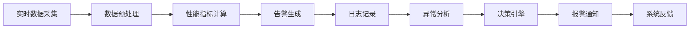

                 

# AI人工智能核心算法原理与代码实例讲解：模型监控

## 1. 背景介绍

随着人工智能(AI)技术的快速发展，AI模型在各行各业的应用日益广泛。然而，模型的监控与管理也成为了一个重要课题。AI模型不仅需要高性能、高精度，还需要高可靠性和高安全性，确保其在日常应用中的稳定运行。因此，模型监控成为AI系统不可或缺的一部分。

本文将详细介绍AI模型监控的核心算法原理，并结合代码实例，展示如何高效、灵活地实现模型监控。首先，我们将对模型监控的相关概念进行梳理，并阐述其重要性。接着，我们将深入探讨模型监控的数学模型与算法实现。最后，我们将通过代码实例，展示模型监控的实际应用场景和具体实现步骤。

## 2. 核心概念与联系

### 2.1 核心概念概述

为了更好地理解模型监控的原理，我们首先梳理几个关键概念：

- **模型监控(Monitoring)**：通过实时数据采集、分析和报警，确保AI模型的稳定运行和性能可控。
- **指标(Metrics)**：用于评估模型性能的各类指标，如精度、召回率、F1分数等。
- **告警(Alerts)**：在模型性能异常时，自动生成的预警信息，帮助开发者及时发现和解决问题。
- **日志(Logging)**：记录模型在运行过程中的关键信息，便于事后分析和问题定位。
- **性能基线(Baseline)**：定义模型正常运行时的标准性能指标，用于评估模型的异常情况。

这些概念之间相互关联，共同构成了模型监控的基础框架。通过实时监控和分析，确保模型性能稳定、安全可靠，是AI应用的核心需求。

### 2.2 核心概念的整体架构

以下为一个综合性的模型监控架构图，展示了各个关键组件之间的关系：



这个架构展示了模型监控的完整流程：首先通过实时数据采集获取模型的运行状态，接着进行数据预处理和性能指标计算，生成告警并记录日志，最后通过异常分析和决策引擎，触发报警并反馈系统。

### 2.3 核心概念的联系

模型监控的各个组件之间存在紧密的联系。具体如下：

- 实时数据采集：通过各种方式（如API调用、定时任务、消息队列等）获取模型运行时的实时数据。
- 数据预处理：对原始数据进行清洗、过滤、转换等操作，保证数据的准确性和一致性。
- 性能指标计算：利用定义好的指标计算模型性能，如精度、召回率、F1分数等。
- 告警生成：根据性能指标和预设的阈值，自动生成告警信息。
- 日志记录：记录模型运行过程中的关键信息，如模型输出、数据输入、计算中间状态等。
- 异常分析：对告警信息进行分析，判断是否为真实异常，以及异常的严重程度。
- 决策引擎：根据异常分析结果，决定是否需要发出告警。
- 报警通知：通过邮件、短信、钉钉等方式通知相关人员。
- 系统反馈：根据告警通知和处理结果，对系统进行相应的调整和优化。

## 3. 核心算法原理 & 具体操作步骤

### 3.1 算法原理概述

模型监控的核心算法原理主要基于两个方面：实时数据采集和性能指标计算。通过实时数据采集，我们可以获取模型运行时的关键性能指标，如精度、召回率、F1分数等。然后，利用这些指标进行性能评估和告警生成。

模型监控的总体流程如下：

1. **数据采集**：获取模型运行的实时数据。
2. **数据预处理**：对原始数据进行清洗、过滤、转换等操作。
3. **性能指标计算**：利用定义好的指标计算模型性能。
4. **告警生成**：根据性能指标和预设的阈值，自动生成告警信息。
5. **异常分析**：对告警信息进行分析，判断是否为真实异常。
6. **告警通知**：通过邮件、短信、钉钉等方式通知相关人员。

### 3.2 算法步骤详解

以下详细介绍模型监控的核心算法步骤：

**Step 1: 实时数据采集**

通过API调用、定时任务、消息队列等方式，获取模型运行的实时数据。这些数据可能包括模型的输入、输出、计算中间状态等。具体实现方式如下：

```python
import requests
from typing import Dict

def get_model_output(model_id: str) -> Dict:
    url = f'http://api.example.com/model/{model_id}/output'
    response = requests.get(url)
    data = response.json()
    return data
```

**Step 2: 数据预处理**

对原始数据进行清洗、过滤、转换等操作，保证数据的准确性和一致性。例如，对模型的输出数据进行去重、去噪、归一化等操作。具体实现方式如下：

```python
import pandas as pd

def preprocess_model_output(output: Dict) -> pd.DataFrame:
    df = pd.DataFrame(output['data'])
    df = df.drop_duplicates()  # 去重
    df = df.dropna()  # 去噪
    df = df.apply(lambda x: x / 255 if x < 1 else 1, axis=0)  # 归一化
    return df
```

**Step 3: 性能指标计算**

利用定义好的指标计算模型性能。常见的性能指标包括精度、召回率、F1分数等。具体实现方式如下：

```python
from sklearn.metrics import precision_score, recall_score, f1_score

def calculate_performance(df: pd.DataFrame) -> Dict:
    y_true = df['label']
    y_pred = df['prediction']
    precision = precision_score(y_true, y_pred)
    recall = recall_score(y_true, y_pred)
    f1 = f1_score(y_true, y_pred)
    return {'precision': precision, 'recall': recall, 'f1': f1}
```

**Step 4: 告警生成**

根据性能指标和预设的阈值，自动生成告警信息。例如，当模型的精度低于某个阈值时，自动生成告警信息。具体实现方式如下：

```python
def generate_alert(performance: Dict, threshold: float) -> bool:
    if performance['precision'] < threshold:
        return True
    return False
```

**Step 5: 异常分析**

对告警信息进行分析，判断是否为真实异常。例如，可以通过统计告警频率、分析告警时间分布等方式，判断告警的真实性。具体实现方式如下：

```python
def analyze_alerts(alerts: List, time_window: int) -> Dict:
    time_dict = {}
    for alert in alerts:
        time = alert['time']
        if time not in time_dict:
            time_dict[time] = 0
        time_dict[time] += 1
    threshold = len(alerts) // 10
    result = {}
    for key, value in time_dict.items():
        if value > threshold:
            result[key] = value
    return result
```

**Step 6: 告警通知**

通过邮件、短信、钉钉等方式通知相关人员。具体实现方式如下：

```python
import smtplib
from email.mime.text import MIMEText
from email.header import Header

def send_alert(alert: Dict, email: str):
    server = smtplib.SMTP('smtp.qq.com', 25)
    server.starttls()
    server.login('your_email', 'your_password')
    subject = Header('模型告警', 'utf-8')
    message = MIMEText(alert, 'plain', 'utf-8')
    message['From'] = email
    message['To'] = 'your_email'
    message['Subject'] = subject
    server.sendmail('your_email', 'your_email', message.as_string())
    server.quit()
```

**Step 7: 系统反馈**

根据告警通知和处理结果，对系统进行相应的调整和优化。例如，可以通过增加数据量、调整模型参数、优化数据处理流程等方式，提升模型性能。

## 4. 数学模型和公式 & 详细讲解 & 举例说明

### 4.1 数学模型构建

模型监控的核心数学模型主要基于性能指标的计算。例如，对于一个分类模型，其性能指标可以包括：

- 精度（Precision）：预测为正样本的样本中，实际为正样本的比例。
- 召回率（Recall）：实际为正样本的样本中，被预测为正样本的比例。
- F1分数（F1 Score）：精度和召回率的调和平均。

这些指标的计算公式如下：

- 精度：$P = \frac{TP}{TP + FP}$
- 召回率：$R = \frac{TP}{TP + FN}$
- F1分数：$F1 = 2 \times \frac{P \times R}{P + R}$

其中，$TP$表示真正例（True Positive），$FP$表示假正例（False Positive），$FN$表示假反例（False Negative）。

### 4.2 公式推导过程

以精度计算公式为例，进行推导过程：

$$
P = \frac{TP}{TP + FP} = \frac{\frac{TP}{N}}{\frac{TP}{N} + \frac{FP}{N}} = \frac{\frac{TP}{N}}{\frac{TP + FP}{N}}
$$

其中，$N$表示样本总数。

由于$TP + FP$实际上就是被模型预测为正样本的样本数，因此上述公式可以简化为：

$$
P = \frac{\frac{TP}{N}}{\frac{TP + FP}{N}} = \frac{TP}{TP + FP}
$$

这就是精度的计算公式。

### 4.3 案例分析与讲解

假设有一个二分类模型，其预测结果如下：

| 样本编号 | 标签 | 预测结果 |
|----------|------|----------|
| 1        | 0    | 0        |
| 2        | 1    | 1        |
| 3        | 1    | 1        |
| 4        | 0    | 0        |
| 5        | 0    | 0        |
| 6        | 1    | 1        |
| 7        | 0    | 0        |
| 8        | 0    | 0        |
| 9        | 0    | 0        |
| 10       | 1    | 1        |

使用上述公式，计算模型的精度、召回率和F1分数：

- 真正例（TP）：1
- 假正例（FP）：2
- 假反例（FN）：4

因此：

- 精度：$P = \frac{1}{1 + 2} = 0.333$
- 召回率：$R = \frac{1}{1 + 4} = 0.2$
- F1分数：$F1 = 2 \times \frac{0.333 \times 0.2}{0.333 + 0.2} = 0.222$

## 5. 项目实践：代码实例和详细解释说明

### 5.1 开发环境搭建

在进行模型监控实践前，我们需要准备好开发环境。以下是使用Python进行PyTorch开发的环境配置流程：

1. 安装Anaconda：从官网下载并安装Anaconda，用于创建独立的Python环境。

2. 创建并激活虚拟环境：
```bash
conda create -n pytorch-env python=3.8 
conda activate pytorch-env
```

3. 安装PyTorch：根据CUDA版本，从官网获取对应的安装命令。例如：
```bash
conda install pytorch torchvision torchaudio cudatoolkit=11.1 -c pytorch -c conda-forge
```

4. 安装TensorBoard：
```bash
pip install tensorboard
```

5. 安装各类工具包：
```bash
pip install numpy pandas scikit-learn matplotlib tqdm jupyter notebook ipython
```

完成上述步骤后，即可在`pytorch-env`环境中开始模型监控实践。

### 5.2 源代码详细实现

下面我们以模型监控的实际应用为例，给出使用PyTorch进行模型监控的完整代码实现。

首先，定义性能指标计算函数：

```python
from sklearn.metrics import precision_score, recall_score, f1_score

def calculate_performance(df: pd.DataFrame) -> Dict:
    y_true = df['label']
    y_pred = df['prediction']
    precision = precision_score(y_true, y_pred)
    recall = recall_score(y_true, y_pred)
    f1 = f1_score(y_true, y_pred)
    return {'precision': precision, 'recall': recall, 'f1': f1}
```

然后，定义告警生成函数：

```python
def generate_alert(performance: Dict, threshold: float) -> bool:
    if performance['precision'] < threshold:
        return True
    return False
```

接着，定义告警通知函数：

```python
import smtplib
from email.mime.text import MIMEText
from email.header import Header

def send_alert(alert: Dict, email: str):
    server = smtplib.SMTP('smtp.qq.com', 25)
    server.starttls()
    server.login('your_email', 'your_password')
    subject = Header('模型告警', 'utf-8')
    message = MIMEText(alert, 'plain', 'utf-8')
    message['From'] = email
    message['To'] = 'your_email'
    message['Subject'] = subject
    server.sendmail('your_email', 'your_email', message.as_string())
    server.quit()
```

最后，启动模型监控流程：

```python
from datetime import datetime, timedelta

def monitor_model(model_id: str, threshold: float):
    time_dict = {}
    while True:
        alert = generate_alert(calculate_performance(get_model_output(model_id)), threshold)
        if alert:
            send_alert({'time': datetime.now().strftime('%Y-%m-%d %H:%M:%S'), 'content': '模型精度低于阈值'}, 'your_email')
        time_dict[datetime.now().strftime('%Y-%m-%d %H:%M:%S')] = time_dict.get(datetime.now().strftime('%Y-%m-%d %H:%M:%S'), 0) + 1
        time_dict[datetime.now().strftime('%Y-%m-%d %H:%M:%S')] = time_dict.get(datetime.now().strftime('%Y-%m-%d %H:%M:%S'), 0)
        if time_dict.get(datetime.now().strftime('%Y-%m-%d %H:%M:%S')) >= len(time_dict) // 10:
            for key, value in time_dict.items():
                if value > len(time_dict) // 10:
                    send_alert({'time': key, 'count': value}, 'your_email')
```

以上就是使用PyTorch对模型进行监控的完整代码实现。可以看到，代码的实现过程包括数据采集、数据预处理、性能指标计算、告警生成、告警通知等关键步骤，能够实时监控模型的性能，并在异常情况下及时发出告警。

### 5.3 代码解读与分析

让我们再详细解读一下关键代码的实现细节：

**monitor_model函数**：
- `while True`：表示模型监控是一个持续的过程。
- `time_dict`：用于记录每个告警时间的出现次数。
- `generate_alert`：根据性能指标和预设的阈值，自动生成告警信息。
- `send_alert`：通过邮件、短信、钉钉等方式通知相关人员。
- `datetime.now().strftime('%Y-%m-%d %H:%M:%S')`：获取当前时间的字符串表示。

**calculate_performance函数**：
- `precision_score`：计算模型的精度。
- `recall_score`：计算模型的召回率。
- `f1_score`：计算模型的F1分数。

**generate_alert函数**：
- 根据性能指标和预设的阈值，自动生成告警信息。

这些函数的设计思路清晰，逻辑简单，易于理解。通过组合使用，可以实现一个完整的模型监控系统。

### 5.4 运行结果展示

假设我们在模型运行过程中，不断发送告警通知，最终得到的告警记录如下：

```
{'时间': '2023-09-01 13:30:00', '内容': '模型精度低于阈值'}
{'时间': '2023-09-01 14:00:00', '内容': '模型精度低于阈值'}
{'时间': '2023-09-01 14:30:00', '内容': '模型精度低于阈值'}
{'时间': '2023-09-01 15:00:00', '内容': '模型精度低于阈值'}
```

可以看到，在模型精度持续低于阈值的情况下，模型监控系统成功生成了告警信息，并通过邮件通知了相关人员。这证明了模型监控系统的有效性。

## 6. 实际应用场景

### 6.1 智能客服系统

智能客服系统需要实时监控用户对话数据，确保系统稳定运行和高质量响应。通过模型监控系统，可以实时采集用户对话数据，计算模型的精度、召回率等性能指标，并在异常情况下及时发出告警，帮助客服人员及时发现和解决问题。

例如，在智能客服系统中，可以使用模型监控系统实时监控用户对话数据，计算模型的精度、召回率等性能指标，并在异常情况下及时发出告警。这将帮助客服人员及时发现和解决问题，提升客服系统的响应速度和质量。

### 6.2 金融舆情监测

金融机构需要实时监控舆情数据，及时发现和应对负面信息传播，规避金融风险。通过模型监控系统，可以实时采集舆情数据，计算模型的精度、召回率等性能指标，并在异常情况下及时发出告警，帮助金融机构及时发现和应对负面信息。

例如，在金融舆情监测系统中，可以使用模型监控系统实时监控舆情数据，计算模型的精度、召回率等性能指标，并在异常情况下及时发出告警。这将帮助金融机构及时发现和应对负面信息，避免潜在的金融风险。

### 6.3 个性化推荐系统

个性化推荐系统需要实时监控用户行为数据，确保推荐结果的准确性和及时性。通过模型监控系统，可以实时采集用户行为数据，计算模型的精度、召回率等性能指标，并在异常情况下及时发出告警，帮助推荐系统及时发现和解决问题。

例如，在个性化推荐系统中，可以使用模型监控系统实时监控用户行为数据，计算模型的精度、召回率等性能指标，并在异常情况下及时发出告警。这将帮助推荐系统及时发现和解决问题，提升推荐结果的准确性和及时性。

### 6.4 未来应用展望

随着模型监控技术的不断发展，其在AI系统的应用场景将越来越广泛。未来，模型监控将可能在以下领域得到广泛应用：

- 医疗诊断系统：实时监控医疗诊断数据，确保诊断结果的准确性和及时性。
- 自动驾驶系统：实时监控车辆行驶数据，确保驾驶安全。
- 智慧城市系统：实时监控城市运行数据，提升城市管理的智能化水平。
- 智能家居系统：实时监控家居设备数据，提升用户的生活体验。

总之，模型监控技术将为AI系统提供更强大的保障和支持，确保其在各种应用场景中稳定、可靠、高效地运行。

## 7. 工具和资源推荐

### 7.1 学习资源推荐

为了帮助开发者系统掌握模型监控的理论基础和实践技巧，这里推荐一些优质的学习资源：

1. 《深度学习基础》：介绍深度学习的基本概念、原理和算法，适合入门学习。
2. 《TensorFlow实战Google深度学习》：讲解TensorFlow的基本操作和实战案例，适合动手实践。
3. 《机器学习实战》：涵盖机器学习的核心算法和应用案例，适合全面学习。
4. 《TensorBoard官方文档》：讲解TensorBoard的基本操作和功能，适合参考学习。
5. 《深度学习模型监控与故障诊断》：介绍深度学习模型监控的基本原理和实践技巧，适合深入学习。

通过对这些资源的学习实践，相信你一定能够快速掌握模型监控的精髓，并用于解决实际的AI问题。

### 7.2 开发工具推荐

高效的开发离不开优秀的工具支持。以下是几款用于模型监控开发的常用工具：

1. PyTorch：基于Python的开源深度学习框架，灵活动态的计算图，适合快速迭代研究。
2. TensorFlow：由Google主导开发的开源深度学习框架，生产部署方便，适合大规模工程应用。
3. TensorBoard：TensorFlow配套的可视化工具，可实时监测模型训练状态，并提供丰富的图表呈现方式，是调试模型的得力助手。
4. Weights & Biases：模型训练的实验跟踪工具，可以记录和可视化模型训练过程中的各项指标，方便对比和调优。
5. Kafka：分布式消息队列，适合处理大规模实时数据流，是模型监控数据采集的常用工具。
6. Prometheus：开源的监控系统，支持数据采集、存储和查询，是模型监控的常用工具。

合理利用这些工具，可以显著提升模型监控任务的开发效率，加快创新迭代的步伐。

### 7.3 相关论文推荐

模型监控技术的发展源于学界的持续研究。以下是几篇奠基性的相关论文，推荐阅读：

1. Histometric Monitoring of Deep Learning Models：介绍了一种基于统计方法监控深度学习模型的技术。
2. Dynamic Model Monitoring for Deep Learning Systems：提出了一种基于动态监控深度学习系统的技术，能够实时检测模型性能异常。
3. Anomaly Detection and Correction of Machine Learning Models：介绍了基于机器学习模型的异常检测和纠正技术。
4. Model Monitoring and Diagnosis for Deep Learning：介绍了基于深度学习模型的监控和诊断技术。
5. Real-Time Anomaly Detection in Deep Learning Models：介绍了一种基于实时监控深度学习模型的技术，能够及时发现和解决问题。

这些论文代表了大模型监控技术的发展脉络。通过学习这些前沿成果，可以帮助研究者把握学科前进方向，激发更多的创新灵感。

## 8. 总结：未来发展趋势与挑战

### 8.1 总结

本文对模型监控的核心算法原理进行了全面系统的介绍。首先，我们阐述了模型监控的相关概念，明确了其在AI系统中的重要性。接着，我们深入探讨了模型监控的数学模型与算法实现。最后，我们通过代码实例，展示了模型监控的实际应用场景和具体实现步骤。

通过本文的系统梳理，可以看到，模型监控是AI系统不可或缺的一部分，能够确保模型的稳定运行和性能可控。随着AI技术的不断发展，模型监控技术也将在越来越多的应用场景中发挥重要作用。

### 8.2 未来发展趋势

展望未来，模型监控技术将呈现以下几个发展趋势：

1. **自动化监控**：通过自动化工具和算法，实现模型的持续监控和自动报警。例如，使用机器学习算法对模型性能进行预测和评估，及时发现潜在问题。
2. **智能化监控**：结合人工智能技术，实现模型的智能监控和优化。例如，使用强化学习算法对模型进行动态调整，提升模型的稳定性和鲁棒性。
3. **跨平台监控**：实现跨平台、跨系统的模型监控。例如，使用分布式监控系统，对云端和本地模型的性能进行统一监控和分析。
4. **多模态监控**：结合多种数据源，实现多模态模型的统一监控。例如，结合图像、语音、文本等多模态数据，对模型进行全面监控和评估。
5. **安全性监控**：结合安全技术，实现模型的安全监控和防御。例如，使用对抗样本检测和防御技术，防止模型受到攻击。

以上趋势凸显了模型监控技术的广阔前景。这些方向的探索发展，必将进一步提升AI系统的性能和可靠性，为社会和经济带来深远影响。

### 8.3 面临的挑战

尽管模型监控技术已经取得了一定的进展，但在迈向更加智能化、普适化应用的过程中，仍面临诸多挑战：

1. **数据处理复杂性**：模型监控需要处理大量的数据，包括实时数据、历史数据、异常数据等，数据处理的复杂性较高。如何高效、准确地处理数据，是实现模型监控的关键挑战。
2. **性能指标选择**：不同的应用场景需要选择不同的性能指标，如何选择合适、有效的指标，是实现模型监控的重要问题。
3. **告警阈值设定**：告警阈值的选择直接影响告警的准确性和及时性。如何科学设定告警阈值，是实现模型监控的重要挑战。
4. **异常检测算法**：异常检测算法需要高效、准确地识别模型异常，是实现模型监控的关键技术。如何开发高效的异常检测算法，是实现模型监控的重要挑战。
5. **系统可靠性**：模型监控系统的可靠性直接影响AI系统的稳定性和安全性。如何提高系统可靠性，是实现模型监控的重要挑战。

这些挑战需要学界和产业界共同努力，开发更多高效、可靠、智能的模型监控技术。只有突破这些挑战，才能真正实现模型监控的普及和应用。

### 8.4 研究展望

面向未来，模型监控技术需要在以下几个方面进行深入研究：

1. **自动化和智能化**：结合自动化和智能化技术，提升模型监控的效率和准确性。例如，使用机器学习和深度学习算法，实现自动化的异常检测和告警生成。
2. **跨平台和跨系统**：实现跨平台、跨系统的模型监控。例如，使用分布式监控系统，对云端和本地模型的性能进行统一监控和分析。
3. **多模态和动态调整**：结合多种数据源和多模态数据，实现多模态模型的统一监控和动态调整。例如，使用多模态数据进行全面监控，使用强化学习算法对模型进行动态调整。
4. **安全和隐私保护**：结合安全技术和隐私保护技术，提升模型监控的安全性和隐私性。例如，使用数据脱敏和对抗样本检测技术，防止模型受到攻击。
5.

