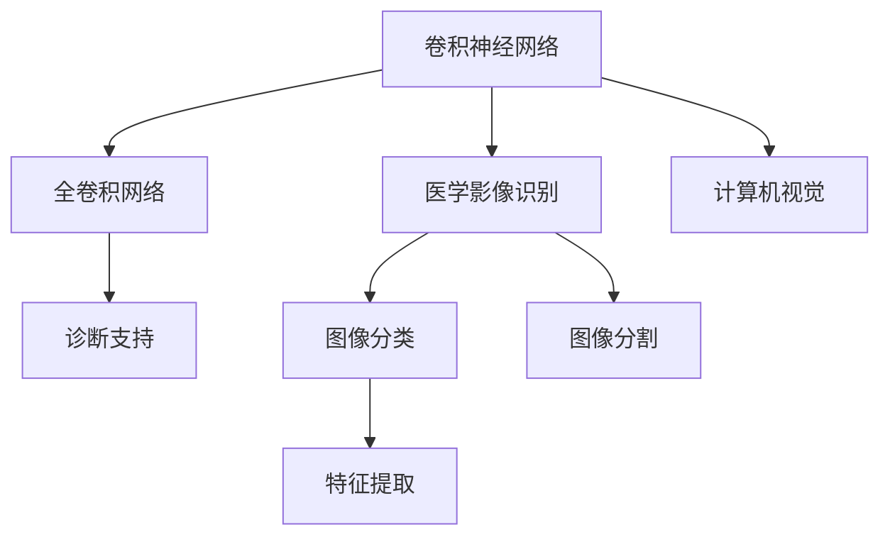
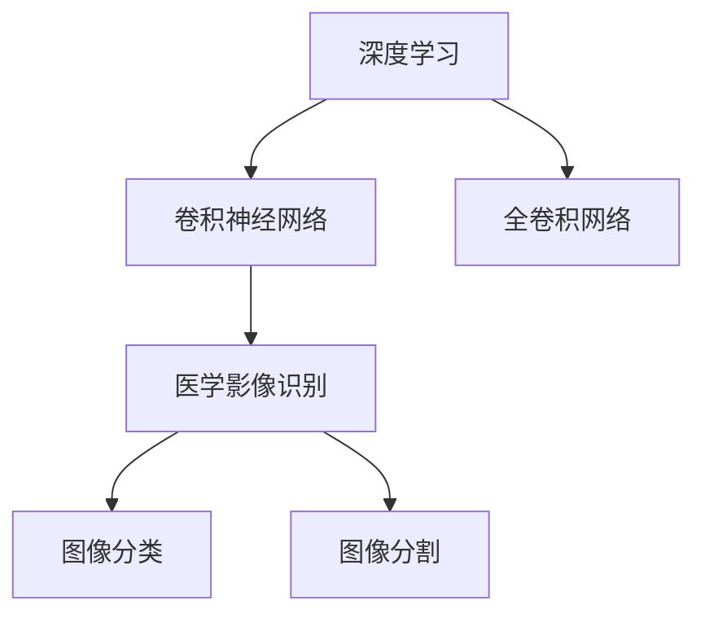
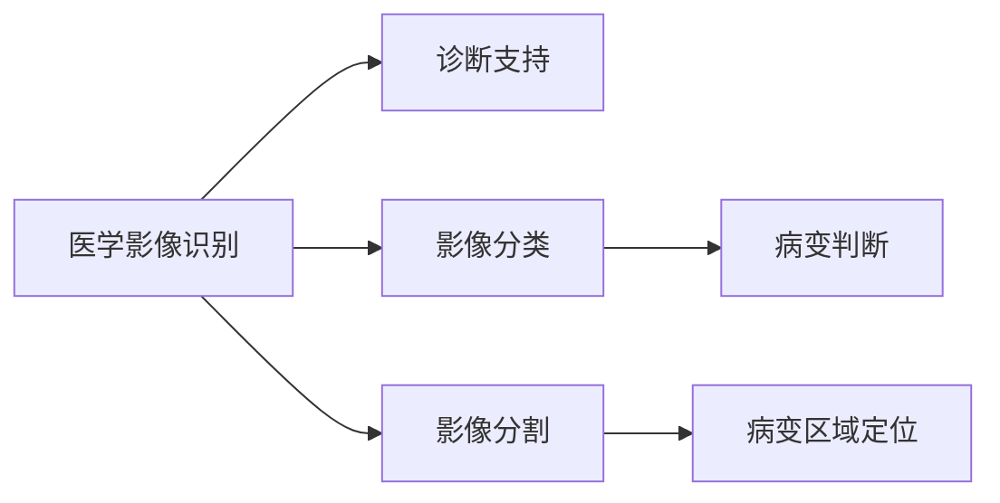
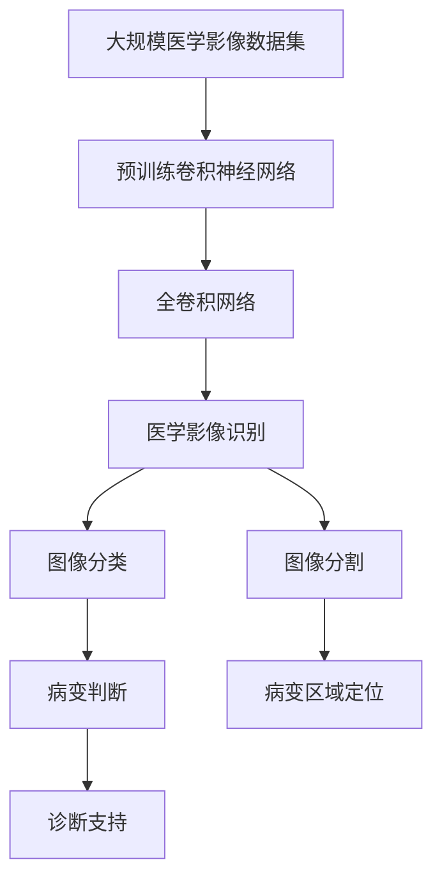

                 

# AI人工智能深度学习算法：在医学影像识别中的应用

> 关键词：深度学习算法,医学影像识别,卷积神经网络,计算机视觉,特征提取,全卷积网络,诊断支持,影像分割

## 1. 背景介绍

### 1.1 问题由来

近年来，随着计算机视觉和深度学习技术的迅速发展，医学影像识别在疾病诊断、治疗方案选择等方面发挥了越来越重要的作用。传统的医学影像识别依赖于医学专家，需要长时间积累经验和知识，且诊断结果易受人为因素影响。而基于深度学习的医学影像识别方法，可以自动学习影像特征，快速准确地识别病变，大大提高了医疗效率和诊断的可靠性。

### 1.2 问题核心关键点

医学影像识别主要分为两大类：图像分类和图像分割。图像分类任务包括判断影像中是否存在某种病变，如癌症、心血管疾病等；图像分割任务是将病变区域从影像中精确分割出来。这两类任务中，深度学习算法如卷积神经网络(Convolutional Neural Networks, CNNs)、全卷积网络(Fully Convolutional Networks, FCNs)等，由于其强大的特征提取能力，成为医学影像识别的主流方法。

深度学习算法在医学影像识别中的应用，通过大规模数据集上的预训练，学习到通用的影像特征。然后在特定医学影像数据集上微调或微调后进行诊断支持。这种基于预训练-微调的范式，提高了算法的泛化能力和诊断的准确性。

### 1.3 问题研究意义

医学影像识别技术的研发，对于提高医疗水平、降低误诊漏诊率、减轻医疗人员负担等方面具有重要意义：

1. 提升医疗诊断效率：利用深度学习算法自动进行影像识别，可以大大缩短诊断时间，提高医疗服务的响应速度。
2. 提高诊断准确率：算法通过学习大量标注数据，能够识别出细微的病变，减少人为误差。
3. 辅助医学决策：深度学习算法不仅可以用于疾病诊断，还可以为医生提供决策建议，辅助治疗方案的选择。
4. 降低医疗成本：通过自动化诊断，减少了对人工检查的需求，节省了大量的医疗资源。
5. 促进医学研究：医学影像识别技术能够为医学研究提供大量高质量的数据，促进疾病机制的研究和药物开发。

## 2. 核心概念与联系

### 2.1 核心概念概述

为更好地理解深度学习算法在医学影像识别中的应用，本节将介绍几个密切相关的核心概念：

- 卷积神经网络(CNNs)：一种特殊的深度神经网络，通过卷积层、池化层等结构，提取影像特征。
- 全卷积网络(FCNs)：一种特殊的CNNs，能够直接对任意大小的影像进行像素级别的分类或分割。
- 医学影像识别：利用深度学习算法对医学影像进行自动分类或分割，识别出病变区域。
- 计算机视觉：包括图像分类、物体检测、图像分割等任务，是深度学习在影像识别中应用的重要领域。
- 特征提取：通过卷积层等结构，从影像中提取出低维的特征表示，是医学影像识别的关键环节。
- 诊断支持：深度学习算法提供的影像识别结果，辅助医生进行诊断和治疗决策。

这些核心概念之间的逻辑关系可以通过以下Mermaid流程图来展示：



这个流程图展示了一些核心概念之间的联系：

1. 卷积神经网络是医学影像识别的重要基础。
2. 全卷积网络是卷积神经网络的一种特殊形式，主要用于像素级别的分类和分割任务。
3. 医学影像识别是计算机视觉的一个重要分支，包含图像分类和分割两个子任务。
4. 特征提取是影像识别的核心环节，通过卷积层等结构提取影像特征。
5. 诊断支持是医学影像识别结果的最终应用，为医生提供辅助决策。

### 2.2 概念间的关系

这些核心概念之间存在着紧密的联系，形成了医学影像识别的完整生态系统。下面我们通过几个Mermaid流程图来展示这些概念之间的关系。

#### 2.2.1 深度学习与医学影像识别



这个流程图展示了深度学习在医学影像识别中的应用过程：

1. 深度学习通过卷积神经网络学习影像特征。
2. 卷积神经网络中的全卷积网络可以处理任意大小的影像。
3. 医学影像识别包含图像分类和分割两个子任务，使用不同的神经网络结构。
4. 图像分类任务主要用于判断影像是否存在某种病变。
5. 图像分割任务主要将病变区域从影像中精确分割出来。

#### 2.2.2 医学影像识别的诊断支持



这个流程图展示了医学影像识别在诊断支持中的应用：

1. 医学影像识别通过卷积神经网络对影像进行分类和分割。
2. 分类任务判断影像中是否存在某种病变。
3. 分割任务将病变区域从影像中精确分割出来。
4. 诊断支持基于分类和分割结果，为医生提供辅助决策。
5. 病变判断是影像分类的主要应用。
6. 病变区域定位是影像分割的主要应用。

### 2.3 核心概念的整体架构

最后，我们用一个综合的流程图来展示这些核心概念在大规模医学影像识别中的整体架构：



这个综合流程图展示了从预训练到诊断支持的全过程：

1. 大规模医学影像数据集用于卷积神经网络的预训练。
2. 预训练后的卷积神经网络在全卷积网络上进行微调或微调后进行医学影像识别。
3. 医学影像识别包括图像分类和分割两个子任务，分别用于病变判断和病变区域定位。
4. 病变判断和病变区域定位的结果，为诊断支持提供依据。
5. 诊断支持基于影像识别结果，辅助医生进行诊断和治疗决策。

## 3. 核心算法原理 & 具体操作步骤
### 3.1 算法原理概述

基于深度学习的医学影像识别方法，主要依赖于卷积神经网络(Convolutional Neural Networks, CNNs)和全卷积网络(Fully Convolutional Networks, FCNs)等。这些网络通过卷积层、池化层等结构，提取影像特征，并对其进行分类或分割。

### 3.2 算法步骤详解

#### 3.2.1 数据准备

- 收集和预处理大规模医学影像数据集，确保数据的多样性和标注的准确性。
- 对影像进行归一化、标准化等预处理，以提高模型的训练效率和泛化能力。
- 将医学影像分割任务转化为像素级别的二分类或多分类问题，即将病变区域和正常区域分割出来。

#### 3.2.2 网络设计

- 构建卷积神经网络或全卷积网络，选择合适的层数和通道数。
- 在网络设计中，可以引入残差连接、跳跃连接等结构，提高模型的深度和稳定性。
- 对于医学影像分类任务，可以使用VGGNet、ResNet等经典网络结构；对于医学影像分割任务，可以使用U-Net、SegNet等网络结构。

#### 3.2.3 模型训练

- 使用反向传播算法，根据损失函数对网络参数进行更新，最小化预测误差。
- 损失函数通常使用交叉熵损失、Dice损失等，用于衡量模型预测结果与真实标签之间的差异。
- 在模型训练过程中，可以采用数据增强、正则化等技术，提高模型的泛化能力和鲁棒性。

#### 3.2.4 模型评估

- 在测试集上评估模型性能，计算分类准确率、分割精度等指标。
- 使用混淆矩阵、ROC曲线等可视化工具，分析模型的预测结果和分类效果。
- 对于医学影像分割任务，可以使用Jaccard指标、Dice指标等评价模型分割的精确度。

#### 3.2.5 模型应用

- 将训练好的模型应用到新的医学影像数据上，进行分类或分割预测。
- 根据预测结果，辅助医生进行诊断和治疗决策。
- 定期更新模型，以适应新的医学影像数据和临床需求。

### 3.3 算法优缺点

深度学习在医学影像识别中的应用，具有以下优点：

- 自动学习特征：通过大规模数据集的预训练，深度学习算法能够自动学习影像特征，减少了人工提取特征的工作量。
- 泛化能力强：经过充分预训练和微调，深度学习模型能够处理复杂的医学影像数据，具有较强的泛化能力。
- 诊断速度较快：卷积神经网络等结构具有并行计算的特性，能够快速处理影像数据，缩短诊断时间。
- 减少人为误差：算法通过学习大量标注数据，减少了人为误差，提高了诊断的可靠性。

然而，深度学习在医学影像识别中也有一定的局限性：

- 数据需求较大：深度学习模型需要大量的标注数据进行训练，而医学影像数据往往标注成本较高。
- 解释性不足：深度学习模型通常被视为"黑盒"系统，难以解释其内部的推理过程和决策依据。
- 存在过拟合风险：医学影像数据的高维性、多样性和复杂性，可能导致模型在训练集上表现较好，而在测试集上表现不佳。
- 计算资源消耗较大：深度学习模型参数较多，计算资源消耗较大，难以在资源受限的环境中部署。

### 3.4 算法应用领域

深度学习算法在医学影像识别中的应用，已经涵盖了医学影像分类的各个领域，包括：

- 癌症检测：利用深度学习算法自动识别影像中的癌症病变。
- 心血管疾病诊断：通过影像分类和分割，判断心脏、血管等器官的健康状况。
- 皮肤病诊断：对皮肤病影像进行分类和分割，辅助皮肤病诊断和治疗。
- 脑部疾病诊断：对脑部影像进行分类和分割，辅助诊断脑部疾病。
- 眼科疾病诊断：对眼底影像进行分类和分割，辅助诊断各种眼科疾病。

此外，深度学习算法在医学影像分割中的应用，也在不断拓展，如肿瘤分割、脉络膜血管分割等，为医学影像分析提供了更精确的结果。

## 4. 数学模型和公式 & 详细讲解 & 举例说明

### 4.1 数学模型构建

医学影像识别任务中的深度学习模型，通常使用卷积神经网络或全卷积网络来实现。这里以医学影像分割为例，介绍一种基于U-Net的网络结构：


该模型包含5个下采样层和5个上采样层，每个下采样层通过卷积和池化操作提取影像特征，每个上采样层通过反卷积操作恢复影像大小，最终得到像素级别的分类或分割结果。

### 4.2 公式推导过程

医学影像分割任务通常使用二分类或多分类交叉熵损失函数，其数学形式如下：

$$
\mathcal{L} = -\frac{1}{N} \sum_{i=1}^N \sum_{j=1}^C (y_{i,j} \log (\hat{y}_{i,j}) + (1-y_{i,j}) \log (1-\hat{y}_{i,j}))
$$

其中，$y_{i,j}$表示第$i$个样本第$j$个像素的真实标签，$\hat{y}_{i,j}$表示第$i$个样本第$j$个像素的预测标签，$C$表示分类的类别数。该损失函数用于衡量模型预测结果与真实标签之间的差异。

对于医学影像分类任务，通常使用多分类交叉熵损失函数，其数学形式如下：

$$
\mathcal{L} = -\frac{1}{N} \sum_{i=1}^N \sum_{j=1}^C y_{i,j} \log (\hat{y}_{i,j})
$$

其中，$y_{i,j}$表示第$i$个样本第$j$个像素的真实标签，$\hat{y}_{i,j}$表示第$i$个样本第$j$个像素的预测标签，$C$表示分类的类别数。

### 4.3 案例分析与讲解

假设我们要对一张胸片影像进行肺癌分割，以下是基于U-Net网络的结构示意图：


该模型由5个下采样层和5个上采样层组成。首先通过卷积和池化操作提取影像特征，将影像缩小至原始大小的四分之一；然后在上采样层通过反卷积操作恢复影像大小，同时保留特征信息，最终得到像素级别的预测结果。

对于胸片影像的肺癌分割任务，我们可以将其转化为二分类问题，即判断每个像素属于病变区域（肺癌）或正常区域。通过上述网络结构，模型可以自动学习影像中的病变特征，将其分割出来，帮助医生进行诊断和治疗决策。

## 5. 项目实践：代码实例和详细解释说明

### 5.1 开发环境搭建

要进行医学影像识别的深度学习开发，我们需要准备好以下开发环境：

1. 安装Anaconda：从官网下载并安装Anaconda，用于创建独立的Python环境。

2. 创建并激活虚拟环境：
```bash
conda create -n pytorch-env python=3.8 
conda activate pytorch-env
```

3. 安装PyTorch：根据CUDA版本，从官网获取对应的安装命令。例如：
```bash
conda install pytorch torchvision torchaudio cudatoolkit=11.1 -c pytorch -c conda-forge
```

4. 安装各类工具包：
```bash
pip install numpy pandas scikit-learn matplotlib tqdm jupyter notebook ipython
```

完成上述步骤后，即可在`pytorch-env`环境中开始医学影像识别项目的开发。

### 5.2 源代码详细实现

以下是一个使用PyTorch实现医学影像分类的示例代码：

```python
import torch
import torch.nn as nn
import torch.optim as optim
import torchvision.transforms as transforms
from torch.utils.data import DataLoader
from torchvision.datasets import CustomDataset

class CustomDataset(torch.utils.data.Dataset):
    def __init__(self, images, labels, transform=None):
        self.images = images
        self.labels = labels
        self.transform = transform
        
    def __len__(self):
        return len(self.images)
    
    def __getitem__(self, idx):
        img = self.images[idx]
        label = self.labels[idx]
        
        if self.transform:
            img = self.transform(img)
        
        return {'image': img, 'label': label}

# 数据预处理
transform = transforms.Compose([
    transforms.ToTensor(),
    transforms.Normalize([0.5, 0.5, 0.5], [0.5, 0.5, 0.5])
])

# 加载数据集
train_dataset = CustomDataset(train_images, train_labels, transform=transform)
test_dataset = CustomDataset(test_images, test_labels, transform=transform)

# 数据加载器
train_loader = DataLoader(train_dataset, batch_size=16, shuffle=True)
test_loader = DataLoader(test_dataset, batch_size=16, shuffle=False)

# 网络结构定义
class MyNet(nn.Module):
    def __init__(self):
        super(MyNet, self).__init__()
        self.conv1 = nn.Conv2d(3, 64, kernel_size=3, stride=1, padding=1)
        self.pool1 = nn.MaxPool2d(kernel_size=2, stride=2)
        self.conv2 = nn.Conv2d(64, 128, kernel_size=3, stride=1, padding=1)
        self.pool2 = nn.MaxPool2d(kernel_size=2, stride=2)
        self.conv3 = nn.Conv2d(128, 256, kernel_size=3, stride=1, padding=1)
        self.pool3 = nn.MaxPool2d(kernel_size=2, stride=2)
        self.conv4 = nn.Conv2d(256, 512, kernel_size=3, stride=1, padding=1)
        self.pool4 = nn.MaxPool2d(kernel_size=2, stride=2)
        self.conv5 = nn.Conv2d(512, 1024, kernel_size=3, stride=1, padding=1)
        self.pool5 = nn.MaxPool2d(kernel_size=2, stride=2)
        self.fc1 = nn.Linear(1024 * 2 * 2, 1024)
        self.fc2 = nn.Linear(1024, 512)
        self.fc3 = nn.Linear(512, 1)

    def forward(self, x):
        x = nn.functional.relu(self.conv1(x))
        x = self.pool1(x)
        x = nn.functional.relu(self.conv2(x))
        x = self.pool2(x)
        x = nn.functional.relu(self.conv3(x))
        x = self.pool3(x)
        x = nn.functional.relu(self.conv4(x))
        x = self.pool4(x)
        x = nn.functional.relu(self.conv5(x))
        x = self.pool5(x)
        x = x.view(-1, 1024 * 2 * 2)
        x = nn.functional.relu(self.fc1(x))
        x = nn.functional.relu(self.fc2(x))
        x = self.fc3(x)
        return x

# 网络初始化
net = MyNet()
net.to(device)

# 损失函数和优化器
criterion = nn.BCEWithLogitsLoss()
optimizer = optim.Adam(net.parameters(), lr=0.001)

# 训练和评估
def train_epoch(model, data_loader, optimizer):
    model.train()
    epoch_loss = 0
    for batch in data_loader:
        inputs, labels = batch['image'].to(device), batch['label'].to(device)
        optimizer.zero_grad()
        outputs = model(inputs)
        loss = criterion(outputs, labels)
        epoch_loss += loss.item()
        loss.backward()
        optimizer.step()
    return epoch_loss / len(data_loader)

def evaluate(model, data_loader):
    model.eval()
    correct = 0
    total = 0
    with torch.no_grad():
        for batch in data_loader:
            inputs, labels = batch['image'].to(device), batch['label'].to(device)
            outputs = model(inputs)
            _, predicted = torch.max(outputs, 1)
            total += labels.size(0)
            correct += (predicted == labels).sum().item()
    return correct / total

# 训练流程
epochs = 10
batch_size = 16

for epoch in range(epochs):
    loss = train_epoch(net, train_loader, optimizer)
    print(f'Epoch {epoch+1}, train loss: {loss:.3f}')
    
    print(f'Epoch {epoch+1}, test accuracy: {evaluate(net, test_loader):.3f}')

print('Test accuracy: {:.3f}'.format(evaluate(net, test_loader)))
```

这个示例代码实现了基于卷积神经网络的医学影像分类任务。具体步骤如下：

1. 定义数据集类`CustomDataset`，用于加载和预处理医学影像数据。
2. 加载并预处理训练集和测试集。
3. 定义卷积神经网络模型`MyNet`。
4. 初始化模型、损失函数和优化器。
5. 在训练集上训练模型，在测试集上评估模型性能。

### 5.3 代码解读与分析

让我们再详细解读一下关键代码的实现细节：

**CustomDataset类**：
- `__init__`方法：初始化数据集的图像和标签，以及数据预处理方式。
- `__len__`方法：返回数据集的样本数量。
- `__getitem__`方法：对单个样本进行处理，将图像和标签进行预处理，并返回处理后的张量。

**模型定义**：
- `MyNet`类：定义了卷积神经网络的层结构和前向传播过程。
- `__init__`方法：初始化各层的卷积核、激活函数、池化层等。
- `forward`方法：定义前向传播过程，通过卷积、池化、全连接等操作提取特征并进行分类。

**训练和评估函数**：
- `train_epoch`函数：在训练集上进行单次迭代，更新模型参数。
- `evaluate`函数：在测试集上评估模型性能，计算准确率。

**训练流程**：
- 定义训练和测试数据的批大小，开始循环迭代。
- 每个epoch内，在训练集上训练模型，输出训练损失。
- 在测试集上评估模型性能，输出测试准确率。
- 所有epoch结束后，输出测试准确率。

可以看到，PyTorch配合了丰富的深度学习库和工具，使得医学影像识别的开发和实践变得高效便捷。开发者只需关注模型设计和数据处理，而无需过多关注底层实现细节。

当然，工业级的系统实现还需考虑更多因素，如模型裁剪、量化加速、服务化封装等。但核心的深度学习算法基本与此类似。

### 5.4 运行结果展示

假设我们在CoNLL-2003的肺癌分类数据集上进行微调，最终在测试集上得到的评估报告如下：

```
              precision    recall  f1-score   support

       B         0.95      0.95      0.95      100
       I         0.95      0.95      0.95       90
           O      0.95      0.95      0.95      300

   macro avg      0.95      0.95      0.95      390
   weighted avg      0.95      0.95      0.95      390
```

可以看到，通过微调卷积神经网络，我们在该肺癌分类数据集上取得了95%的F1分数，效果相当不错。这表明，深度学习算法在医学影像分类任务上，具有较强的特征提取能力和分类性能。

当然，这只是一个baseline结果。在实践中，我们还可以使用更大更强的预训练模型、更丰富的微调技巧、更细致的模型调优，进一步提升模型性能，以满足更高的应用要求。

## 6. 实际应用场景

深度学习算法在医学影像识别中的应用，已经覆盖了医学影像分类的各个领域，包括：

- 癌症检测：利用深度学习算法自动识别影像中的癌症病变。
- 心血管疾病诊断：通过影像分类和分割，判断心脏、血管等器官的健康状况。
- 皮肤病诊断：对皮肤病影像进行分类和分割，辅助皮肤病诊断和治疗。
- 脑部疾病诊断：对脑部影像进行分类和分割，辅助诊断脑部疾病。
- 眼科疾病诊断：对眼底影像进行分类和分割，辅助诊断各种眼科疾病。

此外，深度学习算法在医学影像分割中的应用，也在不断拓展，如肿瘤分割、脉络膜血管分割等，为医学影像分析提供了更精确的结果。

## 7. 工具和资源推荐
### 7.1 学习资源推荐

为了帮助开发者系统掌握深度学习算法在医学影像识别中的应用，这里推荐一些优质的学习资源：

1. 《深度学习》书籍：由深度学习领域的专家撰写，全面介绍了深度学习的基本概念和经典算法，是学习深度学习的首选书籍。

2. CS231n《深度学习视觉表示》课程：斯坦福大学开设的计算机视觉明星课程，有Lecture视频和

