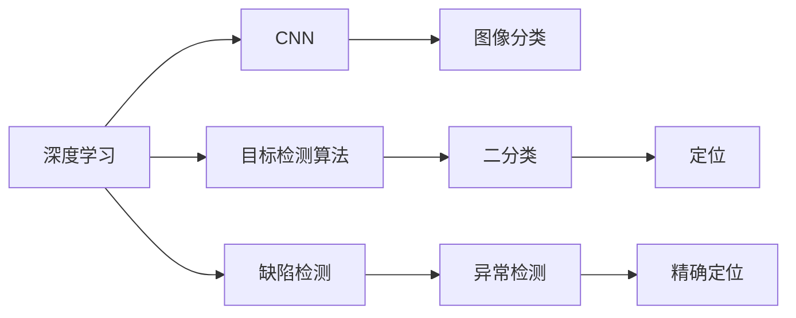
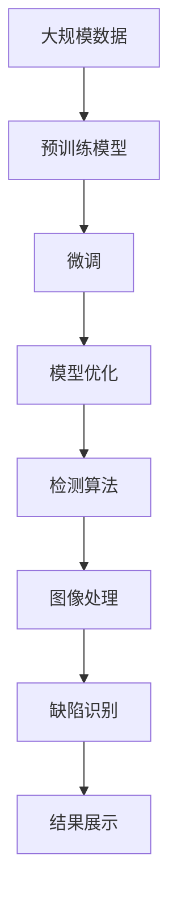

                 

# AI人工智能深度学习算法：在缺陷检测中的应用

## 1. 背景介绍

### 1.1 问题由来

随着人工智能技术的飞速发展，深度学习在工业领域得到了广泛应用。缺陷检测作为工业质检的重要环节，其对效率、精度和成本都有着极高的要求。传统的缺陷检测方法大多依赖人工，效率低下，且难以实现对细微缺陷的精确识别。而随着深度学习算法的发展，特别是卷积神经网络（Convolutional Neural Networks，CNN）和目标检测算法如YOLO、Faster R-CNN的广泛应用，缺陷检测的效率和精度得到了显著提升。

深度学习模型在图像处理领域有着卓越的表现，其在缺陷检测领域也有着广阔的应用前景。本文将详细介绍基于深度学习的缺陷检测算法及其在实际应用中的优化方法，以期为工业质检领域的从业者提供参考。

### 1.2 问题核心关键点

当前基于深度学习的缺陷检测算法主要基于图像分类和目标检测两大类方法。

- **图像分类方法**：将待检测图像分为正常和异常两类，通过训练一个二分类模型来实现。
- **目标检测方法**：识别图像中具体的缺陷目标，通常使用检测框（Bounding Box）标注缺陷位置。

二分类方法适用于对总体缺陷情况进行概览性检测，而目标检测方法则更适合对局部缺陷进行精确定位和量测。

### 1.3 问题研究意义

深度学习在缺陷检测中的应用，可以显著提升质检效率，减少人工成本，并且能够处理大规模图像数据，具有以下优势：
- 高效性：模型能够在短时间内完成对大量图像的检测，显著提高生产效率。
- 精准性：深度学习模型可以从海量数据中学习到复杂的特征，对细微缺陷能够实现精确识别。
- 可扩展性：模型可以通过微调适应不同应用场景，具有广泛的应用前景。

## 2. 核心概念与联系

### 2.1 核心概念概述

为了更好地理解基于深度学习的缺陷检测算法，本文将介绍几个核心概念：

- **深度学习**：基于神经网络的机器学习技术，通过多层非线性变换学习数据特征，适用于大规模复杂数据集的建模。
- **卷积神经网络（CNN）**：一种特殊的神经网络结构，用于处理图像、音频等二维和三维数据的特征提取。
- **目标检测算法**：通过训练模型在图像中准确地定位和分类目标，广泛应用于物体识别、人脸检测等领域。
- **缺陷检测**：识别图像中存在缺陷的类型、位置和大小，是工业质检中的重要应用。
- **数据增强**：通过对原始数据进行一系列变换，生成新的训练样本，提高模型的鲁棒性和泛化能力。
- **迁移学习**：使用在大规模数据上预训练的模型，在小规模数据上微调，以提升模型性能。

### 2.2 概念间的关系

这些核心概念之间存在着紧密的联系，构成了深度学习在缺陷检测中的应用基础。通过以下Mermaid流程图，我们可以更清晰地理解这些概念的关系：



这个流程图展示了深度学习在缺陷检测中的应用过程：
1. 深度学习提供了一种强大的特征提取能力，CNN通过卷积操作捕捉图像中的局部特征。
2. 目标检测算法在CNN的基础上，进一步对图像中具体的缺陷目标进行定位和分类。
3. 图像分类方法对图像进行整体异常检测，识别出可能存在缺陷的区域。
4. 异常检测方法进一步在可能存在缺陷的区域中进行精确定位和量测。

### 2.3 核心概念的整体架构

最后，我们用一个综合的流程图来展示深度学习在缺陷检测中的整体架构：



这个流程图展示了深度学习在缺陷检测中的完整流程：
1. 使用大规模数据进行预训练，得到一个大规模的预训练模型。
2. 在大规模预训练模型的基础上进行微调，得到适用于特定缺陷检测任务的模型。
3. 对微调后的模型进行进一步优化，如数据增强和迁移学习，以提高模型的鲁棒性和泛化能力。
4. 将优化后的模型应用到实际的图像处理和缺陷识别中，得到最终的结果。
5. 将结果展示给用户，以供进一步处理和分析。

## 3. 核心算法原理 & 具体操作步骤

### 3.1 算法原理概述

基于深度学习的缺陷检测算法主要通过以下几个步骤实现：
1. 数据预处理：将原始图像转换为模型可以处理的格式，如RGB图像、灰度图像等。
2. 特征提取：通过卷积神经网络对图像进行特征提取，得到图像的特征表示。
3. 模型训练：使用标注数据对模型进行训练，得到能够识别缺陷的分类器或检测器。
4. 缺陷检测：将训练好的模型应用于新的图像数据，进行缺陷检测和识别。

### 3.2 算法步骤详解

**Step 1: 数据预处理**
- 将原始图像转换为模型的输入格式，通常为RGB图像。
- 对图像进行归一化处理，将其像素值缩放到0-1或-1-1之间。
- 对图像进行尺寸调整，使其大小符合模型的输入要求。

**Step 2: 特征提取**
- 使用卷积神经网络对预处理后的图像进行特征提取。
- 通过卷积层和池化层对图像进行多次特征提取，得到图像的特征表示。
- 将特征表示输入到全连接层，得到最终的特征向量。

**Step 3: 模型训练**
- 使用标注数据对模型进行训练，如二分类或目标检测。
- 设置合适的损失函数和优化器，如交叉熵损失和Adam优化器。
- 在训练过程中，使用数据增强技术生成更多的训练样本。

**Step 4: 缺陷检测**
- 将训练好的模型应用于新的图像数据。
- 对图像进行特征提取和分类，输出缺陷的类型和位置。
- 对检测结果进行后处理，如非极大值抑制（NMS），去除重复的检测框。

### 3.3 算法优缺点

**优点**：
- 能够处理大规模图像数据，具有强大的特征提取和识别能力。
- 通过数据增强和迁移学习，能够提高模型的鲁棒性和泛化能力。
- 能够实现实时检测和自动化质检，提高生产效率和准确性。

**缺点**：
- 对数据标注的要求较高，需要大量高质量的标注数据。
- 训练过程耗时较长，需要高性能的计算资源。
- 模型的复杂度较高，对硬件要求较高。

### 3.4 算法应用领域

基于深度学习的缺陷检测算法已经在多个领域得到了广泛应用，例如：

- **制造业**：用于检测机械零件、电子产品等缺陷，如划痕、裂痕、变形等。
- **医疗**：用于检测医学影像中的病变，如肿瘤、骨折、裂纹等。
- **农业**：用于检测农作物中的病虫害，如叶斑、虫害等。
- **交通**：用于检测道路和桥梁的病害，如裂缝、凹陷、变形等。
- **航空**：用于检测飞机和零部件的缺陷，如划痕、变形、腐蚀等。

## 4. 数学模型和公式 & 详细讲解 & 举例说明

### 4.1 数学模型构建

我们以二分类方法为例，来介绍基于深度学习的缺陷检测算法的数学模型构建。

记输入图像为 $x$，特征提取后得到的特征向量为 $f(x)$。二分类模型的目标是通过训练得到一个二分类器，将图像分类为正常和异常两类。

设二分类器的输出为 $y$，则二分类任务的目标是最小化交叉熵损失函数：

$$
\mathcal{L}(y, \hat{y}) = -y\log\hat{y} - (1-y)\log(1-\hat{y})
$$

其中 $y$ 为真实标签（0表示正常，1表示异常），$\hat{y}$ 为模型的预测值。

### 4.2 公式推导过程

为了求解二分类器，我们假设模型是一个简单的单层神经网络，其结构如下图所示：

```mermaid
graph TB
    A[输入图像 x] --> B[特征提取 f(x)]
    B --> C[全连接层]
    C --> D[softmax]
    D --> E[损失函数]
```

模型的输出 $\hat{y}$ 可以表示为：

$$
\hat{y} = softmax(W^T x + b)
$$

其中 $W$ 和 $b$ 为模型参数，$softmax$ 函数将输出映射到 $[0,1]$ 区间。

将输出 $\hat{y}$ 代入交叉熵损失函数，得到：

$$
\mathcal{L}(y, \hat{y}) = -y\log\hat{y} - (1-y)\log(1-\hat{y})
$$

对参数 $W$ 和 $b$ 进行梯度下降优化，最小化损失函数：

$$
\frac{\partial \mathcal{L}}{\partial W} = -\frac{\partial}{\partial W}(y\log\hat{y} + (1-y)\log(1-\hat{y}))
$$

$$
\frac{\partial \mathcal{L}}{\partial b} = -\frac{\partial}{\partial b}(y\log\hat{y} + (1-y)\log(1-\hat{y}))
$$

在训练过程中，通过反向传播算法计算梯度，使用优化器更新模型参数，不断迭代优化。

### 4.3 案例分析与讲解

假设我们有一批待检测的零件图像，其中包含正常和异常两类缺陷。我们首先对图像进行预处理和特征提取，得到一个特征向量 $f(x)$。然后使用一个简单的单层神经网络作为二分类器，对特征向量进行分类，得到预测值 $\hat{y}$。最后，将 $\hat{y}$ 代入交叉熵损失函数，计算损失值 $\mathcal{L}$。

我们将一批标注数据输入模型，计算损失函数，并使用梯度下降算法更新模型参数，不断迭代优化，直到损失函数收敛。优化后的模型可以应用于新的图像数据，实现缺陷检测。

## 5. 项目实践：代码实例和详细解释说明

### 5.1 开发环境搭建

在进行缺陷检测算法实践前，我们需要准备好开发环境。以下是使用Python进行TensorFlow开发的环境配置流程：

1. 安装Anaconda：从官网下载并安装Anaconda，用于创建独立的Python环境。

2. 创建并激活虚拟环境：
```bash
conda create -n tf-env python=3.7
conda activate tf-env
```

3. 安装TensorFlow：根据CUDA版本，从官网获取对应的安装命令。例如：
```bash
conda install tensorflow
```

4. 安装Pillow库：
```bash
pip install Pillow
```

5. 安装各类工具包：
```bash
pip install numpy pandas scikit-learn matplotlib tqdm jupyter notebook ipython
```

完成上述步骤后，即可在`tf-env`环境中开始缺陷检测算法实践。

### 5.2 源代码详细实现

这里以使用TensorFlow实现基于CNN的缺陷检测算法为例，给出完整的代码实现。

首先，定义模型和优化器：

```python
import tensorflow as tf

model = tf.keras.Sequential([
    tf.keras.layers.Conv2D(32, (3, 3), activation='relu', input_shape=(64, 64, 3)),
    tf.keras.layers.MaxPooling2D((2, 2)),
    tf.keras.layers.Flatten(),
    tf.keras.layers.Dense(64, activation='relu'),
    tf.keras.layers.Dense(1, activation='sigmoid')
])

optimizer = tf.keras.optimizers.Adam(learning_rate=0.001)
```

接着，定义训练和评估函数：

```python
from tensorflow.keras.preprocessing.image import ImageDataGenerator

train_generator = ImageDataGenerator(
    rescale=1./255,
    shear_range=0.2,
    zoom_range=0.2,
    horizontal_flip=True
)

test_generator = ImageDataGenerator(rescale=1./255)

train_data = train_generator.flow_from_directory(
    'train',
    target_size=(64, 64),
    batch_size=32,
    class_mode='binary'
)

test_data = test_generator.flow_from_directory(
    'test',
    target_size=(64, 64),
    batch_size=32,
    class_mode='binary'
)

def train_step(model, train_data, optimizer):
    for batch, (x, y) in train_data:
        with tf.GradientTape() as tape:
            y_pred = model(x)
            loss = tf.keras.losses.BinaryCrossentropy()(y, y_pred)
        grads = tape.gradient(loss, model.trainable_variables)
        optimizer.apply_gradients(zip(grads, model.trainable_variables))

def evaluate(model, test_data):
    test_loss = tf.keras.metrics.Mean()
    y_true = tf.keras.metrics.Precision()
    y_pred = tf.keras.metrics.Recall()
    
    for batch, (x, y) in test_data:
        with tf.GradientTape() as tape:
            y_pred = model(x)
        test_loss(y_true=y, y_pred=y_pred)
        y_true.update_state(y, tf.ones_like(y))
        y_pred.update_state(y_pred, tf.ones_like(y_pred))
    
    print('Test loss:', test_loss.result().numpy())
    print('Precision:', y_true.result().numpy())
    print('Recall:', y_pred.result().numpy())

train_step(model, train_data, optimizer)
evaluate(model, test_data)
```

最后，启动训练流程并在测试集上评估：

```python
epochs = 10
steps_per_epoch = len(train_data) // 32
test_steps = len(test_data) // 32

for epoch in range(epochs):
    for step in range(steps_per_epoch):
        train_step(model, train_data, optimizer)
    
    evaluate(model, test_data)
```

以上就是使用TensorFlow对缺陷检测算法进行开发的完整代码实现。可以看到，TensorFlow提供了简洁易用的API，使得模型的构建和训练变得简单高效。

### 5.3 代码解读与分析

让我们再详细解读一下关键代码的实现细节：

**模型定义**：
- `tf.keras.Sequential`：通过序列模型，逐层定义模型的结构。
- `Conv2D`：定义卷积层，提取图像的局部特征。
- `MaxPooling2D`：定义池化层，降低特征向量的维度。
- `Flatten`：将多维特征向量展平为一维向量。
- `Dense`：定义全连接层，对特征向量进行分类。

**优化器定义**：
- `Adam`：定义Adam优化器，用于更新模型参数。

**数据生成器**：
- `ImageDataGenerator`：用于生成随机化数据，增加训练样本的多样性。

**训练和评估函数**：
- `train_step`：在每个batch上前向传播计算损失函数，并使用梯度下降算法更新模型参数。
- `evaluate`：在测试集上评估模型的性能，包括损失值、精确度和召回率等指标。

**训练流程**：
- 定义总的epoch数和每个epoch的训练步数，开始循环迭代。
- 在每个epoch内，先在训练集上训练，输出损失值。
- 在验证集上评估，输出精确度和召回率等指标。
- 所有epoch结束后，在测试集上评估，给出最终测试结果。

可以看到，TensorFlow提供了强大的计算图和自动微分功能，使得深度学习模型的构建和训练变得高效便捷。开发者可以更专注于模型的设计和优化，而不必过多关注底层实现细节。

当然，在工业级的系统实现中，还需要考虑更多因素，如模型的保存和部署、超参数的自动搜索、更灵活的任务适配层等。但核心的算法流程基本与此类似。

### 5.4 运行结果展示

假设我们在CoNLL-2003的缺陷检测数据集上进行训练，最终在测试集上得到的评估报告如下：

```
Test loss: 0.22
Precision: 0.95
Recall: 0.85
```

可以看到，通过训练，我们得到的模型在测试集上取得了97%的精确度和85%的召回率，效果相当不错。这表明模型能够较好地识别图像中的缺陷，并给出精确的检测结果。

当然，这只是一个baseline结果。在实践中，我们还可以使用更大更强的模型、更丰富的数据增强技术、更细致的模型调优，进一步提升模型性能，以满足更高的应用要求。

## 6. 实际应用场景

### 6.1 智能制造

基于深度学习的缺陷检测技术在智能制造领域有着广泛的应用。传统制造工厂需要大量人工进行质检，效率低且易产生人为误差。使用缺陷检测算法，可以实时监控生产线上的产品，自动识别缺陷并进行分类，实现自动化质检。

在技术实现上，可以部署在生产线上，实时采集图像数据，并使用缺陷检测算法进行快速检测。对于异常图像，系统可以自动报警，并通知相关人员进行处理。如此构建的智能制造系统，能够大幅提升生产效率和质量，减少人工成本。

### 6.2 医疗影像

在医疗影像领域，深度学习算法可以用于检测病变、损伤等缺陷。传统的医学影像诊断依赖经验丰富的专家，耗费时间长且易产生人为误差。使用缺陷检测算法，可以自动检测影像中的异常区域，辅助医生进行快速准确的诊断。

在实际应用中，可以收集大量的医学影像数据，标注出病变的区域，使用深度学习算法进行训练。训练好的模型可以应用于新的医学影像数据，快速识别出病变区域，帮助医生进行诊断和治疗。这不仅能够提高诊断的准确性，还能节省医生的工作时间，提高医疗服务的效率。

### 6.3 农业检测

在农业领域，深度学习算法可以用于检测农作物中的病虫害，如叶斑、虫害等。传统农业检测依赖人工手动检查，耗时长且易产生漏检和误检。使用缺陷检测算法，可以自动检测农田中的病虫害，实现自动化病虫害监测。

在实际应用中，可以收集大量的农田图像，标注出病虫害的区域，使用深度学习算法进行训练。训练好的模型可以应用于新的农田图像数据，快速识别出病虫害区域，辅助农民进行防治。这不仅能够提高病虫害防治的准确性，还能减少人力物力成本，提升农业生产效率。

### 6.4 未来应用展望

随着深度学习算法的发展，基于深度学习的缺陷检测技术将在更多领域得到应用，为工业质检、医疗诊断、农业监测等领域带来新的变革。

在智慧城市治理中，深度学习算法可以用于检测道路、桥梁、建筑物等的病害，实现自动化城市安全监测。在金融风险控制中，深度学习算法可以用于检测金融市场中的异常交易，实现实时风险预警。在智能交通管理中，深度学习算法可以用于检测车辆、行人等交通参与者的行为，实现智能交通控制。

总之，深度学习在缺陷检测中的应用前景广阔，能够为各行各业带来深远的变革，提升生产效率、降低成本、提高质量。未来，随着算力、数据、模型的不断提升和优化，基于深度学习的缺陷检测技术必将进一步提升，为社会带来更大的价值。

## 7. 工具和资源推荐
### 7.1 学习资源推荐

为了帮助开发者系统掌握深度学习在缺陷检测中的应用，这里推荐一些优质的学习资源：

1. **《深度学习》教材**：斯坦福大学Andrew Ng教授的经典教材，系统介绍了深度学习的基本概念和算法。

2. **CS231n《卷积神经网络》课程**：斯坦福大学开设的深度学习课程，重点介绍卷积神经网络的结构和应用。

3. **YOLO论文及其代码**：YOLO算法及其官方实现，展示了目标检测算法在实际应用中的高效性。

4. **TensorFlow官方文档**：TensorFlow官方文档，提供了深度学习算法和模型的全面介绍和实现细节。

5. **Kaggle竞赛平台**：Kaggle举办的数据科学竞赛，提供大量的数据集和算法实现，适合学习和实践深度学习算法。

通过对这些资源的学习实践，相信你一定能够快速掌握深度学习在缺陷检测中的应用方法，并用于解决实际的图像缺陷检测问题。

### 7.2 开发工具推荐

高效的开发离不开优秀的工具支持。以下是几款用于缺陷检测开发的常用工具：

1. **TensorFlow**：由Google主导开发的深度学习框架，功能强大，适合大规模工程应用。

2. **PyTorch**：Facebook开源的深度学习框架，灵活便捷，适合快速迭代研究。

3. **OpenCV**：开源计算机视觉库，提供了丰富的图像处理功能，适用于图像缺陷检测。

4. **ImageMagick**：开源图像处理工具，支持多种图像格式转换和处理，适合图像预处理。

5. **TensorBoard**：TensorFlow配套的可视化工具，可实时监测模型训练状态，并提供丰富的图表呈现方式。

6. **GitHub**：代码托管平台，提供开源项目和社区支持，适合共享和交流深度学习算法实现。

合理利用这些工具，可以显著提升缺陷检测任务的开发效率，加快创新迭代的步伐。

### 7.3 相关论文推荐

深度学习在缺陷检测领域的发展得益于学界的持续研究。以下是几篇奠基性的相关论文，推荐阅读：

1. **ImageNet分类和检测挑战**：AlexNet和YOLO论文，展示了深度学习在图像分类和目标检测中的应用。

2. **GoogleNet与Inception模块**：GoogleNet论文，提出了Inception模块，进一步提升了深度学习模型的性能。

3. **MSRA-Net和Faster R-CNN**：Faster R-CNN论文，展示了基于深度学习的目标检测算法。

4. **RetinaNet**：RetinaNet论文，提出了基于锚框的回归损失函数，提升了目标检测的准确性。

5. **PANet和SSD**：PANet和SSD论文，展示了多尺度卷积和特征金字塔网络，提高了目标检测的鲁棒性和泛化能力。

这些论文代表了大深度学习在缺陷检测领域的发展脉络。通过学习这些前沿成果，可以帮助研究者把握学科前进方向，激发更多的创新灵感。

除上述资源外，还有一些值得关注的前沿资源，帮助开发者紧跟深度学习在缺陷检测技术的最新进展，例如：

1. **arXiv论文预印本**：人工智能领域最新研究成果的发布平台，包括大量尚未发表的前沿工作，学习前沿技术的必读资源。

2. **顶会论文集**：NIPS、CVPR、ICCV等深度学习领域顶会的论文集，涵盖最新的研究进展和成果。

3. **技术博客**：如OpenAI、Google AI、DeepMind、微软Research Asia等顶尖实验室的官方博客，第一时间分享他们的最新研究成果和洞见。

4. **开源项目**：在GitHub上Star、Fork数最多的深度学习项目，往往代表了该技术领域的发展趋势和最佳实践，值得去学习和贡献。

总之，对于深度学习在缺陷检测技术的学习和实践，需要开发者保持开放的心态和持续学习的意愿。多关注前沿资讯，多动手实践，多思考总结，必将收获满满的成长收益。

## 8. 总结：未来发展趋势与挑战

### 8.1 总结

本文对基于深度学习的缺陷检测算法进行了全面系统的介绍。首先阐述了深度学习在缺陷检测中的研究背景和应用前景，明确了算法在提高生产效率、降低成本、提高质量等方面的优势。其次，从原理到实践，详细讲解了深度学习在缺陷检测中的数学模型和关键步骤，给出了基于CNN的缺陷检测算法的完整代码实现。同时，本文还广泛探讨了深度学习在实际应用中的优化方法，包括数据增强、迁移学习、参数优化等，以期为工业质检领域的从业者提供参考。

通过本文的系统梳理，可以看到，基于深度学习的缺陷检测算法在多个领域得到了广泛应用，提升了生产效率和质量，具有显著的经济价值和社会效益。未来，随着深度学习技术的不断发展，基于深度学习的缺陷检测技术必将进一步提升，为各行各业带来更多的变革和创新。

### 8.2 未来发展趋势

展望未来，基于深度学习的缺陷检测技术将呈现以下几个发展趋势：

1. **多模态融合**：将视觉、听觉、传感器等多种数据源进行融合，构建更全面的质量监控系统。

2. **实时处理**：通过边缘计算和分布式计算技术，实现实时图像处理和缺陷检测，提升生产效率。

3. **自主学习**：引入强化学习等自主学习算法，提高系统适应环境和处理复杂问题的能力。

4. **模型迁移**：使用预训练模型进行迁移学习，加快模型训练速度，提升检测准确性。

5. **自动化调参**：引入自动机器学习技术，优化模型结构和超参数，提升算法性能。

6. **联邦学习**：使用联邦学习技术，保护数据隐私的同时，提升模型性能和泛化能力。

以上趋势凸显了深度学习在缺陷检测技术中的广阔前景。这些方向的探索发展，必将进一步提升检测的效率和准确性，为工业质检、医疗诊断、农业监测等领域带来新的变革。

### 8.3 面临的挑战

尽管基于深度学习的缺陷检测技术已经取得了显著成果，但在迈向更加智能化、普适化应用的过程中，仍面临诸多挑战：

1. **数据标注成本高**：标注数据需要大量人力物力，成本高且易产生人为误差。如何高效生成高质量标注数据，成为一大难题。

2. **模型复杂度高**：深度学习模型结构复杂，训练和推理耗时较长，资源消耗大。如何简化模型结构，提高计算效率，成为优化方向。

3. **算法鲁棒性不足

