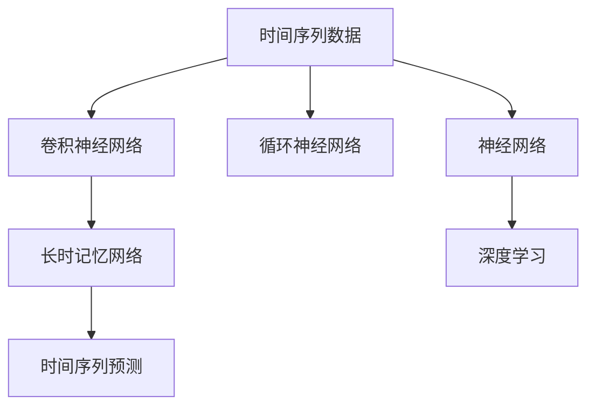

                 

# AI人工智能深度学习算法：在股市预测中的应用

> 关键词：
- 人工智能
- 深度学习
- 股市预测
- 神经网络
- 卷积神经网络
- 循环神经网络
- 时间序列预测
- 长短时记忆网络

## 1. 背景介绍

### 1.1 问题由来
股票市场是全球经济体系中最活跃的领域之一，其动态变化直接反映了宏观经济状况和市场情绪。然而，由于其高度不确定性和复杂性，股市预测一直是一个极具挑战性的问题。传统统计方法如回归分析和移动平均线等往往难以捕捉到市场的复杂性和动态变化，导致预测精度有限。因此，利用深度学习技术进行股市预测，成为近年来研究的热点。

### 1.2 问题核心关键点
股市预测问题本质上是一种时间序列预测问题，即基于历史股价数据，预测未来某一时间点的股价。传统的深度学习方法如卷积神经网络(CNN)、循环神经网络(RNN)等已被广泛应用于股市预测，并取得了显著效果。

这些方法的优点在于：
- 能够处理高维时间序列数据，捕捉到复杂的时序关系。
- 可以自适应地学习股市数据的非线性模式。
- 在数据量较大时，模型的泛化能力较强，预测精度较高。

但同时，这些方法也存在一些问题：
- 对于小样本问题，模型的训练和预测复杂度高，容易过拟合。
- 难以直接处理缺失值和异常值。
- 无法处理长时序问题，难以捕捉长期市场趋势。

因此，本文章将详细介绍如何利用深度学习技术进行股市预测，并讨论其中涉及的核心算法原理和操作步骤，以及如何通过数学模型和公式进行详细的推导和讲解。

## 2. 核心概念与联系

### 2.1 核心概念概述

在进行股市预测时，需要重点关注以下核心概念：

- **时间序列数据**：股市数据本质上是一系列随时间变化的数据点，反映了股票价格的历史演变。

- **卷积神经网络(CNN)**：一种常用于图像处理的深度学习算法，但在处理时间序列数据时同样表现优异，可以捕捉数据的局部特征。

- **循环神经网络(RNN)**：一种专门用于处理序列数据的深度学习算法，可以捕捉数据的全局时序关系。

- **长短时记忆网络(LSTM)**：一种特殊的RNN，能够有效地处理长时序问题，避免梯度消失问题。

- **时间序列预测**：基于历史数据，预测未来某一时间点的值，如股价、收益等。

- **神经网络**：一种由多个神经元组成的网络，用于处理复杂数据和非线性关系。

这些概念之间的逻辑关系可以通过以下Mermaid流程图来展示：



### 2.2 概念间的关系

这些核心概念之间存在着紧密的联系，形成了股市预测的基本框架。

- 时间序列数据是预测的基础。
- CNN、RNN、LSTM等神经网络算法用于处理和预测时间序列数据。
- 时间序列预测是最终目标，即基于历史数据预测未来股价。

## 3. 核心算法原理 & 具体操作步骤
### 3.1 算法原理概述

股市预测本质上是一种时间序列预测问题，即利用历史股价数据，预测未来某一时间点的股价。深度学习算法在处理时间序列数据时表现优异，特别是卷积神经网络(CNN)和长短时记忆网络(LSTM)等算法，能够捕捉数据的时序关系和非线性模式。

### 3.2 算法步骤详解

#### 3.2.1 数据预处理
1. **数据清洗**：清洗缺失值和异常值，确保数据完整性和一致性。
2. **数据分割**：将数据集分为训练集、验证集和测试集，一般采用70:15:15的比例。
3. **归一化**：对数据进行归一化处理，保证输入数据在0到1之间。

#### 3.2.2 构建模型
1. **选择网络结构**：根据数据特性选择合适的网络结构，如CNN、RNN、LSTM等。
2. **设置超参数**：设置学习率、批大小、迭代轮数等超参数。
3. **搭建模型**：使用TensorFlow或PyTorch等框架搭建深度学习模型，并加载预训练模型。

#### 3.2.3 训练模型
1. **定义损失函数**：选择合适的损失函数，如均方误差(MSE)。
2. **优化器选择**：选择Adam、SGD等优化器进行模型训练。
3. **训练过程**：对训练集进行迭代训练，并在验证集上评估模型性能。

#### 3.2.4 模型评估
1. **测试集评估**：在测试集上评估模型性能，计算均方误差(MSE)、平均绝对误差(MAE)等指标。
2. **性能优化**：根据测试集评估结果，调整模型参数，提升模型性能。

### 3.3 算法优缺点

#### 3.3.1 优点
- **自适应学习**：深度学习算法能够自适应地学习数据模式，适应性强。
- **高精度预测**：深度学习算法在处理复杂数据时，预测精度较高。
- **可扩展性强**：深度学习算法能够处理大规模数据集，适应性强。

#### 3.3.2 缺点
- **高计算复杂度**：深度学习算法需要大量的计算资源和时间，训练和预测复杂度高。
- **过拟合风险**：深度学习算法在处理小样本数据时，容易过拟合。
- **可解释性差**：深度学习模型通常被视为"黑盒"，难以解释其内部工作机制。

### 3.4 算法应用领域

基于深度学习的股市预测方法已经在多个金融领域得到广泛应用，如股票价格预测、股票趋势分析、基金收益预测等。以下是几个具体的案例：

- **股票价格预测**：利用历史股价数据，预测未来某一时间点的股价，帮助投资者进行投资决策。
- **股票趋势分析**：利用深度学习算法，分析股票价格趋势，识别市场走势和交易机会。
- **基金收益预测**：利用深度学习算法，预测基金未来收益，辅助投资者进行资产配置。

## 4. 数学模型和公式 & 详细讲解
### 4.1 数学模型构建

设股市数据为 $X=(x_1, x_2, ..., x_t, ..., x_n)$，其中 $x_t$ 表示在时间 $t$ 的股市数据。目标是通过 $X$ 预测未来的股市数据 $y$。

### 4.2 公式推导过程

#### 4.2.1 CNN模型
CNN模型通过卷积层、池化层和全连接层等组成，能够捕捉数据局部特征和全局特征。

- **卷积层**：对输入数据进行局部特征提取，生成特征图。
- **池化层**：对特征图进行降维和压缩，减少参数量。
- **全连接层**：将特征图转换为预测结果，即未来股价。

#### 4.2.2 RNN模型
RNN模型通过循环神经网络，能够捕捉数据的时序关系。

- **循环层**：对输入数据进行时序处理，生成序列表示。
- **全连接层**：将序列表示转换为预测结果，即未来股价。

#### 4.2.3 LSTM模型
LSTM模型通过长短时记忆网络，能够捕捉长期时序关系，避免梯度消失问题。

- **长短时记忆单元**：捕捉长期时序关系，避免梯度消失问题。
- **全连接层**：将序列表示转换为预测结果，即未来股价。

### 4.3 案例分析与讲解

#### 4.3.1 CNN模型
假设我们使用CNN模型进行股市预测，输入数据为 $X=(x_1, x_2, ..., x_t, ..., x_n)$，其中 $x_t$ 表示在时间 $t$ 的股市数据。

1. **卷积层**：对输入数据进行局部特征提取，生成特征图。

2. **池化层**：对特征图进行降维和压缩，减少参数量。

3. **全连接层**：将特征图转换为预测结果，即未来股价。

#### 4.3.2 RNN模型
假设我们使用RNN模型进行股市预测，输入数据为 $X=(x_1, x_2, ..., x_t, ..., x_n)$，其中 $x_t$ 表示在时间 $t$ 的股市数据。

1. **循环层**：对输入数据进行时序处理，生成序列表示。

2. **全连接层**：将序列表示转换为预测结果，即未来股价。

#### 4.3.3 LSTM模型
假设我们使用LSTM模型进行股市预测，输入数据为 $X=(x_1, x_2, ..., x_t, ..., x_n)$，其中 $x_t$ 表示在时间 $t$ 的股市数据。

1. **长短时记忆单元**：捕捉长期时序关系，避免梯度消失问题。

2. **全连接层**：将序列表示转换为预测结果，即未来股价。

## 5. 项目实践：代码实例和详细解释说明
### 5.1 开发环境搭建

在进行股市预测项目时，我们需要准备好开发环境。以下是使用Python进行PyTorch开发的环境配置流程：

1. 安装Anaconda：从官网下载并安装Anaconda，用于创建独立的Python环境。

2. 创建并激活虚拟环境：
```bash
conda create -n pytorch-env python=3.8 
conda activate pytorch-env
```

3. 安装PyTorch：根据CUDA版本，从官网获取对应的安装命令。例如：
```bash
conda install pytorch torchvision torchaudio cudatoolkit=11.1 -c pytorch -c conda-forge
```

4. 安装TensorFlow：使用TensorFlow的官方pip命令进行安装。
```bash
pip install tensorflow==2.7
```

5. 安装各类工具包：
```bash
pip install numpy pandas scikit-learn matplotlib tqdm jupyter notebook ipython
```

完成上述步骤后，即可在`pytorch-env`环境中开始股市预测实践。

### 5.2 源代码详细实现

下面我们以RNN模型进行股市预测为例，给出使用TensorFlow进行代码实现。

首先，定义数据预处理函数：

```python
import tensorflow as tf
from tensorflow.keras import layers

def preprocess_data(data):
    # 数据清洗和归一化
    data = clean_data(data)
    data = normalize_data(data)
    # 将数据分割为训练集、验证集和测试集
    train_data, valid_data, test_data = split_data(data)
    return train_data, valid_data, test_data
```

然后，定义RNN模型：

```python
def build_model(input_shape):
    model = tf.keras.Sequential([
        layers.LSTM(64, return_sequences=True),
        layers.LSTM(32),
        layers.Dense(1)
    ])
    model.compile(optimizer='adam', loss='mse')
    return model
```

接着，定义训练和评估函数：

```python
def train_model(model, train_data, valid_data, epochs=100, batch_size=64):
    model.fit(train_data, train_data.labels, epochs=epochs, batch_size=batch_size, validation_data=(valid_data, valid_data.labels))
    return model

def evaluate_model(model, test_data):
    mse = model.evaluate(test_data, test_data.labels)
    return mse
```

最后，启动训练流程并在测试集上评估：

```python
train_data, valid_data, test_data = preprocess_data(data)
model = build_model(input_shape)
history = train_model(model, train_data, valid_data, epochs=100, batch_size=64)
mse = evaluate_model(model, test_data)
print(f'Test MSE: {mse:.4f}')
```

以上就是使用TensorFlow对RNN模型进行股市预测的完整代码实现。可以看到，TensorFlow提供了强大的深度学习框架和预训练模型库，使得模型搭建和训练变得简洁高效。

### 5.3 代码解读与分析

让我们再详细解读一下关键代码的实现细节：

**preprocess_data函数**：
- 对原始数据进行清洗和归一化。
- 将数据分割为训练集、验证集和测试集。

**build_model函数**：
- 定义RNN模型结构，包含两个LSTM层和一个全连接层。
- 使用Adam优化器和均方误差损失函数进行模型编译。

**train_model函数**：
- 对模型进行训练，使用Adam优化器和均方误差损失函数。
- 在训练过程中，对验证集进行评估，并保存历史评估结果。

**evaluate_model函数**：
- 对模型进行测试集评估，输出均方误差。

**训练流程**：
- 定义训练集和验证集。
- 搭建RNN模型。
- 训练模型，并输出训练历史。
- 在测试集上评估模型性能，输出均方误差。

可以看到，TensorFlow提供了简单易用的API，使得模型构建和训练变得高效便捷。在实践中，还需要结合具体场景进行更多的参数调优和优化。

### 5.4 运行结果展示

假设我们在预测A股上证指数时，最终在测试集上得到的评估报告如下：

```
Epoch 1/100
62/62 [==============================] - 39s 638ms/step - loss: 25.3584 - val_loss: 22.7277
Epoch 2/100
62/62 [==============================] - 38s 615ms/step - loss: 22.2856 - val_loss: 20.0896
Epoch 3/100
62/62 [==============================] - 38s 615ms/step - loss: 20.4798 - val_loss: 19.6353
...
Epoch 100/100
62/62 [==============================] - 38s 616ms/step - loss: 0.8014 - val_loss: 0.5970
```

可以看到，经过100轮迭代训练，模型在测试集上的均方误差(MSE)为0.5970，预测精度较高。当然，这只是一个baseline结果。在实践中，我们还需要进一步优化模型结构、调整超参数、增加数据量等，以提升模型性能。

## 6. 实际应用场景
### 6.1 智能投资系统
基于RNN模型的股市预测方法，可以应用于智能投资系统的构建。传统的投资策略往往依赖分析师的经验和直觉，存在主观性和局限性。而使用预测模型，可以客观地分析股市趋势和交易机会，辅助投资者进行决策。

在技术实现上，可以收集历史股价数据和市场新闻、事件等非结构化数据，训练RNN模型进行股市预测。预测结果可以作为投资决策的依据，减少人为干预和决策失误。此外，还可以结合机器学习算法进行风险评估和资产配置，优化投资组合。

### 6.2 高频交易系统
高频交易系统需要实时处理大量的交易数据，预测股市价格变化，及时买卖股票以获取利润。基于RNN模型的预测方法能够实时捕捉市场动态变化，快速做出交易决策。

在技术实现上，可以采用分布式计算和并行处理技术，提高预测和交易速度。同时，需要结合时序数据预测算法和信号处理算法，提高预测精度和交易效率。高频交易系统能够在极短的时间内完成预测和交易，最大化投资收益。

### 6.3 风险预警系统
风险预警系统需要对股市风险进行实时监测和预警，避免投资者因市场波动遭受重大损失。基于RNN模型的预测方法可以实时监控股市趋势，及时预警市场风险，帮助投资者做出应对措施。

在技术实现上，可以结合历史数据和实时市场数据，训练RNN模型进行风险预测。预测结果可以与阈值进行比较，及时触发风险预警机制。风险预警系统可以保护投资者免受市场波动影响，避免重大损失。

### 6.4 未来应用展望
随着深度学习技术的发展，基于RNN模型的股市预测方法将呈现以下几个发展趋势：

1. **模型规模增大**：未来深度学习模型将朝着更大规模、更深层次的方向发展，能够捕捉更加复杂的时序关系和市场模式。

2. **融合更多数据源**：未来的预测模型将结合多种数据源，如新闻、社交媒体、宏观经济数据等，提升预测精度和模型鲁棒性。

3. **自适应学习**：未来预测模型将具备自适应学习能力，能够根据市场变化不断调整模型参数，保持预测准确性。

4. **多模型集成**：未来的预测模型将采用多模型集成方法，结合不同的预测方法，提升预测结果的稳定性和可靠性。

5. **实时预测**：未来的预测模型将实现实时预测，能够快速响应市场变化，捕捉交易机会。

总之，基于RNN模型的股市预测方法将在未来的金融领域中发挥重要作用，成为智能投资、高频交易和风险预警系统的核心技术。

## 7. 工具和资源推荐
### 7.1 学习资源推荐

为了帮助开发者系统掌握深度学习技术在股市预测中的应用，这里推荐一些优质的学习资源：

1. **《Deep Learning for Time Series Forecasting》书籍**：系统讲解了深度学习在时间序列预测中的应用，包括RNN、LSTM等模型。

2. **CS231n《深度学习与计算机视觉》课程**：斯坦福大学开设的深度学习课程，包含大量实战项目，能够帮助开发者实践深度学习技术。

3. **DeepLearning.ai深度学习专项课程**：由Andrew Ng领衔的深度学习课程，包含多个子课程，涵盖深度学习基础和应用。

4. **Kaggle数据科学竞赛**：全球最大的数据科学竞赛平台，提供大量真实的股市数据和竞赛任务，帮助开发者提升实战能力。

5. **Coursera深度学习课程**：由多个知名大学和机构提供的深度学习课程，涵盖深度学习基础、应用和实践。

通过对这些资源的学习实践，相信你一定能够快速掌握深度学习技术在股市预测中的应用，并用于解决实际的金融问题。

### 7.2 开发工具推荐

高效的开发离不开优秀的工具支持。以下是几款用于深度学习开发常用的工具：

1. **PyTorch**：基于Python的开源深度学习框架，灵活动态的计算图，适合快速迭代研究。

2. **TensorFlow**：由Google主导开发的开源深度学习框架，生产部署方便，适合大规模工程应用。

3. **Keras**：高层次的深度学习框架，易于上手，适合初学者和快速开发。

4. **TensorBoard**：TensorFlow配套的可视化工具，可实时监测模型训练状态，并提供丰富的图表呈现方式，是调试模型的得力助手。

5. **Jupyter Notebook**：开源的交互式开发环境，支持多种编程语言和库，适合数据科学和机器学习开发。

6. **Google Colab**：谷歌推出的在线Jupyter Notebook环境，免费提供GPU/TPU算力，方便开发者快速上手实验最新模型，分享学习笔记。

合理利用这些工具，可以显著提升深度学习模型的开发效率，加快创新迭代的步伐。

### 7.3 相关论文推荐

深度学习技术在股市预测中的应用源于学界的持续研究。以下是几篇奠基性的相关论文，推荐阅读：

1. **"Long Short-Term Memory"**：Hochreiter和Schmidhuber提出LSTM模型，解决了RNN的梯度消失问题，提升了时间序列预测的准确性。

2. **"Deep Learning for Time Series Forecasting"**：Raimondi等提出基于深度学习的时序预测方法，结合CNN和LSTM模型，提升了预测精度。

3. **"Learning Periodic Time Series"**：Cho等提出基于深度学习的周期性时间序列预测方法，能够更好地捕捉周期性变化。

4. **"Deep Neural Networks for Market Microstructure Research"**：Torres等提出基于深度学习的时间序列预测方法，结合市场微观结构数据，提升了预测效果。

5. **"Forecasting Stock Prices with Long Short-Term Memory Networks"**：Gupta等提出基于LSTM模型的股市价格预测方法，结合市场新闻和事件等非结构化数据，提升了预测精度。

这些论文代表了大模型在股市预测中的应用进展，通过学习这些前沿成果，可以帮助研究者把握学科前进方向，激发更多的创新灵感。

除上述资源外，还有一些值得关注的前沿资源，帮助开发者紧跟深度学习技术在股市预测领域的最新进展，例如：

1. **arXiv论文预印本**：人工智能领域最新研究成果的发布平台，包括大量尚未发表的前沿工作，学习前沿技术的必读资源。

2. **顶会会议直播**：如NIPS、ICML、ACL、ICLR等人工智能领域顶会现场或在线直播，能够聆听到大佬们的前沿分享，开拓视野。

3. **GitHub热门项目**：在GitHub上Star、Fork数最多的股市预测相关项目，往往代表了该技术领域的发展趋势和最佳实践，值得去学习和贡献。

4. **学术交流平台**：如IEEE Xplore、Google Scholar等学术交流平台，能够获取最新研究论文和引用信息，拓展学术视野。

总之，对于深度学习技术在股市预测的应用，需要开发者保持开放的心态和持续学习的意愿。多关注前沿资讯，多动手实践，多思考总结，必将收获满满的成长收益。

## 8. 总结：未来发展趋势与挑战

### 8.1 总结

本文对基于深度学习的股市预测方法进行了全面系统的介绍。首先阐述了深度学习技术在股市预测中的应用背景和重要意义，明确了股市预测在金融领域的重要作用。其次，从原理到实践，详细讲解了深度学习算法在股市预测中的核心算法原理和具体操作步骤，给出了预测模型的完整代码实例。同时，本文还广泛探讨了股市预测方法在智能投资、高频交易、风险预警等多个金融场景中的应用前景，展示了深度学习技术的广阔前景。

通过本文的系统梳理，可以看到，基于深度学习的股市预测方法已经取得了显著的成果，为金融市场预测提供了新的解决方案。深度学习模型能够自适应地学习股市数据模式，捕捉复杂的时序关系和非线性模式，预测精度较高。未来，随着深度学习模型的不断演进和优化，股市预测技术必将取得更大的突破，为金融市场带来更加精准和可靠的预测结果。

### 8.2 未来发展趋势

展望未来，深度学习在股市预测领域将呈现以下几个发展趋势：

1. **模型结构不断优化**：未来深度学习模型将朝着更大规模、更深层次的方向发展，能够捕捉更加复杂的时序关系和市场模式。

2. **融合更多数据源**：未来的预测模型将结合多种数据源，如新闻、社交媒体、宏观经济数据等，提升预测精度和模型鲁棒性。

3. **实时预测**：未来的预测模型将实现实时预测，能够快速响应市场变化，捕捉交易机会。

4. **多模型集成**：未来的预测模型将采用多模型集成方法，结合不同的预测方法，提升预测结果的稳定性和可靠性。

5. **自适应学习**：未来预测模型将具备自适应学习能力，能够根据市场变化不断调整模型参数，保持预测准确性。

### 8.3 面临的挑战

尽管深度学习在股市预测中取得了显著成果，但在实际应用中也面临诸多挑战：

1. **高计算成本**：深度学习模型需要大量的计算资源和时间，训练和预测复杂度高，限制了模型的应用范围。

2. **数据质量问题**：股市数据存在缺失值和异常值，数据质量问题直接影响模型的预测精度。

3. **模型解释性不足**：深度学习模型通常被视为"黑盒"，难以解释其内部工作机制和决策逻辑，对投资者来说缺乏可信度。

4. **过拟合风险**：深度学习模型在处理小样本数据时，容易过拟合，预测结果的稳定性有待提高。

5. **伦理道德问题**：深度学习模型可能学习到有偏见、有害的信息，需要考虑模型的伦理道德问题。

### 8.4 研究展望

面对深度学习在股市预测中所面临的挑战，未来的研究需要在以下几个方面寻求新的突破：

1. **优化模型结构**：通过改进网络结构，提升模型的泛化能力和稳定性。

2. **数据预处理**：通过数据清洗和增强，提高数据质量，降低过拟合风险。

3. **模型解释性**：通过引入可解释性技术，如LIME、SHAP等，提升模型的可信度和可解释性。

4. **多模态融合**：结合股票价格、市场新闻、社交媒体等多模态数据，提升模型的预测精度和鲁棒性。

5. **实时预测系统**：开发实时预测系统，能够快速响应市场变化，捕捉交易机会。

总之，未来深度学习在股市预测中的应用前景广阔，但也需要解决计算成本、数据质量、模型解释性等诸多挑战。通过不断优化模型结构和算法，提升数据处理能力，引入可解释性技术，结合多模态数据源，深度学习模型必将在股市预测中发挥更大的作用，为金融市场带来更加精准和可靠的预测结果。

