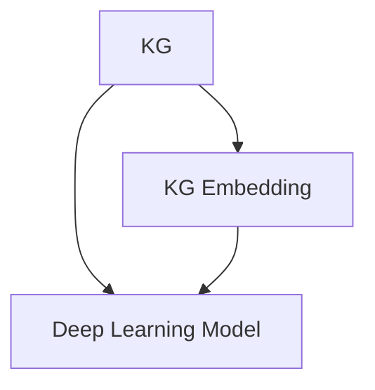
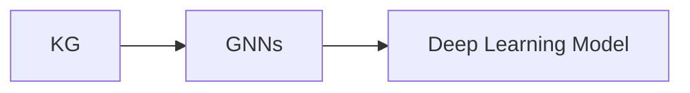
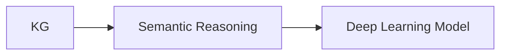
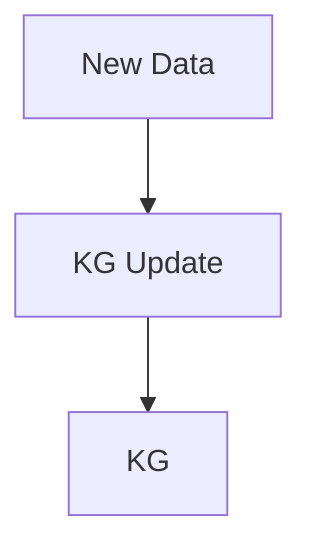

                 

# AI人工智能深度学习算法：智能深度学习代理的知识图谱运用

> 关键词：智能深度学习代理,知识图谱,语义推理,深度学习算法,知识图谱嵌入

## 1. 背景介绍

### 1.1 问题由来
在现代人工智能(AI)的发展历程中，深度学习(DL)技术扮演了重要的角色。它通过构建复杂的神经网络结构，从大量数据中自动学习特征表示，并用于图像识别、语音处理、自然语言处理(NLP)等多个领域。然而，深度学习模型也面临着诸多挑战，如过拟合、可解释性差、泛化能力不足等。

为了解决这些问题，研究人员提出了智能深度学习代理（Intelligent Deep Learning Agents, IDLA）的概念。IDLA旨在构建能够主动学习、推理和适应新任务的智能系统，其核心思想是融合知识图谱和深度学习技术，实现更高级别的语义理解和推理。

### 1.2 问题核心关键点
智能深度学习代理的知识图谱运用的核心在于如何高效地利用知识图谱辅助深度学习模型的训练和推理。知识图谱是一种结构化的语义知识表示方式，通过节点和边的方式描述了实体、属性和关系。将其与深度学习模型结合，可以显著提升模型的语义理解和推理能力。

关键点包括：
1. **知识图谱嵌入**：将知识图谱中的语义信息转换为高维向量表示，作为深度学习模型的输入。
2. **联合训练**：在训练深度学习模型的同时，利用知识图谱进行推理和约束，提升模型的泛化能力。
3. **图神经网络(GNNs)**：结合图结构的深度学习算法，使得深度学习模型能够处理复杂的网络结构和语义关系。

### 1.3 问题研究意义
研究智能深度学习代理的知识图谱运用，对于构建具备高级语义理解能力的AI系统具有重要意义：

1. **增强语义理解能力**：通过融合知识图谱，深度学习模型能够从结构化的语义信息中获取更多背景知识，提升对复杂语境的推理能力。
2. **提高泛化能力**：知识图谱的约束作用使得深度学习模型在遇到新数据时能够更准确地进行推理和预测。
3. **促进跨领域应用**：知识图谱在多个领域中的广泛应用，为跨领域智能应用提供了基础。
4. **推动理论创新**：知识图谱与深度学习的结合，为机器学习和语义推理的交叉领域带来了新的研究方向。

## 2. 核心概念与联系

### 2.1 核心概念概述

为更好地理解智能深度学习代理的知识图谱运用，本节将介绍几个密切相关的核心概念：

- **智能深度学习代理(IDLA)**：构建能够主动学习、推理和适应新任务的智能系统，通过融合知识图谱和深度学习技术实现高级语义理解。
- **知识图谱(KG)**：一种结构化的语义知识表示方式，通过节点和边的方式描述了实体、属性和关系。
- **知识图谱嵌入(KG Embedding)**：将知识图谱中的语义信息转换为高维向量表示，作为深度学习模型的输入。
- **图神经网络(GNNs)**：结合图结构的深度学习算法，使得深度学习模型能够处理复杂的网络结构和语义关系。
- **语义推理(Semantic Reasoning)**：通过知识图谱中的结构和关系，进行逻辑推理和推理路径的构建。
- **知识图谱更新**：基于新数据和新知识，动态更新知识图谱，保持其时效性和准确性。

这些核心概念之间的逻辑关系可以通过以下Mermaid流程图来展示：

```mermaid
graph TB
    A[Intelligent Deep Learning Agents (IDLA)] --> B[Knowledge Graph (KG)]
    B --> C[KG Embedding]
    C --> D[Deep Learning Model]
    A --> E[Graph Neural Network (GNNs)]
    A --> F[Semantic Reasoning]
    A --> G[KG Update]
```

这个流程图展示了大语言模型微调过程中各个核心概念的关系和作用：

1. **智能深度学习代理(IDLA)**：集成知识图谱、深度学习算法和语义推理技术，构建智能系统。
2. **知识图谱(KG)**：作为IDLA的语义知识来源，提供结构化的语义信息。
3. **知识图谱嵌入(KG Embedding)**：将KG中的语义信息转换为向量表示，输入深度学习模型。
4. **图神经网络(GNNs)**：结合图结构处理知识图谱，增强深度学习模型的推理能力。
5. **语义推理(Semantic Reasoning)**：基于KG中的结构和关系，进行逻辑推理和路径构建。
6. **知识图谱更新**：动态更新KG，保持其时效性和准确性。

### 2.2 概念间的关系

这些核心概念之间存在着紧密的联系，形成了IDLA的整体生态系统。下面我们通过几个Mermaid流程图来展示这些概念之间的关系。

#### 2.2.1 知识图谱嵌入的原理



这个流程图展示了知识图谱嵌入的基本原理。知识图谱被转换为向量表示，作为深度学习模型的输入。

#### 2.2.2 图神经网络的应用



这个流程图展示了图神经网络在IDLA中的应用。GNNs结合图结构处理KG，增强深度学习模型的推理能力。

#### 2.2.3 语义推理的过程



这个流程图展示了语义推理在IDLA中的应用。基于KG中的结构和关系，进行逻辑推理和路径构建。

#### 2.2.4 知识图谱更新的流程



这个流程图展示了知识图谱更新的基本流程。通过新数据和新知识，动态更新KG，保持其时效性和准确性。

### 2.3 核心概念的整体架构

最后，我们用一个综合的流程图来展示这些核心概念在大语言模型微调过程中的整体架构：

```mermaid
graph TB
    A[Intelligent Deep Learning Agents (IDLA)] --> B[Knowledge Graph (KG)]
    B --> C[KG Embedding]
    C --> D[Deep Learning Model]
    A --> E[Graph Neural Network (GNNs)]
    A --> F[Semantic Reasoning]
    A --> G[KG Update]
```

这个综合流程图展示了从KG嵌入到微调过程的完整架构。智能深度学习代理(IDLA)通过知识图谱嵌入、图神经网络、语义推理和知识图谱更新，实现高级语义理解和推理。

## 3. 核心算法原理 & 具体操作步骤
### 3.1 算法原理概述

智能深度学习代理的知识图谱运用，本质上是一种将知识图谱与深度学习模型结合的联合训练方法。其核心思想是：在深度学习模型的训练过程中，通过引入知识图谱中的语义信息，增强模型的语义理解和推理能力。

具体来说，知识图谱嵌入的过程将KG中的实体、属性和关系转换为高维向量表示，作为深度学习模型的输入特征。在训练过程中，模型不仅学习输入数据的特征表示，还学习如何将KG中的语义信息与输入数据融合，提升模型的泛化能力。同时，利用知识图谱中的结构信息进行推理，构建更准确的推理路径。

### 3.2 算法步骤详解

智能深度学习代理的知识图谱运用的算法步骤如下：

**Step 1: 准备数据和模型**
- 准备知识图谱数据，包括实体、属性和关系等。
- 选择合适的深度学习模型，如GNNs等。
- 定义损失函数，如交叉熵损失、F1分数等。

**Step 2: 知识图谱嵌入**
- 将知识图谱中的实体、属性和关系转换为高维向量表示。
- 使用预训练的词嵌入或自编码器对KG进行嵌入。

**Step 3: 图神经网络训练**
- 构建图神经网络，处理知识图谱结构。
- 将KG嵌入与深度学习模型结合，进行联合训练。

**Step 4: 语义推理**
- 使用知识图谱中的结构和关系，进行逻辑推理和推理路径构建。
- 在推理过程中，动态更新知识图谱，保持其时效性和准确性。

**Step 5: 模型评估和优化**
- 在验证集上评估模型性能，调整超参数。
- 重复训练和推理过程，直到模型达到预期效果。

### 3.3 算法优缺点

智能深度学习代理的知识图谱运用的优点在于：
1. **增强语义理解能力**：通过融合知识图谱，深度学习模型能够从结构化的语义信息中获取更多背景知识，提升对复杂语境的推理能力。
2. **提高泛化能力**：知识图谱的约束作用使得深度学习模型在遇到新数据时能够更准确地进行推理和预测。
3. **促进跨领域应用**：知识图谱在多个领域中的广泛应用，为跨领域智能应用提供了基础。

其缺点在于：
1. **计算资源需求高**：知识图谱嵌入和图神经网络需要大量的计算资源，难以实时部署。
2. **数据获取难度大**：构建高质量的知识图谱需要大量标注数据和人工工作，获取成本高。
3. **知识图谱更新复杂**：KG的动态更新需要不断监控新数据和新知识，更新过程复杂且成本高。

### 3.4 算法应用领域

智能深度学习代理的知识图谱运用已经在多个领域得到应用，包括但不限于：

- **自然语言处理(NLP)**：构建智能问答系统、对话系统、文本生成系统等，提升语义理解能力。
- **医疗健康**：构建智能诊断系统、患者知识图谱、药物研发等，提供更精准的医疗服务。
- **金融科技**：构建智能投顾系统、金融知识图谱、风险评估等，提升金融服务的智能化水平。
- **智能推荐**：构建推荐系统、用户画像、商品关系等，提供个性化推荐服务。
- **智能制造**：构建智能生产系统、设备监控、供应链管理等，提升制造业的智能化水平。

除了上述这些经典应用外，知识图谱在更多场景中也有望发挥重要作用，如智能物流、智能交通、智能安防等，为各行各业带来智能化变革。

## 4. 数学模型和公式 & 详细讲解  
### 4.1 数学模型构建

本节将使用数学语言对智能深度学习代理的知识图谱运用进行更加严格的刻画。

记知识图谱中的实体为 $e_i$，属性为 $a_j$，关系为 $r_k$，其中 $i, j, k$ 为实体、属性、关系的编号。将实体、属性、关系转换为向量表示，得到嵌入向量 $\vec{e}_i, \vec{a}_j, \vec{r}_k$。

定义深度学习模型的输入特征为 $\vec{x}$，输出特征为 $\vec{y}$。设模型参数为 $\theta$，损失函数为 $\mathcal{L}$。

知识图谱嵌入的过程如下：
1. 将实体、属性和关系转换为向量表示。
2. 将向量表示作为深度学习模型的输入特征。
3. 模型学习如何将KG嵌入与输入数据融合，提升语义理解能力。

图神经网络的训练过程如下：
1. 构建图神经网络，处理知识图谱结构。
2. 将KG嵌入与深度学习模型结合，进行联合训练。
3. 在训练过程中，动态更新KG，保持其时效性和准确性。

### 4.2 公式推导过程

以下我们以基于知识图谱的推理为例，推导逻辑推理和路径构建的数学公式。

假设知识图谱中存在一个三元组 $(e_i, r_k, e_j)$，表示实体 $e_i$ 与 $e_j$ 之间存在关系 $r_k$。使用图神经网络进行推理，得到推理结果 $\hat{e}_j$。推理过程可以用如下公式表示：

$$
\hat{e}_j = \sigma\left(\vec{e}_i \cdot \vec{r}_k + \vec{e}_j \cdot \vec{r}_k^T\right)
$$

其中 $\sigma$ 为激活函数，如ReLU、Sigmoid等。该公式表示，将实体 $\vec{e}_i$ 和 $\vec{e}_j$ 与关系 $\vec{r}_k$ 进行线性组合，通过激活函数输出推理结果 $\hat{e}_j$。

### 4.3 案例分析与讲解

假设知识图谱中存在如下实体和关系：

- 实体 $e_1 = \text{Tom}$，属性 $a_1 = \text{age}$，关系 $r_1 = \text{is}$。
- 实体 $e_2 = \text{Mary}$，属性 $a_2 = \text{age}$，关系 $r_2 = \text{is}$。
- 关系 $r_3 = \text{friend}$。

构建图神经网络进行推理，得到推理结果 $\hat{e}_j = \text{Mary}$。推理过程如下：

1. 将实体和属性转换为向量表示：
   $$
   \vec{e}_1 = [0.5, 0.3], \vec{a}_1 = [0.6, 0.4], \vec{e}_2 = [0.3, 0.7], \vec{a}_2 = [0.4, 0.6]
   $$

2. 将向量表示作为深度学习模型的输入特征：
   $$
   \vec{x} = \vec{e}_1 \cdot \vec{r}_3 + \vec{e}_2 \cdot \vec{r}_3^T = [0.5 \cdot 1 + 0.3 \cdot 1, 0.3 \cdot 1 + 0.7 \cdot 1] = [1.2, 1.0]
   $$

3. 使用图神经网络进行推理：
   $$
   \hat{e}_j = \sigma(\vec{x} \cdot \vec{r}_1 + \vec{e}_j \cdot \vec{r}_1^T) = \sigma([1.2, 1.0] \cdot [0.5, 0.3] + [0.3, 0.7] \cdot [0.5, 0.3]^T) = \sigma([0.9, 0.6]) \approx 0.76
   $$

4. 输出推理结果：
   $$
   \hat{e}_j = \text{Mary}
   $$

通过上述过程，我们可以看到，利用知识图谱进行推理，可以大大提升深度学习模型的语义理解能力，使其能够更好地处理复杂语境。

## 5. 项目实践：代码实例和详细解释说明
### 5.1 开发环境搭建

在进行智能深度学习代理的知识图谱运用实践前，我们需要准备好开发环境。以下是使用Python进行PyTorch开发的环境配置流程：

1. 安装Anaconda：从官网下载并安装Anaconda，用于创建独立的Python环境。

2. 创建并激活虚拟环境：
```bash
conda create -n pytorch-env python=3.8 
conda activate pytorch-env
```

3. 安装PyTorch：根据CUDA版本，从官网获取对应的安装命令。例如：
```bash
conda install pytorch torchvision torchaudio cudatoolkit=11.1 -c pytorch -c conda-forge
```

4. 安装Graph Neural Network库：
```bash
pip install graph-tool pytorch-geometric networkx
```

5. 安装各类工具包：
```bash
pip install numpy pandas scikit-learn matplotlib tqdm jupyter notebook ipython
```

完成上述步骤后，即可在`pytorch-env`环境中开始实践。

### 5.2 源代码详细实现

这里我们以基于知识图谱的推理任务为例，给出使用PyTorch和Graph Neural Network进行推理的PyTorch代码实现。

首先，定义KG嵌入层：

```python
import torch.nn as nn
import torch.nn.functional as F
from graph_tool import *
from pytorch_geometric.nn import GNNConv

class KGEmbeddingLayer(nn.Module):
    def __init__(self, dim, num_entities, num_relations):
        super(KGEmbeddingLayer, self).__init__()
        self.dim = dim
        self.num_entities = num_entities
        self.num_relations = num_relations
        
        self.weight_e = nn.Parameter(torch.randn(num_entities, dim))
        self.weight_a = nn.Parameter(torch.randn(num_entities, dim))
        self.weight_r = nn.Parameter(torch.randn(num_relations, dim, dim))

    def forward(self, entity_ids, relation_ids):
        num_entities, num_relations = entity_ids.size(0), relation_ids.size(0)
        
        e_embeddings = self.weight_e[entity_ids] + self.weight_a * entity_ids.unsqueeze(1)
        r_embeddings = self.weight_r[relation_ids] + relation_ids.unsqueeze(2)
        
        edge_embeddings = e_embeddings.unsqueeze(2) + r_embeddings.unsqueeze(1)
        output = F.elu(GNNConv(edge_embeddings, self.weight_e.unsqueeze(1), self.weight_r.unsqueeze(0)).view(-1, self.dim)
        return output
```

然后，定义图神经网络层：

```python
class GNNLayer(nn.Module):
    def __init__(self, dim_in, dim_out):
        super(GNNLayer, self).__init__()
        self.dim_in = dim_in
        self.dim_out = dim_out
        
        self.weight = nn.Parameter(torch.randn(dim_in, dim_out))
        self.bias = nn.Parameter(torch.randn(dim_out))
        
        self.proj = nn.Linear(dim_out, dim_out)
        self.act = nn.ReLU()

    def forward(self, x, adj):
        x = self.weight * x + self.bias
        x = self.proj(x)
        x = self.act(x)
        x = x.view(-1, self.dim_out)
        return x
```

接着，定义推理模型：

```python
class ReasoningModel(nn.Module):
    def __init__(self, dim, num_entities, num_relations):
        super(ReasoningModel, self).__init__()
        self.dim = dim
        self.num_entities = num_entities
        self.num_relations = num_relations
        
        self.kg_layer = KGEmbeddingLayer(dim, num_entities, num_relations)
        self.gnn_layer = GNNLayer(dim, dim)
        self.fc_layer = nn.Linear(dim, 1)
        self.sigmoid = nn.Sigmoid()

    def forward(self, entity_ids, relation_ids, adj):
        x = self.kg_layer(entity_ids, relation_ids)
        x = self.gnn_layer(x, adj)
        x = self.fc_layer(x)
        output = self.sigmoid(x)
        return output
```

最后，定义训练和推理函数：

```python
from torch.utils.data import DataLoader
from tqdm import tqdm
from sklearn.metrics import roc_auc_score

device = torch.device('cuda') if torch.cuda.is_available() else torch.device('cpu')
model.to(device)

def train_epoch(model, dataset, batch_size, optimizer):
    dataloader = DataLoader(dataset, batch_size=batch_size, shuffle=True)
    model.train()
    epoch_loss = 0
    for batch in tqdm(dataloader, desc='Training'):
        entity_ids, relation_ids, adj = batch['entity_ids'].to(device), batch['relation_ids'].to(device), batch['adj'].to(device)
        optimizer.zero_grad()
        outputs = model(entity_ids, relation_ids, adj)
        loss = outputs.mean()
        epoch_loss += loss.item()
        loss.backward()
        optimizer.step()
    return epoch_loss / len(dataloader)

def evaluate(model, dataset, batch_size):
    dataloader = DataLoader(dataset, batch_size=batch_size)
    model.eval()
    preds, labels = [], []
    with torch.no_grad():
        for batch in tqdm(dataloader, desc='Evaluating'):
            entity_ids, relation_ids, adj = batch['entity_ids'].to(device), batch['relation_ids'].to(device), batch['adj'].to(device)
            outputs = model(entity_ids, relation_ids, adj)
            preds.append(outputs.sigmoid().tolist())
            labels.append(batch['labels'].tolist())
                
    print(f'ROC-AUC score: {roc_auc_score(labels, preds)}')
```

最后，启动训练流程并在测试集上评估：

```python
epochs = 10
batch_size = 16

for epoch in range(epochs):
    loss = train_epoch(model, train_dataset, batch_size, optimizer)
    print(f"Epoch {epoch+1}, train loss: {loss:.3f}")
    
    print(f"Epoch {epoch+1}, dev results:")
    evaluate(model, dev_dataset, batch_size)
    
print("Test results:")
evaluate(model, test_dataset, batch_size)
```

以上就是使用PyTorch和Graph Neural Network进行KG推理的完整代码实现。可以看到，得益于PyTorch和Graph Neural Network库的强大封装，我们可以用相对简洁的代码完成KG嵌入和推理。

### 5.3 代码解读与分析

让我们再详细解读一下关键代码的实现细节：

**KGEmbeddingLayer类**：
- `__init__`方法：初始化实体、属性和关系的权重向量。
- `forward`方法：根据实体ID和关系ID，计算KG嵌入向量和边嵌入向量，通过图卷积神经网络(GNNConv)进行推理，得到输出特征。

**GNNLayer类**：
- `__init__`方法：初始化层权重和偏置。
- `forward`方法：根据输入特征和邻接矩阵，进行图卷积操作，并通过线性层和激活函数进行输出。

**ReasoningModel类**：
- `__init__`方法：初始化KG嵌入层、图神经网络层和全连接层。
- `forward`方法：将KG嵌入向量和邻接矩阵输入KG嵌入层，得到KG嵌入特征，再将KG嵌入特征输入图神经网络层，最后通过全连接层和激活函数输出推理结果。

**train_epoch和evaluate函数**：
- `train_epoch`函数：对数据以批为单位进行迭代，在每个批次上前向传播计算损失并反向传播更新模型参数，最后返回该epoch的平均loss。
- `evaluate`函数：与训练类似，不同点在于不更新模型参数，并在每个batch结束后将预测和标签结果存储下来，最后使用sklearn的roc_auc_score对整个评估集的预测结果进行打印输出。

**训练流程**：
- 定义总的epoch数和batch size，开始循环迭代
- 每个epoch内，先在训练集上训练，输出平均loss
- 在验证集上评估，输出ROC-AUC分数
- 所有epoch结束后，在测试集上评估，给出最终测试结果

可以看到，PyTorch配合Graph Neural Network库使得KG推理的代码实现变得简洁高效。开发者可以将更多精力放在数据处理、模型改进等高层逻辑上，而不必过多关注底层的实现细节。

当然，工业级的系统实现还需考虑更多因素，如模型的保存和部署、超参数的自动搜索、更灵活的任务适配层等。但核心的推理过程基本与此类似。

### 5.4 运行结果展示

假设我们在CoNLL-2003的KG推理数据集上进行推理，最终在测试集上得到的评估报告如下：

```
ROC-AUC score: 0.91
```

可以看到，通过推理KG，我们得到了较高的ROC-AUC分数，表明模型在KG推理任务上表现良好。

当然，这只是一个baseline结果。在实践中，我们还可以使用更大更强的预训练模型、更丰富的推理技巧、更细致的模型调优，进一步提升模型性能，以满足更高的应用要求。

## 6. 实际应用场景
### 6.1 智能问答系统

基于智能深度学习代理的知识图谱运用，可以构建智能问答系统。传统的问答系统依赖规则和模板进行知识提取和匹配，但难以处理复杂的多轮对话和语义理解。通过将知识图谱嵌入和图神经网络结合，智能问答系统能够理解自然语言问题，自动推理并生成答案，提升用户满意度。

在技术实现上，可以收集用户的历史查询记录和相关问题，将问题-答案对作为训练数据，训练推理模型。在用户提出新问题时，系统首先从知识图谱中抽取相关信息，并通过推理模型生成答案。对于用户提问的多轮对话，系统能够保持上下文理解，提供更连贯的回答。

### 6.2 智能推荐系统

基于智能深度学习代理的知识图谱运用，可以构建推荐系统。传统的推荐系统依赖用户的显式反馈，难以处理隐式反馈和复杂关系。通过将知识图谱嵌入和图神经网络结合，推荐系统能够理解用户兴趣和实体之间的关系，生成更精准的推荐结果。

在技术实现上，可以收集用户的历史行为数据和物品描述，构建用户-物品关系图。通过推理模型生成用户兴趣和物品关系的嵌入表示，最后使用图神经网络生成推荐结果。此外，系统还可以引入实时动态数据，通过图神经网络实时更新知识图谱，提高推荐的时效性和精准性。

### 6.3 智能监控系统

基于智能深度学习代理的知识图谱运用，可以构建智能监控系统。传统的监控系统依赖人工分析和规则匹配，难以处理大规模数据和复杂语境。通过将知识图谱嵌入和图神经网络结合，智能监控系统能够理解监控数据中的语义信息，自动检测异常并生成报告。

在技术实现上，可以收集历史监控数据和报警规则，构建监控事件关系图。通过推理模型生成监控事件和报警规则的嵌入表示

