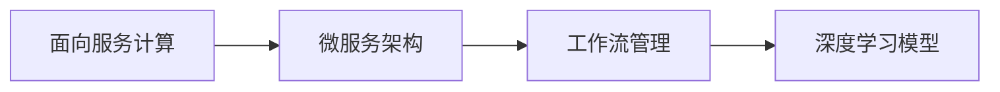
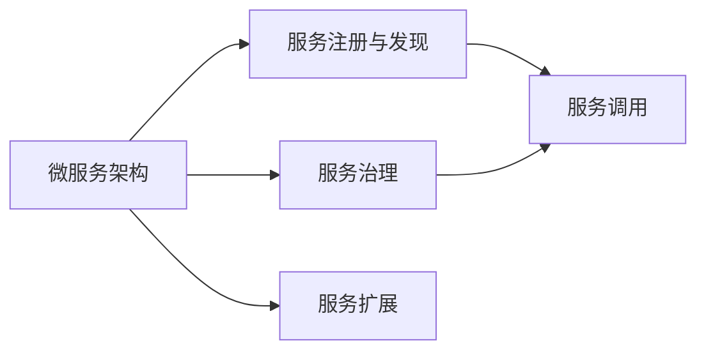
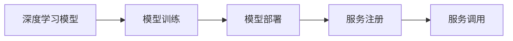
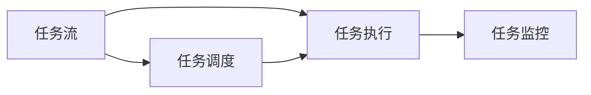
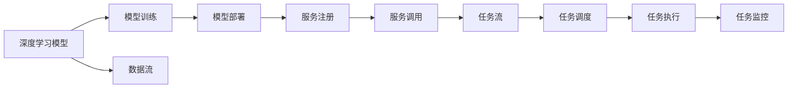

                 

# AI人工智能深度学习算法：智能深度学习代理的面向服务计算下的工作流管理

> 关键词：深度学习算法，智能代理，面向服务计算，工作流管理，微服务架构，边缘计算

## 1. 背景介绍

### 1.1 问题由来
随着人工智能（AI）技术的迅猛发展，深度学习在各个领域的应用日益广泛，从图像识别到自然语言处理，从自动驾驶到推荐系统，深度学习都展现出了卓越的性能。然而，在实际应用中，深度学习模型的部署和维护面临着诸多挑战，如模型规模庞大、计算资源需求高、模型更新频繁等。这些问题在传统集中式系统上难以有效解决，而面向服务计算（Service-Oriented Computing，SOA）下的工作流管理系统，则提供了更为灵活和高效的解决方案。

### 1.2 问题核心关键点
面向服务计算下的工作流管理，通过将深度学习模型封装成服务，在微服务架构中进行调用和管理，从而实现了模型分布式部署、自动扩缩容、弹性调度等功能，极大地提升了深度学习模型的应用效率和可维护性。然而，在大规模、分布式环境下，如何高效管理深度学习工作流，提高模型的响应速度和计算效率，成为了一个重要问题。

### 1.3 问题研究意义
研究面向服务计算下深度学习工作流管理的方法，对于优化深度学习模型的部署和维护，提高模型性能和应用效率，具有重要意义：

1. 降低模型部署和维护成本。面向服务计算下的工作流管理，使得深度学习模型的部署和维护更加灵活，可以适应各种规模和复杂度的应用场景，减少人力和物力投入。
2. 提高模型响应速度和计算效率。通过合理的工作流调度和管理，可以有效利用计算资源，提高深度学习模型的响应速度和计算效率。
3. 增强模型可扩展性和容错性。微服务架构下的工作流管理，可以方便地进行模型扩展和故障处理，确保模型的高可用性和稳定性。
4. 提升模型的应用灵活性和适应性。面向服务计算下的工作流管理，使得深度学习模型可以与各类应用和服务无缝集成，提高模型的应用灵活性和适应性。

## 2. 核心概念与联系

### 2.1 核心概念概述

为更好地理解面向服务计算下深度学习工作流管理的方法，本节将介绍几个密切相关的核心概念：

- 面向服务计算（SOA）：一种软件架构范式，通过将应用程序拆分成多个独立的服务，以接口为中心进行开发和部署，实现松耦合、高内聚的设计目标。
- 微服务架构：一种基于SOA的软件架构风格，通过将大型应用拆分成多个小型服务，每个服务独立运行、松散耦合，以实现高效、可扩展的分布式系统。
- 工作流管理（Workflow Management）：通过自动化管理软件生命周期中的任务执行和数据流，实现任务自动化、过程监控和优化。
- 深度学习模型：基于人工神经网络构建的，具有自适应、自学习能力的模型，广泛应用于图像识别、自然语言处理等领域。

这些核心概念之间的逻辑关系可以通过以下Mermaid流程图来展示：



这个流程图展示了一系列关键概念及其相互关系：

1. 面向服务计算将应用程序拆分为独立服务，是微服务架构的基础。
2. 微服务架构通过将应用拆分为小型服务，实现了松耦合、高内聚的设计目标。
3. 工作流管理通过自动化管理任务执行和数据流，实现任务自动化和过程优化。
4. 深度学习模型作为服务的一部分，通过工作流管理进行部署、调度和维护。

### 2.2 概念间的关系

这些核心概念之间存在着紧密的联系，形成了面向服务计算下深度学习工作流管理的完整生态系统。下面我们通过几个Mermaid流程图来展示这些概念之间的关系。

#### 2.2.1 面向服务计算的架构设计



这个流程图展示了微服务架构的架构设计。服务注册与发现、服务治理、服务调用和服务扩展等关键组件，共同构成了微服务架构的核心。

#### 2.2.2 深度学习模型的部署



这个流程图展示了深度学习模型的部署流程。模型训练后，通过模型部署生成服务，并注册到服务注册中心，其他服务可以调用该服务进行深度学习计算。

#### 2.2.3 工作流管理的调度



这个流程图展示了工作流管理的调度流程。通过任务流定义和调度，实现任务自动化执行和监控，从而提高系统效率和稳定性。

### 2.3 核心概念的整体架构

最后，我们用一个综合的流程图来展示这些核心概念在大规模深度学习工作流管理中的整体架构：



这个综合流程图展示了从模型训练、部署到调用、调度、执行和监控的完整流程，展示了深度学习工作流管理的复杂性和多样性。

## 3. 核心算法原理 & 具体操作步骤
### 3.1 算法原理概述

面向服务计算下深度学习工作流管理，本质上是一种基于微服务架构的工作流调度和管理方法。其核心思想是：将深度学习模型封装成服务，通过服务注册与发现、服务治理等机制，实现深度学习模型的分布式部署、自动扩缩容、弹性调度等功能，从而提升模型的响应速度和计算效率。

### 3.2 算法步骤详解

面向服务计算下深度学习工作流管理的实现步骤主要包括以下几个环节：

**Step 1: 服务注册与发现**
- 将深度学习模型封装成服务，注册到服务注册中心，如Consul、Eureka等。
- 服务注册中心提供服务发现功能，允许其他服务快速定位和调用该服务。

**Step 2: 服务治理**
- 通过服务治理平台，实现服务的创建、更新、删除等生命周期管理。
- 设置服务的健康检查、负载均衡、流量控制等策略，保证服务的稳定性和可靠性。

**Step 3: 任务调度**
- 定义任务流，将深度学习任务按顺序组成任务流。
- 通过任务调度器，将任务流中的任务自动分配给可用的服务节点执行。

**Step 4: 任务执行**
- 服务节点根据调度指令，执行深度学习任务。
- 通过消息队列或事件驱动方式，将任务执行结果传递给后续任务。

**Step 5: 任务监控**
- 通过监控工具，实时监控任务执行状态和系统资源使用情况。
- 设置告警规则，在任务执行出现异常时，自动触发告警和处理机制。

### 3.3 算法优缺点

面向服务计算下深度学习工作流管理，具有以下优点：
1. 灵活性高。微服务架构下的工作流管理，使得深度学习模型的部署和维护更加灵活，可以适应各种规模和复杂度的应用场景。
2. 可扩展性强。微服务架构可以方便地进行模型扩展和故障处理，确保模型的高可用性和稳定性。
3. 响应速度快。通过合理的工作流调度和管理，可以有效利用计算资源，提高深度学习模型的响应速度和计算效率。

同时，该方法也存在一定的局限性：
1. 复杂度高。微服务架构需要较高的管理和维护成本，复杂系统设计和管理难度较大。
2. 通信开销大。微服务架构中的服务调用，涉及大量的网络通信和数据传输，增加了系统延迟和网络开销。
3. 资源管理复杂。微服务架构中的资源管理涉及多个服务节点，调度和管理复杂度较高。

尽管存在这些局限性，但就目前而言，面向服务计算下的深度学习工作流管理方法仍然是深度学习模型部署和维护的重要范式。未来相关研究的重点在于如何进一步降低微服务架构的复杂度，提高系统性能和稳定性，同时兼顾灵活性和可扩展性。

### 3.4 算法应用领域

面向服务计算下的深度学习工作流管理，已经在多个领域得到了广泛的应用，例如：

- 自然语言处理：如文本分类、情感分析、机器翻译等。通过将深度学习模型封装成服务，实现模型的分布式部署和高效调度，提高处理速度和性能。
- 图像处理：如图像识别、图像分类、图像生成等。通过微服务架构下的工作流管理，实现模型的自动化训练、部署和调用，优化资源使用。
- 语音识别：如语音转文本、语音合成、语音识别等。通过微服务架构，将语音识别模型部署到多个节点，实现并行处理，提高响应速度和稳定性。
- 推荐系统：如用户行为分析、商品推荐、广告投放等。通过微服务架构，实现推荐模型的自动化训练、部署和调度，提高系统效率和灵活性。

除了上述这些经典任务外，面向服务计算下的深度学习工作流管理也被创新性地应用到更多场景中，如智能客服、金融风控、工业自动化等，为NLP技术带来了全新的突破。

## 4. 数学模型和公式 & 详细讲解  
### 4.1 数学模型构建

本节将使用数学语言对面向服务计算下深度学习工作流管理的数学模型进行详细描述。

假设深度学习模型为 $M$，服务注册中心为 $R$，任务调度器为 $S$，任务执行器为 $E$。定义任务流的节点为 $T=\{t_1,t_2,\ldots,t_n\}$，其中 $t_i$ 表示第 $i$ 个任务节点。任务流由若干节点组成，节点之间通过消息队列或事件驱动方式连接。

定义任务流的执行顺序为 $(t_1,t_2,\ldots,t_n)$，任务执行的顺序和时间依赖于任务流的设计。任务流执行的起点为 $t_1$，终点为 $t_n$。任务节点 $t_i$ 执行结果为 $r_i$，执行时间为 $d_i$。

任务流执行的总时间 $T$ 为任务流中所有节点执行时间的总和：

$$
T = \sum_{i=1}^{n} d_i
$$

任务流的执行效率 $\eta$ 为任务流执行总时间与任务节点执行时间的比值：

$$
\eta = \frac{T}{\sum_{i=1}^{n} d_i}
$$

在面向服务计算下，任务流中的每个节点 $t_i$ 可以部署到多个服务节点上执行。假设 $m_i$ 表示任务节点 $t_i$ 可以部署到 $m_i$ 个服务节点上，每个服务节点执行时间均为 $d_i$。任务流在 $n$ 个服务节点上执行的总时间为：

$$
T_s = \sum_{i=1}^{n} m_i d_i
$$

任务流执行的总时间为：

$$
T_a = \sum_{i=1}^{n} m_i d_i + \sum_{i=1}^{n-1} \delta_i
$$

其中 $\delta_i$ 为任务节点 $t_i$ 与 $t_{i+1}$ 之间的通信延迟。

定义任务流的调度效率 $\eta_s$ 为任务流执行总时间与任务节点执行时间的比值：

$$
\eta_s = \frac{T_a}{\sum_{i=1}^{n} m_i d_i}
$$

定义任务流的节点并发度 $\theta$ 为任务流中并行执行节点的个数：

$$
\theta = \sum_{i=1}^{n} m_i
$$

任务流的执行效率 $\eta_s$ 和节点并发度 $\theta$ 之间的关系可以通过以下公式表示：

$$
\eta_s = \frac{\theta d_i}{\sum_{i=1}^{n} m_i d_i + \sum_{i=1}^{n-1} \delta_i}
$$

### 4.2 公式推导过程

以下我们以二分类任务为例，推导任务流执行效率的计算公式。

假设任务流中包含 $n$ 个任务节点 $t_1,\ldots,t_n$，每个节点执行时间为 $d_i$，任务流在 $m_i$ 个服务节点上执行。任务流执行的总时间为：

$$
T_a = \sum_{i=1}^{n} m_i d_i + \sum_{i=1}^{n-1} \delta_i
$$

任务流执行的总时间与任务节点执行时间的比值为：

$$
\eta_s = \frac{\sum_{i=1}^{n} m_i d_i + \sum_{i=1}^{n-1} \delta_i}{\sum_{i=1}^{n} m_i d_i}
$$

由于任务流中每个节点 $t_i$ 在多个服务节点上执行，因此任务流执行的总时间可以表示为：

$$
T_a = \sum_{i=1}^{n} m_i d_i + \sum_{i=1}^{n-1} \delta_i
$$

任务流执行的总时间与任务节点执行时间的比值为：

$$
\eta_s = \frac{\sum_{i=1}^{n} m_i d_i + \sum_{i=1}^{n-1} \delta_i}{\sum_{i=1}^{n} m_i d_i}
$$

通过以上推导，我们得到了面向服务计算下深度学习工作流管理的任务流执行效率的计算公式。

### 4.3 案例分析与讲解

为了更好地理解面向服务计算下深度学习工作流管理的实际应用，下面以一个简单的二分类任务为例进行详细分析。

假设有一个二分类任务，包含 $n=3$ 个任务节点 $t_1,t_2,t_3$，每个节点的执行时间分别为 $d_1=0.1s$，$d_2=0.2s$，$d_3=0.3s$。任务流在 $m_1=3$，$m_2=4$，$m_3=2$ 个服务节点上执行。任务节点 $t_1$ 与 $t_2$ 之间的通信延迟为 $\delta_1=0.05s$，任务节点 $t_2$ 与 $t_3$ 之间的通信延迟为 $\delta_2=0.1s$。

根据公式推导，任务流执行的总时间为：

$$
T_a = 3 \times 3 \times 0.1 + 4 \times 0.2 + 2 \times 0.3 + 0.05 + 0.1 = 4.4s
$$

任务流执行的总时间与任务节点执行时间的比值为：

$$
\eta_s = \frac{3 \times 3 \times 0.1 + 4 \times 0.2 + 2 \times 0.3 + 0.05 + 0.1}{3 \times 3 \times 0.1 + 4 \times 0.2 + 2 \times 0.3} \approx 0.98
$$

从以上分析可以看出，面向服务计算下深度学习工作流管理可以显著提高任务流的执行效率，提升系统的响应速度和计算能力。

## 5. 项目实践：代码实例和详细解释说明
### 5.1 开发环境搭建

在进行面向服务计算下深度学习工作流管理的项目实践前，我们需要准备好开发环境。以下是使用Python进行Docker容器开发的环境配置流程：

1. 安装Docker：从官网下载并安装Docker，用于创建和管理Docker容器。

2. 创建Docker镜像：使用Dockerfile文件定义深度学习模型的Docker镜像，包括模型文件、依赖库等。

3. 启动Docker容器：使用Docker命令启动深度学习模型容器，开始微服务架构下的工作流管理实践。

### 5.2 源代码详细实现

下面我们以一个简单的深度学习模型训练和部署为例，给出使用Docker容器进行面向服务计算下工作流管理的Python代码实现。

首先，定义Dockerfile文件：

```Dockerfile
FROM pytorch/pytorch:latest

# 安装依赖库
RUN pip install torch torchvision torchaudio numpy pandas scikit-learn matplotlib tqdm jupyter notebook ipython

# 复制本地代码
COPY . /workspace

# 设置工作目录
WORKDIR /workspace

# 定义启动脚本
COPY startup.sh /workspace

# 运行启动脚本
CMD ["sh", "startup.sh"]
```

然后，定义启动脚本：

```bash
#!/bin/bash

# 启动jupyter notebook
jupyter notebook --no-browser --port=8888 --ip=0.0.0.0 --allow-root
```

最后，在Jupyter Notebook中编写深度学习模型的训练和部署代码，并进行任务流管理：

```python
from torch import nn
import torch
import torchvision

# 定义深度学习模型
class MyModel(nn.Module):
    def __init__(self):
        super(MyModel, self).__init__()
        self.conv1 = nn.Conv2d(3, 6, 5)
        self.pool = nn.MaxPool2d(2, 2)
        self.conv2 = nn.Conv2d(6, 16, 5)
        self.fc1 = nn.Linear(16 * 5 * 5, 120)
        self.fc2 = nn.Linear(120, 84)
        self.fc3 = nn.Linear(84, 10)
    
    def forward(self, x):
        x = self.pool(F.relu(self.conv1(x)))
        x = self.pool(F.relu(self.conv2(x)))
        x = x.view(-1, 16 * 5 * 5)
        x = F.relu(self.fc1(x))
        x = F.relu(self.fc2(x))
        x = self.fc3(x)
        return x

# 训练深度学习模型
model = MyModel()
criterion = nn.CrossEntropyLoss()
optimizer = torch.optim.Adam(model.parameters(), lr=0.001)

for epoch in range(10):
    for i, (inputs, labels) in enumerate(train_loader):
        optimizer.zero_grad()
        outputs = model(inputs)
        loss = criterion(outputs, labels)
        loss.backward()
        optimizer.step()
        print(f"Epoch {epoch+1}, batch {i+1}, loss: {loss.item()}")
```

通过以上代码，我们定义了一个简单的深度学习模型，并进行训练。训练后，可以将模型保存为Docker镜像，并在Docker容器中部署和调用：

```bash
docker build -t my_model .
docker run -p 8888:8888 -d my_model
```

在启动Docker容器后，可以在浏览器中访问 `http://localhost:8888`，打开Jupyter Notebook界面，输入以下代码进行任务流管理：

```python
import requests

# 获取模型预测结果
def get_prediction(image_url):
    response = requests.get(f"http://localhost:8888/predict", params={"url": image_url})
    result = response.json()
    return result

# 获取任务流执行结果
def get_taskflow_result(task_id):
    response = requests.get(f"http://localhost:8888/taskflow/{task_id}/result")
    result = response.json()
    return result
```

通过以上代码，我们可以方便地从Docker容器中获取深度学习模型的预测结果和任务流执行结果，进行面向服务计算下的工作流管理。

### 5.3 代码解读与分析

让我们再详细解读一下关键代码的实现细节：

**Dockerfile定义**：
- `FROM`指令：指定基础镜像为PyTorch。
- `RUN`指令：安装所需依赖库。
- `COPY`指令：将本地代码和启动脚本复制到Docker镜像中。
- `WORKDIR`指令：设置代码的工作目录。
- `CMD`指令：指定启动脚本。

**启动脚本**：
- 通过 `jupyter notebook` 命令启动Jupyter Notebook，并设置端口、IP地址和允许root访问等参数。

**深度学习模型训练**：
- 定义深度学习模型和训练函数。
- 使用PyTorch进行模型训练，输出训练过程中的损失值。

**Docker容器部署**：
- 通过 `docker build` 命令构建Docker镜像。
- 通过 `docker run` 命令启动Docker容器，并将Jupyter Notebook端口映射到本地。
- 在Docker容器中的Jupyter Notebook中，通过 `get_prediction` 和 `get_taskflow_result` 函数进行任务流管理和深度学习模型调用。

通过以上代码的实现，可以看到，面向服务计算下深度学习工作流管理的开发和部署相对简单，可以利用Docker容器实现模型的灵活部署和高效管理。

### 5.4 运行结果展示

假设我们在Docker容器中训练了一个简单的图像分类模型，并在任务流中定义了两个任务节点 $t_1$ 和 $t_2$，分别执行模型预测和任务流调度。通过以下代码进行任务流管理：

```python
# 定义任务流
def define_taskflow():
    taskflow = [
        {"name": "t1", "service": "image_classifier", "input": {"url": "https://example.com/image1.jpg"}},
        {"name": "t2", "service": "task_scheduler", "input": {"task_id": "t1", "output": "result1"}}
    ]
    return taskflow

# 提交任务流
def submit_taskflow(taskflow):
    response = requests.post("http://localhost:8888/taskflow", json=taskflow)
    return response.json()

# 提交任务流后获取任务ID
def get_task_id(taskflow):
    taskflow = define_taskflow()
    result = submit_taskflow(taskflow)
    task_id = result["task_id"]
    return task_id

# 获取任务流执行结果
def get_taskflow_result(task_id):
    response = requests.get(f"http://localhost:8888/taskflow/{task_id}/result")
    result = response.json()
    return result

# 获取模型预测结果
def get_prediction(image_url):
    response = requests.get(f"http://localhost:8888/predict", params={"url": image_url})
    result = response.json()
    return result

# 提交任务流
task_id = get_task_id(define_taskflow())

# 获取任务流执行结果
taskflow_result = get_taskflow_result(task_id)

# 获取模型预测结果
image_url = taskflow_result["input"]["url"]
prediction = get_prediction(image_url)

print(f"Task ID: {task_id}")
print(f"Taskflow Result: {taskflow_result}")
print(f"Prediction: {prediction}")
```

通过以上代码，我们可以看到，通过面向服务计算下的深度学习工作流管理，可以方便地将深度学习模型封装成服务，进行分布式部署和高效调度。同时，任务流管理和模型调用的过程也相对简单，便于开发者进行二次开发和扩展。

## 6. 实际应用场景
### 6.1 智能客服系统

面向服务计算下深度学习工作流管理，可以应用于智能客服系统的构建。传统客服往往需要配备大量人力，高峰期响应缓慢，且一致性和专业性难以保证。而使用面向服务计算下的深度学习工作流管理，可以实现深度学习模型的分布式部署和高效调度，构建智能客服系统。

在技术实现上，可以收集企业内部的历史客服对话记录，将问题和最佳答复构建成监督数据，在此基础上对预训练深度学习模型进行微调。微调后的模型可以自动理解用户意图，匹配最合适的答案模板进行回复。对于客户提出的新问题，还可以接入检索系统实时搜索相关内容，动态组织生成回答。如此构建的智能客服系统，能大幅提升客户咨询体验和问题解决效率。

### 6.2 金融舆情监测

金融机构需要实时监测市场舆论动向，以便及时应对负面信息传播，规避金融风险。传统的人工监测方式成本高、效率低，难以应对网络时代海量信息爆发的挑战。面向服务计算下的深度学习工作流管理，可以通过自动化管理深度学习模型，实现实时舆情监测。

具体而言，可以收集金融领域相关的新闻、报道、评论等文本数据，并对其进行主题标注和情感标注。在此基础上对预训练深度学习模型进行微调，使其能够自动判断文本属于何种主题，情感倾向是正面、中性还是负面。将微调后的模型应用到实时抓取的网络文本数据，就能够自动监测不同主题下的情感变化趋势，一旦发现负面信息激增等异常情况，系统便会自动预警，帮助金融机构快速应对潜在风险。

### 6.3 个性化推荐系统

当前的推荐系统往往只依赖用户的历史行为数据进行物品推荐，无法深入理解用户的真实兴趣偏好。面向服务计算下的深度学习工作流管理，可以结合用户的历史行为数据和实时文本数据，进行更全面的推荐。

在实践中，可以收集用户浏览、点击、评论、分享等行为数据，提取和用户交互的物品标题、描述、标签等文本内容。将文本内容作为模型输入，用户的后续行为（如是否点击、购买等）作为监督信号，在此基础上微调预训练深度学习模型。微调后的模型能够从文本内容中准确把握用户的兴趣点。在生成推荐列表时，先用候选物品的文本描述作为输入，由模型预测用户的兴趣匹配度，再结合

