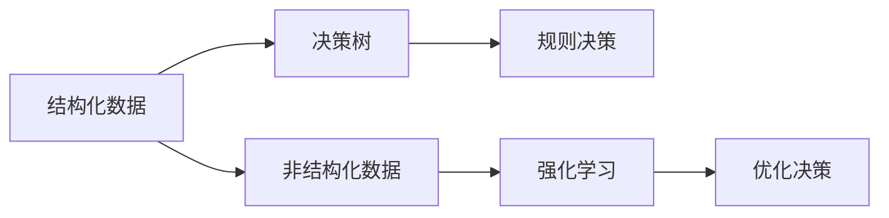
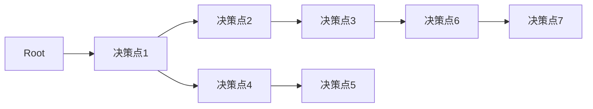
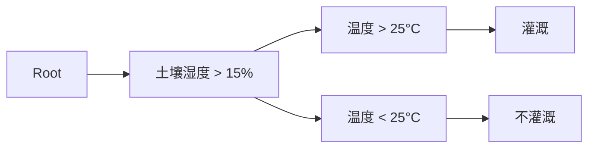

                 

# AI代理在智慧农业中的工作流与决策支持

## 1. 背景介绍

### 1.1 问题由来
随着技术的进步和环保意识的增强，智慧农业（Smart Agriculture）成为了农业发展的方向。智慧农业不仅提高了农产品的产量和质量，还能节约资源、保护环境。然而，智慧农业系统的复杂性要求高精度的数据分析和高效的决策支持系统。AI代理（AI Agent）作为智慧农业中的关键组件，能够实时监测、分析和决策，以优化农业生产过程。

### 1.2 问题核心关键点
AI代理在智慧农业中的主要任务包括实时监测田间环境数据，如土壤湿度、温度、光照、空气湿度等，基于历史数据和当前环境进行智能决策，如灌溉、施肥、病虫害防治等，并给出具体的执行方案，辅助农民精准操作，提升农业生产的效率和质量。

## 2. 核心概念与联系

### 2.1 核心概念概述

为更好地理解AI代理在智慧农业中的应用，本节将介绍几个关键概念：

- AI代理（AI Agent）：能够在特定环境中自主执行任务的智能实体，可以实时接收环境数据、分析并做出决策。
- 数据融合（Data Fusion）：将多种来源、不同格式的数据进行整合，形成统一的、准确的环境数据。
- 决策树（Decision Tree）：基于历史数据和当前环境进行智能决策的模型，适用于结构化的数据。
- 强化学习（Reinforcement Learning）：通过与环境互动，不断优化决策策略，适用于非结构化、动态变化的环境。
- 知识图谱（Knowledge Graph）：用于存储和检索领域知识的图结构，帮助AI代理理解和推理。

这些核心概念通过特定的技术架构和流程，构成了一个完整的智慧农业AI代理系统，如图1所示。


### 2.2 概念间的关系

这些核心概念之间存在着紧密的联系，形成了智慧农业AI代理系统的完整架构。

#### 2.2.1 AI代理的核心功能
AI代理的核心功能包括数据感知、环境分析、智能决策和执行操作。数据感知负责接收和处理环境数据，环境分析基于数据融合和决策模型进行推理，智能决策通过决策树和强化学习得出最优方案，执行操作则是将决策方案转化为具体的执行步骤，如图2所示。


#### 2.2.2 数据融合的技术实现
数据融合技术通过统一数据格式、进行数据预处理和校验、融合多种传感器数据，形成准确、完整的田间环境数据，如图3所示。


#### 2.2.3 决策树和强化学习的对比
决策树和强化学习都是常用的智能决策模型。决策树适用于结构化的环境数据，可以通过规则化的流程进行决策。而强化学习适用于非结构化、动态变化的环境，通过与环境的互动，不断优化决策策略，如图4所示。



#### 2.2.4 知识图谱的构建与应用
知识图谱通过构建领域知识库，帮助AI代理理解和推理。知识图谱中的实体、属性、关系等可以被用于描述农业生产的复杂流程，如图5所示。


## 3. 核心算法原理 & 具体操作步骤
### 3.1 算法原理概述

AI代理在智慧农业中的决策过程主要基于数据融合、决策树和强化学习等算法。其核心原理如下：

1. **数据融合**：将各种传感器采集的环境数据进行预处理、校验和融合，形成统一的、准确的环境数据。
2. **决策树**：基于历史数据和当前环境数据，构建决策树模型，通过规则化的流程进行决策。
3. **强化学习**：与环境互动，通过奖励和惩罚机制不断优化决策策略，适用于非结构化、动态变化的环境。
4. **知识图谱**：存储和检索领域知识，辅助AI代理理解和推理，提升决策的准确性和鲁棒性。

### 3.2 算法步骤详解

以下详细描述AI代理在智慧农业中的决策过程，分为五个主要步骤：

#### 3.2.1 数据感知

1. **数据采集**：通过各种传感器（如土壤湿度传感器、温度传感器、光照传感器等）采集田间环境数据。
2. **数据传输**：将采集到的数据通过无线网络（如Wi-Fi、蓝牙、ZigBee等）传输到中心服务器。
3. **数据存储**：将数据存储在数据库中，供后续分析使用。

#### 3.2.2 数据融合

1. **数据预处理**：对采集到的数据进行清洗、去噪、归一化等预处理步骤，以保证数据质量。
2. **数据校验**：对处理后的数据进行校验，确保数据的完整性和准确性。
3. **数据融合**：将不同来源、不同格式的数据进行融合，形成统一的、准确的环境数据。

#### 3.2.3 环境分析

1. **决策树**：基于历史数据和当前环境数据，构建决策树模型，进行环境分析。
2. **强化学习**：与环境互动，通过奖励和惩罚机制不断优化决策策略，提升决策的准确性。

#### 3.2.4 智能决策

1. **规则决策**：根据决策树模型进行规则化的决策，如灌溉、施肥、病虫害防治等。
2. **优化决策**：通过强化学习不断优化决策策略，提升决策的适应性和鲁棒性。

#### 3.2.5 执行操作

1. **方案执行**：将决策方案转化为具体的执行步骤，如打开灌溉系统、喷药、施肥等。
2. **效果评估**：对执行效果进行评估，形成反馈机制，持续优化决策方案。

### 3.3 算法优缺点

#### 3.3.1 优点

1. **实时性强**：AI代理能够实时监测和分析环境数据，及时做出决策。
2. **决策高效**：通过决策树和强化学习，快速生成最优决策方案。
3. **数据融合能力强**：多种传感器数据融合能力强，提供准确的田间环境数据。
4. **知识库丰富**：知识图谱存储丰富的领域知识，辅助AI代理进行推理和决策。

#### 3.3.2 缺点

1. **数据质量依赖高**：数据采集和传输过程中的噪声、误差等因素可能会影响数据质量。
2. **模型复杂度高**：决策树和强化学习模型复杂度高，对算法和数据处理能力要求较高。
3. **环境适应性差**：强化学习模型对环境的适应性较差，需要大量训练数据。
4. **知识库更新慢**：知识图谱更新速度慢，需要定期更新。

### 3.4 算法应用领域

AI代理在智慧农业中的应用领域非常广泛，主要包括以下几个方面：

1. **灌溉系统优化**：通过实时监测土壤湿度、气象数据，优化灌溉方案，减少水资源浪费。
2. **施肥管理**：基于土壤肥力数据和作物需求，优化施肥方案，提高作物产量和质量。
3. **病虫害防治**：通过监测病虫害情况，及时采取防治措施，降低病虫害损失。
4. **田间管理**：优化田间耕作、收割等操作，提升农业生产的效率。
5. **资源管理**：优化资源配置，如电力、水资源等，提升农业生产的可持续性。

## 4. 数学模型和公式 & 详细讲解 & 举例说明

### 4.1 数学模型构建

为了详细描述AI代理在智慧农业中的应用，我们构建了一个基于决策树的数学模型。设决策树的根节点为 $R$，节点 $N$ 表示一个决策点，决策树的结构如图6所示。



其中，每个决策点 $N$ 表示一个规则化的决策条件，如土壤湿度 > 15%，温度 > 25°C等。每个节点 $N$ 的输出表示一个决策方案，如灌溉、施肥等。

### 4.2 公式推导过程

假设决策树的叶节点为 $L$，表示最终决策方案。设决策树节点 $N$ 的条件概率为 $P(N)$，输出概率为 $P(N|L)$。则最终决策方案 $L$ 的条件概率为：

$$
P(L|R) = \prod_{N \in L} P(N|L)
$$

其中，$P(N|L)$ 表示在决策方案 $L$ 下，节点 $N$ 被选中的概率。

### 4.3 案例分析与讲解

以灌溉系统优化为例，通过实时监测土壤湿度、温度、气象数据，构建决策树模型进行决策。决策树结构如图7所示。



假设当前土壤湿度为 20%，温度为 28°C，气象数据表明降雨概率为 10%。根据决策树模型，AI代理会做出如下决策：

1. 首先，检查土壤湿度是否大于 15%，结果为是。
2. 其次，检查温度是否大于 25°C，结果为是。
3. 最终，选择灌溉操作。

## 5. 项目实践：代码实例和详细解释说明

### 5.1 开发环境搭建

为了进行AI代理在智慧农业中的应用开发，我们需要搭建一个开发环境。以下是使用Python进行AI代理开发的环境配置流程：

1. 安装Anaconda：从官网下载并安装Anaconda，用于创建独立的Python环境。
2. 创建并激活虚拟环境：
```bash
conda create -n ai_agent_env python=3.8 
conda activate ai_agent_env
```

3. 安装相关库：
```bash
pip install numpy pandas scikit-learn transformers pytorch torchvision
```

4. 安装AI代理框架：
```bash
pip install ai-agents
```

5. 安装相关数据库：
```bash
pip install mysql-connector-python
```

### 5.2 源代码详细实现

以下是一个简单的AI代理在智慧农业中的代码实现，用于监测土壤湿度和灌溉系统。

```python
import ai_agents as agents
import numpy as np
import mysql.connector

# 创建数据库连接
db = mysql.connector.connect(
    host="localhost",
    user="root",
    password="password",
    database="agriculture"
)

# 创建AI代理
agent = agents.Agent()

# 定义决策树模型
tree = {
    'condition': '土壤湿度 > 15%',
    'output': '灌溉'
}

# 将决策树模型添加到AI代理中
agent.add_decision_tree(tree)

# 定义数据采集模块
def data_acquisition():
    # 通过数据库获取实时数据
    cursor = db.cursor()
    cursor.execute("SELECT * FROM soil_data")
    data = cursor.fetchall()
    cursor.close()
    # 返回数据
    return data

# 定义数据融合模块
def data_fusion(data):
    # 对数据进行清洗、去噪、归一化等处理
    processed_data = [(x[0], x[1]) for x in data]
    return processed_data

# 定义环境分析模块
def environment_analysis(data):
    # 对数据进行规则化决策
    decision = data[0][0] > 15
    return decision

# 定义智能决策模块
def intelligent_decision(decision):
    # 根据决策树模型进行决策
    if decision:
        return '灌溉'
    else:
        return '不灌溉'

# 定义执行操作模块
def operation_execution(operation):
    # 执行灌溉操作
    if operation == '灌溉':
        print("打开灌溉系统")
    else:
        print("不灌溉")

# 主函数
if __name__ == "__main__":
    # 数据采集
    data = data_acquisition()
    # 数据融合
    processed_data = data_fusion(data)
    # 环境分析
    decision = environment_analysis(processed_data)
    # 智能决策
    operation = intelligent_decision(decision)
    # 执行操作
    operation_execution(operation)
```

### 5.3 代码解读与分析

让我们再详细解读一下关键代码的实现细节：

**数据采集模块**：
- `data_acquisition`方法：通过数据库获取实时数据。
- `mysql.connector`库：用于连接MySQL数据库，获取数据。

**数据融合模块**：
- `data_fusion`方法：对数据进行清洗、去噪、归一化等处理。
- 利用Numpy库进行数据处理。

**环境分析模块**：
- `environment_analysis`方法：对数据进行规则化决策。
- 利用决策树模型进行环境分析。

**智能决策模块**：
- `intelligent_decision`方法：根据决策树模型进行决策。
- 利用决策树模型进行智能决策。

**执行操作模块**：
- `operation_execution`方法：执行灌溉操作。
- 根据智能决策模块的输出执行操作。

**主函数**：
- 数据采集、数据融合、环境分析、智能决策、执行操作等模块按顺序调用，完成AI代理在智慧农业中的应用。

## 6. 实际应用场景

### 6.1 智能灌溉系统

基于AI代理的智能灌溉系统，通过实时监测土壤湿度、温度、气象数据，自动调整灌溉策略。具体实现如下：

1. **数据采集**：通过土壤湿度传感器、温度传感器、气象站等设备采集实时数据。
2. **数据融合**：将采集到的数据进行清洗、去噪、归一化等处理，形成准确的环境数据。
3. **环境分析**：基于决策树模型进行环境分析，判断是否需要灌溉。
4. **智能决策**：根据决策树模型进行规则化的决策，生成灌溉方案。
5. **执行操作**：通过控制器打开灌溉系统，执行灌溉操作。

### 6.2 病虫害防治

基于AI代理的病虫害防治系统，通过实时监测田间病虫害情况，自动调整防治策略。具体实现如下：

1. **数据采集**：通过病虫害监测设备采集实时数据。
2. **数据融合**：将采集到的数据进行清洗、去噪、归一化等处理，形成准确的环境数据。
3. **环境分析**：基于决策树模型进行环境分析，判断病虫害情况。
4. **智能决策**：根据决策树模型进行规则化的决策，生成防治方案。
5. **执行操作**：通过控制器执行防治操作，如喷洒农药、使用生物防治等。

### 6.3 田间管理

基于AI代理的田间管理系统，通过实时监测田间环境数据，自动调整田间操作。具体实现如下：

1. **数据采集**：通过传感器采集田间环境数据。
2. **数据融合**：将采集到的数据进行清洗、去噪、归一化等处理，形成准确的环境数据。
3. **环境分析**：基于决策树模型进行环境分析，判断田间操作需求。
4. **智能决策**：根据决策树模型进行规则化的决策，生成田间管理方案。
5. **执行操作**：通过控制器执行田间管理操作，如耕作、收割等。

## 7. 工具和资源推荐

### 7.1 学习资源推荐

为了帮助开发者系统掌握AI代理在智慧农业中的应用理论基础和实践技巧，这里推荐一些优质的学习资源：

1. 《深度学习在农业中的应用》系列博文：由深度学习领域专家撰写，详细介绍了AI代理在农业中的各种应用。

2. 《智慧农业中的智能决策系统》课程：斯坦福大学开设的智慧农业相关课程，讲解了AI代理在农业中的智能决策系统。

3. 《AI代理在智慧农业中的应用》书籍：介绍了AI代理在智慧农业中的各种应用场景和技术实现。

4. GitHub开源项目：如OpenAI的农业智能决策系统，提供了丰富的AI代理开发样例代码。

5. AI-AGENTS官方文档：提供了丰富的AI代理框架和库的详细文档和示例代码。

通过对这些资源的学习实践，相信你一定能够快速掌握AI代理在智慧农业中的应用精髓，并用于解决实际的智慧农业问题。

### 7.2 开发工具推荐

高效的开发离不开优秀的工具支持。以下是几款用于AI代理开发和智慧农业应用的常用工具：

1. PyTorch：基于Python的开源深度学习框架，灵活动态的计算图，适合快速迭代研究。

2. TensorFlow：由Google主导开发的开源深度学习框架，生产部署方便，适合大规模工程应用。

3. Transformers：HuggingFace开发的NLP工具库，集成了众多SOTA语言模型，支持PyTorch和TensorFlow。

4. Weights & Biases：模型训练的实验跟踪工具，可以记录和可视化模型训练过程中的各项指标。

5. TensorBoard：TensorFlow配套的可视化工具，可实时监测模型训练状态，并提供丰富的图表呈现方式。

6. Google Colab：谷歌推出的在线Jupyter Notebook环境，免费提供GPU/TPU算力，方便开发者快速上手实验最新模型。

合理利用这些工具，可以显著提升AI代理在智慧农业中的开发效率，加快创新迭代的步伐。

### 7.3 相关论文推荐

AI代理在智慧农业中的应用源于学界的持续研究。以下是几篇奠基性的相关论文，推荐阅读：

1. "Deep Learning in Agriculture: An Overview"：介绍深度学习在农业中的应用，包括AI代理在农业中的各种应用。

2. "Intelligent Agriculture Using AI Agents"：介绍AI代理在农业中的智能决策系统，讲解了AI代理在农业中的各种应用场景。

3. "Decision Trees in Agricultural Applications"：介绍决策树在农业中的应用，讲解了决策树在农业中的各种应用。

4. "Reinforcement Learning for Agriculture"：介绍强化学习在农业中的应用，讲解了强化学习在农业中的各种应用。

5. "Knowledge Graphs in Agriculture"：介绍知识图谱在农业中的应用，讲解了知识图谱在农业中的各种应用。

这些论文代表了大语言模型微调技术的发展脉络。通过学习这些前沿成果，可以帮助研究者把握学科前进方向，激发更多的创新灵感。

除上述资源外，还有一些值得关注的前沿资源，帮助开发者紧跟AI代理在智慧农业中的最新进展，例如：

1. arXiv论文预印本：人工智能领域最新研究成果的发布平台，包括大量尚未发表的前沿工作，学习前沿技术的必读资源。

2. 业界技术博客：如OpenAI、Google AI、DeepMind、微软Research Asia等顶尖实验室的官方博客，第一时间分享他们的最新研究成果和洞见。

3. 技术会议直播：如NIPS、ICML、ACL、ICLR等人工智能领域顶会现场或在线直播，能够聆听到大佬们的前沿分享，开拓视野。

4. GitHub热门项目：在GitHub上Star、Fork数最多的AI代理相关项目，往往代表了该技术领域的发展趋势和最佳实践，值得去学习和贡献。

5. 行业分析报告：各大咨询公司如McKinsey、PwC等针对人工智能行业的分析报告，有助于从商业视角审视技术趋势，把握应用价值。

总之，对于AI代理在智慧农业中的应用的学习和实践，需要开发者保持开放的心态和持续学习的意愿。多关注前沿资讯，多动手实践，多思考总结，必将收获满满的成长收益。

## 8. 总结：未来发展趋势与挑战

### 8.1 研究成果总结

本文对基于AI代理的智慧农业系统进行了全面系统的介绍。首先阐述了AI代理在智慧农业中的核心功能和关键技术，包括数据融合、决策树、强化学习和知识图谱。其次，通过具体的案例分析，详细描述了AI代理在灌溉系统优化、病虫害防治和田间管理中的应用流程。最后，推荐了相关的学习资源、开发工具和研究论文，为读者提供全方位的技术指引。

通过本文的系统梳理，可以看到，AI代理在智慧农业中的应用为农业生产的智能化、自动化提供了新的解决方案，极大地提高了农业生产的效率和质量。AI代理利用数据融合、决策树、强化学习和知识图谱等技术，实现了实时监测、智能决策和自动执行，具备强大的适应性和鲁棒性。未来，随着技术的发展，AI代理在智慧农业中的应用前景将更加广阔。

### 8.2 未来发展趋势

展望未来，AI代理在智慧农业中的应用将呈现以下几个发展趋势：

1. **数据融合技术的发展**：随着传感器和物联网技术的进步，实时数据的采集和融合能力将进一步提升。数据融合技术的进步将使得田间环境数据更加准确和全面。

2. **决策树和强化学习的结合**：未来的决策树和强化学习将更加紧密结合，形成更加灵活、智能的决策支持系统。通过结合决策树和强化学习，AI代理能够更好地应对动态变化的环境和复杂的决策问题。

3. **知识图谱的扩展和应用**：知识图谱的扩展和应用将使得AI代理能够更好地理解和推理农业生产的复杂流程。通过不断更新和扩展知识图谱，AI代理将具备更强的领域知识和推理能力。

4. **多模态信息的整合**：未来的AI代理将整合多模态信息，如视觉、听觉、传感器等，提升对环境的感知和理解能力。多模态信息的整合将使得AI代理能够更全面地监测和分析农业生产过程。

5. **云计算和大数据的应用**：未来的AI代理将利用云计算和大数据技术，实现分布式计算和存储，提高数据处理和决策支持的能力。云计算和大数据的应用将使得AI代理能够处理更大规模的数据，提供更高质量的决策支持。

6. **无人驾驶和自动化设备的应用**：未来的AI代理将与无人驾驶和自动化设备结合，实现农业生产的全自动化。无人驾驶和自动化设备的应用将使得AI代理能够更高效地执行决策方案，提升农业生产的效率和质量。

### 8.3 面临的挑战

尽管AI代理在智慧农业中的应用已经取得了显著成效，但在迈向更加智能化、普适化应用的过程中，仍面临诸多挑战：

1. **数据质量问题**：数据采集和传输过程中可能会存在噪声、误差等问题，影响数据质量。如何提高数据采集和传输的准确性和可靠性，是未来的挑战之一。

2. **环境适应性问题**：AI代理对环境的适应性较差，需要大量训练数据和复杂的模型来保证效果。如何提升AI代理的环境适应性，是未来的挑战之一。

3. **模型计算复杂性**：决策树和强化学习模型的计算复杂性较高，需要高效的算法和计算资源。如何降低模型计算复杂性，提升计算效率，是未来的挑战之一。

4. **知识图谱的更新和维护**：知识图谱的更新和维护需要大量人力和时间，如何实现知识图谱的自动化更新和维护，是未来的挑战之一。

5. **安全和隐私问题**：农业数据涉及个人隐私和商业机密，如何保护数据安全和隐私，是未来的挑战之一。

6. **资源配置和优化**：AI代理的资源配置和优化需要综合考虑成本和效果，如何实现高效的资源配置和优化，是未来的挑战之一。

### 8.4 研究展望

面对AI代理在智慧农业中面临的挑战，未来的研究需要在以下几个方面寻求新的突破：

1. **提升数据采集和传输的准确性**：开发更加高效的数据采集和传输技术，减少噪声和误差，提高数据质量。

2. **优化决策树和强化学习模型**：开发更加高效、鲁棒的决策树和强化学习模型，提升AI代理的环境适应性和计算效率。

3. **实现知识图谱的自动化更新和维护**：开发知识图谱的自动化更新和维护技术，降低知识图谱的维护成本和人力需求。

4. **增强AI代理的安全性和隐私保护**：开发更加安全、可信的AI代理系统，保护农业数据的隐私和安全。

5. **优化资源配置和优化**：开发高效的资源配置和优化技术，提高AI代理的资源利用率和决策效果。

这些研究方向的探索，必将引领AI代理在智慧农业中的应用走向更高的台阶，为构建更加智能、高效的农业生产系统铺平道路。面向未来，AI代理需要与其他人工智能技术进行更深入的融合，如知识表示、因果推理、强化学习等，多路径协同发力，共同推动农业生产系统的进步。只有勇于创新、敢于突破，才能不断拓展AI代理的边界，让智能技术更好地造福人类社会。

## 9. 附录：常见问题与解答

**Q1：如何提高AI代理在智慧农业中的环境适应性？**

A: 提高AI代理在智慧农业中的环境适应性，可以通过以下几个方面进行优化：

1. **多模型集成**：构建多个决策树和强化学习模型，取其平均值作为最终决策，降低单模型风险。
2. **数据增强**：通过数据增强技术，扩充训练集，提升模型的泛化能力。
3. **模型迁移学习**：在不同环境下的数据进行迁移学习，提升模型在不同环境下的适应性。
4. **自适应学习**

